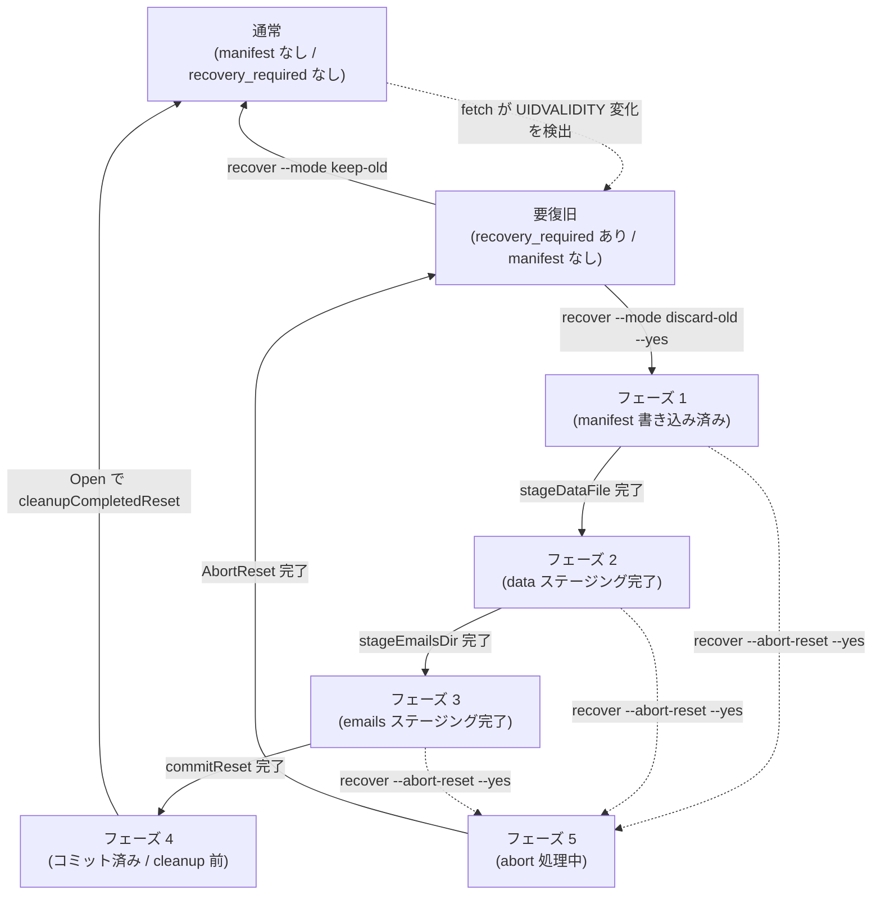

# ADR-0003: ResetForRecovery のフェーズ設計とコミット後クリーンアップの扱い

| 項目 | 内容 |
|---|---|
| 番号 | ADR-0003 |
| ステータス | 採択 |
| 決定日 | 2026-05-25 |
| 関連タスク | 0070_entrypoint |

---

## 1. コンテキスト

### UIDVALIDITY 変化と手動復旧

IMAP サーバーが UIDVALIDITY を変更すると、既存の UID と新しい UID の対応が保証されなくなる。本システムはこの変化を検出した時点で `recovery_required` をセンチネルに記録し、以後の fetch/summary を停止する。オペレーターは `recover` サブコマンドで以下のいずれかを選択する。

- **keep-old** (`ApplyRecovery`): 旧データを保持したまま新 UIDVALIDITY に移行する。
- **discard-old** (`ResetForRecovery`): 旧データをすべて破棄し、空ストアで再スタートする。

`ResetForRecovery` は複数のファイル操作を伴うため、途中でクラッシュした場合でも安全に再開または取り消しができる必要がある。

### 要件（02_architecture.md より）

| 要件 | 内容 |
|---|---|
| AC-crash-safe | `ResetForRecovery` はいずれの段階でクラッシュしても「旧データ保持 + recovery_required 残存」または「空ストア + 新 UIDVALIDITY + recovery_required 解消」のどちらかに収束する |
| AC-abort | `AbortReset` はコミット前の pending reset を取り消し、旧データを保持した状態に戻せる |
| AC-fail-closed | コミット前の pending reset がある場合、通常の `Open(OpenReadWrite)` は fail-closed する |
| AC-cleanup | コミット後の cleanup 失敗は通常データパスへ影響させず、後続の `Open` または `ResetForRecovery` で再 cleanup 可能にする |

---

## 2. フェーズ設計の概要

`ResetForRecovery` はファイル操作の進捗を `resetPhase`（整数値）としてリセットマニフェスト（`.tlsrpt-digest-reset-manifest.json`）に記録する。マニフェストはリセット操作の進捗台帳であり、センチネルファイル（`.tlsrpt-digest-meta.json`）はユーザー可視の確定状態（UIDValidity・recovery_required の現在値）を保持する。

```
マニフェスト（進捗台帳）
  ↓  記録
resetPhase（整数） ─── フェーズに応じてコードが再開・中断を判断

センチネル（確定状態）
  ↓  記録
UIDValidity / recovery_required ─── 操作の「コミット済みか否か」の真の根拠
```

---

## 3. フェーズ一覧と役割

| 定数名 | 値 | 記録タイミング | 意味・役割 |
|---|---|---|---|
| `resetPhaseManifestWritten` | 1 | ステージング開始前（先書き） | **WAL エントリ**。この時点からマニフェストが存在するため `Open(OpenReadWrite)` は `ErrPendingReset` を返す。`AbortReset` によるロールバックが可能になる |
| `resetPhaseDataStaged` | 2 | `tlsrpt.json` のステージング完了後（チェックポイント） | データファイルのリネームが完了したことを記録する。クラッシュ後の再開でこのフェーズから再実行しても `stageDataFile` は冪等（ファイル不在は no-op） |
| `resetPhaseEmailsStaged` | 3 | `emails/` のステージング完了後（チェックポイント） | メールディレクトリのリネームが完了したことを記録する。同様に冪等 |
| `resetPhaseCommitted` | 4 | センチネル保存直後（コミットマーカー） | センチネルへの書き込み（recovery_required クリア・新 UIDVALIDITY 設定）が完了したことを記録する。この後はマニフェストとステージングディレクトリのみが残存するため、クリーンアップ失敗は通常データパスに影響しない |
| `resetPhaseAborting` | 5 | `restoreFromStaging` 実行前（中断 WAL エントリ） | **中断操作の WAL エントリ**。`AbortReset` がファイルを元の場所に戻す前にこのフェーズを書く。以降のクラッシュでマニフェストが残存しても、`ResetForRecovery` はこのフェーズを見て操作を拒否し、`AbortReset` の再実行を促す |

### 状態遷移図



凡例：実線 = 正常系の遷移、破線 = 例外イベント（UIDVALIDITY 変化）または手動中断（abort）

**クラッシュリカバリ**：各フェーズでのクラッシュ後は同じフェーズから再開可能（各ステージング操作は冪等）。

**コミットウィンドウクラッシュ**：`commitReset` はセンチネルを保存してから manifest をフェーズ 4 に進める。その間でクラッシュすると manifest はフェーズ 3 のまま残るが、`cleanupCompletedReset` はフェーズ番号ではなくセンチネルの `recovery_required` で判断するため、フェーズ 4 と同じく cleanup が実行されて Normal に収束する（§4 参照）。

### ユーザー操作時の挙動

| 状態 | `recover --mode keep-old` | `recover --mode discard-old`（`--yes` なし） | `recover --mode discard-old --yes` | `recover --abort-reset --yes` |
|---|---|---|---|---|
| マニフェストなし・`recovery_required` あり | `ApplyRecovery` を実行し、旧データを保持したまま UIDVALIDITY を更新して `recovery_required` を解除する | 実行予定を表示するだけで、破壊的変更を行わず exit 1 | fresh start として `ResetForRecovery` を開始する | pending reset がないため `ErrResetNotPending` |
| フェーズ 1〜3（コミット前 pending reset） | `Open(OpenReadWrite)` が `ErrPendingReset` を返すため実行不可。継続または abort の選択肢を表示する | pending reset の存在と、継続または abort の選択肢を表示する。破壊的変更なし | 該当フェーズから `ResetForRecovery` を再開し、空ストア + current UIDVALIDITY + `recovery_required` 解消へ収束する | `AbortReset` を実行し、旧データ保持 + `recovery_required` 残存へ戻す |
| フェーズ 4 または `recovery_required` なし（コミット済み） | 通常 open 時に leftover manifest/staging をクリーンアップする。その後は recovery-required 不在として復旧不要扱い | 同左 | クリーンアップして終了する。実質的に冪等 | コミット後のため `ErrResetNotPending` |
| フェーズ 5（abort 中断） | `Open(OpenReadWrite)` が `ErrPendingReset` を返すため実行不可。abort 完了を促す | pending reset の存在と、abort 完了が必要であることを表示する。破壊的変更なし | `ErrResetAbortInProgress` を返し、先に `AbortReset` の完了を要求する | `AbortReset` を再開し、`restoreFromStaging` を冪等に実行してマニフェストを削除する |
| 不明フェーズ・バージョン不一致・マニフェスト破損 | fail-closed。手動確認が必要 | fail-closed。手動確認が必要 | fail-closed。手動確認が必要 | fail-closed。手動確認が必要 |

---

## 4. 各フェーズの詳細設計根拠

### フェーズ 1（WAL エントリ）をステージング前に書く理由

マニフェストの書き込みは `Open(OpenReadWrite)` に対する「操作中フラグ」を兼ねる。このフラグを最初に書くことで：

- `Open(OpenReadWrite)` が常に fail-closed できる（AC-fail-closed）
- `AbortReset` がどのフェーズからでもロールバックできる

フラグを書く前にクラッシュした場合はマニフェストが存在しないため、次回実行は "fresh start" として扱われ、センチネルの recovery_required を確認して正常に再開する。

### フェーズ 2・3（チェックポイント）をリネーム後に書く理由

`rename(2)` は POSIX の保証する原子操作であるため、成功した場合のみファイルが移動している。チェックポイントをリネームの後に書くことで、「チェックポイントが書かれている = リネームは確実に完了している」という推論が成立する。クラッシュして再開した場合：

```
[フェーズ N のチェックポイントがない]
  → 「フェーズ N の操作は完了済みかもしれないし、未実行かもしれない」
  → 冪等な操作を再実行する（ファイルが不在なら no-op）
```

逆にリネームの前に書いた場合、クラッシュするとチェックポイントは書かれたがリネームは未完了という状態になり、再開時に「完了済み」と誤判断するリスクがある。本設計では操作後チェックポイントパターンを選んだ。

> **注意**: この設計は AC-crash-safe を担保するが、「フェーズ N の書き込みが完了した = フェーズ N の操作は完了した」という不変条件を前提にしている。各ステージング関数（`stageDataFile`・`stageEmailsDir`）の冪等性はこの不変条件を維持するために必須である。

### センチネルがコミットの真の根拠である理由

フェーズ 4（`resetPhaseCommitted`）のマーカーは `commitReset` がセンチネルを保存した**後**に書く。つまり「センチネルに recovery_required がない」は「コミットが完了している」と等価であり、「マニフェストがフェーズ 4 である」よりも信頼性が高い（フェーズ 4 への更新が完了する前にクラッシュする可能性があるため）。

この性質を利用して以下の判断を行う。

| 判断箇所 | 使用する根拠 | 理由 |
|---|---|---|
| `AbortReset` のロールバック可否 | `sentinel.recovery_required != nil` | 「コミット後の abort」を防ぐ |
| `Open(OpenReadWrite)` のクリーンアップ可否 | `sentinel.recovery_required == nil` | 「コミット後の cleanup 失敗」を検出してデータパスをブロックしない |

### フェーズ 5（中断 WAL エントリ）を設ける理由

`AbortReset` がファイルを元の場所に戻す（`restoreFromStaging`）操作は途中でクラッシュしうる。クラッシュ後の状態は「マニフェストはフェーズ 3 のまま、ファイルは root に復元済み」になる可能性がある。この状態で `ResetForRecovery` を実行するとフェーズ 3 として扱われ、空のステージングへのコミットが行われてしまう（「新 UIDVALIDITY + recovery_required クリア + 旧データが root に残存」という矛盾状態）。

この問題を回避するため、`AbortReset` はファイルを動かす前に必ずフェーズ 5（aborting）に更新する。`ResetForRecovery` はフェーズ 5 を見た場合に `ErrResetAbortInProgress` を返し、`AbortReset` の完了を要求する。

```
[フェーズ 5 検出時の動作]
  ResetForRecovery → 拒否 (ErrResetAbortInProgress)
  AbortReset       → 再開（restoreFromStaging は冪等）→ クリーンアップ
```

---

## 5. Open(OpenReadWrite) でのクリーンアップ設計

### 設計選択肢

| 選択肢 | 方針 | 課題 |
|---|---|---|
| A. フェーズ値のみで判断 | フェーズ 4 のみクリーンアップ | コミットウィンドウクラッシュ（フェーズ 3 + センチネル確定）に対応できない |
| B. センチネル値で判断（採択） | `recovery_required == nil` ならクリーンアップ | フェーズ値に依存せずコミットウィンドウも含めて統一対応できる |

### クリーンアップロジック（`cleanupCompletedReset`）

```
1. マニフェストを読む
   ├─ 不在 → 何もしない（正常）
   ├─ バージョン不一致 → エラー（fail-closed）
   └─ 不明フェーズ → エラー（fail-closed）

2. センチネルを読む
   ├─ 不在 → ErrPendingReset（非正規状態・fail-closed）
   ├─ recovery_required あり → ErrPendingReset（操作進行中）
   └─ recovery_required なし → コミット済み → クリーンアップ実行
       ├─ os.RemoveAll(staging) ── best-effort
       └─ os.Remove(manifest)   ── 必須（失敗すると次回も試みる）
```

### カバーするシナリオ

| シナリオ | マニフェストフェーズ | sentinel.recovery_required | 結果 |
|---|---|---|---|
| 操作進行中（コミット前） | 1〜3 | あり | ErrPendingReset |
| abort 中断 | 5 | あり | ErrPendingReset |
| コミット後クリーンアップ失敗 | 4 | なし | クリーンアップして通常 Open |
| コミットウィンドウクラッシュ（フェーズ 3 + センチネル確定） | 3 | なし | クリーンアップして通常 Open |

---

## 6. フェーズ間の不変条件まとめ

| 不変条件 | 担保箇所 |
|---|---|
| フェーズ 1 が書かれている間は `Open(OpenReadWrite)` が ErrPendingReset を返す | `cleanupCompletedReset` が recovery_required を確認 |
| フェーズ 2 が書かれている ⟹ `tlsrpt.json` はステージングに存在する | `stageDataFile` が冪等・フェーズ 2 はリネーム後に書く |
| フェーズ 3 が書かれている ⟹ `emails/` はステージングに存在する | `stageEmailsDir` が冪等・フェーズ 3 はリネーム後に書く |
| フェーズ 4 または `recovery_required == nil` ⟹ センチネルはコミット済み | `commitReset` がセンチネル保存後にフェーズ 4 を書く |
| フェーズ 5 が書かれている ⟹ `AbortReset` のみが続行できる | `ResetForRecovery` がフェーズ 5 を拒否 |

---

## 7. 将来の変更・拡張方針

### フェーズを追加する場合

1. 新しい `resetPhase` 定数を定義する（値は既存の最大値 + 1）
2. `validateManifestPhase` の上限を更新する
3. `advanceResetPhases`・`AbortReset` に新フェーズの処理を追加する
4. `cleanupCompletedReset` がコミット判断にセンチネルを使っているため、フェーズ数が増えても影響を受けない

### ステージングの対象ファイルが増える場合

- `stageDataFile`・`stageEmailsDir` に倣い、対応する `stageXxx` 関数を追加して冪等性を保つ
- 新しいチェックポイントフェーズを追加する（上記「フェーズを追加する場合」に準じる）

### コミット操作が複数ステップになる場合

現在の `commitReset` はセンチネル保存を 1 ステップで行っているため、センチネル保存の完了 = コミット確定となっている。複数ステップのコミットが必要になった場合は、「最後のステップが完了 = コミット確定」という不変条件を維持するように設計する必要がある。センチネル以外のファイルがコミット根拠になる場合は `cleanupCompletedReset` の判断ロジックの更新が必要になる。

### `AbortReset` の中断ロジックが複雑になる場合

現在の中断処理はフェーズ 5（aborting）の 1 ステップのみである。中断操作が複数ファイルにまたがる非原子操作になる場合は、同様にサブフェーズを導入することを検討する。その際も「フェーズ 5 系 = ResetForRecovery 禁止」の不変条件は維持する。

---

## 8. SQLite / RDBMS 移行の判断

### 現時点の判断

現時点では SQLite などの RDBMS へ移行しない。現在の永続化対象は `tlsrpt.json`、`emails/`、センチネル、リセットマニフェスト、ステージングディレクトリに限られており、`ResetForRecovery` / `AbortReset` のフェーズ管理によって主要なクラッシュシナリオをカバーできている。

SQLite を導入するとアプリケーション側の複数ファイルフェーズ管理を減らせる一方で、スキーマ設計、既存データ移行、ドライバ依存、バックアップ、VACUUM、DB 破損時の復旧手順などの運用・実装コストが増える。現時点では、これらの移行コストが得られる単純化を上回ると判断する。

### SQLite 移行の Pros

| 観点 | 内容 |
|---|---|
| クラッシュセーフティ | `BEGIN` / `COMMIT` によって report、email、sentinel、recovery_required の更新を 1 トランザクションに閉じ込められる |
| フェーズ管理の削減 | 現在の `resetPhase`、manifest、staging、abort phase の多くを DB の atomic commit に置き換えられる |
| 整合性制約 | report と email の対応、UIDVALIDITY、recovery_required などをテーブル制約やトランザクション境界で表現しやすい |
| 将来の検索・集計 | JSON 全読みよりも、期間・UID・ドメインなどの条件検索や集計を SQL で表現しやすい |
| migration の明示化 | スキーマバージョンを持つことで、永続形式の変更を段階的に管理しやすい |

### SQLite 移行の Cons

| 観点 | 内容 |
|---|---|
| 移行コスト | 既存の `tlsrpt.json`、`emails/`、センチネルから DB への migration とロールバック方針が必要になる |
| ドライバ依存 | `github.com/mattn/go-sqlite3` は CGO が必要で配布・クロスビルドに影響する。pure Go 系ドライバを選ぶ場合も互換性・性能確認が必要になる |
| 運用ファイル | WAL mode を使う場合は `store.db` に加えて `store.db-wal` / `store.db-shm` をバックアップ・権限・削除手順に含める必要がある |
| 容量管理 | `.eml` を BLOB として格納する場合、DB サイズ、GC、VACUUM / incremental VACUUM の方針が必要になる |
| 調査性 | `.eml` が通常ファイルではなく DB 内に入る場合、手動調査や緊急復旧は SQL / 専用ツール経由になる |
| 破損時対応 | DB ファイル破損時の検出、バックアップ復元、部分復旧の手順を新たに定義する必要がある |

### 再検討条件

以下のいずれかが発生した場合は、SQLite / RDBMS への移行を再検討する。

- `ResetForRecovery` 以外にも複数ファイルをまたぐクラッシュセーフな更新操作が増える
- `stageXxx` と対応フェーズの追加が繰り返され、`resetPhase` の状態空間が運用上把握しづらくなる
- report と `.eml` の対応関係をより強く保証する必要が出る
- 永続化対象の管理ファイルが増え、手動復旧手順が現在より複雑になる
- JSON 全読みでは検索・集計・GC の性能または実装が問題になる
- 永続形式の migration が継続的に必要になり、ファイル単位の移行よりスキーマ管理の方が単純になる
- バックアップ・復旧運用で「複数ファイルを一貫した時点で保存する」ことが難しくなる

### 移行時の設計方針

SQLite へ移行する場合は、中途半端に report のみを DB 化せず、可能な限り report、email、sentinel、recovery_required を同一 DB に集約する。`.eml` をファイルシステムに残すと DB とファイルの二相コミット問題が残り、現在のフェーズ管理と同種の複雑さが再発するためである。

アクセス頻度は `fetch` が約 1 時間に 1 回、`summary` が約 1 週間に 1 回、`gc` が週 1 回未満であるため、移行初期の主目的は read/write 並行性能ではなくクラッシュセーフティと状態管理の単純化とする。WAL mode は必須ではなく、まず rollback journal mode と短いトランザクション、既存のプロセス排他ロックを前提に設計してよい。

---

## 9. 関連ファイル

| ファイル | 役割 |
|---|---|
| `internal/store/recovery.go` | `resetPhase`・`resetManifest`・`ResetForRecovery`・`AbortReset`・`cleanupCompletedReset` の実装 |
| `internal/store/store.go` | `Open` 関数での `cleanupCompletedReset` 呼び出し |
| `internal/store/errors.go` | `ErrPendingReset`・`ErrResetNotPending`・`ErrResetManifestVersionMismatch`・`ErrResetManifestPhaseUnknown`・`ErrResetAbortInProgress` の定義 |
| `internal/store/recovery_test.go` | フェーズごとのクラッシュシナリオテスト |
| `internal/store/store_test.go` | `Open` 時のクリーンアップ動作テスト |
