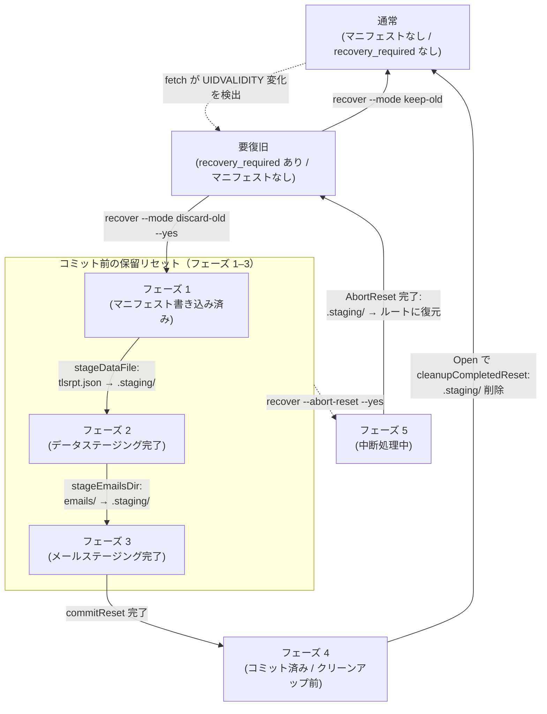

# ADR-0003: ResetForRecovery のフェーズ設計とコミット後クリーンアップの扱い

| 項目 | 内容 |
|---|---|
| 番号 | ADR-0003 |
| ステータス | 採択 |
| 決定日 | 2026-05-25 |
| 最終更新日 | 2026-05-29 |
| 関連タスク | 0070_entrypoint |

---

## 1. コンテキスト

### ストアの概要

本システムは指定ディレクトリ（以下「ストア」）にデータを保管する。ストアの通常時の構成を次に示す。

| ファイル/ディレクトリ | 内容 |
|---|---|
| `tlsrpt.json` | fetch が取得したメールから抽出・蓄積する解析済み TLSRPT レポート（RFC 8460 JSON、以下「レポート」）。summary はこのデータを集計して通知を送信する。 |
| `emails/` | 収集済みメール（`.eml` ファイル） |
| センチネル（`.tlsrpt-digest-meta.json`） | `UIDValidity`・`recovery_required` を記録するメタデータファイル |

### UIDVALIDITY 変化と手動復旧

IMAP サーバーが UIDVALIDITY を変更すると、既存の UID と新しい UID の対応が保証されなくなる。本システムはこの変化を検出した時点で `recovery_required` をセンチネルに記録し、以後の fetch/summary を停止する。オペレーターは `recover` サブコマンドで以下のいずれかを選択する。

- **keep-old** (`ApplyRecovery`): 旧データを保持したまま新 UIDVALIDITY に移行する。
- **discard-old** (`ResetForRecovery`): 旧データをすべて破棄し、空ストアで再スタートする。

`ResetForRecovery` は複数のファイル操作を伴うため、途中でクラッシュした場合でも安全に再開または取り消しができる必要がある。

本文書では `ResetForRecovery` による一連の操作を**リセット**と呼ぶ。リセット開始後、コミット完了（センチネルへの `recovery_required` クリア書き込み完了）までの中間状態を**保留リセット**と呼ぶ。コード上では `ErrPendingReset`・`HasPendingReset()` として参照される。

### 要件（02_architecture.md より）

| 要件 | 内容 |
|---|---|
| AC-crash-safe | `ResetForRecovery` はいずれの段階でクラッシュしても「旧データ保持 + recovery_required 残存」または「空ストア + 新 UIDVALIDITY + recovery_required 解消」のどちらかに収束する |
| AC-abort | `AbortReset` はコミット前の保留リセットを取り消し、旧データを保持した状態に戻せる |
| AC-fail-closed | コミット前の保留リセットがある場合、通常の `Open(OpenReadWrite)` は fail-closed する |
| AC-cleanup | コミット後のクリーンアップ失敗は通常データパスへ影響させず、後続の `Open` または `ResetForRecovery` で再クリーンアップ可能にする |

---

## 2. フェーズ設計の概要

`ResetForRecovery` はファイル操作の進捗を `resetPhase`（整数値）としてリセットマニフェスト（`.tlsrpt-digest-reset-manifest.json`）に記録する。リセット操作は以下の 3 種類のファイル/ディレクトリで管理される。

| ファイル/ディレクトリ | 記録内容 | 役割 |
|---|---|---|
| マニフェスト (`.tlsrpt-digest-reset-manifest.json`) | `resetPhase`（整数 1–5） | リセット操作の進捗台帳。クラッシュ後の再開・中断判断に使う。 |
| センチネル (`.tlsrpt-digest-meta.json`) | `UIDValidity`・`recovery_required` | 確定状態の台帳。`recovery_required == nil` がコミット完了の真の根拠。 |
| ステージングディレクトリ (`.tlsrpt-digest-staging/`) | `tlsrpt.json`・`emails/`（リセット中の旧データ） | コミット前の旧データ一時保管場所。コミット前は `AbortReset` で元の場所に復元できる。コミット後はクリーンアップで削除される。 |

**ステージングディレクトリ**（`.tlsrpt-digest-staging/`）は `ResetForRecovery` が旧データを一時退避する専用ディレクトリである。リセット中、`tlsrpt.json` と `emails/` は `rename(2)` システムコール（POSIX が保証する原子操作）でアトミックにこのディレクトリへ移動される。コミット前であれば `AbortReset` によってステージング内のファイルを元の場所（ストアディレクトリ直下）に戻すことができる。コミット後は旧データとして廃棄される。

---

## 3. フェーズ一覧と役割

> **設計パターン注記**：フェーズ 1 は「先書き（WAL: Write-Ahead Log）」、フェーズ 2・3 は「後書き（チェックポイント）」パターンを用いる。先書きは操作開始前に記録してクラッシュ後の再開を保証し、後書きは操作完了後に記録して冪等な再実行を可能にする。詳細は §4 で説明する。

| 定数名 | 値 | 記録タイミング | 意味・役割 |
|---|---|---|---|
| `resetPhaseManifestWritten` | 1 | ステージング開始前（先書き） | **WAL エントリ**。この時点からマニフェストが存在するため `Open(OpenReadWrite)` は `ErrPendingReset` を返す。`AbortReset` によるロールバックが可能になる。 |
| `resetPhaseDataStaged` | 2 | `tlsrpt.json` のステージング完了後（チェックポイント） | データファイルのリネームが完了したことを記録する。クラッシュ後の再開でこのフェーズから再実行しても `stageDataFile` は冪等（ファイル不在は no-op）。 |
| `resetPhaseEmailsStaged` | 3 | `emails/` のステージング完了後（チェックポイント） | メールディレクトリのリネームが完了したことを記録する。同様に冪等。 |
| `resetPhaseCommitted` | 4 | センチネル保存直後（コミットマーカー） | センチネルへの書き込み（recovery_required クリア・新 UIDVALIDITY 設定）が完了したことを記録する。この後はマニフェストとステージングディレクトリのみが残存するため、クリーンアップ失敗は通常データパスに影響しない。 |
| `resetPhaseAborting` | 5 | `restoreFromStaging` 実行前（中断 WAL エントリ） | **中断操作の WAL エントリ**。`AbortReset` がファイルを元の場所に戻す前にこのフェーズを書く。以降のクラッシュでマニフェストが残存しても、`ResetForRecovery` はこのフェーズを見て操作を拒否し、`AbortReset` の再実行を促す。 |

### フェーズ別ファイル配置

各フェーズでストアディレクトリ（`{root_dir}/`）とステージングディレクトリに存在する主要ファイルを示す。

| フェーズ | ストアディレクトリ | ステージング (`.tlsrpt-digest-staging/`) |
|---|---|---|
| 通常 / 要復旧 | `tlsrpt.json`・`emails/` | なし |
| フェーズ 1（マニフェスト書き込み済み） | `tlsrpt.json`・`emails/` | 空ディレクトリ（作成済み） |
| フェーズ 2（データステージング完了） | `emails/` のみ | `tlsrpt.json` |
| フェーズ 3（メールステージング完了） | なし | `tlsrpt.json`・`emails/`（旧） |
| フェーズ 4（コミット済み / クリーンアップ前） | なし | `tlsrpt.json`・`emails/`（旧） |

フェーズ 4 → 通常への遷移（クリーンアップ）は `Open(OpenReadWrite)` 内で実行される。ステージング削除と `tlsrpt.json`・`emails/` の再初期化が同一の Open 呼び出しで完了し、以後は通常状態に戻る。

### 状態遷移図



凡例：実線 = 正常系の遷移、破線 = 例外イベント（UIDVALIDITY 変化）または手動中断

**クラッシュリカバリ**：各フェーズでのクラッシュ後は同じフェーズから再開可能（各ステージング操作は冪等）。フェーズ 1–3 でプロセスが停止した場合は、`recover --mode discard-old --yes` を再実行すると現在のフェーズから自動的に再開される。

**コミットウィンドウクラッシュ**（センチネル保存完了からフェーズ 4 への更新完了までの間）：`commitReset` はセンチネルを保存してからマニフェストをフェーズ 4 に進める。その間でクラッシュするとマニフェストはフェーズ 3 のまま残るが、`cleanupCompletedReset` はフェーズ番号ではなくセンチネルの `recovery_required` で判断するため、フェーズ 4 と同じくクリーンアップが実行されて通常状態に収束する（§4 参照）。データ整合性は保たれるが、ステージングディレクトリとマニフェストは次に `fetch` または `gc` が実行されるまでディスクに残る（`summary` や `recover --mode discard-old --yes` ではクリーンアップされない）。`fetch` と `gc` は定期実行が想定されるため、ストレージ容量の見積もりにはステージングディレクトリ 1 つ分（旧データファイル）を一時的な上振れとして考慮すればよい。

### ユーザー操作時の挙動

| 状態 | `recover --mode keep-old` | `recover --mode discard-old`（`--yes` なし） | `recover --mode discard-old --yes` | `recover --abort-reset --yes` |
|---|---|---|---|---|
| マニフェストなし・`recovery_required` あり | `ApplyRecovery` を実行し、旧データを保持したまま UIDVALIDITY を更新して `recovery_required` を解除する | 実行予定を表示するだけで、破壊的変更を行わず exit 1 | fresh start として `ResetForRecovery` を開始する | 保留リセットがないため `ErrResetNotPending` |
| フェーズ 1〜3（コミット前の保留リセット） | `Open(OpenReadWrite)` が `ErrPendingReset` を返すため実行不可。継続または中断の選択肢を表示する。 | 保留リセットの存在と、継続または中断の選択肢を表示する。破壊的変更なし。 | 該当フェーズから `ResetForRecovery` を再開し、空ストア + current UIDVALIDITY + `recovery_required` 解消へ収束する | `AbortReset` を実行し、旧データ保持 + `recovery_required` 残存へ戻す |
| フェーズ 4 または `recovery_required` なし（コミット済み） | 通常 open 時に残留マニフェスト/ステージングをクリーンアップする。その後は recovery-required 不在として復旧不要扱い。 | 同左 | クリーンアップして終了する。実質的に冪等。 | コミット後のため `ErrResetNotPending` |
| フェーズ 5（中断処理中） | `Open(OpenReadWrite)` が `ErrPendingReset` を返すため実行不可。中断処理の完了を促す。 | 保留リセットの存在と、中断処理の完了が必要であることを表示する。破壊的変更なし。 | `ErrResetAbortInProgress` を返し、先に `AbortReset` の完了を要求する | `AbortReset` を再開し、`restoreFromStaging` を冪等に実行してマニフェストを削除する |
| 不明フェーズ・バージョン不一致・マニフェスト破損 | fail-closed。手動確認が必要 | fail-closed。手動確認が必要 | fail-closed。手動確認が必要 | fail-closed。手動確認が必要 |

---

## 4. 各フェーズの詳細設計根拠

### フェーズ 1（WAL エントリ）をステージング前に書く理由

マニフェストの書き込みは `Open(OpenReadWrite)` に対する「操作中フラグ」を兼ねる。このフラグを最初に書くことで：

- `Open(OpenReadWrite)` が常に fail-closed できる（AC-fail-closed）
- `AbortReset` がどのフェーズからでもロールバックできる

フラグを書く前にクラッシュした場合はマニフェストが存在しないため、次回実行は "fresh start" として扱われ、センチネルの recovery_required を確認して正常に再開する。

### フェーズ 2・3（チェックポイント）をリネーム後に書く理由

`rename(2)` システムコールは POSIX の保証する原子操作であるため、成功した場合のみファイルが移動している。チェックポイントをリネームの後に書くことで、クラッシュ後の再開時に以下の推論が成立する。

| フェーズ N のチェックポイント | 推論 | 再開時の動作 |
|---|---|---|
| あり | リネームは確実に完了している | スキップ |
| なし | 完了済みか未実行か不明 | 冪等な操作を再実行（ファイル不在なら no-op） |

逆にリネームの前に書いた場合、クラッシュするとチェックポイントは書かれたがリネームは未完了という状態になり、再開時に「完了済み」と誤判断するリスクがある。本設計では操作後チェックポイントパターンを選んだ。

> **注意**: この設計は AC-crash-safe を担保するが、「フェーズ N の書き込みが完了した = フェーズ N の操作は完了した」という不変条件を前提にしている。各ステージング関数（`stageDataFile`・`stageEmailsDir`）の冪等性はこの不変条件を維持するために必須である。

### センチネルがコミットの真の根拠である理由

フェーズ 4（`resetPhaseCommitted`）のマーカーは `commitReset` がセンチネルを保存した**後**に書く。つまり「センチネルに recovery_required がない」は「コミットが完了している」と等価であり、「マニフェストがフェーズ 4 である」よりも信頼性が高い（フェーズ 4 への更新が完了する前にクラッシュする可能性があるため）。

この性質を利用して以下の判断を行う。

| 判断箇所 | 使用する根拠 | 理由 |
|---|---|---|
| `AbortReset` のロールバック可否 | `sentinel.recovery_required != nil` | 「コミット後の中断」を防ぐ |
| `Open(OpenReadWrite)` のクリーンアップ可否 | `sentinel.recovery_required == nil` | 「コミット後のクリーンアップ失敗」を検出してデータパスをブロックしない |

### フェーズ 5（中断 WAL エントリ）を設ける理由

`AbortReset` がファイルを元の場所に戻す（`restoreFromStaging`）操作は途中でクラッシュしうる。クラッシュ後の状態は「マニフェストはフェーズ 3 のまま、ファイルは root に復元済み」になる可能性がある。この状態で `ResetForRecovery` を実行するとフェーズ 3 として扱われ、空のステージングへのコミットが行われてしまう（「新 UIDVALIDITY + recovery_required クリア + 旧データが root に残存」という矛盾状態）。

この問題を回避するため、`AbortReset` はファイルを動かす前に必ずフェーズ 5（aborting）に更新する。`ResetForRecovery` はフェーズ 5 を見た場合に `ErrResetAbortInProgress` を返し、`AbortReset` の完了を要求する。

| フェーズ 5 検出時 | 動作 |
|---|---|
| `ResetForRecovery` | 拒否（`ErrResetAbortInProgress`） |
| `AbortReset` | 再開（`restoreFromStaging` は冪等）→ クリーンアップ |

---

## 5. Open(OpenReadWrite) でのクリーンアップ設計

### 設計選択肢

| 選択肢 | 方針 | 課題 |
|---|---|---|
| A. フェーズ値のみで判断 | フェーズ 4 のみクリーンアップ | コミットウィンドウクラッシュ（フェーズ 3 + センチネル確定）に対応できない |
| B. センチネル値で判断（採択） | `recovery_required == nil` ならクリーンアップ | フェーズ値に依存せずコミットウィンドウも含めて統一対応できる |

### クリーンアップロジック（`cleanupCompletedReset`）

```
1. マニフェストを読む
   ├─ 不在 → 残留ステージングをベストエフォートで削除して正常終了（※後述）
   ├─ バージョン不一致 → エラー（fail-closed）
   └─ 不明フェーズ → エラー（fail-closed）

2. センチネルを読む
   ├─ 不在 → ErrPendingReset（非正規状態・fail-closed）
   ├─ recovery_required あり → ErrPendingReset（操作進行中）
   └─ recovery_required なし → コミット済み → クリーンアップ実行
       ├─ os.RemoveAll(staging) ── ベストエフォート
       └─ os.Remove(manifest)   ── 必須（失敗すると次回も試みる）
```

**※ 残留ステージングの扱い**

マニフェストが存在しないにもかかわらずステージングディレクトリが残っている場合は、
前回のリセットで `Remove(manifest)` は成功したが `RemoveAll(staging)` が失敗した
ことを意味する。マニフェストの WAL エントリ（フェーズ 1）はファイルを動かす前に
必ず書かれるため、マニフェストなし = 完了済みまたは未開始のいずれかであり、
ステージングの内容は復元に使われることがない。したがってベストエフォートで削除して安全である。

### カバーするシナリオ

| シナリオ | マニフェスト有無 | sentinel.recovery_required | 結果 |
|---|---|---|---|
| 操作進行中（コミット前） | あり（1〜3） | あり | ErrPendingReset |
| 中断処理中 | あり（5） | あり | ErrPendingReset |
| コミット後クリーンアップ失敗 | あり（4） | なし | クリーンアップして通常 Open |
| コミットウィンドウクラッシュ（フェーズ 3 + センチネル確定） | あり（3） | なし | クリーンアップして通常 Open |
| 残留ステージング（マニフェスト削除後にステージング削除が失敗） | なし | なし | ステージングをベストエフォートで削除して通常 Open |

---

## 6. フェーズ間の不変条件まとめ

| 不変条件 | 担保箇所 |
|---|---|
| フェーズ 1 が書かれている間は `Open(OpenReadWrite)` が ErrPendingReset を返す | `cleanupCompletedReset` が recovery_required を確認 |
| フェーズ 2 が書かれている ⟹ `tlsrpt.json` はステージングに存在する | `stageDataFile` が冪等・フェーズ 2 はリネーム後に書く |
| フェーズ 3 が書かれている ⟹ `emails/` はステージングに存在する | `stageEmailsDir` が冪等・フェーズ 3 はリネーム後に書く |
| フェーズ 4 または `recovery_required == nil` ⟹ センチネルはコミット済み | `commitReset` がセンチネル保存後にフェーズ 4 を書く |
| フェーズ 5 が書かれている ⟹ `AbortReset` のみが続行できる | `ResetForRecovery` がフェーズ 5 を拒否 |
| **マニフェストなし ⟹ ステージングの内容は残留物（安全に削除可能）** | WAL 設計：フェーズ 1 はファイル移動より前に書かれるため、マニフェストがなければファイルは動いていない（または完了済みのクリーンアップ残滓） |

---

## 7. 将来の変更・拡張方針

### フェーズを追加する場合

1. 新しい `resetPhase` 定数を定義する（値は既存の最大値 + 1）
2. `validateManifestPhase` の上限を更新する
3. `advanceResetPhases`・`AbortReset` に新フェーズの処理を追加する
4. `cleanupCompletedReset` がコミット判断にセンチネルを使っているため、フェーズ数が増えても影響を受けない

### ステージングの対象ファイルが増える場合

- `stageDataFile`・`stageEmailsDir` に倣い、対応する `stageXxx` 関数を追加して冪等性を保つ
- 新しいチェックポイントフェーズを追加する（上記「フェーズを追加する場合」に準じる）
- **`cleanupCompletedReset` の残留ステージング削除も合わせて更新する**：現在の実装は
  `resetStagingPath` ディレクトリ全体を `RemoveAll` するため、ディレクトリ内に新たな
  サブパスを追加しても自動的に対象に含まれる。ステージングをディレクトリ以外のファイルに
  拡張した場合は `cleanupCompletedReset` 側に対応する削除処理を追加すること。

### コミット操作が複数ステップになる場合

現在の `commitReset` はセンチネル保存を 1 ステップで行っているため、センチネル保存の完了 = コミット確定となっている。複数ステップのコミットが必要になった場合は、「最後のステップが完了 = コミット確定」という不変条件を維持するように設計する必要がある。センチネル以外のファイルがコミット根拠になる場合は `cleanupCompletedReset` の判断ロジックの更新が必要になる。

### `AbortReset` の中断ロジックが複雑になる場合

現在の中断処理はフェーズ 5（aborting）の 1 ステップのみである。中断操作が複数ファイルにまたがる非原子操作になる場合は、同様にサブフェーズを導入することを検討する。その際も「フェーズ 5 系 = ResetForRecovery 禁止」の不変条件は維持する。

---

## 8. 代替ストレージ技術の検討

### 現時点の判断

現時点ではファイルベースの設計から移行しない。現在の永続化対象は `tlsrpt.json`、`emails/`、センチネル、リセットマニフェスト、ステージングディレクトリに限られており、`ResetForRecovery` / `AbortReset` のフェーズ管理によって主要なクラッシュシナリオをカバーできている。移行コストが得られる単純化を上回ると判断する。

### 概要比較

| 代替策 | CGO | SQL | 主な用途適合 |
|---|---|---|---|
| SQLite (`mattn/go-sqlite3`) | 必要 | あり | SQL・スキーマ管理が必要になった場合 |
| Pure Go SQLite (`modernc.org/sqlite`) | 不要 | あり | CGO を避けつつ SQL を使いたい場合 |
| bbolt | 不要 | なし | 状態管理の原子性だけ担保できれば十分な場合 |
| Pebble | 不要 | なし | 高スループットが必要な場合（本用途では過剰） |

---

### SQLite (`mattn/go-sqlite3`)

CGO ベースの SQLite バインディング。最も広く使われている。

**Pros**

| 観点 | 内容 |
|---|---|
| クラッシュセーフティ | `BEGIN` / `COMMIT` でレポート・センチネル・recovery_required の更新を 1 トランザクションに閉じ込められる |
| フェーズ管理の削減 | 現在の `resetPhase`・マニフェスト・ステージング・中断フェーズの多くを DB の atomic commit に置き換えられる |
| 整合性制約 | UIDVALIDITY・recovery_required などをテーブル制約やトランザクション境界で表現しやすい |
| 将来の検索・集計 | 期間・UID・ドメインなどの条件検索や集計を SQL で表現しやすい |
| migration の明示化 | スキーマバージョンを持つことで永続形式の変更を段階的に管理しやすい |

**Cons**

| 観点 | 内容 |
|---|---|
| CGO 依存 | クロスビルドが困難。CI・配布環境の整備コストが増える |
| 移行コスト | 既存ファイルから DB への migration とロールバック方針が必要 |
| 運用ファイル | WAL mode では `store.db-wal` / `store.db-shm` をバックアップ手順に含める必要がある |
| 容量管理 | `.eml` を BLOB 格納する場合、VACUUM / incremental VACUUM の方針が必要 |
| 調査性 | `.eml` が DB 内に入ると手動調査・緊急復旧が SQL / 専用ツール経由になる |
| 破損時対応 | DB ファイル破損時の検出・復元手順を新たに定義する必要がある |

---

### Pure Go SQLite (`modernc.org/sqlite`)

SQLite の C ソースを pure Go に自動変換したもの。API は `mattn/go-sqlite3` とほぼ互換。

**Pros**

| 観点 | 内容 |
|---|---|
| CGO 不要 | クロスビルドが容易。配布環境への影響がない |
| SQLite 機能をそのまま使える | WAL・トランザクション・制約など、SQLite の pros がすべて適用される |
| 移行コストが低い | `mattn/go-sqlite3` との API 互換性が高く、ドライバ切り替えのみで済む場合が多い |

**Cons**

| 観点 | 内容 |
|---|---|
| 性能がやや低い | CGO 版より一般に遅い（読み取り中心のワークロードで 1.5〜2 倍程度が目安）。本プロジェクトのアクセス頻度では問題にならないと想定される |
| SQLite の Cons を引き継ぐ | VACUUM・WAL ファイル管理・破損時対応など、SQLite の Cons はそのまま残る |

**本プロジェクトへの評価**

CGO を避けたまま SQL とスキーマ管理を使いたい場合の第一選択肢。`mattn/go-sqlite3` と比較した追加コストはほぼ性能差のみ。

---

### bbolt

pure Go の B+ ツリー KV ストア。etcd・Kubernetes で本番実績あり。

**Pros**

| 観点 | 内容 |
|---|---|
| Pure Go | CGO 不要。クロスビルドへの影響なし |
| ACID トランザクション | `db.Update(func(tx) error { ... })` で複数バケットをまたいだ原子更新が可能。クラッシュセーフ |
| シンプルな API | bucket（名前空間）＋ key-value のみ。学習コストが低い |
| 単一ファイル | `.db` ファイル 1 つ（＋ロックファイル）で完結。WAL 補助ファイルがない |
| 実績 | etcd・InfluxDB などで長期の本番運用実績がある |
| 本用途への適合 | センチネル・マニフェスト・recovery_required・レポートの原子更新には十分。集計・条件検索の要件がない現時点では SQL は不要 |

**Cons**

| 観点 | 内容 |
|---|---|
| SQL なし | 集計・条件検索はアプリケーション側で実装が必要 |
| スキーマが暗黙的 | KV マッピングとして設計するため、型制約や外部キーなどの DB 側整合性チェックができない |
| `.eml` の扱い | `.eml` は bbolt に格納せずファイルシステムに残す（理由は下記参照）。bbolt との二相コミット問題は残るが管理可能 |
| migration の表現 | スキーマバージョン管理はアプリケーション側で設計する必要がある |

**`.eml` をファイルシステムに残す理由**

| 理由 | 内容 |
|---|---|
| mmap によるメモリ圧迫 | bbolt は全データを mmap するため、数百 KB〜数 MB の `.eml` を大量に格納するとページキャッシュが圧迫される |
| 書き込みロックの競合 | `db.Update` は DB 全体に書き込みロックをかけるため、大きな BLOB の書き込み中に他のすべての操作がブロックされる |
| 自動スペース回収がない | bbolt には VACUUM 相当の機能がなく、`.eml` を削除してもファイルサイズは縮小されない。GC のたびに `Compact` 相当の処理を実装する必要がある |
| 調査性・手動復旧 | ファイルシステムに置けば `cat` や `mutt` で直接確認・再送できる。bbolt に格納すると専用ツールや Go コードが必要になり手動復旧コストが上がる |

**本プロジェクトへの評価**

`.eml` をファイルシステムに残したまま、センチネル・recovery_required・UIDVALIDITY・レポートを bbolt トランザクションで原子更新する設計が自然。現在のフェーズ管理（resetPhase・マニフェスト・ステージング）の多くを `db.Update` 1 回に置き換えられる。ただし `.eml` とメタデータの二相コミット問題は残るため、`.eml` の追加・削除を伴う操作には別途クラッシュセーフ設計が必要になる。

---

### Pebble

CockroachDB チームによる pure Go の LSM ツリー KV ストア。書き込みスループットは bbolt より高いが、本プロジェクトのアクセス頻度（fetch が約 1 時間に 1 回）では恩恵がない。設定・チューニングが bbolt より複雑なため、現時点では過剰。

---

### 再検討条件

以下のいずれかが発生した場合は移行を再検討する。

- `ResetForRecovery` 以外にも複数ファイルをまたぐクラッシュセーフな更新操作が増える
- `stageXxx` と対応フェーズの追加が繰り返され、`resetPhase` の状態空間が運用上把握しづらくなる
- レポートと `.eml` の対応関係をより強く保証する必要が出る
- 永続化対象の管理ファイルが増え、手動復旧手順が現在より複雑になる
- JSON 全読みでは検索・集計・GC の性能または実装が問題になる
- 永続形式の migration が継続的に必要になり、ファイル単位の移行よりスキーマ管理の方が単純になる
- バックアップ・復旧運用で複数ファイルを一貫した時点で保存することが難しくなる

### 移行時の設計方針

**SQLite 系**（`mattn/go-sqlite3` または `modernc.org/sqlite`）へ移行する場合は、レポートのみを部分的に DB 化せず、レポート・センチネル・recovery_required を同一 DB に集約する。`.eml` をファイルシステムに残すと DB とファイルの二相コミット問題が残り、現在のフェーズ管理と同種の複雑さが再発する。

**bbolt** へ移行する場合は、メタデータ（センチネル・recovery_required・UIDVALIDITY・レポート）を bbolt に集約し、`.eml` はファイルシステムに残す設計が現実的。この場合、`.eml` の追加・削除を伴う操作（fetch での保存、gc での削除）には bbolt トランザクションとファイル操作の順序を明示的に設計する必要がある。

いずれの場合も、アクセス頻度が低い（fetch が約 1 時間に 1 回、summary が約 1 週間に 1 回、gc が週 1 回未満）ため、移行初期の主目的は read/write 並行性能ではなくクラッシュセーフティと状態管理の単純化とする。

---

## 9. 関連ファイル

| ファイル | 役割 |
|---|---|
| `internal/store/recovery.go` | `resetPhase`・`resetManifest`・`ResetForRecovery`・`AbortReset`・`cleanupCompletedReset` の実装 |
| `internal/store/store.go` | `Open` 関数での `cleanupCompletedReset` 呼び出し |
| `internal/store/errors.go` | `ErrPendingReset`・`ErrResetNotPending`・`ErrResetManifestVersionMismatch`・`ErrResetManifestPhaseUnknown`・`ErrResetAbortInProgress` の定義 |
| `internal/store/recovery_test.go` | フェーズごとのクラッシュシナリオテスト |
| `internal/store/store_test.go` | `Open` 時のクリーンアップ動作テスト |
