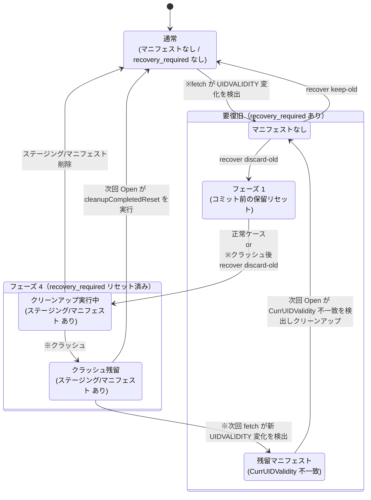

# ADR-0003: ResetForRecovery のフェーズ設計とリセット完了後クリーンアップの扱い

| 項目 | 内容 |
|---|---|
| 番号 | ADR-0003 |
| ステータス | 採択 |
| 決定日 | 2026-05-25 |
| 最終更新日 | 2026-06-01 |
| 関連タスク | 0070_entrypoint, 0080_reset_phase_simplify, 0081_abort_reset_removal |

---

## 1. コンテキスト

### ストアの概要

本システムは指定ディレクトリ（以下「ストア」）にデータを保管する。ストアの通常時の構成を次に示す。

| ファイル/ディレクトリ | 内容 |
|---|---|
| `tlsrpt.json` | fetch が取得したメールから抽出・蓄積する解析済み TLSRPT レポート（RFC 8460 JSON、以下「レポート」）。summary はこのデータを集計して通知を送信する。 |
| `emails/` | 収集済みメール（`.eml` ファイル） |
| センチネル（`.tlsrpt-digest-meta.json`） | `UIDValidity`・`recovery_required` を記録するメタデータファイル |

### UIDVALIDITY 変化と手動復旧

IMAP サーバーが UIDVALIDITY を変更すると、既存の UID と新しい UID の対応が保証されなくなる。本システムはこの変化を検出した時点で `recovery_required` をセンチネルに記録し、以後の fetch/summary を停止する。オペレーターは `recover` サブコマンドで以下のいずれかを選択する。

- **keep-old** (`ApplyRecovery`): 旧データを保持したまま新 UIDVALIDITY に移行する。
- **discard-old** (`ResetForRecovery`): 旧データをすべて破棄し、空ストアで再スタートする。

`ResetForRecovery` は複数のファイル操作を伴うため、途中でクラッシュした場合でも安全に再開または取り消しができる必要がある。

本文書では `ResetForRecovery` による一連の操作を**リセット**と呼ぶ。リセット開始後、コミット完了（センチネルへの `recovery_required` クリア書き込み完了）までの中間状態を**保留リセット**と呼ぶ。コード上では `ErrPendingReset`・`HasPendingReset()` として参照される。なお `HasPendingReset()` はフェーズ 4（committed）のマニフェストに対しては false を返す（リセット完了後クリーンアップ残滓であり、保留リセットではない）。

### 要件（02_architecture.md より）

| 要件 | 内容 |
|---|---|
| AC-crash-safe | `ResetForRecovery` はいずれの段階でクラッシュしても「旧データ保持 + recovery_required 残存」または「空ストア + 新 UIDVALIDITY + recovery_required 解消」のどちらかに収束する |
| AC-fail-closed | コミット前の保留リセットがある場合、通常の `Open(OpenReadWrite)` は fail-closed する |
| AC-cleanup | コミット後のクリーンアップ失敗は通常データパスへ影響させず、後続の `Open` または `ResetForRecovery` で再クリーンアップ可能にする |

---

## 2. フェーズ設計の概要

`ResetForRecovery` はファイル操作の進捗を `resetPhase`（整数値）としてリセットマニフェスト（`.tlsrpt-digest-reset-manifest.json`）に記録する。リセット操作は以下の 3 種類のファイル/ディレクトリで管理される。

| ファイル/ディレクトリ | 記録内容 | 役割 |
|---|---|---|
| マニフェスト (`.tlsrpt-digest-reset-manifest.json`) | `resetPhase`（整数。有効値は {1, 4}） | リセット操作の進捗台帳。クラッシュ後の再開に使う。旧バージョンが書いたレガシー値 2・3・5 は読み取り時に fail-closed で拒否される（§4 参照）。 |
| センチネル (`.tlsrpt-digest-meta.json`) | `UIDValidity`・`recovery_required` | 確定状態の台帳。`recovery_required == nil` がコミット完了の真の根拠。 |
| ステージングディレクトリ (`.tlsrpt-digest-staging/`) | `tlsrpt.json`・`emails/`（リセット中の旧データ） | コミット前の旧データ一時保管場所。コミット後はクリーンアップで削除される。 |

**ステージングディレクトリ**（`.tlsrpt-digest-staging/`）は `ResetForRecovery` が旧データを一時退避する専用ディレクトリである。リセット中、`tlsrpt.json` と `emails/` は `rename(2)` システムコール（POSIX が保証する原子操作）でアトミックにこのディレクトリへ移動される。コミット後は旧データとして廃棄される。

---

## 3. フェーズ一覧と役割

> **設計パターン注記**：フェーズ 1 は「先書き（WAL: Write-Ahead Log）」パターンを用いる。先書きは操作開始前に記録してクラッシュ後の再開を保証する。ステージング操作（`stageDataFile`・`stageEmailsDir`）はそれぞれ冪等であるため、中間チェックポイントなしにフェーズ 1 から全操作を再実行して正しく収束できる。

| 定数名 | 値 | 記録タイミング | 意味・役割 |
|---|---|---|---|
| `resetPhaseManifestWritten` | 1 | ステージング開始前（先書き） | **WAL エントリ**。この時点からマニフェストが存在するため `Open(OpenReadWrite)` は `ErrPendingReset` を返す。 |
| `resetPhaseCommitted` | 4 | センチネル保存直後（recovery_required リセットマーカー） | センチネルへの書き込み（recovery_required クリア・新 UIDVALIDITY 設定）が完了したことを記録する。この後はマニフェストとステージングディレクトリのみが残存するため、クリーンアップ失敗は通常データパスに影響しない。 |

> **旧バージョンのマニフェストについて**：値 2・3・5 は旧バージョンが書いたフェーズ値であり、現在の `validateManifestPhase` は `ErrResetManifestPhaseUnknown` で拒否する（fail-closed）。該当するストアのアップグレード手順は `docs/operations/legacy_reset_manifest_upgrade.ja.md` を参照。

### フェーズ別ファイル配置

各フェーズでストアディレクトリ（`{root_dir}/`）とステージングディレクトリに存在する主要ファイルを示す。

| フェーズ | ストアディレクトリ | ステージング (`.tlsrpt-digest-staging/`) |
|---|---|---|
| 通常 / 要復旧 | `tlsrpt.json`・`emails/` | なし |
| フェーズ 1 — 初期状態（マニフェスト書き込み直後） | `tlsrpt.json`・`emails/` | 空ディレクトリ（作成済み） |
| フェーズ 1 — `stageDataFile` 完了後（C2 クラッシュ地点） | `emails/` のみ | `tlsrpt.json` |
| フェーズ 1 — `stageEmailsDir` 完了後（C3 クラッシュ地点） | なし | `tlsrpt.json`・`emails/` |
| フェーズ 4（recovery_required リセット済み / クリーンアップ前） | なし | `tlsrpt.json`・`emails/` |

> **クラッシュ時のファイル配置について**：`stageDataFile`（C2）や `stageEmailsDir`（C3）の完了後にクラッシュしても、マニフェストはフェーズ 1 のまま上表の C2・C3 行に示すファイル配置になる。`advanceResetPhases` は `stageDataFile`・`stageEmailsDir` が冪等（対象ファイル不在は no-op）なため、いずれの配置からも正しく収束する。

フェーズ 4 → 通常への遷移（クリーンアップ）は `Open(OpenReadWrite)` 内で実行される。ステージング削除と `tlsrpt.json`・`emails/` の再初期化が同一の Open 呼び出しで完了し、以後は通常状態に戻る。

### 状態遷移図



凡例：実線 = 正常系の遷移、※印 = 例外イベント（クラッシュ・UIDVALIDITY 変化）または手動中断

**クラッシュリカバリ**：各フェーズでのクラッシュ後は同じコミット前状態から再開可能（各ステージング操作は冪等）。フェーズ 1 でプロセスが停止した場合は、`recover --mode discard-old --yes` を再実行するとコミット前から一括実行で自動的に収束する。

**コミットウィンドウクラッシュ**（センチネル保存完了からフェーズ 4 への更新完了までの間）

`commitReset` はセンチネルを保存してからマニフェストをフェーズ 4 に進める。その間でクラッシュするとマニフェストはコミット前（フェーズ 1）のまま残る。

- **通常の収束**：`cleanupCompletedReset` はフェーズ番号ではなくセンチネルの `recovery_required` で判断するため、フェーズ 4 と同じくクリーンアップが実行されて通常状態に収束する（§4 参照）。データ整合性は保たれる。
- **マニフェスト残存時**：`cleanupCompletedReset` がステージングの削除に成功してもマニフェストの削除に失敗した場合（ベストエフォート）、マニフェストはコミット前（フェーズ 1）のままディスクに残る。その後の挙動はつぎの 2 通りに分かれる。
  - 新たな UIDVALIDITY 変化が発生した場合：`Open(OpenReadWrite)` → `cleanupCompletedReset` が `CurrUIDValidity` の不一致を検出してマニフェスト/ステージングをクリーンアップする（Open は成功）。`recover --mode keep-old` や `recover --mode discard-old --yes` はどちらも正常に動作する。
  - 新たな UIDVALIDITY 変化が発生しない場合：次に `fetch` または `gc` が実行されたときに `Open(OpenReadWrite)` → `cleanupCompletedReset` で再試行される。

`fetch` と `gc` は定期実行が想定されるため、ストレージ容量の見積もりにはステージングディレクトリ 1 つ分（旧データファイル）を一時的な上振れとして考慮すればよい。

### ユーザー操作時の挙動

| 状態 | `recover --mode keep-old` | `recover --mode discard-old`（`--yes` なし） | `recover --mode discard-old --yes` |
|---|---|---|---|
| マニフェストなし・`recovery_required` あり | `ApplyRecovery` を実行し、旧データを保持したまま UIDVALIDITY を更新して `recovery_required` を解除する | 実行予定を表示するだけで、破壊的変更を行わず exit 1 | fresh start として `ResetForRecovery` を開始する |
| フェーズ 1（コミット前の保留リセット、CurrUIDValidity 一致） | `Open(OpenReadWrite)` が `ErrPendingReset` を返すため実行不可。継続の選択肢を表示する。 | 保留リセットの存在と継続の選択肢を表示する。破壊的変更なし。 | コミット前からの一括実行（`advanceResetPhases`）で `ResetForRecovery` を再開し、空ストア + current UIDVALIDITY + `recovery_required` 解消へ収束する |
| フェーズ 1（残留マニフェスト、CurrUIDValidity 不一致） | `cleanupCompletedReset` がマニフェストを削除して Open 成功。`ApplyRecovery` を実行する | 同左（Open 成功・表示のみ） | `cleanupCompletedReset` がマニフェストを削除して Open 成功。`ResetForRecovery` を fresh start で開始する |
| フェーズ 4 または `recovery_required` なし（recovery_required リセット済み） | 通常 open 時に残留マニフェスト/ステージングをクリーンアップする。その後は recovery-required 不在として復旧不要扱い。 | 同左 | クリーンアップして終了する。実質的に冪等。 |
| レガシー値 2・3・5（旧バージョンが書いたフェーズ） | fail-closed（`ErrResetManifestPhaseUnknown`）。アップグレード前に旧バージョンで完了させてからアップグレードすること（`docs/operations/legacy_reset_manifest_upgrade.ja.md` 参照）。 | 同左 | 同左 |
| バージョン不一致（`ErrResetManifestVersionMismatch`）またはマニフェスト破損（JSON/読み取りエラー） | fail-closed。マニフェストファイルの手動確認が必要。レガシーフェーズの手順（旧バージョンでの操作完了）は適用されない。 | 同左 | 同左 |

---

## 4. 各フェーズの詳細設計根拠

### フェーズ 1（WAL エントリ）をステージング前に書く理由

マニフェストの書き込みは `Open(OpenReadWrite)` に対する「操作中フラグ」を兼ねる。このフラグを最初に書くことで：

- `Open(OpenReadWrite)` が常に fail-closed できる（AC-fail-closed）

フラグを書く前にクラッシュした場合はマニフェストが存在しないため、次回実行は "fresh start" として扱われ、センチネルの recovery_required を確認して正常に再開する。

### `advanceResetPhases` の設計

現行の `advanceResetPhases` はコミット前フェーズから `stageDataFile`・`stageEmailsDir`・`commitReset` を中間マニフェスト更新なしに順次実行する。各操作は冪等（ファイル不在は no-op）であるため、クラッシュ後の再実行は常にすべての操作を再試行して正しく収束する。

### センチネルがコミットの真の根拠である理由

フェーズ 4（`resetPhaseCommitted`）のマーカーは `commitReset` がセンチネルを保存した**後**に書く。つまり「センチネルに recovery_required がない」は「コミットが完了している」と等価であり、「マニフェストがフェーズ 4 である」よりも信頼性が高い（フェーズ 4 への更新が完了する前にクラッシュする可能性があるため）。

この性質を利用して以下の判断を行う。

| 判断箇所 | 使用する根拠 | 理由 |
|---|---|---|
| `Open(OpenReadWrite)` のクリーンアップ可否 | `sentinel.recovery_required == nil` | 「コミット後のクリーンアップ失敗」を検出してデータパスをブロックしない |

### フェーズ 4（recovery_required リセットマーカー）を設ける理由

`recovery_required == nil` だけでコミット完了を判定できるにもかかわらずフェーズ 4 を設けるのは、**`executeResetFromManifest`（`recover --mode discard-old --yes` の再実行パス）でコミット前とコミット後の意味を一意に保つ**ためである。

フェーズ 4 がない場合、コミット直後にクラッシュするとマニフェストはコミット前（フェーズ 1）のまま残る。この状態で `recover --mode discard-old --yes` を再実行すると、`executeResetFromManifest` はフェーズ 1 を「コミット前」と判断して `advanceResetPhases` を呼び出す。`advanceResetPhases` はすべての操作を冪等に再実行するため実質的には壊れないが、フェーズ 1 が「コミット前」と「コミット後のクラッシュウィンドウ」という 2 つの意味を持つことになり、制御フローが曖昧になる。

フェーズ 4 を設けることで `executeResetFromManifest` はセンチネルを読まずに判断できる。

| フェーズ | 意味 | `executeResetFromManifest` の動作 |
|---|---|---|
| 1（コミット前） | コミット前（ステージング + コミット残り） | `advanceResetPhases` を呼ぶ |
| 4 | recovery_required リセット済み（クリーンアップ待ち） | `cleanupCompletedReset` に直行 |

一方、`Open(OpenReadWrite)` 内の `cleanupCompletedReset` はセンチネルで判断する（フェーズ 1 のままクラッシュした「コミットウィンドウクラッシュ」も拾う必要があるため）。フェーズ 4 とセンチネルはそれぞれ異なる呼び出しパスで使い分けられる。

### フェーズ定義を `{1, 4}` の 2 値に絞った理由

中間チェックポイントフェーズ（値 2・3）は不要である。`stageDataFile`・`stageEmailsDir`・`commitReset` はいずれも冪等であり、どの時点でクラッシュしても `advanceResetPhases` を再実行すれば正しく収束するためである。「リセット前進のみ」の設計（abort 経路なし）も同じ冪等性から成り立っており、フェーズ 1 からの一括再実行で十分である。

> **設計変更の記録**：過去のバージョンにはチェックポイントフェーズ（値 2・3、task 0080 で廃止）と中断 WAL エントリ（値 5、task 0081 で廃止）が存在した。これらの廃止判断の詳細は git log を参照。

---

## 5. Open(OpenReadWrite) でのクリーンアップ設計

### 設計選択肢

| 選択肢 | 方針 | 課題 |
|---|---|---|
| A. フェーズ値のみで判断 | フェーズ 4 のみクリーンアップ | コミットウィンドウクラッシュ（コミット前マニフェスト + センチネル確定）に対応できない |
| B. センチネル値で判断（採択） | `recovery_required == nil` ならクリーンアップ | フェーズ値に依存せずコミットウィンドウも含めて統一対応できる |

### クリーンアップロジック（`cleanupCompletedReset`）

```
1. マニフェストを読む
   ├─ 不在 → 残留ステージングをベストエフォートで削除して正常終了（※後述）
   ├─ バージョン不一致 → エラー（fail-closed）
   └─ 不明フェーズ → エラー（fail-closed）

2. センチネルを読む
   ├─ 不在 → ErrPendingReset（非正規状態・fail-closed）
   ├─ recovery_required あり かつ manifest.CurrUIDValidity == recovery_required.CurrUIDValidity → ErrPendingReset（操作進行中）
   ├─ recovery_required あり かつ manifest.CurrUIDValidity ≠ recovery_required.CurrUIDValidity → 残留マニフェスト → クリーンアップして正常終了（※後述②）
   └─ recovery_required なし → recovery_required リセット済み → クリーンアップ実行
       ├─ os.RemoveAll(staging) ── ベストエフォート
       └─ os.Remove(manifest)   ── ベストエフォート（失敗すると警告ログを出力し次回 Open 時に再試行）
```

**※① 残留ステージングの扱い**

マニフェストが存在しないにもかかわらずステージングディレクトリが残っている場合は、
前回のリセットで `Remove(manifest)` は成功したが `RemoveAll(staging)` が失敗した
ことを意味する。マニフェストの WAL エントリ（フェーズ 1）はファイルを動かす前に
必ず書かれるため、マニフェストなし = 完了済みまたは未開始のいずれかであり、
ステージングの内容は復元に使われることがない。したがってベストエフォートで削除して安全である。

**※② 残留マニフェストの扱い**

`manifest.CurrUIDValidity ≠ recovery_required.CurrUIDValidity` の場合、マニフェストは
以前のリセット（別の UIDVALIDITY 変化に対するもの）のクリーンアップ残滓である。
今回の `recovery_required` とは無関係なため、マニフェスト/ステージングをベストエフォートで
削除して正常終了する。これにより `Open(OpenReadWrite)` が成功し、`recover --mode keep-old`
やステータス表示が利用可能になる。

### カバーするシナリオ

| シナリオ | マニフェスト有無 | sentinel.recovery_required | 結果 |
|---|---|---|---|
| 操作進行中（コミット前・CurrUIDValidity 一致） | あり（1） | あり（CurrUIDValidity 一致） | ErrPendingReset |
| 残留マニフェスト（CurrUIDValidity 不一致） | あり（1） | あり（CurrUIDValidity 不一致） | マニフェスト/ステージングをクリーンアップして通常 Open（※②） |
| リセット完了後クリーンアップ失敗 | あり（4） | なし | クリーンアップして通常 Open |
| コミットウィンドウクラッシュ（コミット前マニフェスト + センチネル確定） | あり（1） | なし | クリーンアップして通常 Open |
| 残留ステージング（マニフェスト削除後にステージング削除が失敗） | なし | なし | ステージングをベストエフォートで削除して通常 Open（※①） |
| レガシー値 2・3・5（旧バージョンのマニフェスト） | あり（2・3・5） | あり/なし | `ErrResetManifestPhaseUnknown`（fail-closed）。アップグレード手順を参照 |

---

## 6. フェーズ間の不変条件まとめ

| 不変条件 | 担保箇所 |
|---|---|
| フェーズ 1 が書かれており、かつ **`recovery_required` があり `CurrUIDValidity` が一致する**場合、`Open(OpenReadWrite)` は ErrPendingReset を返す（コミットウィンドウクラッシュ：フェーズ 1 かつ `recovery_required` なし → `cleanupCompletedReset` がクリーンアップし Open 成功） | `cleanupCompletedReset` が `recovery_required` を確認 |
| フェーズ 4 または `recovery_required == nil` ⟹ recovery_required はリセット済み | `commitReset` がセンチネル保存後にフェーズ 4 を書く |
| **マニフェストなし ⟹ ステージングの内容は残留物（安全に削除可能）** | WAL 設計：フェーズ 1 はファイル移動より前に書かれるため、マニフェストがなければファイルは動いていない（または完了済みのクリーンアップ残滓） |
| レガシー値 2・3・5 のマニフェストは `ErrResetManifestPhaseUnknown` で fail-closed | `validateManifestPhase` が `{1, 4}` のみを有効値として受理 |

---

## 7. 将来の変更・拡張方針

### フェーズを追加する場合

現行の書き込みフェーズは `{1=manifest written, 4=committed}` の 2 値に確定している。将来フェーズを追加する場合は次の手順に従う。

1. 新しい `resetPhase` 定数を定義する（値は既存の最大値 + 1。既存値の再採番は行わない）
2. `validateManifestPhase` の有効集合 `{1, 4}` に新しい値を明示的に追加する（範囲判定ではなく集合判定のため、追加漏れはコンパイル時に検出されない点に注意する）
3. 新フェーズを使用する操作に処理を追加する
4. `cleanupCompletedReset` がコミット判断にセンチネルを使っているため、フェーズ数が増えても影響を受けない

**注意**：ステージング操作（`stageDataFile`・`stageEmailsDir` など）の完了を記録する中間チェックポイントフェーズは設けない設計方針である（「チェックポイントフェーズ廃止の判断」参照）。将来ステージング対象が増えた場合も冪等な `stageXxx` 関数を追加するだけでよく、中間チェックポイントは不要である。

### ステージングの対象ファイルが増える場合

- `stageDataFile`・`stageEmailsDir` に倣い、対応する `stageXxx` 関数を追加して冪等性を保つ。追加する `stageXxx` 関数は冪等（対象ファイル不在は no-op）に実装し、`advanceResetPhases` に追加するだけでよい。チェックポイントフェーズの追加は不要である（YAGNI 原則参照）。
- **`cleanupCompletedReset` の残留ステージング削除も合わせて更新する**：現在の実装は
  `resetStagingPath` ディレクトリ全体を `RemoveAll` するため、ディレクトリ内に新たな
  サブパスを追加しても自動的に対象に含まれる。ステージングをディレクトリ以外のファイルに
  拡張した場合は `cleanupCompletedReset` 側に対応する削除処理を追加すること。

### コミット操作が複数ステップになる場合

現在の `commitReset` はセンチネル保存を 1 ステップで行っているため、センチネル保存の完了 = コミット確定となっている。複数ステップのコミットが必要になった場合は、「最後のステップが完了 = コミット確定」という不変条件を維持するように設計する必要がある。センチネル以外のファイルがコミット根拠になる場合は `cleanupCompletedReset` の判断ロジックの更新が必要になる。

---

## 8. 代替ストレージ技術の検討

### 現時点の判断

現時点ではファイルベースの設計から移行しない。現在の永続化対象は `tlsrpt.json`、`emails/`、センチネル、リセットマニフェスト、ステージングディレクトリに限られており、`ResetForRecovery` のフェーズ管理によって主要なクラッシュシナリオをカバーできている。移行コストが得られる単純化を上回ると判断する。

### 概要比較

| 代替策 | CGO | SQL | 主な用途適合 |
|---|---|---|---|
| SQLite (`mattn/go-sqlite3`) | 必要 | あり | SQL・スキーマ管理が必要になった場合 |
| Pure Go SQLite (`modernc.org/sqlite`) | 不要 | あり | CGO を避けつつ SQL を使いたい場合 |
| bbolt | 不要 | なし | 状態管理の原子性だけ担保できれば十分な場合 |
| Pebble | 不要 | なし | 高スループットが必要な場合（本用途では過剰） |

---

### SQLite (`mattn/go-sqlite3`)

CGO ベースの SQLite バインディング。最も広く使われている。

**Pros**

| 観点 | 内容 |
|---|---|
| クラッシュセーフティ | `BEGIN` / `COMMIT` でレポート・センチネル・recovery_required の更新を 1 トランザクションに閉じ込められる |
| フェーズ管理の削減 | 現在の `resetPhase`・マニフェスト・ステージング・中断フェーズの多くを DB の atomic commit に置き換えられる |
| 整合性制約 | UIDVALIDITY・recovery_required などをテーブル制約やトランザクション境界で表現しやすい |
| 将来の検索・集計 | 期間・UID・ドメインなどの条件検索や集計を SQL で表現しやすい |
| migration の明示化 | スキーマバージョンを持つことで永続形式の変更を段階的に管理しやすい |

**Cons**

| 観点 | 内容 |
|---|---|
| CGO 依存 | クロスビルドが困難。CI・配布環境の整備コストが増える |
| 移行コスト | 既存ファイルから DB への migration とロールバック方針が必要 |
| 運用ファイル | WAL mode では `store.db-wal` / `store.db-shm` をバックアップ手順に含める必要がある |
| 容量管理 | `.eml` を BLOB 格納する場合、VACUUM / incremental VACUUM の方針が必要 |
| 調査性 | `.eml` が DB 内に入ると手動調査・緊急復旧が SQL / 専用ツール経由になる |
| 破損時対応 | DB ファイル破損時の検出・復元手順を新たに定義する必要がある |

---

### Pure Go SQLite (`modernc.org/sqlite`)

SQLite の C ソースを pure Go に自動変換したもの。API は `mattn/go-sqlite3` とほぼ互換。

**Pros**

| 観点 | 内容 |
|---|---|
| CGO 不要 | クロスビルドが容易。配布環境への影響がない |
| SQLite 機能をそのまま使える | WAL・トランザクション・制約など、SQLite の pros がすべて適用される |
| 移行コストが低い | `mattn/go-sqlite3` との API 互換性が高く、ドライバ切り替えのみで済む場合が多い |

**Cons**

| 観点 | 内容 |
|---|---|
| 性能がやや低い | CGO 版より一般に遅い（読み取り中心のワークロードで 1.5〜2 倍程度が目安）。本プロジェクトのアクセス頻度では問題にならないと想定される |
| SQLite の Cons を引き継ぐ | VACUUM・WAL ファイル管理・破損時対応など、SQLite の Cons はそのまま残る |

**本プロジェクトへの評価**

CGO を避けたまま SQL とスキーマ管理を使いたい場合の第一選択肢。`mattn/go-sqlite3` と比較した追加コストはほぼ性能差のみ。

---

### bbolt

pure Go の B+ ツリー KV ストア。etcd・Kubernetes で本番実績あり。

**Pros**

| 観点 | 内容 |
|---|---|
| Pure Go | CGO 不要。クロスビルドへの影響なし |
| ACID トランザクション | `db.Update(func(tx) error { ... })` で複数バケットをまたいだ原子更新が可能。クラッシュセーフ |
| シンプルな API | bucket（名前空間）＋ key-value のみ。学習コストが低い |
| 単一ファイル | `.db` ファイル 1 つ（＋ロックファイル）で完結。WAL 補助ファイルがない |
| 実績 | etcd・InfluxDB などで長期の本番運用実績がある |
| 本用途への適合 | センチネル・マニフェスト・recovery_required・レポートの原子更新には十分。集計・条件検索の要件がない現時点では SQL は不要 |

**Cons**

| 観点 | 内容 |
|---|---|
| SQL なし | 集計・条件検索はアプリケーション側で実装が必要 |
| スキーマが暗黙的 | KV マッピングとして設計するため、型制約や外部キーなどの DB 側整合性チェックができない |
| `.eml` の扱い | `.eml` は bbolt に格納せずファイルシステムに残す（理由は下記参照）。bbolt との二相コミット問題は残るが管理可能 |
| migration の表現 | スキーマバージョン管理はアプリケーション側で設計する必要がある |

**`.eml` をファイルシステムに残す理由**

| 理由 | 内容 |
|---|---|
| mmap によるメモリ圧迫 | bbolt は全データを mmap するため、数百 KB〜数 MB の `.eml` を大量に格納するとページキャッシュが圧迫される |
| 書き込みロックの競合 | `db.Update` は DB 全体に書き込みロックをかけるため、大きな BLOB の書き込み中に他のすべての操作がブロックされる |
| 自動スペース回収がない | bbolt には VACUUM 相当の機能がなく、`.eml` を削除してもファイルサイズは縮小されない。GC のたびに `Compact` 相当の処理を実装する必要がある |
| 調査性・手動復旧 | ファイルシステムに置けば `cat` や `mutt` で直接確認・再送できる。bbolt に格納すると専用ツールや Go コードが必要になり手動復旧コストが上がる |

**本プロジェクトへの評価**

`.eml` をファイルシステムに残したまま、センチネル・recovery_required・UIDVALIDITY・レポートを bbolt トランザクションで原子更新する設計が自然。現在のフェーズ管理（resetPhase・マニフェスト・ステージング）の多くを `db.Update` 1 回に置き換えられる。ただし `.eml` とメタデータの二相コミット問題は残るため、`.eml` の追加・削除を伴う操作には別途クラッシュセーフ設計が必要になる。

---

### Pebble

CockroachDB チームによる pure Go の LSM ツリー KV ストア。書き込みスループットは bbolt より高いが、本プロジェクトのアクセス頻度（fetch が約 1 時間に 1 回）では恩恵がない。設定・チューニングが bbolt より複雑なため、現時点では過剰。

---

### 再検討条件

以下のいずれかが発生した場合は移行を再検討する。

- `ResetForRecovery` 以外にも複数ファイルをまたぐクラッシュセーフな更新操作が増える
- `stageXxx` と対応フェーズの追加が繰り返され、`resetPhase` の状態空間が運用上把握しづらくなる
- レポートと `.eml` の対応関係をより強く保証する必要が出る
- 永続化対象の管理ファイルが増え、手動復旧手順が現在より複雑になる
- JSON 全読みでは検索・集計・GC の性能または実装が問題になる
- 永続形式の migration が継続的に必要になり、ファイル単位の移行よりスキーマ管理の方が単純になる
- バックアップ・復旧運用で複数ファイルを一貫した時点で保存することが難しくなる

### 移行時の設計方針

**SQLite 系**（`mattn/go-sqlite3` または `modernc.org/sqlite`）へ移行する場合は、レポートのみを部分的に DB 化せず、レポート・センチネル・recovery_required を同一 DB に集約する。`.eml` をファイルシステムに残すと DB とファイルの二相コミット問題が残り、現在のフェーズ管理と同種の複雑さが再発する。

**bbolt** へ移行する場合は、メタデータ（センチネル・recovery_required・UIDVALIDITY・レポート）を bbolt に集約し、`.eml` はファイルシステムに残す設計が現実的。この場合、`.eml` の追加・削除を伴う操作（fetch での保存、gc での削除）には bbolt トランザクションとファイル操作の順序を明示的に設計する必要がある。

いずれの場合も、アクセス頻度が低い（fetch が約 1 時間に 1 回、summary が約 1 週間に 1 回、gc が週 1 回未満）ため、移行初期の主目的は read/write 並行性能ではなくクラッシュセーフティと状態管理の単純化とする。

---

## 9. 関連ファイル

| ファイル | 役割 |
|---|---|
| `internal/store/recovery.go` | `resetPhase`・`resetManifest`・`ResetForRecovery`・`cleanupCompletedReset` の実装 |
| `internal/store/store.go` | `Open` 関数での `cleanupCompletedReset` 呼び出し |
| `internal/store/errors.go` | `ErrPendingReset`・`ErrResetManifestVersionMismatch`・`ErrResetManifestPhaseUnknown` の定義 |
| `internal/store/recovery_test.go` | フェーズごとのクラッシュシナリオテスト |
| `internal/store/store_test.go` | `Open` 時のクリーンアップ動作テスト |
