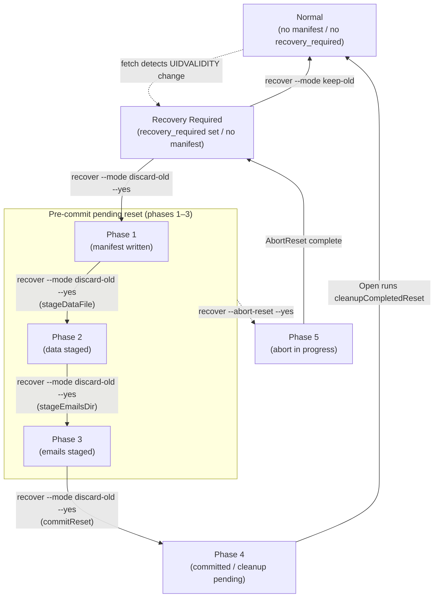

# ADR-0003: Phase Design for ResetForRecovery and Handling of Post-Commit Cleanup

| Item | Content |
|---|---|
| Number | ADR-0003 |
| Status | Accepted |
| Decision date | 2026-05-25 |
| Related task | 0070_entrypoint |

---

## 1. Context

### UIDVALIDITY Changes and Manual Recovery

When an IMAP server changes UIDVALIDITY, the correspondence between existing UIDs and new UIDs is no longer guaranteed. This system records `recovery_required` in the sentinel when it detects this change, and stops subsequent fetch/summary processing. The operator selects one of the following with the `recover` subcommand.

- **keep-old** (`ApplyRecovery`): Migrate to the new UIDVALIDITY while preserving old data.
- **discard-old** (`ResetForRecovery`): Discard all old data and restart with an empty store.

`ResetForRecovery` involves multiple file operations, so even if a crash occurs partway through, it must be possible to resume or abort safely.

### Requirements (from 02_architecture.md)

| Requirement | Content |
|---|---|
| AC-crash-safe | `ResetForRecovery` converges to either "old data preserved + recovery_required remains" or "empty store + new UIDVALIDITY + recovery_required resolved" regardless of the stage at which it crashes |
| AC-abort | `AbortReset` can cancel a pre-commit pending reset and return to a state where old data is preserved |
| AC-fail-closed | If there is a pre-commit pending reset, normal `Open(OpenReadWrite)` fails closed |
| AC-cleanup | A post-commit cleanup failure does not affect the normal data path, and later `Open` or `ResetForRecovery` can perform cleanup again |

---

## 2. Overview of the Phase Design

`ResetForRecovery` records the progress of file operations as `resetPhase` (an integer value) in the reset manifest (`.tlsrpt-digest-reset-manifest.json`). The manifest is the progress ledger for the reset operation, and the sentinel file (`.tlsrpt-digest-meta.json`) holds the user-visible committed state (UIDValidity and the current value of recovery_required).

```
Manifest (progress ledger)
  ↓  records
resetPhase (integer) ─── code decides whether to resume or stop according to the phase

Sentinel (committed state)
  ↓  records
UIDValidity / recovery_required ─── true basis for whether the operation is "committed"
```

---

## 3. Phase List and Roles

| Constant name | Value | Recording timing | Meaning and role |
|---|---|---|---|
| `resetPhaseManifestWritten` | 1 | Before staging starts (write-ahead) | **WAL entry**. From this point, the manifest exists, so `Open(OpenReadWrite)` returns `ErrPendingReset`. Rollback with `AbortReset` becomes possible |
| `resetPhaseDataStaged` | 2 | After staging of `tlsrpt.json` is complete (checkpoint) | Records that renaming the data file is complete. When resuming after a crash from this phase, `stageDataFile` is idempotent (absence of the file is a no-op) |
| `resetPhaseEmailsStaged` | 3 | After staging of `emails/` is complete (checkpoint) | Records that renaming the email directory is complete. Likewise, `stageEmailsDir` is idempotent |
| `resetPhaseCommitted` | 4 | Immediately after saving the sentinel (commit marker) | Records that the write to the sentinel (clearing recovery_required and setting the new UIDVALIDITY) is complete. After this, only the manifest and staging directory remain, so cleanup failure does not affect the normal data path |
| `resetPhaseAborting` | 5 | Before executing `restoreFromStaging` (abort WAL entry) | **WAL entry for the abort operation**. `AbortReset` writes this phase before moving files back to their original locations. Even if the manifest remains after a later crash, `ResetForRecovery` sees this phase, refuses the operation, and prompts re-execution of `AbortReset` |

### State Transition Diagram



Legend: solid = normal transition; dashed = exceptional event (UIDVALIDITY change) or manual abort.

**Crash recovery**: After a crash at any phase, the operation can resume from the same phase (each staging operation is idempotent).

**Commit-window crash**: `commitReset` saves the sentinel before advancing the manifest to phase 4. A crash between those two writes leaves the manifest at phase 3, but `cleanupCompletedReset` uses `recovery_required` in the sentinel (not the phase number) to determine commit status, so cleanup runs the same as for phase 4 and the state converges to Normal (see §4).

### Behavior During User Operations

| State | `recover --mode keep-old` | `recover --mode discard-old` (without `--yes`) | `recover --mode discard-old --yes` | `recover --abort-reset --yes` |
|---|---|---|---|---|
| No manifest and `recovery_required` present | Executes `ApplyRecovery`, updates UIDVALIDITY while preserving old data, and clears `recovery_required` | Only displays the planned operation, performs no destructive changes, and exits 1 | Starts `ResetForRecovery` as a fresh start | Returns `ErrResetNotPending` because there is no pending reset |
| Phases 1-3 (pre-commit pending reset) | Cannot execute because `Open(OpenReadWrite)` returns `ErrPendingReset`. Displays the options to continue or abort | Displays the presence of the pending reset and the options to continue or abort. No destructive changes | Resumes `ResetForRecovery` from the corresponding phase and converges to empty store + current UIDVALIDITY + `recovery_required` resolved | Executes `AbortReset` and returns to old data preserved + `recovery_required` remains |
| Phase 4 or no `recovery_required` (committed) | Cleans up leftover manifest/staging during normal open. After that, treated as no recovery required | Same as left | Cleans up and exits. Effectively idempotent | Returns `ErrResetNotPending` because this is after commit |
| Phase 5 (abort interrupted) | Cannot execute because `Open(OpenReadWrite)` returns `ErrPendingReset`. Prompts completion of abort | Displays the presence of the pending reset and that abort must be completed. No destructive changes | Returns `ErrResetAbortInProgress` and requires completion of `AbortReset` first | Resumes `AbortReset`, idempotently executes `restoreFromStaging`, and removes the manifest |
| Unknown phase, version mismatch, or manifest corruption | Fail closed. Manual confirmation is required | Fail closed. Manual confirmation is required | Fail closed. Manual confirmation is required | Fail closed. Manual confirmation is required |

---

## 4. Detailed Design Rationale for Each Phase

### Reason for Writing Phase 1 (WAL Entry) Before Staging

Writing the manifest also serves as an "operation in progress" flag for `Open(OpenReadWrite)`. By writing this flag first:

- `Open(OpenReadWrite)` can always fail closed (AC-fail-closed)
- `AbortReset` can roll back from any phase

If a crash occurs before writing the flag, the manifest does not exist, so the next execution treats the operation as a "fresh start" and resumes normally after checking recovery_required in the sentinel.

### Reason for Writing Phases 2 and 3 (Checkpoints) After Rename

Because `rename(2)` is an atomic operation guaranteed by POSIX, files are moved only when the operation succeeds. By writing checkpoints after rename, the inference "checkpoint is written = rename is definitely complete" holds. When resuming after a crash:

```
[Checkpoint for phase N is absent]
  → "The operation for phase N may already be complete, or may not have run yet"
  → Re-run the idempotent operation (if the file is absent, no-op)
```

Conversely, if the checkpoint were written before rename, a crash could create a state where the checkpoint was written but the rename was not complete, creating the risk that resume processing would incorrectly judge the operation as complete. This design chose the post-operation checkpoint pattern.

> **Note**: This design guarantees AC-crash-safe, but it assumes the invariant that "phase N has been written = the operation for phase N is complete." The idempotence of each staging function (`stageDataFile` and `stageEmailsDir`) is required to maintain this invariant.

### Reason the Sentinel Is the True Basis for Commit

The marker for phase 4 (`resetPhaseCommitted`) is written **after** `commitReset` saves the sentinel. In other words, "the sentinel has no recovery_required" is equivalent to "the commit is complete," and is more reliable than "the manifest is at phase 4" (because a crash can occur before the update to phase 4 completes).

The following decisions use this property.

| Decision point | Basis used | Reason |
|---|---|---|
| Whether `AbortReset` can roll back | `sentinel.recovery_required != nil` | Prevents "abort after commit" |
| Whether `Open(OpenReadWrite)` can clean up | `sentinel.recovery_required == nil` | Detects "post-commit cleanup failure" and avoids blocking the data path |

### Reason for Providing Phase 5 (Abort WAL Entry)

The operation in which `AbortReset` moves files back to their original locations (`restoreFromStaging`) can crash partway through. After such a crash, the state can be "the manifest remains at phase 3, and files have already been restored to root." If `ResetForRecovery` is executed in this state, it is treated as phase 3, and commit proceeds with empty staging ("new UIDVALIDITY + recovery_required cleared + old data remains in root"), producing an inconsistent state.

To avoid this problem, `AbortReset` always updates the manifest to phase 5 (aborting) before moving any files. If `ResetForRecovery` sees phase 5, it returns `ErrResetAbortInProgress` and requires completion of `AbortReset`.

```
[Behavior when phase 5 is detected]
  ResetForRecovery → refuse (ErrResetAbortInProgress)
  AbortReset       → resume (restoreFromStaging is idempotent) → cleanup
```

---

## 5. Cleanup Design in Open(OpenReadWrite)

### Design Alternatives

| Alternative | Policy | Problem |
|---|---|---|
| A. Decide only from the phase value | Clean up only when the phase is 4 | Cannot handle a commit-window crash (phase 3 + sentinel committed) |
| B. Decide from the sentinel value (accepted) | Clean up if `recovery_required == nil` | Can uniformly handle the commit window without depending on the phase value |

### Cleanup Logic (`cleanupCompletedReset`)

```
1. Read the manifest
   ├─ Absent → do nothing (normal)
   ├─ Version mismatch → error (fail closed)
   └─ Unknown phase → error (fail closed)

2. Read the sentinel
   ├─ Absent → ErrPendingReset (irregular state; fail closed)
   ├─ recovery_required present → ErrPendingReset (operation in progress)
   └─ recovery_required absent → committed → execute cleanup
       ├─ os.RemoveAll(staging) ── best-effort
       └─ os.Remove(manifest)   ── required (if it fails, retry next time)
```

### Covered Scenarios

| Scenario | Manifest phase | sentinel.recovery_required | Result |
|---|---|---|---|
| Operation in progress (pre-commit) | 1-3 | present | ErrPendingReset |
| Abort interrupted | 5 | present | ErrPendingReset |
| Post-commit cleanup failure | 4 | absent | Clean up and open normally |
| Commit-window crash (phase 3 + sentinel committed) | 3 | absent | Clean up and open normally |

---

## 6. Summary of Invariants Between Phases

| Invariant | Where it is guaranteed |
|---|---|
| While phase 1 is written, `Open(OpenReadWrite)` returns ErrPendingReset | `cleanupCompletedReset` checks recovery_required |
| Phase 2 is written => `tlsrpt.json` exists in staging | `stageDataFile` is idempotent; phase 2 is written after rename |
| Phase 3 is written => `emails/` exists in staging | `stageEmailsDir` is idempotent; phase 3 is written after rename |
| Phase 4 or `recovery_required == nil` => the sentinel is committed | `commitReset` writes phase 4 after saving the sentinel |
| Phase 5 is written => only `AbortReset` can continue | `ResetForRecovery` refuses phase 5 |

---

## 7. Future Change and Extension Policy

### When Adding a Phase

1. Define a new `resetPhase` constant (value = current maximum value + 1)
2. Update the upper bound in `validateManifestPhase`
3. Add processing for the new phase to `advanceResetPhases` and `AbortReset`
4. Because `cleanupCompletedReset` uses the sentinel for commit decisions, it is not affected even if the number of phases increases

### When There Are More Files Subject to Staging

- Following `stageDataFile` and `stageEmailsDir`, add a corresponding `stageXxx` function and preserve idempotence
- Add a new checkpoint phase (following the preceding "When Adding a Phase")

### When the Commit Operation Becomes Multiple Steps

The current `commitReset` saves the sentinel in one step, so completion of sentinel save = commit finalized. If a multiple-step commit becomes necessary, it must be designed to maintain the invariant "the final step is complete = commit finalized." If a file other than the sentinel becomes the basis for commit, the decision logic in `cleanupCompletedReset` must be updated.

### When the AbortReset Interruption Logic Becomes Complex

The current abort processing is only one step, phase 5 (aborting). If the abort operation becomes a non-atomic operation spanning multiple files, consider introducing subphases in the same way. In that case, maintain the invariant "phase 5 family = ResetForRecovery prohibited."

---

## 8. Decision on SQLite / RDBMS Migration

### Current Decision

Do not migrate to SQLite or another RDBMS at this point. The current persistence targets are limited to `tlsrpt.json`, `emails/`, the sentinel, the reset manifest, and the staging directory, and phase management in `ResetForRecovery` / `AbortReset` covers the major crash scenarios.

Introducing SQLite would reduce application-side multi-file phase management, but would increase operational and implementation costs such as schema design, existing data migration, driver dependencies, backup, VACUUM, and recovery procedures for DB corruption. At this point, these migration costs are judged to outweigh the simplification that would be gained.

### Pros of SQLite Migration

| Perspective | Content |
|---|---|
| Crash safety | `BEGIN` / `COMMIT` can keep updates to reports, emails, the sentinel, and recovery_required within one transaction |
| Reduction of phase management | Much of the current `resetPhase`, manifest, staging, and abort phase design can be replaced by DB atomic commit |
| Integrity constraints | The correspondence between reports and emails, UIDVALIDITY, recovery_required, and similar data can be expressed more easily with table constraints and transaction boundaries |
| Future search and aggregation | Compared with reading all JSON, conditional search and aggregation by period, UID, domain, and similar keys can be expressed more easily in SQL |
| Explicit migration | Having a schema version makes it easier to manage changes to the persistent format in stages |

### Cons of SQLite Migration

| Perspective | Content |
|---|---|
| Migration cost | Migration from the existing `tlsrpt.json`, `emails/`, and sentinel into the DB, and a rollback policy, become necessary |
| Driver dependency | `github.com/mattn/go-sqlite3` requires CGO and affects distribution and cross-builds. If a pure Go driver is selected, compatibility and performance must still be checked |
| Operational files | If WAL mode is used, `store.db-wal` / `store.db-shm` must be included in backup, permission, and deletion procedures in addition to `store.db` |
| Size management | If `.eml` is stored as BLOBs, a policy for DB size, GC, VACUUM / incremental VACUUM is required |
| Inspectability | If `.eml` is stored inside the DB rather than as normal files, manual investigation and emergency recovery must go through SQL or a dedicated tool |
| Handling corruption | Procedures for detecting DB file corruption, restoring from backup, and partial recovery must be defined anew |

### Reconsideration Conditions

Reconsider migration to SQLite / RDBMS if any of the following occur.

- Crash-safe update operations spanning multiple files increase in addition to `ResetForRecovery`
- Additions of `stageXxx` and corresponding phases repeat, making the state space of `resetPhase` difficult to understand operationally
- A stronger guarantee becomes necessary for the correspondence between reports and `.eml`
- The number of managed persistence files increases, making manual recovery procedures more complex than they are now
- Reading all JSON becomes a problem for the performance or implementation of search, aggregation, or GC
- Migration of the persistent format becomes continuously necessary, making schema management simpler than file-by-file migration
- In backup and recovery operations, it becomes difficult to "save multiple files at a consistent point in time"

### Design Policy at Migration Time

When migrating to SQLite, do not partially move only reports to the DB; instead, consolidate reports, emails, the sentinel, and recovery_required into the same DB as much as possible. If `.eml` remains on the file system, the two-phase commit problem between the DB and files remains, and complexity of the same kind as the current phase management reappears.

Because the access frequency is about once per hour for `fetch`, about once per week for `summary`, and less than once per week for `gc`, the primary purpose of the initial migration is not read/write concurrency performance, but crash safety and simplification of state management. WAL mode is not required; it is acceptable to design first around rollback journal mode, short transactions, and the existing process exclusive lock.

---

## 9. Related Files

| File | Role |
|---|---|
| `internal/store/recovery.go` | Implementation of `resetPhase`, `resetManifest`, `ResetForRecovery`, `AbortReset`, and `cleanupCompletedReset` |
| `internal/store/store.go` | Calls `cleanupCompletedReset` from the `Open` function |
| `internal/store/errors.go` | Defines `ErrPendingReset`, `ErrResetNotPending`, `ErrResetManifestVersionMismatch`, `ErrResetManifestPhaseUnknown`, and `ErrResetAbortInProgress` |
| `internal/store/recovery_test.go` | Crash scenario tests for each phase |
| `internal/store/store_test.go` | Tests for cleanup behavior during `Open` |
