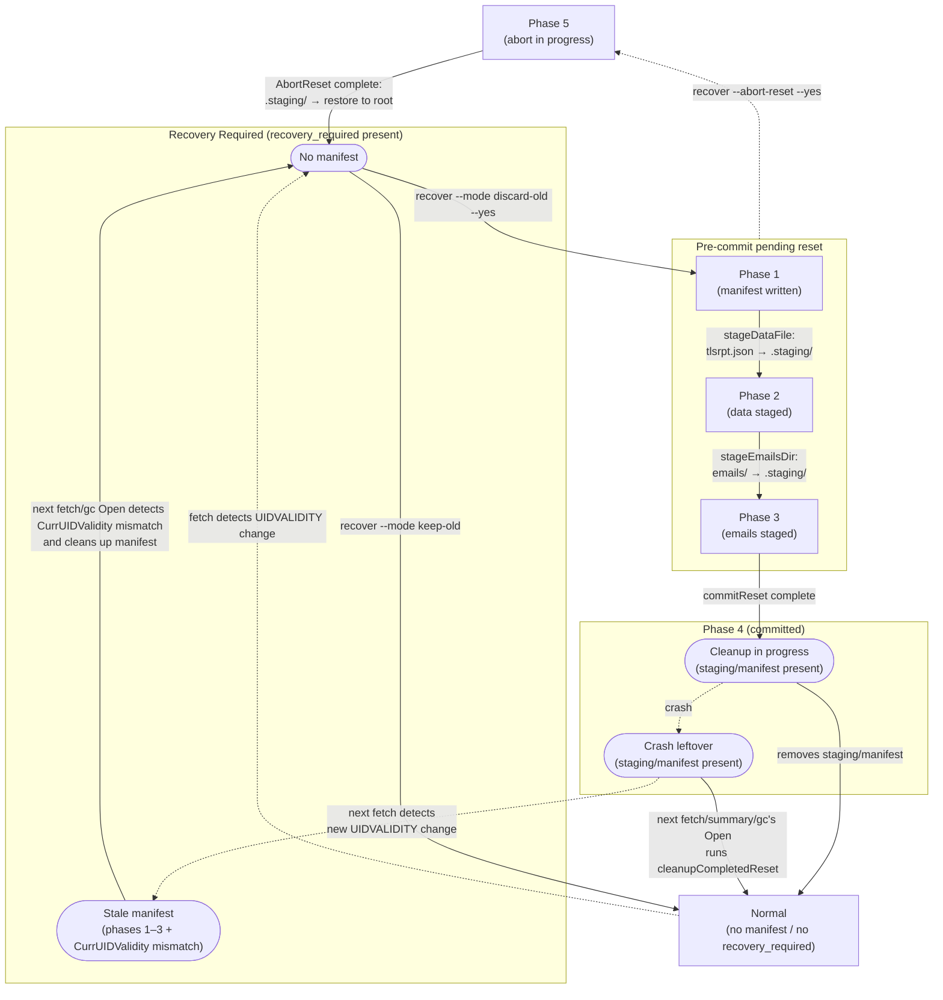

# ADR-0003: Phase Design for ResetForRecovery and Handling of Post-Commit Cleanup

| Item | Content |
|---|---|
| Number | ADR-0003 |
| Status | Accepted |
| Decision date | 2026-05-25 |
| Last updated | 2026-05-29 |
| Related task | 0070_entrypoint |

---

## 1. Context

### Store Overview

This system stores data in a specified directory (hereinafter "the store"). The normal configuration of the store is shown below.

| File/Directory | Contents |
|---|---|
| `tlsrpt.json` | Parsed TLSRPT reports (RFC 8460 JSON, hereinafter "reports") extracted and accumulated from emails fetched by `fetch`. `summary` aggregates this data and sends notifications. |
| `emails/` | Collected emails (`.eml` files) |
| Sentinel (`.tlsrpt-digest-meta.json`) | Metadata file recording `UIDValidity` and `recovery_required` |

### UIDVALIDITY Changes and Manual Recovery

When an IMAP server changes UIDVALIDITY, the correspondence between existing UIDs and new UIDs is no longer guaranteed. This system records `recovery_required` in the sentinel when it detects this change, and stops subsequent fetch/summary processing. The operator selects one of the following with the `recover` subcommand.

- **keep-old** (`ApplyRecovery`): Migrate to the new UIDVALIDITY while preserving old data.
- **discard-old** (`ResetForRecovery`): Discard all old data and restart with an empty store.

`ResetForRecovery` involves multiple file operations, so even if a crash occurs partway through, it must be possible to resume or abort safely.

In this document, the series of operations performed by `ResetForRecovery` is called a **reset**. The intermediate state from the start of a reset until the commit is complete (the write clearing `recovery_required` in the sentinel is complete) is called a **pending reset**. In code, this is referenced as `ErrPendingReset` and `HasPendingReset()`. Note: `HasPendingReset()` returns false for phase=committed manifests (post-commit cleanup residue), which are not an active pending reset.

### Requirements (from 02_architecture.md)

| Requirement | Content |
|---|---|
| AC-crash-safe | `ResetForRecovery` converges to either "old data preserved + recovery_required remains" or "empty store + new UIDVALIDITY + recovery_required resolved" regardless of the stage at which it crashes |
| AC-abort | `AbortReset` can cancel a pre-commit pending reset and return to a state where old data is preserved |
| AC-fail-closed | If there is a pre-commit pending reset, normal `Open(OpenReadWrite)` fails closed |
| AC-cleanup | A post-commit cleanup failure does not affect the normal data path, and later `Open` or `ResetForRecovery` can perform cleanup again |

---

## 2. Overview of the Phase Design

`ResetForRecovery` records the progress of file operations as `resetPhase` (an integer value) in the reset manifest (`.tlsrpt-digest-reset-manifest.json`). The reset operation is managed with the following three types of files and directories.

| File/Directory | Recorded content | Role |
|---|---|---|
| Manifest (`.tlsrpt-digest-reset-manifest.json`) | `resetPhase` (integer 1–5) | Progress ledger for the reset operation. Used to decide where to resume or stop after a crash. |
| Sentinel (`.tlsrpt-digest-meta.json`) | `UIDValidity`, `recovery_required` | Committed-state ledger. `recovery_required == nil` is the authoritative signal that the commit is complete. |
| Staging directory (`.tlsrpt-digest-staging/`) | `tlsrpt.json`, `emails/` (old data during reset) | Temporary holding location for old data before commit. Before commit, `AbortReset` can restore files from staging to their original location. After commit, the data is discarded as old data. |

The **staging directory** (`.tlsrpt-digest-staging/`) is the dedicated directory where `ResetForRecovery` temporarily holds old data. During a reset, `tlsrpt.json` and `emails/` are atomically moved into this directory via the `rename(2)` system call (an atomic operation guaranteed by POSIX). Before commit, `AbortReset` can restore files from staging back to their original location (directly under the store directory). After commit, they are discarded as old data.

---

## 3. Phase List and Roles

> **Design pattern note**: Phase 1 uses the "write-ahead (WAL: Write-Ahead Log)" pattern, and phases 2 and 3 use the "write-after (checkpoint)" pattern. Write-ahead records the operation before it starts to guarantee resumption after a crash; write-after records after the operation completes to enable idempotent re-execution. Details are explained in §4.

| Constant name | Value | Recording timing | Meaning and role |
|---|---|---|---|
| `resetPhaseManifestWritten` | 1 | Before staging starts (write-ahead) | **WAL entry**. From this point, the manifest exists, so `Open(OpenReadWrite)` returns `ErrPendingReset`. Rollback with `AbortReset` becomes possible. |
| `resetPhaseDataStaged` | 2 | After staging of `tlsrpt.json` is complete (checkpoint) | Records that renaming the data file is complete. When resuming after a crash from this phase, `stageDataFile` is idempotent (absence of the file is a no-op) |
| `resetPhaseEmailsStaged` | 3 | After staging of `emails/` is complete (checkpoint) | Records that renaming the email directory is complete. Likewise idempotent. |
| `resetPhaseCommitted` | 4 | Immediately after saving the sentinel (commit marker) | Records that the write to the sentinel (clearing recovery_required and setting the new UIDVALIDITY) is complete. After this, only the manifest and staging directory remain, so cleanup failure does not affect the normal data path |
| `resetPhaseAborting` | 5 | Before executing `restoreFromStaging` (abort WAL entry) | **WAL entry for the abort operation**. `AbortReset` writes this phase before moving files back to their original locations. Even if the manifest remains after a later crash, `ResetForRecovery` sees this phase, refuses the operation, and prompts re-execution of `AbortReset` |

### Phase-by-Phase File Layout

The table below shows the primary files present in the store directory (`{root_dir}/`) and the staging directory at each phase.

| Phase | Store directory | Staging (`.tlsrpt-digest-staging/`) |
|---|---|---|
| Normal / Recovery required | `tlsrpt.json`, `emails/` | none |
| Phase 1 (manifest written) | `tlsrpt.json`, `emails/` | empty directory (created) |
| Phase 2 (data staged) | `emails/` only | `tlsrpt.json` |
| Phase 3 (emails staged) | none | `tlsrpt.json`, `emails/` (old) |
| Phase 4 (committed / cleanup pending) | none | `tlsrpt.json`, `emails/` (old) |

The transition from phase 4 to Normal (cleanup) is executed inside `Open(OpenReadWrite)`. Staging deletion and re-initialization of `tlsrpt.json` and `emails/` complete within the same Open call, after which the state returns to Normal.

### State Transition Diagram



Legend: rectangle = disk state; stadium shape = substate within subgraph; solid line = normal transition; dashed line = exceptional event (crash or UIDVALIDITY change) or manual abort.

**Crash recovery**: After a crash at any phase, the operation can resume from the same phase (each staging operation is idempotent). If the process stops at phases 1–3, re-running `recover --mode discard-old --yes` resumes from the current phase automatically.

**Commit-window crash** (the window between sentinel save completing and the phase 4 update completing)

`commitReset` saves the sentinel before advancing the manifest to phase 4. A crash between those two writes leaves the manifest at phase 3.

- **Normal convergence**: `cleanupCompletedReset` uses `recovery_required` in the sentinel (not the phase number) to determine commit status, so cleanup runs the same as for phase 4 and the state converges to Normal (see §4). Data integrity is preserved.
- **When the manifest persists**: If `cleanupCompletedReset` succeeds in removing staging but fails to remove the manifest (best-effort), the manifest remains on disk at phase 3. What happens next depends on subsequent events:
  - If a new UIDVALIDITY change occurs: `Open(OpenReadWrite)` → `cleanupCompletedReset` detects the `CurrUIDValidity` mismatch and cleans up the manifest/staging (Open succeeds). Both `recover --mode keep-old` and `recover --mode discard-old --yes` then work normally. `recover --abort-reset --yes` causes `AbortReset` to detect the mismatch and return `ErrResetNotPending`.
  - If no new UIDVALIDITY change occurs: the next time `fetch` or `gc` runs, `Open(OpenReadWrite)` → `cleanupCompletedReset` retries the removal.

Since `fetch` and `gc` are expected to run periodically, storage capacity estimates should account for one staging directory's worth of old data as a temporary overhead.

### Behavior During User Operations

| State | `recover --mode keep-old` | `recover --mode discard-old` (without `--yes`) | `recover --mode discard-old --yes` | `recover --abort-reset --yes` |
|---|---|---|---|---|
| No manifest and `recovery_required` present | Executes `ApplyRecovery`, updates UIDVALIDITY while preserving old data, and clears `recovery_required` | Only displays the planned operation, performs no destructive changes, and exits 1 | Starts `ResetForRecovery` as a fresh start | Returns `ErrResetNotPending` because there is no pending reset |
| Phases 1-3 (pre-commit pending reset, CurrUIDValidity match) | Cannot execute because `Open(OpenReadWrite)` returns `ErrPendingReset`. Displays the options to continue or abort | Displays the presence of the pending reset and the options to continue or abort. No destructive changes | Resumes `ResetForRecovery` from the corresponding phase and converges to empty store + current UIDVALIDITY + `recovery_required` resolved | Executes `AbortReset` and returns to old data preserved + `recovery_required` remains |
| Phases 1-3 (stale manifest, CurrUIDValidity mismatch) | `cleanupCompletedReset` removes the manifest and Open succeeds. Executes `ApplyRecovery` | Same as left (Open succeeds; display only) | `cleanupCompletedReset` removes the manifest and Open succeeds. Starts `ResetForRecovery` as a fresh start | `AbortReset` detects the mismatch, removes the manifest, and returns `ErrResetNotPending` |
| Phase 4 or no `recovery_required` (committed) | Cleans up leftover manifest/staging during normal open. After that, treated as no recovery required | Same as left | Cleans up and exits. Effectively idempotent | Returns `ErrResetNotPending` because this is after commit |
| Phase 5 (abort interrupted) | Cannot execute because `Open(OpenReadWrite)` returns `ErrPendingReset`. Prompts completion of abort | Displays the presence of the pending reset and that abort must be completed. No destructive changes | Returns `ErrResetAbortInProgress` and requires completion of `AbortReset` first | Resumes `AbortReset`, idempotently executes `restoreFromStaging`, and removes the manifest |
| Unknown phase, version mismatch, or manifest corruption | Fail closed. Manual confirmation is required | Fail closed. Manual confirmation is required | Fail closed. Manual confirmation is required | Fail closed. Manual confirmation is required |

---

## 4. Detailed Design Rationale for Each Phase

### Reason for Writing Phase 1 (WAL Entry) Before Staging

Writing the manifest also serves as an "operation in progress" flag for `Open(OpenReadWrite)`. By writing this flag first:

- `Open(OpenReadWrite)` can always fail closed (AC-fail-closed)
- `AbortReset` can roll back from any phase

If a crash occurs before writing the flag, the manifest does not exist, so the next execution treats the operation as a "fresh start" and resumes normally after checking recovery_required in the sentinel.

### Reason for Writing Phases 2 and 3 (Checkpoints) After Rename

Because `rename(2)` is an atomic operation guaranteed by POSIX, files are moved only when the operation succeeds. By writing checkpoints after rename, the following inferences hold when resuming after a crash:

| Checkpoint for phase N | Inference | Action on resume |
|---|---|---|
| Present | Rename is definitely complete | Skip |
| Absent | May already be complete, or may not have run | Re-run the idempotent operation (if file absent, no-op) |

Conversely, if the checkpoint were written before rename, a crash could create a state where the checkpoint was written but the rename was not complete, creating the risk that resume processing would incorrectly judge the operation as complete. This design chose the post-operation checkpoint pattern.

> **Note**: This design guarantees AC-crash-safe, but it assumes the invariant that "phase N has been written = the operation for phase N is complete." The idempotence of each staging function (`stageDataFile` and `stageEmailsDir`) is required to maintain this invariant.

### Reason the Sentinel Is the True Basis for Commit

The marker for phase 4 (`resetPhaseCommitted`) is written **after** `commitReset` saves the sentinel. In other words, "the sentinel has no recovery_required" is equivalent to "the commit is complete," and is more reliable than "the manifest is at phase 4" (because a crash can occur before the update to phase 4 completes).

The following decisions use this property.

| Decision point | Basis used | Reason |
|---|---|---|
| Whether `AbortReset` can roll back | `sentinel.recovery_required != nil` | Prevents "abort after commit" |
| Whether `Open(OpenReadWrite)` can clean up | `sentinel.recovery_required == nil` | Detects "post-commit cleanup failure" and avoids blocking the data path |

### Reason for Providing Phase 4 (Commit Marker)

Although `recovery_required == nil` alone is sufficient to determine that the commit is complete, phase 4 exists in order to **keep the meaning of phase 3 unambiguous in `advanceResetPhases` (the re-execution path of `recover --mode discard-old --yes`)**.

Without phase 4, a crash immediately after commit leaves the manifest at phase 3. If `recover --mode discard-old --yes` is re-run in this state, `advanceResetPhases` interprets phase 3 as "pre-commit" and calls `commitReset` again. `commitReset` is idempotent with respect to rewriting the sentinel, so this does not cause corruption, but phase 3 ends up carrying two meanings: "pre-commit (emails staged)" and "crash window after commit," making the control flow ambiguous.

By providing phase 4, `advanceResetPhases` can make its decision without reading the sentinel.

| Phase | Meaning | `advanceResetPhases` behavior |
|---|---|---|
| 3 | Pre-commit (emails staged) | Calls `commitReset` |
| 4 | Committed (cleanup pending) | Proceeds directly to `cleanupCompletedReset` |

On the other hand, `cleanupCompletedReset` inside `Open(OpenReadWrite)` uses the sentinel for its decision (because it also needs to catch a "commit-window crash" where the manifest remains at phase 3). Phase 4 and the sentinel are used separately depending on the calling path.

### Reason for Providing Phase 5 (Abort WAL Entry)

The operation in which `AbortReset` moves files back to their original locations (`restoreFromStaging`) can crash partway through. After such a crash, the state can be "the manifest remains at phase 3, and files have already been restored to root." If `ResetForRecovery` is executed in this state, it is treated as phase 3, and commit proceeds with empty staging ("new UIDVALIDITY + recovery_required cleared + old data remains in root"), producing an inconsistent state.

To avoid this problem, `AbortReset` always updates the manifest to phase 5 (aborting) before moving any files. If `ResetForRecovery` sees phase 5, it returns `ErrResetAbortInProgress` and requires completion of `AbortReset`.

| When phase 5 is detected | Behavior |
|---|---|
| `ResetForRecovery` | Refused (`ErrResetAbortInProgress`) |
| `AbortReset` | Resumes (`restoreFromStaging` is idempotent) → cleanup |

---

## 5. Cleanup Design in Open(OpenReadWrite)

### Design Alternatives

| Alternative | Policy | Problem |
|---|---|---|
| A. Decide only from the phase value | Clean up only when the phase is 4 | Cannot handle a commit-window crash (phase 3 + sentinel committed) |
| B. Decide from the sentinel value (accepted) | Clean up if `recovery_required == nil` | Can uniformly handle the commit window without depending on the phase value |

### Cleanup Logic (`cleanupCompletedReset`)

```
1. Read the manifest
   ├─ Absent → remove orphaned staging directory on a best-effort basis and return normally (see note below)
   ├─ Version mismatch → error (fail closed)
   └─ Unknown phase → error (fail closed)

2. Read the sentinel
   ├─ Absent → ErrPendingReset (irregular state; fail closed)
   ├─ recovery_required present and manifest.CurrUIDValidity == recovery_required.CurrUIDValidity → ErrPendingReset (operation in progress)
   ├─ recovery_required present and manifest.CurrUIDValidity ≠ recovery_required.CurrUIDValidity → stale manifest → clean up and return normally (see note ※② below)
   └─ recovery_required absent → committed → execute cleanup
       ├─ os.RemoveAll(staging) ── best-effort
       └─ os.Remove(manifest)   ── best-effort (logs a warning on failure; retried on the next Open call)
```

**※① Handling of Orphaned Staging**

When a staging directory remains despite the manifest being absent, it means that in the previous reset, `Remove(manifest)` succeeded but `RemoveAll(staging)` failed. Because the WAL entry for the manifest (phase 1) is always written before any file is moved, no manifest means either "completed" or "not yet started," and the staging contents will never be used for restoration. Therefore it is safe to delete them on a best-effort basis.

**※② Handling of Stale Manifests**

When `manifest.CurrUIDValidity ≠ recovery_required.CurrUIDValidity`, the manifest is leftover cleanup residue from a previous reset (one that handled a different UIDVALIDITY change). Because it is unrelated to the current `recovery_required`, the manifest/staging are removed on a best-effort basis and the function returns normally. This allows `Open(OpenReadWrite)` to succeed so that `recover --mode keep-old` and status display become available.

### Covered Scenarios

| Scenario | Manifest presence | sentinel.recovery_required | Result |
|---|---|---|---|
| Operation in progress (pre-commit, CurrUIDValidity match) | present (1-3) | present (CurrUIDValidity match) | ErrPendingReset |
| Abort interrupted | present (5) | present | ErrPendingReset |
| Stale manifest (CurrUIDValidity mismatch) | present (1-3) | present (CurrUIDValidity mismatch) | Clean up manifest/staging and open normally (※②) |
| Post-commit cleanup failure | present (4) | absent | Clean up and open normally |
| Commit-window crash (phase 3 + sentinel committed) | present (3) | absent | Clean up and open normally |
| Orphaned staging (staging deletion failed after manifest deletion) | absent | absent | Remove staging on a best-effort basis and open normally (※①) |

---

## 6. Summary of Invariants Between Phases

| Invariant | Where it is guaranteed |
|---|---|
| While phase 1 is written, `Open(OpenReadWrite)` returns ErrPendingReset | `cleanupCompletedReset` checks recovery_required |
| Phase 2 is written => `tlsrpt.json` exists in staging | `stageDataFile` is idempotent; phase 2 is written after rename |
| Phase 3 is written => `emails/` exists in staging | `stageEmailsDir` is idempotent; phase 3 is written after rename |
| Phase 4 or `recovery_required == nil` => the sentinel is committed | `commitReset` writes phase 4 after saving the sentinel |
| Phase 5 is written => only `AbortReset` can continue | `ResetForRecovery` refuses phase 5 |
| **Manifest absent ⟹ staging contents are leftover residue (safe to remove)** | WAL design: phase 1 is written before any file is moved to staging; if the manifest is absent, no file was moved (or it is residue from a completed cleanup) |

---

## 7. Future Change and Extension Policy

### When Adding a Phase

1. Define a new `resetPhase` constant (value = current maximum value + 1)
2. Update the upper bound in `validateManifestPhase`
3. Add processing for the new phase to `advanceResetPhases` and `AbortReset`
4. Because `cleanupCompletedReset` uses the sentinel for commit decisions, it is not affected even if the number of phases increases

### When There Are More Files Subject to Staging

- Following `stageDataFile` and `stageEmailsDir`, add a corresponding `stageXxx` function and preserve idempotence
- Add a new checkpoint phase (following the preceding "When Adding a Phase")
- **Also update `cleanupCompletedReset` for orphaned staging deletion**: the current implementation uses `RemoveAll` on the entire `resetStagingPath` directory, so new sub-paths added inside the directory are automatically covered. If staging is extended to files outside the staging directory, add corresponding deletion logic to `cleanupCompletedReset`.

### When the Commit Operation Becomes Multiple Steps

The current `commitReset` saves the sentinel in one step, so completion of sentinel save = commit finalized. If a multiple-step commit becomes necessary, it must be designed to maintain the invariant "the final step is complete = commit finalized." If a file other than the sentinel becomes the basis for commit, the decision logic in `cleanupCompletedReset` must be updated.

### When the AbortReset Interruption Logic Becomes Complex

The current abort processing is only one step, phase 5 (aborting). If the abort operation becomes a non-atomic operation spanning multiple files, consider introducing subphases in the same way. In that case, maintain the invariant "phase 5 family = ResetForRecovery prohibited."

---

## 8. Evaluation of Alternative Storage Technologies

### Current Decision

Do not migrate from the file-based design at this point. The current persistence targets are limited to `tlsrpt.json`, `emails/`, the sentinel, the reset manifest, and the staging directory, and the major crash scenarios are already covered by phase management in `ResetForRecovery` / `AbortReset`. The migration cost is judged to outweigh the simplification that would be gained.

### Overview Comparison

| Alternative | CGO | SQL | Primary applicability |
|---|---|---|---|
| SQLite (`mattn/go-sqlite3`) | Required | Yes | When SQL and schema management become necessary |
| Pure Go SQLite (`modernc.org/sqlite`) | Not required | Yes | When SQL is needed while avoiding CGO |
| bbolt | Not required | No | When only atomicity guarantees for state management are needed |
| Pebble | Not required | No | When high write throughput is needed (overkill for this use case) |

---

### SQLite (`mattn/go-sqlite3`)

CGO-based SQLite bindings. The most widely used option.

**Pros**

| Perspective | Content |
|---|---|
| Crash safety | `BEGIN` / `COMMIT` can keep updates to reports, the sentinel, and recovery_required within one transaction |
| Reduction of phase management | Much of the current `resetPhase`, manifest, staging, and abort phase design can be replaced by DB atomic commit |
| Integrity constraints | UIDVALIDITY, recovery_required, and similar data can be expressed easily with table constraints and transaction boundaries |
| Future search and aggregation | Conditional search and aggregation by period, UID, domain, and similar keys can be expressed easily in SQL |
| Explicit migration | Having a schema version makes it easier to manage changes to the persistent format in stages |

**Cons**

| Perspective | Content |
|---|---|
| CGO dependency | Cross-builds are difficult. Setup costs for CI and distribution environments increase |
| Migration cost | Migration from the existing files into the DB, and a rollback policy, become necessary |
| Operational files | In WAL mode, `store.db-wal` / `store.db-shm` must be included in backup procedures |
| Size management | If `.eml` is stored as BLOBs, a policy for VACUUM / incremental VACUUM is required |
| Inspectability | If `.eml` is stored inside the DB, manual investigation and emergency recovery must go through SQL or a dedicated tool |
| Handling corruption | Procedures for detecting DB file corruption and restoration must be defined anew |

---

### Pure Go SQLite (`modernc.org/sqlite`)

An automatic pure Go translation of the SQLite C source. The API is largely compatible with `mattn/go-sqlite3`.

**Pros**

| Perspective | Content |
|---|---|
| No CGO | Cross-builds are straightforward. No impact on distribution environments |
| Full SQLite functionality | WAL, transactions, constraints, and all other SQLite pros apply as-is |
| Low migration cost | High API compatibility with `mattn/go-sqlite3`; in many cases a driver swap is sufficient |

**Cons**

| Perspective | Content |
|---|---|
| Slightly lower performance | Generally slower than the CGO version (roughly 1.5–2× for read-heavy workloads as a guideline). Not expected to be a problem at this project's access frequency |
| Inherits SQLite cons | VACUUM, WAL file management, corruption handling, and other SQLite cons remain unchanged |

**Evaluation for this project**

The first choice when SQL and schema management are needed while avoiding CGO. Compared with `mattn/go-sqlite3`, the only meaningful additional cost is the performance gap.

---

### bbolt

A pure Go B+ tree KV store with production usage in etcd and Kubernetes.

**Pros**

| Perspective | Content |
|---|---|
| Pure Go | No CGO required. No impact on cross-builds |
| ACID transactions | `db.Update(func(tx) error { ... })` enables atomic updates spanning multiple buckets. Crash-safe |
| Simple API | Only buckets (namespaces) and key-value pairs. Low learning curve |
| Single file | Complete in one `.db` file (plus a lock file). No WAL auxiliary files |
| Track record | Long-running production usage in etcd, InfluxDB, and others |
| Fit for this use case | Sufficient for atomic updates of the sentinel, manifest, recovery_required, and reports. No SQL needed given there are currently no search or aggregation requirements |

**Cons**

| Perspective | Content |
|---|---|
| No SQL | Search and aggregation must be implemented in application code |
| Implicit schema | The KV mapping is defined in application logic, so there are no DB-side type constraints or foreign keys |
| Handling `.eml` | `.eml` is kept on the filesystem rather than stored in bbolt (see rationale below). The two-phase commit problem with bbolt remains but is manageable |
| Migration representation | Schema versioning must be designed in application code |

**Why `.eml` is kept on the filesystem**

| Reason | Detail |
|---|---|
| Memory pressure from mmap | bbolt mmaps all data, so storing a large number of `.eml` files of hundreds of KB to several MB each causes page-cache pressure |
| Write-lock contention | `db.Update` holds a write lock over the entire DB, so writing a large BLOB blocks all other operations for its duration |
| No automatic space reclamation | bbolt has no VACUUM equivalent; after deleting `.eml` entries the DB file does not shrink. A `Compact`-equivalent operation would need to be implemented and run during each gc pass |
| Inspectability and manual recovery | Files on the filesystem can be inspected and re-sent directly with tools like `cat` or `mutt`. BLOBs stored inside bbolt require custom tooling or Go code, increasing the cost of manual recovery |

**Evaluation for this project**

A design that keeps `.eml` on the filesystem while atomically updating sentinel, recovery_required, UIDVALIDITY, and report metadata in bbolt transactions is natural. Much of the current phase management (resetPhase, manifest, staging) can be replaced by a single `db.Update`. However, because `.eml` and metadata still have the two-phase commit problem, operations that add or remove `.eml` files (saving during fetch, deleting during gc) require explicit crash-safe ordering design.

---

### Pebble

A pure Go LSM tree KV store by the CockroachDB team. Write throughput is higher than bbolt, but there is no benefit at this project's access frequency (fetch approximately once per hour). Configuration and tuning is more complex than bbolt, making it overkill at this time.

---

### Reconsideration Conditions

Reconsider migration if any of the following occur.

- Crash-safe update operations spanning multiple files increase in addition to `ResetForRecovery`
- Additions of `stageXxx` and corresponding phases repeat, making the state space of `resetPhase` difficult to understand operationally
- A stronger guarantee becomes necessary for the correspondence between reports and `.eml`
- The number of managed persistence files increases, making manual recovery procedures more complex than they are now
- Reading all JSON becomes a problem for the performance or implementation of search, aggregation, or GC
- Migration of the persistent format becomes continuously necessary, making schema management simpler than file-by-file migration
- In backup and recovery operations, it becomes difficult to save multiple files at a consistent point in time

### Design Policy at Migration Time

When migrating to **SQLite** (`mattn/go-sqlite3` or `modernc.org/sqlite`), do not partially move only reports to the DB; instead, consolidate reports, the sentinel, and recovery_required into the same DB. If `.eml` remains on the file system, the two-phase commit problem between the DB and files remains, and complexity of the same kind as the current phase management reappears.

When migrating to **bbolt**, the practical design is to consolidate metadata (sentinel, recovery_required, UIDVALIDITY, and report metadata) into bbolt and keep `.eml` on the filesystem. In this case, operations involving adding or removing `.eml` files (saving during fetch, deleting during gc) require explicit design of the ordering between bbolt transactions and file operations to maintain crash safety.

In either case, because the access frequency is low (fetch approximately once per hour, summary approximately once per week, gc less than once per week), the primary purpose of the initial migration is not read/write concurrency performance, but crash safety and simplification of state management.

---

## 9. Related Files

| File | Role |
|---|---|
| `internal/store/recovery.go` | Implementation of `resetPhase`, `resetManifest`, `ResetForRecovery`, `AbortReset`, and `cleanupCompletedReset` |
| `internal/store/store.go` | Calls `cleanupCompletedReset` from the `Open` function |
| `internal/store/errors.go` | Defines `ErrPendingReset`, `ErrResetNotPending`, `ErrResetManifestVersionMismatch`, `ErrResetManifestPhaseUnknown`, and `ErrResetAbortInProgress` |
| `internal/store/recovery_test.go` | Crash scenario tests for each phase |
| `internal/store/store_test.go` | Tests for cleanup behavior during `Open` |
