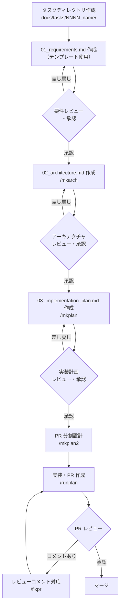

# 開発者オンボーディングガイド

このドキュメントは新しく開発に参加するエンジニア向けのガイドです。開発環境のセットアップから機能開発・PR マージまでの流れを説明します。

---

## 1. 開発環境のセットアップ

### 推奨：VS Code + devcontainer

VS Code の [Dev Containers](https://marketplace.visualstudio.com/items?itemName=ms-vscode-remote.remote-containers) 拡張機能を使う方法を推奨します。コンテナ内に Go・golangci-lint・gofumpt などの必要ツールがすべて含まれているため、ホスト環境に依存しません。ホスト OS は Linux・macOS・Windows のいずれでも構いません。

**手順：**

1. [VS Code](https://code.visualstudio.com/) と [Docker](https://www.docker.com/) をインストールする
2. VS Code に [Dev Containers 拡張機能](https://marketplace.visualstudio.com/items?itemName=ms-vscode-remote.remote-containers) をインストールする
3. **ホスト環境**でリポジトリをクローンする
   ```bash
   git clone https://github.com/isseis/tlsrpt-digest.git
   ```
4. VS Code でクローンしたディレクトリを開く（`code tlsrpt-digest`、またはメニューから「フォルダを開く」）
5. VS Code が devcontainer の設定を検出したら「Reopen in Container」を選択する
6. コンテナが起動したら、VS Code のターミナル内（コンテナ内）でビルドを確認する
   ```bash
   make build && make test && make lint
   ```

### ローカル環境で直接セットアップする場合

devcontainer を使わない場合は以下のツールをインストールしてください。

| ツール | 用途 | バージョン |
|---|---|---|
| Go | ビルド・テスト | 1.26 以上 |
| golangci-lint | 静的解析 | 最新 |
| gofumpt | コードフォーマット | 最新 |
| Claude Code | AI 支援開発 | 最新 |

インストール後、リポジトリをクローンしてビルドを確認します。

```bash
git clone https://github.com/isseis/tlsrpt-digest.git
cd tlsrpt-digest

make build && make test && make lint
```

すべてエラーなく完了すれば環境構築は完了です。

---

## 2. コードベースの概要

プロジェクトの全体設計については [プロジェクト概要](../../overview.ja.md) を参照してください。各パッケージの責務は [パッケージリファレンス](package_reference.md) に記載されています。

主要ディレクトリ：

```
tlsrpt-digest/
├── cmd/tlsrpt-digest/   # エントリポイント・サブコマンド
├── internal/            # 各パッケージ（imap / tlsrpt / notify / store 等）
├── docs/
│   ├── overview.ja.md   # プロジェクト概要
│   ├── dev/             # 開発者向けドキュメント
│   └── tasks/           # タスクごとの設計・実装ドキュメント
└── testdata/            # テスト用実メールデータ
```

---

## 3. 開発の進め方

本プロジェクトでは、新機能の開発を **要件定義 → アーキテクチャ設計 → 実装計画 → 実装** の順で進めます。各フェーズは人間によるレビューと承認を経てから次へ進みます。Claude Code のスラッシュコマンドが各フェーズのドキュメント生成を支援します。

### 全体フロー



---

## 4. 各ステップの詳細

### ステップ 1：タスクディレクトリの作成

`docs/tasks/` 配下に `NNNN_タスク名` 形式のディレクトリを作成します。`NNNN` は既存タスクの最大番号 + 1 の 4 桁連番です。

```bash
mkdir docs/tasks/0042_new_feature
```

### ステップ 2：要件定義書の作成（`01_requirements.md`）

`docs/tasks/0000_template/01_requirements.ja.md` をコピーして編集します。

**記載必須項目：**
- 背景と目的
- スコープ（対象範囲・対象外）
- 機能要件と **受け入れ基準（`AC-NN`）**：各基準は独立して検証可能な具体的な振る舞いとして記述する
- 非機能要件・制約

受け入れ基準の詳細な書き方は [要件と受け入れ基準のプロセス](requirements_process.ja.md) を参照してください。

> **重要：** ドキュメントは必ず `draft` 状態で作成します。レビュー・承認前に次のステップへ進んではいけません。

### ステップ 3：要件定義書のレビューと承認

レビュアーがレビューし、問題なければドキュメント先頭のステータス欄を更新します。

```markdown
## ドキュメントステータス

| 項目 | 内容 |
|---|---|
| ステータス | `approved` |
| 作成日 | YYYY-MM-DD |
| レビュー日 | YYYY-MM-DD |
| レビュアー | 氏名 |
| コメント | - |
```

### ステップ 4：アーキテクチャ設計書の作成（`/mkarch`）

Claude Code で `/mkarch` を実行します。タスクディレクトリを引数で指定することもできます。

```
/mkarch
/mkarch 0042        # タスク番号で明示指定
```

コマンドは現在のコードベースを調査し、`02_architecture.md` を生成します。設計書には Mermaid ダイアグラム、コンポーネント構成、エラーハンドリング設計、テスト戦略などが含まれます。生成後に自動レビューが走り、問題があれば修正されます。

コマンドがタスクディレクトリを特定する仕組みは [タスク識別](task_identification.ja.md) を参照してください。

### ステップ 5：アーキテクチャ設計書のレビューと承認

人間がレビューし、承認されたらステータスを `approved` に更新します。

### ステップ 6：実装計画書の作成（`/mkplan`）

```
/mkplan
/mkplan 0042
```

コードベースを調査し、チェックボックス形式の実装計画を `03_implementation_plan.md` として生成します。各フェーズの実装タスクと、受け入れ基準（AC）とテストの対応表（AC トレーサビリティ）が含まれます。

### ステップ 7：実装計画書のレビューと承認

人間がレビューし、承認されたらステータスを `approved` に更新します。

### ステップ 8：PR 分割設計（`/mkplan2`）

フェーズが複数ある場合は、PR の作成単位を設計します。

```
/mkplan2
/mkplan2 0042
```

`03_implementation_plan.md` に `### PR-N 作成ポイント` セクションが追記されます。これにより `/runplan` が適切なタイミングで PR を作成できるようになります。

### ステップ 9：実装・PR 作成（`/runplan`）

```
/runplan
/runplan 0042
```

実装計画のチェックボックスを順に処理します。各ファイル変更後に `make fmt && make test && make lint` を実行し、エラーがあれば修正します。PR 作成ポイントに達すると自動的に PR を作成して停止します。マージ後に再度 `/runplan` を実行して次のフェーズへ進みます。

> **注意：** マージ後は `git pull` でローカルを最新状態にしてから次の `/runplan` を実行してください。

### ステップ 10：PR レビューコメントへの対応（`/fixpr`）

PR にレビューコメントが付いた場合は `/fixpr` で対応します。

```
/fixpr
```

未解決のレビューコメントを取得し、修正を提案・適用します。**修正内容が正しいかどうかは必ず自身でコードの差分を確認してからコミットしてください。** 自動適用された変更をそのまま受け入れず、意図通りの修正になっているかを精査することが重要です。

---

## 5. ドキュメントの翻訳（`/mktrans`）

ドキュメントは日本語または英語のどちらかを先に作成し、`/mktrans` で翻訳します。

```
/mktrans docs/dev/developer_guide/new_document.ja.md   # 日本語 → 英語
/mktrans docs/dev/developer_guide/new_document.md      # 英語 → 日本語
```

**翻訳ワークフロー：**

1. 主言語（日本語）版を先に作成・コミットする
2. `/mktrans` で翻訳版を生成する
3. 以後の編集は主言語版のみを直接編集し、翻訳版は `/mktrans` 経由でのみ更新する（両方を同時に直接編集しない）

---

## 6. ステータス遷移ルール

各ドキュメントのステータスが `approved` でない限り、次のステップへ進んではなりません。

| ドキュメント | 承認前に禁止される作業 |
|---|---|
| `01_requirements.md` が `draft` | `02_architecture.md` の作成（`/mkarch`） |
| `02_architecture.md` が `draft` | `03_implementation_plan.md` の作成（`/mkplan`） |
| `03_implementation_plan.md` が `draft` | 実装コードの作成（`/runplan`） |

承認はレビュアー（人間）が行います。Claude Code はドキュメントを必ず `draft` 状態で作成し、自ら `approved` に変更しません。

---

## 7. コーディング規約

- **フォーマット：** 変更後は `make fmt` を実行する
- **テスト：** 変更後は `make test` を実行する。テスト組織の規約は [テスト組織ガイド](test_organization.ja.md) を参照
- **静的解析：** `make lint` でエラーがないことを確認する
- **コメント・識別子・文字列リテラル：** Go ソースコードは英語で記述する
- **コミットメッセージ：** 英語で記述する
- **モダンな Go イディオム：** `any`、`slices`/`maps` パッケージ、`min`/`max` 組み込み関数など Go 1.21+ の機能を積極的に使用する（詳細は [CLAUDE.md](../../../CLAUDE.md) 参照）

---

## 8. 参考ドキュメント

| ドキュメント | 内容 |
|---|---|
| [プロジェクト概要](../../overview.ja.md) | アーキテクチャ・設計判断の詳細 |
| [要件と受け入れ基準のプロセス](requirements_process.ja.md) | AC の書き方・レビューフロー詳細 |
| [テスト組織ガイド](test_organization.ja.md) | テストヘルパーの配置規則 |
| [Mermaid ダイアグラムリファレンス](mermaid_reference.ja.md) | ダイアグラムの記法と規約 |
| [パッケージリファレンス](package_reference.md) | 各パッケージの責務と構造 |
| [タスク識別](task_identification.ja.md) | スラッシュコマンドがタスクを特定する仕組み |
| [ロバストネス原則](robustness_principle.ja.md) | 外部データを扱う際の設計指針 |
