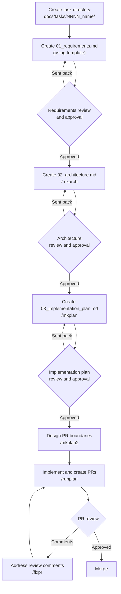

# Developer Onboarding Guide

This guide is for engineers joining the project for the first time. It explains the flow from development environment setup through feature development and PR merge.

---

## 1. Development Environment Setup

### Recommended: VS Code + devcontainer

The recommended approach is to use the [Dev Containers](https://marketplace.visualstudio.com/items?itemName=ms-vscode-remote.remote-containers) extension for VS Code. All required tools — Go, golangci-lint, gofumpt, and others — are included in the container, so no host environment dependencies are required. The host OS can be Linux, macOS, or Windows.

**Steps:**

1. Install [VS Code](https://code.visualstudio.com/) and [Docker](https://www.docker.com/)
2. Install the [Dev Containers extension](https://marketplace.visualstudio.com/items?itemName=ms-vscode-remote.remote-containers) in VS Code
3. Clone the repository and open it in VS Code
4. Select "Reopen in Container"

### Setting Up a Local Environment Directly

If you are not using devcontainer, install the following tools:

| Tool | Purpose | Version |
|---|---|---|
| Go | Build and test | 1.26 or later |
| golangci-lint | Static analysis | Latest |
| gofumpt | Code formatting | Latest |
| Claude Code | AI-assisted development | Latest |

### Verifying the Build

Whether using devcontainer or a local environment, run the following to verify setup:

```bash
git clone https://github.com/isseis/tlsrpt-digest.git
cd tlsrpt-digest

# Build
make build

# Test (all packages)
make test

# Static analysis
make lint

# Format
make fmt
```

If all commands complete without errors, the environment is ready.

---

## 2. Codebase Overview

For the overall project design, see the [Project Overview](../../overview.md). The responsibilities of each package are described in the [Package Reference](package_reference.md).

Key directories:

```
tlsrpt-digest/
├── cmd/tlsrpt-digest/   # Entry point and subcommands
├── internal/            # Packages (imap / tlsrpt / notify / store, etc.)
├── docs/
│   ├── overview.md      # Project overview
│   ├── dev/             # Developer documentation
│   └── tasks/           # Per-task design and implementation documents
└── testdata/            # Real email data for testing
```

---

## 3. Development Workflow

New features are developed in the following order: **requirements definition → architecture design → implementation plan → implementation**. Each phase requires human review and approval before proceeding to the next. Claude Code slash commands assist with document generation at each phase.

### Overall Flow



---

## 4. Step-by-Step Details

### Step 1: Create the Task Directory

Create a directory under `docs/tasks/` in the format `NNNN_task-name`. `NNNN` is a four-digit sequential number, one greater than the highest existing task number.

```bash
mkdir docs/tasks/0042_new_feature
```

### Step 2: Create the Requirements Document (`01_requirements.md`)

Copy `docs/tasks/0000_template/01_requirements.ja.md` and edit it.

**Required sections:**
- Background and purpose
- Scope (in scope / out of scope)
- Functional requirements with **acceptance criteria (`AC-NN`)**: each criterion must describe a specific, independently verifiable behavior
- Non-functional requirements and constraints

For detailed guidance on writing acceptance criteria, see the [Requirements and Acceptance Criteria Process](requirements_process.md).

> **Important:** Documents must always be created in `draft` status. Do not proceed to the next step before review and approval.

### Step 3: Review and Approve the Requirements Document

A human reviewer examines the document and, if there are no issues, updates the status section at the top:

```markdown
## Document Status

| Item | Content |
|---|---|
| Status | `approved` |
| Created | YYYY-MM-DD |
| Reviewed | YYYY-MM-DD |
| Reviewer | Name |
| Comments | - |
```

### Step 4: Create the Architecture Design Document (`/mkarch`)

Run `/mkarch` in Claude Code. You can also specify the task directory as an argument.

```
/mkarch
/mkarch 0042        # Specify task by number
```

The command inspects the current codebase and generates `02_architecture.md`. The design document includes Mermaid diagrams, component structure, error handling design, and test strategy. After generation, an automated review runs and any issues are fixed.

For how the command identifies the task directory, see [Task Identification](task_identification.md).

### Step 5: Review and Approve the Architecture Design Document

A human reviewer reviews the document and updates its status to `approved`.

### Step 6: Create the Implementation Plan (`/mkplan`)

```
/mkplan
/mkplan 0042
```

The command inspects the codebase and generates `03_implementation_plan.md` as a checkbox-based implementation plan. It includes implementation tasks for each phase and an acceptance criteria (AC) traceability table mapping each AC to its tests.

### Step 7: Review and Approve the Implementation Plan

A human reviewer reviews the document and updates its status to `approved`.

### Step 8: Design PR Boundaries (`/mkplan2`)

When the plan has multiple phases, design the PR groupings.

```
/mkplan2
/mkplan2 0042
```

`### PR-N checkpoint` sections are appended to `03_implementation_plan.md`. This allows `/runplan` to create PRs at the appropriate PR-N checkpoints.

### Step 9: Implement and Create PRs (`/runplan`)

```
/runplan
/runplan 0042
```

The command processes the implementation plan checkboxes in order. After each file change, it runs `make fmt && make test && make lint` and fixes any errors. When it reaches a PR-N checkpoint, it automatically creates a PR and stops. After the PR is merged, run `/runplan` again to proceed to the next phase.

> **Note:** After merging, update your local branch with `git pull` before running the next `/runplan`.

### Step 10: Address PR Review Comments (`/fixpr`)

When review comments are posted on a PR, use `/fixpr` to address them.

```
/fixpr
```

The command retrieves unresolved review comments and proposes and applies fixes. **Always verify the diff yourself before committing.** Do not accept automatically applied changes as-is; it is important to scrutinize whether the changes reflect your actual intent.

---

## 5. Document Translation (`/mktrans`)

Create the document in either Japanese or English first, then translate it with `/mktrans`.

```
/mktrans docs/dev/developer_guide/new_document.ja.md   # Japanese → English
/mktrans docs/dev/developer_guide/new_document.md      # English → Japanese
```

**Translation workflow:**

1. Create and commit the primary language (Japanese) version first
2. Generate the translation with `/mktrans`
3. For subsequent edits, update only the primary language version directly; update the translation exclusively via `/mktrans` (never edit both files directly in the same session)

---

## 6. Status Transition Rules

No step may proceed until the relevant document's status is `approved`.

| Document | Action prohibited before approval |
|---|---|
| `01_requirements.md` is `draft` | Creating `02_architecture.md` (`/mkarch`) |
| `02_architecture.md` is `draft` | Creating `03_implementation_plan.md` (`/mkplan`) |
| `03_implementation_plan.md` is `draft` | Writing implementation code (`/runplan`) |

Approval is performed by a human reviewer. Claude Code always creates documents in `draft` status and never changes them to `approved` itself.

---

## 7. Coding Conventions

- **Formatting:** Run `make fmt` after any change
- **Testing:** Run `make test` after any change; see the [Test Organization Guide](test_organization.md) for test structure conventions
- **Static analysis:** Verify there are no errors with `make lint`
- **Comments, identifiers, and string literals:** Write all Go source code in English
- **Commit messages:** Write in English
- **Modern Go idioms:** Actively use Go 1.21+ features such as `any`, the `slices`/`maps` packages, and the `min`/`max` built-in functions (see [CLAUDE.md](../../../CLAUDE.md) for details)

---

## 8. Reference Documents

| Document | Content |
|---|---|
| [Project Overview](../../overview.md) | Architecture and design decisions |
| [Requirements and Acceptance Criteria Process](requirements_process.md) | How to write ACs and detailed review flow |
| [Test Organization Guide](test_organization.md) | Rules for placing test helpers |
| [Mermaid Diagram Reference](mermaid_reference.md) | Diagram notation and conventions |
| [Package Reference](package_reference.md) | Responsibilities and structure of each package |
| [Task Identification](task_identification.md) | How slash commands identify the target task |
| [Robustness Principle](robustness_principle.md) | Design guidelines for handling external data |
