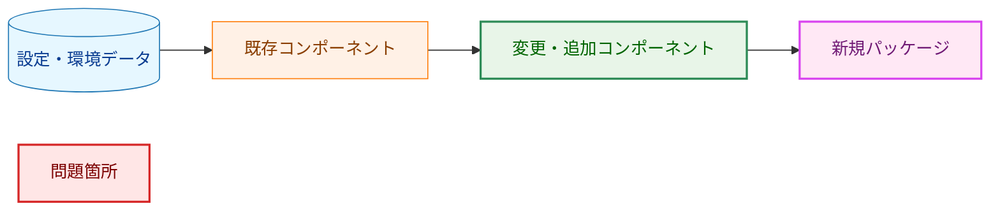
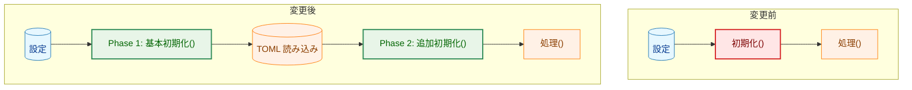
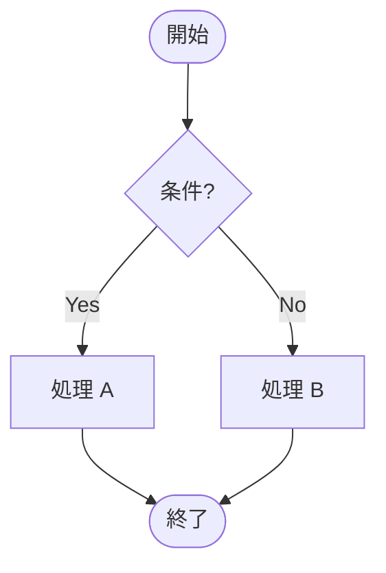
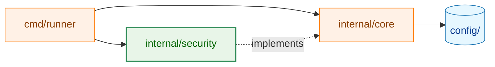
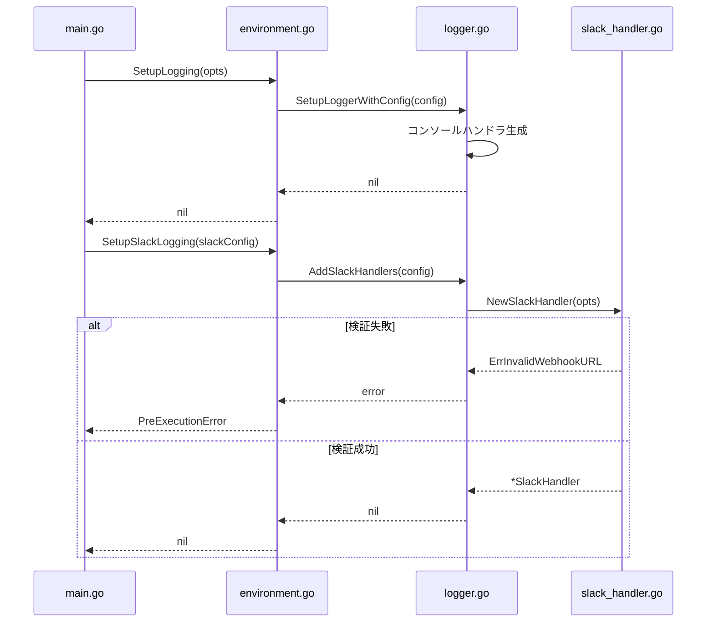
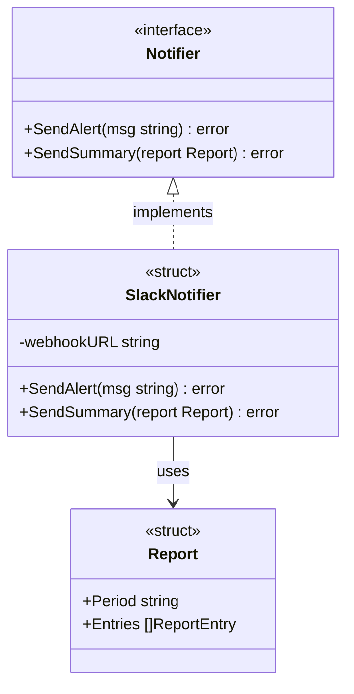
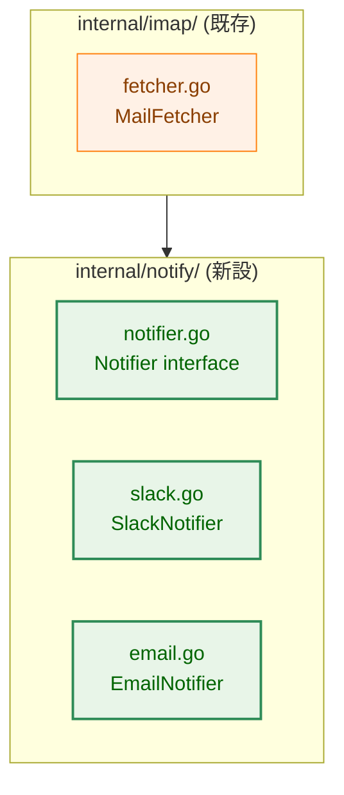
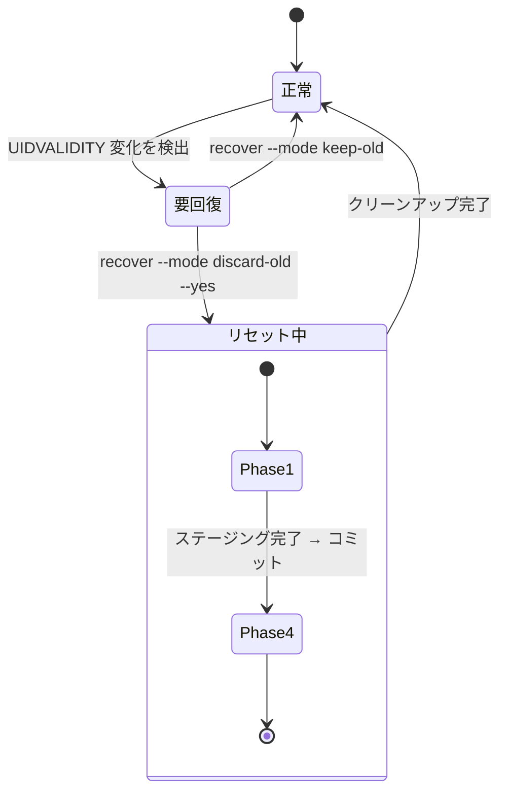
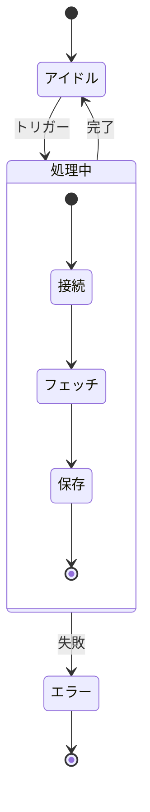
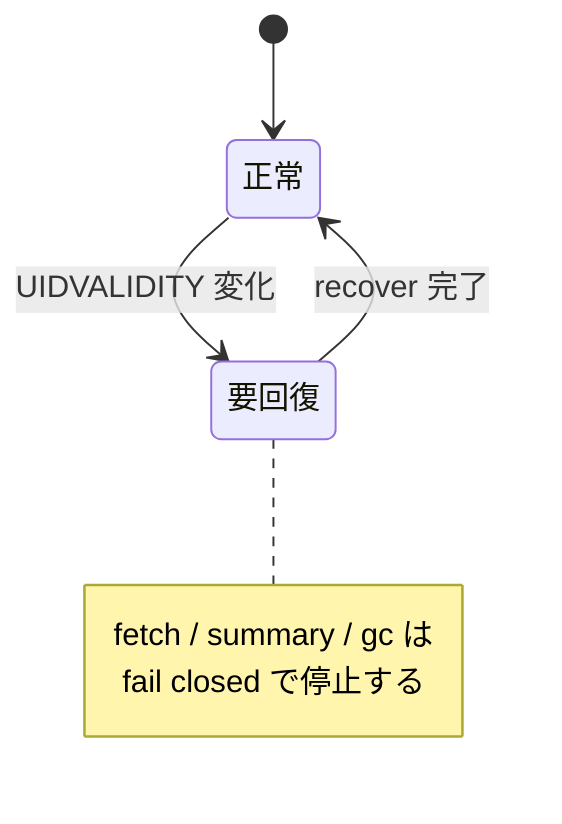

# Mermaid ダイアグラム リファレンス

このドキュメントは、アーキテクチャ設計書で使用する Mermaid ダイアグラムの凡例とサンプルを提供する。

## 1. 基本ルール

### ノードラベルのクォート
特殊文字（括弧・コロン・スラッシュ等）を含むラベルは必ずダブルクォートで囲む。

```
A["label (with parens)"]
B["pkg/path:FuncName()"]
```

### ラベル内の改行
ラベル内の改行は `<br>` を使う（`\n` は使わない）。

```
A["line1<br>line2"]
```

### データノードのシリンダー形状
設定ファイル・環境変数・DB 等の「データ」を表すノードはシリンダー形状 `[(label)]` を使う。

```
A[("TOML 設定ファイル")]
B[("環境変数<br>GSCR_SLACK_WEBHOOK_URL")]
```

---

## 2. 標準カラースキーム（classDef）

アーキテクチャ図では以下の classDef を統一して使用する。



| クラス名 | 色 | 用途 |
|---------|---|------|
| `data` | 青 | 設定ファイル・環境変数・DB など静的データ |
| `process` | オレンジ | 変更なしの既存コンポーネント |
| `enhanced` | 緑 | 変更・追加されるコンポーネント |
| `newpkg` | 紫 | 新規追加するパッケージ・型 |
| `problem` | 赤 | 問題のある既存箇所（Before 図で使用） |

---

## 3. フローチャート

### 方向の使い分け
- `TD` / `TB`（上→下）: 起動フロー・処理フロー・フェーズ依存関係
- `LR`（左→右）: パッケージ依存グラフ・データ伝播経路
- `RL`（右→左）: 使わない（可読性が低い）

### Before / After 比較パターン



### 処理分岐パターン（フロー判定）



### パッケージ依存グラフ



---

## 4. シーケンス図

呼び出し順序や非同期処理のフローを表す場合に使用する。



---

## 5. クラス図

型・インターフェース間の関係を表す場合に使用する。



---

## 6. graph TB（サブグラフ付きパッケージ構成）

パッケージ内部の構造を示す場合は `graph TB` + `subgraph` を組み合わせる。



---

## 7. 状態遷移図（stateDiagram-v2）

システムが**ディスクやメモリに持続的に滞在しうる状態**とその間の遷移を表す場合に使用する。「処理ステップの列挙」や「条件分岐を含む処理フロー」は §3 のフローチャートで表現する。

### flowchart との使い分け

| 判断軸 | `stateDiagram-v2` を選ぶ | `flowchart` を選ぶ |
|---|---|---|
| 表現対象 | 持続的な状態（例: ストアの open モード、リセットフェーズ） | 処理ステップや条件分岐（例: 関数内の判定） |
| 複合状態グループの色分け | 不要 | グループごとに色分けしたい |
| エッジの種類 | 単一種類で足りる | 実線（正常遷移）と破線（例外・クラッシュ）など複数種類が必要 |

**ADR-0003 の参照例**: [`docs/dev/adr/0003_reset_phase_design.ja.md`](../adr/0003_reset_phase_design.ja.md) の State Transition Diagram は `Normal`・`Recovery Required`・`Pending Reset` などストアの持続的な状態を表す真の状態機械であり、意味論的には `stateDiagram-v2` が適切だが、複合状態グループの色分け（`classDef` は複合状態には適用不可）と破線によるクラッシュ遷移の表現が必要なため `flowchart` を採用している。複合状態グループを色分けしたい場合や複数種類のエッジが必要な場合は `flowchart` を選ぶ。

### 基本構文



矢印 A → B は「イベントまたは操作 により A から B に遷移する」ことを表す。`[*]` は初期状態・終了状態を示す。

### ネスト状態（複合状態）

内部に複数のサブ状態を持つ複合状態は `state ID { ... }` で表現する。ID がそのまま表示ラベルになる。スペースを含むラベルが必要な場合は `state "表示ラベル" as ID` で別途宣言し、遷移では ID を使う。



### ノート（補足説明）

状態に補足を添える場合は `note` を使う。



### 使用上の注意

- `stateDiagram-v2` でも `classDef` による色分けは可能だが、複合状態（composite state）および初期・終了状態（`[*]`）には適用できない。複合状態グループを色分けしたい場合は `flowchart` を選ぶ。
- エッジラベルは `:` の後に続けて書く（例: `A --> B : イベント名`）。
- 状態ラベルに特殊文字（括弧・コロン等）を含む場合はダブルクォートで囲む（例: `state "Phase 1 (WAL)" as P1`）。

---

## 8. チェックリスト

ダイアグラム作成時の確認事項：

- [ ] 特殊文字を含むラベルはダブルクォートで囲んでいる
- [ ] ラベル内改行は `<br>` を使っている
- [ ] データノードはシリンダー形状 `[(label)]` を使っている
- [ ] classDef を定義して凡例に対応させている
- [ ] 図の下または末尾に凡例（Legend）ブロックを置いている
- [ ] ノード ID に Mermaid の予約済みキーワード（`call`、`end`、`subgraph`、`style`、`class`、`default` など）を使っていない（パースエラーを防ぐため）
