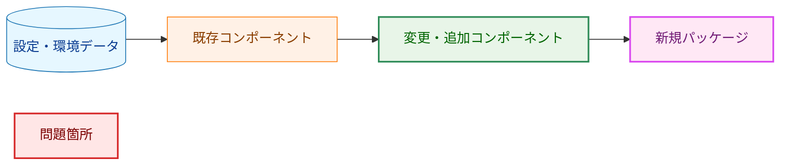
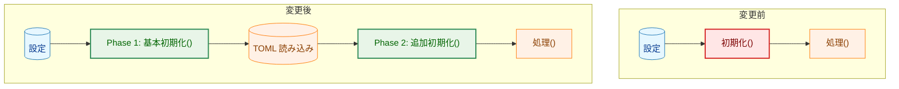
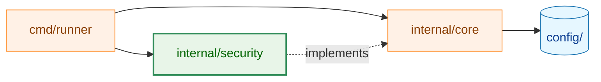
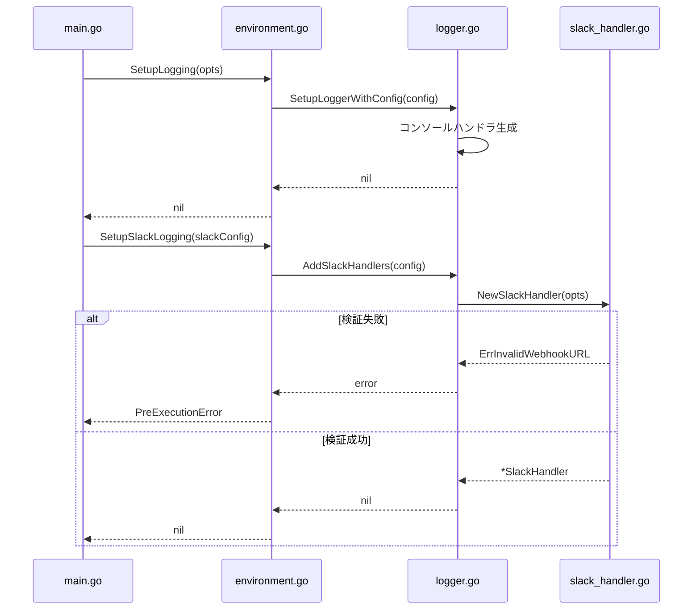
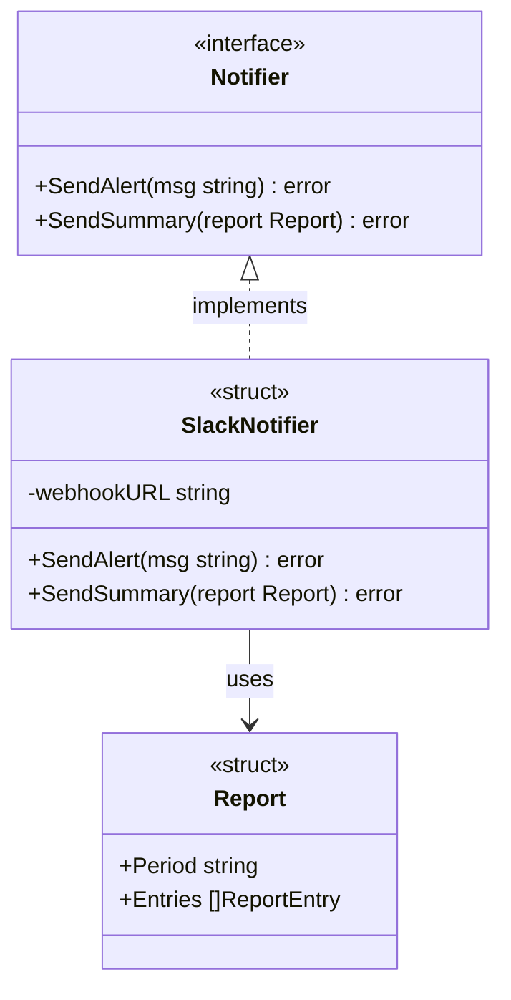
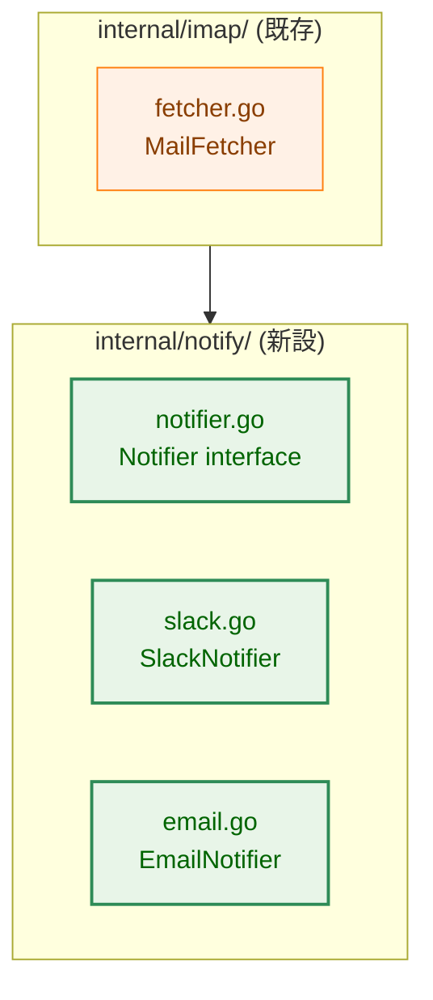

# Mermaid ダイアグラム リファレンス

このドキュメントは、アーキテクチャ設計書で使用する Mermaid ダイアグラムの凡例とサンプルを提供する。

## 1. 基本ルール

### ノードラベルのクォート
特殊文字（括弧・コロン・スラッシュ等）を含むラベルは必ずダブルクォートで囲む。

```
A["label (with parens)"]
B["pkg/path:FuncName()"]
```

### ラベル内の改行
ラベル内の改行は `<br>` を使う（`\n` は使わない）。

```
A["line1<br>line2"]
```

### データノードのシリンダー形状
設定ファイル・環境変数・DB 等の「データ」を表すノードはシリンダー形状 `[(label)]` を使う。

```
A[("TOML 設定ファイル")]
B[("環境変数<br>GSCR_SLACK_WEBHOOK_URL")]
```

---

## 2. 標準カラースキーム（classDef）

アーキテクチャ図では以下の classDef を統一して使用する。



| クラス名 | 色 | 用途 |
|---------|---|------|
| `data` | 青 | 設定ファイル・環境変数・DB など静的データ |
| `process` | オレンジ | 変更なしの既存コンポーネント |
| `enhanced` | 緑 | 変更・追加されるコンポーネント |
| `newpkg` | 紫 | 新規追加するパッケージ・型 |
| `problem` | 赤 | 問題のある既存箇所（Before 図で使用） |

---

## 3. フローチャート

### 方向の使い分け
- `TD` / `TB`（上→下）: 起動フロー・処理フロー・フェーズ依存関係
- `LR`（左→右）: パッケージ依存グラフ・データ伝播経路
- `RL`（右→左）: 使わない（可読性が低い）

### Before / After 比較パターン



### 処理分岐パターン（フロー判定）


### パッケージ依存グラフ



---

## 4. シーケンス図

呼び出し順序や非同期処理のフローを表す場合に使用する。



---

## 5. クラス図

型・インターフェース間の関係を表す場合に使用する。



---

## 6. graph TB（サブグラフ付きパッケージ構成）

パッケージ内部の構造を示す場合は `graph TB` + `subgraph` を組み合わせる。



---

## 7. チェックリスト

ダイアグラム作成時の確認事項：

- [ ] 特殊文字を含むラベルはダブルクォートで囲んでいる
- [ ] ラベル内改行は `<br>` を使っている
- [ ] データノードはシリンダー形状 `[(label)]` を使っている
- [ ] classDef を定義して凡例に対応させている
- [ ] 図の下または末尾に凡例（Legend）ブロックを置いている
