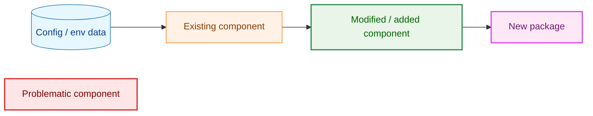
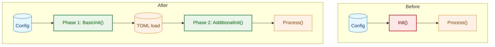
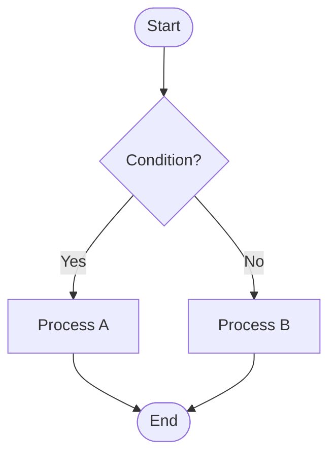
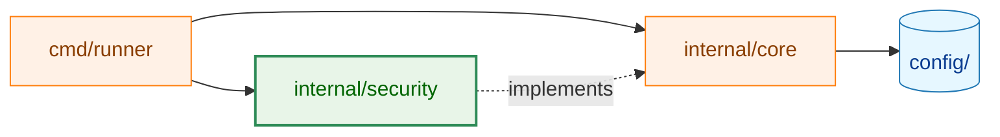
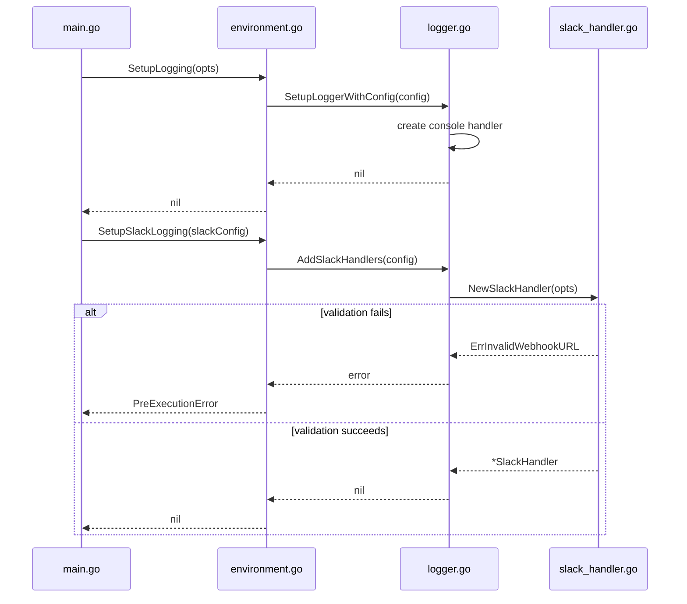
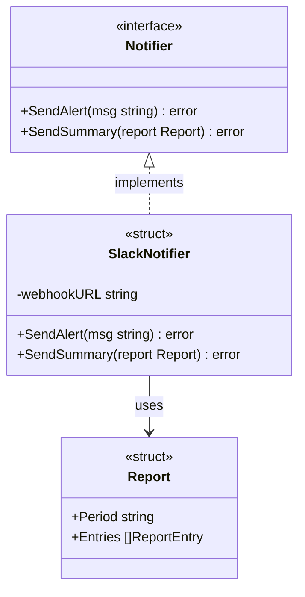
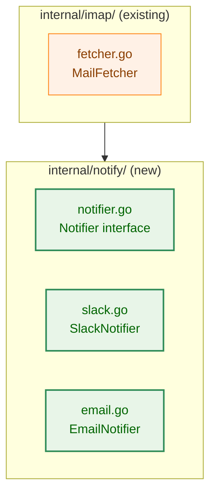
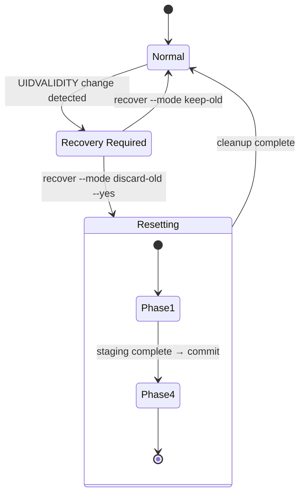
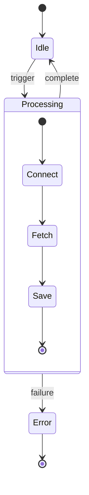
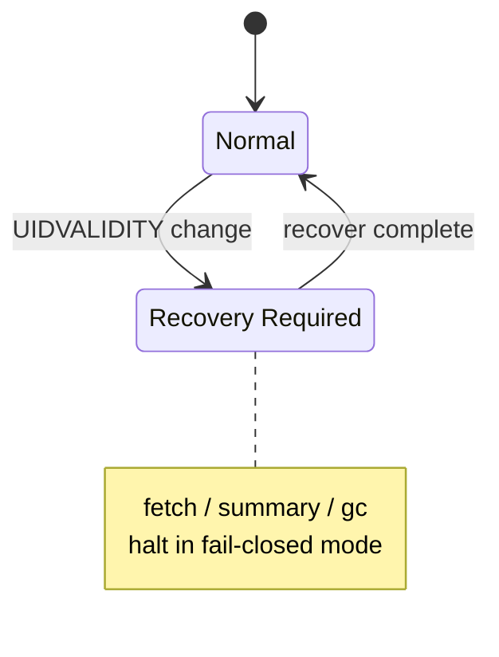

# Mermaid Diagram Reference

This document provides conventions and examples for Mermaid diagrams used in architecture design documents.

## 1. Basic Rules

### Node Label Quoting
Always wrap labels in double quotes if they contain special characters (parentheses, colons, slashes, etc.).

```
A["label (with parens)"]
B["pkg/path:FuncName()"]
```

### Line Breaks in Labels
Use `<br>` for line breaks inside node labels (not `\n`).

```
A["line1<br>line2"]
```

### Cylinder Shape for Data Nodes
Use the cylinder shape `[(label)]` for nodes that represent "data" such as config files, environment variables, or databases.

```
A[("TOML config file")]
B[("Environment variable<br>GSCR_SLACK_WEBHOOK_URL")]
```

---

## 2. Standard Color Scheme (classDef)

Use the following classDef definitions consistently across all architecture diagrams.



| Class | Color | Usage |
|-------|-------|-------|
| `data` | Blue | Static data: config files, environment variables, databases |
| `process` | Orange | Existing components with no changes |
| `enhanced` | Green | Components being modified or added |
| `newpkg` | Purple | Newly added packages or types |
| `problem` | Red | Problematic existing code (used in Before diagrams) |

---

## 3. Flowcharts

### Direction Guidelines
- `TD` / `TB` (top → bottom): startup flows, processing flows, phase dependencies
- `LR` (left → right): package dependency graphs, data propagation paths
- `RL` (right → left): avoid (poor readability)

### Before / After Comparison Pattern



### Decision / Branching Pattern



### Package Dependency Graph



---

## 4. Sequence Diagrams

Use sequence diagrams to show call order or async processing flows.



---

## 5. Class Diagrams

Use class diagrams to show relationships between types and interfaces.



---

## 6. graph TB with Subgraphs (Package Structure)

Combine `graph TB` with `subgraph` to show internal package structure.



---

## 7. State Diagrams (stateDiagram-v2)

Use when representing **states that the system persistently occupies on disk or in memory** and the transitions between them. Use §3 flowcharts for sequences of processing steps or flows with conditional branching.

### When to use stateDiagram-v2 vs. flowchart

| Criterion | Choose `stateDiagram-v2` | Choose `flowchart` |
|---|---|---|
| Subject | Persistent states (e.g., store open mode, reset phase) | Processing steps or conditional branching (e.g., decisions inside a function) |
| Color-coding of composite state groups | Not needed | Needed per group |
| Edge types | A single type suffices | Multiple types needed (e.g., solid for normal transitions, dashed for exceptions/crashes) |

**ADR-0003 reference example**: The state diagram in [`docs/dev/adr/0003_reset_phase_design.md`](../adr/0003_reset_phase_design.md) is a true state machine representing persistent store states such as `Normal`, `Recovery Required`, and `Phase 4`, and uses `stateDiagram-v2`. Crash transitions are expressed with a `※` prefix instead of dashed lines. Choose `flowchart` when you need to color-code composite state groups or require multiple edge styles (e.g., solid and dashed lines).

### Basic Syntax



Arrow A → B represents "transition from A to B triggered by an event or operation". `[*]` denotes the initial or terminal state.

### Nested States (Composite States)

Composite states with multiple sub-states are expressed using `state id { ... }`. The ID itself becomes the display label. If a label containing spaces is needed, declare it separately with `state "Display Label" as id` and use `id` in transitions.



### Notes (Annotations)

Use `note` to attach supplementary information to a state.



### Usage Notes

- `stateDiagram-v2` does support `classDef` color-coding, but it cannot be applied to composite states or the initial/terminal state (`[*]`). Choose `flowchart` if you need to color-code composite state groups.
- Edge labels follow the `:` separator (e.g., `A --> B : event name`).
- State labels containing special characters (parentheses, colons, etc.) must be wrapped in double quotes (e.g., `state "Phase 1 (WAL)" as P1`).

---

## 8. Checklist

Review this checklist when creating diagrams:

- [ ] Labels containing special characters are wrapped in double quotes
- [ ] Line breaks inside labels use `<br>`
- [ ] Data nodes use the cylinder shape `[(label)]`
- [ ] `classDef` entries are defined and match the legend
- [ ] A Legend block is placed below the diagram or at the end of the section
- [ ] Node IDs do not use Mermaid reserved keywords (such as `call`, `end`, `subgraph`, `style`, `class`, `default`) to avoid parse errors
