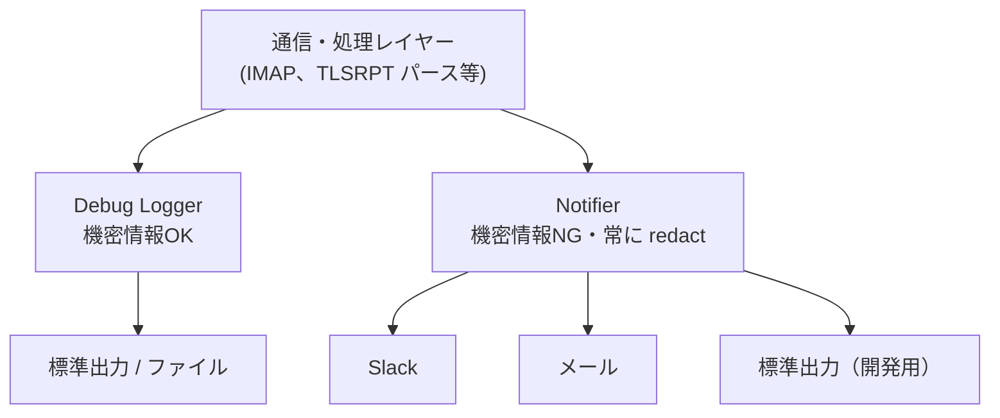

# 通知セキュリティガイドライン：Debug Logger と Notifier の分離

## 概要

通知機能（Slack・メール・標準出力等）を実装する際、デバッグ情報やエラーメッセージを通じて機密情報（パスワード、Webhook URL 等）が通知メッセージに混入するリスクがある。本ガイドラインは、このリスクに対する設計方針を定め、全タスクで統一的に採用する。

---

## 1. 脅威モデル

### 1.1 機密情報の種類

| 情報 | 漏洩時の影響 |
|---|---|
| IMAP パスワード | メールボックスへの不正アクセス |
| Slack Webhook URL | スパム送信・レート制限消費 |

### 1.2 通知メッセージへの混入経路

| 経路 | 具体例 | リスク |
|---|---|---|
| エラーメッセージへの埋め込み | `fmt.Sprintf("auth failed: pass=%s", pass)` | 中 |
| Config 構造体の誤フォーマット | `fmt.Sprintf("config: %+v", cfg)` | 低 |
| デバッグ時の通信内容露出 | IMAP 認証シーケンスの全文出力 | 高 |
| 将来の拡張時の実装ミス | 週次サマリに接続情報を追加 | 中 |

### 1.3 デバッグモードの特別なリスク

IMAP ライブラリのデバッグログを有効にすると、認証シーケンスがそのまま出力される：

```
C: A001 LOGIN user@example.com s3cret_password
S: A001 OK authenticated
```

デバッグレベルを最大にした場合や、問題解析のために redaction を無効にした場合、パスワードを含む極めて詳細な情報が出力される可能性がある。この出力が Slack・メールに流れると機密情報が漏洩する。

---

## 2. 設計方針：出力先のセキュリティレベルによる分離

### 2.1 2つの独立した出力パス

2つの出力パスを設け、意図的に交わらない設計にする。



| | Debug Logger | Notifier |
|---|---|---|
| 出力先 | 標準出力・ファイル | Slack・メール・標準出力（開発用） |
| 内容 | 任意のデバッグ情報 | 構造化されたアラートデータのみ |
| redaction | 設定で on/off 可能 | 常に適用、無効化不可 |
| 機密情報 | 含む可能性あり | 含まない（設計で保証） |

### 2.2 設計原則

#### 原則1: Notifier の引数型による制約

Notifier インターフェースの引数を、公開情報のみを含む構造体に限定する。Config 構造体や生文字列を受け取るインターフェースにしない。

```go
// 良い例：公開情報のみを含む構造体を受け取る
type Alert struct {
    Organization string
    PolicyType   string
    FailureCount int
    DateRange    DateRange
}

type Notifier interface {
    SendAlert(ctx context.Context, alert Alert) error
}

// 悪い例：任意の文字列を受け取る（機密情報が混入できる）
type Notifier interface {
    Send(ctx context.Context, message string) error
}
```

#### 原則2: 標準出力 Notifier でも型制約を維持する

標準出力を開発用の通知先として使う場合も、Notifier インターフェースの引数型制約は維持する。「標準出力だから何でも流してよい」という実装にしない。デバッグ情報を標準出力に出力したい場合は、Debug Logger を経由する。

#### 原則3: Notifier では redaction を無効化できない

Debug Logger の redaction は設定で on/off 切り替え可能とする。一方、Notifier（Slack・メール・標準出力）では redaction を常に適用し、無効化できるコードパスを作らない。

#### 原則4: デバッグ出力先を明示的に制御する

IMAP ライブラリ等のデバッグ出力先（`io.Writer`）は Debug Logger 専用の変数に割り当て、Notifier のハンドラとは別に管理する。

#### 原則5: slog.Handler を Notifier として使用する場合の型安全性

Slack 通知ハンドラは `slog.Handler` として実装する。`slog.Record` は自由形式の `Message` 文字列を持つが、以下のルールにより同等の型制約目標を達成する：

1. **型付きイベント関数のみ**: 通知ロガーへの書き込みは、型付きヘルパー関数（例：`LogAlert(ctx, logger, alert Alert)`）を通じてのみ行う。外部パッケージは通知ロガーに対して `logger.Info(...)` を直接呼ばない。
2. **プライベートロガー**: Slack ハンドラに接続した `*slog.Logger` は `internal/notify` 内に閉じ込め、外部に公開しない。
3. **Slack ハンドラへのデバッグパスなし**: デバッグ出力（IMAP 通信トレース等）は別の `io.Writer` に書き込み、Slack ハンドラには流れない。

これらのルールにより、基盤となるトランスポートが `slog.Handler` であっても、外部チャンネルには型付きの構造化通知ペイロードのみが流れることが保証される。

---

## 3. 補完的対策：Secret 型による機密フィールドの保護

Config 構造体の機密フィールドを `Secret` 型でラップし、`fmt.Stringer` と `slog.LogValuer` を実装して常に `[REDACTED]` を返すようにする。

```go
type Secret string

func (s Secret) String() string       { return "[REDACTED]" }
func (s Secret) LogValue() slog.Value { return slog.StringValue("[REDACTED]") }
func (s Secret) Value() string        { return string(s) } // 実際の値を取得する専用メソッド
```

これにより、誤って `fmt.Sprintf("%v", cfg)` や `slog.Info("config", "imap", cfg)` を書いても安全になる。

Secret 型はあくまで**第二の防御線**であり、原則1〜5の設計による制約が主たる防御である。

---

## 4. 適用対象

本ガイドラインはプロジェクト全体で適用する。特に以下のコンポーネントが対象となる：

| コンポーネント | 適用内容 |
|---|---|
| `internal/notify/` | Notifier インターフェースの型制約、redaction の常時適用 |
| 将来追加されるメール通知 | 同上 |
| `internal/imap/` | デバッグ出力を Debug Logger 専用変数に限定 |
| `cmd/tlsrpt-digest/` | Debug Logger と Notifier の初期化を分離 |
| `internal/config/` | Config 構造体の機密フィールドを Secret 型でラップ |

---

## 5. テスト要件

各通知実装（Slack・メール・標準出力）に対して以下のテストを含める：

1. 型付きイベントヘルパー（例：`LogAlert`）が `Alert` 構造体のフィールドのみを含む `slog.Record` を出力することを検証するテスト（生文字列・Config フィールドを含まないこと）
2. Config 構造体の機密フィールド（`Secret` 型）が通知メッセージに含まれないことを検証するテスト
3. デバッグ出力先（`io.Writer`）が Notifier のハンドラと別の変数で管理されており、デバッグ出力への書き込みが Slack ハンドラを起動しないことを検証するテスト
4. 通知用 `*slog.Logger` が `internal/notify` の外部からアクセス不可であることを検証するテスト（公開シンボルでエクスポートされていないこと）
