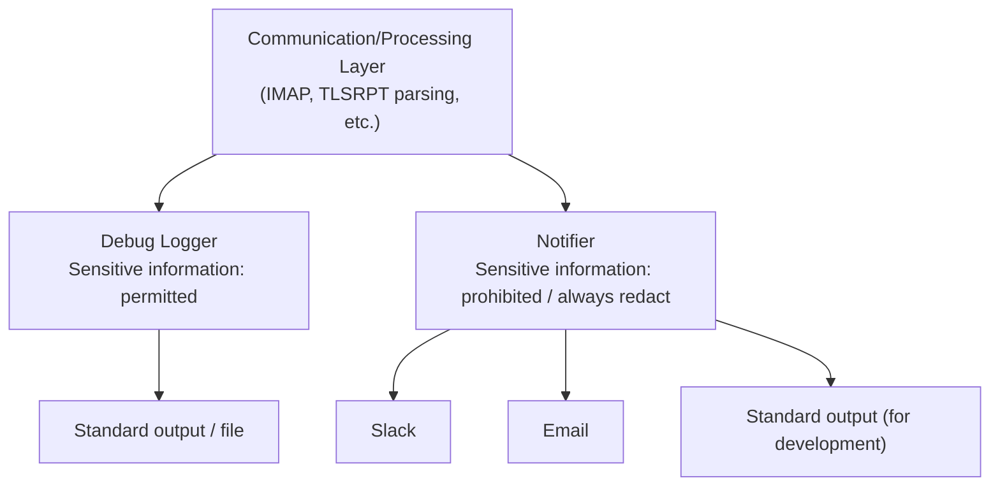

# Notification Security Guidelines: Separation of Debug Logger and Notifier

## Overview

When implementing notification features (Slack, email, standard output, etc.), there is a risk that sensitive information (passwords, Webhook URLs, etc.) may be introduced into notification messages through debug information or error messages. This guideline defines the design policy to address this risk and is to be adopted uniformly across all tasks.

---

## 1. Threat Model

### 1.1 Types of Sensitive Information

| Information | Impact if Exposed |
|---|---|
| IMAP password | Unauthorized access to the mailbox |
| Slack Webhook URL | Spam sending / rate limit consumption |

### 1.2 Paths Through Which Sensitive Information May Enter Notification Messages

| Path | Example | Risk |
|---|---|---|
| Embedding in error messages | `fmt.Sprintf("auth failed: pass=%s", pass)` | Medium |
| Incorrect formatting of Config struct | `fmt.Sprintf("config: %+v", cfg)` | Low |
| Exposure of communication content during debugging | Full output of IMAP authentication sequence | High |
| Implementation mistake during future extension | Adding connection information to weekly summary | Medium |

### 1.3 Special Risk in Debug Mode

Enabling debug logging in the IMAP library outputs the authentication sequence as-is:

```
C: A001 LOGIN user@example.com s3cret_password
S: A001 OK authenticated
```

When the debug level is set to maximum, or when redaction is disabled for problem analysis, extremely detailed information including passwords may be output. If this output flows to Slack or email, sensitive information will be exposed.

---

## 2. Design Policy: Separation by Security Level of Output Destination

### 2.1 Two Independent Output Paths

Two output paths are established and designed to intentionally never intersect.



| | Debug Logger | Notifier |
|---|---|---|
| Output destination | Standard output / file | Slack / email / standard output (for development) |
| Content | Any debug information | Structured alert data only |
| Redaction | Configurable on/off | Always applied, cannot be disabled |
| Sensitive information | May be included | Not included (guaranteed by design) |

### 2.2 Design Principles

#### Principle 1: Constraints Through Notifier Argument Types

Limit the arguments of the Notifier interface to structs containing only public information. Do not create an interface that accepts Config structs or raw strings.

```go
// Good example: accepts a struct containing only public information
type Alert struct {
    Organization string
    PolicyType   string
    FailureCount int
    DateRange    DateRange
}

type Notifier interface {
    SendAlert(ctx context.Context, alert Alert) error
}

// Bad example: accepts an arbitrary string (sensitive information can be introduced)
type Notifier interface {
    Send(ctx context.Context, message string) error
}
```

#### Principle 2: Maintain Type Constraints Even for Standard Output Notifier

Even when using standard output as a notification destination for development, the argument type constraints of the Notifier interface are maintained. Do not implement it as "standard output, so anything can be passed through." When outputting debug information to standard output, use the Debug Logger.

#### Principle 3: Redaction Cannot Be Disabled in Notifier

Redaction in the Debug Logger can be toggled on/off via configuration. On the other hand, in the Notifier (Slack, email, standard output), redaction is always applied and no code path is created that allows disabling it.

#### Principle 4: Explicitly Control Debug Output Destination

The debug output destination (`io.Writer`) of the IMAP library and similar components is assigned to a variable dedicated to the Debug Logger, and managed separately from the Notifier's handler.

#### Principle 5: Type Safety When Using slog.Handler as Notifier

The Slack notification handler is implemented as `slog.Handler`. Although `slog.Record` carries a free-form `Message` string, the same type-constraint goal is achieved by the following rules:

1. **Typed event functions only**: All writes to the notification logger go through typed helper functions (e.g., `LogAlert(ctx, logger, alert Alert)`). External packages never call `logger.Info(...)` directly on the notification logger.
2. **Private logger**: The `*slog.Logger` connected to the Slack handler is kept private inside `internal/notify`. It is not exported.
3. **No debug path to the Slack handler**: Debug output (e.g., IMAP communication traces) is written to a separate `io.Writer` and never reaches the Slack handler.

These rules ensure that only well-typed, structured notification payloads flow to external channels, even though the underlying transport is `slog.Handler`.

---

## 3. Complementary Measure: Protection of Sensitive Fields Through Secret Type

Wrap sensitive fields in the Config struct with the `Secret` type, implementing `fmt.Stringer` and `slog.LogValuer` to always return `[REDACTED]`.

```go
type Secret string

func (s Secret) String() string       { return "[REDACTED]" }
func (s Secret) LogValue() slog.Value { return slog.StringValue("[REDACTED]") }
func (s Secret) Value() string        { return string(s) } // Dedicated method to retrieve the actual value
```

This ensures safety even if `fmt.Sprintf("%v", cfg)` or `slog.Info("config", "imap", cfg)` is written by mistake.

The Secret type serves only as the **second line of defense**; the constraints provided by the design of Principles 1 through 4 are the primary defense.

---

## 4. Scope of Application

This guideline applies throughout the project. The following components are particularly subject to it:

| Component | Application |
|---|---|
| `internal/notify/` | Type constraints of the Notifier interface, always-applied redaction |
| Email notification to be added in the future | Same as above |
| `internal/imap/` | Limit debug output to a variable dedicated to Debug Logger |
| `cmd/tlsrpt-digest/` | Separate initialization of Debug Logger and Notifier |
| `internal/config/` | Wrap sensitive fields of Config struct with Secret type |

---

## 5. Test Requirements

Include the following tests for each notification implementation (Slack, email, standard output):

1. A test verifying that the typed event helper (e.g., `LogAlert`) emits a `slog.Record` containing only the fields of the `Alert` struct — no raw strings, no config fields
2. A test verifying that sensitive fields of the Config struct (of `Secret` type) are not included in notification messages
3. A test verifying that the debug output destination (`io.Writer`) is managed as a separate variable from the Notifier's handler, and that writing to the debug output does not trigger the Slack handler
4. A test verifying that the notification `*slog.Logger` is not accessible outside `internal/notify` (i.e., no exported symbol exposes it)
