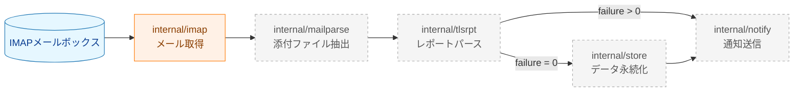
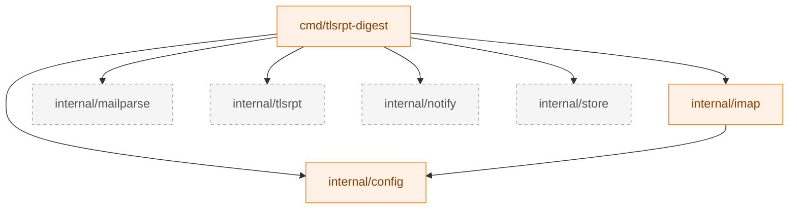

# パッケージリファレンス

このドキュメントはプロジェクトのディレクトリ構成と各パッケージの責務を説明する。新規パッケージの追加や既存パッケージの変更を行う際は、このドキュメントを参照して設計の一貫性を保つこと。

---

## 1. 全体処理フロー



*破線ノードは未実装（計画中）のパッケージを表す。*

---

## 2. ディレクトリ構成

```
tlsrpt-digest/
├── cmd/
│   └── tlsrpt-digest/       # エントリポイント（バイナリ）
│       └── main.go
├── internal/
│   ├── config/              # 共有設定型
│   │   └── secret.go
│   ├── imap/                # IMAPクライアント
│   │   ├── imap.go          # インターフェースと型定義
│   │   ├── client.go        # 実装
│   │   └── testutil/        # テストダブル（Classification A）
│   │       └── mocks.go
│   ├── mailparse/           # MIME添付ファイル抽出（計画中）
│   ├── tlsrpt/              # TLSRPTレポートパース（計画中）
│   ├── notify/              # Slack通知（計画中）
│   └── store/               # データ永続化（計画中）
├── docs/
│   ├── dev/                 # 開発者ガイド
│   └── tasks/               # タスク別ドキュメント
└── testdata/                # テスト用データファイル
```

---

## 3. パッケージ詳細

### `cmd/tlsrpt-digest`

エントリポイント。設定を読み込み、各コンポーネントを初期化して処理を1回実行して終了する one-shot 実行モデルをとる。スケジューリング（定期実行）は外部スケジューラー（systemd timer / cron）に委ねる。

**サブコマンド（計画中）**

| サブコマンド | 概要 |
|---|---|
| `fetch` | IMAP からレポートを取得して処理し、通知または保存する |
| `summary` | 保存済みデータから週次サマリを生成して通知する |
| `reprocess` | 保存済み `.eml` を再処理する |

---

### `internal/config`

アプリケーション全体で共有される設定型を定義する。

**主要な型**

| 型 | 説明 |
|---|---|
| `Secret` | ログへの漏洩を防ぐため `String()` / `LogValue()` を常にマスク値で返す文字列型。`Value()` で生の値を取得する。 |

---

### `internal/imap`

IMAP メールボックスへの接続・メタ情報取得・選択的ダウンロード・既読マーク処理を担う。

**主要な型・インターフェース**

| 型 / インターフェース | 説明 |
|---|---|
| `MailFetcher` | IMAPクライアントを抽象化するインターフェース。実装の差し替えを可能にする。 |
| `Config` | IMAP接続設定（ホスト・ポート・認証情報・TLS CA証明書・メッセージサイズ上限）。 |
| `MessageMeta` | メール本文を含まないメタ情報（UID・サイズ・日時・SEENフラグ・Message-ID）。 |
| `FetchMetaResult` | `FetchMeta` の戻り値。`MessageMeta` のスライスと `UIDValidity` を含む。 |

**`MailFetcher` インターフェース**

| メソッド | 説明 |
|---|---|
| `FetchMeta(ctx, since)` | 指定日以降の全メールのメタ情報を取得する（SEEN/UNSEEN問わず）。 |
| `Download(ctx, uids)` | 指定UIDのメール本文をダウンロードして `*mail.Message` として返す。 |
| `MarkSeen(ctx, uids)` | 指定UIDのメールにSEENフラグを付与する。 |
| `Close()` | IMAP セッションをログアウトして閉じる。 |

**テストヘルパー**: `internal/imap/testutil`（パッケージ名 `imaptestutil`）に `FakeMailFetcher` が定義されている（→ [4節](#4-テストヘルパー)参照）。

---

### `internal/mailparse`（計画中）

`*mail.Message` から MIME 添付ファイルのバイト列とファイル名を取り出す。`internal/imap` と `internal/tlsrpt` の間に位置し、MIME パース処理を両パッケージから分離する。

**主要な型（予定）**

| 型 | 説明 |
|---|---|
| `Attachment` | 添付ファイル1件を表す型。`Filename string` と `Content []byte` を持つ。 |

**主要な責務**: MIME multipart の再帰的解析、base64 デコード、RFC 2231 / RFC 2047 ファイル名デコード、サイズ上限チェック。

---

### `internal/tlsrpt`（計画中）

`.json.gz` バイト列の展開と RFC 8460 JSON のパース、および failure_session_count の評価を担う。

**主要な型（予定）**

| 型 | 説明 |
|---|---|
| `TLSRPTReport` | RFC 8460 のレポート全体を表す構造体。 |

**主要な責務**: gzip 展開、RFC 8460 JSON パース、`HasFailure()` による failure 判定。

---

### `internal/notify`（計画中）

Slack Incoming Webhook を通じた通知送信を担う。通知先を INFO（通常）と WARN/ERROR（異常）で分け、異なる Slack チャンネルへ送信できる。Webhook URL は環境変数で管理し、設定ファイルには記載しない。

**主要なインターフェース（予定）**

| インターフェース | 説明 |
|---|---|
| `Notifier` | 通知機能を抽象化するインターフェース。 |

---

### `internal/store`（計画中）

処理済みレポートデータの永続化を担う。2種類のデータを保存する。

| 保存対象 | 形式 | 用途 |
|---|---|---|
| 受信メール原本 | `.eml` ファイル | 問題解析・再処理・テスト用 canned データ |
| 集計データ | JSON ファイル | 週次サマリ生成用 |

---

## 4. テストヘルパー

テストヘルパーの分類・配置ルールは [test_organization.md](test_organization.md) に従う。

| パッケージ | パス | パッケージ名 | 分類 | 説明 |
|---|---|---|---|---|
| imap テストダブル | `internal/imap/testutil/` | `imaptestutil` | A | `FakeMailFetcher`：`MailFetcher` の実装。呼び出し記録（スパイ）機能を持つ。 |

---

## 5. パッケージ依存関係



*矢印は依存の方向（A → B は「A が B に依存する」）を示す。*
*`internal` パッケージ間は `cmd` を介してのみ連携し、相互依存は持たない。*
