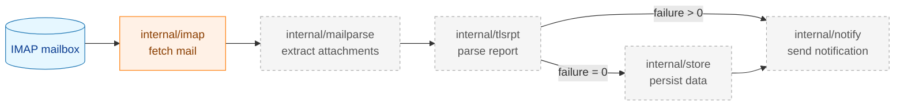
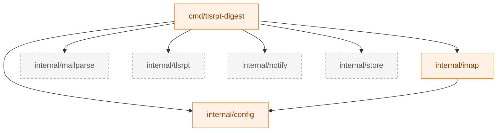

# Package Reference

This document describes the project's directory structure and the responsibilities of each package. When adding new packages or modifying existing ones, refer to this document to maintain design consistency.

---

## 1. Overall Processing Flow



*Dashed nodes represent packages that are planned but not yet implemented.*

---

## 2. Directory Structure

```
tlsrpt-digest/
├── cmd/
│   └── tlsrpt-digest/       # Entry point (binary)
│       └── main.go
├── internal/
│   ├── config/              # Shared configuration types
│   │   └── secret.go
│   ├── imap/                # IMAP client
│   │   ├── imap.go          # Interface and type definitions
│   │   ├── client.go        # Implementation
│   │   └── testutil/        # Test doubles (Classification A)
│   │       └── mocks.go
│   ├── mailparse/           # MIME attachment extraction (planned)
│   ├── tlsrpt/              # TLSRPT report parsing (planned)
│   ├── notify/              # Slack notification (planned)
│   └── store/               # Data persistence (planned)
├── docs/
│   ├── dev/                 # Developer guides
│   └── tasks/               # Per-task documents
└── testdata/                # Test data files
```

---

## 3. Package Details

### `cmd/tlsrpt-digest`

Entry point. Follows a one-shot execution model: reads configuration, initializes components, runs one processing cycle, and exits. Scheduling (periodic execution) is delegated to an external scheduler (systemd timer or cron).

**Subcommands (planned)**

| Subcommand | Description |
|---|---|
| `fetch` | Fetches reports from IMAP, processes them, and either notifies or stores the results |
| `summary` | Generates a weekly summary from stored data and sends a notification |
| `reprocess` | Re-processes stored `.eml` files |

---

### `internal/config`

Defines configuration types shared across the application.

**Key types**

| Type | Description |
|---|---|
| `Secret` | A string type whose `String()` and `LogValue()` always return a masked value to prevent leaking secrets in logs. Use `Value()` to retrieve the raw value. |

---

### `internal/imap`

Handles IMAP mailbox connection, metadata retrieval, selective message download, and marking messages as read.

**Key types and interfaces**

| Type / Interface | Description |
|---|---|
| `MailFetcher` | Interface that abstracts the IMAP client, enabling substitution with test doubles. |
| `Config` | IMAP connection settings (host, port, credentials, TLS CA certificate, message size limit). |
| `MessageMeta` | Per-message metadata without body content (UID, size, date, SEEN flag, Message-ID). |
| `FetchMetaResult` | Return value of `FetchMeta`. Contains a slice of `MessageMeta` and `UIDValidity`. |

**`MailFetcher` interface**

| Method | Description |
|---|---|
| `FetchMeta(ctx, since)` | Returns metadata for all messages received on or after the given date (regardless of SEEN status). |
| `Download(ctx, uids)` | Downloads message bodies for the specified UIDs and returns them as `*mail.Message`. |
| `MarkSeen(ctx, uids)` | Sets the SEEN flag on messages with the specified UIDs. |
| `Close()` | Logs out and closes the IMAP session. |

**Test helpers**: `FakeMailFetcher` is defined in `internal/imap/testutil` (package name `imaptestutil`) — see [Section 4](#4-test-helpers).

---

### `internal/mailparse` (planned)

Extracts attachment byte slices and filenames from `*mail.Message`. Sits between `internal/imap` and `internal/tlsrpt`, separating MIME parsing concerns from both packages.

**Key types (planned)**

| Type | Description |
|---|---|
| `Attachment` | Represents a single attachment. Has `Filename string` and `Content []byte`. |

**Key responsibilities**: Recursive MIME multipart parsing, base64 decoding, RFC 2231 / RFC 2047 filename decoding, size limit enforcement.

---

### `internal/tlsrpt` (planned)

Handles decompression of `.json.gz` byte slices, parsing of RFC 8460 JSON, and evaluation of `failure_session_count`.

**Key types (planned)**

| Type | Description |
|---|---|
| `TLSRPTReport` | Struct representing an entire RFC 8460 report. |

**Key responsibilities**: gzip decompression, RFC 8460 JSON parsing, failure determination via `HasFailure()`.

---

### `internal/notify` (planned)

Sends notifications via Slack Incoming Webhook. Supports separate notification targets for INFO (normal) and WARN/ERROR (alert) severity levels, routing them to different Slack channels. Webhook URLs are managed as environment variables and are never stored in configuration files.

**Key interfaces (planned)**

| Interface | Description |
|---|---|
| `Notifier` | Interface that abstracts the notification capability. |

---

### `internal/store` (planned)

Handles persistence of processed report data. Stores two types of data:

| Data | Format | Purpose |
|---|---|---|
| Raw incoming mail | `.eml` file | Problem analysis, reprocessing, and canned test data |
| Aggregated data | JSON file | Input for weekly summary generation |

---

## 4. Test Helpers

Test helper placement and naming conventions follow [test_organization.md](test_organization.md).

| Package | Path | Package name | Classification | Description |
|---|---|---|---|---|
| imap test doubles | `internal/imap/testutil/` | `imaptestutil` | A | `FakeMailFetcher`: implements `MailFetcher`. Records calls (spy functionality). |

---

## 5. Package Dependencies



*Arrows indicate the direction of dependency (A → B means "A depends on B").*
*`internal` packages interact only through `cmd` and do not depend on each other.*
