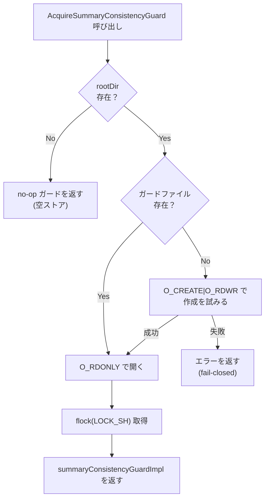
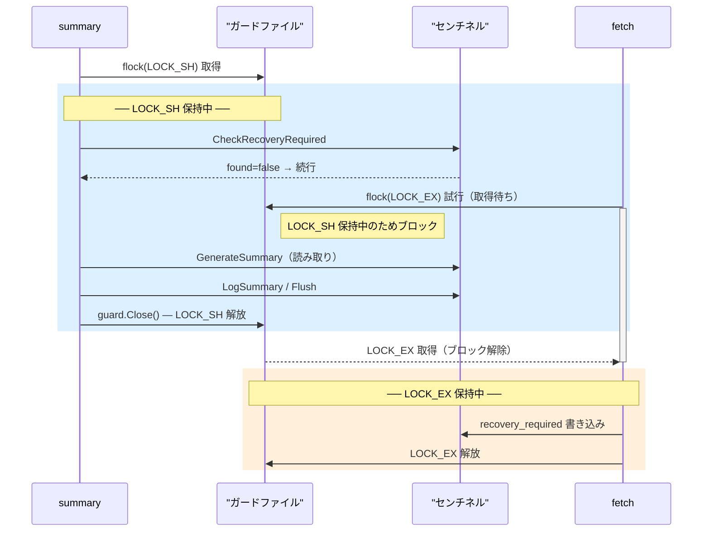
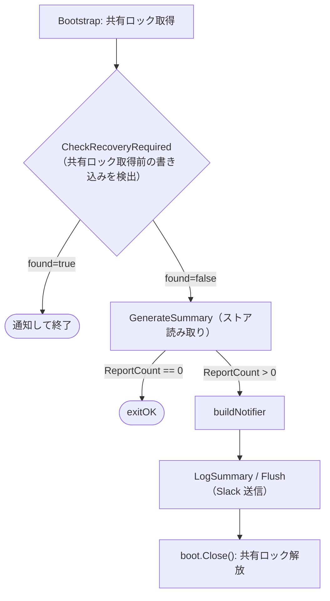

# プロセス間ロック設計ガイドライン

## 概要

本プロジェクトは `fetch` / `summary` / `gc` / `reprocess` / `recover` の各 CLI サブコマンドが、
TLSRPT レポートや収集済みメールを保管する指定ディレクトリ（以下「ストア」）を読み書きする。
ストアの構成については [ADR-0003](../adr/0003_reset_phase_design.ja.md) §1 を参照。
複数プロセスで CLI サブコマンドを同時実行した場合であってもストアが不整合になることを防ぐため、目的の異なる 2 種類のロックを使い分ける。

| ロック | 解決する問題 |
|---|---|
| store-wide process lock | 書き込み系サブコマンド同士の同時実行を防ぐ |
| summary consistency guard | `summary` と `fetch` の並走時に `recovery_required` の見逃しを防ぐ |

この 2 つは代替関係ではなく、それぞれ独立した問題を解決する。

---

## 1. サブコマンドの並走可否

| | `fetch` | `gc` | `reprocess` | `recover` | `summary` |
|---|---|---|---|---|---|
| **`fetch`** | ✗ | ✗ | ✗ | ✗ | ○ |
| **`gc`** | ✗ | ✗ | ✗ | ✗ | ○ |
| **`reprocess`** | ✗ | ✗ | ✗ | ✗ | ○ |
| **`recover`** | ✗ | ✗ | ✗ | ✗ | ○ |
| **`summary`** | ○ | ○ | ○ | ○ | ○ |

`fetch`・`gc`・`reprocess`・`recover` は store-wide process lock（排他ロック）を保持するため
互いに並走できない。`summary` は store-wide process lock を取得しないため store-wide には
ブロックされないが、書き込み系サブコマンドが `recovery_required` を変更する際には
summary consistency guard を通じて一時的に同期する（詳細は §3）。

`summary` 同士はいずれも summary consistency guard の共有ロックのみを取得するため、互いにブロックせず並走できる。

---

## 2. store-wide process lock

### 目的

書き込み系サブコマンド同士を直列化し、UIDVALIDITY 変化時の復旧操作
（`ResetForRecovery` / `AbortReset`）の進捗を管理する状態機械を、
単一 writer 前提で安全に操作できるようにする。

この状態機械は次の 3 ファイルで構成される。

- **リセットマニフェスト**: 復旧操作の進捗を `resetPhase`（1〜5）として記録する台帳
- **ステージングディレクトリ**: リセット中に旧データを一時退避する作業領域
- **センチネル**: `recovery_required` フラグや `UIDValidity` の確定値を保持するメタデータ

詳細は [ADR-0003](../adr/0003_reset_phase_design.ja.md) を参照。

### ロックファイル

`{root_dir}/.tlsrpt-digest-store.lock`（`LOCK_EX | LOCK_NB`）

排他ロックを取得できない場合は、他プロセスが同じストアを書き込み中とみなし待機せず失敗する。

### 対象サブコマンド

- `fetch`
- `gc`
- `reprocess`
- `recover`（`--mode keep-old` / `discard-old` / `--abort-reset` のいずれも）

### 契約

1. ストアを開く（`store.Open(...)` 呼び出し）より前に取得する。
2. 処理完了まで保持する（異常終了パスを含む）。
3. `recover --mode discard-old --yes` / `recover --abort-reset --yes` は
   ロック保持中に `OpenRecoverReset` を使う。
4. `ResetForRecovery` / `AbortReset` は単一 writer 前提で設計されているため、
   呼び出し側が必ず store-wide process lock を保持する。
5. `internal/store` 単体テストから直接呼ぶ場合は OS レベルのロックは不要だが、
   単一 writer 前提を明示する（例：単一 goroutine での直列実行）。

---

## 3. summary consistency guard

### 3.1 なぜ必要か

`summary` は `fetch` と並走できる設計であるため store-wide process lock を取得しない。
`fetch` は UID validity の変更を検出すると `recovery_required` センチネルを書き込む。
`summary` がこの書き込みを見逃したまま集計結果を送信すると、
不整合なサマリーが通知される。

これを防ぐのが summary consistency guard である。

### 3.2 ガードファイルのライフサイクル

ガードファイルが実際に存在することが summary consistency guard の前提条件である。
ガードファイルは **§2 で述べた書き込み系サブコマンドがストアを開くとき**に作成される。
具体的には、store-wide process lock を保持した状態でストアを書き込みモードで開く際に
ガードファイルが存在しなければ新規作成する。`summary` はストアを読み取り専用で開くため、
ガードファイルの作成は書き込み系サブコマンドの責務として分離されている。

**運用上の制約**: ガードファイルをサービス稼働中に手動で削除または `rename` で置き換えてはならない。
flock はパス名ではなく inode に対してかかる。稼働中にガードファイルの inode が入れ替わると、
両者の flock が異なる inode に対してかかるため互いに干渉せず、排他保護が機能しなくなる。

`AcquireSummaryConsistencyGuard` は呼び出し状態に応じて次のように動作する。

| 状態 | 動作 |
|---|---|
| `rootDir` 不在 | no-op ガードを返す（空ストア。writer が存在できないため `recovery_required` の書き込みも不可能） |
| `rootDir` あり・ガードファイルあり | `LOCK_SH` を取得（通常パス） |
| `rootDir` あり・ガードファイル不在 | `O_CREATE\|O_RDWR` でガードファイルを作成し `LOCK_SH` を取得（手動削除の救済） |
| `rootDir` あり・ガードファイル不在・作成失敗 | エラーを返す（fail-closed） |

### 3.3 ロック種別と動作

ロックファイル: `{root_dir}/.tlsrpt-digest-summary.lock`

| 取得者 | flock 種別 | 取得失敗時の動作 |
|---|---|---|
| `summary`（`AcquireSummaryConsistencyGuard`） | 共有ロック（`LOCK_SH`） | ブロック（待機） |
| `recovery_required` を変更するストア API（`withGuardExclusive`） | 排他ロック（`LOCK_EX`） | ブロック（待機） |

`summary` が共有ロックを保持している間、`recovery_required` センチネルへの書き込みを
試みた `fetch` は排他ロック取得でブロック（待機）する。`fetch` はエラーにならず、
`summary` が共有ロックを解放するまで待ち続ける。ブロックが発生するのは
`SaveRecoveryRequired` の呼び出し箇所のみであり、それ以前のメール取得や
レポート保存は `summary` と並走して進む。

`summary` サブコマンド実行中に `fetch` が実行された場合の処理フローを次に示す。

### 3.4 `recovery_required` を変更するストア API（排他ロックが必要）

- `SaveRecoveryRequired`
- `ClearRecoveryRequired`
- `ApplyRecovery`（※後述）
- `ResetForRecovery` のコミット処理（`commitReset`）

以下は `recovery_required` を変更しないためガード不要：

- `ResetForRecovery` の初期マニフェスト/ステージング作成
- `stageDataFile` / `stageEmailsDir`
- `AbortReset` の restore 処理（センチネルを変更しないためガード不要。ただし センチネルの
  `recovery_required` は最後まで保持されるので `summary` は引き続き fail-closed となる）
- コミット後のクリーンアップ

**`ApplyRecovery` の追加保護について**

`ApplyRecovery`（keep-old リカバリ）は `withGuardExclusive` だけでは不十分で、
**`HasPendingReset()` による事前チェックも必要**である。

理由：リセット操作中（フェーズ 1〜5）にはデータファイルがステージングに移動されている
可能性がある。`withGuardExclusive` はセンチネルの可視性しか保証しないため、
保留リセットを無視して `recovery_required` を消すと「UIDValidity 更新済み + `recovery_required` クリア済み + データなし」という矛盾状態が生じる。

`ApplyRecovery` はマニフェストが存在する場合に `ErrPendingReset` を返すことで、
この経路をストア層で閉じている。**`recovery_required` を変更する新しい API を追加する
場合も同様に、保留リセット中の呼び出し可否を設計時に検討し、必要なら
`HasPendingReset()` 事前チェックを追加すること。**

### 3.5 `summary` の recovery_required チェック設計

**共有ロックの保持範囲**

共有ロックは Bootstrap 時（`AcquireSummaryConsistencyGuard`）に取得され、
`guard.Close()`（`boot.Close()`）まで保持される。
つまり `summary` コマンドの実行全体にわたって保持される。

この間、`fetch` の `SaveRecoveryRequired` は排他ロック取得でブロックされるため、
**`summary` 実行中にセンチネルが書き込まれることは物理的に不可能**である。
唯一の競合ウィンドウは「Bootstrap が共有ロックを取得する前に `fetch` がセンチネルを
書き込む」タイミングだけである。

**チェックのタイミングと目的**

`summary` は `CheckRecoveryRequired` を集計開始前に 1 回だけ呼ぶ。
これは共有ロック取得前にセンチネルが書き込まれていた場合を検出するためである。

`recovery_required` が立っていれば、その後のオペレーター操作（`recover`）によってストアデータが変更される見込みである。集計結果が陳腐化している可能性が高いため、通知して終了する。

**なぜ送信直前の再チェックをしないか**

`summary` が共有ロックを保持している間は `fetch` のセンチネル書き込みがブロックされるため、
`CheckRecoveryRequired` 通過後にセンチネルが変化することはない。再チェックは不要である。

### 3.6 `SaveRecoveryRequired` を呼ぶのは `fetch` のみ

`SaveRecoveryRequired` を呼び出すのは現在 `fetch` だけである。
`gc`・`reprocess`・`recover` は `summary` と並走できるが、
`recovery_required` センチネルを書き込まないため summary consistency guard の対象外である。

**summary consistency guard が対象とする競合は `fetch` との並走のみ**である。

---

## 4. 過剰保護を避ける方針

summary consistency guard を store-wide process lock の代わりに使ってはならない。
summary consistency guard は `recovery_required` の可視性のみを守るものであり、
マニフェストやステージングの状態機械全体を直列化するものではない。

避けるべきパターン：

- `recovery_required` を変更しない処理を summary consistency guard で囲み、
  `summary` を不要にブロックする
- マニフェスト作成だけを ガードで囲み、
  後続のステージング / コミット / クリーンアップを無保護にする
- 2 種類のロックの責務を同じコメントや API 名で混同する

望ましい責務分担：

| 問題 | 解決手段 |
|---|---|
| 書き込み系サブコマンド同士の直列化 | store-wide process lock（cmd 層） |
| `summary` vs `fetch` の `recovery_required` 競合 | summary consistency guard（`internal/store` 層） |
| crash recovery の原子性 | リセットマニフェスト・ステージング・センチネル commit barrier |

---

## 5. 実装・レビュー時のチェックリスト

**書き込み系サブコマンドを追加・変更するとき**

- [ ] store open 前に store-wide process lock を取得している
- [ ] 処理完了まで（異常終了パスを含む）lock handle を保持している
- [ ] `recover --mode discard-old --yes` / `recover --abort-reset --yes` は
  lock 保持中に `OpenRecoverReset` を使っている
- [ ] `ResetForRecovery` / `AbortReset` を直接呼ぶ場合は store-wide process lock を
  保持している
- [ ] `internal/store` 単体テストから直接呼ぶ場合は単一 writer 前提を明示している
- [ ] 新たに `SaveRecoveryRequired` を呼ぶ場合は §3 の契約に従い、
  summary consistency guard との整合を確認している

**`recovery_required` を変更するストア API を追加・変更するとき**

- [ ] `{root_dir}/.tlsrpt-digest-summary.lock` に対して排他 lock を取得している
  （`withGuardExclusive` を使用）
- [ ] `recovery_required` を変更しない処理を summary consistency guard で囲んでいない
- [ ] `summary` が stale な「復旧不要」判断で送信しないことをテストしている
- [ ] 保留リセット中（マニフェスト存在時）に呼ばれた場合の挙動を設計している：
  データファイルがステージングに移動済みの可能性があるため、`recovery_required` を
  クリアするだけでは不整合になるケースを考慮する。問題がある場合は `HasPendingReset()`
  による事前チェックで `ErrPendingReset` を返す（`ApplyRecovery` の実装を参照）

**`summary` サブコマンドまたは recovery_required チェック設計を変更するとき**

- [ ] `CheckRecoveryRequired` の呼び出しタイミングと目的が §3.5 と一致している
- [ ] チェック位置を追加・変更した場合は §3.5 を更新している
- [ ] 新たなストアにアクセスする前に `Open(OpenReadWrite)` が一度でも実行されること
  （ガードファイル作成の前提）を確認している

---

## 6. 関連文書

- [ADR-0003: ResetForRecovery のフェーズ設計とコミット後クリーンアップの扱い](../adr/0003_reset_phase_design.ja.md)
- `docs/tasks/0070_entrypoint/02_architecture.md` §3.3 / §6.4
- `docs/tasks/0070_entrypoint/03_implementation_plan.md` ステップ 1-5 / 3-3
