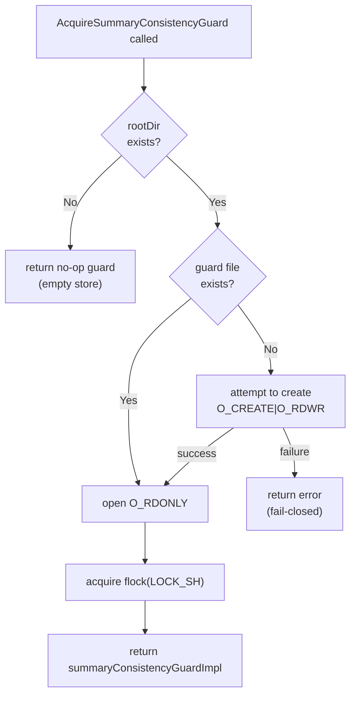
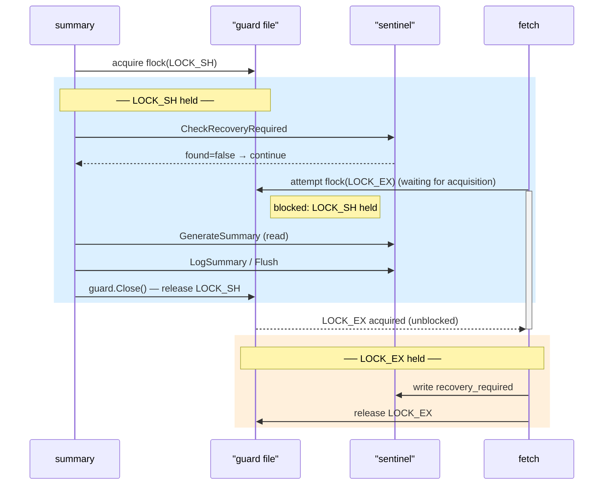
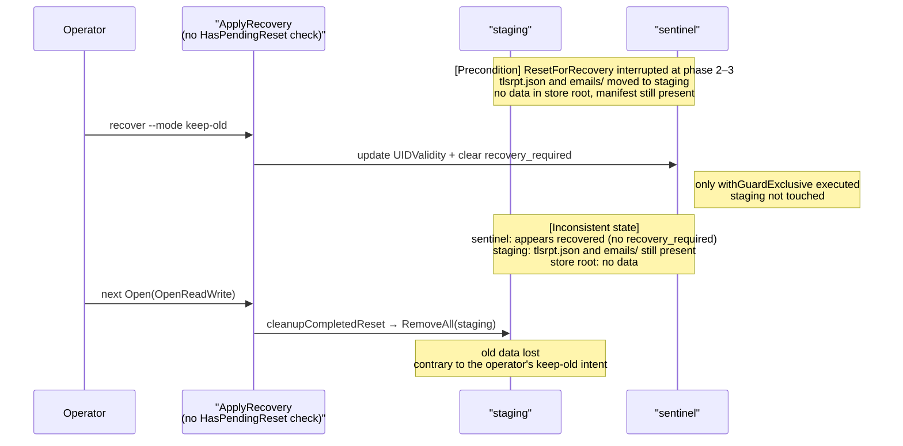
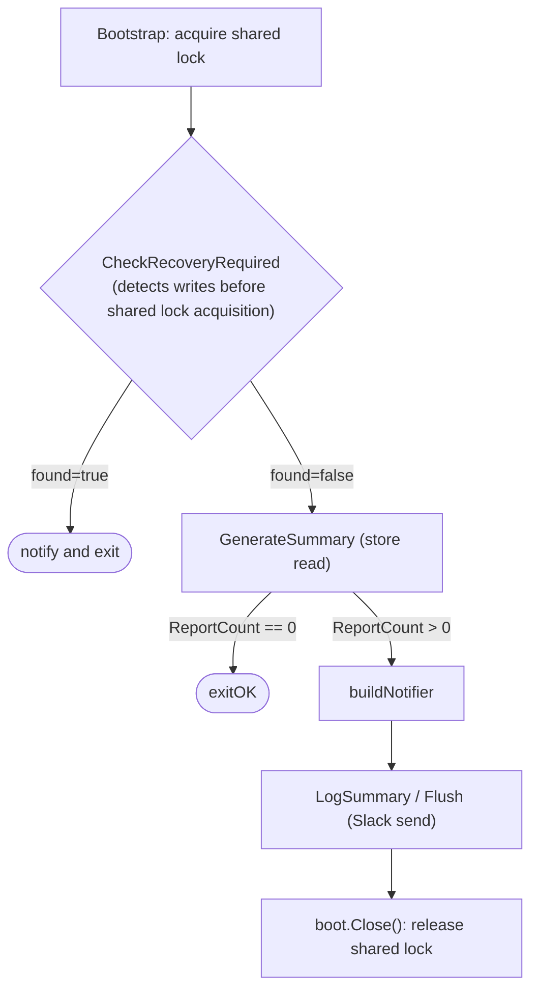

# Inter-Process Locking Design Guidelines

## Overview

The `fetch` / `summary` / `gc` / `reprocess` / `recover` CLI subcommands of this project all read and write a designated directory (hereinafter "the store") that holds TLSRPT reports and collected emails. For the store's structure, see [ADR-0003](../adr/0003_reset_phase_design.md) §1. To prevent the store from becoming inconsistent when multiple processes run the CLI subcommands simultaneously, two types of locks with different purposes are used.

| Lock | Problem solved |
|---|---|
| store-wide process lock | Prevents concurrent execution among write subcommands |
| summary consistency guard | Prevents `recovery_required` from being missed during concurrent execution of `summary` and `fetch` |

These two are not alternatives to each other; each solves an independent problem.

---

## 1. Subcommand Concurrency Compatibility

| | `fetch` | `gc` | `reprocess` | `recover` | `summary` |
|---|---|---|---|---|---|
| **`fetch`** | ✗ | ✗ | ✗ | ✗ | ○ |
| **`gc`** | ✗ | ✗ | ✗ | ✗ | ○ |
| **`reprocess`** | ✗ | ✗ | ✗ | ✗ | ○ |
| **`recover`** | ✗ | ✗ | ✗ | ✗ | ○ |
| **`summary`** | ○ | ○ | ○ | ○ | ○ |

`fetch`, `gc`, `reprocess`, and `recover` hold the store-wide process lock (exclusive lock) and therefore cannot run concurrently with each other. `summary` does not acquire the store-wide process lock and is not blocked at the store-wide level, but it does synchronize briefly with write subcommands via the summary consistency guard when they modify `recovery_required` (see §3 for details).

Multiple `summary` instances each acquire only the summary consistency guard's shared lock, so they do not block each other and can run concurrently.

---

## 2. store-wide process lock

### Purpose

Serialize write subcommands with respect to each other so that the state machine managing the progress of UIDVALIDITY recovery operations (`ResetForRecovery` / `AbortReset`) can be operated safely under the single-writer assumption.

This state machine consists of the following three files.

- **Reset manifest**: a ledger recording the progress of recovery operations as `resetPhase` (1–5)
- **Staging directory**: a working area for temporarily holding old data during a reset
- **Sentinel**: metadata holding the `recovery_required` flag and the finalized `UIDValidity` value

See [ADR-0003](../adr/0003_reset_phase_design.md) for details.

### Lock File

`{root_dir}/.tlsrpt-digest-store.lock` (`LOCK_EX | LOCK_NB`)

If the exclusive lock cannot be acquired, the system treats another process as currently writing to the same store and fails immediately without waiting.

### Target Subcommands

- `fetch`
- `gc`
- `reprocess`
- `recover` (any of `--mode keep-old` / `discard-old` / `--abort-reset`)

### Contract

1. Acquire before opening the store (`store.Open(...)` call).
2. Hold until processing is complete (including abnormal exit paths).
3. `recover --mode discard-old --yes` / `recover --abort-reset --yes` use `OpenRecoverReset` while holding the store-wide process lock.
4. Since `ResetForRecovery` / `AbortReset` are designed under the single-writer assumption, callers must always hold the store-wide process lock.
5. When called directly from `internal/store` unit tests, an OS-level lock is not required, but the single-writer assumption must be made explicit (e.g., single goroutine sequential execution).

---

## 3. summary consistency guard

### 3.1 Why It Is Needed

`summary` does not acquire the store-wide process lock because it is designed to run concurrently with `fetch`. `fetch` writes the `recovery_required` sentinel when it detects a UID validity change. If `summary` sends aggregated results without noticing this write, an inconsistent summary will be delivered.

The summary consistency guard prevents this.

### 3.2 Guard File Lifecycle

The actual existence of the guard file is a prerequisite for the summary consistency guard to function. The guard file is created **when write subcommands described in §2 open the store**. Specifically, when the store is opened in write mode while holding the store-wide process lock, the guard file is created if it does not already exist. Because `summary` opens the store in read-only mode, creating the guard file is the responsibility of write subcommands.

**Operational constraint**: The guard file must not be manually deleted or replaced via `rename` while the service is running. flock is applied to the inode, not the path name. If the guard file's inode is replaced while the service is running, the two flocks will be applied to different inodes and will not interfere with each other, causing exclusive protection to stop functioning.

`AcquireSummaryConsistencyGuard` behaves as follows depending on the call state.

| State | Behavior |
|---|---|
| `rootDir` absent | Returns a no-op guard (empty store; writers cannot exist, so writing `recovery_required` is also impossible) |
| `rootDir` present, guard file present | Acquires `LOCK_SH` (normal path) |
| `rootDir` present, guard file absent | Creates the guard file with `O_CREATE\|O_RDWR` and acquires `LOCK_SH` (fallback for manual deletion) |
| `rootDir` present, guard file absent, creation failed | Returns an error (fail-closed) |

### 3.3 Lock Types and Behavior

Lock file: `{root_dir}/.tlsrpt-digest-summary.lock`

| Acquirer | flock type | Behavior when acquisition fails |
|---|---|---|
| `summary` (`AcquireSummaryConsistencyGuard`) | shared lock (`LOCK_SH`) | Block (wait) |
| Store APIs that modify `recovery_required` (`withGuardExclusive`) | exclusive lock (`LOCK_EX`) | Block (wait) |

While `summary` holds the shared lock, `fetch` attempting to write to the `recovery_required` sentinel blocks (waits) on exclusive lock acquisition. `fetch` does not return an error; it waits until `summary` releases the shared lock. The block occurs only at the `SaveRecoveryRequired` call site; prior operations such as mail fetching and report saving proceed concurrently with `summary`.

The following diagram shows the processing flow when `fetch` runs during `summary` subcommand execution.

### 3.4 Store APIs That Modify `recovery_required` (Exclusive Lock Required)

- `SaveRecoveryRequired`
- `ClearRecoveryRequired`
- `ApplyRecovery` (see note below)
- Commit processing in `ResetForRecovery` (`commitReset`)

The following do not modify `recovery_required` and do not require the guard:

- Initial manifest/staging creation in `ResetForRecovery`
- `stageDataFile` / `stageEmailsDir`
- Restore processing in `AbortReset` (guard not required because the sentinel is not modified; however, `recovery_required` remains set in the sentinel throughout, so `summary` remains fail-closed)
- Post-commit cleanup

**Additional Protection in `ApplyRecovery`**

`ApplyRecovery` (keep-old recovery) requires not only `withGuardExclusive` but also a **`HasPendingReset()` pre-check**.

Reason: during a reset operation (phases 1–5), data files may have been moved to staging. Because `withGuardExclusive` only guarantees the visibility of the sentinel, clearing `recovery_required` while ignoring a pending reset produces the inconsistent state of "UIDValidity updated + `recovery_required` cleared + no data."

The following diagram shows the sequence that produces an inconsistency when the `HasPendingReset()` check is absent.

`ApplyRecovery` closes this path at the store layer by returning `ErrPendingReset` when a manifest is present. **When adding a new API that modifies `recovery_required`, likewise consider at design time whether calling it during a pending reset is permissible, and add a `HasPendingReset()` pre-check if necessary.**

### 3.5 `summary`'s recovery_required Check Design

**Shared Lock Scope**

The shared lock is acquired during Bootstrap (`AcquireSummaryConsistencyGuard`) and held until `guard.Close()` (`boot.Close()`). That is, it is held throughout the entire execution of the `summary` command.

During this time, `fetch`'s `SaveRecoveryRequired` is blocked on exclusive lock acquisition, making it **physically impossible for the sentinel to be written during `summary` execution**. The only race window is the moment `fetch` writes the sentinel before Bootstrap acquires the shared lock.

**Check Timing and Purpose**

`summary` calls `CheckRecoveryRequired` exactly once, before aggregation begins. This is to detect any sentinel that was written before the shared lock was acquired.

If `recovery_required` is set, subsequent operator action (`recover`) is expected to modify the store data. Because the aggregated results are likely to be stale, the command notifies and exits.

**Why Not Re-check Just Before Sending**

Since `fetch`'s sentinel write is blocked while `summary` holds the shared lock, the sentinel cannot change after `CheckRecoveryRequired` passes. A re-check is unnecessary.

### 3.6 Only `fetch` Calls `SaveRecoveryRequired`

`SaveRecoveryRequired` is currently called only by `fetch`. `gc`, `reprocess`, and `recover` can run concurrently with `summary` but do not write the `recovery_required` sentinel, so they are outside the scope of the summary consistency guard.

**The only concurrency the summary consistency guard addresses is concurrent execution with `fetch`.**

---

## 4. Policy for Avoiding Over-Protection

The summary consistency guard must not be used as a substitute for the store-wide process lock. The summary consistency guard protects only the visibility of `recovery_required`; it does not serialize the entire state machine of the manifest or staging.

Patterns to avoid:

- Wrapping operations that do not modify `recovery_required` in the summary consistency guard, unnecessarily blocking `summary`
- Wrapping only manifest creation in the summary consistency guard while leaving subsequent staging / commit / cleanup unprotected
- Conflating the responsibilities of the two lock types through shared comments or API names

Preferred responsibility split:

| Problem | Solution |
|---|---|
| Serialization among write subcommands | store-wide process lock (cmd layer) |
| `summary` vs `fetch` `recovery_required` race | summary consistency guard (`internal/store` layer) |
| Atomicity of crash recovery | reset manifest, staging, sentinel commit boundary |

---

## 5. Implementation and Review Checklist

**When adding or modifying write subcommands**

- [ ] The store-wide process lock is acquired before opening the store
- [ ] The store-wide process lock is held until processing is complete (including abnormal exit paths)
- [ ] `recover --mode discard-old --yes` / `recover --abort-reset --yes` use `OpenRecoverReset` while holding the store-wide process lock
- [ ] `ResetForRecovery` / `AbortReset` are called while holding the store-wide process lock
- [ ] The single-writer assumption is made explicit when called directly from `internal/store` unit tests
- [ ] When newly calling `SaveRecoveryRequired`, the contract in §3 is followed and consistency with the summary consistency guard is verified

**When adding or modifying store APIs that modify `recovery_required`**

- [ ] An exclusive lock on `{root_dir}/.tlsrpt-digest-summary.lock` is acquired (using `withGuardExclusive`)
- [ ] Operations that do not modify `recovery_required` are not wrapped in the summary consistency guard
- [ ] It is tested that `summary` does not send based on a stale "no recovery needed" judgment
- [ ] The behavior when called during a pending reset (manifest present) is designed: because data files may have already been moved to staging, cases where clearing `recovery_required` alone results in inconsistency must be considered. If this is a concern, add a `HasPendingReset()` pre-check to return `ErrPendingReset` (see the `ApplyRecovery` implementation)

**When modifying the `summary` subcommand or `recovery_required` check design**

- [ ] The `CheckRecoveryRequired` call timing and purpose are consistent with §3.5
- [ ] §3.5 is updated when check positions are added or modified
- [ ] It is confirmed that `Open(OpenReadWrite)` has been executed at least once before accessing a new store (prerequisite for guard file creation)

---

## 6. Related Documents

- [ADR-0003: ResetForRecovery Phase Design and Handling of Post-Commit Cleanup](../adr/0003_reset_phase_design.md)
- `docs/tasks/0070_entrypoint/02_architecture.md` §3.3 / §6.4
- `docs/tasks/0070_entrypoint/03_implementation_plan.md` Step 1-5 / 3-3
