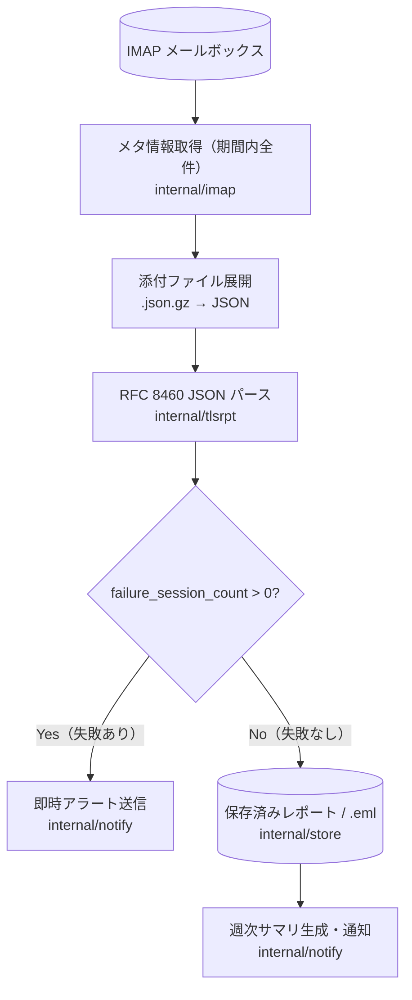
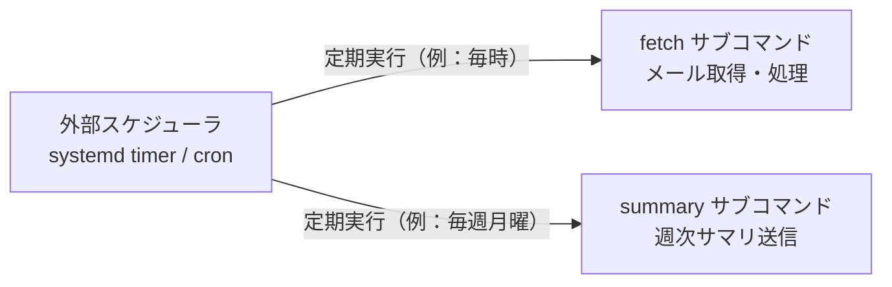

# tlsrpt-digest プロジェクト概要

## 1. 目的と背景

### TLSRPT とは

SMTP TLS Reporting（RFC 8460、通称 TLSRPT）は、メール送信者が受信側の TLS ポリシー（MTA-STS や DANE）の適用状況を報告するための仕様です。Google などの大手メール送信者は、このレポートを日次で JSON 形式（gzip 圧縮）のファイルとしてメールに添付して送信します。

### なぜ自動処理が必要か

TLSRPT レポートは毎日大量に届くため、手動での確認は現実的ではありません。重要なのは `failure_session_count`（TLS 接続失敗数）の有無であり、失敗が検出された場合は速やかに管理者に通知する必要があります。問題のない日常レポートは蓄積して週次サマリとして報告することで、管理コストを最小化します。

### プロジェクトの目的

tlsrpt-digest は以下を自動化します：

1. IMAP メールボックスへの接続によるレポートメールの取得
2. 添付 JSON の解析と failure_session_count の評価
3. 失敗検出時の即時アラート送信
4. 正常時データの蓄積と週次サマリ通知

---

## 2. 処理フロー



### 実行方式

プログラムは one-shot で実行して終了する。定期実行は外部スケジューラー（systemd timer または cron）が担う。



---

## 3. パッケージ構成と責務

```
tlsrpt-digest/
├── cmd/
│   └── tlsrpt-digest/        # エントリポイント・サブコマンド・one-shot 実行
├── internal/
│   ├── imap/                 # IMAP接続・メタ情報取得（期間内全件）・選択的ダウンロード・既読マーク
│   ├── tlsrpt/               # RFC 8460 JSON パース・failure判定
│   ├── notify/               # Slack / メール通知（即時アラート・週次サマリ）
│   └── store/                # レポート永続化（.json / .eml）・週次サマリ用データ管理
├── testdata/                 # テスト用実データ（.eml, .json.gz）
└── docs/                     # ドキュメント
```

### 各パッケージの責務

| パッケージ | 責務 |
|---|---|
| `internal/imap` | IMAP サーバへの接続、取得期間内の全メールのメタ情報取得、選択的ダウンロード、処理後の既読マーク |
| `internal/tlsrpt` | .json.gz 添付ファイルの展開、RFC 8460 JSON のパース、failure_session_count の評価 |
| `internal/notify` | Slack Webhook / メールによる通知送信（即時アラートと週次サマリの両方） |
| `internal/store` | .eml ファイルの保存・読み込み、JSON によるレポートデータの永続化、週次サマリ用の集計 |
| `cmd/tlsrpt-digest` | 設定ファイル読み込み、各パッケージの初期化、サブコマンド（fetch / summary / reprocess）の実行 |

---

## 4. 技術的決定とその理由

### IMAP ポーリング方式の採用

Postfix のパイプ方式ではなく IMAP ポーリング方式を採用した理由：

| 観点 | IMAP ポーリング | Postfix パイプ |
|---|---|---|
| Postfix への影響 | **なし**（設定変更不要） | Postfix コンテナの設定変更が必要 |
| プロセス管理 | **独立したプロセス**として管理可能 | Postfix と密結合 |
| テスト容易性 | **高い**（`FakeMailFetcher` などのインターフェースモック） | 低い |
| 再処理 | 既読/未読フラグで制御可能 | 一度きり |

### インターフェース駆動設計

`MailFetcher`、`Notifier` などのインターフェースを定義することで、テスト時にモック実装（`FakeMailFetcher`、`SpyNotifier`）に差し替えられる設計とする。

### データ蓄積にファイルベースの保存方式を採用

週次サマリのためにレポートデータを蓄積する必要がある。外部データベースサーバなしで動作させるため、集計済みレポートデータは JSON ファイルに保存し、再処理用に元メールを `.eml` ファイルとして保存する。

---

## 5. 通知仕様

### 即時アラート（失敗検出時）

- **トリガー**: `failure_session_count > 0` のレポートを検出した場合
- **タイミング**: レポート処理直後（リアルタイム）
- **内容**: 送信元ドメイン、対象ポリシー（MTA-STS / DANE）、失敗件数、レポート期間
- **通知先**: Slack Webhook（優先）またはメール

### 週次サマリ（正常時）

- **トリガー**: 週次スケジュール（例：毎週月曜日）
- **内容**: 先週受信したレポートの集計（ドメイン別、ポリシー別の成功件数）
- **目的**: 問題がない週でも定期的な動作確認を提供する
- **通知先**: 即時アラートと同じ通知先

---

## 6. 設定項目

設定ファイルは TOML 形式を採用します。

### IMAP 接続設定

| 項目 | 説明 | 例 |
|---|---|---|
| `imap.host` | IMAP サーバホスト名 | `"imap.example.com"` |
| `imap.port` | IMAP サーバポート番号 | `993` |
| `imap.username` | 認証ユーザ名 | `"tlsrpt@example.com"` |
| `imap.password` | 認証パスワード | `"secret"` |
| `imap.mailbox` | 監視するメールボックス名 | `"INBOX"` |
| `imap.fetch_days` | `fetch` 実行時に取得対象とする日数 | `14` |

実行スケジュールは `systemd timer` や `cron` などの外部スケジューラーで管理し、アプリケーション自体は `polling.*` 設定を持たない。

### 通知設定

| 項目 | 説明 | 例 |
|---|---|---|
| `notify.slack.allowed_host` | 許可する Slack Webhook のホスト名 | `"hooks.slack.com"` |
| `TLSRPT_SLACK_WEBHOOK_URL_SUCCESS` | 正常時通知用 Webhook URL（環境変数） | `"https://hooks.slack.com/..."` |
| `TLSRPT_SLACK_WEBHOOK_URL_ERROR` | 異常時通知用 Webhook URL（環境変数） | `"https://hooks.slack.com/..."` |
| `notify.email.smtp_host` | メール送信用 SMTP ホスト | `"smtp.example.com"` |
| `notify.email.from` | 送信元メールアドレス | `"alert@example.com"` |
| `notify.email.to` | 送信先メールアドレス | `["admin@example.com"]` |

---

## 7. 依存ライブラリ

| ライブラリ | 用途 |
|---|---|
| `emersion/go-imap` | IMAP クライアント |
| `stretchr/testify` | テストアサーション |
| TOML ライブラリ（`BurntSushi/toml` など） | 設定ファイル読み込み |
