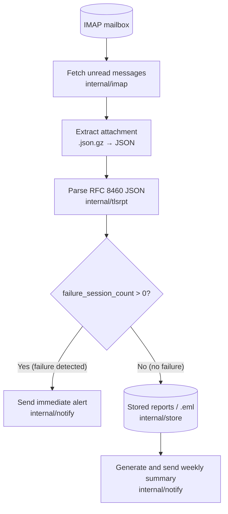
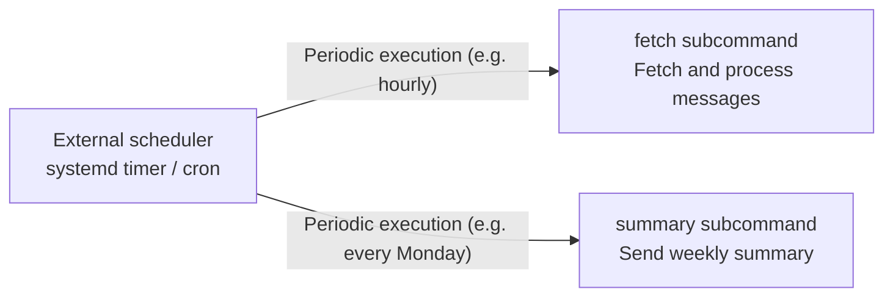

# tlsrpt-digest Project Overview

## 1. Purpose and Background

### What is TLSRPT

SMTP TLS Reporting (RFC 8460, commonly known as TLSRPT) is a specification by which email senders report the status of TLS policy enforcement (MTA-STS and DANE) on the receiving side. Major email senders such as Google send these reports daily as JSON files (gzip-compressed) attached to emails.

### Why Automated Processing is Needed

TLSRPT reports arrive in large volumes every day, making manual review impractical. What matters is the presence or absence of `failure_session_count` (the number of TLS connection failures). When failures are detected, administrators must be notified promptly. Routine reports with no issues are accumulated and reported as a weekly summary, minimizing management overhead.

### Project Purpose

tlsrpt-digest automates the following:

1. Fetching report emails by connecting to an IMAP mailbox
2. Parsing the attached JSON and evaluating failure_session_count
3. Sending immediate alerts when failures are detected
4. Accumulating data on normal days and sending weekly summary notifications

---

## 2. Processing Flow



### Execution Model

The program runs as a one-shot process and exits after completing its work. Periodic execution is delegated to an external scheduler (systemd timer or cron).



---

## 3. Package Structure and Responsibilities

```
tlsrpt-digest/
├── cmd/
│   └── tlsrpt-digest/        # Entry point, subcommands, one-shot execution
├── internal/
│   ├── imap/                 # IMAP connection, unread message fetching, marking as read
│   ├── tlsrpt/               # RFC 8460 JSON parsing, failure detection
│   ├── notify/               # Slack / email notification (immediate alerts and weekly summaries)
│   └── store/                # Report persistence (.json / .eml), data management for weekly summaries
├── testdata/                 # Real test data (.eml, .json.gz)
└── docs/                     # Documentation
```

### Responsibilities of Each Package

| Package | Responsibility |
|---|---|
| `internal/imap` | Connecting to the IMAP server, fetching unread messages, marking messages as read after processing |
| `internal/tlsrpt` | Extracting .json.gz attachments, parsing RFC 8460 JSON, evaluating failure_session_count |
| `internal/notify` | Sending notifications via Slack Webhook / email (both immediate alerts and weekly summaries) |
| `internal/store` | Saving and loading .eml files, persisting report data as JSON, aggregation for weekly summaries |
| `cmd/tlsrpt-digest` | Loading configuration files, initializing each package, running subcommands (fetch / summary / reprocess) |

---

## 4. Technical Decisions and Rationale

### Adopting the IMAP Polling Approach

The rationale for adopting IMAP polling instead of the Postfix pipe approach:

| Aspect | IMAP Polling | Postfix Pipe |
|---|---|---|
| Impact on Postfix | **None** (no configuration changes required) | Requires changes to the Postfix container configuration |
| Process management | Can be managed as an **independent process** | Tightly coupled to Postfix |
| Testability | **High** (interface mocks such as `FakeMailFetcher`) | Low |
| Reprocessing | Controllable via read/unread flags | One-time only |

### Interface-Driven Design

By defining interfaces such as `MailFetcher` and `Notifier`, the design allows mock implementations (`FakeMailFetcher`, `SpyNotifier`) to be substituted during testing.

### Adopting File-Based Storage for Data Accumulation

Report data must be accumulated for the weekly summary. The project uses JSON files for aggregated report data and stores original emails as `.eml` files so it can operate without an external database server while preserving inputs for reprocessing.

---

## 5. Notification Specification

### Immediate Alert (upon failure detection)

- **Trigger**: When a report with `failure_session_count > 0` is detected
- **Timing**: Immediately after processing the report (real-time)
- **Content**: Sending organization name, target policy (MTA-STS / DANE), failure count, report period
- **Notification destination**: Slack Webhook (preferred) or email

### Weekly Summary (normal operation)

- **Trigger**: Weekly schedule (e.g., every Monday)
- **Content**: Aggregation of reports received during the past week (success counts by domain and by policy)
- **Purpose**: Provides regular confirmation that the system is operating correctly even in weeks with no issues
- **Notification destination**: Same as for immediate alerts

---

## 6. Configuration Items

The configuration file uses TOML format.

### IMAP Connection Settings

| Item | Description | Example |
|---|---|---|
| `imap.host` | IMAP server hostname | `"imap.example.com"` |
| `imap.port` | IMAP server port number | `993` |
| `imap.username` | Authentication username | `"tlsrpt@example.com"` |
| `imap.password` | Authentication password | `"secret"` |
| `imap.mailbox` | Mailbox name to monitor | `"INBOX"` |
| `imap.fetch_days` | Lookback window in days for `fetch` processing | `14` |

Scheduling is controlled by an external scheduler such as `systemd timer` or `cron`; the application itself does not provide `polling.*` configuration.

### Notification Settings

| Item | Description | Example |
|---|---|---|
| `notify.slack.allowed_host` | Allowed Slack Webhook host name | `"hooks.slack.com"` |
| `TLSRPT_SLACK_WEBHOOK_URL_SUCCESS` | Success notification Webhook URL (environment variable) | `"https://hooks.slack.com/..."` |
| `TLSRPT_SLACK_WEBHOOK_URL_ERROR` | Error notification Webhook URL (environment variable) | `"https://hooks.slack.com/..."` |
| `notify.email.smtp_host` | SMTP host for email sending | `"smtp.example.com"` |
| `notify.email.from` | Sender email address | `"alert@example.com"` |
| `notify.email.to` | Recipient email address(es) | `["admin@example.com"]` |

---

## 7. Dependencies

| Library | Purpose |
|---|---|
| `emersion/go-imap` | IMAP client |
| `stretchr/testify` | Test assertions |
| TOML library (e.g., `BurntSushi/toml`) | Configuration file loading |
