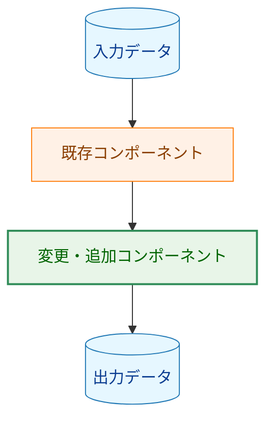
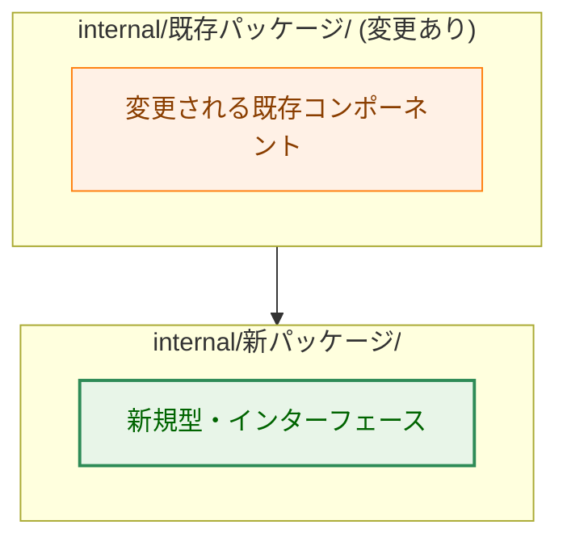
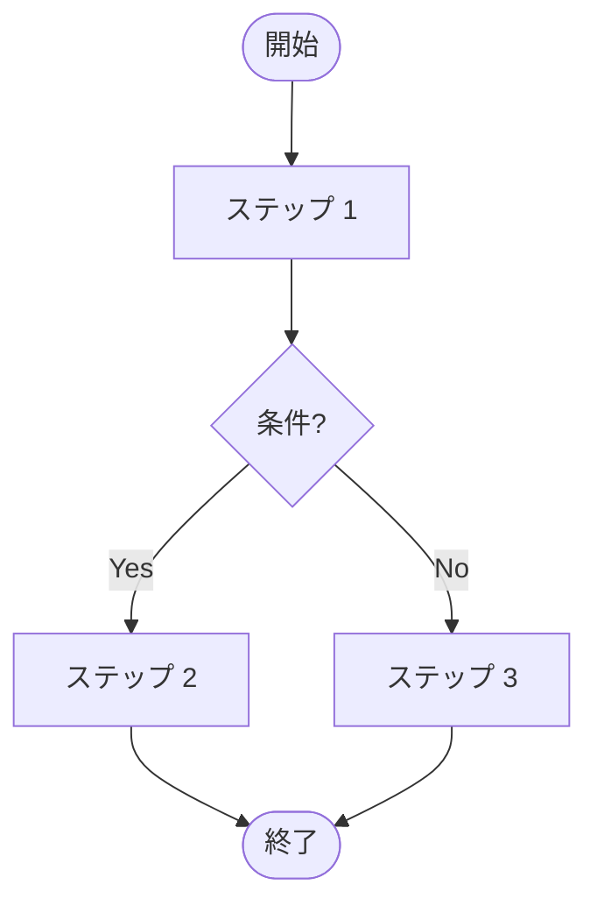
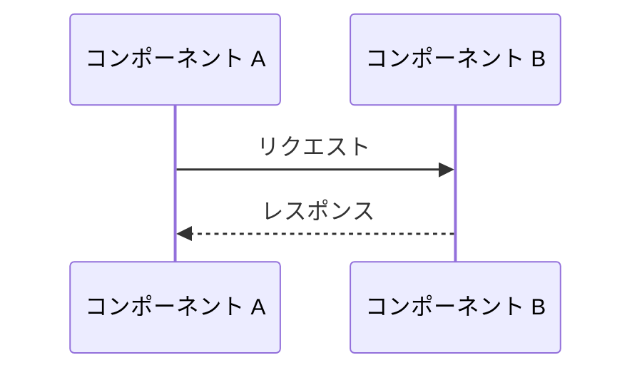

# アーキテクチャ設計書：[機能名]

## ドキュメントステータス

| 項目 | 内容 |
|---|---|
| ステータス | `draft` |
| 作成日 | YYYY-MM-DD |
| レビュー日 | - |
| レビュアー | - |
| コメント | - |

---

## 1. 設計概要

### 1.1 設計原則

- **[原則名]**: ...

### 1.2 概念モデル

**凡例（Legend）**

---

## 2. システム構成

### 2.1 全体アーキテクチャ

### 2.2 処理フロー

### 2.3 データフロー / シーケンス図

---

## 3. コンポーネント設計

### 3.1 インターフェース・型定義

（高レベルのインターフェース・エラー型のみ記述。具体的な実装はコードに委ねる）

### 3.2 コンポーネントの責務

| コンポーネント | 責務 | 変更種別 |
|-------------|------|---------|
| `internal/xxx/yyy.go` | ... | 新規追加 |
| `internal/zzz/www.go` | ... | 変更あり |

---

## 4. エラーハンドリング設計

（エラー型の定義方針・エラーメッセージの設計パターンを記述）

---

## 5. セキュリティ考慮事項

（セキュリティ設計・脅威モデルを記述。関係ない場合は「該当なし」）

---

## 6. テスト戦略

### 単体テスト

- ...

### 統合テスト

- ...

---

## 7. 実装優先順位

### フェーズ 1: [フェーズ名]

1. ...

### フェーズ 2: [フェーズ名]

1. ...
