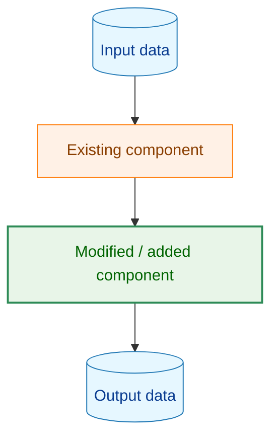
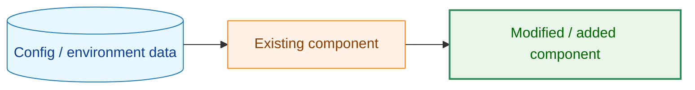
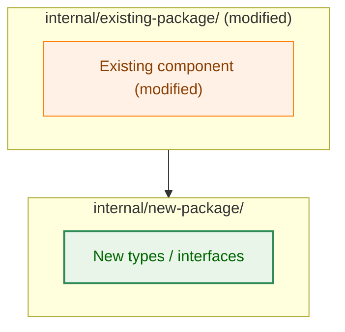
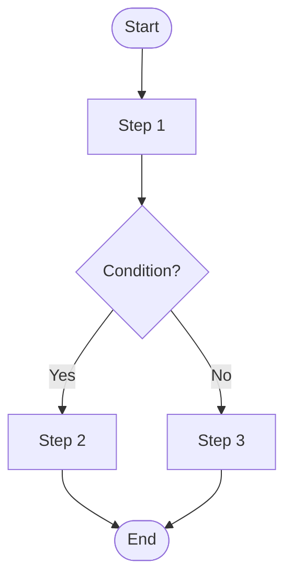
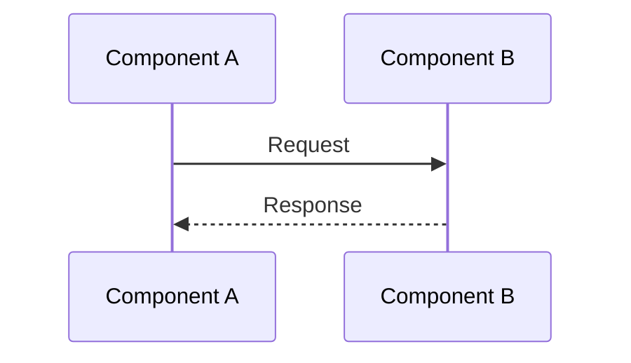

# Architecture Design Document: [Feature Name]

## Document Status

| Item | Value |
|---|---|
| Status | `draft` |
| Created | YYYY-MM-DD |
| Review date | - |
| Reviewer | - |
| Comments | - |

---

## 1. Design Overview

### 1.1 Design Principles

- **[Principle Name]**: ...

### 1.2 Concept Model

**Legend**

---

## 2. System Structure

### 2.1 Overall Architecture

### 2.2 Processing Flow

### 2.3 Data Flow / Sequence Diagram

---

## 3. Component Design

### 3.1 Interface and Type Definitions

(Describe only high-level interfaces and error types. Leave concrete implementations to the code.)

### 3.2 Component Responsibilities

| Component | Responsibility | Change Type |
|-----------|---------------|-------------|
| `internal/xxx/yyy.go` | ... | New addition |
| `internal/zzz/www.go` | ... | Modified |

---

## 4. Error Handling Design

(Describe error type definition policy and error message design patterns.)

---

## 5. Security Considerations

(Describe security design and threat models. If not applicable, write "N/A".)

---

## 6. Test Strategy

### Unit Tests

- ...

### Integration Tests

- ...

---

## 7. Implementation Priorities

### Phase 1: [Phase Name]

1. ...

### Phase 2: [Phase Name]

1. ...

---

## 8. Future Extensibility

(Describe design considerations for features that are currently out of scope but anticipated in future extensions.)

- ...
