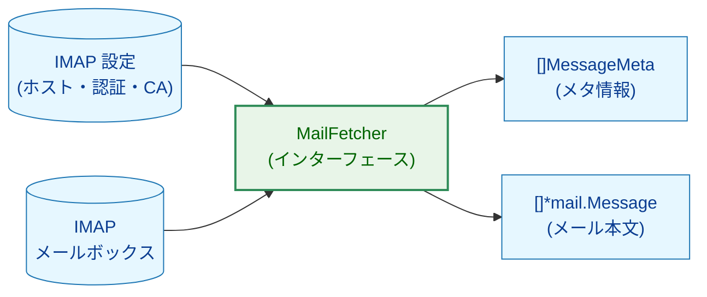
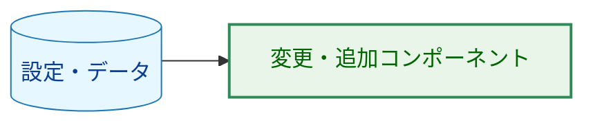
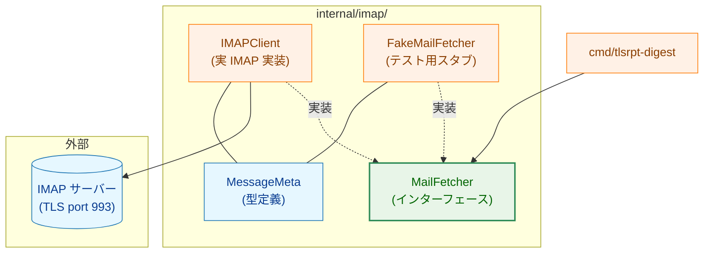
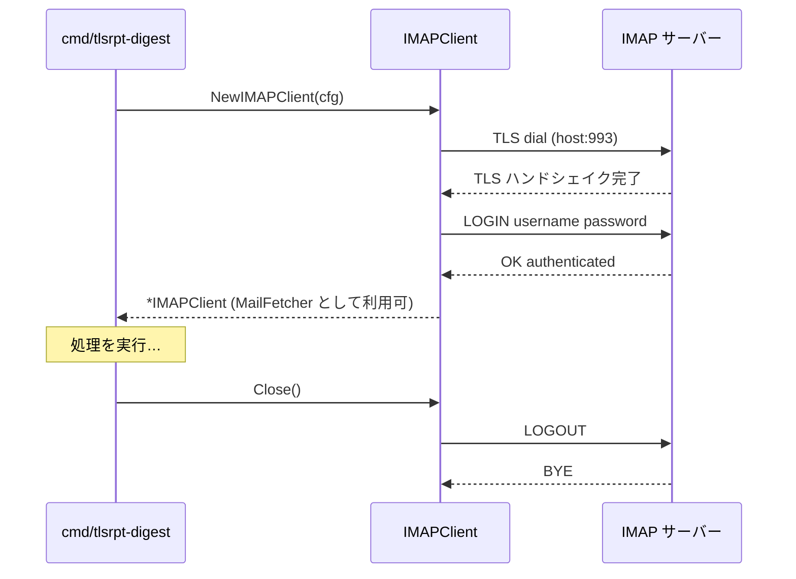
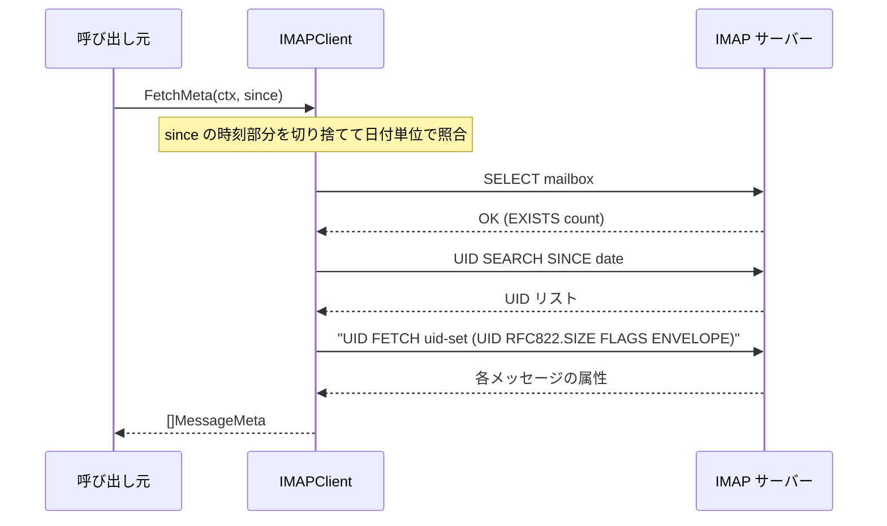
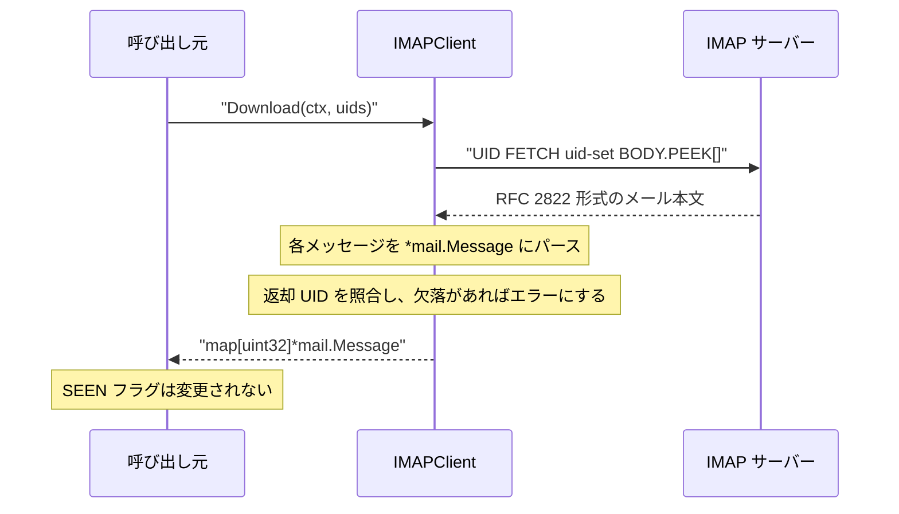
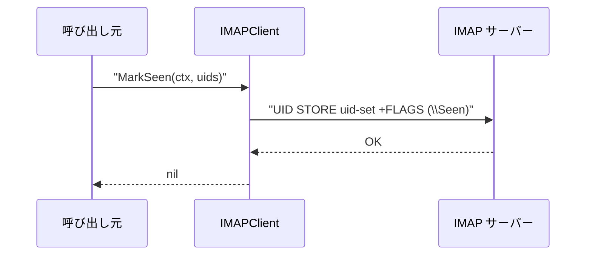

# アーキテクチャ設計書：IMAP接続・メタ情報取得・選択的ダウンロード

## ドキュメントステータス

| 項目 | 内容 |
|---|---|
| ステータス | `draft` |
| 作成日 | 2026-05-12 |
| レビュー日 | - |
| レビュアー | - |
| コメント | - |

---

## 1. 設計概要

### 1.1 設計原則

- **インターフェース駆動設計**: `MailFetcher` インターフェースを定義し、実 IMAP 実装とテスト用 `FakeMailFetcher` を差し替え可能にする
- **2フェーズ取得**: メタ情報取得（本文なし）とダウンロード（本文あり）を分離し、不要なダウンロードを排除する
- **TLS 専用**: STARTTLS を使わず TLS 接続（ポート 993）のみを採用し、ダウングレード攻撃リスクを排除する
- **one-shot 接続**: 1回の実行につき1接続。内部でのリトライ・再接続は行わない
- **責務の単純化**: 本パッケージは IMAP プロトコル操作のみを担う。メール内容の解析は `internal/tlsrpt` に委ねる

### 1.2 概念モデル



**凡例（Legend）**



---

## 2. システム構成

### 2.1 全体アーキテクチャ



### 2.2 接続・認証フロー



### 2.3 メタ情報取得フロー（FetchMeta）



### 2.4 選択的ダウンロードフロー（Download）



### 2.5 既読マークフロー（MarkSeen）



---

## 3. コンポーネント設計

### 3.1 インターフェース・型定義

```go
// Config は IMAP 接続設定
type Config struct {
    Host            string
    Port            int
    Username        string
    Password        config.Secret // ログ出力時に [REDACTED] となる
    Mailbox         string        // 監視するメールボックス名（デフォルト: "INBOX"）
    TLSCACert       string        // カスタム CA 証明書ファイルパス（空 = OS バンドル使用）
    MaxMessageBytes int64         // ダウンロード上限バイト数（0 = 無制限）。RFC822.SIZE がこの値を超えるメールはスキップして WARN ログを出力する
}

// MessageMeta は本文を含まない IMAP メタ情報。
// Date は ENVELOPE から取得し、ログ・デバッグ用途に使用する。
type MessageMeta struct {
    UID       uint32
    Size      uint32    // RFC822.SIZE（サーバー側バイト数）
    Date      time.Time // メール受信日時（ENVELOPE の Date フィールド）
    Seen      bool
    MessageID string
}

// MailFetcher は IMAP 操作を抽象化するインターフェース。
// 実装: IMAPClient（本番）、FakeMailFetcher（テスト）。
type MailFetcher interface {
    // FetchMeta は since 以降に受信した全メールのメタ情報を返す。
    // IMAP SEARCH SINCE は日付単位。since の時刻部分は切り捨てる。
    FetchMeta(ctx context.Context, since time.Time) ([]MessageMeta, error)

    // Download は指定 UID のメール本文を取得する。BODY.PEEK[] を用いて
    // SEEN フラグは変更しない。戻り値のマップは UID をキーとする。
    // 指定 UID が存在しない場合はエラーを返す。
    Download(ctx context.Context, uids []uint32) (map[uint32]*mail.Message, error)

    // MarkSeen は指定 UID のメールに SEEN フラグを付与する。
    MarkSeen(ctx context.Context, uids []uint32) error
}
```

**コンストラクタと接続ライフサイクル**

`MailFetcher` インターフェースには `Close()` を含めない。接続のクローズは `*IMAPClient` が持つメソッドとして提供し、呼び出し元が `defer client.Close()` で管理する。

```go
// NewIMAPClient は IMAP サーバーへの TLS 接続を確立し *IMAPClient を返す。
// *IMAPClient は MailFetcher を満たす。
// 呼び出し元は defer client.Close() で接続を閉じる責任を持つ。
func NewIMAPClient(cfg Config) (*IMAPClient, error)
```

### 3.2 コンポーネント責務

| コンポーネント | 責務 | 変更種別 |
|---|---|---|
| `internal/imap/imap.go` | `MailFetcher` インターフェース・`MessageMeta`・`Config` 型定義 | 新規 |
| `internal/imap/client.go` | `IMAPClient` 実装（TLS 接続・IMAP コマンド発行） | 新規 |
| `internal/imap/fake.go` | `FakeMailFetcher`（テスト用スタブ・スパイ） | 新規 |

---

## 4. エラーハンドリング設計

カスタムエラー型は定義しない。`fmt.Errorf("imap: <操作>: %w", err)` でコンテキストを付加して返す。

| 状況 | エラーメッセージ例 |
|---|---|
| TLS 接続失敗 | `"imap: connect to host:993: %w"` |
| 認証失敗 | `"imap: login: %w"`（パスワードはメッセージに含まれない） |
| SELECT 失敗 | `"imap: select mailbox INBOX: %w"` |
| SEARCH/FETCH 失敗 | `"imap: fetch meta: %w"` |
| UID 不存在 | `"imap: download: uid 123 not found"` |
| UID STORE 失敗 | `"imap: mark seen: %w"` |
| メッセージサイズ超過 | WARN ログ + スキップ（エラーを返さず処理継続） |

呼び出し元は `errors.Is` / `errors.As` でエラー判定する。

---

## 5. セキュリティ考慮事項

| 要件 | 実装方針 |
|---|---|
| TLS 1.2 以上 | `tls.Config{MinVersion: tls.VersionTLS12}` を明示的に設定 |
| 証明書検証 | `InsecureSkipVerify` は使用しない（デフォルト false を明示） |
| カスタム CA | `Config.TLSCACert` が設定されている場合、`x509.CertPool` を構築して使用 |
| パスワード非漏洩 | `Config.Password` は `config.Secret` 型。ログ出力時に `[REDACTED]` になる |
| デバッグ出力分離 | IMAP ライブラリのデバッグ出力は専用 `io.Writer` 変数に割り当て、Notifier（Slack）には流さない |
| 最大メッセージサイズ（DoS 対策） | `Config.MaxMessageBytes > 0` の場合、`FetchMeta` で取得した `MessageMeta.Size` がこの値を超えるメールをダウンロード対象から除外し WARN ログを出力する。RFC822.SIZE はサーバー申告値のためダウンロード前に判定できる |

詳細は [通知セキュリティガイドライン](../../dev/developer_guide/notification_security.ja.md) の原則4を参照。

---

## 6. テスト戦略

### 単体テスト（`FakeMailFetcher` 使用）

`FakeMailFetcher` は以下を提供する：

- `FetchMeta` の返却値（`[]MessageMeta`）を事前設定するフィールド
- `Download` の返却値（`map[uint32]*mail.Message`）を事前設定するフィールド
- 各メソッドの呼び出し引数を記録するスパイフィールド（`MarkSeenCalls [][]uint32` 等）
- 各メソッドで任意のエラーを返せるフィールド

これにより上位コンポーネント（`cmd/tlsrpt-digest`）のテストで実 IMAP サーバーが不要になる。

### `IMAPClient` の TLS 設定テスト

- カスタム CA 証明書ファイルを読み込めること
- 存在しないパスや不正なファイルをエラーで返すこと
- `InsecureSkipVerify` が設定されないこと

### `IMAPClient` のプロトコル動作テスト

- `Download` が `BODY.PEEK[]` を用い、SEEN フラグを変更しないこと
- `Download` で要求した UID が 1 件でも欠落した場合にエラーを返すこと
- `FetchMeta` が `since` の時刻部分を無視して日付単位で検索条件を構築すること

### 統合テスト（オプション）

- `//go:build integration` ビルドタグで通常の CI では skip
- 環境変数で接続先を指定してテスト用 IMAP サーバーに接続

---

## 7. 実装優先順位

### フェーズ 1: インターフェースと型（`internal/imap/imap.go`）

1. `Config` 型定義（`TLSCACert` フィールドを含む）
2. `MessageMeta` 型定義
3. `MailFetcher` インターフェース定義

### フェーズ 2: テストダブル（`internal/imap/fake.go`）

4. `FakeMailFetcher` の実装（スタブ＋スパイ）
5. `FakeMailFetcher` の単体テスト

### フェーズ 3: 実装（`internal/imap/client.go`）

6. TLS 接続・認証（`NewIMAPClient`）
7. `FetchMeta` の実装
8. `Download` の実装
9. `MarkSeen` の実装
10. TLS 設定テスト（カスタム CA・エラーパス）

---

## 8. 将来の拡張性

現在のスコープ外だが、将来対応が想定される拡張と設計上の考慮事項を示す。

### 高優先（現実のシナリオで発生リスクが高い）

| 拡張 | 背景・リスク | 設計上の考慮事項 |
|---|---|---|
| **接続リトライ・再接続** | IMAP サーバーの一時再起動やネットワーク障害で接続が途中で切断される | 現在は one-shot 接続でリトライなし。対応が必要な場合、コネクション管理を `MailFetcher` の外層でラップするミドルウェアパターンを採用し、インターフェースを変更せずに透過的にリトライを追加できる |
| **UIDVALIDITY 検証** | メールボックスの再作成・名前変更等でサーバーが UID を再割り当てすると、ローカルの `.eml` ファイルが誤った UID に対応してしまう | `Store` に UIDVALIDITY を永続化し、`FetchMeta` 呼び出し時の `SELECT` 応答と照合する。ミスマッチを検出した場合は WARN ログを出力し、既存 `.eml` ファイルとの対応を無効化する（offlineimap3 の `get_uidvalidity()` に相当） |

### 中優先（要件次第で対応を検討）

| 拡張 | 設計上の考慮事項 |
|---|---|
| **IMAP IDLE / push 方式** | 現在は one-shot ポーリング。IDLE コマンド対応が必要になる場合、`MailFetcher` インターフェースに通知コールバックを追加するか、専用の `IdleFetcher` インターフェースを別途定義する |
| **STARTTLS サポート** | 現在は TLS 専用（ポート 993）。STARTTLS が必要な場合、`Config` に接続方式フラグを追加し、接続ロジックを分岐させる |
| **OAuth 2.0 / XOAUTH2 認証** | 現在は LOGIN のみ対応。Google Workspace 等で必要な場合、`Config` に `AuthMechanism` フィールドを追加し、認証シーケンスを抽象化する |
| **複数メールボックスの同時監視** | 現在は 1 接続につき 1 メールボックス。複数ボックスに対応する場合、呼び出し元でメールボックスごとに `IMAPClient` を生成するか、`FetchMeta` に `mailbox` パラメータを追加する |
　