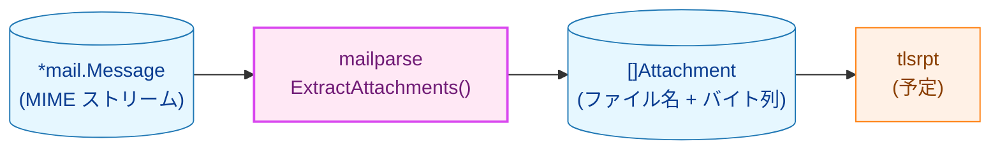
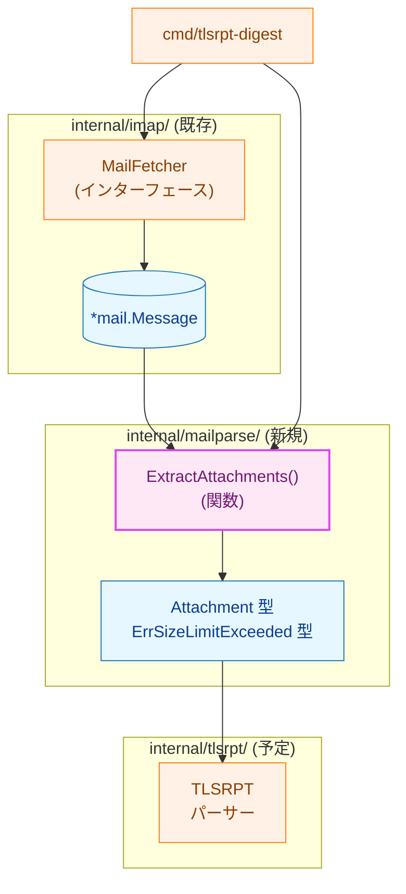
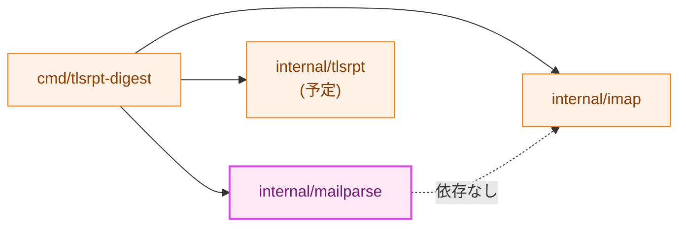
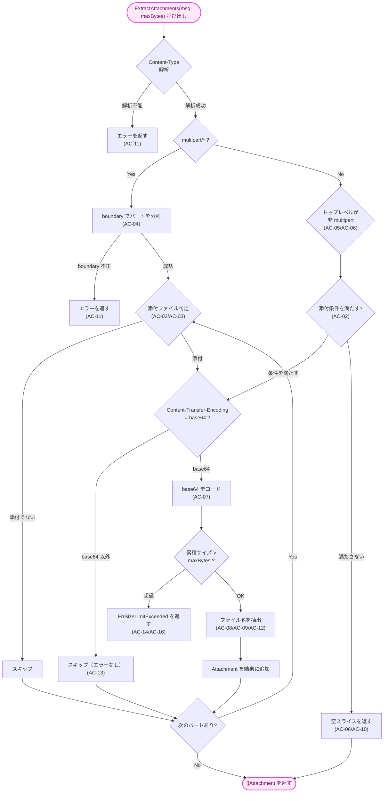
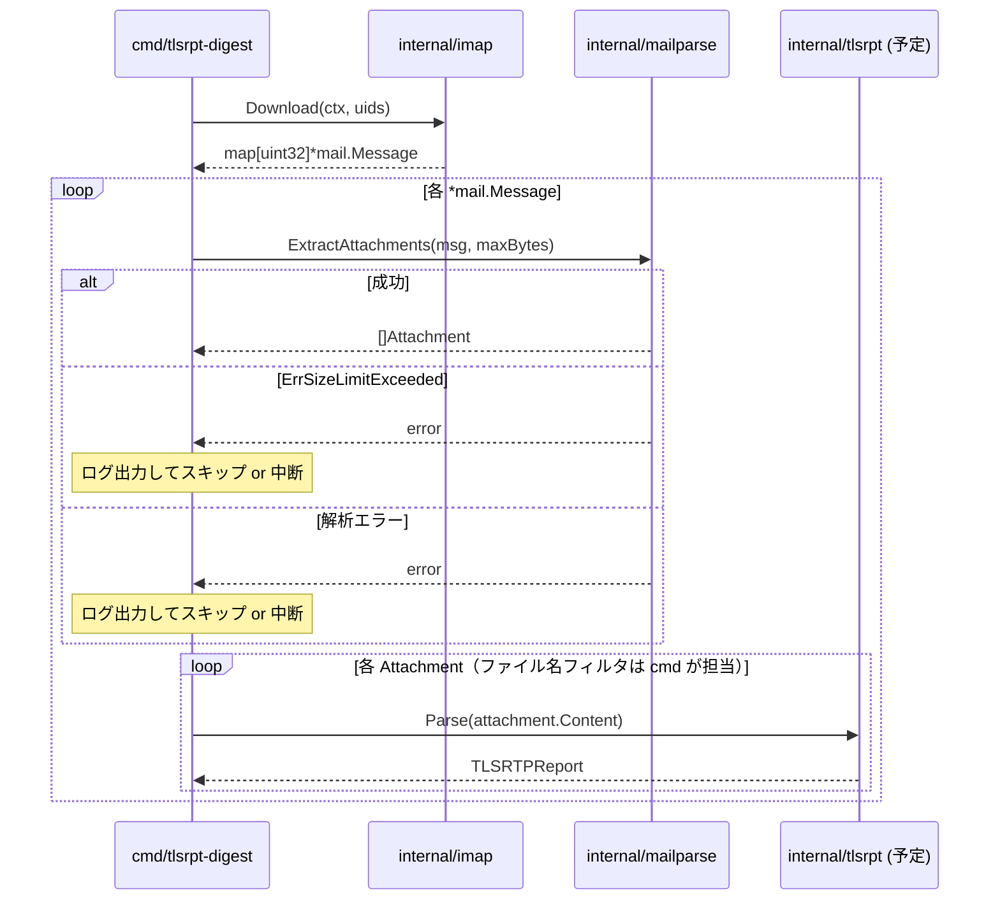
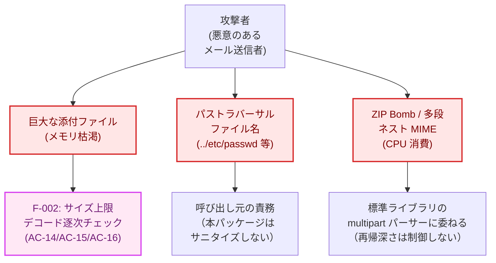

# アーキテクチャ設計書：メール添付ファイルの抽出

## ドキュメントステータス

| 項目 | 内容 |
|---|---|
| ステータス | `draft` |
| 作成日 | 2026-05-14 |
| レビュー日 | - |
| レビュアー | - |
| コメント | - |

---

## 1. 設計概要

### 1.1 設計原則

- **単一責務**: `internal/mailparse` は `*mail.Message` から添付ファイルのバイト列とファイル名を取り出すことのみを担う。IMAP 操作や JSON パースは対象外とする。
- **標準ライブラリのみ**: `net/mail`・`mime`・`mime/multipart`・`encoding/base64` 等の標準ライブラリのみを使用し、外部依存を追加しない。
- **YAGNI**: ファイル名フィルタリングやパストラバーサル対策は呼び出し元の責務とし、本パッケージには含めない。
- **非エラーの空スライス**: 添付ファイルが存在しないケース（プレーンテキストメール等）はエラーにせず空スライスを返す。エラーは構造的に不正なメールのみに限定する。
- **フェイルセーフなサイズ制限**: メモリ枯渇を防ぐためデコード後バイト数を逐次チェックし、上限超過時点で即座に中断する。

### 1.2 概念モデル



**凡例（Legend）**


---

## 2. システム構成

### 2.1 全体アーキテクチャ



### 2.2 パッケージ依存関係



`internal/mailparse` は `internal/imap` に依存しない。入力は `net/mail.Message`（標準ライブラリ）であり、パッケージ間の依存方向は `cmd` が両者を組み合わせる形とする。

### 2.3 添付ファイル抽出フロー



### 2.4 呼び出し元とのシーケンス



---

## 3. コンポーネント設計

### 3.1 インターフェース・型定義

```go
// Attachment は1件の添付ファイルを表す。
type Attachment struct {
    Filename string // ファイル名（空文字列の場合あり、AC-08）
    Content  []byte // デコード後のバイト列
}

// ErrSizeLimitExceeded は添付ファイルの累積サイズが上限を超えた場合に返るエラー型（AC-16）。
type ErrSizeLimitExceeded struct {
    Limit  int64 // 設定上限（バイト）
    Actual int64 // 実際の累積サイズ（バイト）
}

// ExtractAttachments は *mail.Message から全添付ファイルを抽出して返す（F-001）。
//
// maxBytes にゼロ以下の値を渡した場合はサイズ制限なし（AC-15）。
// 添付ファイルが存在しない場合は空スライスを返す（AC-10）。
// Content-Type が解析不能、または multipart の boundary が不正な場合はエラーを返す（AC-11）。
func ExtractAttachments(msg *mail.Message, maxBytes int64) ([]Attachment, error)
```

### 3.2 添付ファイル判定ルール（AC-02/AC-03）

| 条件 | 判定 |
|---|---|
| `Content-Disposition: attachment` がある | 添付ファイルとみなす |
| `Content-Disposition` がなく `Content-Type` に `name` パラメータがある | 添付ファイルとみなす |
| `Content-Disposition: inline` かつ `Content-Type` に `name` パラメータがある | 添付ファイルとみなさない（AC-03） |
| 上記いずれにも該当しない | 添付ファイルとみなさない |

### 3.3 ファイル名解決ルール（AC-08/AC-09/AC-12）

| 優先順位 | ソース |
|---|---|
| 1 | `Content-Disposition` の `filename` パラメータ |
| 2 | `Content-Type` の `name` パラメータ |
| なし | 空文字列 |

取得したファイル名は以下の順でデコードを試みる：
- RFC 2231 形式（`filename*=UTF-8''...`）→ `mime.ParseMediaType` の戻り値から取得
- RFC 2047 形式（`=?charset?encoding?text?=`）→ `mime.WordDecoder` で処理

### 3.4 コンポーネント責務

| コンポーネント | 責務 | 変更種別 |
|---|---|---|
| `internal/mailparse/mailparse.go` | `Attachment` 型・`ErrSizeLimitExceeded` 型・`ExtractAttachments` 関数の定義と実装 | 新規 |
| `internal/mailparse/mailparse_test.go` | 単体テスト（テーブル駆動）・統合テスト（実 `.eml` ファイル使用） | 新規 |

---

## 4. エラーハンドリング設計

カスタムエラー型は `ErrSizeLimitExceeded` のみ定義する。その他のエラーは `fmt.Errorf("mailparse: ...: %w", err)` でコンテキストを付加してラップする。

| 状況 | エラー種別 | AC |
|---|---|---|
| `Content-Type` ヘッダの解析失敗 | `fmt.Errorf("mailparse: parse content-type: %w", err)` | AC-11 |
| `multipart/*` の boundary 不正・パース失敗 | `fmt.Errorf("mailparse: parse multipart: %w", err)` | AC-11 |
| base64 デコード失敗 | デコードエラーのためスキップ（エラーは返さない） | AC-07 |
| 添付ファイルの累積サイズが上限を超過 | `&ErrSizeLimitExceeded{Limit: maxBytes, Actual: actual}` | AC-14/AC-16 |

呼び出し元は `errors.As` で `*ErrSizeLimitExceeded` を判別し、その他のエラーはラップされた標準エラーとして処理する。

---

## 5. セキュリティ考慮事項

### 5.1 脅威モデル



### 5.2 セキュリティ方針

| 脅威 | 対策 | 備考 |
|---|---|---|
| 巨大な添付ファイルによるメモリ枯渇 | デコード後バイト数を逐次チェックし、上限超過時点で処理を中断する（F-002） | デフォルト上限 1 MB（AC-14）。呼び出し元が指定可能（AC-15） |
| パストラバーサルファイル名（`../` 等） | 本パッケージはファイル名をサニタイズしない。パストラバーサル対策は呼び出し元の責務とする | 要件定義書 §4 セキュリティに明記 |
| 多段ネスト MIME による CPU 消費 | 標準ライブラリの `mime/multipart` パーサーに委ねる。再帰深さの明示的な制限は現バージョンでは設けない | TLSRPT レポートメールは通常 2 段程度のネストに限定される |

---

## 6. 処理フロー詳細

### 6.1 ファイル名エンコードのデコード順序

```mermaid
flowchart TD
    classDef newpkg fill:#ffe8f5,stroke:#d946ef,stroke-width:2px,color:#701a75;

    Start(["Content-Disposition の filename パラメータ取得"])
    HasDisp{"パラメータあり?"}
    TryName["Content-Type の name パラメータを取得"]
    HasName{"パラメータあり?"}
    EmptyStr["Filename = 空文字列<br>(AC-08)"]
    IsRFC2231{"RFC 2231 形式?<br>(filename*=...)"}
    DecodeRFC2231["percent-decode + charset 変換<br>(AC-09)"]
    IsRFC2047{"RFC 2047 形式?<br>(=?charset?enc?text?=)"]
    DecodeRFC2047["mime.WordDecoder でデコード<br>(AC-12)"]
    UseRaw["そのまま使用"]
    Done(["Filename 確定"])

    Start --> HasDisp
    HasDisp -->|"なし"| TryName
    HasDisp -->|"あり"| IsRFC2231
    TryName --> HasName
    HasName -->|"なし"| EmptyStr
    HasName -->|"あり"| IsRFC2231
    IsRFC2231 -->|"Yes"| DecodeRFC2231
    IsRFC2231 -->|"No"| IsRFC2047
    DecodeRFC2231 --> Done
    IsRFC2047 -->|"Yes"| DecodeRFC2047
    IsRFC2047 -->|"No"| UseRaw
    DecodeRFC2047 --> Done
    UseRaw --> Done
    EmptyStr --> Done

    class Start,Done newpkg
```

### 6.2 サイズ上限チェック（AC-14/AC-15）

デコード済みバイト列を `Attachment.Content` に格納するたびに累積サイズを更新し、`maxBytes > 0` かつ累積サイズが `maxBytes` を超えた時点で `ErrSizeLimitExceeded` を返して処理を中断する。メッセージ全体を先読みせずデコードしながら逐次チェックすることでメモリ効率を高める。

---

## 7. テスト戦略

### 単体テスト

テーブル駆動テストを基本とし、各受け入れ条件（AC）を個別に検証する。

| テストシナリオ | 対象 AC |
|---|---|
| `multipart/mixed` からの添付ファイル抽出 | AC-01/AC-04 |
| ネストした `multipart/*` 構造からの再帰抽出 | AC-04 |
| `Content-Disposition` なし・`Content-Type name` のみ | AC-02 |
| `Content-Disposition: inline` パートの除外 | AC-03 |
| トップレベルが非 multipart かつ添付条件を満たす | AC-05 |
| トップレベルが非 multipart かつ条件を満たさない（プレーンテキスト） | AC-06 |
| base64 エンコード添付ファイルのデコード | AC-07 |
| ファイル名解決の優先順位（Disposition > Type > 空文字） | AC-08 |
| RFC 2231 エンコードファイル名のデコード | AC-09 |
| 添付ファイルなしの空スライス返却 | AC-10 |
| 解析不能 `Content-Type` のエラー | AC-11 |
| 不正 boundary のエラー | AC-11 |
| RFC 2047 エンコードファイル名のデコード | AC-12 |
| `base64` 以外の `Content-Transfer-Encoding` のスキップ | AC-13 |
| サイズ上限超過時の `ErrSizeLimitExceeded` | AC-14 |
| `maxBytes <= 0` で上限なし | AC-15 |
| `errors.As` で `*ErrSizeLimitExceeded` を取得 | AC-16 |

### 統合テスト

- `testdata/` に格納した実際の TLSRPT レポートメール（`.eml`）を使い、`ExtractAttachments` が添付の `.json.gz` バイト列を正しく取り出せることを確認する。
- 実 `.eml` ファイルを使用した統合テストは通常の `go test` で実行可能とする（ビルドタグ不要）。

### セキュリティテスト

- `maxBytes = 1` など低い上限値を設定し、`ErrSizeLimitExceeded` が返ることを確認する。
- RFC 2231 のパストラバーサル的なファイル名（`../etc/passwd`）が本パッケージでサニタイズされず そのまま返ることを確認する（呼び出し元への責務の明確化）。

---

## 8. 実装優先順位

### フェーズ 1: 型・エラー定義

1. `Attachment` 型定義
2. `ErrSizeLimitExceeded` 型定義と `Error()` メソッド
3. `ExtractAttachments` 関数シグネチャの定義（本体はスタブ）

### フェーズ 2: コア実装（F-001）

4. `multipart/*` の再帰的パース（AC-04）
5. 添付ファイル判定ロジック（AC-02/AC-03）
6. トップレベル非 multipart の処理（AC-05/AC-06）
7. base64 デコード（AC-07/AC-13）
8. ファイル名抽出（AC-08）
9. RFC 2231 ファイル名デコード（AC-09）
10. RFC 2047 ファイル名デコード（AC-12）

### フェーズ 3: サイズ制限（F-002）

11. 累積サイズチェックの組み込み（AC-14/AC-15/AC-16）

### フェーズ 4: テスト

12. 単体テスト（テーブル駆動）
13. 統合テスト（実 `.eml` ファイル）

---

## 9. 将来の拡張性

| 拡張 | 設計上の考慮事項 |
|---|---|
| **ファイル名によるフィルタリング** | 現在は呼び出し元が担う。需要が高まれば `ExtractAttachments` にフィルタ述語（`func(Attachment) bool`）を追加するか、専用ラッパー関数を提供する。インターフェースを変えずに対応できる |
| **quoted-printable デコードのサポート** | 現在は base64 以外をスキップ（AC-13）。将来的に対応する場合は `Content-Transfer-Encoding` の分岐に `quoted-printable` を追加するだけでよい（標準ライブラリ `mime/quotedprintable` が利用可能） |
| **再帰深さ制限** | 現在は制限なし。TLSRPT レポートのような用途では問題にならないが、汎用ライブラリとして利用する場合は `ExtractAttachments` の第3引数にオプション構造体を追加し `MaxDepth` フィールドで制御できるようにする |
| **ストリーミング API** | 現在は全 Attachment をメモリに保持して返す。大規模な添付ファイルを扱う場合はコールバック型またはチャネル型の API に移行できるが、現在の TLSRPT ユースケースでは F-002 のサイズ制限で十分対応可能 |
