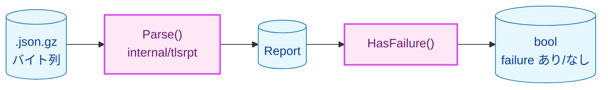
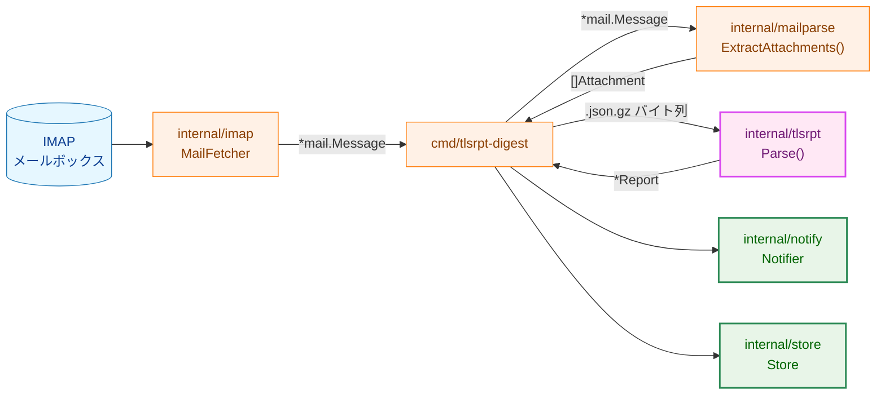
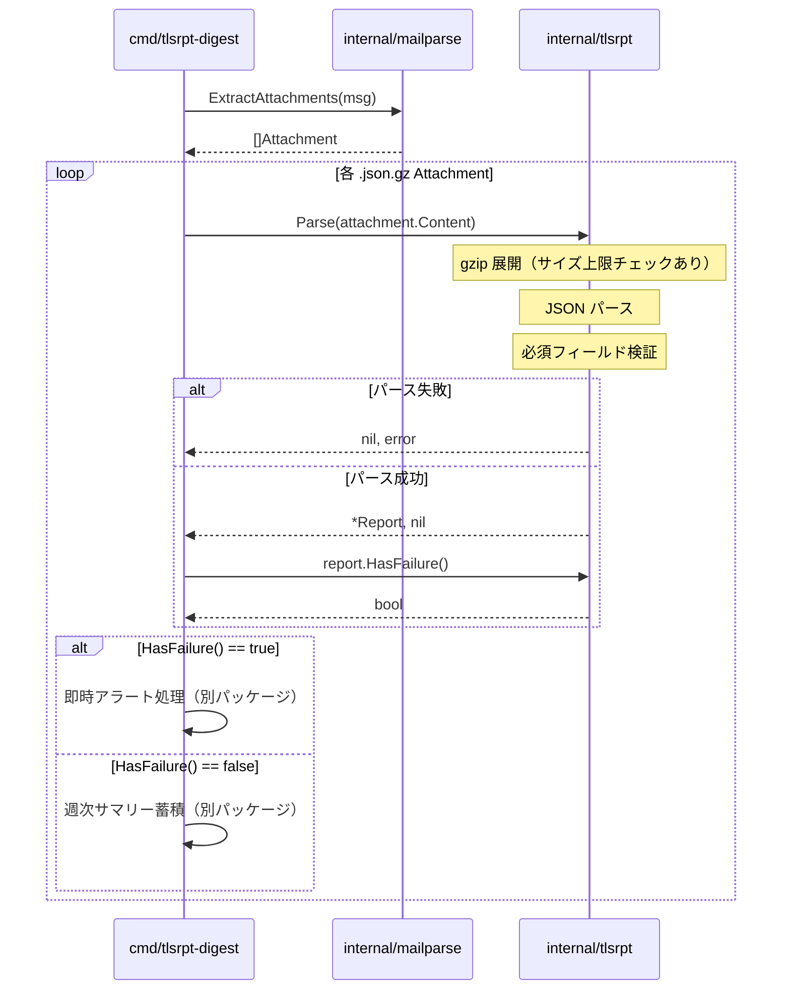
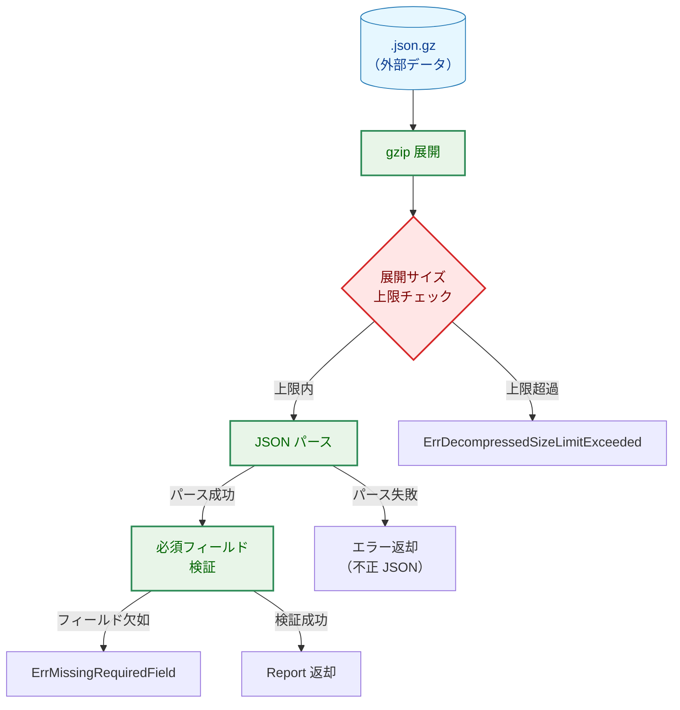
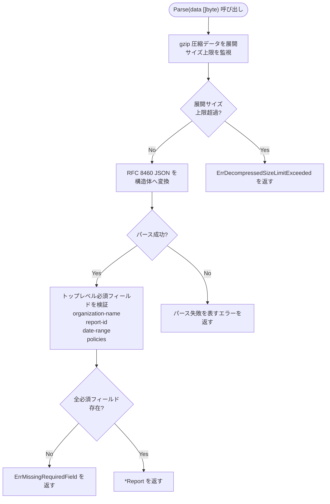
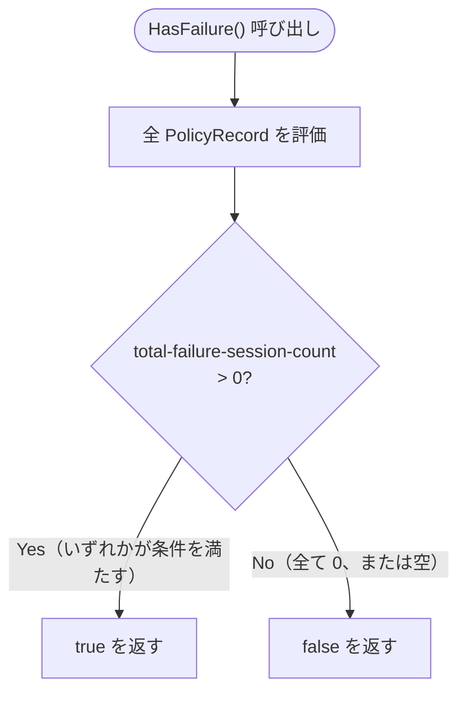

# アーキテクチャ設計書：TLSRPTレポートのパース・failure判定

## ドキュメントステータス

| 項目 | 内容 |
|---|---|
| ステータス | `draft` |
| 作成日 | 2026-05-14 |
| レビュー日 | - |
| レビュアー | - |
| コメント | - |

---

## 1. 設計概要

### 1.1 設計原則

- **単一責任**: `internal/tlsrpt` パッケージは `.json.gz` の展開・RFC 8460 JSON のパース・`total-failure-session-count` の評価のみを担う。メール取得・MIME 解析・通知送信とは明確に分離する。
- **防御的入力検証**: TLSRPT レポートは外部データとして扱い、展開サイズの上限チェックと必須フィールドの検証を行う。
- **シンプルな公開 API**: `Parse()` 関数と `(*Report).HasFailure()` メソッドのみを公開する。内部処理の詳細は非公開とする。
- **既存パッケージとの協調**: MIME 添付ファイル抽出は `internal/mailparse` が担当し、本パッケージはその結果として受け取った `[]byte` を処理する。

### 1.2 概念モデル



**凡例（Legend）**


---

## 2. システム構成

### 2.1 全体アーキテクチャ



### 2.2 コンポーネント配置

| パッケージ | 役割 | 状態 |
|---|---|---|
| `internal/imap` | IMAP メール取得 | 既存 |
| `internal/mailparse` | MIME 添付ファイル抽出 | 既存 |
| `internal/tlsrpt` | .json.gz 展開・RFC 8460 パース・failure 判定 | **新規** |
| `cmd/tlsrpt-digest` | エントリポイント（パース結果の利用側） | 既存（間接的に影響） |
| `internal/notify` | 通知送信 | スコープ外（全体アーキテクチャ図の文脈として参照） |
| `internal/store` | データ蓄積 | スコープ外（全体アーキテクチャ図の文脈として参照） |

### 2.3 データフロー / シーケンス図



---

## 3. コンポーネント設計

### 3.1 インターフェース・型定義

```go
// Parse は gzip 圧縮された RFC 8460 レポートを展開・パースして返す。
func Parse(data []byte) (*Report, error)

// Report は RFC 8460 のトップレベル構造体。
type Report struct {
    OrganizationName string        `json:"organization-name"`
    ReportID         string        `json:"report-id"`
    DateRange        DateRange     `json:"date-range"`
    Policies         []PolicyRecord `json:"policies"`
}

// HasFailure はいずれかのポリシーレコードの total-failure-session-count が 1 以上のとき true を返す。
func (r *Report) HasFailure() bool

type DateRange struct {
    StartDatetime time.Time `json:"start-datetime"`
    EndDatetime   time.Time `json:"end-datetime"`
}

type PolicyRecord struct {
    Policy         Policy         `json:"policy"`
    Summary        Summary        `json:"summary"`
    FailureDetails []FailureDetail `json:"failure-details"`
}

type Policy struct {
    PolicyType   string   `json:"policy-type"`
    PolicyString []string `json:"policy-string"`
    PolicyDomain string   `json:"policy-domain"`
    MXHost       []string `json:"mx-host"`
}

type Summary struct {
    TotalSuccessfulSessionCount int64 `json:"total-successful-session-count"`
    TotalFailureSessionCount    int64 `json:"total-failure-session-count"`
}

type FailureDetail struct {
    ResultType            string `json:"result-type"`
    SendingMTAIP          string `json:"sending-mta-ip"`
    ReceivingMXHostname   string `json:"receiving-mx-hostname"`
    ReceivingIP           string `json:"receiving-ip"`
    FailedSessionCount    int64  `json:"failed-session-count"`
    AdditionalInformation string `json:"additional-information"`
    FailureReasonCode     string `json:"failure-reason-code"`
}
```

RFC 8460 の JSON フィールド名はケバブケース（例: `failure-session-count`）であるため、各構造体フィールドには `json` タグを付与する。

### 3.2 コンポーネントの責務

| コンポーネント | 責務 | 変更種別 |
|---|---|---|
| `internal/tlsrpt/tlsrpt.go` | `Report` および関連構造体の定義、gzip 圧縮レポートのパース API、failure 判定 API、エラー型の定義 | 新規追加 |
| `cmd/tlsrpt-digest/main.go` | `internal/tlsrpt` のパース結果を受け取り、通知・保存系コンポーネントへ橋渡しする統合ポイント | 既存ファイルの変更対象 |

---

## 4. エラーハンドリング設計

### 4.1 エラー型定義

```go
// ErrDecompressedSizeLimitExceeded は展開後のサイズが上限を超えたときに返される。
// Limit と Actual の値から上限超過の程度を把握できる。
type ErrDecompressedSizeLimitExceeded struct {
    Limit  int64
    Actual int64
}

// ErrMissingRequiredField は必須フィールドが欠如しているときに返される。
// Field の値からどのフィールドが欠如しているかを把握できる。
type ErrMissingRequiredField struct {
    Field string
}
```

不正な gzip データおよび不正な JSON については、原因となる低レベルエラーを保持したまま `tlsrpt` パッケージの文脈を付加して返す。これにより、呼び出し側は失敗種別を保ったまま原因を判別できる。

### 4.2 エラーメッセージパターン

| エラー種別 | メッセージパターン |
|---|---|
| 不正 gzip | `tlsrpt: decompress: <原因>` |
| 展開サイズ超過 | `ErrDecompressedSizeLimitExceeded.Error()` で詳細を提供 |
| 不正 JSON | `tlsrpt: parse json: <原因>` |
| 必須フィールド欠如 | `ErrMissingRequiredField.Error()` で欠如フィールド名を提供 |

---

## 5. セキュリティ考慮事項

### 5.1 脅威モデル

TLSRPT レポートは外部の送信者（メール送信者のドメイン）が作成する外部データである。悪意あるレポートによる攻撃を以下の脅威モデルで示す。



### 5.2 Zip Bomb 対策

- **脅威**: 圧縮率を極端に高めた .json.gz ファイルにより、展開時にメモリを過大消費させる DoS 攻撃
- **対策**: gzip 展開時にストリーム読み込みと展開後サイズの監視を組み合わせ、上限超過時は `ErrDecompressedSizeLimitExceeded` を返す
- **参考パターン**: `internal/mailparse` の `maxBytes` 引数によるサイズ制限と同様のアプローチを採用する
- **上限値**: パッケージ内定数として定義する（例: 10 MB）

### 5.3 不正 JSON・フィールド欠如対策

- 標準ライブラリ `encoding/json` を使用し、不正 JSON を安全に拒否する
- 必須フィールドの欠如を明示的に検証し、不完全なレポートをエラーとして扱う
- 通知先の動的設定や外部コマンド実行は行わないため、通知先インジェクション攻撃の対象外となる

---

## 6. 処理フロー詳細

### 6.1 Parse() の処理フロー



### 6.2 HasFailure() の処理フロー



---

## 7. テスト戦略

### 単体テスト

| テスト対象 | テストケース | 対応要件 |
|---|---|---|
| `Parse()` | 有効な `.json.gz` → `*Report` が返る | `F-001` `AC-1`, `F-002` `AC-1` |
| `Parse()` | 不正な gzip データ → エラー返却 | `F-001` `AC-2` |
| `Parse()` | 有効な gzip だが展開後 JSON 不正 → エラー返却 | `F-001` `AC-3` |
| `Parse()` | 必須フィールド欠如（各フィールド個別）→ `ErrMissingRequiredField` | `F-002` `AC-2` |
| `Parse()` | `policies` 配列の各フィールドが正しくパースされる | `F-002` `AC-3` |
| `Parse()` | `failure-details` フィールドが存在する場合に正しく取得できる | `F-002` `AC-4` |
| `Parse()` | 展開サイズが上限超過 → `ErrDecompressedSizeLimitExceeded` | NFR セキュリティ |
| `HasFailure()` | 全ポリシーレコードの `total-failure-session-count` が 0 → `false` | `F-003` `AC-1` |
| `HasFailure()` | いずれかのポリシーレコードの `total-failure-session-count` が 1 以上 → `true` | `F-003` `AC-2` |
| `HasFailure()` | `policies` が空 → `false` | `F-003` `AC-3` |

### 統合テスト

| テスト対象 | テストケース | 対応要件 |
|---|---|---|
| `Parse()` | `testdata/` 内の実際のレポートファイルを正しくパースできる | `F-002` `AC-5` |

統合テストでは `testdata/tlsrpt_google.eml` から `internal/mailparse` で抽出した `.json.gz` 添付ファイルのバイト列を使用する。

### セキュリティテスト

| テスト対象 | テストケース |
|---|---|
| `Parse()` | zip bomb 相当の高圧縮データ → `ErrDecompressedSizeLimitExceeded` |

---

## 8. 実装優先順位

### フェーズ 1: 構造体定義とパース（`F-001`, `F-002`）

1. `Report` および関連構造体の定義（JSON タグ含む）
2. エラー型 `ErrDecompressedSizeLimitExceeded`・`ErrMissingRequiredField` の定義
3. `Parse()` 関数の実装（gzip 展開 → JSON パース → 必須フィールド検証）
4. 単体テストの実装（有効データ・不正データ・必須フィールド欠如）

### フェーズ 2: failure 評価（`F-003`）

1. `HasFailure()` メソッドの実装
2. 境界値テストの実装（0件・1件・複数件・空）

### フェーズ 3: 統合テスト（`F-002` AC-5）

1. `testdata/tlsrpt_google.eml` を使った統合テストの実装

---

## 9. 将来の拡張性

- **RFC 8460 オプションフィールドの追加**: RFC 8460 には `contact-info` など省略可能なフィールドが多数存在する。現時点では必須フィールドのみを定義するが、将来的に必要に応じてフィールドを追加できる構造体レイアウトとする。
- **非圧縮 JSON のサポート**: 現在は gzip 圧縮 JSON のみを対象とするが、将来的に非圧縮 JSON への対応が必要になった場合、`Parse()` の入力受け付けを拡張できる設計とする。
- **FailureDetail の活用**: `FailureDetail` は現時点では即時アラートのトリガー判定に使用しないが、将来の詳細通知機能で利用できるよう構造体として保持する。
