# アーキテクチャ設計書：Slack 通知

## ドキュメントステータス

| 項目 | 内容 |
|---|---|
| ステータス | `approved` |
| 作成日 | 2026-05-15 |
| レビュー日 | 2026-05-15 |
| レビュアー | isseis |
| コメント | - |

---

## 1. 設計の全体像

### 1.1 設計原則

1. **出力パスの分離**: `Debug Logger`（stdout/stderr/file）と `Slack ハンドラ` は完全に独立したパスとする（通知セキュリティガイドラインに準拠）
2. **集約バッファ型**: `Handle()` はバッファに積み、1 回の実行サイクルの終了時に `Flush()` で HTTP POST にまとめる。複数種別のメッセージ（TLS failure 集約・システムエラー個別等）が発生した場合は逐次送信する
3. **型安全な通知**: 外部コードは型付きヘルパー（`LogAlert`、`LogSystemError`、`LogSummary`）経由でのみ通知ロガーに書き込む
4. **二段階初期化**: `TOML` 読み込み前は `Debug Logger` のみ初期化し、`Slack ハンドラ` は `TOML` 読み込み後に追加する
5. **Secret 型**: Webhook URL を保持する全フィールドは `config.Secret` でラップし、ログ漏洩を防ぐ
6. **設定責務の分離**: `internal/config` は `notify.slack.allowed_host` の構造化・strict decode・形式検証を担い、`internal/notify` は環境変数の組み合わせ妥当性と Webhook URL 検証を担う
7. **通知レベルの独立性**: Slack 送信先の決定は通知レコード自身の `slog.Level` に基づき、CLI のコンソールログレベル設定とは独立させる
8. **定期サマリとの責務境界**: 定期サマリの集計と送信間隔の制御はタスク `0050` が担い、本タスクは集計済みサマリの通知表現と配送のみを担う。集計間隔は `internal/notify` の外部から与えられるため、本パッケージは間隔を仮定しない

### 1.2 コンセプトモデル

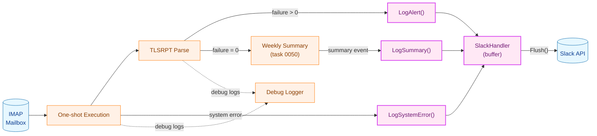

**凡例（Legend）**

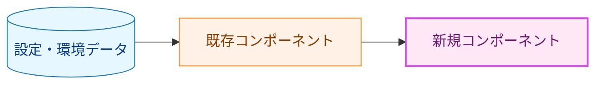

---

## 2. システム構成

### 2.1 全体アーキテクチャ

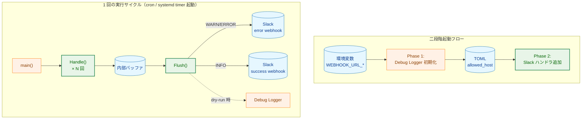

**凡例（Legend）**

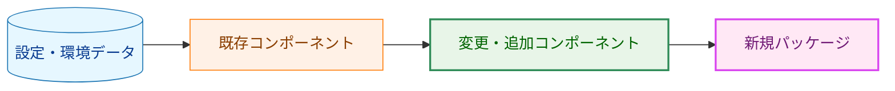

### 2.2 コンポーネント配置と依存関係

| コンポーネント | 担務 | 本タスクとの関係 |
|---|---|---|
| `internal/config` | `TOML` デコード、`unknown-key` 拒否、`notify.slack.allowed_host` の形式検証 | 既存責務を利用し、通知設定の受け皿を追加または更新する |
| `internal/notify` | 環境変数の組み合わせ検証、Webhook URL 検証、メッセージ整形、配送 | 本タスクの新規責務 |
| `internal/tlsrpt` | TLSRPT レポートの解析と failure 判定 | 既存責務を再利用し、通知文面の元データを供給する |
| タスク `0050` の定期サマリ処理 | 正常レポートの集計、送信間隔と送信タイミングの決定 | 本タスクでは再実装せず、集計済みデータを受け取るだけとする |

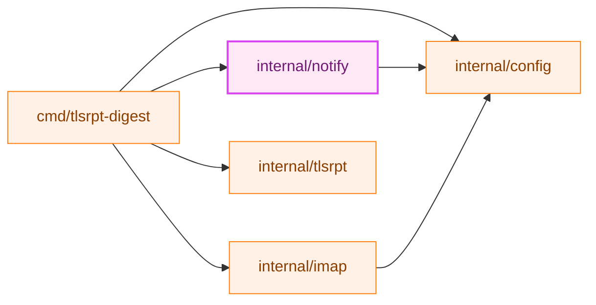

### 2.3 起動フロー（シーケンス）

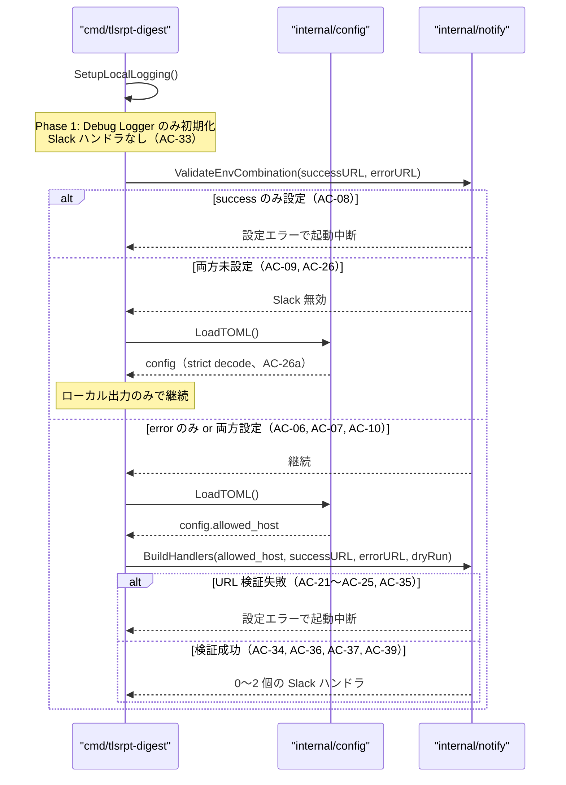

### 2.4 実行サイクルフロー（シーケンス）

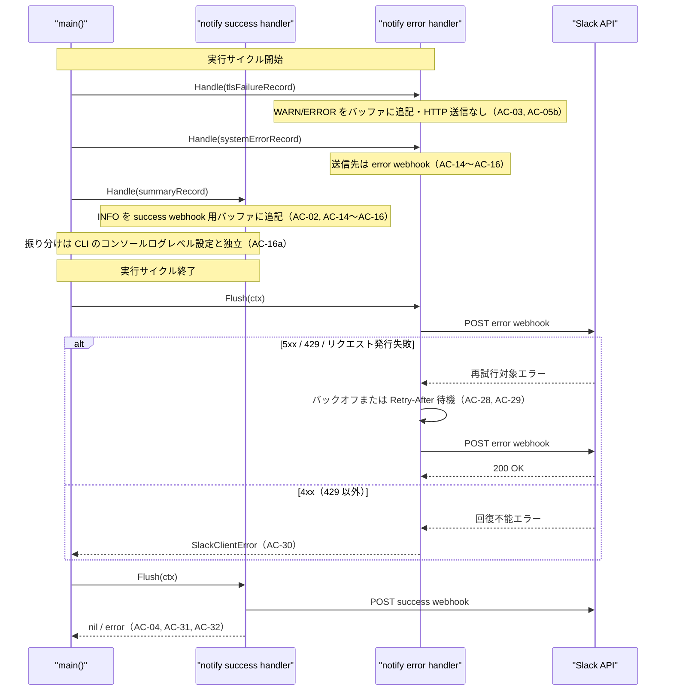

---

## 3. コンポーネント設計

### 3.1 主要インターフェース

```go
// Flusher はバッファに蓄積されたレコードを送信するインターフェース。
// SlackHandler は slog.Handler に加えてこのインターフェースを実装する。
type Flusher interface {
    Flush(ctx context.Context) error
}
```

### 3.2 主要型定義

```go
// SlackHandlerOptions は SlackHandler の生成オプション。
// Webhook URL は config.Secret でラップし、ログへの漏洩を防ぐ。
type SlackHandlerOptions struct {
    WebhookURL    config.Secret
    AllowedHost   string
    RunID         string
    LevelMode     LevelMode
    IsDryRun      bool
    BackoffConfig BackoffConfig
}

// LevelMode は SlackHandler のレベルフィルタリングモードを定義する。
type LevelMode string

// BackoffConfig はリトライ時のバックオフ設定。
type BackoffConfig struct {
    Base       time.Duration
    RetryCount int
}

// PolicyType は RFC 8460 で定義された policy-type 値を表す型。
type PolicyType string

const (
    PolicyTypeSTS           PolicyType = "sts"
    PolicyTypeTLSA          PolicyType = "tlsa"
    PolicyTypeNoPolicyFound PolicyType = "no-policy-found"
    PolicyTypeUnknown       PolicyType = ""  // RFC 8460 未定義値または空値
)

// DateRange はレポートの対象期間を表す。
// tlsrpt.DateRange と同一構造だが、internal/notify を internal/tlsrpt から独立させるため再定義する。
type DateRange struct {
    Start time.Time
    End   time.Time
}

// Alert は即時アラート（TLS failure）の通知ペイロード。
// public フィールドのみ含み、機密情報は含まない。
type Alert struct {
    OrganizationName string
    PolicyType       PolicyType
    FailureCount     int64
    DateRange        DateRange
}

// SystemError はシステムエラーアラートの通知ペイロード。
type SystemError struct {
    ErrorType string
    Message   string
    Component string // "imap" / "storage" / "tlsrpt" 等
}

// Summary は task 0050 で集計済みの定期サマリ通知ペイロード。
// 本パッケージは集計済みデータの通知表現のみを担う。
type Summary struct {
    Period            DateRange
    OrganizationCount int
    ReportCount       int
}
```

`LevelMode` の具体値は実装で定義するが、設計上は「INFO のみ」と「WARN 以上」の 2 モードを持つ。

### 3.3 コンポーネント責務表

| ファイル | 責務 | 新規/変更 |
|---|---|---|
| `internal/notify/handler.go` | `SlackHandler` 実装（`slog.Handler` + `Flusher`）、バッファ管理 | **新規** |
| `internal/notify/options.go` | `SlackHandlerOptions`、`BackoffConfig`、`LevelMode` 型定義 | **新規** |
| `internal/notify/message.go` | Slack API ペイロード型（`SlackMessage`、`SlackAttachment` 等） | **新規** |
| `internal/notify/format.go` | 通知ペイロードの表現層（TLS failure・システムエラー・集計済み定期サマリの表示、切り詰め処理） | **新規** |
| `internal/notify/helpers.go` | 型付きヘルパー（`LogAlert()`、`LogSystemError()`、`LogSummary()`） | **新規** |
| `internal/notify/retry.go` | HTTP 送信とリトライロジック（`Retry-After` ヘッダー対応） | **新規** |
| `internal/notify/validate.go` | 環境変数の組み合わせ検証と Webhook URL 検証 | **新規** |
| `internal/notify/errors.go` | エラー型定義（`WebhookValidationError`、`SlackServerError`、`SlackClientError`） | **新規** |
| `internal/notify/spy.go` | テスト用スパイハンドラ（`SpyHandler`） | **新規** |
| `internal/config/config.go` | `notify.slack.allowed_host` の設定構造体、strict decode、形式検証 | **変更** |
| `cmd/tlsrpt-digest/main.go` | 二段階起動フローの呼び出し側 | **変更** |

---

## 4. エラーハンドリング設計

### 4.1 エラー型

```go
// WebhookValidationError は Webhook URL または環境変数の組み合わせ検証失敗を表す。
type WebhookValidationError struct{}

// SlackServerError は再試行対象の送信失敗を表す。
type SlackServerError struct{}

// SlackClientError は回復不能な 4xx 応答を表す。
type SlackClientError struct{}
```

### 4.2 エラーメッセージと伝播パターン

| シナリオ | 発生場所 | 処理 |
|---|---|---|
| success URL のみ設定 | 起動前の組み合わせ検証 | 設定エラーとして起動を中断（`AC-08`） |
| 両 URL 未設定 | 起動前の組み合わせ検証 | Slack 無効として継続、URL 検証とハンドラ生成はスキップ（`AC-09` `AC-26`） |
| URL 検証失敗（スキーム不正・ホスト不一致等） | `NewSlackHandler()` → Phase 2 | 設定エラーとして起動を中断 |
| success/error のホスト名不一致 | `validateWebhookURL()` | 設定エラーとして起動を中断（`AC-23`） |
| `allowed_host` 未設定かつ URL あり | `validateWebhookURL()` | 設定エラーとして起動を中断（`AC-25`） |
| HTTP タイムアウト・接続エラー | `Flush()` → retry loop | 最大 3 回リトライ後、エラーを返す |
| HTTP 5xx | `Flush()` → retry loop | 指数バックオフでリトライ |
| HTTP 429 | `Flush()` → retry loop | `Retry-After` ヘッダー優先でリトライ（`AC-28`） |
| HTTP 4xx（429 以外） | `Flush()` | 即座に `SlackClientError` を返す（`AC-30`） |
| 全リトライ失敗 | `Flush()` | エラーを返し、Debug Logger にも記録（`AC-04`） |
| `context` キャンセル | リトライ待機中 | 待機を中断し `ctx.Err()` を返す（`AC-32`） |
| TOML への Webhook URL 混入 | config デコード | `internal/config` の strict デコードで unknown-key エラー（`AC-26a`） |

---

## 5. セキュリティ考慮事項

通知セキュリティ設計は [通知セキュリティガイドライン](../../dev/developer_guide/notification_security.ja.md) に準拠する。

### 5.1 脅威モデル

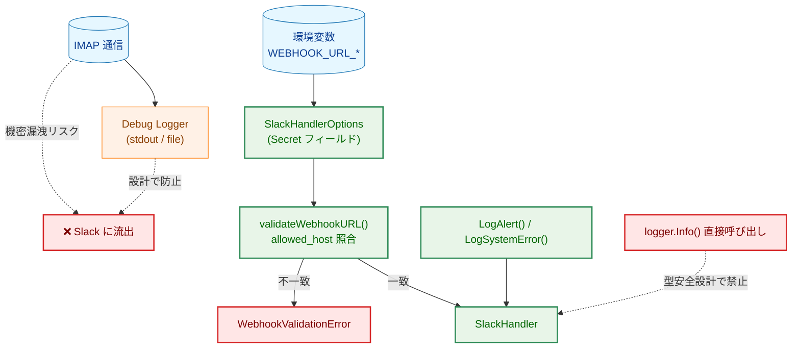

**凡例（Legend）**

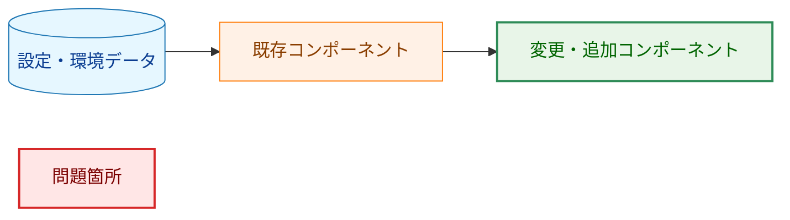

### 5.2 セキュリティ対策一覧

| 脅威 | 対策 | 対応 AC |
|---|---|---|
| Webhook URL のログ漏洩 | `config.Secret` でラップ、`String()` / `LogValue()` は `[REDACTED]` | 非機能要件 |
| Webhook URL の TOML 混入 | `internal/config` の strict デコードで unknown-key エラー | `AC-26a` |
| 任意ホストへの SSRF | `allowed_host` によるホスト名検証 | `AC-22` |
| success/error URL のホスト不整合 | 両 URL のホスト一致を必須にする | `AC-23` |
| HTTP スキームのダウングレード | `https` 以外を設定エラーとする | `AC-21` |
| redaction の無効化 | 通知ハンドラ側では無効化コードパスを持たない | 非機能要件 |
| IMAP 認証情報の Slack 流出 | 型付きヘルパー経由のみ許可・Debug Logger を分離 | F-001 設計原則 |
| 機密情報のメッセージ混入 | `Alert` / `SystemError` 型が公開情報のみ含む設計 | F-001 設計原則 |

---

## 6. 処理フロー詳細

### 6.1 Flush() の処理フロー

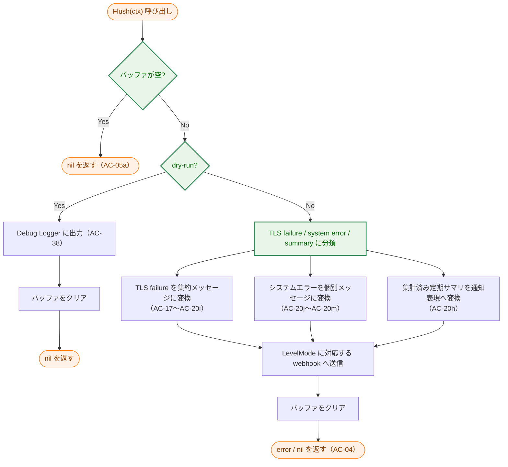

### 6.2 HTTP リトライフロー

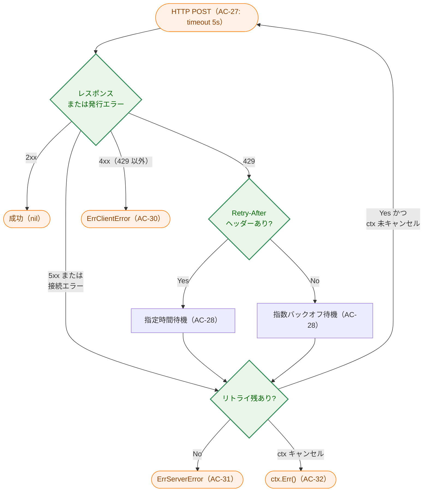

### 6.3 Slack メッセージフォーマット

TLS failure 集約・定期サマリ・システムエラーそれぞれの構造。定期サマリの集計値自体はタスク `0050` が生成し、本タスクは通知ペイロードへの写像のみを担う。

| 通知種別 | `text` | `attachment.color` | 絵文字 | 主な `fields` |
|---|---|---|---|---|
| TLS failure 集約 | `"⚠️ TLS Failures – N organizations affected"` | `warning` | ⚠️ | 組織名、ポリシータイプ、`total-failure-session-count`、期間、`Run ID` |
| システムエラー（1 件ごと） | `"🚨 System Error: <ErrorType>"` | `danger` | 🚨 | エラーメッセージ、コンポーネント、`Run ID` |
| 定期サマリ | `"✅ TLS Report Summary"` | `good` | ✅ | 対象期間、組織数、`Run ID` |

メッセージ本文が 4000 文字、個別フィールド値が 1000 文字を超えた場合は `...` で切り詰め（Slack 送信のみ）。ファイルログへは全文を記録（`AC-20d`）。

---

## 7. テスト戦略

### 7.1 単体テスト

| テスト対象 | テスト内容 | 対応 AC |
|---|---|---|
| `SlackHandler.Handle()` | HTTP 送信なし、バッファへの追記のみ | `AC-05b` |
| `Flusher.Flush()` | 空バッファで nil 返却 | `AC-05a` |
| `Flusher.Flush()` | dry-run 時に HTTP POST 不発、Debug Logger 出力 | `AC-38` |
| 起動前設定検証 | URL 組み合わせの 4 パターン（両方設定、error のみ、success のみ、両方未設定） | `AC-06`〜`AC-10` |
| レベル振り分け | INFO は success、WARN/ERROR は error、CLI ログレベルの影響を受けない | `AC-14`〜`AC-16a` |
| `formatAlerts()` | 組織名・ポリシータイプ・failure 数・期間・Run ID 含有確認 | `AC-17`〜`AC-20e` |
| `formatAlerts()` | タイトルに影響組織数 N が含まれる | `AC-20e` |
| `formatAlerts()` | `attachment.color = warning`、絵文字 ⚠️ | `AC-20f` |
| `formatAlerts()` | メッセージ長切り詰め（4000 / 1000 文字） | `AC-20b` `AC-20c` |
| `formatAlerts()` | ファイルログには全文出力（切り詰めなし） | `AC-20d` |
| `formatSystemError()` | エラー種別・メッセージ・コンポーネント含有確認 | `AC-20j`〜`AC-20l` |
| `formatSystemError()` | `attachment.color = danger`、絵文字 🚨 | `AC-20g` |
| `formatSummary()` | 集計済みサマリ入力のみを表示し、集計ロジックを持たない | `AC-20h` |
| `validateWebhookURL()` | HTTPS スキーム強制、ホスト一致、ポート除去、大文字小文字非依存、`allowed_host` 必須条件 | `AC-21`〜`AC-26` |
| Retry logic | 5xx リトライ・429 `Retry-After` 優先・リクエスト発行失敗も再試行・4xx 即失敗 | `AC-28`〜`AC-32` |
| `SpyHandler` | テスト用ハンドラの基本動作 | - |

### 7.2 統合テスト

| テスト内容 | 使用ツール |
|---|---|
| `httptest.NewServer` によるモック Slack サーバへの送信検証 | `net/http/httptest` |
| success / error で別サーバを用いた振り分け検証 | `net/http/httptest` |
| 5xx → 200 のリトライ復帰シナリオ | モックサーバで段階的レスポンス制御 |
| 二段階起動フロー全体（TOML 読み込み → Slack ハンドラ追加） | テスト用 TOML + `testing` パッケージ |

### 7.3 セキュリティテスト

| テスト内容 | 対応 AC |
|---|---|
| `config.Secret` フィールドが通知メッセージに含まれないこと | 非機能要件 |
| Debug Logger への書き込みが Slack ハンドラを起動しないこと | F-001 設計原則 |
| Webhook URL がログ出力に含まれないこと | 非機能要件 |
| 通知ハンドラ側に redaction 無効化パスが存在しないこと | 非機能要件 |
| `internal/notify` の通知 `*slog.Logger` が外部エクスポートされていないこと | F-001 設計原則 |

---

## 8. 実装優先度

### Phase 1: 設定契約・コア型・検証

1. `internal/config/config.go` — `notify.slack.allowed_host` の設定契約と strict decode（`AC-26a`）
2. `internal/notify/errors.go` — エラー型定義（Webhook 検証・配送失敗カテゴリ）
3. `internal/notify/options.go` — `SlackHandlerOptions`、`LevelMode`、`BackoffConfig`
4. `internal/notify/validate.go` — 環境変数の組み合わせ検証と URL 検証（`AC-06`〜`AC-10`, `AC-21`〜`AC-26`）

### Phase 2: HTTP 送信・ハンドラ

5. `internal/notify/message.go` — Slack API ペイロード型
6. `internal/notify/retry.go` — HTTP 送信・リトライロジック（`AC-27`〜`AC-32`）
7. `internal/notify/handler.go` — `SlackHandler`（`AC-01`〜`AC-05b`, `AC-14`〜`AC-16a`, `AC-37`〜`AC-39`）

### Phase 3: フォーマット・ヘルパー

8. `internal/notify/format.go` — メッセージフォーマット（`AC-17`〜`AC-20m`）
9. `internal/notify/helpers.go` — 型付きヘルパー（`LogAlert`、`LogSystemError()`、`LogSummary()`）

### Phase 4: 起動統合・テスト

10. `internal/notify/spy.go` — スパイハンドラ
11. `cmd/tlsrpt-digest/main.go` — 二段階起動フローと dry-run CLI フラグ統合（`AC-33`〜`AC-40`）
12. テスト実装（単体・統合・セキュリティ）

---

## 9. 将来の拡張性

| 拡張 | 設計上の準備 |
|---|---|
| メール通知の追加 | `Flusher` インターフェースを `notify` パッケージ内に閉じ込めており、同インターフェースを実装する別ハンドラを追加するだけで対応可能 |
| `slog.MultiHandler` への統合 | `SlackHandler` は `slog.Handler` を実装するため、既存の `MultiHandler` に追加するだけで統合できる |
| 定期サマリ間隔の変更 | 間隔制御は `cmd/tlsrpt-digest` とタスク `0050` 側の責務であり、本パッケージへの変更は不要 |
| 通知の重複制御 | バッファ設計を拡張することで、重複 ID の除去などを `Flush()` 前処理に追加可能 |
