# アーキテクチャ設計書：レポートデータの永続化

## ドキュメントステータス

| 項目 | 内容 |
|---|---|
| ステータス | `draft` |
| 作成日 | 2026-05-18 |
| レビュー日 | - |
| レビュアー | - |
| コメント | - |

---

## 1. 設計の全体像

### 1.1 設計原則

- **責務分離の維持**: `internal/store` は永続化に専念し、IMAP 通信（`internal/imap`）、添付解析（`internal/mailparse`）、TLSRPT デコード（`internal/tlsrpt`）、通知送信（`internal/notify`）を再実装しない
- **fail-safe な永続化**: JSON/sentinel/`.eml` はアトミック更新を前提とし、クラッシュ時の破損・部分状態を最小化する
- **運用可能性優先**: `UIDVALIDITY` と `recovery_required` は sentinel に集約し、復旧判断はエントリポイント（0070）に委譲する
- **GC の決定可能性**: `.eml` 本体やディレクトリ全走査に依存せず、`emails` インデックスで削除判定・最終パス再構築を行う
- **読み取り専用経路の明確化**: `summary` 用に read-only open モードを設け、ロック無しで安全に参照できる設計にする

### 1.2 コンセプトモデル

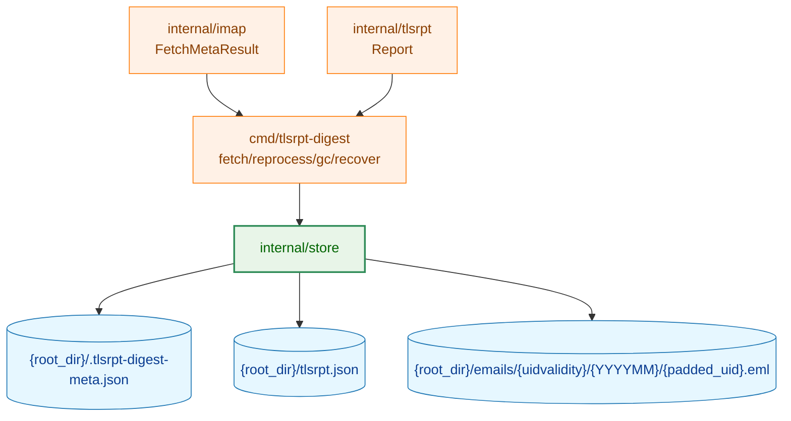

**Legend**


### 1.3 要件反映トレーサビリティ

| 要件 | 主な設計反映箇所 |
|---|---|
| F-001（AC-01〜AC-06） | 2.1 全体構成、6.1 初期化フロー、3.1 Open モード定義 |
| F-002（AC-07〜AC-10） | 3.1 `SaveReport`/`SaveReports`/`SaveEmailMetas`、6.2 保存フロー |
| F-003（AC-11〜AC-13） | 3.1 `GetReportsSince`、6.3 参照フロー |
| F-004（AC-14〜AC-19） | 3.1 `SaveEmail`、6.2 保存フロー |
| F-005（AC-20〜AC-22） | 3.1 `LoadEmails`、4.1 個別読み込み失敗の集約方針、6.4 reprocess 読み込みフロー |
| F-006（AC-23〜AC-24） | 3.1 `SaveUIDValidity`/`LoadUIDValidity`、6.5 UIDVALIDITY フロー |
| F-007a（AC-25〜AC-28a） | 3.1 `DeleteReportsBefore`、6.6 GC レポート削除フロー |
| F-007b（AC-29〜AC-32a） | 3.1 `DeleteEmailsBefore`、6.7 GC `.eml` 削除フロー |
| F-008（AC-33〜AC-36） | 3.1 recovery API、6.8 復旧適用フロー |
| 非機能要件（AC-37〜AC-39 ほか） | 5. セキュリティ、4. エラー設計、6.9 並行実行境界、7. テスト戦略 |

---

## 2. システム構成

### 2.1 全体アーキテクチャ

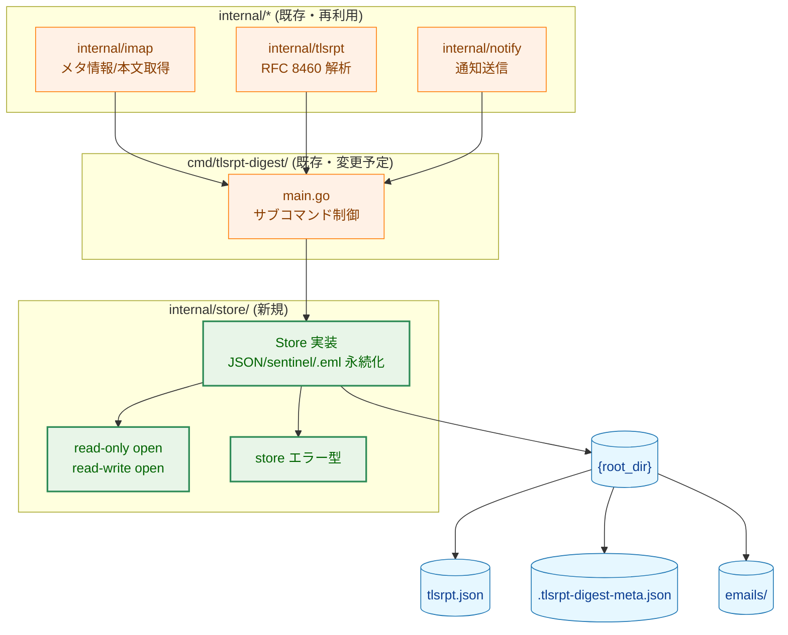

**Legend**

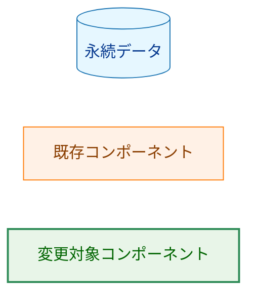

### 2.2 コンポーネント配置と再利用方針

- `internal/store` は `tlsrpt.Report` の保存先として機能するが、TLSRPT の検証・解釈ロジックは持たない
- `internal/store` は IMAP サーバーへアクセスしない。UID/UIDVALIDITY/ENVELOPE Date は呼び出し元から受け取る
- 通知の配送保証や通知先検証は `internal/notify`/エントリポイントの責務であり、`internal/store` では扱わない
- `summary` は read-only open モードで `internal/store` を使用し、ファイル作成や lock 依存を発生させない

### 2.3 データフロー（代表シーケンス）

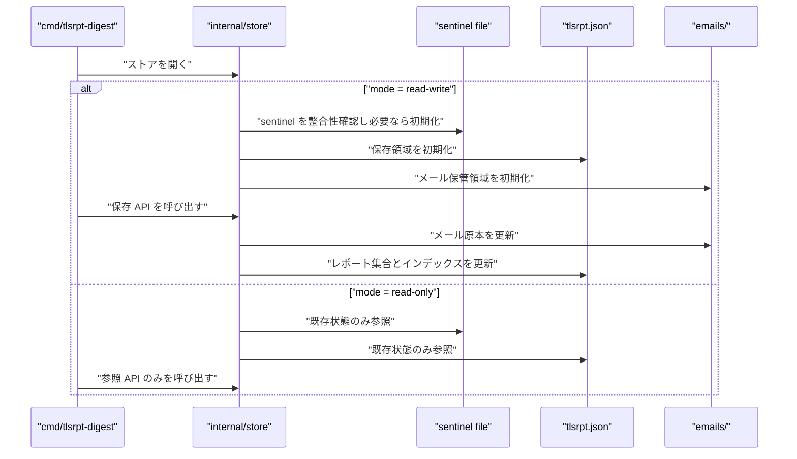

---

## 3. コンポーネント設計

### 3.1 インターフェース・型定義（高レベル）

`OpenMode` の公開値は `OpenReadWrite` と `OpenReadOnly` の 2 つを想定する。

```go
type OpenMode int

type IMAPIdentity struct {
    Host    string
    Port    int
    Mailbox string
}

type EmailMeta struct {
    UID         uint32
    UIDValidity uint32
    SentAt      time.Time
    SavedAt     time.Time
}

type ReportInput struct {
    Report      tlsrpt.Report
    UID         uint32
    UIDValidity uint32
}

type LoadedEmail struct {
    Message     *mail.Message
    UID         uint32
    UIDValidity uint32
    SentAt      time.Time
    SavedAt     time.Time
    Path        string
}

type Store interface {
    SaveReport(report tlsrpt.Report) error
    SaveReports(inputs []ReportInput) error
    SaveEmailMetas(metas []EmailMeta) error
    GetReportsSince(since time.Time) ([]tlsrpt.Report, error)

    SaveEmail(uid, uidValidity uint32, sentAt, savedAt time.Time, rawEML []byte) error
    LoadEmails() ([]LoadedEmail, error)

    SaveUIDValidity(v uint32) error
    LoadUIDValidity() (v uint32, found bool, err error)

    SaveRecoveryRequired(prev, curr uint32, detectedAt time.Time) error
    LoadRecoveryRequired() (prev, curr uint32, detectedAt time.Time, found bool, err error)
    ClearRecoveryRequired() error
    ApplyRecovery(newUIDValidity uint32) error

    DeleteReportsBefore(cutoff time.Time) (deleted int, err error)
    DeleteEmailsBefore(reportCutoff, savedAtCutoff time.Time) (deleted int, err error)
}
```

### 3.2 コンポーネント責務（新規・変更ファイル）

| ファイル | 役割 | 変更種別 |
|---|---|---|
| `internal/store/store.go` | `Store` 実装エントリ、open モード切替、公開 API の集約 | 新規 |
| `internal/store/types.go` | 永続化対象の内部モデル（report/email/sentinel）定義 | 新規 |
| `internal/store/errors.go` | 公開エラー型・分類（不整合/IO/検証） | 新規 |
| `internal/store/sentinel.go` | sentinel 状態管理、IMAP 識別子整合性検証 | 新規 |
| `internal/store/reports.go` | `SaveReport(s)`/`GetReportsSince`/`DeleteReportsBefore` | 新規 |
| `internal/store/emails.go` | `SaveEmail`/`SaveEmailMetas`/`LoadEmails`/`DeleteEmailsBefore` | 新規 |
| `internal/store/recovery.go` | `SaveRecoveryRequired`/`LoadRecoveryRequired`/`ClearRecoveryRequired`/`ApplyRecovery` | 新規 |
| `internal/store/atomicfile.go` | アトミック更新の共通 I/O ヘルパ | 新規 |
| `internal/store/permission.go` | 新規作成ファイル/ディレクトリの権限適用と緩い権限の WARN 判定 | 新規 |
| `internal/store/store_test.go` | open モード、read-only 空状態、初期化の統合検証 | 新規 |
| `internal/store/reports_test.go` | レポート保存・取得・GC の検証 | 新規 |
| `internal/store/emails_test.go` | `.eml` 保存・読み込み・GC と部分失敗継続の検証 | 新規 |
| `internal/store/recovery_test.go` | UIDVALIDITY と recovery 状態 API の検証 | 新規 |
| `cmd/tlsrpt-digest/main.go` | store open モード選択（read-only/read-write）の利用側調整 | 変更 |
| `cmd/tlsrpt-digest/main_test.go` | エントリポイントからの store 利用シナリオ検証 | 変更 |

---

## 4. エラーハンドリング設計

### 4.1 エラー種別方針

- **分類可能な型付きエラー**を公開し、呼び出し側が `errors.Is`/`errors.AsType` で分岐可能にする
- **メッセージに運用診断情報**（期待値・実値・対象パス）を含める
- **バッチ処理の部分失敗**（`.eml` 個別読み込み失敗・個別削除失敗）は `errors.Join` で集約して返す

### 4.2 エラー型（高レベル定義）

```go
type ErrStoreIdentityMismatch struct {
    RootDir         string
    ExpectedHost    string
    ExpectedPort    int
    ExpectedMailbox string
    ActualHost      string
    ActualPort      int
    ActualMailbox   string
}

type ErrUnsupportedSchemaVersion struct {
    File    string
    Version int
}

type ErrAtomicWriteFailed struct {
    File string
    Op   string
}

type ErrInvalidEmailPath struct {
    Path string
}

type ErrLoadEmailFailed struct {
    Path string
}

type ErrRecoveryStateNotFound struct{}

type ErrDeleteEmailFailed struct {
    Path        string
    UID         uint32
    UIDValidity uint32
    SavedAt     time.Time
}
```

### 4.3 エラーメッセージ設計パターン

- `store: identity mismatch: root_dir=... expected=host:port/mailbox actual=...`
- `store: unsupported schema version: file=... version=...`
- `store: atomic write failed: file=... op=...`
- `store: load email failed: path=...`

---

## 5. セキュリティ考慮事項

### 5.1 適用範囲

- 本タスクは通知先（Webhook URL など）の取り扱いを直接持たないため、通知先検証ガイドの追加適用は **N/A**
- `internal/store` は通知メッセージや通知先設定を受け取らないため、`notification_security.md` が要求する「デバッグ経路と通知経路の分離」を侵害しない
- ただし、ローカル保存データ（`.eml`・JSON・sentinel）の機密性/完全性は本タスクの主要対象

### 5.2 セキュリティ設計

- **機密性**: 作成ファイル `0600`、作成ディレクトリ `0700` を強制
- **完全性**: すべての更新をアトミック更新で実施し、破損・部分更新を抑止
- **一貫性**: `ApplyRecovery` は `uid_validity` 更新と `recovery_required` 消去を一体の状態遷移として扱う
- **可観測性**: 既存の緩いパーミッションは自動修正せず WARN を出し、運用者判断を尊重

### 5.3 脅威モデル

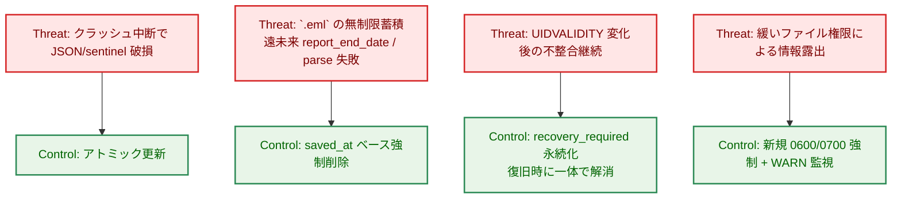

**Legend**


---

## 6. 処理フロー詳細

### 6.1 初期化フロー（F-001）

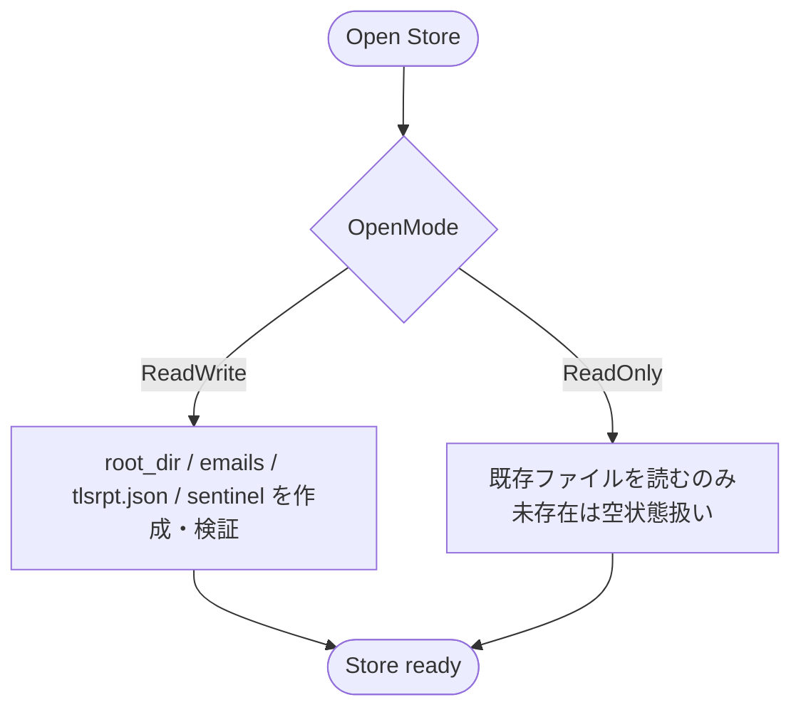

### 6.2 fetch 保存フロー（F-002/F-004）

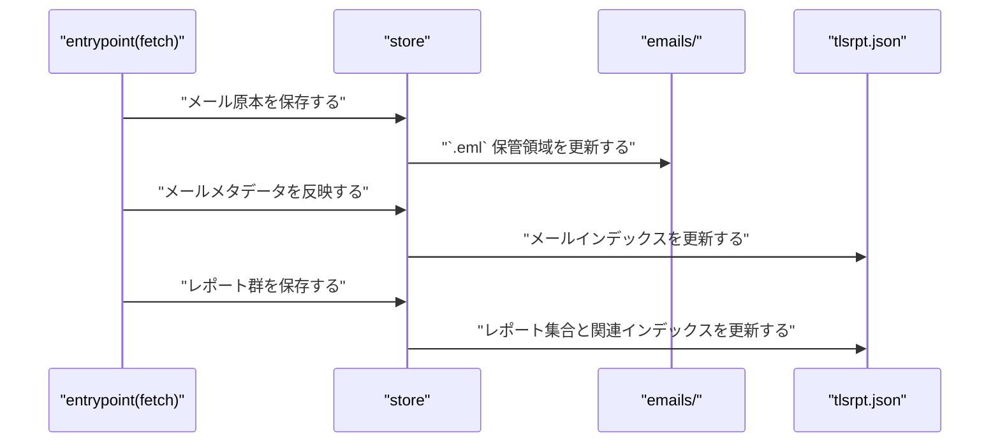

### 6.3 summary 参照フロー（F-003）

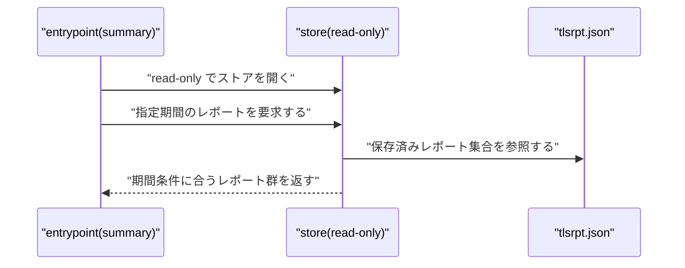

### 6.4 reprocess 読み込みフロー（F-005/F-002）

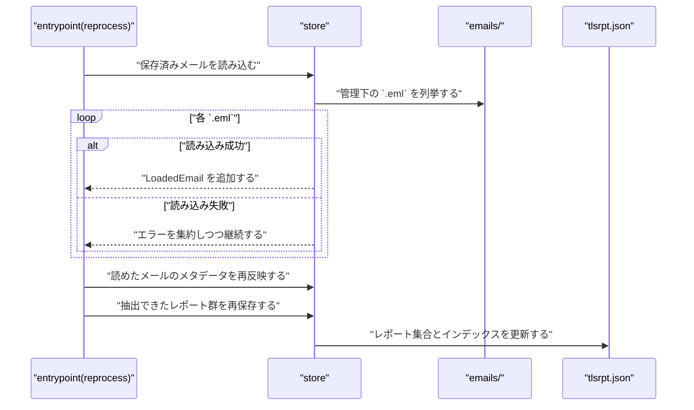

### 6.5 UIDVALIDITY 永続化フロー（F-006）

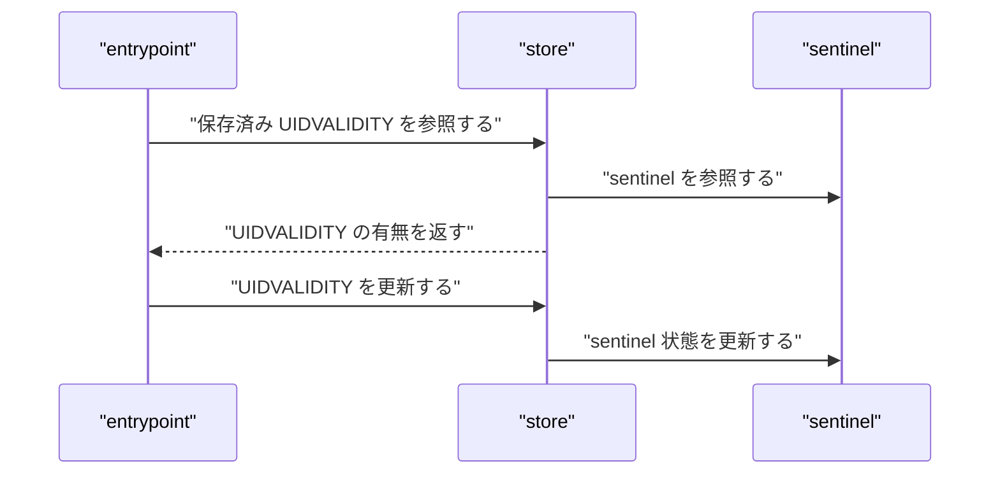

### 6.6 レポート GC フロー（F-007a）

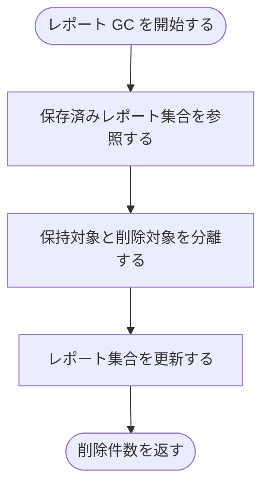

削除対象は `date-range.end-datetime` が `cutoff` より前のレポートで判定する。

### 6.7 `.eml` GC フロー（F-007b）

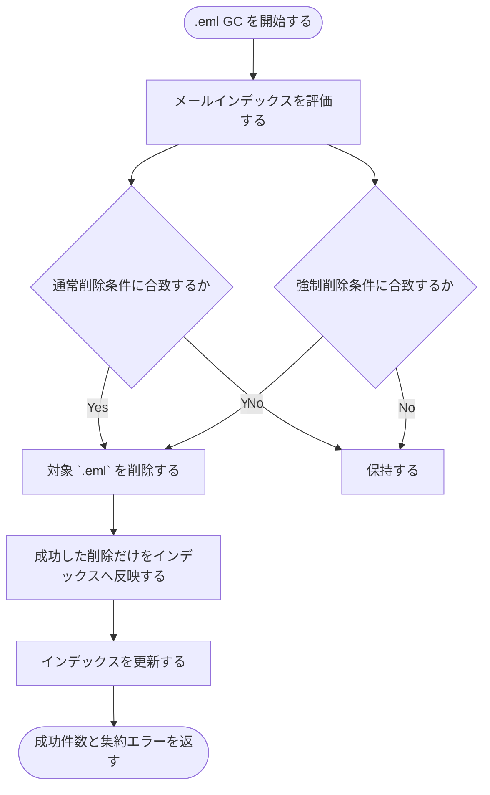

- 通常削除条件は、`report_end_date` を持つメールのうち `reportCutoff` より前のものを対象にする。
- 強制削除条件は、`savedAtCutoff` が設定された場合に `saved_at` がそれより前のものを対象にする。
- 個別削除でファイル I/O エラーが起きても全体は継続し、成功した削除だけをインデックスへ反映する。

### 6.8 recovery 適用フロー（F-008）

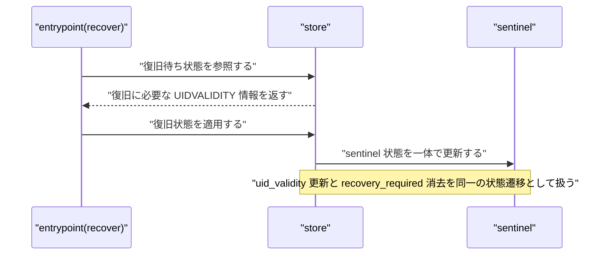

### 6.9 並行実行境界（非機能要件）

- 読み取り系（`summary`）と書き込み系（`fetch`/`gc`/`reprocess`/`recover`）の同時実行では、アトミック更新により読み取り側が部分更新状態を観測しないことを前提とする。
- 書き込み系どうしの同時実行に対する競合解決（排他制御・更新順制御）は `internal/store` の責務外とし、エントリポイント側のプロセスロックで防止する。
- `OpenReadOnly` は参照 API 専用として扱い、更新 API を同一フローで使用しない。

---

## 7. テスト戦略

### 7.1 単体テスト戦略

- F-001: 初期化（作成/冪等/read-only で非作成）
- F-002/F-004: `SaveEmail`・`SaveEmailMetas`・`SaveReports` の冪等性と同時更新整合
- F-003: `GetReportsSince` の `date-range.end-datetime >= since` フィルタ
- F-005: `LoadEmails` の UID/UIDVALIDITY/`SentAt` 逆算、フォールバック、個別失敗継続
- F-006/F-008: UIDVALIDITY/recovery 状態 API のラウンドトリップと `ApplyRecovery` 原子性
- F-007a/F-007b: GC 境界値、削除 0 件、再実行冪等、`errors.Join` 集約

### 7.2 統合テスト戦略

- テンポラリディレクトリで `Open -> Save* -> Load* -> Delete*` の一連実行を検証
- reprocess 想定で `.eml` 実データを読み込み、`SaveEmailMetas` と `SaveReports` の組合せ整合を検証
- read-only モードで `summary` 相当の参照シナリオを検証

### 7.3 セキュリティテスト戦略

- 作成ファイル `0600` / 作成ディレクトリ `0700` の検証
- アトミック更新途中失敗時の整合性（破損ファイル不生成）
- `ApplyRecovery` で中間不整合が露出しないこと
- 緩い既存権限に対する WARN 出力（自動修正しないこと）

---

## 8. 実装優先度

### Phase 1: 基盤 I/O と open モード

1. `OpenReadWrite`/`OpenReadOnly` の導入
2. アトミック書き込み共通化（JSON/sentinel）
3. sentinel 識別子検証（AC-05/AC-06）

### Phase 2: レポート・インデックス API

1. `SaveReport`/`SaveReports`/`GetReportsSince`
2. `SaveEmailMetas` と `report_end_date` 最大値更新
3. `SaveEmail`（10 桁 UID ファイル名）

### Phase 3: 読み込み・GC・復旧 API

1. `LoadEmails`（逆算・フォールバック）
2. `DeleteReportsBefore`/`DeleteEmailsBefore`
3. `SaveUIDValidity`/`LoadUIDValidity`/recovery API/`ApplyRecovery`

### Phase 4: 入口統合と検証

1. エントリポイント側 open モード利用調整
2. 単体・統合・セキュリティテスト一式
3. ドキュメント整合確認

---

## 9. 将来拡張性

- **データ量増加への対応**: `reports`/`emails` を分割ファイル化または埋め込み DB 化する余地を残す
- **複数メールボックス対応**: 現在は `root_dir` 単位 1 メールボックス前提。将来は mailbox 単位サブストアへ拡張可能
- **スキーマ移行**: `version`/`format_version` を基点に、マイグレーションレイヤを追加できる設計
- **監査性向上**: 削除・復旧操作の監査イベント出力先（構造化ログ拡張）を追加可能
- **read-only キャッシュ**: `summary` の高頻度参照向けにメモリキャッシュを追加可能
