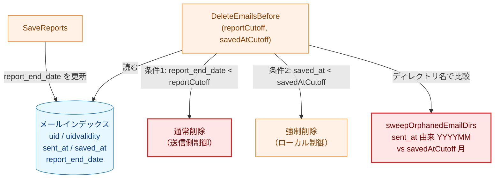
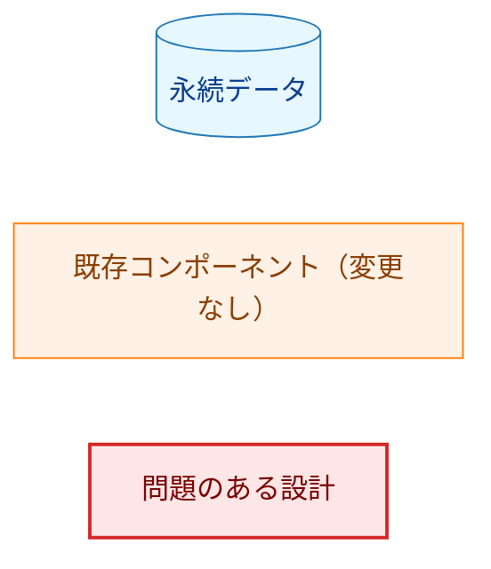
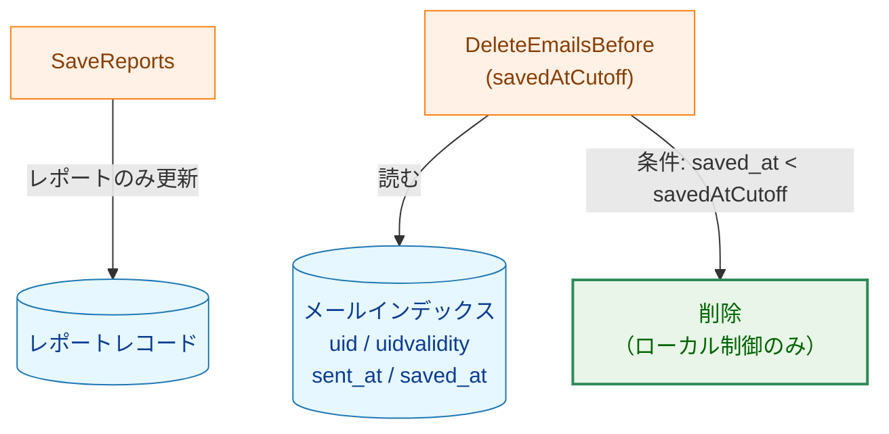
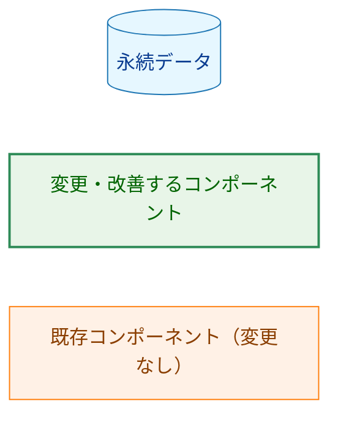
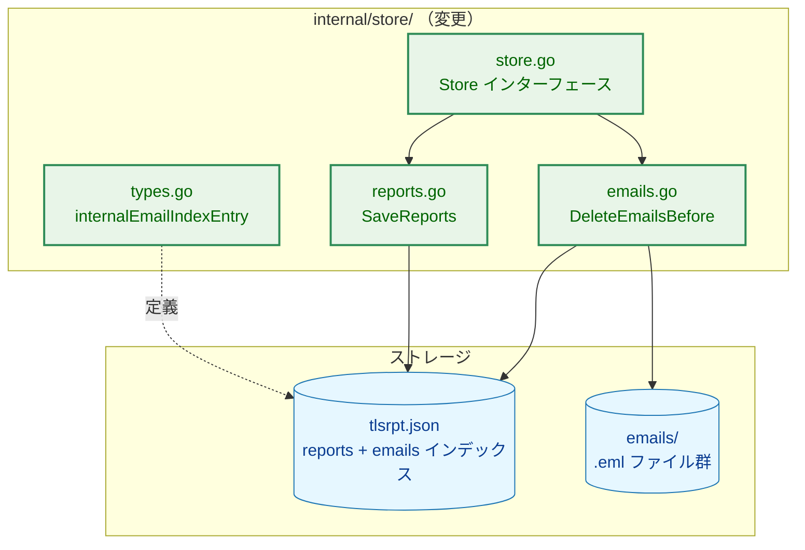
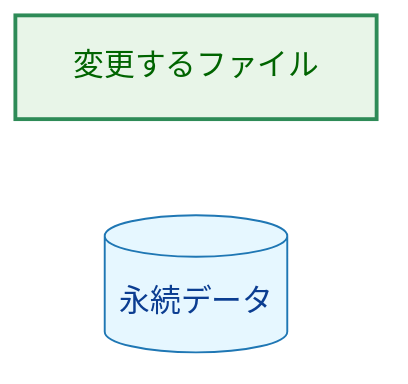
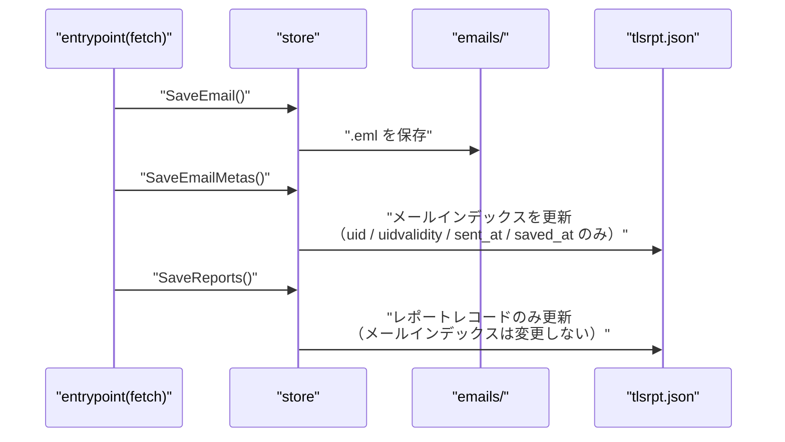
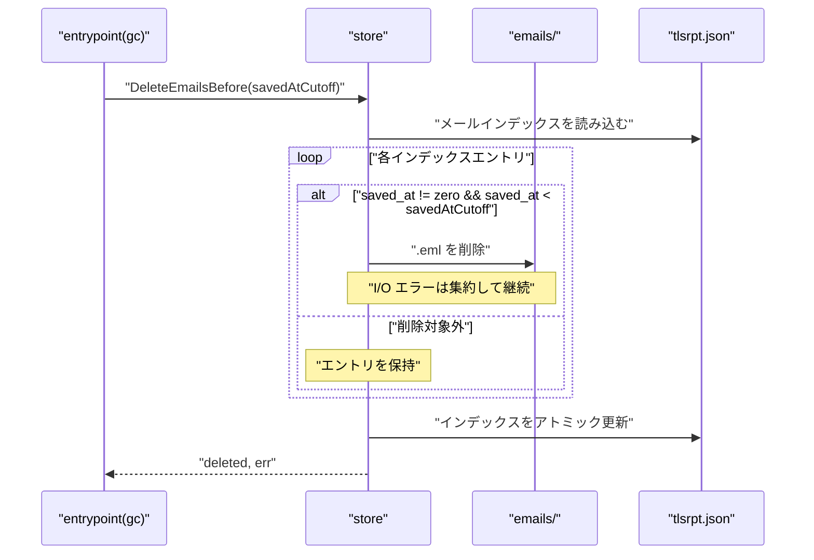
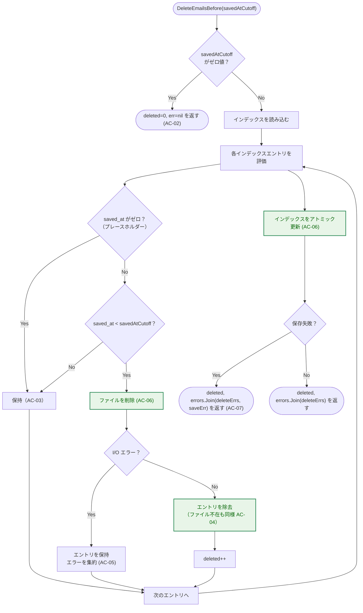

# アーキテクチャ設計書：ストア GC の簡略化

## ドキュメントステータス

| 項目 | 内容 |
|---|---|
| ステータス | `draft` |
| 作成日 | 2026-05-19 |
| レビュー日 | - |
| レビュアー | - |
| コメント | - |

---

## 1. 設計の全体像

### 1.1 設計原則

- **信頼できる日時のみを GC 判定に使う**: `.eml` の GC 基準をローカル制御の `saved_at` に一本化し、送信側が設定する `report_end_date` への依存を排除する
- **責務の分離を維持する**: `SaveReports` はレポートレコードの永続化に専念し、メールインデックスを変更しない
- **削除コードを減らす**: `sweepOrphanedEmailDirs` を廃止することで、`sent_at` と `saved_at` の月差異に起因するディレクトリ誤削除のリスクを根本から除去する
- **後方互換性を保つ**: `encoding/json` の標準動作（未知フィールドは無視）により、既存の `tlsrpt.json` はマイグレーションなしに読み込める

### 1.2 変更前後の概念モデル

#### 変更前（現状）



矢印 `A --> B` は「A が B に作用する・参照する」を表す。

**Legend**



#### 変更後（本タスク）



矢印 `A --> B` は「A が B に作用する・参照する」を表す。

**Legend**



---

## 2. システム構成

### 2.1 全体アーキテクチャ（変更対象のみ）



矢印 `A --> B` は「A が B を使う・書き込む」を表す。破線 `A -.-> B` は「A が B の構造を定義する」を表す。

**Legend**



### 2.2 コンポーネント配置と変更概要

| ファイル | 変更種別 | 変更内容 |
|---|---|---|
| `internal/store/store.go` | 変更 | `Store` インターフェースの `DeleteEmailsBefore` シグネチャを更新、ドキュメントコメントを修正 |
| `internal/store/types.go` | 変更 | `internalEmailIndexEntry` から `ReportEndDate` フィールドを削除 |
| `internal/store/reports.go` | 変更 | `SaveReports` からメールインデックス更新ロジック（`report_end_date` 更新・プレースホルダー作成）を削除。`SaveEmailMetas` の「プレースホルダー救済」ロジックも不要となるため合わせて削除 |
| `internal/store/emails.go` | 変更 | `DeleteEmailsBefore` のシグネチャ変更と削除ロジック簡略化、`sweepOrphanedEmailDirs` を削除 |
| `internal/store/emails_test.go` | 変更 | 新シグネチャ対応・テスト追加・不要テスト削除 |
| `internal/store/reports_test.go` | 変更 | `SaveReports` がメールインデックスを変更しないことの確認テスト追加・不要テスト削除 |

### 2.3 データフロー

#### fetch サイクル（変更後）



#### GC サイクル（変更後）



---

## 3. コンポーネント設計

### 3.1 インターフェース変更

```go
type Store interface {
    // ...（他のメソッドは変更なし）

    // SaveReports はレポートレコードのみを保存する。
    // メールインデックスは更新しない（AC-09）。
    SaveReports(inputs []ReportInput) error

    // DeleteEmailsBefore は saved_at < savedAtCutoff を満たす .eml ファイルを削除する。
    // savedAtCutoff がゼロ値の場合は削除を行わない（AC-02）。
    // saved_at がゼロのエントリ（プレースホルダー）は削除対象外とする（AC-03）。
    DeleteEmailsBefore(savedAtCutoff time.Time) (deleted int, err error)
}
```

### 3.2 データ型の変更

`internalEmailIndexEntry` から `ReportEndDate` フィールドを削除する。

```go
// 変更前
type internalEmailIndexEntry struct {
    UID           uint32     `json:"uid"`
    UIDValidity   uint32     `json:"uidvalidity"`
    SentAt        time.Time  `json:"sent_at"`
    SavedAt       time.Time  `json:"saved_at"`
    ReportEndDate *time.Time `json:"report_end_date"` // 削除
}

// 変更後
type internalEmailIndexEntry struct {
    UID         uint32    `json:"uid"`
    UIDValidity uint32    `json:"uidvalidity"`
    SentAt      time.Time `json:"sent_at"`
    SavedAt     time.Time `json:"saved_at"`
}
```

### 3.3 後方互換性の設計

既存の `tlsrpt.json` に `report_end_date` フィールドが存在しても、`encoding/json` の `Unmarshal` は未知フィールドをデフォルトで無視するため、読み込みエラーは発生しない。`DataFileVersion` は変更しない（AC-11）。

### 3.4 SaveEmailMetas の変更

`SaveReports` がプレースホルダーエントリ（SentAt / SavedAt がゼロの最小エントリ）を作成しなくなるため、`SaveEmailMetas` にある「ゼロ値フィールドを埋める救済ロジック」も不要となる。`SaveEmailMetas` は「同一 `{uid, uidvalidity}` が既に存在する場合は何もしない」という純粋な冪等挿入のみに簡略化する。この変更は 0040 の既存 AC-08d（冪等動作）と整合する。

---

## 4. エラーハンドリング設計

### 4.1 エラー方針

| ケース | 方針 |
|---|---|
| `.eml` の個別削除に I/O エラー | エントリをインデックスに残し、`errors.Join` で集約して継続（AC-05） |
| インデックスの保存失敗 | 失敗前の削除件数を返し、保存エラーを集約して返す（AC-07） |
| `saved_at` がゼロのエントリ | 削除対象外として扱い、インデックスに保持（AC-03） |

既存の `ErrDeleteEmailFailed` 型は変更なしで継続使用する。

---

## 5. セキュリティ考慮事項

本タスクは通知先を持たず、`notification_security.md` の適用対象外である。

セキュリティ上の主な改善点は以下のとおりである。

- 送信側が設定する `report_end_date` を GC 判定から排除することで、遠未来日付による `.eml` の無制限蓄積攻撃のベクターを閉じる
- GC 基準がローカル制御の `saved_at` のみになることで、攻撃者が GC を無効化するための手段が 1 つ減る

---

## 6. 処理フロー詳細

### 6.1 `DeleteEmailsBefore` フロー（変更後）



---

## 7. テスト戦略

### 7.1 単体テスト

| 対象 | 検証内容 |
|---|---|
| `DeleteEmailsBefore`（新シグネチャ） | `savedAtCutoff` がゼロ → 削除なし（AC-02） |
| | `saved_at < savedAtCutoff` → ファイルとインデックスエントリを削除（AC-03, AC-06） |
| | `saved_at` がゼロのエントリ → 削除対象外（AC-03） |
| | ファイル不在 → 冪等動作（AC-04） |
| | I/O エラー混在 → 成功件数と集約エラーを返す（AC-05） |
| | インデックス更新失敗 → 削除済み件数とエラーを返す（AC-07） |
| `SaveReports` | メールインデックスを変更しないこと（AC-09） |
| `internalEmailIndexEntry` | `report_end_date` フィールドを持つ既存 JSON を読み込んでもエラーにならないこと（AC-10） |
| `SaveEmailMetas` | 既存エントリへの冪等挿入動作（ゼロ値救済ロジック削除後）|

### 7.2 統合テスト

- fetch サイクル（`SaveEmail` → `SaveEmailMetas` → `SaveReports`）後に GC を実行し、`saved_at < cutoff` のエントリのみが削除されること
- GC 後に `GetReportsSince` でレポートレコードが正常に取得できること（メールと独立していることの確認）

### 7.3 セキュリティテスト

- 本タスクにセキュリティ固有のテスト要件はない（N/A）

---

## 8. 実装優先度

### Phase 1: 型とインターフェースの変更

1. `internalEmailIndexEntry` から `ReportEndDate` を削除（`types.go`）
2. `Store` インターフェースの `DeleteEmailsBefore` シグネチャ更新（`store.go`）

### Phase 2: 実装の変更

1. `SaveReports` からメールインデックス更新ロジックを削除（`reports.go`）
2. `SaveEmailMetas` のプレースホルダー救済ロジックを削除（`emails.go`）
3. `DeleteEmailsBefore` を新シグネチャ・新ロジックに変更（`emails.go`）
4. `sweepOrphanedEmailDirs` を削除（`emails.go`）

### Phase 3: テストの更新と確認

1. `emails_test.go`・`reports_test.go` を新シグネチャ対応に更新
2. `make fmt && make test && make lint` を実行して全テストが通ることを確認

---

## 9. 将来拡張性

- 孤立 `.eml`（インデックスに存在しないファイル）の清掃は `reprocess` サブコマンド（タスク 0070 F-004）が全 `.eml` を再帰走査することで対応する。ディレクトリスイープの廃止はこの設計と整合する
- date-range バリデーション（遠未来 `end-datetime` の拒否）はタスク 0070 のエントリポイントで実装する。本タスクはそのための前提条件（`report_end_date` への依存排除）を整備する
- レポートレコード（`tlsrpt.json` の `reports` 配列）の GC は引き続き `DeleteReportsBefore(cutoff)` で行い、エントリポイント側で上限保持期間を設けることで遠未来 `end-datetime` 攻撃への対策を補完する
