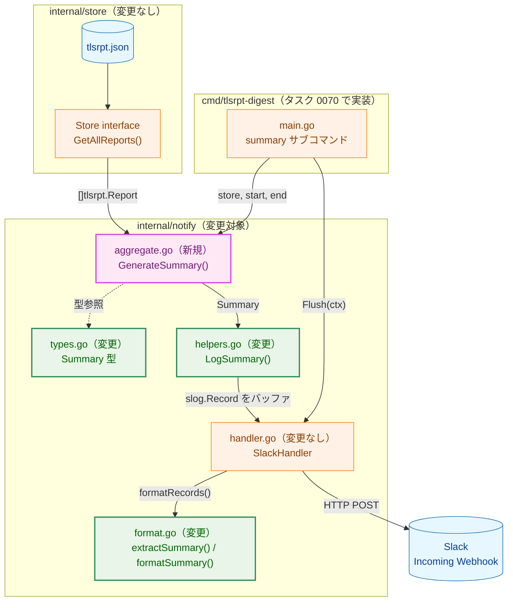
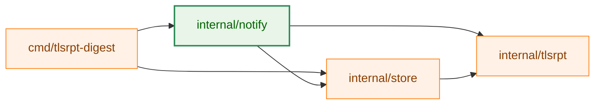
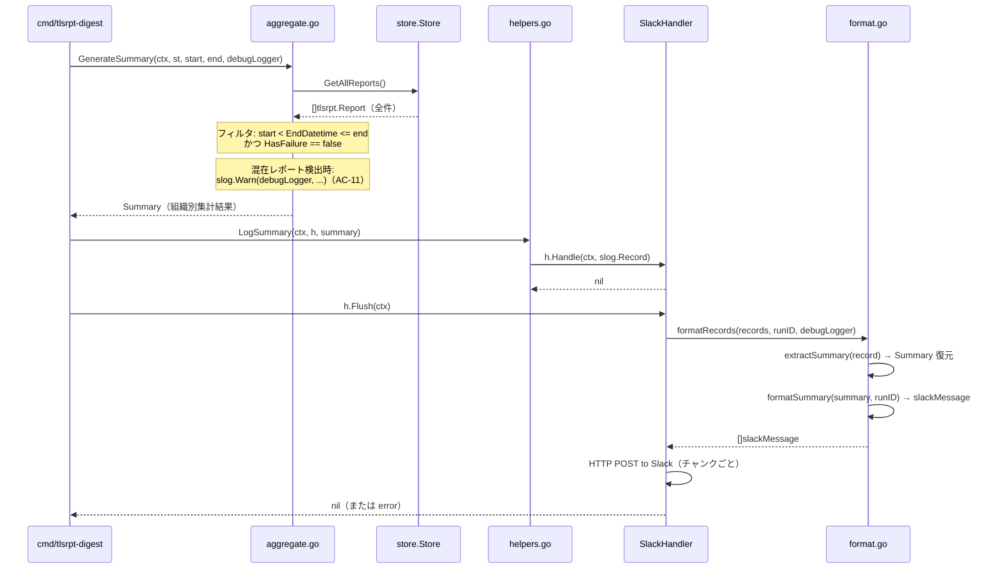
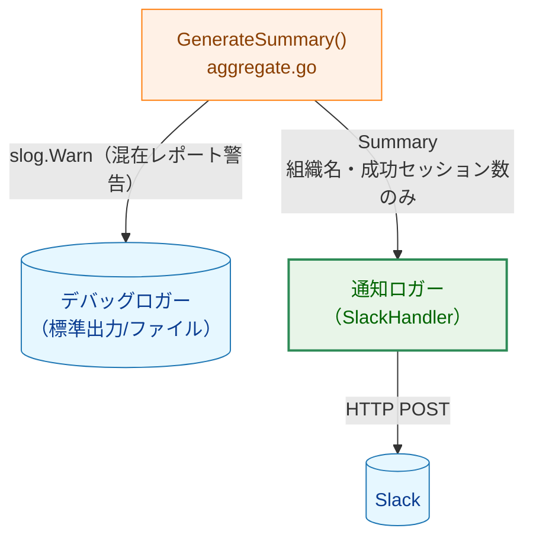
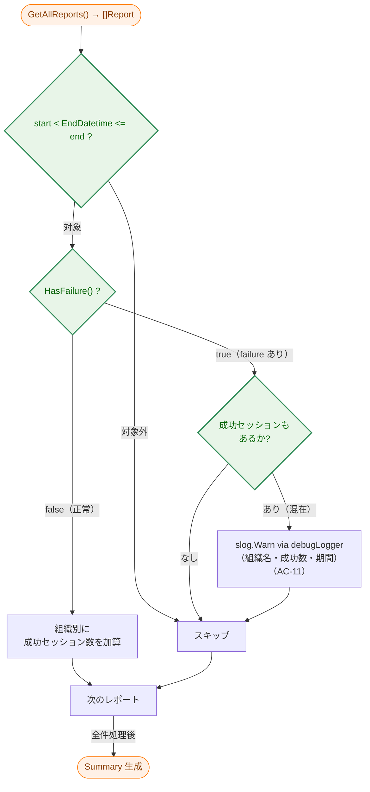
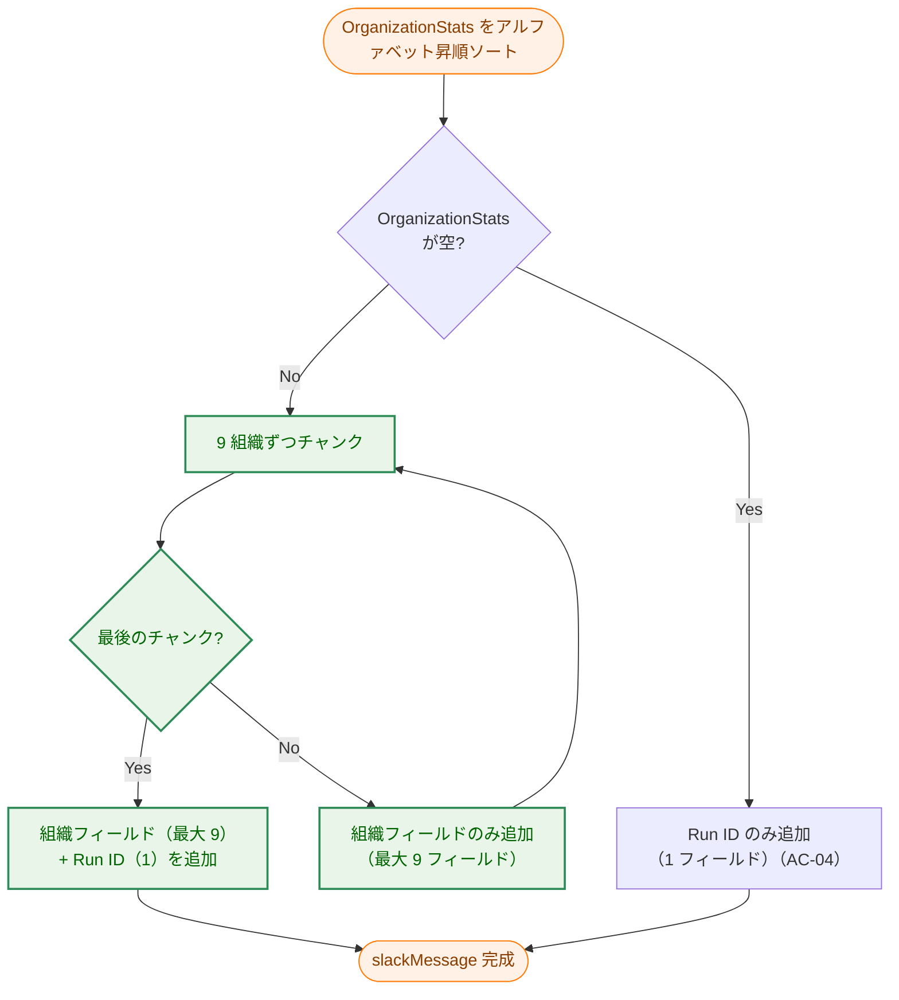

# アーキテクチャ設計書：定期サマリ生成・通知

## ドキュメントステータス

| 項目 | 内容 |
|---|---|
| ステータス | `draft` |
| 作成日 | 2026-05-20 |
| レビュー日 | - |
| レビュアー | - |
| コメント | - |

---

## 1. 設計の全体像

### 1.1 設計原則

1. **責務の集約**: 定期サマリの集計・シリアライズ・フォーマットはすべて `internal/notify` に集約する。呼び出し元（`cmd/`）は `GenerateSummary` と `LogSummary` を順に呼ぶだけでよい。
2. **ストア層はフィルタリングしない**: `store.GetAllReports()` は全件を返す。日時範囲・failure による絞り込みは `internal/notify/aggregate.go` で行う（要件 F-001 の「アプリケーション層でフィルタリング」に対応）。
3. **型付きヘルパー経由での通知**: 通知ロガーへの書き込みは `LogSummary` を通じてのみ行う。外部パッケージから通知ロガーへの直接アクセスは禁止する（[notification_security.md](../../dev/developer_guide/notification_security.md) 原則 5 準拠）。
4. **`Summary` 型で組織別集計を一貫して伝達**: `OrganizationStats map[string]int64` を `Summary` に持ち、`LogSummary` → `slog.Record` → `extractSummary` → `formatSummary` の全段階で同じ型を利用する。`OrganizationCount` は `len(OrganizationStats)` で導出されるため `Summary` から削除する。
5. **Slack 10 フィールド制約への対応**: `formatAlerts` と同様に `formatSummary` でも attachment をチャンク分割する（AC-10）。集計期間・レポート総数・組織総数は `text` フィールドに置くことで attachment フィールドカウントから除外する。

### 1.2 概念モデル

矢印 A → B は「A が B を利用する（呼び出しまたはデータ参照）」を表す。

```mermaid
flowchart LR
    classDef data fill:#e6f7ff,stroke:#1f77b4,stroke-width:1px,color:#0b3d91;
    classDef process fill:#fff1e6,stroke:#ff7f0e,stroke-width:1px,color:#8a3e00;
    classDef enhanced fill:#e8f5e8,stroke:#2e8b57,stroke-width:2px,color:#006400;
    classDef newpkg fill:#ffe8f5,stroke:#d946ef,stroke-width:2px,color:#701a75;

    Store[("store.Store<br>GetAllReports()")] --> Aggregate["GenerateSummary()<br>aggregate.go（新規）"]
    Aggregate --> SummaryType["notify.Summary<br>types.go（変更）"]
    SummaryType --> LogHelper["LogSummary()<br>helpers.go（変更）"]
    LogHelper --> Handler["slog.Handler<br>handler.go（変更なし）"]
    Handler --> Format["formatSummary()<br>format.go（変更）"]
    Format --> Slack[("Slack<br>Incoming Webhook")]

    class Store,Slack data
    class Handler process
    class SummaryType,LogHelper,Format enhanced
    class Aggregate newpkg
```



**凡例**

| 色 | クラス | 意味 |
|---|---|---|
| 青 | data | データストアまたは外部サービス |
| オレンジ | process | 変更なしの既存コンポーネント |
| 緑 | enhanced | 変更対象の既存ファイル |
| 紫 | newpkg | 新規追加ファイル |

---

## 2. システム構成

### 2.1 全体アーキテクチャ

矢印 A → B は「A が B を呼び出す」を表す。点線矢印は型定義の参照を表す。



**凡例**

| 色 | クラス | 意味 |
|---|---|---|
| 青 | data | データストアまたは外部サービス |
| オレンジ | process | 変更なしの既存コンポーネント |
| 緑 | enhanced | 変更対象の既存ファイル |
| 紫 | newpkg | 新規追加ファイル |

### 2.2 パッケージ依存関係

矢印 A → B は「A が B をインポートする」を表す。



**設計上の注意**: 既存の `internal/notify` は `internal/tlsrpt` に依存しない設計だったが（`DateRange` を独立定義していたのがその証左）、`aggregate.go` の追加により `internal/notify` は `internal/store` および `internal/tlsrpt` への依存を持つ。これはテスト要件（`FakeStore` の利用）から `store.Store` を直接受け取る設計を選択したためであり、意図的なトレードオフである。通知ペイロード型（`Alert`、`Summary`）は引き続き `tlsrpt` の型を直接参照しない。

**凡例**

| 色 | クラス | 意味 |
|---|---|---|
| オレンジ | process | 変更なしのパッケージ |
| 緑 | enhanced | 変更対象パッケージ |

### 2.3 データフロー（シーケンス図）

矢印 A → B は「A が B を呼び出す」、破線矢印 A -->> B は「B が A に結果を返す」を表す。



**凡例**

| 記法 | 意味 |
|---|---|
| `->>` | 同期呼び出し |
| `-->>` | 戻り値または処理結果の返却 |
| `note over` | 実装方針上の補足条件 |

---

## 3. コンポーネント設計

### 3.1 データ構造の変更

#### `Summary` 型（types.go）

既存の `OrganizationCount int` フィールドを削除し、`OrganizationStats map[string]int64` を追加する。

```go
// Summary は定期サマリ通知のペイロード型。
// OrganizationStats のキーは組織名、値は成功セッション数の合計。
// OrganizationCount は len(OrganizationStats) で導出するため保持しない。
type Summary struct {
    Period            DateRange
    OrganizationStats map[string]int64
    ReportCount       int
}
```

### 3.2 インターフェース定義（変更なし）

`Flusher` インターフェース、`Notifier` インターフェースの変更はない。

### 3.3 コンポーネント責務

| ファイル | 変更種別 | 責務 |
|---|---|---|
| `internal/notify/aggregate.go` | **新規** | `store.GetAllReports()` を呼び出し、日時・failure フィルタリング後に組織別集計を行い `Summary` を返す。混在レポートを `slog.Warn` で記録する（AC-01, AC-02, AC-03, AC-04, AC-11） |
| `internal/notify/types.go` | **変更** | `Summary` 型から `OrganizationCount` を削除し `OrganizationStats map[string]int64` を追加する |
| `internal/notify/helpers.go` | **変更** | `LogSummary` を更新し `OrganizationStats` を `slog.Group("organization_stats", ...)` としてシリアライズする |
| `internal/notify/format.go` | **変更** | `extractSummary` を更新して `organization_stats` グループを `OrganizationStats` マップに復元する。`formatSummary` を更新して集計期間・レポート総数・組織総数を `text` フィールドに、組織フィールドを attachment にチャンク分割して配置する（AC-05, AC-06, AC-07, AC-10） |
| `internal/notify/aggregate_test.go` | **新規** | `GenerateSummary` の単体テスト（AC-01 〜 AC-04, AC-11） |
| `internal/notify/format_test.go` | **変更** | `formatSummary` の更新に対応するテストを追加（AC-05, AC-06, AC-07, AC-10） |
| `internal/notify/helpers_test.go` | **変更** | `LogSummary` の更新に対応するテストを追加（AC-08, AC-09） |

---

## 4. エラーハンドリング設計

### 4.1 エラーの種類と伝播

| 発生箇所 | 種類 | 処理方針 |
|---|---|---|
| `store.GetAllReports()` 失敗 | `error`（store 層由来） | `GenerateSummary` がそのままラップして返す |
| `LogSummary` でのハンドラ書き込み失敗 | `slog.Handler.Handle` の error | 呼び出し元に返す |
| `Flush` でのHTTP送信失敗 | `SlackHandler` 既存のリトライ・エラー処理 | 変更なし。最終的に送信できなかった場合は error を返し、AC-09 を満たす（既存 `retry.go` が担当） |

### 4.2 混在レポートの警告（AC-11）

`HasFailure() == true` かつ `sum(TotalSuccessfulSessionCount) > 0` のレポートを検出した場合はエラーにせず、`slog.Warn` をデバッグロガーに出力する。このログは通知ロガーには流れない（セクション 5 のスレットモデル参照）。

---

## 5. セキュリティ考慮事項

本機能は通知を送信するため、[notification_security.md](../../dev/developer_guide/notification_security.md) に定めるガイドラインを適用する。

### 5.1 スレットモデル

矢印 A → B は「A が B に情報を書き込む」を表す。



**凡例**

| 色 | クラス | 意味 |
|---|---|---|
| 青 | data | 外部出力先 |
| オレンジ | process | 処理コンポーネント |
| 緑 | enhanced | 通知ロガー |

### 5.2 設計方針との対応

| ガイドライン原則 | 本機能での適用 |
|---|---|
| 原則 1: 引数型による制約 | `Summary` は `OrganizationStats`（組織名と成功セッション数）のみを保持し、パスワードや Webhook URL を含まない |
| 原則 3: 通知側のリダクションは無効化不可 | `SlackHandler` 側の変更なし。既存の設計を維持 |
| 原則 5: 型付きイベントヘルパー | `LogSummary` のみが通知ロガーへの書き込みを担う。外部から直接 `logger.Info(...)` を呼ぶ経路は作らない |
| デバッグロガーと通知ロガーの分離 | AC-11 の混在レポート警告は `debugLogger`（`slog.Logger`）に書く。通知ロガー（`slog.Handler`）には流れない |

---

## 6. 処理フロー詳細

### 6.1 集計フロー（F-001）

半開区間フィルタリング `start < DateRange.EndDatetime <= end` および `HasFailure() == false` で対象レポートを絞り込む。残ったレポートを組織名でグループ化し、各組織の `TotalSuccessfulSessionCount` を合計する。
対象レポートが 0 件でも `Summary` は返し、`OrganizationStats` は空、`ReportCount` は 0 とする。これにより AC-04 の「レポートなし通知」は呼び出し元で一貫して扱える。

**半開区間を採用した理由**: 連続する集計期間で境界のレポートが重複カウントされないよう、終了側のみを閉じた区間とする（例: 第 1 週 = (Mon 00:00, Mon 00:00 + 7d]、第 2 週 = (Mon 00:00 + 7d, Mon 00:00 + 14d] の境界は重複しない）。

矢印 A → B は「A の判定結果に応じて次の処理へ進む」を表す。



**凡例**

| 色 | クラス | 意味 |
|---|---|---|
| オレンジ | process | 処理の開始・終了 |
| 緑 | enhanced | 判定ノード |

### 6.2 フォーマットフロー（F-002）

`formatSummary` は `formatAlerts` と同様に attachment チャンク分割を行う。

#### Slack メッセージ構造

| 配置先 | 内容 | フィールドカウント |
|---|---|---|
| `text` フィールド | 集計期間・レポート総数・組織総数（AC-05, AC-07） | カウントされない |
| Attachment フィールド群 | 組織名と成功セッション数（AC-06） | 最大 9 フィールド / attachment |
| 最後の Attachment の末尾 | Run ID | 1 フィールド消費 |

#### Attachment チャンク分割の条件（AC-10）

矢印 A → B は「A の処理結果として B を続けて行う」を表す。



**凡例**

| 色 | クラス | 意味 |
|---|---|---|
| オレンジ | process | 処理の開始・終了 |
| 緑 | enhanced | 処理ノード |

### 6.3 `LogSummary` のシリアライズ形式

`OrganizationStats` は `slog.Group("organization_stats", ...)` としてシリアライズする。キーが組織名（動的）のため、個別の slog 属性ではなくグループにまとめることで `extractSummary` の復元処理を単純化する。シリアライズ前に組織名のアルファベット昇順でソートし、ログ出力を決定論的にする。

| 属性 | 値の型 | 意味 |
|---|---|---|
| `period_start` | `time.Time` | 集計期間の開始日時 |
| `period_end` | `time.Time` | 集計期間の終了日時 |
| `report_count` | `int64` | 対象レポート総数 |
| `organization_stats` | `slog.Group` | 組織名をキー、成功セッション数合計を値として保持するグループ |

---

## 7. テスト戦略

### 7.1 単体テスト

| 対象 | テストファイル | 確認内容 |
|---|---|---|
| `GenerateSummary` | `aggregate_test.go`（新規） | 日時フィルタ境界値（半開区間）、failure 除外、混在レポート警告、レポートなし時の動作（AC-01 〜 AC-04, AC-11） |
| `formatSummary` | `format_test.go`（変更） | 組織数 ≤ 9 の単一 attachment、組織数 > 9 の複数 attachment、Run ID の位置、`text` フィールドの内容（AC-05, AC-06, AC-07, AC-10） |
| `LogSummary` | `helpers_test.go`（変更） | `organization_stats` グループのシリアライズ形式、`extractSummary` による復元の対称性（AC-08） |

### 7.2 統合テスト

`SpyHandler`（`notifytestutil`）と `FakeStore`（`storetestutil`）を組み合わせ、`GenerateSummary` → `LogSummary` → `Flush` の一連フローを検証する。複数の集計期間値（0 件、1 件、複数組織、境界値）でテストする（AC-08, AC-09）。

### 7.3 セキュリティテスト

[notification_security.md](../../dev/developer_guide/notification_security.md) § 5 の要件に従い、以下を確認する:
- `Summary` に含まれる slog.Record が `OrganizationStats` フィールドのみを保持し、パスワードや Webhook URL を含まないこと
- 混在レポート警告（AC-11）の `slog.Warn` が `SpyHandler` 側に流れないこと（デバッグロガー側にのみ出力されること）

---

## 8. 実装優先順位

### フェーズ 1: `Summary` 型の変更と集計関数の新設

1. `types.go`: `OrganizationCount` を削除、`OrganizationStats map[string]int64` を追加
2. `aggregate.go`（新規）: `GenerateSummary` を実装
3. `aggregate_test.go`（新規）: AC-01 〜 AC-04, AC-11 のテストを追加

### フェーズ 2: `LogSummary` と `extractSummary` の更新

4. `helpers.go`: `LogSummary` を `OrganizationStats` 対応に更新
5. `format.go`: `extractSummary` を `organization_stats` グループ解析対応に更新
6. `helpers_test.go` / `format_test.go`: シリアライズ・復元の対称性テストを追加

### フェーズ 3: `formatSummary` の更新

7. `format.go`: `formatSummary` を attachment チャンク分割・`text` フィールド配置に更新
8. `format_test.go`: AC-05, AC-06, AC-07, AC-10 のテストを追加

### フェーズ 4: 統合テスト

9. `helpers_test.go` または専用の統合テストファイル: `SpyHandler` + `FakeStore` による end-to-end テスト（AC-08, AC-09）

---

## 9. 将来拡張性

| 拡張テーマ | 本設計での考慮 |
|---|---|
| ポリシー別の集計（タスク未定） | `OrganizationStats` は現在「組織名 → 成功セッション数合計」のみ。ポリシー別に拡張するには `Summary` 型の変更が必要。`formatSummary` は attachment チャンク設計に変更し増加に備えている |
| レポートなし時の通知省略設定（タスク 0070） | `GenerateSummary` は常に `Summary` を返す。省略の判断は呼び出し元で行う設計にしておく |
| メール通知対応 | `LogSummary` → `slog.Handler` の型付きヘルパー設計を維持することで、メール用 `slog.Handler` を追加するだけで対応可能 |
| 組織名ソート順の変更 | `formatSummary` ではアルファベット昇順を固定しているが、将来的には `SlackHandlerOptions` にソート設定を追加することで対応可能 |
