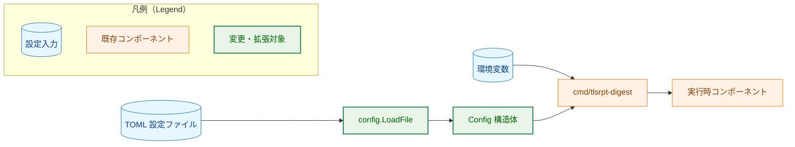
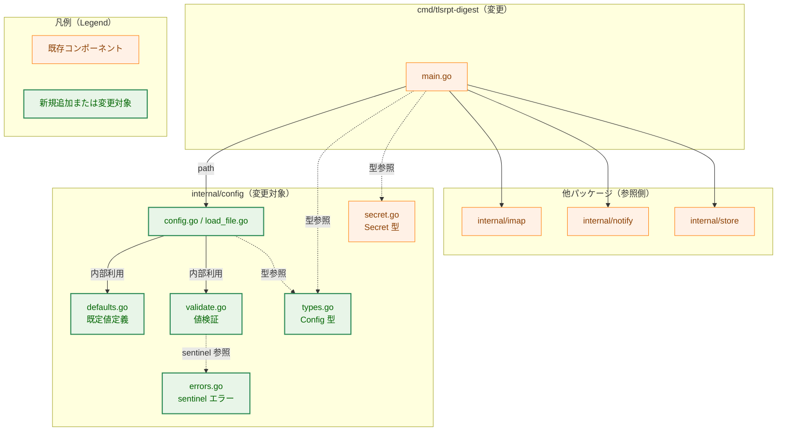
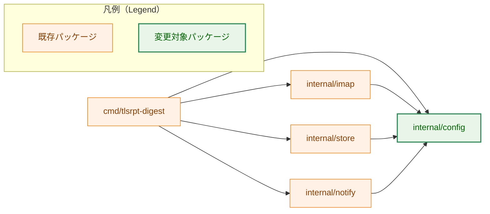
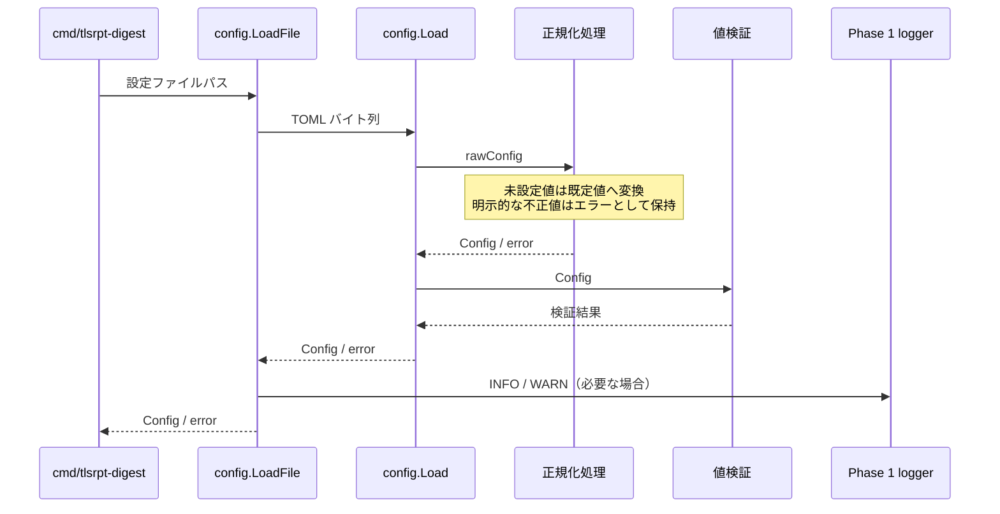
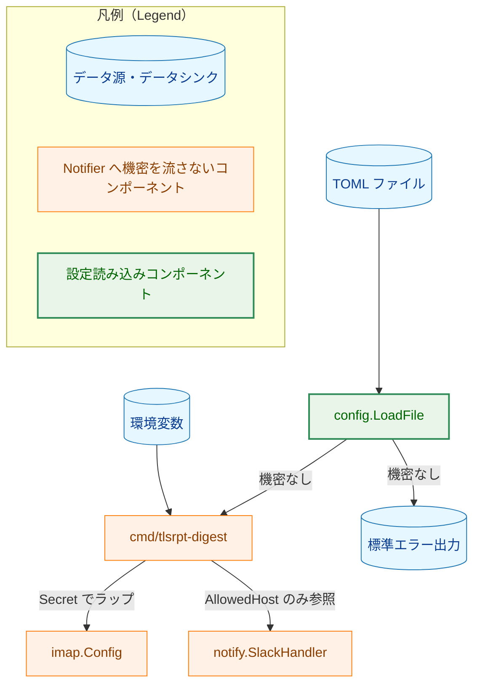
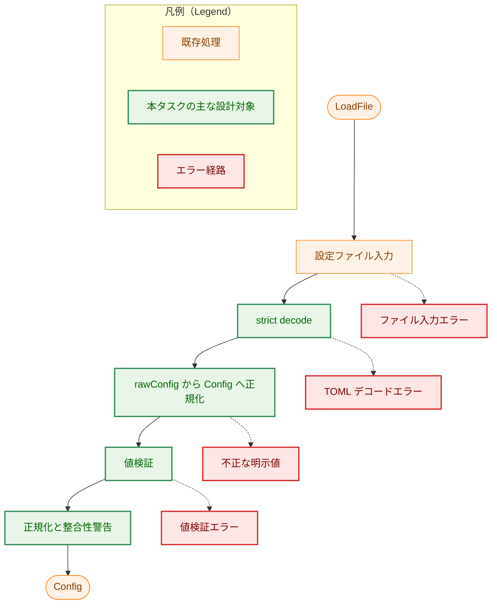

# アーキテクチャ設計書：設定ファイル読み込み（TOML）

## ドキュメントステータス

| 項目 | 内容 |
|---|---|
| ステータス | `draft` |
| 作成日 | 2026-05-21 |
| レビュー日 | |
| レビュアー | |
| コメント | |

---

## 1. 設計の全体像

### 1.1 設計原則

1. **責務の集約**: TOML のデコード・既定値の適用・値検証・整合性チェックは `internal/config` パッケージに集約する。呼び出し元（`cmd/tlsrpt-digest`）は `config.LoadFile` を 1 回呼ぶだけで、既定値適用済みかつ検証済みの `*Config` を得られる。
2. **機密情報を TOML に置かない**: IMAP のユーザ名・パスワード、Slack Webhook URL は TOML に置かず、環境変数経由で取得する（AC-07・AC-08）。`internal/config` はこれらの値を `*Config` に格納しない（環境変数の読み出しは `cmd/tlsrpt-digest` の責務）。
3. **既知キーのみ許容（strict decode）**: `DisallowUnknownFields` を有効化し、TOML の typo や旧形式キーを早期に検出する（AC-04）。既存の `config.Load` の方針を踏襲する。
4. **TOML パースエラーに機密情報を含めない**: TOML の `Decode` エラーは設定ファイルそのものの文法情報のみで、TOML 本文は機密を含まない前提とする。エラー文には値そのものを露出しないよう、基底エラーにラベルと文脈だけを付加する。
5. **整合性 WARN はエラーにしない**: 互いに矛盾する保持期間設定（AC-10b・AC-10c）は WARN ログのみで継続する。これは「ユーザが意図的にこの組み合わせを選んだ場合に動作を停止させない」ためであり、設定値そのものは個別バリデーション（AC-10a 等）で十分検査されているという前提に基づく。
6. **CWD 依存の排除**: `store.root_dir` の相対パスは `config.LoadFile` 内で絶対パスへ正規化する（AC-10d）。systemd timer 経由の起動など CWD が `/` になる環境で意図しない参照先を持たないようにするための恒久対応。
7. **エラーは sentinel + ラップ**: バリデーション失敗時には `errors.Is` で識別可能な sentinel エラーをラップして返す（CLAUDE.md「Error Testing」方針）。
8. **エントリポイントは設定ファイル必須**: 本タスク以降、実行に必要な IMAP 接続情報は TOML から得るため、`cmd/tlsrpt-digest` の `-config` 未指定は設定エラーとして扱う。`loadConfig("")` で空 `Config` を返す既存の暫定挙動は廃止する。

### 1.2 概念モデル

矢印 A → B は「A を入力として B を生成する」を表す。



---

## 2. システム構成

### 2.1 全体アーキテクチャ

矢印 A → B は「A が B を呼び出す」を表す。点線矢印は「型定義の参照」を表す。



### 2.2 パッケージ依存関係

矢印 A → B は「A が B をインポートする」を表す。



**設計上の注意**: 既存パッケージ（`imap`・`notify`・`store`）は `internal/config` の `Secret` 型を参照するのみであり、本タスクで追加する `IMAPConfig`・`StoreConfig` 等の構造体には依存しない。これらの構造体は TOML 表現として閉じており、各パッケージは独自の設定型（例：`imap.Config`）を引き続き利用する。型同士の変換は `cmd/tlsrpt-digest` が担う。

### 2.3 データフロー（シーケンス図）

矢印 A → B は「A が B に入力を渡す」、破線矢印 A -->> B は「B が A に結果を返す」を表す。



**記法**

| 記法 | 意味 |
|---|---|
| `->>` | 入力の受け渡し |
| `-->>` | 結果の返却 |
| `note over` | 設計上の制約 |

---

## 3. コンポーネント設計

### 3.1 TOML キー設計（仮称の確定）

要件文書（`01_requirements.md`）で「正式キー名は `02_architecture.md` で確定」とされた仮称を本書で確定する。

| 機能領域 | TOML キー | Go フィールド | 既定値 | 関連 AC |
|---|---|---|---|---|
| IMAP | `imap.host` | `IMAPConfig.Host` | （必須） | AC-01・AC-05 |
| IMAP | `imap.port` | `IMAPConfig.Port` | （必須） | AC-01・AC-06 |
| IMAP | `imap.mailbox` | `IMAPConfig.Mailbox` | `"INBOX"` | AC-11 |
| IMAP | `imap.fetch_days` | `IMAPConfig.FetchDays` | `14` | AC-09・AC-12 |
| IMAP | `imap.tls_ca_cert` | `IMAPConfig.TLSCACert` | `""`（OS バンドル） | AC-10・AC-14 |
| IMAP | `imap.max_message_bytes` | `IMAPConfig.MaxMessageBytes` | `0`（無制限） | 0010・0070 連携 |
| Notify | `notify.slack.allowed_host` | `NotifyConfig.Slack.AllowedHost` | `""`（Slack 無効化） | AC-08 |
| Store | `store.root_dir` | `StoreConfig.RootDir` | `"./store"` | AC-10d・AC-13 |
| Store | `store.retention_days` | `StoreConfig.RetentionDays` | `30` | AC-10a・AC-10b・AC-10c・AC-16 |
| Store | `store.max_email_age_days` | `StoreConfig.MaxEmailAgeDays` | `30` | AC-10a・AC-10b・AC-17 |
| Summary | `summary.window_days` | `SummaryConfig.WindowDays` | `7` | AC-10a・AC-15 |

これらの正式キー名は、後続タスク（0070 など）の文書中で「仮称」と記載されている箇所を置換する基準となる。

### 3.2 型定義（高レベル）

`internal/config/types.go`（新規）に以下の構造体を定義する。公開する `Config` は正規化済みのアプリケーション設定を表し、TOML タグはデコード専用の `rawConfig` 側に閉じ込める。

```go
// Config は既定値適用と検証を終えたアプリケーション設定。
// 機密情報（IMAP 認証情報・Webhook URL）はここに含めない。
type Config struct {
    IMAP    IMAPConfig
    Notify  NotifyConfig
    Store   StoreConfig
    Summary SummaryConfig
}

type IMAPConfig struct {
    Host            string
    Port            int
    Mailbox         string
    FetchDays       int
    TLSCACert       string
    MaxMessageBytes int64
}

type NotifyConfig struct {
    Slack NotifySlackConfig
}

type NotifySlackConfig struct {
    AllowedHost string
}

type StoreConfig struct {
    RootDir         string
    RetentionDays   int
    MaxEmailAgeDays int
}

type SummaryConfig struct {
    WindowDays int
}

// rawConfig は TOML デコード専用の内部表現。
// ポインタにより「未設定」と「明示的なゼロ値」を区別する。
type rawConfig struct {
    IMAP    rawIMAPConfig    `toml:"imap"`
    Notify  rawNotifyConfig  `toml:"notify"`
    Store   rawStoreConfig   `toml:"store"`
    Summary rawSummaryConfig `toml:"summary"`
}

type rawIMAPConfig struct {
    Host            string  `toml:"host"`
    Port            *int    `toml:"port"`
    Mailbox         *string `toml:"mailbox"`
    FetchDays       *int    `toml:"fetch_days"`
    TLSCACert       *string `toml:"tls_ca_cert"`
    MaxMessageBytes *int64  `toml:"max_message_bytes"`
}

type rawNotifyConfig struct {
    Slack rawNotifySlackConfig `toml:"slack"`
}

type rawNotifySlackConfig struct {
    AllowedHost *string `toml:"allowed_host"`
}

type rawStoreConfig struct {
    RootDir         *string `toml:"root_dir"`
    RetentionDays   *int    `toml:"retention_days"`
    MaxEmailAgeDays *int    `toml:"max_email_age_days"`
}

type rawSummaryConfig struct {
    WindowDays *int `toml:"window_days"`
}
```

`Secret` 型（`internal/config/secret.go`）は既存のまま流用し、IMAP のパスワード等は `cmd/tlsrpt-digest` 側で環境変数から取得して `config.Secret` でラップしたうえで `imap.Config` に渡す。本タスクでは `Secret` 型の API は変更しない。

### 3.3 主要関数の高レベルインターフェース

| 関数 | 入力 | 出力 | 責務 |
|---|---|---|---|
| `LoadFile` | 設定ファイルパス、Phase 1 logger | `*Config` または error | ファイル入力から設定を読み込み、相対 `store.root_dir` の正規化、INFO/WARN ログ出力、`Load` の呼び出しを担う |
| `Load` | TOML バイト列 | `*Config` または error | strict decode、raw 設定から正規化済み設定への変換、既定値適用、値検証を担う |

具体的な公開シグネチャは以下とする。

```go
func Load(data []byte) (*Config, error)
func LoadFile(path string, logger *slog.Logger) (*Config, error)
```

`LoadFile` の `logger` が `nil` の場合は `slog.Default()` を使う。`path == ""` は `ErrConfigPathEmpty` を返す。

`LoadFile` を新規導入する理由は、相対パスを正規化する基準が設定ファイルの所在地ではなく実行時の CWD であり、WARN/INFO ログの出力先も呼び出し元の Phase 1 logger に合わせる必要があるためである。一方 `Load` はテスト容易性のために維持し、非ファイル入力からも同じデコード・検証契約を利用できるようにする。したがって `Load` が返す `Store.RootDir` は既定値適用後の値（例：`"./store"`）であり、絶対パス化と INFO/WARN ログは `LoadFile` の契約に限定する。

### 3.4 コンポーネント責務

| ファイル | 変更種別 | 責務 |
|---|---|---|
| `internal/config/config.go` | **変更** | 既存の `Load` を拡張。TOML strict decode、raw 設定から正規化済み `Config` への変換、値検証を呼び出す（AC-01〜AC-04 全般） |
| `internal/config/types.go` | **新規** | 正規化済み `Config` と TOML デコード専用 `rawConfig` の型定義（§3.2） |
| `internal/config/defaults.go` | **新規** | raw 設定の未設定値に既定値を適用し、正規化済み `Config` を生成する責務（AC-11〜AC-17） |
| `internal/config/validate.go` | **新規** | 値検証ロジック（AC-05・AC-06・AC-08・AC-09・AC-10・AC-10a）。`AllowedHost` 検証ロジックは既存の `validateAllowedHost` を本ファイルへ移動 |
| `internal/config/load_file.go` | **新規** | `LoadFile`。ファイル入力、`Load` 呼び出し、相対パス正規化（AC-10d）、整合性 WARN（AC-10b・AC-10c） |
| `internal/config/errors.go` | **新規** | sentinel エラー（§4） |
| `internal/config/secret.go` | 変更なし | 既存の `Secret` 型を流用 |
| `internal/config/*_test.go` | **変更/新規** | 既存テストの拡張および新規 AC に対応するテスト追加（§6） |
| `cmd/tlsrpt-digest/main.go` | **変更** | `loadConfig` の呼び出し先を `config.LoadFile` に変更し、`-config` 未指定を設定エラーにする。IMAP の認証情報を環境変数 `TLSRPT_IMAP_USERNAME` / `TLSRPT_IMAP_PASSWORD` から取得し、`imap.Config` を構築する補助関数を追加 |

`TLSRPT_IMAP_USERNAME` / `TLSRPT_IMAP_PASSWORD` は本タスクで採用する正式な環境変数名とする。Slack Webhook URL の既存環境変数と同じ `TLSRPT_*` プレフィックス規約に揃える。

---

## 4. エラーハンドリング設計

### 4.1 エラー型方針

- すべての検証失敗は `errors.Is` で識別可能な sentinel エラーを基底とし、コンテキスト情報（フィールド名・値・パス等）は基底エラーを保持したまま付与する。
- TOML パースエラーはラップして `ErrConfigDecode` で包む。テストは `errors.Is(err, config.ErrConfigDecode)` を使用する。
- 既存の `ErrInvalidAllowedHost` は `errors.go` に集約し、本タスクの他 sentinel と並べる（`errors.Is` が一致するレベルでの互換性を維持）。
- 必須項目の未指定は、その項目の値検証エラーとして扱う。たとえば `imap.host` 未指定または空文字は `ErrInvalidIMAPHost`、`imap.port` 未指定または範囲外は `ErrInvalidIMAPPort` を返す。

### 4.2 sentinel 一覧

```go
// 設定ファイル全般
var ErrConfigPathEmpty = errors.New("config: path is empty")
var ErrConfigFileRead  = errors.New("config: cannot read file")
var ErrConfigDecode    = errors.New("config: cannot decode TOML")

// 個別フィールド検証
var ErrInvalidIMAPHost        = errors.New("config: imap.host is empty")
var ErrInvalidIMAPPort        = errors.New("config: imap.port out of range (1-65535)")
var ErrInvalidFetchDays       = errors.New("config: imap.fetch_days must be >= 1")
var ErrInvalidWindowDays      = errors.New("config: summary.window_days must be >= 1")
var ErrInvalidRetentionDays   = errors.New("config: store.retention_days must be >= 1")
var ErrInvalidMaxEmailAgeDays = errors.New("config: store.max_email_age_days must be >= 1")
var ErrInvalidAllowedHost     = errors.New("config: notify.slack.allowed_host must be a plain hostname without scheme, port, or whitespace")
var ErrTLSCACertNotReadable   = errors.New("config: imap.tls_ca_cert cannot be read")
var ErrTLSCACertNotPEM        = errors.New("config: imap.tls_ca_cert is not a PEM-encoded certificate")
var ErrInvalidMaxMessageBytes = errors.New("config: imap.max_message_bytes must be >= 0")
```

### 4.3 エラーメッセージ設計パターン

- フィールド名は TOML キー（例：`imap.fetch_days`）を採用し、Go フィールド名は使わない（ユーザが目視で TOML を修正できるようにするため）。
- TLS CA 証明書のパスはエラーメッセージに含めて構わない（パスそのものは機密情報ではない）。一方、TOML 本体や認証情報は含めない（§5）。
- TLS CA 証明書の読み込み失敗は、対象キー名とパスを含めつつ `ErrTLSCACertNotReadable` を保持する。

### 4.4 警告（WARN）の扱い

整合性に関する以下の条件はエラーにせず、WARN ログを出力して継続する。

| 条件 | 関連 AC | 警告内容 |
|---|---|---|
| `store.retention_days > store.max_email_age_days` | AC-10b | `.eml` がレポート JSON より先に削除され、`reprocess` の復元が一部不可能になる旨 |
| `imap.fetch_days >= store.retention_days` | AC-10c | GC で削除済みのレポートを再処理する可能性がある旨 |

これらは `LoadFile` 内で値検証成功後に評価し、`slog.Warn` で 1 行ずつ出力する。

---

## 5. セキュリティ考慮事項

### 5.1 機密情報の流入経路と防御

本タスクは通知を直接送信しないが、設定読み込み時に機密情報が誤って漏出する経路を整理する。`notification_security.md` に定める「機密情報を含む可能性のあるパス」を防ぐための設計を以下に示す。

| パス | 該当箇所 | 本タスクでの対策 |
|---|---|---|
| エラーメッセージへの機密値の埋め込み | TOML パースエラー | TOML デコードエラーはラップのみ。エラー本文に TOML 本文をダンプしない（AC-04 関連） |
| `fmt.Sprintf("%v", cfg)` 等での Config 全体出力 | `Config` 構造体 | `Config` 本体には認証情報を持たない。env 由来の認証情報は `Secret` 型でラップして `imap.Config` に渡す（`cmd/tlsrpt-digest`） |
| 通知メッセージへの設定値混入 | 本タスク範囲外 | `internal/notify` 側のガイドライン（原則 1・原則 3）で対応済 |
| デバッグログへの認証情報出力 | env から取得した認証情報 | `Secret` 型の `String()` / `LogValue()` が常に `[REDACTED]` を返す（既存実装） |

### 5.2 脅威モデル

矢印 A → B は「A から B へデータが流れる」を表す。



### 5.3 設計方針との対応（notification_security.md）

本タスクは Notifier に直接書き込まないが、`Config` 構造体が Notifier 側に渡る可能性があるため以下を確認する。

| ガイドライン原則 | 本タスクでの適用 |
|---|---|
| 原則 1: 引数型による制約 | `Config` には認証情報を含まない。Slack 関連は `AllowedHost` のみで Webhook URL は含めない |
| 原則 3: 通知側のリダクションは無効化不可 | 本タスク範囲外（既存設計を維持） |
| `Secret` 型による保護 | env 由来の認証情報は `cmd/tlsrpt-digest` で `config.Secret` にラップして `imap.Config.Password` に格納（既存 `Secret` 型を流用） |

---

## 6. 処理フロー詳細

### 6.1 設定読み込みフロー全体

矢印 A → B は「A の設計上の責務が完了した後に B へ進む」を表す。エラー矢印は、その段階で検出した設定エラーを呼び出し元へ返すことを表す。



### 6.2 既定値適用の順序

TOML はまず `rawConfig` にデコードする。`rawConfig` の任意項目はポインタで表現し、「未設定」と「明示的に `0` / 空文字を指定」を区別する。

- 未設定の任意項目には既定値を適用し、正規化済みの `Config` へ変換する。
- 明示的に `0` 以下が指定された日数項目は、既定値で上書きせず AC-09 / AC-10a のエラーとして扱う。
- `max_message_bytes` のみ `0 = 無制限` を許容する。負数は不正値として扱う。

この方針により、既定値適用（AC-11〜AC-17）と「0 以下はエラー」（AC-09・AC-10a）を同時に満たす。

文字列項目はキーごとの意味を明確にする。`notify.slack.allowed_host` と `imap.tls_ca_cert` の空文字は有効値として扱う。`imap.mailbox` と `store.root_dir` の空文字は未設定と同じ扱いとし、既定値を適用する。

### 6.3 TLS CA 証明書の検証フロー（AC-10）

`imap.tls_ca_cert` が空でない場合に限り、以下の 2 段階の確認を行う。

- **可読性確認**: 指定パスのファイルが読み出せること。失敗時は `ErrTLSCACertNotReadable` をラップして返す。
- **PEM 形式確認**: 読み出した内容が PEM エンコードされた `CERTIFICATE` ブロックとして解釈でき、証明書としてパースできること。失敗時は `ErrTLSCACertNotPEM` をラップして返す。

実際の証明書チェーン構築・有効期限チェック・信頼ストアへの追加は `internal/imap` の TLS 接続時に行うため、本タスクの範囲はファイル可読性と PEM 形式の確認のみとする（早期失敗のためであり、TLS スタックでの完全な検証は別途実施される）。

### 6.4 相対パス正規化（AC-10d）

`store.root_dir` が相対パスの場合、設定読み込み時のカレントディレクトリを基準に絶対パスへ正規化する。正規化後の値は `Config.Store.RootDir` に格納し、正規化後のパスを INFO ログに出力する。すでに絶対パスであれば値を変更せず、正規化ログも出力しない。

この正規化は `LoadFile` でのみ実施する。`Load` はバイト列入力のため CWD 依存の副作用を持たせず、相対パスをそのまま返す。

---

## 7. テスト戦略

### 7.1 単体テスト

`internal/config/*_test.go` に以下のテスト群を追加する。各テストは 1 つ以上の AC を検証する。

| テスト対象 | 観点 | 関連 AC |
|---|---|---|
| 有効な TOML | すべての設定値が正しく読み込まれる | AC-01 |
| 空の設定ファイルパス | `ErrConfigPathEmpty` を返す | AC-02 |
| 存在しないパス | `ErrConfigFileRead` を返す | AC-02 |
| TOML 文法エラー | `ErrConfigDecode` を返す | AC-03 |
| 未知のキー | strict デコードで失敗する | AC-04 |
| 空の `imap.host` | `ErrInvalidIMAPHost` を返す | AC-05 |
| 未指定または範囲外の `imap.port` | `ErrInvalidIMAPPort` を返す | AC-06 |
| `imap.password` 等が TOML にある | strict デコードで失敗する（AC-07 の間接検証）| AC-07 |
| `notify.slack.allowed_host` のホスト名検証 | 既存テストを移植・拡張 | AC-08 |
| `imap.fetch_days` の境界 | 明示的な 0 以下でエラー、未設定では既定値 | AC-09・AC-12 |
| `imap.tls_ca_cert` 未設定 / 有効 PEM / 不正 PEM / 存在しないパス | エラー有無の切り分け | AC-10・AC-14 |
| `summary.window_days`・`store.retention_days`・`store.max_email_age_days` の 0 以下 | 明示的な 0 以下で `ErrInvalid*Days` を返し、未設定では既定値 | AC-10a・AC-15〜AC-17 |
| `retention_days > max_email_age_days` の組み合わせ | WARN ログのみで継続 | AC-10b |
| `fetch_days >= retention_days` の組み合わせ | WARN ログのみで継続 | AC-10c |
| `store.root_dir` に相対パスを指定 | 絶対化される / INFO ログが出る | AC-10d |
| `imap.mailbox` 未設定 | `"INBOX"` が適用される | AC-11 |
| `imap.fetch_days` 未設定 | `14` が適用される | AC-12 |
| `store.root_dir` 未設定 | `"./store"` が適用された後に絶対化される | AC-13 |
| `imap.tls_ca_cert` 未設定 | 空文字で、検証もスキップされる | AC-14 |
| `summary.window_days`・`store.retention_days`・`store.max_email_age_days` 未設定 | 各既定値（7・30・30）が適用される | AC-15・AC-16・AC-17 |

エラー型の検証はすべて `errors.Is(err, config.ErrInvalid*)` で行う（CLAUDE.md「Error Testing」方針）。WARN/INFO ログの検証は `testing/slogtest` あるいはテスト用 `*slog.Logger`（バッファ出力）で行う。

### 7.2 統合テスト

- `cmd/tlsrpt-digest/main_test.go`（既存）に、`-config` フラグで実 TOML を読み込んだ場合の挙動を検証するテストを追加する。
- IMAP 統合テスト（`internal/imap/client_integration_test.go`）の env 変数群は本タスクでは変更しない（テスト専用変数として独立）。

### 7.3 セキュリティテスト

- TOML 内に意図的に `password = "xxx"` のような未知キーを含むケースで、エラー本文に `"xxx"` が含まれないことを検証する。
- env 由来の認証情報を `imap.Config` 経由で扱うコードで `fmt.Sprintf("%+v", cfg)` を呼んだ際、`[REDACTED]` で置換されることを確認する（`internal/config/secret_test.go` 既存テストで担保済み）。

---

## 8. 実装優先順位

### フェーズ 1: 型定義とエラー定義

1. `types.go`・`errors.go` の新規追加（既存 `Config` を新構造に拡張）
2. 既存テストが引き続き通ることを確認（後方互換）

### フェーズ 2: 既定値・バリデーション

3. `defaults.go`・`validate.go` を新規追加し `Load` を再構成
4. AC-01・AC-04〜AC-09 のテストを追加・通過

### フェーズ 3: ファイル読み込みと整合性チェック

5. `load_file.go` を追加し `LoadFile` を実装
6. AC-02・AC-03・AC-10〜AC-10d のテストを追加・通過

### フェーズ 4: 既定値の網羅

7. AC-11〜AC-17 の既定値テストを追加

### フェーズ 5: 呼び出し側統合

8. `cmd/tlsrpt-digest/main.go` の `loadConfig` を `LoadFile` ベースに置換
9. env 変数経由の IMAP 認証情報取得と `imap.Config` 組み立てを追加
10. 既存の `main_test.go` および `make test`・`make lint` をすべて通過

---

## 9. 将来の拡張性

現在スコープ外だが、将来対応が想定される拡張のための設計上の考慮を述べる。

- **環境変数による設定上書き**: 現状は env から取得するのは認証情報のみ。汎用的な「TOML キーを env で上書き」を将来追加する場合は、`Load` 後に env を反映する `applyEnvOverrides` を defaults と validate の間に挿入できる構造とする。
- **設定ファイルのホットリロード**: `LoadFile` を冪等に保ち、副作用を持たせない（グローバル状態に書き込まない）ことで将来のホットリロード対応の余地を残す。
- **設定スキーマのバージョン管理**: 現状は単一スキーマだが、TOML 側に `schema_version` キーを追加する場合は `Config` の最上位に `SchemaVersion int` を追加し、`Load` 内で互換性チェックを行う構造とする。strict デコードを維持しつつ、`schema_version` だけは既知の値として許容する。
- **設定ファイル分割**: `imap.toml`・`notify.toml` のように分割したいケースが出た場合、`LoadFiles` を追加し、後勝ちでマージする方針を取れる。本タスクではこの API は提供しない。
