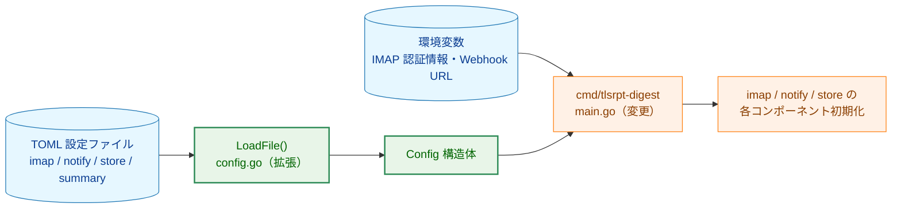
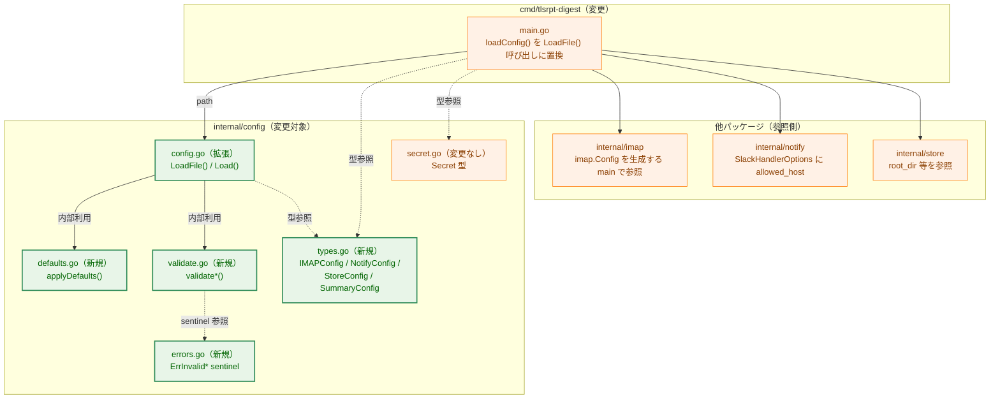
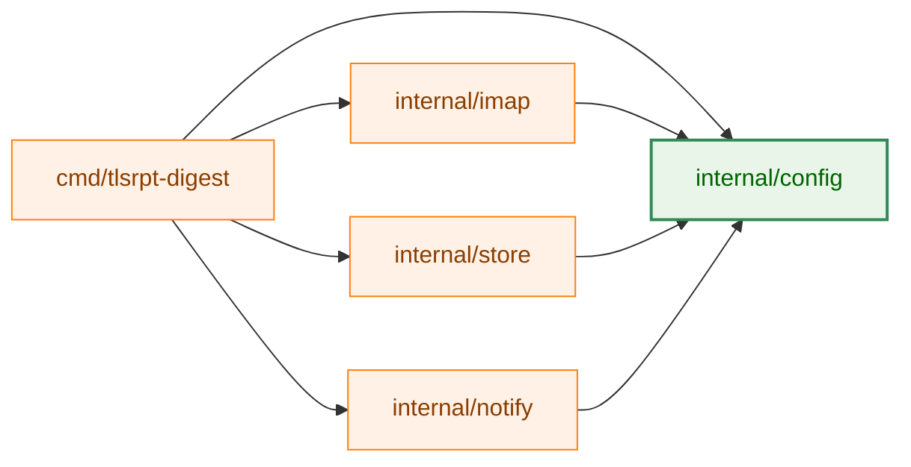
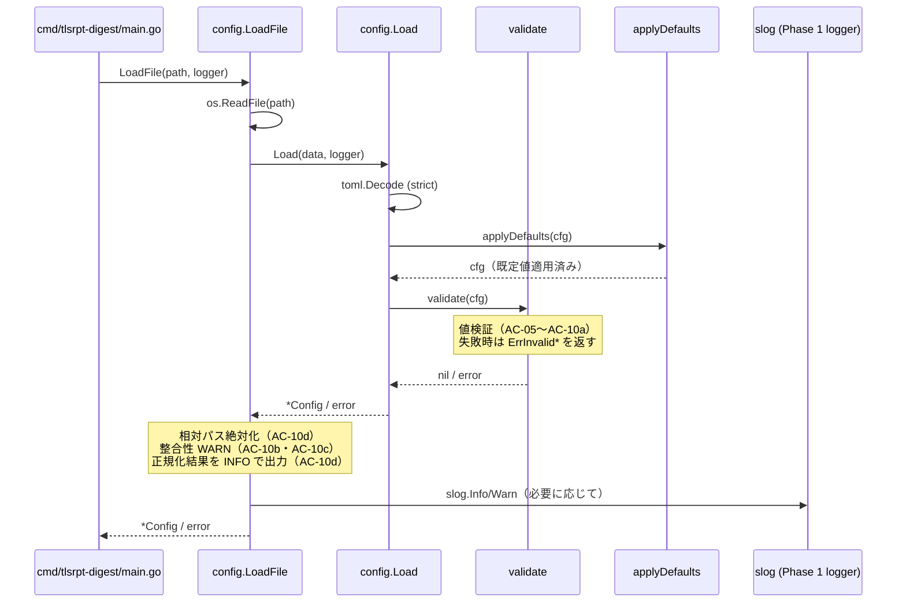
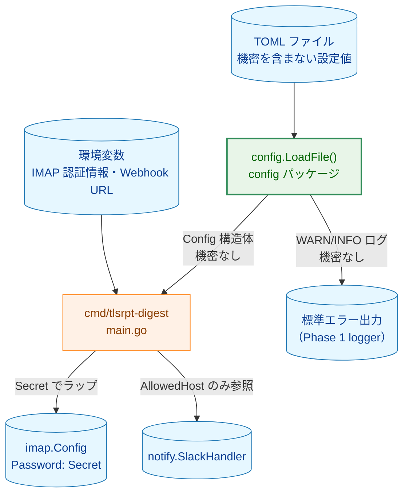
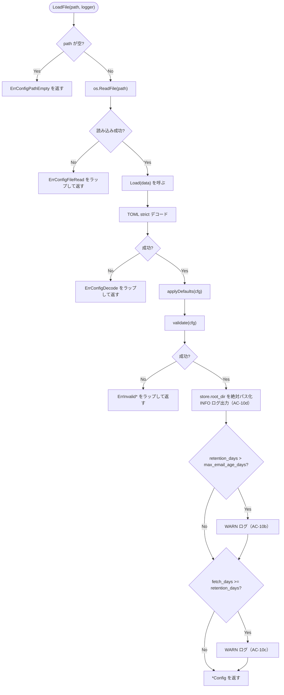

# アーキテクチャ設計書：設定ファイル読み込み（TOML）

## ドキュメントステータス

| 項目 | 内容 |
|---|---|
| ステータス | `draft` |
| 作成日 | 2026-05-21 |
| レビュー日 | - |
| レビュアー | - |
| コメント | - |

---

## 1. 設計の全体像

### 1.1 設計原則

1. **責務の集約**: TOML のデコード・既定値の適用・値検証・整合性チェックは `internal/config` パッケージに集約する。呼び出し元（`cmd/tlsrpt-digest`）は `config.LoadFile()` を 1 回呼ぶだけで、有効な `*Config` を得られる。
2. **機密情報を TOML に置かない**: IMAP のユーザ名・パスワード、Slack Webhook URL は TOML に置かず、環境変数経由で取得する（AC-07・AC-08）。`internal/config` はこれらの値を `*Config` に格納しない（環境変数の読み出しは `cmd/tlsrpt-digest` の責務）。
3. **既知キーのみ許容（strict decode）**: `DisallowUnknownFields` を有効化し、TOML の typo や旧形式キーを早期に検出する（AC-04）。既存の `config.Load` の方針を踏襲する。
4. **TOML パースエラーに機密情報を含めない**: TOML の `Decode` エラーは設定ファイルそのものの文法情報のみで、TOML 本文は機密を含まない前提とする。エラー文には値そのものを露出しないよう、ラップは `fmt.Errorf("...: %w", err)` の形でラベルのみを付加する。
5. **整合性 WARN はエラーにしない**: 互いに矛盾する保持期間設定（AC-10b・AC-10c）は WARN ログのみで継続する。これは「ユーザが意図的にこの組み合わせを選んだ場合に動作を停止させない」ためであり、設定値そのものは個別バリデーション（AC-10a 等）で十分検査されているという前提に基づく。
6. **CWD 依存の排除**: `store.root_dir` の相対パスは `config.LoadFile()` 内で絶対パスへ正規化する（AC-10d）。systemd timer 経由の起動など CWD が `/` になる環境で意図しない参照先を持たないようにするための恒久対応。
7. **エラーは sentinel + ラップ**: バリデーション失敗時には `errors.Is` で識別可能な sentinel エラーをラップして返す（CLAUDE.md「Error Testing」方針）。

### 1.2 概念モデル

矢印 A → B は「A を入力として B を生成する」を表す。



**凡例**

| 色 | クラス | 意味 |
|---|---|---|
| 青 | data | 設定入力（TOML ファイル・環境変数） |
| オレンジ | process | 変更なし、または既存責務を維持するコンポーネント |
| 緑 | enhanced | 本タスクで変更・拡張するファイル |

---

## 2. システム構成

### 2.1 全体アーキテクチャ

矢印 A → B は「A が B を呼び出す」を表す。点線矢印は「型定義の参照」を表す。



**凡例**

| 色 | クラス | 意味 |
|---|---|---|
| オレンジ | process | 変更なしの既存コンポーネント |
| 緑 | enhanced | 本タスクで新規追加または変更するファイル |

### 2.2 パッケージ依存関係

矢印 A → B は「A が B をインポートする」を表す。



**設計上の注意**: 既存パッケージ（`imap`・`notify`・`store`）は `internal/config` の `Secret` 型を参照するのみであり、本タスクで追加する `IMAPConfig`・`StoreConfig` 等の構造体には依存しない。これらの構造体は TOML 表現として閉じており、各パッケージは独自の設定型（例：`imap.Config`）を引き続き利用する。型同士の変換は `cmd/tlsrpt-digest` が担う。

**凡例**

| 色 | クラス | 意味 |
|---|---|---|
| オレンジ | process | 変更なしのパッケージ |
| 緑 | enhanced | 変更対象パッケージ |

### 2.3 データフロー（シーケンス図）

矢印 A → B は「A が B を呼び出す」、破線矢印 A -->> B は「B が A に結果を返す」を表す。



**凡例**

| 記法 | 意味 |
|---|---|
| `->>` | 同期呼び出し |
| `-->>` | 戻り値の返却 |
| `note over` | 実装方針上の補足条件 |

---

## 3. コンポーネント設計

### 3.1 TOML キー設計（仮称の確定）

要件文書（`01_requirements.md`）で「正式キー名は `02_architecture.md` で確定」とされた仮称を本書で確定する。

| 機能領域 | TOML キー | Go フィールド | 既定値 | 関連 AC |
|---|---|---|---|---|
| IMAP | `imap.host` | `IMAPConfig.Host` | （必須） | AC-01・AC-05 |
| IMAP | `imap.port` | `IMAPConfig.Port` | （必須） | AC-01・AC-06 |
| IMAP | `imap.mailbox` | `IMAPConfig.Mailbox` | `"INBOX"` | AC-11 |
| IMAP | `imap.fetch_days` | `IMAPConfig.FetchDays` | `14` | AC-09・AC-12 |
| IMAP | `imap.tls_ca_cert` | `IMAPConfig.TLSCACert` | `""`（OS バンドル） | AC-10・AC-14 |
| IMAP | `imap.max_message_bytes` | `IMAPConfig.MaxMessageBytes` | `0`（無制限） | 0010・0070 連携 |
| Notify | `notify.slack.allowed_host` | `NotifyConfig.Slack.AllowedHost` | `""`（Slack 無効化） | AC-08 |
| Store | `store.root_dir` | `StoreConfig.RootDir` | `"./store"` | AC-10d・AC-13 |
| Store | `store.retention_days` | `StoreConfig.RetentionDays` | `30` | AC-10a・AC-10b・AC-10c・AC-16 |
| Store | `store.max_email_age_days` | `StoreConfig.MaxEmailAgeDays` | `30` | AC-10a・AC-10b・AC-17 |
| Summary | `summary.window_days` | `SummaryConfig.WindowDays` | `7` | AC-10a・AC-15 |

これらの正式キー名は、後続タスク（0070 など）の文書中で「仮称」と記載されている箇所を置換する基準となる。

### 3.2 型定義（高レベル）

`internal/config/types.go`（新規）に以下の構造体を定義する。フィールドの順序は TOML キーと一致させ、TOML タグで明示する。

```go
// Config は TOML 設定ファイル全体のルート構造。
// 機密情報（IMAP 認証情報・Webhook URL）はここに含めない。
type Config struct {
    IMAP    IMAPConfig    `toml:"imap"`
    Notify  NotifyConfig  `toml:"notify"`
    Store   StoreConfig   `toml:"store"`
    Summary SummaryConfig `toml:"summary"`
}

// IMAPConfig は IMAP 接続に関する設定（認証情報を除く）。
type IMAPConfig struct {
    Host            string `toml:"host"`
    Port            int    `toml:"port"`
    Mailbox         string `toml:"mailbox"`
    FetchDays       int    `toml:"fetch_days"`
    TLSCACert       string `toml:"tls_ca_cert"`
    MaxMessageBytes int64  `toml:"max_message_bytes"`
}

// NotifyConfig は通知関連の設定。Webhook URL は環境変数で管理するため含めない。
type NotifyConfig struct {
    Slack NotifySlackConfig `toml:"slack"`
}

// NotifySlackConfig は既存定義を踏襲する（AllowedHost のみ）。
type NotifySlackConfig struct {
    AllowedHost string `toml:"allowed_host"`
}

// StoreConfig はストアの保存先と保持期間。
type StoreConfig struct {
    RootDir         string `toml:"root_dir"`
    RetentionDays   int    `toml:"retention_days"`
    MaxEmailAgeDays int    `toml:"max_email_age_days"`
}

// SummaryConfig は定期サマリの集計期間。
type SummaryConfig struct {
    WindowDays int `toml:"window_days"`
}
```

`Secret` 型（`internal/config/secret.go`）は既存のまま流用し、IMAP のパスワード等は `cmd/tlsrpt-digest` 側で環境変数から取得して `config.Secret` でラップしたうえで `imap.Config` に渡す。本タスクでは `Secret` 型の API は変更しない。

### 3.3 主要関数の高レベルインターフェース

```go
// LoadFile は path から TOML を読み込み、既定値適用と検証を経た Config を返す。
// path が空文字列の場合は ErrConfigPathEmpty を返す。
// 相対パス store.root_dir は絶対パスへ正規化される。
// 整合性に関する WARN ログおよび root_dir 正規化結果の INFO ログは logger 経由で出力する。
func LoadFile(path string, logger *slog.Logger) (*Config, error)

// Load は TOML バイト列をデコードし、既定値適用と検証を行う。
// 主にテストおよび非ファイル入力からの読み込みに利用する。
// 整合性 WARN や絶対化処理は呼び出し元（LoadFile）の責務とする。
func Load(data []byte) (*Config, error)
```

`LoadFile` を新規導入する理由は、(a) 相対パスを正規化するためにファイルの所在地ではなく呼び出し元の CWD を基準にする必要があり、(b) WARN/INFO ログのために `*slog.Logger` を引数で受け取る必要があるためである。一方 `Load(data []byte)` はテスト容易性のために維持する（既存テストも引き続き利用できる）。

### 3.4 コンポーネント責務

| ファイル | 変更種別 | 責務 |
|---|---|---|
| `internal/config/config.go` | **変更** | 既存の `Config`・`Load` を拡張。`Load` は TOML strict デコード・既定値適用・検証を順に呼び出す（AC-01〜AC-04 全般）|
| `internal/config/types.go` | **新規** | `IMAPConfig`・`NotifyConfig`・`StoreConfig`・`SummaryConfig` 等の型定義（§3.2） |
| `internal/config/defaults.go` | **新規** | 既定値適用ロジック `applyDefaults(*Config)`（AC-11〜AC-17） |
| `internal/config/validate.go` | **新規** | 値検証ロジック（AC-05・AC-06・AC-08・AC-09・AC-10・AC-10a）。`AllowedHost` 検証ロジックは既存の `validateAllowedHost` を本ファイルへ移動 |
| `internal/config/load_file.go` | **新規** | `LoadFile(path string, logger *slog.Logger) (*Config, error)`。ファイル読み込み・`Load` 呼び出し・相対パス正規化（AC-10d）・整合性 WARN（AC-10b・AC-10c） |
| `internal/config/errors.go` | **新規** | sentinel エラー（§4） |
| `internal/config/secret.go` | 変更なし | 既存の `Secret` 型を流用 |
| `internal/config/*_test.go` | **変更/新規** | 既存テストの拡張および新規 AC に対応するテスト追加（§6） |
| `cmd/tlsrpt-digest/main.go` | **変更** | `loadConfig` の呼び出し先を `config.LoadFile` に変更。IMAP の認証情報を環境変数（`TLSRPT_IMAP_USERNAME` / `TLSRPT_IMAP_PASSWORD` 想定）から取得し、`imap.Config` を構築する補助関数を追加 |

`cmd/tlsrpt-digest/main.go` の env 変数名（`TLSRPT_IMAP_USERNAME` / `TLSRPT_IMAP_PASSWORD`）は本書での提案である。正式命名は実装時に再確認する余地を残すが、既存の `TLSRPT_SLACK_WEBHOOK_URL_SUCCESS` / `TLSRPT_SLACK_WEBHOOK_URL_ERROR` と同じ `TLSRPT_*` プレフィックス規約に揃える。

---

## 4. エラーハンドリング設計

### 4.1 エラー型方針

- すべての検証失敗は `errors.Is` で識別可能な sentinel エラーを基底とし、コンテキスト情報（フィールド名・値・パス等）は `fmt.Errorf("...: %w", err)` で付与する。
- TOML パースエラー（`toml.Decode` の戻り値）はラップして `ErrConfigDecode` で包む。テストは `errors.Is(err, config.ErrConfigDecode)` を使用する。
- 既存の `ErrInvalidAllowedHost` は `errors.go` に集約し、本タスクの他 sentinel と並べる（互換性は維持）。

### 4.2 sentinel 一覧

```go
// 設定ファイル全般
var ErrConfigPathEmpty = errors.New("config: path is empty")
var ErrConfigFileRead  = errors.New("config: cannot read file")
var ErrConfigDecode    = errors.New("config: cannot decode TOML")

// 個別フィールド検証
var ErrInvalidIMAPHost        = errors.New("config: imap.host is empty")
var ErrInvalidIMAPPort        = errors.New("config: imap.port out of range (1-65535)")
var ErrInvalidFetchDays       = errors.New("config: imap.fetch_days must be >= 1")
var ErrInvalidWindowDays      = errors.New("config: summary.window_days must be >= 1")
var ErrInvalidRetentionDays   = errors.New("config: store.retention_days must be >= 1")
var ErrInvalidMaxEmailAgeDays = errors.New("config: store.max_email_age_days must be >= 1")
var ErrInvalidAllowedHost     = errors.New("config: notify.slack.allowed_host must be a plain hostname without scheme, port, or whitespace")
var ErrTLSCACertNotReadable   = errors.New("config: imap.tls_ca_cert cannot be read")
var ErrTLSCACertNotPEM        = errors.New("config: imap.tls_ca_cert is not a PEM-encoded certificate")
```

### 4.3 エラーメッセージ設計パターン

- フィールド名は TOML キー（例：`imap.fetch_days`）を採用し、Go フィールド名は使わない（ユーザが目視で TOML を修正できるようにするため）。
- TLS CA 証明書のパスはエラーメッセージに含めて構わない（パスそのものは機密情報ではない）。一方、TOML 本体や認証情報は含めない（§5）。
- ラップ例：`fmt.Errorf("config: imap.tls_ca_cert %q: %w", path, ErrTLSCACertNotReadable)`。

### 4.4 警告（WARN）の扱い

整合性に関する以下の条件はエラーにせず、WARN ログを出力して継続する。

| 条件 | 関連 AC | 警告内容 |
|---|---|---|
| `store.retention_days > store.max_email_age_days` | AC-10b | `.eml` がレポート JSON より先に削除され、`reprocess` の復元が一部不可能になる旨 |
| `imap.fetch_days >= store.retention_days` | AC-10c | GC で削除済みのレポートを再処理する可能性がある旨 |

これらは `LoadFile` 内で値検証成功後に評価し、`slog.Warn` で 1 行ずつ出力する。

---

## 5. セキュリティ考慮事項

### 5.1 機密情報の流入経路と防御

本タスクは通知を直接送信しないが、設定読み込み時に機密情報が誤って漏出する経路を整理する。`notification_security.md` に定める「機密情報を含む可能性のあるパス」を防ぐための設計を以下に示す。

| パス | 該当箇所 | 本タスクでの対策 |
|---|---|---|
| エラーメッセージへの機密値の埋め込み | TOML パースエラー | `toml.Decode` の戻り値はラップのみ。エラー本文に TOML 本文をダンプしない（AC-04 関連） |
| `fmt.Sprintf("%v", cfg)` 等での Config 全体出力 | `Config` 構造体 | `Config` 本体には認証情報を持たない。env 由来の認証情報は `Secret` 型でラップして `imap.Config` に渡す（`cmd/tlsrpt-digest`） |
| 通知メッセージへの設定値混入 | 本タスク範囲外 | `internal/notify` 側のガイドライン（原則 1・原則 3）で対応済 |
| デバッグログへの認証情報出力 | env から取得した認証情報 | `Secret` 型の `String()` / `LogValue()` が常に `[REDACTED]` を返す（既存実装） |

### 5.2 脅威モデル

矢印 A → B は「A から B へデータが流れる」を表す。



**凡例**

| 色 | クラス | 意味 |
|---|---|---|
| 青 | data | データ源・データシンク |
| オレンジ | process | 機密情報を取り扱うが Notifier には流さないコンポーネント |
| 緑 | enhanced | 本タスクで導入する設定読み込みコンポーネント |

### 5.3 設計方針との対応（notification_security.md）

本タスクは Notifier に直接書き込まないが、`Config` 構造体が Notifier 側に渡る可能性があるため以下を確認する。

| ガイドライン原則 | 本タスクでの適用 |
|---|---|
| 原則 1: 引数型による制約 | `Config` には認証情報を含まない。Slack 関連は `AllowedHost` のみで Webhook URL は含めない |
| 原則 3: 通知側のリダクションは無効化不可 | 本タスク範囲外（既存設計を維持） |
| `Secret` 型による保護 | env 由来の認証情報は `cmd/tlsrpt-digest` で `config.Secret` にラップして `imap.Config.Password` に格納（既存 `Secret` 型を流用） |

---

## 6. 処理フロー詳細

### 6.1 設定読み込みフロー全体

矢印 A → B は「A の処理完了後に B へ進む」を表す。菱形は分岐条件を表す。



**凡例**

| 記法 | 意味 |
|---|---|
| 角丸ノード `(["..."])` | 開始または終了点 |
| 矩形ノード `["..."]` | 処理ステップ |
| 菱形ノード `{"..."}` | 分岐条件 |
| ラベル付き矢印 `-->|"..."|` | 条件分岐先（Yes/No 等） |

### 6.2 既定値適用の順序

`applyDefaults` は値検証の前に実行する。これにより「未設定」と「明示的に 0 を指定」を区別せず、`0`／`""` のときに既定値を適用する単純なルールで処理する。

- 「明示的に 0 を指定」を許容しないという方針は、AC-10a が「0 以下はエラー」と定めていることと整合する（既定値で 1 以上に置き換えられた後に、AC-10a がそれ以外のケースを補足する）。
- 例外的に「明示的に `0` を許容する」項目は本タスク範囲では存在しない。`max_message_bytes` のみ「0 = 無制限」とし、既定値も `0` とする（既定値適用と検証の両方で 0 を許容する特殊扱い）。

### 6.3 TLS CA 証明書の検証フロー（AC-10）

`imap.tls_ca_cert` が空でない場合に限り、以下の 2 段階の確認を行う。

- **可読性確認**: 指定パスのファイルが読み出せること。失敗時は `ErrTLSCACertNotReadable` をラップして返す。
- **PEM 形式確認**: 読み出した内容が PEM エンコードされた `CERTIFICATE` ブロックとして解釈でき、その内容が `x509` パッケージで証明書としてパースできること。失敗時は `ErrTLSCACertNotPEM` をラップして返す。

実際の証明書チェーン構築・有効期限チェック・信頼ストアへの追加は `internal/imap` の TLS 接続時に行うため、本タスクの範囲はファイル可読性と PEM 形式の確認のみとする（早期失敗のためであり、TLS スタックでの完全な検証は別途実施される）。

### 6.4 相対パス正規化（AC-10d）

`store.root_dir` が相対パスの場合、`filepath.Abs` でカレントディレクトリ基準に絶対パスへ変換する。変換後の値を `cfg.Store.RootDir` に書き戻し、`slog.Info("config: store.root_dir resolved", "path", abs)` を出力する。すでに絶対パスであれば変換せず、INFO ログも出さない。

---

## 7. テスト戦略

### 7.1 単体テスト

`internal/config/*_test.go` に以下のテスト群を追加する。各テストは 1 つ以上の AC を検証する。

| テスト対象 | 観点 | 関連 AC |
|---|---|---|
| 有効な TOML | すべての設定値が正しく読み込まれる | AC-01 |
| 存在しないパス | `ErrConfigFileRead` を返す | AC-02 |
| TOML 文法エラー | `ErrConfigDecode` を返す | AC-03 |
| 未知のキー | strict デコードで失敗する | AC-04 |
| 空の `imap.host` | `ErrInvalidIMAPHost` を返す | AC-05 |
| 範囲外の `imap.port` | `ErrInvalidIMAPPort` を返す | AC-06 |
| `imap.password` 等が TOML にある | strict デコードで失敗する（AC-07 の間接検証）| AC-07 |
| `notify.slack.allowed_host` のホスト名検証 | 既存テストを移植・拡張 | AC-08 |
| `imap.fetch_days` の境界 | 0 以下でエラー | AC-09 |
| `imap.tls_ca_cert` 未設定 / 有効 PEM / 不正 PEM / 存在しないパス | エラー有無の切り分け | AC-10・AC-14 |
| `summary.window_days`・`store.retention_days`・`store.max_email_age_days` の 0 以下 | `ErrInvalid*Days` を返す | AC-10a |
| `retention_days > max_email_age_days` の組み合わせ | WARN ログのみで継続 | AC-10b |
| `fetch_days >= retention_days` の組み合わせ | WARN ログのみで継続 | AC-10c |
| `store.root_dir` に相対パスを指定 | 絶対化される / INFO ログが出る | AC-10d |
| `imap.mailbox` 未設定 | `"INBOX"` が適用される | AC-11 |
| `imap.fetch_days` 未設定 | `14` が適用される | AC-12 |
| `store.root_dir` 未設定 | `"./store"` が適用された後に絶対化される | AC-13 |
| `imap.tls_ca_cert` 未設定 | 空文字で、検証もスキップされる | AC-14 |
| `summary.window_days`・`store.retention_days`・`store.max_email_age_days` 未設定 | 各既定値（7・30・30）が適用される | AC-15・AC-16・AC-17 |

エラー型の検証はすべて `errors.Is(err, config.ErrInvalid*)` で行う（CLAUDE.md「Error Testing」方針）。WARN/INFO ログの検証は `testing/slogtest` あるいはテスト用 `*slog.Logger`（バッファ出力）で行う。

### 7.2 統合テスト

- `cmd/tlsrpt-digest/main_test.go`（既存）に、`-config` フラグで実 TOML を読み込んだ場合の挙動を検証するテストを追加する。
- IMAP 統合テスト（`internal/imap/client_integration_test.go`）の env 変数群は本タスクでは変更しない（テスト専用変数として独立）。

### 7.3 セキュリティテスト

- TOML 内に意図的に `password = "xxx"` のような未知キーを含むケースで、エラー本文に `"xxx"` が含まれないことを検証する。
- env 由来の認証情報を `imap.Config` 経由で扱うコードで `fmt.Sprintf("%+v", cfg)` を呼んだ際、`[REDACTED]` で置換されることを確認する（`internal/config/secret_test.go` 既存テストで担保済み）。

---

## 8. 実装優先順位

### フェーズ 1: 型定義とエラー定義

1. `types.go`・`errors.go` の新規追加（既存 `Config` を新構造に拡張）
2. 既存テストが引き続き通ることを確認（後方互換）

### フェーズ 2: 既定値・バリデーション

3. `defaults.go`・`validate.go` を新規追加し `Load(data)` を再構成
4. AC-01・AC-04〜AC-09 のテストを追加・通過

### フェーズ 3: ファイル読み込みと整合性チェック

5. `load_file.go` を追加し `LoadFile(path, logger)` を実装
6. AC-02・AC-03・AC-10〜AC-10d のテストを追加・通過

### フェーズ 4: 既定値の網羅

7. AC-11〜AC-17 の既定値テストを追加

### フェーズ 5: 呼び出し側統合

8. `cmd/tlsrpt-digest/main.go` の `loadConfig` を `LoadFile` ベースに置換
9. env 変数経由の IMAP 認証情報取得と `imap.Config` 組み立てを追加
10. 既存の `main_test.go` および `make test`・`make lint` をすべて通過

---

## 9. 将来の拡張性

現在スコープ外だが、将来対応が想定される拡張のための設計上の考慮を述べる。

- **環境変数による設定上書き**: 現状は env から取得するのは認証情報のみ。汎用的な「TOML キーを env で上書き」を将来追加する場合は、`Load` 後に env を反映する `applyEnvOverrides(*Config)` を defaults と validate の間に挿入できる構造とする。
- **設定ファイルのホットリロード**: `LoadFile` を冪等に保ち、副作用を持たせない（グローバル状態に書き込まない）ことで将来のホットリロード対応の余地を残す。
- **設定スキーマのバージョン管理**: 現状は単一スキーマだが、TOML 側に `schema_version` キーを追加する場合は `Config` の最上位に `SchemaVersion int` を追加し、`Load` 内で互換性チェックを行う構造とする。strict デコードを維持しつつ、`schema_version` だけは既知の値として許容する。
- **設定ファイル分割**: `imap.toml`・`notify.toml` のように分割したいケースが出た場合、`LoadFiles(paths []string, logger *slog.Logger)` を追加し、後勝ちでマージする方針を取れる。本タスクではこの API は提供しない。
