# アーキテクチャ設計書：エントリポイントとサブコマンド

## ドキュメントステータス

| 項目 | 内容 |
|---|---|
| ステータス | `draft` |
| 作成日 | 2026-05-22 |
| レビュー日 | - |
| レビュアー | - |
| コメント | - |

---

## 1. 設計概要

### 1.0 用語

| 用語 | 意味 |
|---|---|
| 外部スケジューラ | systemd timer または cron |
| 書き込み系サブコマンド | `fetch` / `gc` / `recover` / `reprocess` の 4 種。ストアを `OpenReadWrite` で開きプロセス排他ロックを取得する |
| 読み取り系サブコマンド | `summary`。ストアを `OpenReadOnly` で開き、プロセス排他ロックは取得しない |
| SubcommandRunner | 各サブコマンドの実装が満たす Go インターフェース。`internal/notify.SlackHandler` との名称衝突を避けるため `Handler` ではなくこの名称を採用する |
| fail closed | 完全性が保証できない場合に処理を **開始しない**こと（途中での中断ではなく事前停止） |
| RecoveryRequired 状態 | UIDVALIDITY 不一致検出時に sentinel へ記録される状態 |
| SaveRecoveryRequired | `internal/store` の API 名。RecoveryRequired 状態を sentinel へ永続化する操作 |
| commit（リセット操作） | `ResetForRecovery` 内部の state machine 用語。新しい空ストアへの書き込みと sentinel の `uid_validity` 更新が完了し、操作が取り消し不能になった時点を指す。commit **前**のクラッシュは staging に旧データが残るため再実行で復旧できる。commit **後**のクラッシュは新しい空ストアがすでに有効であり、残った staging の後片付けだけが未完了な状態となる |

### 1.1 設計原則

- **One-shot 実行**: `cmd/tlsrpt-digest` は起動・処理・終了の 1 サイクル実行のみを担う。ポーリング・タイマー・デーモン管理は外部スケジューラへ委譲する。
- **サブコマンドによる関心の分離**: 1 つのバイナリで `fetch` / `summary` / `reprocess` / `gc` / `recover` の 5 サブコマンドを提供する。各サブコマンドは独立の処理フローを持ち、共通の初期化シーケンスを再利用する。
- **fail closed の徹底**: 完全性が保証できない状態（UIDVALIDITY 変化検出後、別プロセスのロック保持中）では処理を**開始しない**。誤った状態のままサマリ送信や GC が走るより、停止して人手で復旧する方が安全である。
- **At-least-once 通知**: Slack 通知は重複を許容してでも欠落を許さない。`Flush()` の成功確認を SEEN フラグ付与より前に必ず実行する。重複通知の識別を可能にするため、すべての Slack メッセージへ `run_id` を含める（[3.6 RunID と相関 ID](#36-runid-と相関-id) 参照）。
- **既存パッケージの責務尊重**: `internal/{config,imap,tlsrpt,mailparse,notify,store}` の責務を再実装しない。`cmd` レイヤーは薄いオーケストレーションに留める。
- **書き込み系サブコマンドの直列化**: ストアディレクトリに対する書き込みは同時 1 プロセスに限定する。`summary` はロックを必要としないため `fetch` 実行中でも並走できるが、書き込み系どうしの並走（`fetch` 実行中の `gc` 再発火等）はロックで確実に防ぐ。
- **graceful shutdown は対象外**: One-shot 実行であり、要件定義書の対象外に明記されているため、本タスクでは SIGTERM / SIGINT の遅延処理や Flush 専用 grace period を実装しない。At-least-once 保証は通常フローの `Flush()` 成功確認 → SEEN 付与順序で担保する。
- **タイムアウト責務の分離**: プロセス全体の停止期限は外部スケジューラ（systemd timer / cron 等）の責務とする。Slack HTTP POST のリトライ・タイムアウトは既存 `internal/notify` に委ね、本タスクで新しい全体 timeout 制御は追加しない。

### 1.2 概念モデル

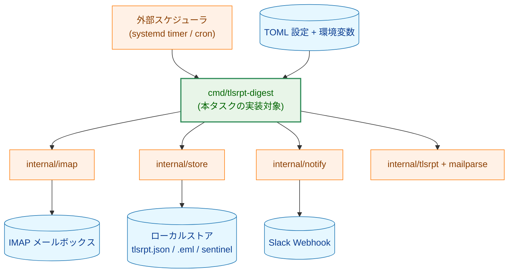

矢印 A → B は A から B への依存、呼び出し、またはデータ入出力を表す。

**凡例（Legend）**

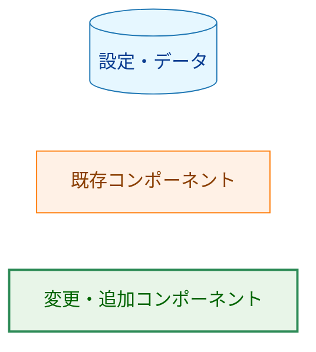

---

## 2. システム構成

### 2.1 パッケージ配置と依存関係

**図 A: `cmd/` 内部構造**（ファイル間の呼び出し・共有関係）

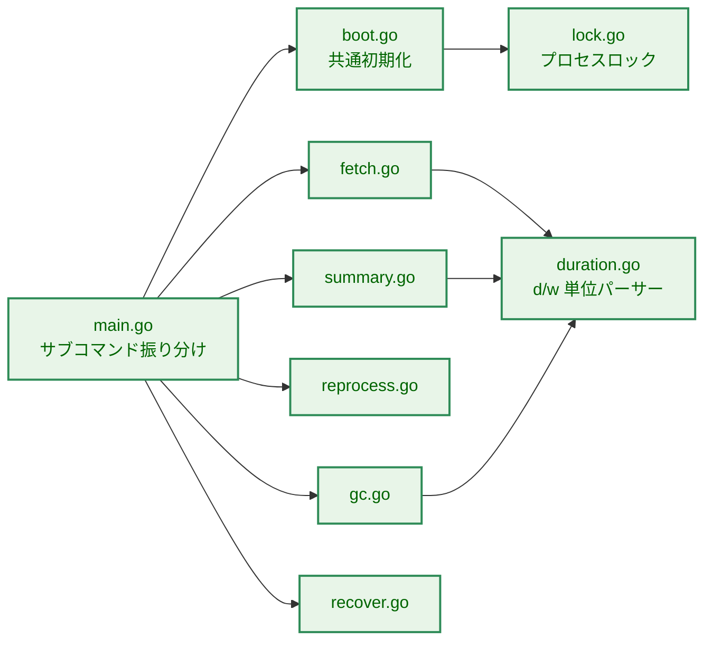

矢印 A → B は Go パッケージレベルの import 関係を表す（サブコマンドは `main.go` から起動され、`boot.go` が共通初期化を担う）。`duration.go` は `fetch` / `summary` / `gc` の 3 サブコマンドから共有される。

**凡例（Legend）**

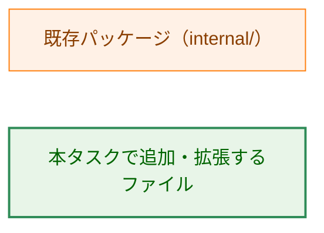

**図 B: `internal/` パッケージへの依存（依存マトリクス）**

`✓` は Go import あり、`*` は fetch 専用（他の書き込み系は不要）。

| ファイル | `config` | `imap` | `tlsrpt` | `mailparse` | `notify` | `store` |
|---|:---:|:---:|:---:|:---:|:---:|:---:|
| `boot.go` | ✓ | | | | ✓ | ✓ |
| `fetch.go` | | ✓\* | ✓ | ✓ | ✓ | ✓ |
| `summary.go` | | | | | ✓ | ✓ |
| `reprocess.go` | | | ✓ | ✓ | ✓ | ✓ |
| `gc.go` | | | | | | ✓ |
| `recover.go` | | | | | | ✓ |

- `imap` は `fetch` のみが使用（IMAP サーバへの直接接続）。
- `tlsrpt` / `mailparse` は `fetch` と `reprocess` が使用（`.json.gz` 添付のパース）。
- `notify` / `store` は書き込み系全サブコマンドが使用。
- `config` は `boot.go` のみが使用（設定読込責務を `boot.go` に集約）。

### 2.2 共通初期化シーケンス

書き込み系サブコマンド（`fetch` / `gc` / `recover` / `reprocess`）は同じ初期化シーケンスを共有する。`summary` のみロック取得を省略し、ストアを read-only モードで開く。各ステップ番号は [3.4](#34-共通初期化シーケンス書き込み系の手順) のテーブルと対応する。

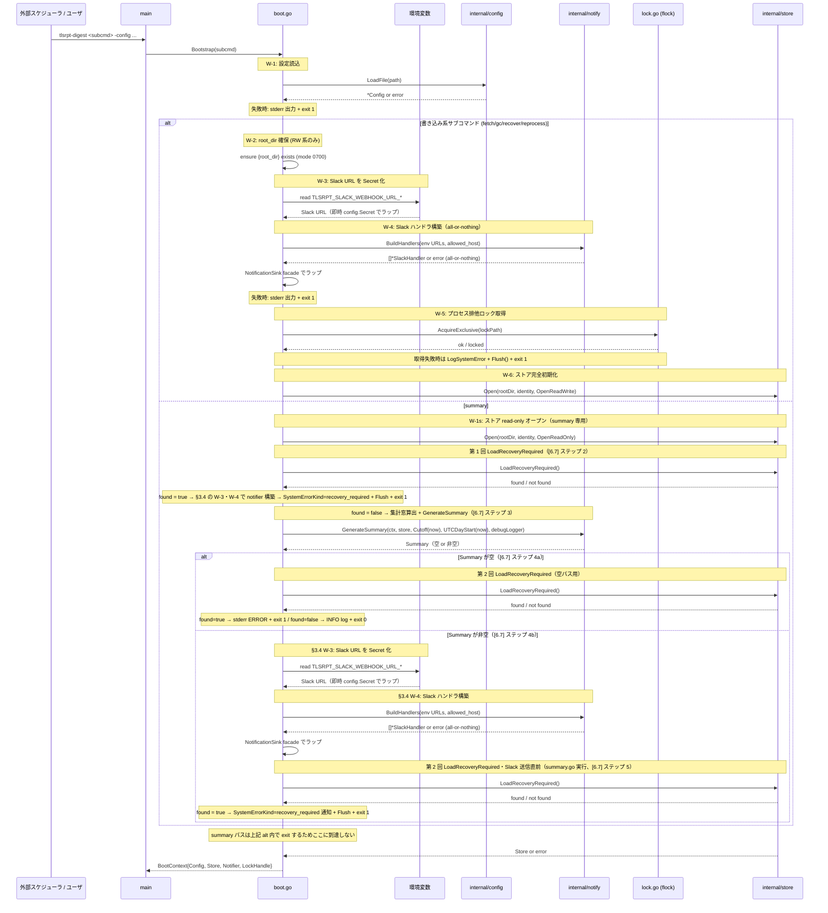

矢印 A → B はリクエスト、A -->> B は戻り値を表す。

**図末尾 2 行の補足**
- `S-->>B: Store or error` は書き込み系サブコマンドの `Open(OpenReadWrite)` 戻り値を示す（alt ブロック外）。`summary` では else ブランチ内で `Open(OpenReadOnly)` が完了しており、この行は summary には適用されない。
- `B-->>M: BootContext{…}` は書き込み系の典型形。`summary` では `Notifier` は空集計時に `nil`、`LockHandle` は常に `nil` となる。

**IMAP 認証情報（fetch 専用）**
- `fetch` 以外では不要なため、この共通初期化では取得しない。
- `fetch` は recovery-required 確認後、IMAP 接続を作る直前に `TLSRPT_IMAP_USERNAME` / `TLSRPT_IMAP_PASSWORD` を読み、即座に `config.Secret` でラップする。

**summary ブランチの所有権**
- `GenerateSummary`・`LoadRecoveryRequired` 2 回目（空集計パスはステップ 4a、非空パスはステップ 5）・非空パスの notifier 構築はすべて `boot.go` ではなく `summary.go` が実行する。シーケンス図では `summary` ブランチ全体の流れを示すために `boot.go` 名義で図示している（[6.7](#67-summary-の空ストア時シーケンス) 参照）。

**凡例（Legend）**

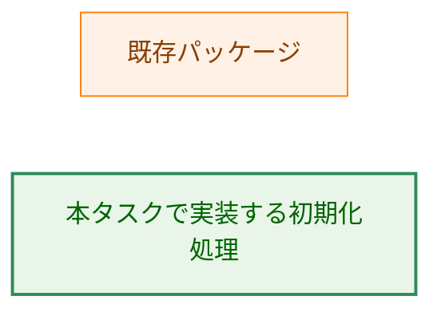

### 2.3 `fetch` 処理フロー（高レベル）

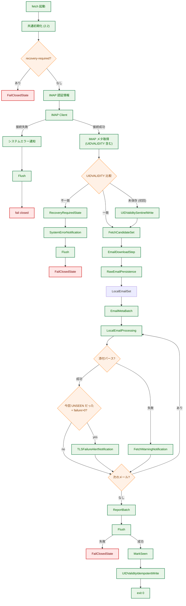

矢印 A → B は処理の遷移を表す。

**IMAP 接続**
- recovery-required がないことを確認した後に接続を作成する。接続または認証に失敗した場合は `NotificationSink.LogSystemError` と `Flush()` を試行して exit 1 とする。
- 成功した IMAP client は `fetch` の処理終了時に `Close()` する。

**図ノードの補足**
- `アラート通知` は `NotificationSink.LogAlert`、`WARN 通知` は `NotificationSink.LogWarning` 呼び出しを指す。実際の Slack POST は `Flush` ノードで一括実行される。
- `AlertCheck` の「今回 UNSEEN だった」は IMAP メタ取得時点での SEEN フラグが UNSEEN であったことを指す。SEEN で再ダウンロードされたメール（ローカル `.eml` 消失ケース）はアラート対象外となる。
- `LocalEmailSet` はローカルに `.eml` が存在するメールの UID 集合であり、`EmailMetaBatch` で一括登録される。
- `EmailMeta 一括保存` と `Report 一括保存` は全対象メールの集合に対してそれぞれ 1 回ずつ呼ぶ（[6.6](#66-saveemailmetas--savereports-の呼び出し順序) で根拠を説明）。

**処理順序と at-least-once 保証**
- 欠損 `.eml` の保存はパースより前に行い、既にローカルに存在する `.eml` は再保存せず処理対象集合へ含める。
- パース失敗メールも `Flush()` 成功後の `MarkSeen` 付与対象に含まれる（`MarkSeen` は当該 `fetch` 実行で処理対象となった全メールに一括適用される）。

**凡例（Legend）**

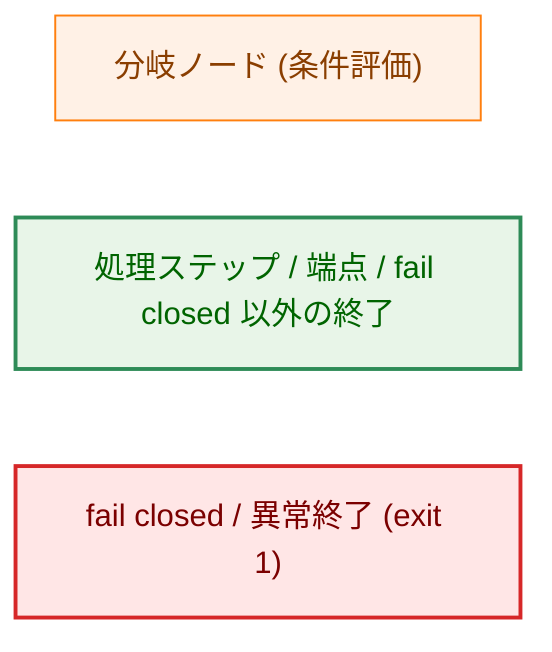

---

## 3. コンポーネント設計

### 3.1 主要型・インターフェース定義

以下はエントリポイント内部で導入する型と、本タスクで拡張する `internal/notify` / `internal/store` の公開仕様の断片を示す。既存型の全体は再掲しない。

`Duration` 型と関連関数の設計判断：

- **独自型の理由**: `d` / `w` 単位を「整数日数」として正規化し、CLI 入力制約（1 日以上・日/週単位のみ）を 1 か所に閉じ込めるため。Go 標準の `time.Duration` では `d`/`w` 単位をネイティブに扱えない。
- **`Cutoff(now)` の動作**: 現在時刻を UTC 日付単位で切り捨ててから指定日数を遡って返す。これがすべての duration フラグのカットオフ（開始側）となる（AC-07c）。
- **`UTCDayStart(now)` の動作**: `summary` 集計窓の終端として使用する「今日の 00:00:00 UTC」を返す（AC-07d）。
- **半開区間 `[start, end)`**: `end` 自体は含まない。開始・終端が両方 UTC 暦日境界に揃うため、週次実行での重複・欠落が生じない。

```go
// SubcommandName は受け付けるサブコマンドの識別子。
type SubcommandName string

// BootContext は共通初期化が成功した際に各サブコマンドへ渡す集約構造体。
// 所有権はサブコマンド側に移譲され、ハンドラ完了時にリソースが解放される。
type BootContext struct {
    Config     *config.Config
    Store      store.Store
    Notifier   NotificationSink
    LockHandle LockHandle
    Subcommand SubcommandName
    RunID      string
}

// IMAPCredentials は環境変数 TLSRPT_IMAP_USERNAME / TLSRPT_IMAP_PASSWORD を
// fetch の IMAP 接続直前に取得し Secret 化したもの。生 string を関数境界外には漏らさない。
type IMAPCredentials struct {
    Username config.Secret
    Password config.Secret
}

// LockHandle はプロセスロックの保持を表す不透明ハンドル。
// プロセス終了時に OS が advisory lock を自動解放するため明示クローズは不要だが、
// テスト容易性および明示的なロック解放のため Close() を提供する。
type LockHandle interface {
    Close() error
}

// NotificationSink は cmd レイヤーが通知に使える操作を型で制限する facade。
// 内部に SlackHandler を保持しても、サブコマンドへ slog.Handler として公開しない。
type NotificationSink interface {
    LogAlert(ctx context.Context, alert notify.Alert) error
    LogWarning(ctx context.Context, warning notify.Warning) error
    LogSystemError(ctx context.Context, err notify.SystemError) error
    LogSummary(ctx context.Context, summary notify.Summary) error
    Flush(ctx context.Context) error
    IsDryRun() bool
}

// notify.WarningKind は TLS failure alert ではない fetch WARN の分類。
// 許容値は size_mismatch と parse_failure のみ。
type WarningKind string

// notify.Warning は Slack へ送ってよい公開情報だけを持つ WARN payload。
// Error 文字列、ローカルファイルパス、生メール本文、認証情報は含めない。
type Warning struct {
    Kind        WarningKind
    UID         uint32
    UIDValidity uint32
    MessageID   string
}

// notify.SystemErrorKind は Slack へ送るシステムエラーの公開分類。
// 許容値は lock_held, store_identity_mismatch, store_permission,
// store_corruption, imap_credentials_missing, imap_connect_failed,
// imap_auth_failed, uidvalidity_changed, recovery_required,
// reset_incomplete, notification_flush_failed のみ。
type SystemErrorKind string

// notify.SystemError は Slack へ送ってよい公開情報だけを持つ ERROR payload。
// raw error 文字列、ローカルファイルパス、生サーバ応答、認証情報は含めない。
type SystemError struct {
    Kind      SystemErrorKind
    Component string
    Mailbox   string
}

// store.Store は discard-old 復旧の公開仕様として
// ResetForRecovery を直接持つ。recover は type assertion せず Store 経由で呼ぶ。
type Store interface {
    ResetForRecovery(currUIDValidity uint32) error
}

// Duration は d / w 単位を許容するカスタム時間表現。
// パース成功時は必ず 1 日以上の値を保持する（[3.5](#35-サブコマンド別フラグ仕様) AC-07b）。
type Duration struct {
    Days int // 内部表現は日数。週指定は ×7 で正規化する。
}

// Cutoff は now を UTC 日付単位で切り捨てた上で Days 日を遡ったカットオフ日時を返す（AC-07c）。
// 各サブコマンドはこのメソッドを使ってカットオフ（開始側）を統一算出する。
func (d Duration) Cutoff(now time.Time) time.Time

// UTCDayStart は now を UTC 日付単位で切り捨てた日時（今日の 00:00:00 UTC）を返す（AC-07d）。
// summary サブコマンドが集計窓の終端を算出するために使用する。
// Days フィールドに依存しないため Duration のメソッドではなくパッケージレベル関数とする。
func UTCDayStart(now time.Time) time.Time

// SubcommandRunner は各サブコマンドが満たすインターフェース。
// internal/notify.SlackHandler との名称衝突を避け Handler ではなくこの名称とする。
type SubcommandRunner interface {
    Run(ctx context.Context, boot *BootContext) (exitCode int, err error)
}
```

### 3.2 コンポーネントの責務

| コンポーネント | 責務 | 変更種別 |
|---|---|---|
| `cmd/tlsrpt-digest/main.go` | サブコマンドの振り分け、サブコマンドごとの `FlagSet` による引数解釈、終了コード集約、`slog` の Phase 1 セットアップ。既存の `loadConfig` / `buildIMAPConfig` / `setupNotifyHandlers` は `boot.go` へ移管する。 | 変更あり |
| `cmd/tlsrpt-digest/main_test.go` | 既存エントリポイントテストを新サブコマンド振り分け、usage、exit 2 方針へ更新する。 | 変更あり |
| `cmd/tlsrpt-digest/boot.go` | 共通初期化（設定読込・環境変数取得＋`config.Secret` ラップ・`{root_dir}` 確保・Slack ハンドラ構築・通知 facade 化・プロセスロック取得・ストアオープン）。`summary` は空ストア時に Slack 環境変数へ依存しないよう notifier を遅延構築する。`BootContext` の生成と返却。 | 新規追加 |
| `cmd/tlsrpt-digest/lock.go` | OS 標準の advisory file lock（POSIX 環境では `flock(2)` 相当）に基づくプロセス排他ロックの取得・保持・テスト用 `Close`。 | 新規追加 |
| `cmd/tlsrpt-digest/duration.go` | `d` / `w` 単位の `Duration` 型パース、バリデーション（1 日以上）、日数への正規化。`Cutoff(now time.Time) time.Time` メソッドで開始カットオフ（AC-07c）、`UTCDayStart(now time.Time) time.Time` パッケージ関数で集計窓終端（AC-07d）を統一提供する。 | 新規追加 |
| `cmd/tlsrpt-digest/fetch.go` | F-003: メタ取得・UIDVALIDITY 検証・選定・ダウンロード・パース・`NotificationSink.LogAlert` / `LogWarning` バッファリング・`SaveEmail`/`SaveEmailMetas`/`SaveReports`・`Flush()`・SEEN 付与。 | 新規追加 |
| `cmd/tlsrpt-digest/summary.go` | F-005: 期間を解決し（`start = Duration.Cutoff(now)`、`end = UTCDayStart(now)`）、recovery-required を確認し、既存 `notify.GenerateSummary(ctx, store, start, end, debugLogger)` を呼んで `NotificationSink.LogSummary` 経由で Slack へ送信する。集計ロジックは再実装しない。 | 新規追加 |
| `cmd/tlsrpt-digest/reprocess.go` | F-004: 保存済み `.eml` の再パースとストア再構築。`--notify` 指定時のみ `NotificationSink.LogAlert` を呼ぶ。 | 新規追加 |
| `cmd/tlsrpt-digest/gc.go` | F-006: `Duration.Cutoff(now)` で AC-07c に従ったカットオフ日時を算出し、`DeleteReportsBefore` / `DeleteEmailsBefore` を呼び出す。削除件数の INFO ログ出力。 | 新規追加 |
| `cmd/tlsrpt-digest/recover.go` | F-007: UIDVALIDITY 変化からの手動復旧。実行前にオペレータ向け情報（recovery-required 内容・復旧モード・データパス）を stdout に表示する。`keep-old` は `ApplyRecovery`、`discard-old --yes` は `internal/store` の破棄復旧 API を呼ぶ。 | 新規追加 |
| `cmd/tlsrpt-digest/duration_test.go` | `d` / `w` パーサーと日数正規化の単体テスト。 | 新規追加 |
| `cmd/tlsrpt-digest/lock_test.go` | non-blocking ロック取得、`Close()` によるテスト内解放の単体テスト。 | 新規追加 |
| `cmd/tlsrpt-digest/boot_test.go` | 共通初期化、Secret 化、通知 facade 化、ロック取得失敗、ストアオープン失敗分類の単体テスト。 | 新規追加 |
| `cmd/tlsrpt-digest/fetch_test.go` | UIDVALIDITY、`.eml` 保存順序、at-least-once、SEEN 付与順序の単体テスト。 | 新規追加 |
| `cmd/tlsrpt-digest/summary_test.go` | read-only オープン、空ストア時の notifier 未構築 exit 0、集計期間、recovery-required ガードの単体テスト。 | 新規追加 |
| `cmd/tlsrpt-digest/reprocess_test.go` | 保存済み `.eml` 再処理、`--notify`、ファイル単位エラー継続の単体テスト。 | 新規追加 |
| `cmd/tlsrpt-digest/gc_test.go` | レポートと `.eml` の独立保持期間、削除件数ログの単体テスト。 | 新規追加 |
| `cmd/tlsrpt-digest/recover_test.go` | `keep-old` / `discard-old --yes` / `--yes` 不足 / recovery-required 不在の単体テスト。 | 新規追加 |
| `README.md` | サブコマンドの使用例、運用上の重複通知判別、外部スケジューラ設定例を反映する。 | 変更あり |
| `docs/tasks/0070_entrypoint/notes/operational_examples.md` | README へ取り込む前の運用例メモ。systemd timer / cron 例と重複通知時の確認観点を整理する。 | 新規追加 |
| `internal/config` | 設定ロード（既存）。本タスクでの変更なし。 | 既存・参照のみ |
| `internal/imap` | メタ取得・ダウンロード・SEEN 付与（既存）。本タスクでの変更なし。 | 既存・参照のみ |
| `internal/store/types.go` | `OpenRecoverReset` mode を追加し、pending reset を recover 専用で再開できる open contract を定義する。 | 変更あり |
| `internal/store/store.go` | `store.Store` に `ResetForRecovery(currUIDValidity uint32) error` を追加し、破棄復旧の永続化境界を store パッケージ内へ閉じ込める。`Open` 関数で `OpenRecoverReset` mode を認識・処理する分岐を追加する。 | 変更あり |
| `internal/store/recovery.go` | `ResetForRecovery` と pending reset の fail closed / recover-only 再開境界を実装する。 | 変更あり |
| `internal/store/store_test.go` | `OpenRecoverReset` と通常 `OpenReadWrite` の pending reset 扱いの違いを検証する。 | 変更あり |
| `internal/store/recovery_test.go` | `ResetForRecovery` の更新範囲、reset manifest/phase/commit、Open 時 cleanup、中間失敗時の再実行性を検証する。 | 変更あり |
| `internal/store/testutil/mocks.go` | `store.Store` に追加される `ResetForRecovery` を fake/mock に実装する。 | 変更あり |
| `internal/notify` | Slack ハンドラとバッファリング・`Flush()`（既存、タスク 0030/0050 完了済み）。本タスクでは TLS failure ではない fetch WARN（サイズ不一致・添付パース失敗）を型付きで送るため、`Warning` 型と `LogWarning` helper を最小追加する。 | 変更あり |
| `internal/notify/helpers.go` | `LogWarning(ctx, h, warning)` を追加し、WARN レベルで error webhook 用バッファへ積む。 | 変更あり |
| `internal/notify/types.go` | `WarningKind` / `Warning` と `SystemErrorKind` / 安全化した `SystemError` 型を追加・更新する。内容は公開可能な分類と識別情報に限定し、raw error 文字列やローカルファイルパスは含めない。 | 変更あり |
| `internal/notify/format.go` | `tls_failure_alert` と新規 `fetch_warning` を別レコードとして識別し、`Warning` を TLS failure alert 集約に混入させず専用 Slack warning として整形する。 | 変更あり |
| `internal/notify/message.go` | `fetch_warning` の Slack 表示文を追加し、`kind`、UID、UIDVALIDITY、Message-ID、`run_id` だけを表示する。 | 変更あり |
| `internal/notify/helpers_test.go` | `LogWarning` が WARN レベルで typed fields のみを出力することを検証する。 | 変更あり |
| `internal/notify/format_test.go` | `fetch_warning` が TLS failure alert に集約されないこと、SystemError/Warning が raw error や secret を含まないことを検証する。 | 変更あり |
| `internal/notify/security_test.go` | `LogWarning` / `LogSystemError` の typed payload 制約と secret 非混入を検証する。 | 変更あり |
| `internal/tlsrpt` / `internal/mailparse` | TLSRPT JSON パース・添付抽出（既存）。 | 既存・参照のみ |

### 3.3 プロセスロックの設計

**ロックファイルの仕様**
- **ロックファイル**: `{store.root_dir}/.tlsrpt-digest-store.lock`、パーミッション `0600`、長さ 0 バイト。
- **sentinel と分離する理由**: sentinel ファイル（`.tlsrpt-digest-meta.json`）は atomic rename で頻繁に置き換えるため、長寿命の fd ベース advisory lock を sentinel 自身に取得すると rename 後にロックが孤立する。専用ファイルへ分離することでロック寿命と sentinel 寿命を独立させる。

**取得・解放の実装**
- **取得方式**: POSIX 環境では Go 標準ライブラリの `syscall.Flock` を使い、`flock(2)` の排他・非ブロッキング動作（`LOCK_EX | LOCK_NB`）を利用する。追加依存は導入しない。取得できない場合は他プロセス保持中とみなし即時失敗。失敗時は `LogSystemError` + `Flush()` + exit 1。
- **解放方式**: ロックは取得したファイルディスクリプタを `BootContext.LockHandle` で保持し続けることで維持される。プロセス終了時に OS が自動解放するため、明示的な `unlock` は不要。`LockHandle.Close()` はテスト時のみ呼ぶ。外部終了時の扱いは [4.4](#44-シグナルハンドリング) を参照。
- **ロック前提条件**: ロック取得前に `{root_dir}` の存在を保証する必要がある（初回実行時の親ディレクトリ不在を回避）。ストアの完全初期化（sentinel 検証・`tlsrpt.json` 作成）はロック取得後に実行する。

**適用範囲と責務分離**
- **適用範囲**: 書き込み系サブコマンド（`fetch` / `gc` / `recover` / `reprocess`）が対象。`summary` は read-only モードでストアを開くためロック不要であり、`fetch` 実行中でも並走できる。
- **`internal/store` 側との責務分離**: ロックファイルは本タスクのオーケストレーションが管理し、`internal/store` 側は `.tlsrpt-digest-store.lock`（`.tlsrpt-digest-` プレフィックスのうち sentinel・data file 以外のファイル）をストア管理対象外として扱う（既存実装は `tlsrpt.json` と sentinel のみを参照しており、副作用はない）。
- **`summary` 並走時の fail closed**: `summary` はロックを取得しない代わりに `LoadRecoveryRequired` を 2 回確認する（AC-27a）。
  - 第 1 回（ステップ 2）: `GenerateSummary` 呼び出し前
  - 第 2 回: 集計結果判定後
    - 空集計パス（ステップ 4a）: notifier 未構築のため stderr ERROR のみで exit 1
    - 非空パス（ステップ 5）: Slack 通知 + exit 1

### 3.4 共通初期化シーケンス（書き込み系の手順）

書き込み系サブコマンドの**実際の実行順序**は `W-1 → W-2 → W-3 → W-4 → W-5 → W-6`（W-2 はシークレットを触る前に実行）。`W-3f`（IMAP 認証情報）は `fetch` 専用の条件付きステップで W-3 の直後に実行する。以下のテーブルの行順は実行順と一致する。

| 順 | 処理 | 失敗時の挙動 |
|---|---|---|
| W-1 | `config.LoadFile(path, logger)` で設定読込 | stderr 出力 + exit 1（Slack ハンドラ未構築のため通知不可） |
| W-2 | `{root_dir}` を `0700` で作成（不在時のみ）。ロックファイルの親ディレクトリを保証するための最小操作。**W-3 より前に実行**（シークレット取得前に失敗を確定させるため） | stderr 出力 + exit 1 |
| W-3 | 環境変数 `TLSRPT_SLACK_WEBHOOK_URL_SUCCESS` / `TLSRPT_SLACK_WEBHOOK_URL_ERROR` を取得し、**即座に `config.Secret` でラップ**してローカル変数へ。生 `string` は `BootContext` 外へ持ち出さない。**両変数が未設定（空）の場合は "Slack 無効" モードとして扱い、ここでは失敗しない**（`notify.BuildHandlers` が `nil, nil` を返す valid な状態）。URL が設定されている場合は形式検証を行い、不正な場合のみ失敗する | stderr 出力 + exit 1（URL 形式不正の場合のみ） |
| W-3f | `fetch` のみ、recovery-required 確認後かつ IMAP 接続直前に `TLSRPT_IMAP_USERNAME` / `TLSRPT_IMAP_PASSWORD` を取得し、**即座に `config.Secret` でラップ**する。`gc` / `recover` / `reprocess` / 空ストア `summary` は IMAP 認証情報を要求しない | `LogSystemError` + `Flush()` + exit 1 |
| W-4 | `notify.BuildHandlers(env URLs, allowed_host)` で Slack ハンドラ構築。`BuildHandlers` は all-or-nothing で `[]*SlackHandler` を返す（part-success の中間状態を生じない） | stderr 出力 + exit 1 |
| W-5 | `lock.AcquireExclusive(lockPath)` でプロセス排他ロック取得 | `LogSystemError` + `Flush()` + exit 1 |
| W-6 | `store.Open(rootDir, identity, OpenReadWrite)` でストアの完全初期化（sentinel 検証・`tlsrpt.json` 作成等） | `LogSystemError` + `Flush()` + exit 1。エラー分類は [4.2](#42-エラー伝達方針) を参照 |

**`summary` の初期化フロー**（詳細は [§6.7](#67-summary-の空ストア時シーケンス)）

W-2（ディレクトリ作成）・W-5（ロック取得）はスキップし、以下の順で実行する。

1. W-1（設定読込）→ `store.Open(OpenReadOnly)` → `LoadRecoveryRequired`（第 1 回確認）
2. **recovery-required あり** → W-3・W-4 で notifier 構築 → `SystemErrorKind=recovery_required` 送信 → `Flush()` → exit 1
3. **recovery-required なし** → `notify.GenerateSummary(start=Duration.Cutoff(now), end=UTCDayStart(now))` を呼ぶ
   - **集計結果が空** → `LoadRecoveryRequired` を再確認（第 2 回・空パス用）
     - 見つかった場合: stderr ERROR + exit 1（notifier 未構築のため Slack 通知なし）
     - 見つからない場合: INFO ログ「集計対象なし」→ exit 0
   - **集計結果が非空** → W-3・W-4 で notifier 構築 → `LoadRecoveryRequired` を再確認（第 2 回・非空パス用）
     - 見つかった場合: `SystemErrorKind=recovery_required` 通知 → `Flush()` → exit 1
     - 見つからない場合: `NotificationSink.LogSummary` → `Flush()` → exit 0

**デフォルト値解決の優先順位**: **CLI フラグ > 設定値 > 設定パッケージ既定値**

- **Duration への正規化**: `config.IMAPConfig.FetchDays`（`int`、日数）等の整数フィールドは各サブコマンドハンドラが `Duration{Days: N}` へ変換する。
- **カットオフ計算**: `Duration.Cutoff(now)` が UTC 日付単位で切り捨てた上で日数を遡って返す（AC-07c）。
- **既定値の置き場**: `internal/config/defaults.go` に集約する（0060 の要件に従う）。エントリポイント側で再定義しない。

### 3.5 サブコマンド別フラグ仕様

**引数解釈の方針**

- `main.go` はまず `os.Args` からサブコマンド名を確定し、その後に**そのサブコマンド専用の `flag.FlagSet`** で残り引数を解釈する。
- グローバル `flag.Parse()` 方式は採らない。サブコマンドごとに受理するフラグが異なるため（例: `fetch` は `--since`、`summary` は `--window`）、`flag` パッケージ標準のエラー処理でサブコマンド単位の妥当性検証を実現できる。
- 共通フラグ `-config` は全サブコマンドの `FlagSet` に個別に登録する。

| サブコマンド | フラグ | 意味 | 設定上書き対象 |
|---|---|---|---|
| 全共通 | `-config <path>` | TOML 設定ファイルパス。省略時 `./config.toml` | - |
| `fetch` | `--since <duration>` | フェッチ対象期間（d / w 単位） | `imap.fetch_days` |
| `summary` | `--window <duration>` | 集計窓の期間（d / w 単位）。`fetch --since` との意味的混同を避けるため異なる名前を採用 | `summary.window_days` |
| `gc` | `--before <duration>` | レポートレコード保持期間 | `store.retention_days` |
| `gc` | `--max-email-age <duration>` | `.eml` 最大保持期間 | `store.max_email_age_days` |
| `recover` | `--mode <keep-old\|discard-old>` | 復旧モード | - |
| `recover` | `--yes` | `discard-old` 実行確認 | - |
| `reprocess` | `--notify` | Slack 送信の有効化（デフォルト無効） | - |

各フラグの値解決は [3.4 デフォルト値解決の優先順位](#34-共通初期化シーケンス書き込み系の手順) に従う。duration フラグの処理規則：

- `duration.go` のカスタムパーサーを全サブコマンドで共用する。
- パース後の値が 1 日未満（0 以下含む）の場合はエラーを返す（AC-07b）。
- カットオフ日時の計算は `Duration.Cutoff(now)` に委ねる（AC-07c）。

**`gc` の `--before` と `--max-email-age` を独立に持つ理由**: JSON レポートレコードと `.eml` 原本では削減ポリシーの粒度が異なる。レポートレコードは集計に必須なので長めに（例: 30 日）残し、`.eml` 原本は再パース・問題解析用なので短めにする運用もある。逆に `.eml` を長く残して再現性を確保する運用も可能。両者を別フラグで切り出すことで、`reprocess` での復元能力（タスク 0060 の AC-10b WARN 参照、本タスクに AC-10b は存在しない）を運用ポリシーで調整できる。

**`reprocess --notify` のデフォルトを無効にする理由**: `reprocess` は過去データの再投入であり、過去の TLS failure を Slack に再送すると運用上「いま発生したアラート」と区別できず混乱を招く。デフォルト無効として安全側に倒し、`--notify` 指定時のみ通知込み動作検証を可能にする。

### 3.6 RunID と相関 ID

- **採番タイミング**: `main.go` でサブコマンド名を確定し、対応する `FlagSet` による引数解釈が成功した直後（`Bootstrap` 前）に 1 回採番する。既存 `main.go` の `ulid.Make().String()` を継続採用する。systemd の `INVOCATION_ID` を利用する余地もあるが、依存追加が必要なため本タスクではバイナリ内採番に統一する。
- **伝播経路**:
  - `BootContext.RunID` に格納し、すべてのサブコマンドが参照可能とする。
  - `notify.SlackHandlerOptions.RunID` に渡し、Slack 通知のすべてのメッセージへ `run_id` 属性として埋め込む（[notify タスク 0030](../0030_slack_notify/01_requirements.md) F-007 のメッセージフォーマット参照）。
  - 構造化ログ（`slog`）には `run_id` 属性として全レコードに付与する。
- **重複通知識別への寄与**: At-least-once 保証のもとで重複通知が発生した場合、`run_id` をキーに同一実行由来のメッセージと異なる実行由来のメッセージを判別できる。ユーザ向け重複通知判別手順は実装計画書の README 整備フェーズで明文化する。

---

## 4. エラーハンドリング設計

### 4.1 終了コード

| コード | 用途 |
|---|---|
| 0 | 正常終了。サブコマンドの全処理が成功し、必要な Flush も完了 |
| 1 | 異常終了。設定不正、ロック取得失敗、IMAP 接続失敗、UIDVALIDITY 不一致による fail closed、`recovery-required` 残存、`Flush()` 失敗、`reprocess` のストア書き込み失敗、`recover --mode discard-old` 確認不足 など |
| 2 | サブコマンドのパース失敗（サブコマンド未指定、未知のサブコマンド、または確定したサブコマンド用 `FlagSet` に対する不正なフラグ）。usage を stderr へ出力し、`flag` パッケージのエラー終了に揃える |

### 4.2 エラー伝達方針

**フェーズ別の失敗対処**
- **Boot 段階の失敗**: Slack ハンドラがまだ構築されていない可能性があるため stderr への `slog.Error` のみ。構築済み（W-4 以降の失敗）は `LogSystemError` + `Flush()` を試行してから exit。
- **IMAP 認証情報・接続失敗**: `fetch` は共通初期化で notifier と store を準備した後、recovery-required がないことを確認してから IMAP 認証情報を取得し、IMAP client を生成する。認証情報欠落、接続失敗、認証失敗はいずれも `LogSystemError` + `Flush()` + exit 1 とする。IMAP client 生成後は成功・失敗にかかわらず `Close()` を呼ぶ。
- **`store.Open` エラーの分類**: Open は複数の失敗要因を持つ。以下に分類してユーザ向けメッセージを使い分ける。いずれも exit 1。Open のエラー値は `errors.Is` / `errors.As` で判別する。
  - **IMAP 識別子不一致**（sentinel の `imap_host` / `imap_port` / `imap_mailbox` が今回の設定と異なる）: 設定ミスまたは誤った `root_dir` の可能性。Slack には `SystemErrorKind=store_identity_mismatch` と mailbox 識別子のみ、詳細は stderr へ。
  - **パーミッション不足**: Slack には `SystemErrorKind=store_permission`、ローカルパスは stderr へ。
  - **ファイル破損（JSON 不正等）**: Slack には `SystemErrorKind=store_corruption`、バックアップ復元の案内は stderr/README へ。
- **IMAP / TLSRPT パース失敗**: 0030 の重度分類に従い `LogAlert` / `LogSystemError` を使い分け、最終 `Flush()` で Slack 配送。
- **ファイル単位の失敗継続**: `fetch` のメール単位パース失敗は WARN ログと Slack 通知を出して処理継続する。`reprocess` のファイル単位読み込み・パース失敗はスキップし（`--notify` 指定時のみ通知対象）、ストア書き込み失敗（all-or-nothing）はコマンド全体を中断。

**Slack payload の安全制約**
- **SystemError payload の制約**: `SystemError` は `SystemErrorKind`・`Component`・公開可能な mailbox 識別子のみを持つ。raw `err.Error()`・ローカルファイルパス・IMAP サーバ生応答・認証情報・Webhook URL・設定値は含めない。詳細な raw error は stderr/debug logger にのみ出す。

**Go エラーの実装規則**
- **エラー型**: 既存 `internal/store`・`internal/notify` のエラーをパッケージ固有のプレフィックスを含む形式（例：`fmt.Errorf("fetch: %w", err)`）でラップし、エラー発生源を特定しやすくする。`errors.Is` / `errors.As` で識別できるようにする。`cmd` レイヤー独自の sentinel エラーは原則導入せず、終了コードと Slack メッセージで挙動を表現する。

### 4.3 Flush 失敗時の取扱い

`fetch` における `Flush()` 失敗時は SEEN マークを付与せず exit 1 する。これにより次回の `fetch` で同じ UNSEEN メールが再処理され、通知が再送される（at-least-once 保証）。重複通知の識別手段として、Slack メッセージへ `run_id` を埋め込む（[3.6](#36-runid-と相関-id)）。ユーザ向けには `notes/operational_examples.md` 後継の README で重複検知手順を明文化する。

### 4.4 シグナルハンドリング

graceful shutdown は要件定義書の対象外であるため、本タスクでは SIGTERM / SIGINT 専用のハンドリングを追加しない。プロセスが外部から終了された場合、OS により fd ベースの advisory lock は解放される。At-least-once 保証は [4.3](#43-flush-失敗時の取扱い) と [6.1](#61-fetch-の-at-least-once-保証) の通常処理順序、すなわち `Flush()` 成功確認後に SEEN を付与する順序で担保する。

この制約により、サブコマンドは `context.Context` を通常の呼び出し境界として受け取るが、シグナル受信に応じた Flush 遅延、grace period、終端マーカーは設計しない。必要になった場合は将来タスクとして要件定義を更新したうえで扱う。

### 4.5 タイムアウト

プロセス全体のタイムアウトは本タスクでは実装しない。One-shot 実行の停止期限は外部スケジューラ（例: systemd service の `TimeoutStartSec` / `RuntimeMaxSec`、cron 側の監視）で管理する。長時間停止時も lock fd はプロセス終了に伴って OS が解放するため、アプリケーション内に独自の全体 timeout と Flush grace period を持ち込まない。

Slack HTTP POST のリトライ・タイムアウトは既存 `internal/notify` の `DefaultBackoffConfig` と `Flush(ctx)` の責務である。本タスクはその API を呼ぶだけで、通知送信の低レベル timeout を再定義しない。

---

## 5. セキュリティ考慮事項

本タスクは Slack 通知を直接生成するわけではなく、`internal/notify` のハンドラを束ねて起動するレイヤーである。ただし以下の点で [Notification Security Guidelines](../../dev/developer_guide/notification_security.md) の遵守が必要となる。

### 5.1 Debug Logger と Notifier の分離

[notification_security.md](../../dev/developer_guide/notification_security.md) Principle 1–5 への対応:

- **Principle 1（型制約）**: `boot.go` は `notify.BuildHandlers` の戻り値を即座に `NotificationSink` facade へラップし、サブコマンドへ `slog.Handler` / `*notify.SlackHandler` として渡さない。facade のメソッドは `LogAlert` / `LogWarning` / `LogSystemError` / `LogSummary` / `Flush` のみであり、内部実装が `internal/notify` の型付きヘルパーを呼ぶ。エントリポイント側で `logger.Info(...)` などの非型付き API を Slack ハンドラ向けに呼ぶ箇所は型上作れない。
  - **Warning payload**: `LogWarning` は `WarningKind`（`size_mismatch` または `parse_failure`）・UID・UIDVALIDITY・Message-ID のみを payload に含める。`error.Error()`・ローカル `.eml` パス・添付ファイル名・生メールヘッダ・設定値・環境変数は含めない。詳細原因は stderr/debug logger のみ。
  - **SystemError payload**: `LogSystemError` は `SystemErrorKind`・component・mailbox 識別子のみを payload に含める。raw `err.Error()` や任意の message 文字列は含めない。詳細診断は stderr/debug logger と README の固定文言に分離する。UIDVALIDITY 不一致は `uidvalidity_changed`、recovery-required 残存は `recovery_required`、未 commit reset staging は `reset_incomplete` を使う。
- **Principle 2（stdout/stderr でも型制約維持）**: dry-run 時の標準出力出力経路でも同じ `NotificationSink` facade を用いる。`internal/notify` 側が dry-run を実装しており、エントリポイント側は単に `IsDryRun` フラグを `SlackHandlerOptions` に渡すのみ。
- **Principle 3（redaction を無効化しない）**: エントリポイント側で `SlackHandlerOptions` から redaction 制御を行うコードを書かない。
- **Principle 4（debug 出力先の明示的分離）**: 本タスクでは IMAP ライブラリのデバッグ出力（go-imap の `SetDebug` 相当）は**有効化しない**。将来有効化する場合は、`boot.go` で `os.Stderr` または専用ファイルを `io.Writer` として `imap.Config` 等へ渡し、Slack ハンドラとは型システムレベルで分離する。
- **Principle 5（slog.Handler 型制約）**: `slog.Default()` には Slack ハンドラを**接続しない**。`BuildHandlers` の戻り値は `BootContext` へ直接格納せず、`NotificationSink` の非公開フィールドに閉じ込める。サブコマンドは `NotificationSink` の型付きメソッドしか呼べないため、`SlackHandler.Handle` や `slog.New(handler)` へ到達できない。

機微情報の取り扱い:

- **環境変数の即時 Secret 化**: `TLSRPT_IMAP_PASSWORD` / `TLSRPT_SLACK_WEBHOOK_URL_*` は `os.Getenv` で取得した直後に `config.Secret` 化し、生 `string` をローカル変数のスコープから外へ持ち出さない（`BootContext.IMAPCreds` は `config.Secret` 型で保持）。
- **Slack URL の Secret 化境界**: `notify.BuildHandlers` の現行シグネチャは生 `string` を受け取るが、これは `internal/notify` 内部の責務であり、ハンドラ構築後は内部に保持されて外へ漏れない。エントリポイント側で `slog` ログに URL 文字列を含めることがないよう、URL 取得 → `BuildHandlers` 呼び出しの間で他の処理を挟まない実装ガイドラインを徹底する。
- **`Secret.String()` / `LogValue()` への信頼**: 万が一 `slog` 経由で `BootContext` を構造化ログに渡しても、`config.Secret` が `[REDACTED]` を返す（[notification_security.md §3](../../dev/developer_guide/notification_security.md)）。これは second-line defense。

### 5.2 ロックファイルのパーミッション

ロックファイルは `0600` で生成し、ストアディレクトリ内に置く。これにより `.tlsrpt-digest-meta.json` と同等の権限管理を維持する。

### 5.3 脅威モデル

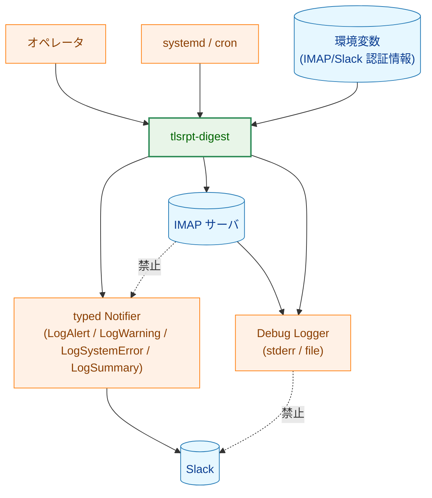

矢印 A → B は許可された情報の流れ、破線矢印 `"禁止"` は設計上発生してはならない経路を表す。具体的には (1) IMAP サーバから取得した認証シーケンスやパスワードを含む生通信内容を `notify` 経由で Slack に流すこと、(2) Debug Logger の出力を Slack ハンドラに到達させること、の 2 経路を禁止する。

**凡例（Legend）**

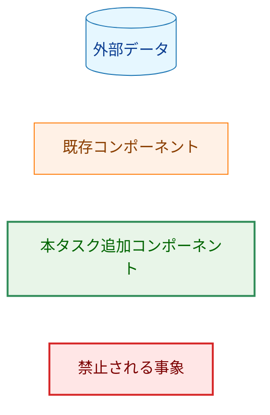

破線矢印（`A -.->|"禁止"| B`）は設計上発生してはならない禁止経路を表す。凡例の色コードはノード種別のみを示す。矢印の種別については上記キャプションを参照。

---

## 6. 処理フロー詳細

### 6.1 `fetch` の at-least-once 保証

通知が必ず SEEN フラグ付与より前に配送確認される、というのが at-least-once の要である。クラッシュタイミング別の挙動は以下のとおり。「送信予定件数」はクラッシュ時点でバッファに積まれていたメッセージ数、「次回送信件数」は次回 `fetch` で再生成される件数を示す。

| クラッシュタイミング | クラッシュ時送信予定 | 次回 `fetch` の挙動 | 次回送信件数 | 通知重複の可能性 |
|---|---|---|---|---|
| `SaveUIDValidity`（初回）完了後・ダウンロード前 | 0 件（未取得） | sentinel に UIDVALIDITY あり → 通常処理。UIDVALIDITY 変化があれば検出可能 | 通常件数 | なし |
| `.eml` 保存後・`Flush()` 完了前 | N 件 | UNSEEN + ローカルファイルありとして再処理 → `Flush()` を含む全ステップ再実行 | N 件 | あり |
| `Flush()` 完了後・SEEN 付与前 | 0 件（既送信） | 同上 | N 件 | あり |
| SEEN 付与後 | 0 件 | SEEN + ファイルありでスキップ | 0 件 | なし |

重複は許容するが、欠落（通知すべきだったメールが SEEN 化されて再通知されない）は発生しない。次回送信時の `run_id` は新規に採番されるため、`run_id` をキーに重複判別が可能（[3.6](#36-runid-と相関-id)）。

### 6.2 `fetch` のダウンロード対象選定

`.eml` 書き込みはアトミック（タスク 0040）なので、最終パスに存在するファイルは常に完全である。これに基づき以下のテーブルで判定する。`imap.MaxMessageBytes` 超過メールは IMAP ライブラリ側で除外される（DoS 対策）。

IMAP メタデータ取得では、本文を取得せずに以下のフィールドを得る。

| フィールド | 取得元 | 利用箇所 |
|---|---|---|
| UID | IMAP UID | `.eml` 保存名、SEEN 付与、`EmailMeta`、warning payload |
| UIDVALIDITY | mailbox status | fail closed 判定、sentinel 更新、`EmailMeta` |
| RFC822.SIZE | IMAP size 情報 | ダウンロード上限判定、ローカル `.eml` サイズ不一致 WARN |
| SEEN | IMAP flags | ダウンロード対象判定、SEEN 付与対象判定 |
| Message-ID | IMAP envelope | warning payload、運用調査用ログ |
| INTERNALDATE | IMAP internal date | `EmailMeta`、保持期間・集計対象期間の判定 |

| SEEN フラグ | ローカル `.eml` | アクション | 過去クラッシュとの対応 |
|---|---|---|---|
| UNSEEN | なし | ダウンロード対象 | 通常の新着 |
| UNSEEN | あり | スキップ。既存ファイルを処理対象に含め、SEEN マーク付与対象とする | 過去サイクルで `SaveEmail` 後・SEEN 付与前にクラッシュしたケース（[6.1](#61-fetch-の-at-least-once-保証) 第 2・第 3 行） |
| SEEN | なし | ダウンロード対象（`.eml` 消失、再アラートなし） | ユーザが手動で `.eml` を削除したケース等 |
| SEEN | あり | スキップ（処理済み） | 通常の処理済みメール |

RFC822.SIZE とローカルファイルサイズの不一致は WARN ログを出力し、`NotificationSink.LogWarning` で Slack 通知バッファへ積む。ダウンロード判定には影響しない（Exchange 等のサイズ不正確実装への耐性）。この WARN も `fetch` の最終 `Flush()` で配送確認し、`Flush()` 失敗時は SEEN を付与せず exit 1 とする。

### 6.3 UIDVALIDITY 検証の状態遷移

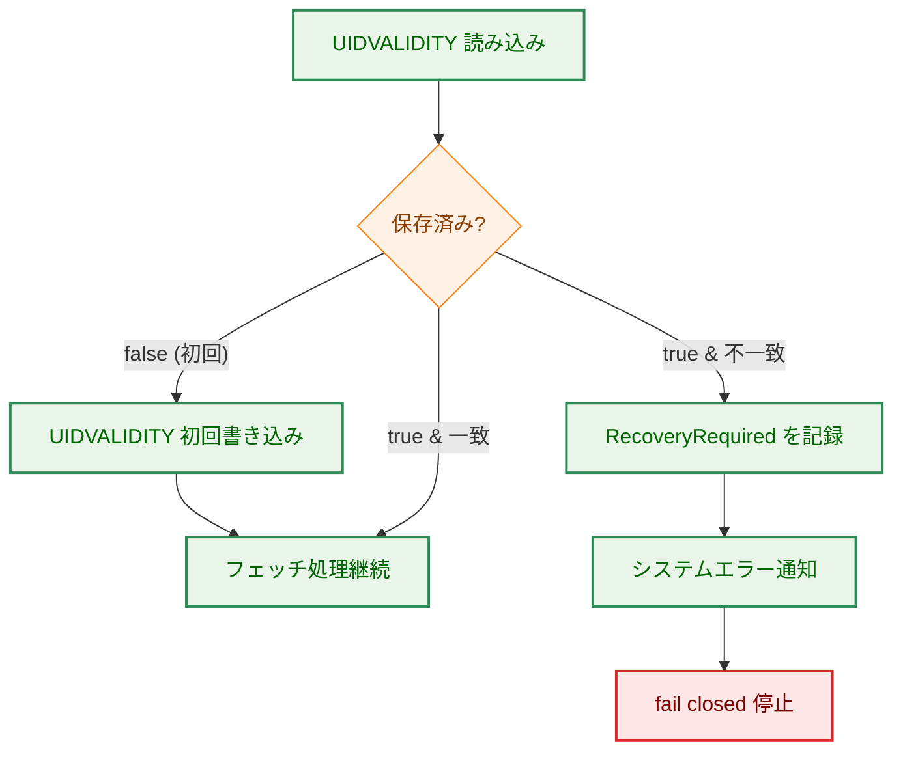

矢印 A → B は処理遷移を表す。

- **初回保存をステップ 3 で即時実行する理由**: ステップ 5 まで遅延させると「途中クラッシュ → 次回も `found=false` → UIDVALIDITY 変化を検出できない」という見落としが発生するため。
- **`found=true` の通常実行**: AC-20a によりステップ 5 完了後に冪等で再保存される。「冪等」とは `SaveUIDValidity(v)` が同じ値の再書き込み時に sentinel の atomic rename 以外の副作用を持たないこと（タスク 0040 の sentinel 実装による）。

**凡例（Legend）**

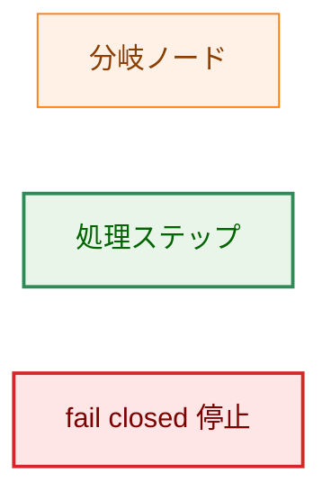

### 6.4 `recover --mode discard-old --yes` の更新範囲と不変条件

`discard-old --yes` は複数ファイルにまたがる破壊的操作であるため、永続化境界は `internal/store` に閉じ込める。`cmd/tlsrpt-digest/recover.go` は `store.Store.ResetForRecovery(currUIDValidity uint32) error` を 1 回呼ぶだけにし、`tlsrpt.json`、`emails/`、sentinel、reset staging のパスやファイル形式を直接扱わない。

store 側の設計不変条件は以下:

- 呼び出し側から見ると、`ResetForRecovery` は「旧データ保持 + recovery-required 残存」または「空ストア + current UIDVALIDITY + recovery-required 解消」のどちらかに収束する。
- commit 前の pending reset がある場合、通常の `store.Open(OpenReadWrite)` は fail closed する。
- `recover --mode discard-old --yes` だけは `store.Open(rootDir, identity, OpenRecoverReset)` を使い、pending reset を再開できる store を取得する。`fetch` / `gc` / `reprocess` / `summary` はこの mode を使わない。
- `OpenRecoverReset` で得た store が許可する破壊的操作は `ResetForRecovery(currUIDValidity)` のみとする。
- commit 後の cleanup 失敗は通常データパスへ影響させず、後続の `Open` または `ResetForRecovery` で再 cleanup 可能にする。
- reset の内部 state machine、staging 名、manifest 形式、phase 境界ごとの再開手順は実装計画で定義する。

`recover --mode keep-old` は既存 `ApplyRecovery(curr)` を使い、`discard-old --yes` はデータ破棄を伴うため `ResetForRecovery(currUIDValidity)` を使う。

`ResetForRecovery` のエラー境界:

| エラー | 条件 | 呼び出し側の扱い |
|---|---|---|
| read-only store | `OpenReadOnly` の store に対して呼ばれた | 実装バグとして `LogSystemError` + exit 1 |
| recovery-required 不在 | sentinel に recovery-required がない | オペレータへ「復旧不要」と表示し exit 1 |
| curr mismatch | 引数が recovery-required の current UIDVALIDITY と異なる | UIDVALIDITY 再確認を促して exit 1 |
| reset incomplete | pending reset があり通常 open が拒否された | `SystemErrorKind=reset_incomplete` を通知し、`recover --mode discard-old --yes` の再実行を案内 |
| reset failure | store 内部の reset 再開または commit に失敗 | `recovery_required` を残し、再実行可能な状態で exit 1 |

更新範囲は以下:

| 対象 | 操作 |
|---|---|
| `tlsrpt.json` | 既存ファイルを staging へ退避後、空のレコードセットで再作成（アトミック書き込み） |
| `{root_dir}/emails/` | 既存ディレクトリを staging へ退避後、空ディレクトリとして再作成 |
| sentinel `imap_host` / `imap_port` / `imap_mailbox` | 変更しない（メールボックス紐付けの履歴を保持） |
| sentinel `initialized_at` | 変更しない（運用開始日時の履歴を保持） |
| sentinel `uid_validity` | recovery-required 状態に記録された現在値へ更新 |
| sentinel `recovery_required` | フィールドを除去 |

**中間クラッシュからの再実行性**:

commit 前にクラッシュした場合は recovery-required を残し、通常コマンドは fail closed する。`recover --mode discard-old --yes` の再実行だけが `OpenRecoverReset` 経由で reset を再開できる。commit 後に cleanup が残った場合は、通常データパスは空ストアとして一貫しており、後続の `Open` または reset 実行時に後片付けできる。

`--yes` が指定されない場合は予定内容を表示するのみで破壊的変更を行わず exit 1。`recover --mode keep-old` は `Store.ApplyRecovery(curr)` を 1 回呼ぶだけでアトミックに `uid_validity` 更新と `recovery_required` 除去を完了する。

**オペレータ向け表示**:

`recover` は破壊的変更の有無にかかわらず、実行前に以下を stdout へ表示する。Slack 通知ではなく手元確認用の標準出力であり、認証情報や Slack URL は含めない。

| 項目 | 内容 |
|---|---|
| previous UIDVALIDITY | recovery-required に記録された旧 UIDVALIDITY |
| current UIDVALIDITY | recovery-required に記録された現在 UIDVALIDITY |
| mailbox | `imap_host` / `imap_port` / `imap_mailbox` |
| local data path | `{root_dir}`、`tlsrpt.json`、`emails/` の場所 |
| selected mode | `keep-old` または `discard-old` |

上記の共通表示に加え、モードごとに以下を追加表示する。

- **`keep-old`**: 旧 UIDVALIDITY エポック由来の既存レポートと `.eml` は保持され、期間条件に一致する限り今後の `summary` に混入し得る旨を警告する。
- **`discard-old`（`--yes` なし）**: staging 退避後に `tlsrpt.json` と `emails/` が空ストアへ置き換わること、sentinel の `uid_validity` が current へ更新されることを表示する。破壊的変更は行わず exit 1 とする（ドライラン表示）。
- **`discard-old --yes`**: 上記と同じ内容を表示してから `ResetForRecovery(currUIDValidity)` を呼ぶ。

### 6.5 ストア API 利用マップ

各サブコマンドが `internal/store` および `internal/notify` の API をどう使うかを集約する。シグネチャは `internal/store/store.go` と `internal/notify/handler.go` を正とする。

| サブコマンド | 利用 API |
|---|---|
| `fetch` | `store.Open(OpenReadWrite)` / `LoadRecoveryRequired` / `LoadUIDValidity` / `SaveUIDValidity` / `SaveRecoveryRequired` / `SaveEmail` / `SaveEmailMetas` / `SaveReports` / `NotificationSink.LogAlert` / `NotificationSink.LogWarning` / `NotificationSink.LogSystemError` / `NotificationSink.Flush` |
| `summary` | `store.Open(OpenReadOnly)` / `LoadRecoveryRequired` / `notify.GenerateSummary` / `NotificationSink.LogSummary` / `NotificationSink.LogSystemError` / `NotificationSink.Flush` |
| `reprocess` | `store.Open(OpenReadWrite)` / `LoadRecoveryRequired` / `LoadEmails` / `SaveEmailMetas` / `SaveReports` /（`--notify` 指定時のみ）`NotificationSink.LogAlert` / `NotificationSink.Flush` |
| `gc` | `store.Open(OpenReadWrite)` / `LoadRecoveryRequired` / `DeleteReportsBefore` / `DeleteEmailsBefore` / `NotificationSink.LogSystemError` / `NotificationSink.Flush`（エラー時のみ） |
| `recover` | `store.Open(OpenReadWrite)`（通常確認・`keep-old`） / `store.Open(OpenRecoverReset)`（pending reset 再開を許可する `discard-old --yes` 専用） / `LoadRecoveryRequired` / `ApplyRecovery`（`keep-old`） / `ResetForRecovery(currUIDValidity)`（`discard-old --yes`） |

`SaveEmailMetas` は `EmailMeta{UID, UIDValidity, InternalDate}` を受け取る（タスク 0040/0041 で確定済み）。`DeleteEmailsBefore(cutoff)` は単一の `cutoff time.Time` を受け取り、`internal_date < cutoff` の `.eml` を削除する（タスク 0041 で確定済み）。

### 6.6 `SaveEmailMetas` / `SaveReports` の呼び出し順序

`fetch` および `reprocess` における呼び出し順は以下の理由で固定する。

| サブコマンド | 順序 | 理由 |
|---|---|---|
| `fetch` | (a) 欠損 `.eml` だけを `SaveEmail` で保存 → (b) ローカルに存在する対象 `.eml` 全体に対して `SaveEmailMetas` を 1 回呼ぶ → (c) ローカル `.eml` をパースして `SaveReports` を 1 回呼ぶ | raw `.eml` をパース前に保存することで、`Flush()` 前クラッシュ時も次回 `fetch` が同じ原本から再処理できる。(b) を 1 回にまとめることで O(N²) の JSON 全読み書きを避ける。0040 AC-08d により既登録エントリは保持されるため、過去サイクルで `SaveEmailMetas` 前にクラッシュした孤立 `.eml` も次回サイクルで救済される |
| `reprocess` | (a) `LoadEmails` で全 `.eml` を列挙 → (b) `SaveEmailMetas` でバッチ登録 → (c) `SaveReports` で UPSERT | `reprocess` は SEEN フラグを持たない手動操作。未登録エントリも含めて先に index を整え、レポートを後で UPSERT する。0040 AC-08d の冪等性により既存レポートを破壊しない |

タスク 0041 F-001 によりメールインデックスへの `report_end_date` 更新は廃止されているため、(b) と (c) の間に集計上の依存関係はない。`SaveReports` 失敗時に index だけ進んだ状態は残り得るが、`.eml` 原本と `EmailMeta` が揃っていれば次回 `fetch` / `reprocess` で `SaveReports` を再実行できるため許容する。この中間状態を許容できない要件が後から追加される場合は、`internal/store` に `SaveEmailMetas` と `SaveReports` をまとめる atomic batch API を追加する。

### 6.7 `summary` の空ストア時シーケンス

要件 AC-10c では「ストア未作成時は集計対象データなしとして正常終了」と規定する。具体シーケンスは以下:

1. `summary` は Slack URL 環境変数を読む前に `store.Open(rootDir, identity, OpenReadOnly)` を呼ぶ。read-only モードのため `{root_dir}` 不在でもエラーを返さず、空ストア状態の `Store` を返す（タスク 0040 F-001 の OpenReadOnly セマンティクス）。
2. `LoadRecoveryRequired` を必ず先に呼ぶ（第 1 回確認）。`found = true` の場合は空ストア扱いにせず、§3.4 の W-3・W-4 を実行して notifier を構築してから `SystemErrorKind=recovery_required` を送信し exit 1 とする（§2.2 参照）。
3. `found = false` の場合だけ集計窓を算出し `notify.GenerateSummary(ctx, store, start, end, debugLogger)` を呼ぶ。`start = Duration.Cutoff(now)`（AC-07c）、`end = UTCDayStart(now)`（AC-07d）。窓は半開区間 `[start, end)`（start 以上 end 未満）。集計ロジックは `summary.go` で再実装しない。
4a. 生成された `Summary` が空の場合、`LoadRecoveryRequired` を再確認する（第 2 回確認・空パス用）。`found = true` ならば stderr に ERROR ログを出力して exit 1（notifier 未構築のため Slack 通知なし、AC-27a 準拠）。`found = false` ならば Slack notifier を構築せず INFO レベル `slog` ログ「no reports to summarize」を 1 行出力し exit 0。
4b. `Summary` が非空の場合、§3.4 の W-3・W-4 に従い Slack URL 取得と `BuildHandlers` を実行して notifier を構築する。
5. Slack 送信直前に `LoadRecoveryRequired` を再読込する（第 2 回確認・非空パス用）。recovery-required が出現していれば `SystemErrorKind=recovery_required` を通知して exit 1 とする。これにより `summary` がロックを取得しない設計でも、送信直前の fail closed 境界を持つ。
6. exit 0。

ストアは存在するがレポート 0 件の場合（`GetAllReports` 空・`LoadRecoveryRequired` も `found = false`）も同じ挙動とする。

---

## 7. テスト戦略

### 7.1 単体テスト

要件定義書 §6 のテスト方針を踏襲しつつ、AC ↔ テストのトレーサビリティを実装計画書（`03_implementation_plan.md`）の「Acceptance Criteria Verification」セクションで完成させる。本書ではテストの粒度と網羅範囲を確定する。

- **`duration.go`** — AC-07 / AC-07b / AC-07c / AC-07d
  - `7d`・`4w`・`30d` の正常パース
  - `0d`・`-1d`・`-2w`・`30h`・`abc` のエラー
  - `fetch --since`・`summary --window`・`gc --before`・`gc --max-email-age` の各フラグで共通利用されること
  - 週指定が日数へ正規化されること（`4w → Days=28`）
  - `Duration.Cutoff(now)` の UTC 切り捨て動作：現在時刻が UTC 02:01:00 のとき `Days=7` のカットオフが「7 日前の 00:00:00 UTC」となること（「7 日前の 02:01:00」ではないこと）（AC-07c）
  - 週指定（`1w`）でも同様に UTC 日付単位の切り捨てが行われること
  - `UTCDayStart(now)` が現在時刻に関わらず「今日の 00:00:00 UTC」を返すこと（AC-07d）
  - `summary --window 1w` を 2000-12-10 10:00 UTC に実行したとき `start=2000-12-03 00:00 UTC`・`end=2000-12-10 00:00 UTC` となり翌週実行と重複しないこと（AC-07d 統合確認）
- **`lock.go`** — AC-10a
  - 1 プロセスが取得中の状態で 2 プロセス目が即時失敗（non-blocking）
  - プロセス終了で自動解放されること（テスト内では `Close()` で代替）
- **`boot.go`** — AC-08 / AC-09 / AC-10 / AC-10a
  - 設定読込失敗 → exit 1（Slack ハンドラ未構築のため stderr のみ）
  - 環境変数取得後 `config.Secret` 化されること
  - `gc` / `recover` / `reprocess` では IMAP 認証情報を要求しないこと
  - `BuildHandlers` の all-or-nothing 動作（partial success が発生しない）
  - `summary` 空ストア時は `BuildHandlers` を呼ばず Slack URL 未設定でも exit 0 になること
  - ロック取得失敗 → `LogSystemError` + `Flush()` + exit 1（Slack 通知あり）
  - ストアオープン失敗の分類別エラーメッセージ（identity mismatch / permission / corruption）
- **`fetch.go`** — AC-10d / AC-10e / AC-11 / AC-11a–d / AC-12–21 / AC-15a / AC-16a / AC-18a / AC-20 / AC-20a
  - `FakeMailFetcher` / `FakeStore` / スパイ Slack ハンドラを使用（既存 `internal/{imap,store,notify}/testutil` 等を再利用）
  - SEEN × ローカル `.eml` の 4 通り、UIDVALIDITY 初回/一致/不一致
  - recovery-required 確認後に IMAP 認証情報を取得し、接続失敗時は `LogSystemError` + `Flush()` + exit 1 になること
  - IMAP client が成功・失敗経路のどちらでも `Close()` されること
  - RFC822.SIZE 不一致時の WARN ログ＋`LogWarning` バッファリング＋ダウンロード判定不変
  - パース失敗時の WARN ログ＋`LogWarning` バッファリング＋レポート保存スキップ＋SEEN 付与継続
  - サイズ不一致・パース失敗 WARN が `Flush()` 成功後にのみ SEEN 付与へ進むこと
  - Flush 失敗時に SEEN 不付与
  - `SaveEmailMetas`・`SaveReports` がそれぞれ全メール処理後に 1 回ずつ呼ばれること
- **`summary.go`** — AC-07a / AC-07c / AC-07d / AC-10c / AC-27 / AC-27a / AC-28 / AC-29
  - `--window` 指定時/未指定時の動作
  - recovery-required 残存時の停止
  - `GenerateSummary` に渡される `start` が `Duration.Cutoff(now)`（UTC 日付単位切り捨て後に指定日数遡及）であること（AC-07c）
  - `GenerateSummary` に渡される `end` が `UTCDayStart(now)`（今日の 00:00:00 UTC）であること（AC-07d）
  - 集計対象期間（開始・終了日時）がメッセージ（`notify.Summary`）に含まれること（AC-28）
  - 空集計時の正常終了（INFO ログのみ、Slack notifier 未構築、Slack URL 未設定でも exit 0）（AC-10c）
  - Slack URL が未設定で非空の集計結果が存在する場合、`BuildHandlers` が失敗し exit 1 となること（空集計との対比）
  - 空集計パスで recovery-required が出現した場合、Slack 通知なしで stderr ERROR + exit 1 となること（AC-27a、§6.7 ステップ 4a）
- **`reprocess.go`** — AC-21a / AC-22–26
  - recovery-required ガード
  - `--notify` 有無の挙動
  - ファイル単位エラー継続 / ストア書き込み失敗の中断
- **`gc.go`** — AC-29a / AC-30–34
  - `--before` / `--max-email-age` のカットオフ計算が `Duration.Cutoff(now)` 経由で UTC 日付単位切り捨て済みであること（AC-07c）
  - INFO ログ出力件数
- **`recover.go`** — AC-35–41
  - `keep-old` で `ApplyRecovery` がアトミックに呼ばれること
  - previous/current UIDVALIDITY、メールボックス、local data path、選択 mode が stdout に表示されること
  - `keep-old` 実行前に旧エポックデータ混入リスクが表示されること
  - `discard-old --yes` で `internal/store.Store.ResetForRecovery(currUIDValidity)` が呼ばれること
  - `discard-old` （`--yes` なし）の dry-run 表示に置換対象と sentinel 更新予定が含まれること
  - `discard-old` （`--yes` なし）が破壊的変更を行わないこと
  - recovery-required 不在時の説明付き exit 1
- **`internal/store` の復旧 API** — AC-38 / AC-41
  - `ResetForRecovery(currUIDValidity)` が staging 退避、空 `emails/` 作成、空 `tlsrpt.json` 再作成、sentinel 更新、staging 後片付けを store パッケージ内で行うこと
  - 再実行しても最終状態へ収束すること
  - `prepared` / `moved` / `empty_created` の pending reset では通常 `OpenReadWrite` が fail closed し、`OpenRecoverReset` だけが再開用 store を返すこと
  - 各 phase 境界で失敗を注入し、次回 `ResetForRecovery` が manifest に従って再開できること
  - commit 前の中間失敗時に recovery-required 状態と staging 退避済みデータが残り、次回 `recover --mode discard-old --yes` を再実行できること
  - commit 後の staging 削除失敗が通常データパスへ影響しないこと

### 7.2 統合テスト

- サブコマンド振り分けの結合テスト（サブコマンド未指定・未知のサブコマンド・サブコマンド専用 `FlagSet` に対する不正フラグが usage を stderr へ出し exit 2 になることを含む）
- TOML 設定読込から `BootContext` 構築までの一連
- `testdata/` の実 `.eml` を用いた `reprocess` のラウンドトリップ
- `fetch` 実行中に `summary` が並走できること（書き込み系どうしの直列化のみ強制）

### 7.3 セキュリティテスト

[notification_security.md](../../dev/developer_guide/notification_security.md) §5 のテスト要件に従う:

- Slack ハンドラが `slog.Default()` に**接続されていない**ことを検証（タイプ付きヘルパー以外のログが流入しない）
- サブコマンドが `*notify.SlackHandler` / `slog.Handler` を直接受け取らず、`NotificationSink` facade 経由でのみ通知できること
- `LogWarning` と `LogSystemError` が raw error、ローカル `.eml` パス、IMAP パスワード、Slack Webhook URL を Slack payload に含めないこと
- `uidvalidity_changed` / `recovery_required` / `reset_incomplete` が safe `SystemErrorKind` として整形され、任意 message 文字列を必要としないこと
- `fetch_warning` が TLS failure alert として整形・集約されず、専用 warning として error webhook へ送られること
- IMAP デバッグ用 `io.Writer` が Slack ハンドラと型システムレベルで分離されていること（将来 IMAP デバッグを有効化する際の検証ポイントとして残す）
- 環境変数・`BootContext` のログ出力に `[REDACTED]` が含まれること（`config.Secret` 経由のラップ確認）
- 通知用 `*slog.Logger` が `internal/notify` 外部から exported されていないこと

---

## 8. 実装優先順位

### フェーズ 1: 共通基盤

1. `duration.go`（`d`/`w` パーサー）
2. `lock.go`（プロセスロック）
3. `NotificationSink` facade と `boot.go`（共通初期化シーケンス）
4. `internal/store` の `ResetForRecovery(currUIDValidity)` API
5. サブコマンド振り分けとサブコマンド別 `FlagSet` への移行

### フェーズ 2: 主機能サブコマンド

6. `fetch.go`（最大の処理フロー。at-least-once 順序を厳格化）
7. `summary.go`（read-only モードでの集計と Slack 送信）

### フェーズ 3: 運用サブコマンド

8. `gc.go`（保持期間ベースの削除と INFO ログ）
9. `recover.go`（`keep-old` / `discard-old --yes`）
10. `reprocess.go`（`testdata` を用いたラウンドトリップを含む統合テストとセット）

### フェーズ 4: 仕上げ

11. ドキュメント整備（README・運用例の取り込み、`docs/tasks/0070_entrypoint/notes/operational_examples.md` の正式化）
12. セキュリティテスト・統合テストの追加

---

## 9. 将来の拡張性

- **追加スケジューラ対応**: 現状 systemd timer / cron を前提とするが、Kubernetes CronJob などへの応用はサブコマンドの one-shot 性により既に成立している。スケジューラ側設定例の追加が必要であれば `notes/operational_examples.md` を拡張する。
- **複数メールボックス対応**: 現在は単一の `{store.root_dir}` 配下に 1 メールボックスを紐付ける。マルチメールボックス化する場合は、サブコマンド共通の `BootContext` がメールボックス選択を受け取れるよう拡張する（`--mailbox` 相当のフラグまたは設定キー）。ロック粒度は **`root_dir` 単位の独立ロックを維持**し、メールボックスごとに別 `root_dir` を割り当てる構成にすることで、メールボックス間の並行 `fetch` を許容しつつ書き込み競合を防げる。グローバルロックは導入しない。
- **ロックパスの設定化**: 現状はロックパスを `{root_dir}/.tlsrpt-digest-store.lock` 固定としている。運用要件が増えた場合は TOML 設定キーを追加する余地がある。プロセス全体タイムアウトは本タスクでは実装せず、将来必要になった場合は要件定義から追加する。
- **ヘルスチェックサブコマンド**: 将来的に `health` サブコマンドを追加する場合は、`summary` と同じ read-only パスを使い、ストアの整合性・最終 `fetch` 時刻・`recovery_required` の有無を返す形が想定される。
- **メトリクスエクスポート**: Prometheus textfile collector への書き出し（`gc` 削除件数、`fetch` メール件数など）が必要になった場合、`internal/notify` とは別レイヤーとして追加可能な構造になっている。
