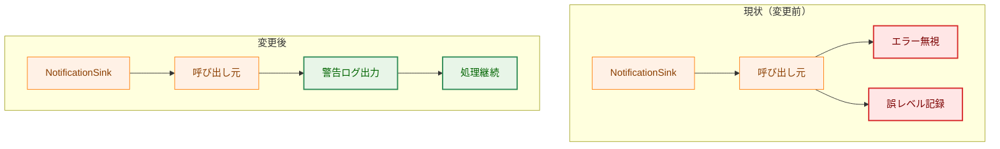
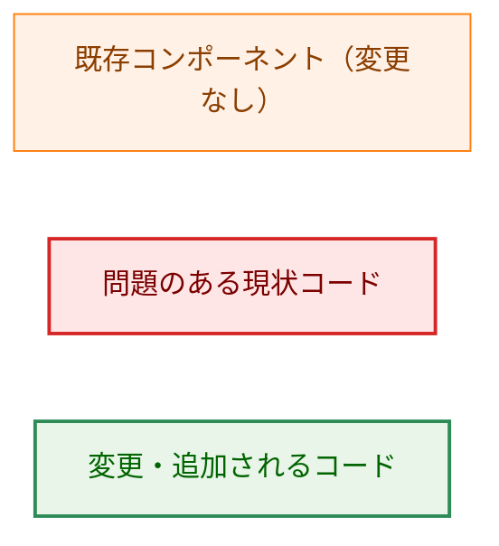
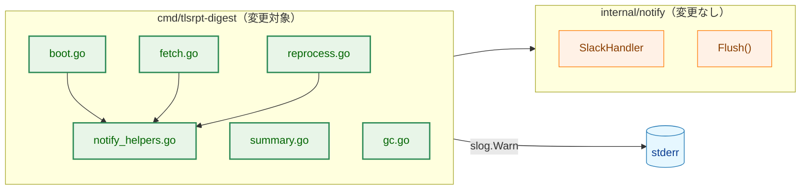
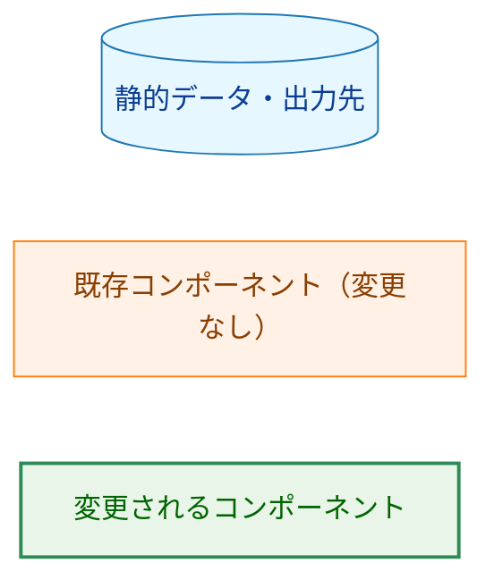
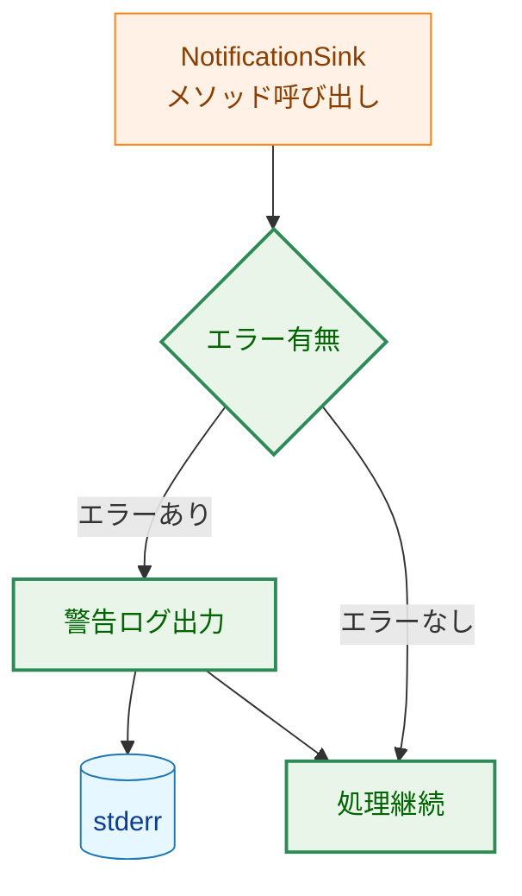
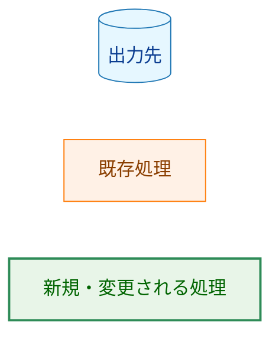
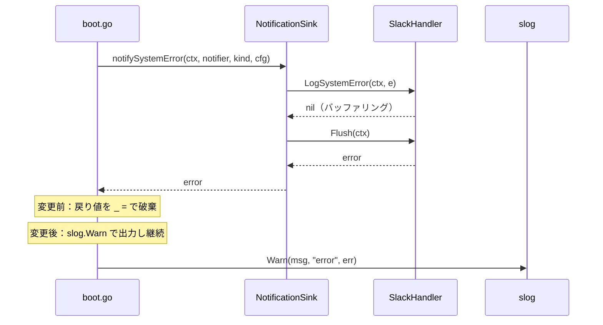
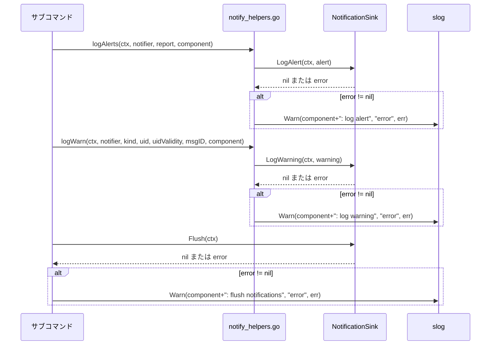
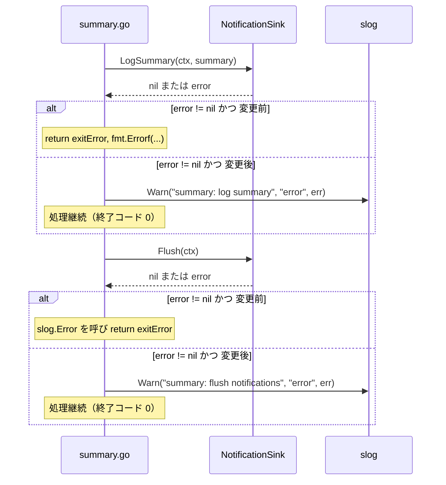

# アーキテクチャ設計書：通知失敗時の警告ログ出力

## ドキュメントステータス

| 項目 | 内容 |
|---|---|
| ステータス | `draft` |
| 作成日 | 2026-05-30 |
| レビュー日 | - |
| レビュアー | - |
| コメント | - |

---

## 1. 設計の全体像

### 1.1 設計原則

| 原則 | 内容 |
|---|---|
| 主処理の優先 | 通知失敗はプロセスの主処理（IMAP フェッチ・サマリ生成）の失敗ではない。通知エラーを理由にプロセスを終了させない |
| 可観測性 | 通知失敗を `slog.Warn` で構造化ログとして出力し、オペレータが問題を検知できるようにする |
| 一貫性 | 全呼び出し箇所で同一のエラーレベル（`Warn`）と同一のフィールド構造を使う |
| 最小変更 | 通知エラーのハンドリング責務はアプリケーション層（`cmd/tlsrpt-digest`）にある。`internal/notify` は Slack 送信という単一の責務に専念すべきであり、他のコンテキストでも再利用される可能性がある。したがって変更範囲を `cmd/tlsrpt-digest` に限定し、リスクを最小化する |

### 1.2 コンセプトモデル

現状と変更後のエラー処理方針を比較する。「現状」では呼び出し箇所ごとに異なる不適切な処理が混在している。「変更後」では全箇所を統一パターンに揃える。



矢印 A → B は「A の後に B の状態に至る」ことを表す。

**凡例**



---

## 2. システム構成

### 2.1 コンポーネント配置と全体アーキテクチャ

通知エラーログの変更対象範囲を示す。矢印 A → B は「A が B を呼び出す」ことを表す。



`slog.Warn` による通知エラーログは `cmd/tlsrpt-digest` 層が stderr へ出力する（上図の `slog.Warn` 矢印）。なお `internal/notify` は既存の DebugLogger（`boot.go:setupNotifyHandlers` で設定）を通じて Slack 送信失敗を別途 stderr に出力するが、それは既存の動作であり本タスクでは変更しない。

**凡例**



### 2.2 通知エラー処理のデータフロー

`SlackHandler` はバッファリング型の実装である。`LogAlert`・`LogWarning`・`LogSystemError`・`LogSummary` は `Handle()` を呼んでレコードをバッファリングし、常に `nil` を返す。実際の HTTP 送信と配信エラーは `Flush()` で生じる。

このタスクでは `NotificationSink` インタフェースのすべてのメソッドに対してエラーチェックを行う。現行実装では `Flush()` だけが実際にエラーを返すが、インタフェースレベルで一貫したチェックを置くことで将来の実装変更（例: バッファリングせず即時送信する実装）にも対応できる。

矢印 A → B は「A から B へとエラーまたは制御が伝わる」ことを表す。



**凡例**



---

## 3. コンポーネント設計

### 3.1 インタフェース変更

既存の `NotificationSink` インタフェースは変更しない。

```go
// NotificationSink — 変更なし（参照のみ）
type NotificationSink interface {
    LogAlert(ctx context.Context, alert notify.Alert) error
    LogWarning(ctx context.Context, warning notify.Warning) error
    LogSystemError(ctx context.Context, err notify.SystemError) error
    LogSummary(ctx context.Context, summary notify.Summary) error
    Flush(ctx context.Context) error
    IsDryRun() bool
}
```

### 3.2 コンポーネント責務一覧

本ドキュメント内では通知ヘルパーを次の 2 種類に区別する。

- **ログヘルパー**: `notify_helpers.go` 内の `logAlerts`・`logWarn`。アラートや警告を `NotificationSink` に渡し、エラー時に `slog.Warn` を出力する汎用ヘルパー。
- **システムエラー通知ヘルパー**: 各サブコマンドの `notifyXxxSystemError`（`notifyFetchSystemError`・`notifyReprocessSystemError`・`notifyGCSystemError`）。`LogSystemError` と `Flush` をまとめてエラーを返す。

| ファイル | 変更種別 | 変更内容 |
|---|---|---|
| `cmd/tlsrpt-digest/notify_helpers.go` | 修正 | ログヘルパー（`logAlerts`・`logWarn`）内の `slog.Error` を `slog.Warn` に変更 |
| `cmd/tlsrpt-digest/boot.go` | 修正 | `notifySystemError` 呼び出し箇所の戻り値破棄（`_ =`）を廃止し、`slog.Warn` で出力する |
| `cmd/tlsrpt-digest/fetch.go` | 修正 | （a）システムエラー通知ヘルパー（`notifyFetchSystemError`）の呼び出し箇所約 11 箇所で戻り値破棄を廃止し `slog.Warn` でログ出力；（b）`boot.Notifier.Flush(ctx)` の直接呼び出し箇所（ヘルパー経由ではない）の `slog.Error` を `slog.Warn` に変更 |
| `cmd/tlsrpt-digest/summary.go` | 修正 | `LogSummary` エラーを呼び出し元に返す代わりに `slog.Warn` でログ出力して継続；`Flush` エラーの `slog.Error` を `slog.Warn` に変更。`summary.go` は `LogWarning` を直接呼ばないため `logWarn` の変更対象には含まれない |
| `cmd/tlsrpt-digest/reprocess.go` | 修正 | システムエラー通知ヘルパー呼び出しの戻り値破棄を廃止し `slog.Warn` でログ出力；`Flush` エラーの `slog.Error` を `slog.Warn` に変更 |
| `cmd/tlsrpt-digest/gc.go` | 修正 | システムエラー通知ヘルパー呼び出しの戻り値破棄を廃止し `slog.Warn` でログ出力。なお `gc.go` にある `slog.Error` 呼び出し（ストア操作失敗など、通知とは無関係な主処理エラー）は本タスクの対象外であり変更しない |

新規ファイル・新規パッケージは追加しない。

### 3.3 共通パターン

2 種類のヘルパーは責務が異なり、`slog.Warn` の置き場所も異なる。

**ログヘルパー**（`logAlerts`・`logWarn`）は `notify_helpers.go` に集約される。これらの関数は `LogAlert`・`LogWarning` の呼び出しとエラー時の `slog.Warn` 出力をひとまとめにしており、呼び出し元のサブコマンドはエラーを意識しなくてよい。

**システムエラー通知ヘルパー**（`notifyFetchSystemError` 等）は `LogSystemError` と `Flush` の結合エラーを呼び出し元に返す。呼び出し元の各サブコマンドがそのエラーを受け取り `slog.Warn` でログ出力する責務を持つ。これはヘルパーが送信内容（種類・コンポーネント名など）のカプセル化に専念し、ログ出力の判断をアプリケーション層に委ねることで責務を分離するためである。

---

## 4. エラーハンドリング設計

### 4.1 エラーレベルの選択根拠

通知失敗を `slog.Error` ではなく `slog.Warn` とする理由を以下に示す。

| 項目 | 内容 |
|---|---|
| エラー性質 | 通知失敗は IMAP フェッチ・ストア書き込みなど主処理の失敗ではない。オペレータへの通知経路の問題である |
| 終了コードへの影響 | 主処理が成功していれば終了コード 0 を維持する（AC-02） |
| `slog.Error` との使い分け | `slog.Error` はプロセス継続不能なエラー（ストア破損、IMAP 接続失敗など）に使う。通知失敗はプロセスを止める理由にならない |

### 4.2 `summary.go` の挙動変更

現状 `summary.go` は `LogSummary` のエラーを呼び出し元に返し、終了コード非ゼロを引き起こしている。これは「通知失敗は終了コードに影響しない」という設計方針と矛盾する。変更後は `LogSummary` のエラーを `slog.Warn` で出力し、処理を継続する。

---

## 5. セキュリティ考慮事項

このタスクでは `cmd/tlsrpt-digest` 層の通知エラーログ出力処理を修正する。新たな通知チャネルは追加しない。`notification_security.md` で定義された設計原則との関係を以下に示す。

| 原則 | 本タスクでの扱い |
|---|---|
| 通知宛先の型制約 | 変更なし。`NotificationSink` インタフェースの引数型は変更しない |
| `slog.Warn` の出力先 | stderr に出力される構造化ログ。Slack への通知経路とは独立しており、Slack ハンドラには渡らない |
| デバッグロガーとノティファイアの分離 | 変更なし。`slog.Warn` は stderr 向けのプロセスログであり、Slack ハンドラには渡らない |

### センシティブ情報の漏洩リスク

`slog.Warn` の `"error"` フィールドには `Flush()` が返すエラー文字列が含まれる。`Flush()` は内部で HTTP リクエストを行うため、エラー文字列に webhook URL が含まれる可能性がある。

実装を調査した結果、**webhook URL はエラー文字列に含まれない**ことを確認した。根拠は以下のとおり。

- `internal/notify/retry.go` の `postWithRetry` はエラーメッセージに `cfg.maskedURL`（常に `"[webhook URL redacted]"` の固定文字列）を使用しており、生の URL は含まれない。
- `internal/notify/retry.go` の `sanitizeRequestError()` は `*url.Error`（HTTP クライアントが URL を含んで返すエラー型）を検出して URL 部分を `"[redacted]"` に置き換えてからラップする。
- **設計判断**: `cmd` 層でのサニタイズ追加は不要。`internal/notify` 内の既存保護で十分である。

`notification_security.md` §5 のテスト要件との対応を以下に示す。

| §5 要件 | 本タスクでの扱い |
|---|---|
| 要件 1（型付きイベントヘルパーが Alert 構造体フィールドのみを出力する） | 対象外。`internal/notify` のヘルパーを変更しないため |
| 要件 2（センシティブフィールドが通知メッセージに含まれない） | 対象。`slog.Warn` 出力に webhook URL が含まれないことをセキュリティテストで検証する（7.1 参照） |
| 要件 3（デバッグ出力先が Notifier のハンドラと独立している） | 対象。`slog.Warn` が Slack ハンドラに渡らないことをセキュリティテストで確認する（7.1 参照） |
| 要件 4（通知用 `*slog.Logger` がエクスポートされない） | 対象外。`internal/notify` を変更しないため |

---

## 6. 処理フロー詳細

### 6.1 Bootstrap 時のシステムエラー通知失敗フロー（AC-03）

矢印 A ->> B は同期呼び出し、A -->> B は戻り値を表す。



*参加者の役割：Boot = 変更対象、NS = インタフェース（変更なし）、SH = Slack 実装（変更なし）、Log = プロセスログ出力先*

### 6.2 通常処理時の通知失敗フロー（AC-01）

ログヘルパー（`logAlerts`・`logWarn`）および各サブコマンドの `Flush` 呼び出しに適用される。`gc.go` は `Flush` を含まない点が異なるが、システムエラー通知ヘルパーの戻り値を `slog.Warn` で出力するパターンは同じである。

矢印 A ->> B は同期呼び出し、A -->> B は戻り値を表す。



*参加者の役割：Sub = 変更対象サブコマンド（fetch / summary / reprocess）、NH = ログヘルパー（変更対象）、NS = インタフェース（変更なし）、Log = プロセスログ出力先*

### 6.3 `summary.go` の `LogSummary` 失敗フロー（AC-02）

矢印 A ->> B は同期呼び出し、A -->> B は戻り値を表す。



*参加者の役割：Sum = 変更対象、NS = インタフェース（変更なし）、Log = プロセスログ出力先*

---

## 7. テスト戦略

### 7.1 単体テスト

**slog 出力のキャプチャ方法**

テスト専用の `slog.Handler` 実装を用意し、テスト内で `slog.SetDefault` によりデフォルトロガーを差し替える。テスト終了時は `t.Cleanup` で元のロガーを復元する。この `slog.Handler` 実装はプロセスログのキャプチャのみを担う型として `cmd/tlsrpt-digest` の既存テストヘルパーファイルに追加する。

**AC-01 の検証方針**

- `SpyNotificationSink`（各メソッドが設定可能なエラーを返すテストダブル）を用いる
- 通知エラー発生時に `slog.Warn` が呼ばれ、`"error"` フィールドを含むことを確認する
- ログヘルパー（`logAlerts`・`logWarn`）のテストは `cmd/tlsrpt-digest` パッケージの既存テストファイルに追加する

**AC-02 の検証方針**

- `summary_test.go` に `LogSummary` 失敗シナリオを追加する
- 終了コードが 0 であることを確認する
- `slog.Warn` が呼ばれることを確認する

**AC-03 の検証方針**

- `boot_test.go` に `notifySystemError` の戻り値が `slog.Warn` でログ出力されることを確認するテストを追加する

**セキュリティテスト**

- `slog.Warn` で出力されるログに Slack webhook URL または IMAP パスワードが含まれていないことを確認する
- `SpyNotificationSink.Flush` が webhook URL を含むエラー文字列を返すシナリオを用意し、`slog.Warn` のキャプチャ結果に URL が現れないことを検証する
- この検証は `notification_security.md` §5 のセキュリティテスト要件を満たすものとする

### 7.2 結合テスト

このタスクは `cmd/tlsrpt-digest` 層のみを変更し、外部サービスとの結合は発生しない。単体テストで十分とする。

---

## 8. 実装優先順位

### フェーズ 1: `notify_helpers.go`（最小限の変更）

ログヘルパー（`logAlerts`・`logWarn`）の `slog.Error` を `slog.Warn` に変更する。変更箇所が少なく影響範囲が限定される。

### フェーズ 2: `boot.go`（AC-03）

`notifySystemError` の戻り値を受け取り、`slog.Warn` でログ出力する。

### フェーズ 3: サブコマンド実装

以下の順に対応する。

1. `summary.go`（AC-02 の挙動変更を含む。`LogSummary` エラーが終了コードに影響するという既存動作を変更するため、この動作変更を単独でテストで検証してから他ファイルへ進む）
2. `fetch.go`（戻り値破棄パターンと `slog.Error` の両方が混在）
3. `reprocess.go`（`fetch.go` と同様のパターン）
4. `gc.go`（戻り値破棄パターンのみ）

---

## 9. 将来の拡張性

現在 Slack のみ対応しているが、将来メール通知などが追加された場合でも、`NotificationSink` インタフェースを実装する新しい型を追加するだけでよい。このタスクで確立する「通知エラー → `slog.Warn`」パターンは新しい実装にも自動的に適用される。

また、現行 `SlackHandler` はバッファリング型で `Handle()` が常に `nil` を返すが、将来の実装がバッファリングせず即時送信する場合でも、インタフェースレベルで一貫したエラーチェックを行っているため追加対応は不要である。
