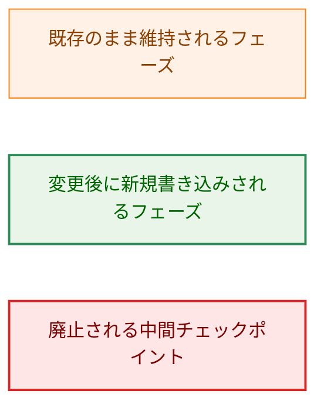
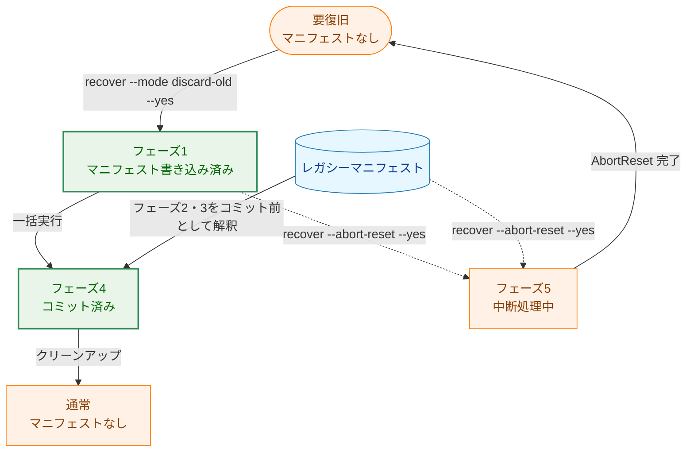
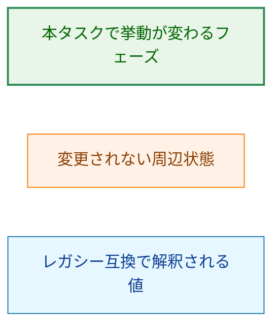
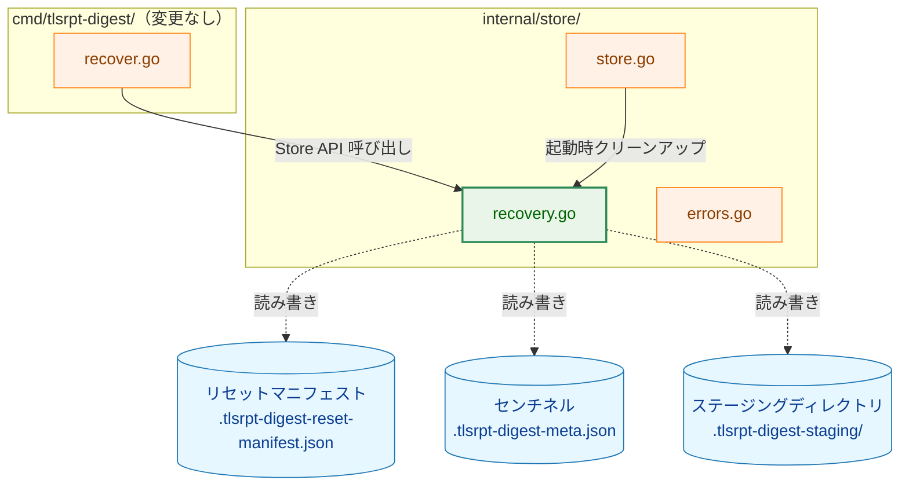
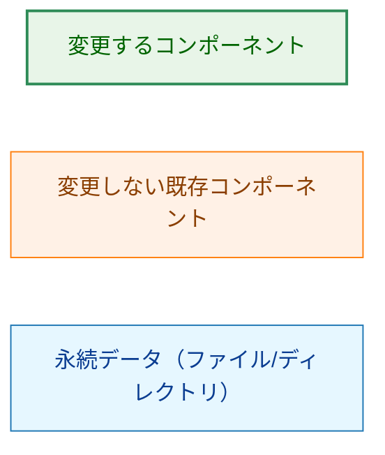
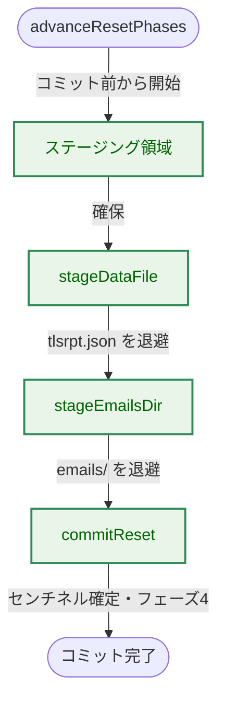
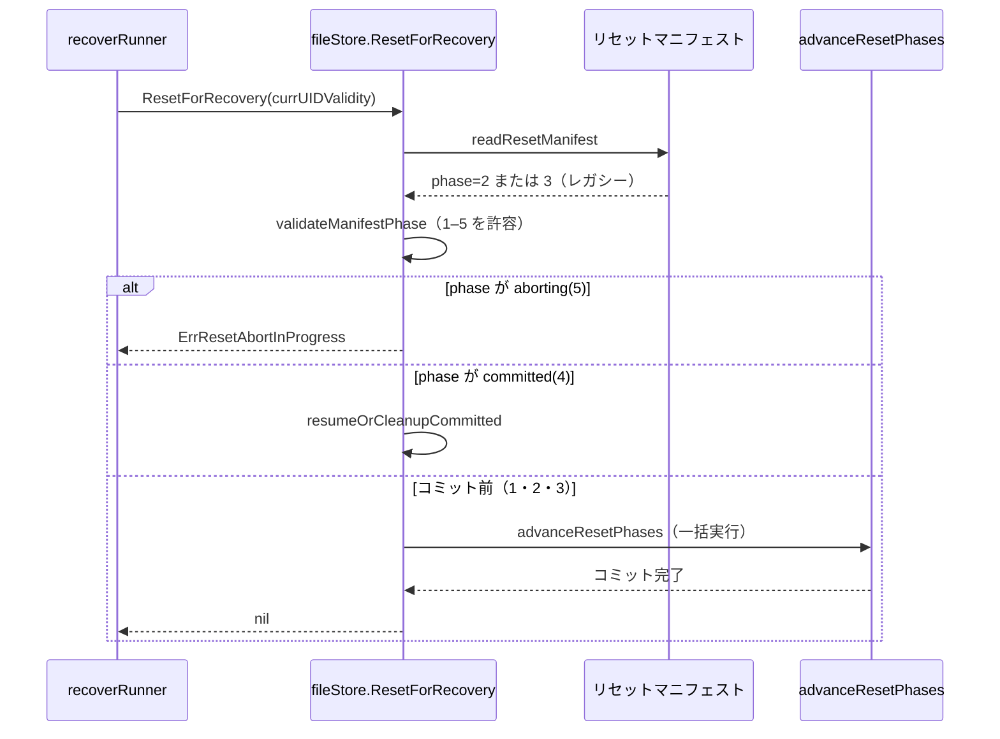
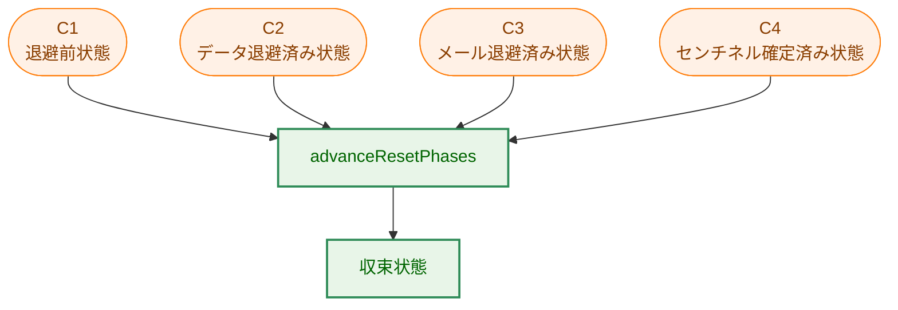
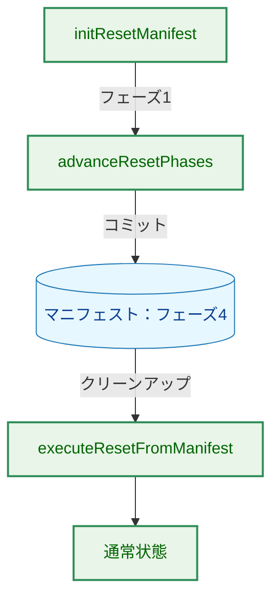

# アーキテクチャ設計書：ResetForRecovery チェックポイントフェーズの簡略化

## ドキュメントステータス

| 項目 | 内容 |
|---|---|
| ステータス | `approved` |
| 作成日 | 2026-05-30 |
| レビュー日 | 2026-05-31 |
| レビュアー | isseis |
| コメント | - |

---

## 1. 設計の全体像

### 1.1 設計原則

- **YAGNI**: チェックポイントフェーズ（フェーズ 2・3）が担っていた「効率・可視性・拡張性」はいずれも本プロジェクトの文脈で不要と再評価された（[01_requirements.md](01_requirements.md) §1）。実体のない最適化を削除し、新規に書き込むフェーズを `{1, 4, 5}` に縮小する。
- **冪等性の維持**: `stageDataFile`・`stageEmailsDir`・`commitReset` はいずれも冪等であり、`rename(2)` は POSIX が保証する原子操作である。再開は常にコミット前フェーズから全操作を冪等に再実行して収束する。この不変条件は本タスクでも変更しない。
- **後方互換は範囲判定に吸収**: アップグレード前に書かれたフェーズ 2・3 のマニフェストも、専用の分岐を設けずコミット前判定の範囲 `[1, 4)` に自然に含めて処理する。特別な後方互換ロジックは設けない。値 2・3 は新規には書き込まない。
- **既存数値の維持（再採番しない）**: フェーズ 4（committed）・フェーズ 5（aborting）の数値・意味・役割を変更しない。番号を変える積極的な理由がないためであり、結果として既存マニフェストの誤読も避けられる。
- **フェーズ番号の範囲判定**: コミット前判定はフェーズ番号の範囲（`[1, 4)`）で行い、廃止した値 2・3 を定数として定義したり名指ししたりしない。

### 1.2 用語

本ドキュメントでは、次の用語を一貫して用いる。英語のコード識別子は初出時のみ括弧で補足する。

| 用語 | 意味 |
|---|---|
| コミット前 | フェーズ 1 と、後方互換のため同じ扱いにするレガシー値 2・3。センチネル確定前で、冪等な再実行によりコミットへ進める状態。 |
| レガシー値 | 旧バージョンが書いたフェーズ 2・3。新規には書き込まないが、読み取り時はコミット前として扱う。 |
| 保留リセット | マニフェストが残っており、通常の読み書きを進める前にリセット完了または中断完了が必要な状態。 |
| 残存マニフェスト | 現在の `recovery_required` と UIDVALIDITY が一致しない、過去のリセット試行のマニフェスト。 |
| 新規開始 | 残存マニフェストとステージング領域を削除し、現在の `recovery_required` から新しいフェーズ 1 マニフェストを作り直す処理。 |

### 1.3 コンセプトモデル

本タスクの本質は、`advanceResetPhases` がファイル移動のたびに書いていた中間チェックポイント（フェーズ 2・3）を廃止し、コミット前フェーズから `commitReset` までを一括実行へ縮小することである。下図は変更前後のフェーズ遷移を対比する。

この図では実線・破線を次の意味で用いる。実線 `A → B` は「`advanceResetPhases` による通常のフェーズ進行（コミットマーカー書き込みを含む）」を表す。破線 `A -.-> B` は「本タスクで廃止する中間チェックポイント（フェーズ 2・3）書き込みを伴う遷移」を表す。


**凡例**



新フェーズの状態機械は次のとおりである。フェーズ 2・3 は新規には書き込まれず、新規に書かれるコミット前状態はフェーズ 1 のみになる。レガシーマニフェスト（旧コードが書いたフェーズ 2・3）は読み取り時にコミット前として吸収される。

この図では実線・破線を次の意味で用いる。実線 `A → B` は「通常運用で発生する遷移」（オペレーターのコマンド実行・フェーズ進行・コミット後クリーンアップ・中断完了を含む）を表す。破線 `A -.-> B` は「`recover --abort-reset` による中断要求でフォワード進行から分岐すること」を表す。



**凡例**



---

## 2. システム構成

### 2.1 コンポーネント配置

実行時コードの変更は `internal/store` パッケージ内に閉じる。新しいパッケージ・型・公開 API の追加はない。テストと ADR は §3.4 の範囲で更新・検証する。下図は本タスクで変更する実行時コードと、それらが参照する永続データを示す。

実線矢印 `A → B` は「A が B の責務を呼び出す」関係を表す。破線矢印 `A -.-> B` は「A が B を読み書きする」関係を表す。



**凡例**



`recover.go`（`recoverRunner`）は `ResetForRecovery`・`AbortReset`・`HasPendingReset` の公開 API を通じてのみ store を呼び出す。これらのシグネチャは不変であるため、`cmd` 側のコード変更は不要である。

### 2.2 処理フロー：`advanceResetPhases` の簡略化

変更後の `advanceResetPhases` は、コミット前フェーズから 3 つの冪等操作を中間書き込みなしで連続実行する。マニフェストはフェーズ 1（またはレガシー値 2・3）のまま保持され、`commitReset` がフェーズ 4 を書くまで変化しない。

矢印 `A → B` は「処理の逐次実行」を表す。



**凡例**


変更前は `stageDataFile` と `stageEmailsDir` の各完了後に `writeResetManifest` でフェーズ 2・3 を書いていた。変更後はこの 2 回の中間書き込みを削除する。各操作が冪等であるため、任意の時点でクラッシュしても再実行で同じ最終状態へ収束する（§5 参照）。

### 2.3 データフロー：レガシーマニフェストの後方互換読み取り

`ResetForRecovery` がアップグレード前のフェーズ 2・3 マニフェストを読んだ場合の流れを示す。コミット前として吸収され、一括実行へ合流する。



**凡例（シーケンス図）**: 実線矢印 `A->>B` は同期呼び出し、破線矢印 `A-->>B` は戻り値の返却を表す。`alt`/`else` ブロックはマニフェストのフェーズ値による分岐を示し、本図のレガシー値（2・3）は最後の「コミット前」分岐に合流する。


---

## 3. コンポーネント設計

### 3.1 型・インターフェース定義

新規の公開型・インターフェースは追加しない。既存の内部型を維持しつつ、フェーズ定数を新規書き込み値 `{1, 4, 5}` のみへ絞り込む。

```go
type resetPhase int

// 新規に書き込むフェーズは 1・4・5 のみを定数として定義する。
// 旧チェックポイント値 2・3 は定数を定義せず、コミット前判定の範囲 [1,4) に
// 自然に含める（後述 §3.2）。
const (
    resetPhaseManifestWritten resetPhase = 1 // WAL エントリ（コミット前の唯一の能動状態）
    resetPhaseCommitted       resetPhase = 4 // コミットマーカー
    resetPhaseAborting        resetPhase = 5 // 中断 WAL エントリ
)

type resetManifest struct {
    Version         int
    CurrUIDValidity uint32
    Phase           resetPhase
}
```

### 3.2 フェーズ定数の設計判断

[01_requirements.md](01_requirements.md) §5 が本ドキュメントへ委譲した「定数 `resetPhaseDataStaged`・`resetPhaseEmailsStaged` を残すか」「コミット前判定をどう表現するか」を以下のとおり決定する。

| 判断 | 決定 | 根拠 |
|---|---|---|
| 値 2・3 の数値定数 | **定義しない** | コミット前判定はフェーズ番号の範囲 `[1, 4)` で行い、廃止した値 2・3 を名指ししない。新規に書き込まない値へ定数を与えると「使われる値」と誤読され、状態空間縮小の意図に反する。 |
| フェーズ 4・5 の数値 | **維持する（再採番しない）** | 番号を変える積極的な理由がない（[01_requirements.md](01_requirements.md) AC-04）。維持により既存ストアに残るフェーズ 4・5 マニフェストの誤読も避けられる。 |
| コミット前判定の表現 | **範囲チェック `phase < resetPhaseCommitted`（= `[1, 4)`）** | フェーズ 1 とレガシー値 2・3 を、2・3 を名指しせず 1 つの範囲式で同じコミット前として扱う。値域検証で下限 1 が保証されるため、上限のみ `< resetPhaseCommitted` で表現する。フェーズ判定で値を列挙する箇所はここだけになる。 |
| `validateManifestPhase` の値域 | **`[1, 5]` のまま変更しない** | 値 2・3 はこの範囲に自然に含まれ拒否されない（読み取り互換）。0 や 6 以上の真に未知の値は従来どおり拒否する。範囲端は `resetPhaseManifestWritten`・`resetPhaseAborting` で表現でき、2・3 を名指しする必要はない。 |

フェーズ値を使う判定は、次の責務に分離する。いずれも値 2・3 を名指しせず、定数 `{1, 4, 5}` と範囲で表現する。

- 値域検証は「フェーズ番号が `[1, 5]` か」だけを判断し、レガシー値 2・3 を拒否しない。
- コミット前判定は `phase < resetPhaseCommitted` の範囲式で表現し、フェーズ 1 とレガシー値 2・3 を同じカテゴリとして扱う（残存マニフェスト検出と再開処理で使う）。
- コミット済み・中断処理中の判定は `phase == resetPhaseCommitted` / `phase == resetPhaseAborting` の単一値比較であり、コミット前判定へ混ぜない。
- UIDVALIDITY 不一致による残存マニフェスト判定は、フェーズ番号ではなくリセット対象エポックの不一致を扱う責務として維持する。

### 3.3 `advanceResetPhases` の責務

変更後の `advanceResetPhases` は、コミット前からコミット済みへ進める単一の責務を持つ。レガシー値 2・3 から呼び出された場合も、途中再開の分岐を使わず、ディスク上のファイル配置に基づく冪等操作で収束させる。

- 呼び出し元は、マニフェストがコミット前であることを確認したうえで本責務へ渡す。
- 本責務はコミット前のどの値から来ても、ステージング対象の退避とコミットを同じ順序で実行する。
- レガシー値 2・3 をフェーズ 1 へ書き戻す正規化は不要である。コミット前である限り全操作は冪等で、最終的にフェーズ 4 へ進む。

### 3.4 コンポーネント責務

| コンポーネント | 責務 | 変更種別 |
|---|---|---|
| `internal/store/recovery.go` | 中間チェックポイント書き込みを廃止し、コミット前からコミット済みまでを冪等に進める責務へ整理する。フェーズ定数は `{1, 4, 5}` のみ定義し（2・3 は定義しない）、コミット前判定を範囲チェック `phase < resetPhaseCommitted`（`[1, 4)`）へ整理する。残存マニフェスト検出とレガシー値 2・3 の読み取り互換を新定義へ整合する。`validateManifestPhase`・`commitReset`・`AbortReset` の既存責務は維持する。 | 変更 |
| `internal/store/recovery_test.go` | フェーズ 2・3 を前提とするクラッシュ再開テストを「コミット前からの一括収束」に整合。定数 `resetPhaseDataStaged`・`resetPhaseEmailsStaged` は削除されるため、レガシー値を模すテストはリテラル値（`resetPhase(2)`・`resetPhase(3)` または JSON 直書き）でマニフェストを構築する。レガシー値 2・3 の読み取り互換テストを追加。 | 変更 |
| `internal/store/store_test.go` | フェーズ 3 マニフェストを使った Open クリーンアップ／保留リセット判定テスト（現状 `resetPhaseEmailsStaged` 参照）を、削除済み定数に依存しないようリテラル値で構築するよう整合。レガシー互換の観点で維持。 | 変更 |
| `cmd/tlsrpt-digest/recover_test.go` | CLI が fake store 経由で `ResetForRecovery` を正しい条件で呼び出すことを回帰確認する。ファイル配置とセンチネル更新の主証跡は `internal/store/recovery_test.go` が担う。 | 検証（原則変更なし） |
| `internal/store/store.go` | Store インターフェースコメントを、フェーズ 2・3 が能動的なチェックポイントではなくレガシー値である説明へ整合する。`cleanupCompletedReset` 呼び出し経路のロジックは変更しない。 | コメント変更 |
| `internal/store/errors.go` | リセット系エラー型。新規追加・意味変更なし。 | 変更なし |
| `docs/dev/adr/0003_reset_phase_design.ja.md` / `.md` | フェーズ一覧・状態遷移図・ファイル配置表・設計根拠（§2–§7）を新フェーズ定義 `{1, 4, 5}` に整合。日本語版を原本として更新し、英語版は `/mktrans` で反映。 | 変更 |

---

## 4. エラーハンドリング設計

新規エラー型は追加しない。既存のリセット系エラー型の意味・発生条件も変更しない。

| エラー型 | 発生条件 | 本タスクでの扱い |
|---|---|---|
| `ErrResetManifestPhaseUnknown` | マニフェストのフェーズが値域 `[1, 5]` 外（0・6 以上） | 不変。値 2・3 は**未知ではない**ため本エラーにならない。 |
| `ErrResetAbortInProgress` | マニフェストがフェーズ 5（aborting） | 不変。 |
| `ErrResetManifestVersionMismatch` | マニフェストの `version` が非対応 | 不変。 |
| `ErrPendingReset` | コミット前マニフェストに対し `Open(OpenReadWrite)` | 不変。レガシー値 2・3 でも引き続き返る。 |

設計パターン：フェーズ値の検証は「既知の有効値（1–5）かどうか」と「意味づけ（コミット前／committed／aborting）」を分離する。前者は既存の値域検証が担い、後者は単一値判定とコミット前判定の責務が担う。これにより、新規には書かれないレガシー値であっても「既知だが解釈はコミット前」という扱いを矛盾なく表現できる。

---

## 5. セキュリティ考慮事項

本タスクは通知の送信・通知先の取り扱いを含まないため、[通知セキュリティガイドライン](../../dev/developer_guide/notification_security.md)は **N/A** である。新たな攻撃面（ネットワーク入力・外部データのパースなど）も追加しない。

一方、本タスクは複数プロセスが同一の永続データ（センチネル）を読み書きする経路と、クラッシュ耐性（AC-crash-safe）に関わるため、以下を不変条件として維持する。

### 5.1 プロセス間ロック（変更なし）

`commitReset` はセンチネルの `recovery_required` クリアを `withGuardExclusive`（排他 flock）下で行い、summary プロセスの共有ロック読み取りと直列化する（[プロセス間ロック設計ガイドライン](../../dev/developer_guide/process_locking.md) §3）。本タスクは `commitReset` 内部を変更しないため、この直列化は保たれる。中間チェックポイント書き込みの削除はロック区間に影響しない。

### 5.2 クラッシュ耐性（脅威モデル）

ここでの「脅威」はプロセスクラッシュ・電源断による部分適用である。中間チェックポイントを廃止しても、すべての中間状態が冪等再実行で正しく収束することを下図で示す。

矢印 `A → B` は「クラッシュ後の再実行による収束」を表す。各クラッシュ地点はマニフェストのフェーズではなく、ディスク上のファイル配置で表現される。

この図のノードはコンポーネント名ではなく、クラッシュ耐性を説明するための状態名として読む。



**凡例**


- C1 は `tlsrpt.json` 退避前、C2 は `tlsrpt.json` 退避後・`emails/` 退避前、C3 は `emails/` 退避後・センチネル確定前を表す。いずれもコミット前であり、再実行で `stageDataFile`・`stageEmailsDir`（不在は no-op）→ `commitReset` を実行して収束する。
- C4 はセンチネル確定後・フェーズ 4 書き込み前を表す。
- C4 はセンチネルがすでに確定しているため、`cleanupCompletedReset`（センチネル判定）またはコミット前フェーズからの `commitReset` 冪等再実行のいずれでも収束する。この経路は本タスクで変更しない。
- 中間状態の真の根拠はマニフェストのフェーズ番号ではなくディスク上のファイル配置である。フェーズ 2・3 は、ファイル配置から導出できる進捗を二重に記録していたにすぎず、廃止しても収束性は損なわれない。

---

## 6. 処理フロー詳細

### 6.1 新規リセット（AC-01・AC-02）

`recover --mode discard-old --yes` による新規リセットは、フェーズ 1 を書いたのちフェーズ 2・3 を経由せずフェーズ 4 へ直接到達する。

矢印 `A → B` は処理の逐次実行を表す。

この図のノードは処理責務名または状態名として読む。



**凡例**


フェーズ 4 が一度も書かれずにフェーズ 1 のままクラッシュした場合も、再実行が同じ一括フローへ合流する。

### 6.2 残存マニフェスト検出（AC-06）

コミット前マニフェストの `CurrUIDValidity` が呼び出し元の `currUIDValidity` と不一致なら、別の UIDVALIDITY 変化に対する残存マニフェストとみなして削除し新規開始する。判定では、コミット前範囲を `phase < resetPhaseCommitted`（`[1, 4)`）の範囲チェックで表現し、レガシー値 2・3 を名指しせず自然に含める。

`currUIDValidity == 0` は、`recoverRunner.handleNoRecoveryRequired` が使うコミット後クリーンアップ経路である。この経路ではセンチネルの `recovery_required` がすでに消えており、呼び出し元から現在 UIDVALIDITY を渡せない。そのため残存マニフェスト検出を行わず、マニフェストに保存された `CurrUIDValidity` を使って残りのクリーンアップまたは冪等コミットを完了させる。

### 6.3 abort / committed 判定（AC-04）

`AbortReset` はフェーズ 4 で `ErrResetNotPending`、フェーズ 5 で再開、コミット前で中断処理へ進む。`HasPendingReset` はフェーズ 4 のみ false を返す。いずれも単一値比較であり、レガシー値 2・3 はコミット前として正しく扱われる。これらのロジックは本タスクで変更しない。

---

## 7. テスト戦略

### 7.1 単体テスト（`internal/store/recovery_test.go`・`store_test.go`）

| 観点 | 対応 AC | 概要 |
|---|---|---|
| 一括遷移 | AC-01・AC-02 | 新規リセットがフェーズ 2・3 を書かずフェーズ 1 → 4 へ遷移すること。マニフェスト書き込み回数の観点を含む。 |
| クラッシュ収束 | AC-03 | ファイル配置で表現される各中間状態（`tlsrpt.json` 退避後・`emails/` 退避後など）から再実行で空ストアへ収束すること。既存の `TestResetForRecovery_CrashAfterStageData...`／`...StageEmails...` を新定義へ整合。 |
| レガシー後方互換 | AC-05 | フェーズ 2・3 マニフェストを読み込んだ際、`validateManifestPhase` が拒否せず、コミット前として冪等収束すること。 |
| 残存マニフェスト検出 | AC-06 | フェーズ 2・3 マニフェスト + `CurrUIDValidity` 不一致で残存マニフェストと判定し新規開始すること。 |
| フェーズ 4・5 不変 | AC-04 | コミット判定・abort・`HasPendingReset` がレガシー値を含め不変であること。 |

既存テストのうちフェーズ 2・3 を「能動的に書く前提」のものは、レガシー値の読み取り互換テストとして意味を保つよう整合する（削除ではなく意味の再定義）。

セキュリティ観点のテスト：本タスクの唯一のセキュリティ関心事は §5.2 のクラッシュ耐性（部分適用からの収束）であり、専用のセキュリティテストは設けず、上表の「クラッシュ収束」（AC-03）が各クラッシュ地点からの収束を検証することでこれをカバーする。

### 7.2 統合テスト

- ファイルストア実体を使う `internal/store/recovery_test.go` で、`recover --mode discard-old --yes` 相当の全体フロー（要復旧 → 空ストア + 新 UIDVALIDITY + recovery_required 解消）を検証する。これにより F-001 のファイル配置とセンチネル更新を確認する。
- `cmd/tlsrpt-digest/recover_test.go` は CLI が `ResetForRecovery` を正しい条件で呼び出すことを検証する。ここは fake store を使うため、ファイル配置の受け入れ条件の主証跡にはしない。
- クラッシュ後の再実行（保留リセット検出 → 再開 → 収束）がファイルストア実体で成立すること。

### 7.3 ドキュメント整合（AC-07・AC-08・AC-09）

- ADR-0003（ja）でフェーズ 2・3 を参照する全箇所が新定義へ整合していること（AC-07 が列挙する範囲）。特に削除・改訂が必要な箇所は次のとおり。
  - §2 の `resetPhase` 値域・フェーズ定義を、新規書き込み値 `{1, 4, 5}` と読み取り互換のレガシー値 2・3 に整合する。
  - §3 の設計パターン注記（フェーズ 2・3 を「後書き（チェックポイント）」と説明する記述）・フェーズ一覧表・ファイル配置表・状態遷移図。
  - §4 の「フェーズ 2・3（チェックポイント）をリネーム後に書く理由」節は新設計と矛盾するため削除または全面改訂し、「チェックポイントフェーズ廃止の判断」節を実施済みの記述へ更新する。
  - §5 のクリーンアップシナリオ表（フェーズ「(1〜3)」表記）。
  - §6 の不変条件まとめ表（フェーズ 2・3 に関する行）。
  - §7 の将来拡張方針（「新しいチェックポイントフェーズを追加する」等の記述）。
- 後方互換の正規化方針（レガシー値 2・3 をコミット前として解釈）が ADR に明記されていること（AC-08）。
- 英語版が `/mktrans` 経由で日本語版と構造一致していること（AC-09）。

---

## 8. 実装の優先順位

### フェーズ 1：コア実装（`internal/store/recovery.go`）

1. フェーズ定数を `{1, 4, 5}` のみ定義し、`resetPhaseDataStaged`・`resetPhaseEmailsStaged`（2・3）の定義を削除する。
2. コミット前からコミット済みまでの進行を一括実行する責務へ整理する（中間チェックポイント書き込みを廃止）。
3. コミット前判定をフェーズ番号の範囲チェック `phase < resetPhaseCommitted`（`[1, 4)`）で表現する。

### フェーズ 2：テスト整合（`recovery_test.go`・`store_test.go`）

1. クラッシュ再開テストを新フローへ整合する。
2. レガシー値 2・3 の後方互換テストを追加・整備する。
3. テスト・整形・静的検査を通す。

### フェーズ 3：ドキュメント改訂（ADR-0003）

1. 日本語版 ADR の §2–§7 を新フェーズ定義へ改訂する。
2. `/mktrans` で英語版へ反映する。

---

## 9. 将来の拡張性

- **ステージング対象の追加**: 新たな退避対象が増えても、対応する `stageXxx` 冪等関数を 1 つ追加するだけでよい。本タスクの趣旨どおり、チェックポイントフェーズの追加は不要である（冪等なら一括再実行で収束する）。
- **フェーズの再追加が必要になった場合**: 値 2・3 は新規書き込みに使わないため、新フェーズには値の衝突を避けて新しい数値（既存最大値 + 1）を割り当て、`validateManifestPhase` の値域を更新する。ADR-0003 §7 の拡張方針を本タスクの改訂で同期させる。
- **ストレージ技術の移行**: ファイルベース設計からの移行は ADR-0003 §8 で別途検討済みであり、本タスクのスコープ外である。フェーズ管理の縮小はその検討の前提を変えない。
