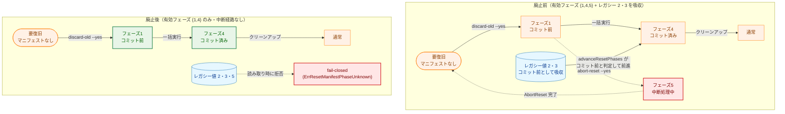
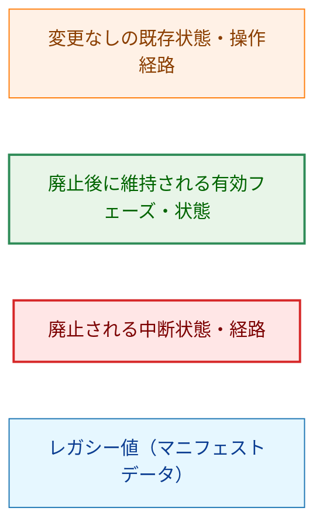
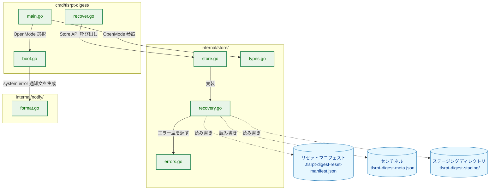
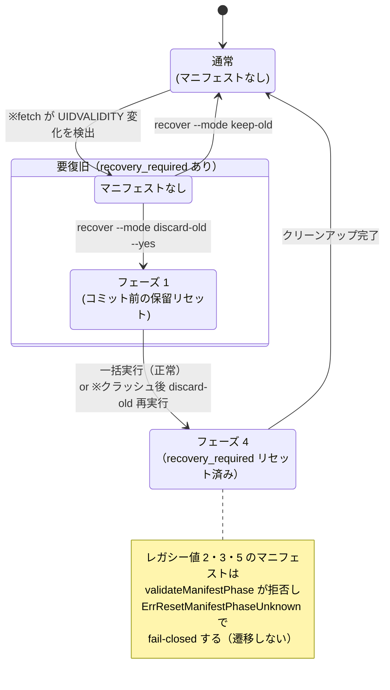
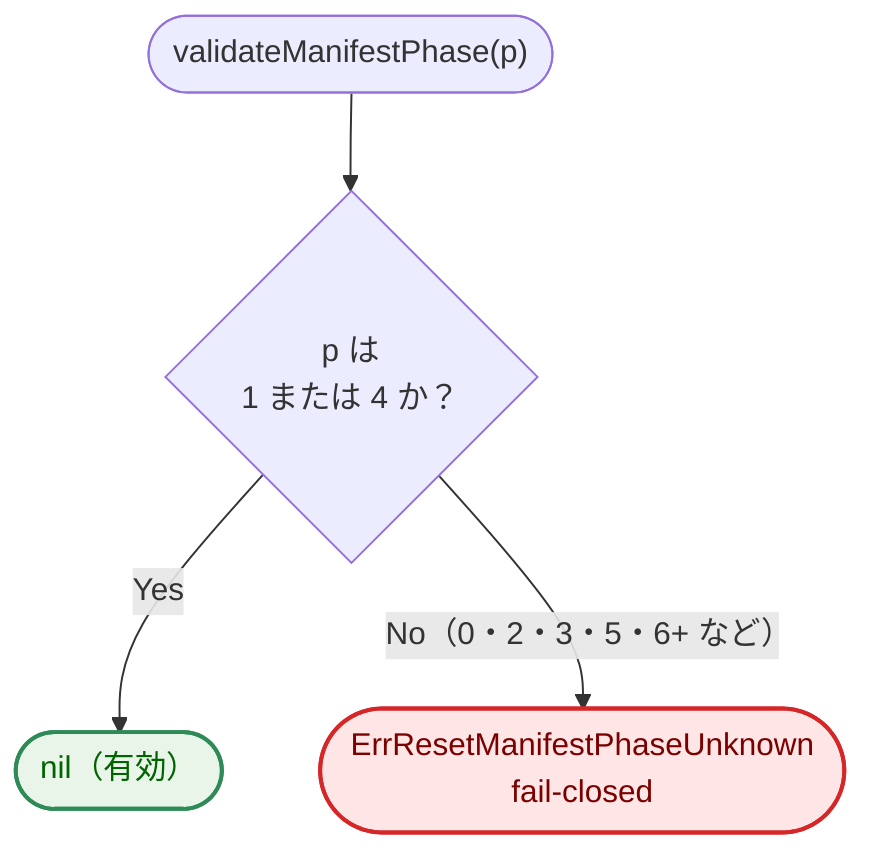
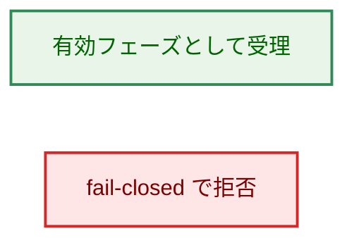
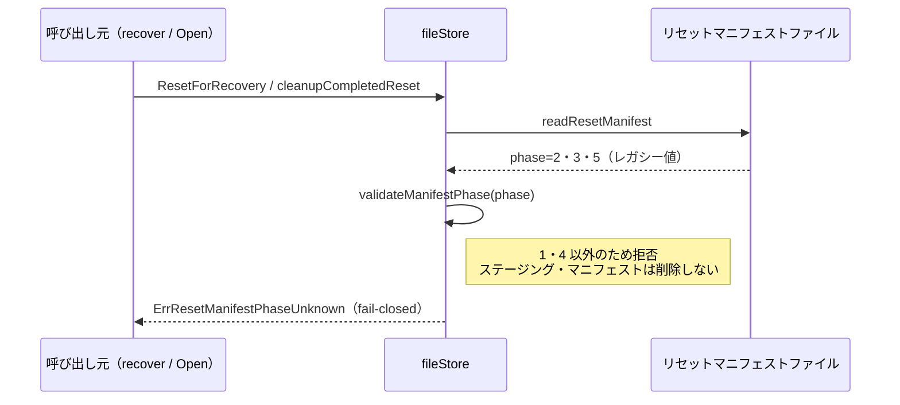
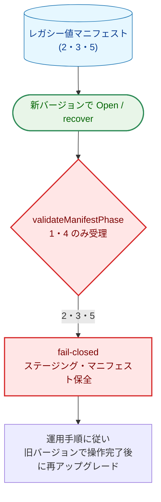
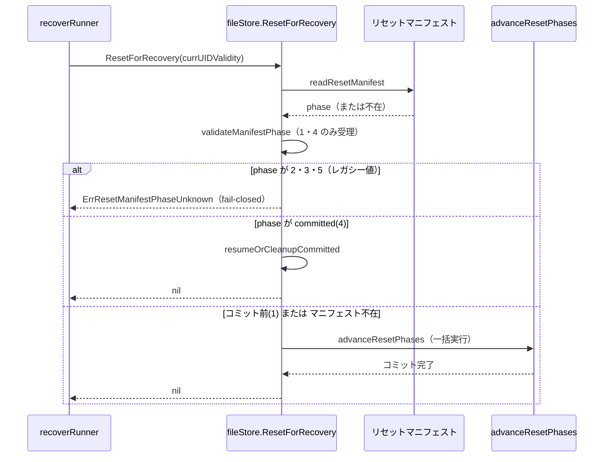

# アーキテクチャ設計書：AbortReset・フェーズ 5 の廃止およびフェーズ 2・3 フォールバックの削除

## ドキュメントステータス

| 項目 | 内容 |
|---|---|
| ステータス | `draft` |
| 作成日 | 2026-05-31 |
| レビュー日 | - |
| レビュアー | - |
| コメント | - |

---

## 1. 設計の全体像

### 1.1 設計原則

- **状態空間の縮小**: 新規に書き込む `resetPhase` を `{1, 4}` の 2 値のみに確定する。task 0080 で書き込みを停止したフェーズ 2・3 に加え、`AbortReset` の中断 WAL エントリであるフェーズ 5（aborting）も廃止し、リセットの状態機械を「前進のみ」に単純化する（[01_requirements.md](01_requirements.md) §1.2 主目的）。
- **fail-closed の徹底（案 A）**: 旧バージョンが書いたフェーズ 2・3・5 のマニフェストは、自動収束させず `validateManifestPhase` で未知値として一律に拒否する。`AbortReset` 実行中にクラッシュしてからアップグレードした稀なケースでも、root に旧データが一部戻りかけた状態で誤ってコミットする危険を避け、安全側に倒す（[01_requirements.md](01_requirements.md) §1.1 調査結果 5）。
- **YAGNI / DRY**: フェーズ 5 を残すための特殊扱い（`ResetForRecovery` のフェーズ 5 拒否チェック、`HasPendingReset` の「フェーズ 4 以外を真」とする実装、`restoreFromStaging` 関数）はすべて削除し、判定を単一の比較式に簡約する。`AbortReset` 専用のエラー型・CLI 経路も合わせて削除する。
- **既存数値の維持（再採番しない）**: フェーズ 1・4 の数値・意味・役割は変更しない。番号を変える積極的な理由がなく、既存ストアに残るフェーズ 1・4 マニフェストの誤読も避けられる（[01_requirements.md](01_requirements.md) §5 制約）。
- **運用での移行担保**: コード側で後方互換を持たない代わりに、フェーズ 2・3・5 のマニフェストが残存するストアは「アップグレード前に旧バージョンで該当操作を完了させる」運用手順をドキュメントに明記して移行を担保する（[01_requirements.md](01_requirements.md) §4 後方互換性）。

### 1.2 用語

本ドキュメントでは次の用語を一貫して用いる。英語のコード識別子は初出時のみ括弧で補足する。

| 用語 | 意味 |
|---|---|
| 有効フェーズ | 廃止後に `validateManifestPhase` が受理する値。本タスク完了後は `{1, 4}` の 2 値のみ。 |
| コミット前 | フェーズ 1。センチネル確定前で、冪等な再実行によりコミットへ進められる状態。廃止後はフェーズ 1 のみがこのカテゴリに属する。 |
| レガシー値 | 旧バージョンが書いたフェーズ 2・3・5。本タスク完了後は新規に書かず、読み取り時も受理せず fail-closed する。 |
| fail-closed | 不明・非対応のマニフェストを検出したとき、ステージングやマニフェストを削除せず保全し、エラーを返してオペレーターの手動対応を促す挙動。 |
| 保留リセット | マニフェストが残っており、通常の読み書きを進める前にリセット完了が必要な状態。`HasPendingReset()` が真を返す。 |
| 中断機能 | `AbortReset`（`recover --abort-reset --yes`）。コミット前リセットを取り消し旧データを復元する機能。本タスクで廃止する。 |

### 1.3 コンセプトモデル

本タスクの本質は、リセットの状態機械から「中断（abort）」の経路とレガシー後方互換の読み取り経路を取り除き、有効フェーズを `{1, 4}` の前進のみに確定することである。下図は廃止前後の状態機械を対比する。

この図では、実線矢印 `A → B` は「通常運用で発生する状態遷移（オペレーター操作・フェーズ進行・クリーンアップ）」を表す。破線矢印 `A -.-> B` は「本タスクで廃止する遷移」を表す。`fail-closed` ノードは遷移先ではなく、当該マニフェストを検出したときにエラーを返して停止する終端的な扱いを表す。



**凡例**



---

## 2. システム構成

### 2.1 コンポーネント配置

本タスクは新規パッケージ・新規公開型を追加せず、既存コンポーネントからの削除と文言更新に終始する。実行時コードの変更は `internal/store`・`cmd/tlsrpt-digest`・`internal/notify` に閉じ、ドキュメント（ADR-0003・開発者ガイド・運用手順）を新フェーズ定義へ整合させる。

下図は本タスクで変更する実行時コードと、それらが参照する永続データを示す。実線矢印 `A → B` は「A が B の責務・定義（公開 API・型・関数）に依存する」関係を表す。破線矢印 `A -.-> B` は「A が B（永続データ）を読み書きする」関係を表す。



**凡例**


### 2.2 廃止後の状態機械

廃止後のリセット状態機械は、中断（abort）経路を持たず、有効フェーズ `{1, 4}` の前進のみで構成される。永続的にディスク上に存在する状態の遷移を表すため `stateDiagram-v2` を用いる。

矢印 `A → B` は「イベントまたは操作によって A から B へ遷移する」ことを表す。`※` 印はクラッシュまたは UIDVALIDITY 変化という例外イベントを表す。`[*]` は初期・終端状態を表す。`stateDiagram-v2` は複合状態へ `classDef` を適用できないため、色分けは行わず本節の凡例で各状態の意味を補足する。



**凡例（遷移の意味）**

- `A → B` は通常の操作または後処理による遷移を表す。
- `※` で始まる遷移ラベルは、クラッシュまたは UIDVALIDITY 変化という例外イベントを表す。

**凡例（状態の意味）**

- **通常**: マニフェストが存在せず `recovery_required` もない定常状態。
- **要復旧 / フェーズ 1**: `recovery_required` があり、コミット前マニフェストが残る保留リセット状態。`recover --mode discard-old --yes` の再実行で前進する。
- **フェーズ 4**: センチネル確定済み（`recovery_required` クリア済み）でクリーンアップ待ちの状態。`AbortReset` は廃止されたため、いずれの状態からも中断経路は存在しない。

### 2.3 マニフェストフェーズ検証フロー

`validateManifestPhase` は廃止後、有効フェーズ `{1, 4}` のみを受理し、それ以外（0・2・3・5・6 以上）をすべて `ErrResetManifestPhaseUnknown` として拒否する。下図はフェーズ値による分岐を示す。

矢印 `A → B` は処理の逐次実行・分岐を表す。



**凡例**



### 2.4 データフロー：レガシー値マニフェストの fail-closed

アップグレード後に旧バージョンが書いたフェーズ 2・3・5 のマニフェストを読み込んだ場合の流れを示す。`ResetForRecovery` と `Open(OpenReadWrite)`（`cleanupCompletedReset` 経由）のいずれの入口でも、ステージング・マニフェストを保全したまま拒否する（AC-10・AC-11）。

この図では、実線矢印 `A->>B` は同期呼び出し、破線矢印 `A-->>B` は戻り値の返却を表す。リセットマニフェストは永続データであり、`fileStore` がファイルを読み込んで検証する対象として扱う。



**凡例（シーケンス図）**: 実線矢印 `A->>B` は同期呼び出し、破線矢印 `A-->>B` は戻り値の返却を表す。`Note` はそのステップでの不変条件（ステージング・マニフェストを保全すること）を補足する。

---

## 3. コンポーネント設計

### 3.1 型・インターフェース定義

新規の公開型・インターフェースは追加しない。`Store` インターフェースから `AbortReset` メソッドを削除し、`resetPhase` の定数定義からフェーズ 5（`resetPhaseAborting`）を削除する。

```go
// Store インターフェース：AbortReset メソッドを削除（AC-01）。
// 他のメソッドのシグネチャ・意味は不変。
type Store interface {
    // ... 既存メソッド ...
    ResetForRecovery(currUIDValidity uint32) error
    // AbortReset() error  ← 削除
    HasPendingReset() (bool, error)
    // ...
}

// resetPhase の定数定義：有効フェーズは {1, 4} のみ（AC-08）。
// resetPhaseAborting (5) を削除する。
const (
    resetPhaseManifestWritten resetPhase = 1 // WAL エントリ（コミット前）
    resetPhaseCommitted       resetPhase = 4 // コミットマーカー
    // resetPhaseAborting resetPhase = 5      ← 削除
)
```

### 3.2 削除・簡約の設計判断

[01_requirements.md](01_requirements.md) §2 スコープに基づき、以下を削除・簡約する。

| 対象 | 決定 | 根拠 |
|---|---|---|
| `validateManifestPhase` の有効値域 | `{1, 4}` の **2 値の集合**で判定する（範囲 `[1,5]` を廃止） | レガシー値 2・3・5 を一律に未知値として拒否する（fail-closed）。上限 `<= 5` の範囲判定では 2・3・5 を受理してしまうため、有効 2 値の明示判定へ変更する（AC-09）。 |
| `ResetForRecovery` のフェーズ 5 拒否チェック | **削除** | フェーズ 5 は `validateManifestPhase` の段階で拒否されるため、`mfst.Phase == resetPhaseAborting` の単値比較は到達不能になり不要（AC-12）。 |
| `restoreFromStaging` 関数 | **削除** | `AbortReset` からのみ呼ばれる関数であり、廃止後は未使用になる（AC-04、`make deadcode` で検証）。 |
| フェーズ 2・3 への言及（コメント・ロジック） | **削除** | `legacy 2–3`・`phase < resetPhaseCommitted` の「2・3 を含む」旨の記述を削除する。有効フェーズが `{1, 4}` のみとなり、コミット前はフェーズ 1 だけになるため、コメント・判定とも単純化する（AC-13）。 |

### 3.2b コードは不変だが意味が簡約される項目

| 対象 | 決定 | 根拠 |
|---|---|---|
| `HasPendingReset` の判定 | `mfst.Phase != resetPhaseCommitted` を維持 | 有効フェーズ集合 `{1, 4}` への縮小により、この式は実質「フェーズ 1 のみが保留リセット」を意味する。コード変更は不要だが、フェーズ 5 を保留として扱う従来の意味づけは消える（[01_requirements.md](01_requirements.md) §4 保守性）。 |

### 3.3 CLI（`cmd/tlsrpt-digest`）からの中断機能削除

`recover --abort-reset` フラグおよび関連処理を削除する（AC-03）。具体的には次を削除・更新する。

- `main.go`: `--abort-reset` フラグ定義、`RecoverAbort` オプション、検証ロジック（`errAbortResetRequiresYes`・`errAbortAndModeExclusive`）、`recoverStoreOpenMode` の abort 分岐、`runCLI` 内の `errAbortResetRequiresYes` 分岐。
- `main.go`: `errYesRequiresModeOrAbort` の文言を `"--yes requires --mode"`（`"or --abort-reset"` を含まない）に更新する（AC-07d）。`--yes` 単独指定時に返すエラーの参照箇所も整合する。
- `recover.go`: `runAbortReset`・`printInfo` の abort 案内（「Roll back reset」行、`selectedMode = "abort-reset"`）、`executeMode` の `opts.RecoverAbort` 分岐を削除する（AC-07c）。`runAbortReset` の削除で `recover.go` 内の `errors` パッケージ利用が `errors.Is(err, store.ErrResetNotPending)` の 1 箇所のみだったため、未使用となる `import "errors"` も削除する。

`--abort-reset` フラグ定義の削除により、`recover --abort-reset --yes` を実行すると `flag.Parse` が `flag provided but not defined: -abort-reset` を返す（AC-03）。

### 3.4 エラー文言・案内文の更新

中断機能の廃止に伴い、abort への言及を operator 向け文言から削除する（AC-07）。

| 箇所 | 現在の文言（抜粋） | 更新方針 | AC |
|---|---|---|---|
| `store.ErrPendingReset`（`errors.go`） | メッセージ `"...use OpenRecoverReset to continue or abort"`、および直前のドキュメントコメント `"...resume or abort the reset"` | メッセージから `"to continue or abort"`、ドキュメントコメントから `"or abort"` を削除し、continue（再開）のみの案内にする | AC-07a |
| `boot.go` の `ErrPendingReset` ラッパー | `"...discard-old --yes to continue or recover --abort-reset --yes to roll back"` | `"recover --abort-reset --yes to roll back"` を削除する | AC-07b |
| `recover.go` の保留リセット検出メッセージ | `"  Roll back reset: ...--abort-reset --yes"` | 「Roll back reset」行を削除する | AC-07c |
| `main.go` の `errYesRequiresModeOrAbort` | `"--yes requires --mode or --abort-reset"` | `"--yes requires --mode"` に更新する。変数名が文言と矛盾するため `errYesRequiresMode` へリネームする（AC-07d は文言のみを規定するが、識別子の整合のため合わせて変更する） | AC-07d |
| `internal/notify/format.go` の `systemErrorHint` | `"Run: tlsrpt-digest recover --mode discard-old --yes (or --abort-reset --yes)"` | `"(or --abort-reset --yes)"` を削除する。これは AC-07e として、system error 通知の operator 向け案内でも abort 参照を除去する要件に対応する | AC-07e |

### 3.5 エラー型の削除

`AbortReset` 廃止により未使用となるエラー型を削除する。

| エラー型 | 削除理由 | AC |
|---|---|---|
| `ErrResetAbortInProgress` | `ResetForRecovery` のフェーズ 5 拒否でのみ使用。フェーズ 5 廃止により未使用 | AC-05 |
| `ErrResetNotPending` | `AbortReset` 専用。中断機能廃止により未使用 | AC-06 |

`ErrResetManifestPhaseUnknown`・`ErrResetManifestVersionMismatch`・`ErrPendingReset`・`ErrRecoveryRequiredMissing`・`ErrRecoveryUIDValidityMismatch` は維持する（意味・発生条件は不変、ただし `ErrResetManifestPhaseUnknown` の発生範囲はフェーズ 2・3・5 を含むよう拡大する）。

### 3.6 `systemErrorHint` への AC-07e 適用

設計調査では、`internal/notify/format.go` の `systemErrorHint` に `recover --abort-reset --yes` を案内する operator 向け文字列が残っていることを確認した。これは `formatSystemError()` から呼ばれ、UIDVALIDITY 変化・要復旧の system error 通知本文に含まれる実際の案内経路である。したがって、要件 [01_requirements.md](01_requirements.md) で追加した AC-07e に従い、この通知経路からも abort への言及を削除する。

そのため本設計では、`internal/notify/format.go` の文言更新を AC-07e に基づく必須変更として扱い、system error 通知でも廃止済みフラグを案内しない状態に揃える。

### 3.7 コンポーネント責務

| コンポーネント | 責務 | 変更種別 |
|---|---|---|
| `internal/store/recovery.go` | `resetPhaseAborting` 定数・`AbortReset` メソッド・`restoreFromStaging` 関数・`ResetForRecovery` のフェーズ 5 拒否チェックを削除。`validateManifestPhase` を有効 2 値 `{1, 4}` 判定へ変更。次のコメント・ロジックからフェーズ 2・3・5 への言及を削除する：`resetManifest` 型コメントの「Backward: → 5」「Legacy values 2 and 3」、`validateManifestPhase` コメントの「known range (1–5)」、`ResetForRecovery` コメントの「treated as phase 1」「Phase=5 (aborting) is refused」、「phase 1 or legacy 2–3」を含む各コメント（`phase < resetPhaseCommitted` 補足・`HasPendingReset` コメントの「pre-commit ... and aborting (phase 5)」など）。コミット前判定をフェーズ 1 単一の意味へ整理する。 | 変更 |
| `internal/store/store.go` | `Store` インターフェースから `AbortReset` メソッドとそのドキュメントコメントを削除。`HasPendingReset` のコメント（「pre-commit phase 1 or legacy 2–3, or aborting phase 5」）を「フェーズ 1 のみが保留」に整合。 | 変更 |
| `internal/store/types.go` | `OpenRecoverReset` のドキュメントコメントから `AbortReset` および `--abort-reset --yes` への言及を削除し、`ResetForRecovery`（discard-old --yes）のみを許可するモードである旨へ整合する。 | 変更 |
| `internal/store/errors.go` | `ErrResetAbortInProgress`・`ErrResetNotPending` を削除。`ErrPendingReset` のメッセージから `"to continue or abort"`、ドキュメントコメントから `"or abort"` を削除。 | 変更 |
| `cmd/tlsrpt-digest/main.go` | `--abort-reset` フラグ・`RecoverAbort` オプション・`errAbortResetRequiresYes`・`errAbortAndModeExclusive` を削除。`recoverStoreOpenMode` の abort 分岐と `runCLI` の関連分岐を削除。`errYesRequiresModeOrAbort` 文言を更新。 | 変更 |
| `cmd/tlsrpt-digest/recover.go` | `runAbortReset` を削除。`printInfo` の abort 案内・`executeMode` の abort 分岐を削除。 | 変更 |
| `cmd/tlsrpt-digest/boot.go` | `ErrPendingReset` ラッパーメッセージから abort 案内を削除。 | 変更 |
| `internal/notify/format.go` | `systemErrorHint` の operator 向けアクション案内から `(or --abort-reset --yes)` を削除し、system error 通知でも AC-07 を満たす。通知先やペイロード構造は変更しない。 | 変更 |
| `internal/store/testutil/mocks.go` | テスト支援コードとして `FakeStore` 構造体とそのメソッド群を更新する。具体的には `AbortReset()` メソッド、`AbortResetErr` フィールド、`AbortResetCallCount` フィールド、および abort 用の `PendingReset` 関連記述を削除し、`Store` インターフェース変更に追従させる。 | 変更 |
| `internal/store/recovery_test.go` | `TestAbortReset_*` 全件、`TestResetForRecovery_RefusesAbortingPhase`、フェーズ 2・3 レガシー再開テスト群を削除。レガシー値 2・3・5 の fail-closed テストを追加。`TestValidateManifestPhaseRange`・`TestResetPhasePersistedNumericValues` を新定義へ更新。 | 変更 |
| `cmd/tlsrpt-digest/recover_test.go` | `TestRecover_AbortReset*` を削除。`TestRecover_YesAlone` のメッセージアサーションを更新。 | 変更 |
| `internal/store/store_test.go` | フェーズ 3 のレガシーマニフェストを植えてコミット前ブロック挙動を検証している箇所（`TestOpen_PendingReset_*`、現状 `resetPhase(3)`）を、植え込み値をフェーズ 1 に変更してコミット前挙動の検証を維持する。フェーズ 3 が fail-closed になる検証は §3.7 のフェーズ 2・3 fail-closed テスト（AC-10）で担うため、本ファイルのレガシー前提を整理する。 | 変更 |
| `cmd/tlsrpt-digest/main_test.go` | `recoverStoreOpenMode` を検証する `TestRunCLI_RecoverResetOpenMode` の「abort reset confirmed」ケース（`-abort-reset -yes`）を削除する。abort 関連のフラグ検証テストがあれば整合する。`--abort-reset` フラグ削除後に `recover --abort-reset --yes` が `flag.Parse` でエラーになることの検証を追加（AC-03）。 | 変更 |
| `cmd/tlsrpt-digest/boot_test.go` | `ErrPendingReset` ラッパーが `"recover --abort-reset --yes"` を含むことを検証するアサーション（`TestBootstrap_*`）を、abort 文言なしへ更新する（AC-07b）。 | 変更 |
| `docs/dev/adr/0003_reset_phase_design.ja.md` / `.md` | 新フェーズ定義 `{1, 4}` への全面整合。具体的には：フェーズ一覧表のフェーズ 2・3・5 行削除（AC-14）、「フェーズ 5（recovery_required リセットマーカー）を設ける理由」節の削除/「廃止の経緯」化（AC-15）、状態遷移図の P5 ノード・P1→P5・P5→RR 削除（AC-16）、不変条件表のフェーズ 5 行削除（AC-17）、ユーザー操作表の `recover --abort-reset --yes` 列削除/更新（AC-18）。加えて、要件で個別列挙されていない次の波及箇所も整合する：§1 要件表の AC-abort 行、§2 ステージングディレクトリ説明文中の `AbortReset` 言及、§7「将来の変更・拡張方針」の「`AbortReset` の中断ロジックが複雑になる場合」サブ節および「フェーズを追加する場合」手順の `{1,4,5}`・`AbortReset` 言及、§8 の `AbortReset` 言及、§9 関連ファイル表の `AbortReset`・`ErrResetNotPending`・`ErrResetAbortInProgress` 言及。英語版は `/mktrans` で反映（AC-19）。 | 変更 |
| `docs/dev/developer_guide/process_locking.ja.md` / `.md` | `AbortReset`・`--abort-reset`・`resetPhase 1–5` への言及を削除し、フェーズ集合 `{1, 4}` に整合する。具体的には、対象サブコマンド一覧の `recover` 説明から `--abort-reset` を削除し、契約節とチェックリスト節の `recover --mode discard-old --yes / recover --abort-reset --yes` を `recover --mode discard-old --yes` のみに更新する。`.md` は `/mktrans` で反映。 | 変更 |
| `docs/operations/legacy_reset_manifest_upgrade.ja.md` | 新規運用手順書として、フェーズ 2・3 残存ストアでは旧バージョンで `recover --mode discard-old --yes` を完了してからアップグレードする手順、フェーズ 5 残存ストアでは旧バージョンで `AbortReset` を完了してからアップグレードする手順を記載する。英語版は `/mktrans` で反映する。 | 新規追加 |

---

## 4. エラーハンドリング設計

新規エラー型は追加しない。本タスクは既存エラー型の削除と発生条件の整理が中心である。

| エラー型 | 廃止後の発生条件 | 本タスクでの扱い |
|---|---|---|
| `ErrResetManifestPhaseUnknown` | マニフェストのフェーズが `{1, 4}` 以外（0・2・3・5・6 以上） | 維持。発生範囲をフェーズ 2・3・5 を含むよう拡大（fail-closed）。 |
| `ErrPendingReset` | コミット前マニフェスト（フェーズ 1）に対し `Open(OpenReadWrite)` | 維持。文言から abort 案内を削除（AC-07a）。 |
| `ErrResetManifestVersionMismatch` | マニフェストの `version` が非対応 | 維持（不変）。 |
| `ErrResetAbortInProgress` | （フェーズ 5 拒否） | **削除**（AC-05）。 |
| `ErrResetNotPending` | （`AbortReset` 専用） | **削除**（AC-06）。 |

**エラーメッセージ設計パターン**: 削除後の operator 向け案内は「リセットは前進のみ（`recover --mode discard-old --yes` で再開）」に統一し、中断（roll back / abort）の選択肢を提示しない。フェーズ 2・3・5 を検出した場合は `ErrResetManifestPhaseUnknown` で fail-closed し、案内文ではなく運用手順ドキュメント（§3.7）への対応を促す。フェーズ番号は `Got` フィールドに含めて手動調査の手掛かりとする（既存実装どおり）。

---

## 5. セキュリティ考慮事項

本タスクは通知の送信経路・通知先・Notifier の型制約を変更しないが、`internal/notify/format.go` の `systemErrorHint` に含まれる operator 向け案内文字列は更新対象である。これは静的なアクション案内から廃止済みフラグを削除するだけであり、webhook URL・送信先・通知ペイロード構造・redaction 方針には影響しない。そのため、[通知セキュリティガイドライン](../../dev/developer_guide/notification_security.md)の「通知経路には公開情報だけを流す」という原則に反する変更は生じない。

一方、本タスクは複数プロセスが同一の永続データ（センチネル・マニフェスト・ステージング）を読み書きする経路と、クラッシュ耐性に関わるため、[プロセス間ロック設計ガイドライン](../../dev/developer_guide/process_locking.md)に従い以下を不変条件として維持する。

### 5.1 プロセス間ロック（不変条件の維持）

- `commitReset` はセンチネルの `recovery_required` クリアを `withGuardExclusive`（排他 flock）下で実行し、summary プロセスの共有ロック読み取りと直列化する。本タスクは `commitReset` 内部を変更しないため、この直列化は保たれる。
- store-wide process lock の対象サブコマンドから `recover --abort-reset` が消えるが、`recover`（`--mode keep-old` / `discard-old`）は引き続き対象であり、ロック取得契約は変わらない。`process_locking.ja.md` / `.md` の記述を `{1, 4}` および中断機能なしへ整合する（AC-20）。

### 5.2 クラッシュ耐性（脅威モデル）

ここでの「脅威」はプロセスクラッシュ・電源断による部分適用と、**アップグレードに伴うバージョン間の状態不整合**である。中断機能の廃止により新たに考慮すべきは「旧バージョンで `AbortReset` 実行中（フェーズ 5、または root への復元途中）にクラッシュし、その後アップグレードしたストア」である。

下図は、アップグレード後にレガシー値マニフェストを検出したときの安全な停止（fail-closed）を示す。矢印 `A → B` は処理の逐次実行・分岐を表す。ノードはコンポーネント名ではなく、脅威モデルを説明するための状態・判定として読む。



**凡例**


**案 B（自動収束）を採らない理由**: フェーズ 5 を「コミット前」として扱い `advanceResetPhases` で discard-old に収束させると、旧コードが `restoreFromStaging` でファイルを root に戻しかけている状態では root に旧データが一部残ったままステージング・コミットが行われ、データ破損の危険がある。fail-closed（案 A）は、この稀なケースで operator の手動対応を要求する代わりにデータ破損を確実に避ける（[01_requirements.md](01_requirements.md) §1.1 調査結果 5）。

フェーズ 1・4 からのクラッシュ収束（コミット前の冪等再実行、コミットウィンドウクラッシュのセンチネル判定）は ADR-0003 の既存設計どおりで、本タスクでは変更しない。

---

## 6. 処理フロー詳細

### 6.1 `ResetForRecovery` の前進フロー（F-001・F-002）

廃止後の `ResetForRecovery` はフェーズ 1 のコミット前マニフェスト（または新規開始）からフェーズ 4 へ一括で前進する。フェーズ 5 拒否チェックが削除され、有効でないフェーズは入口の `validateManifestPhase` で fail-closed する。



**凡例（シーケンス図）**: 実線矢印 `A->>B` は同期呼び出し、破線矢印 `A-->>B` は戻り値の返却を表す。`alt`/`else` ブロックはマニフェストのフェーズ値による分岐を示す。

### 6.2 `Open(OpenReadWrite)` 経由のレガシー値検出（AC-11）

`Open(OpenReadWrite)` は `cleanupCompletedReset` を呼び、その内部で `validateManifestPhase` を通す。フェーズ 2・3・5 はここで `ErrResetManifestPhaseUnknown` を返し、Open 自体が失敗する（ステージング・マニフェストは削除されない）。この経路は §2.4・§5.2 の fail-closed と同一の挙動である。

### 6.3 CLI 検証フローの簡約（AC-03・AC-07d）

`validateFlags`（`recover` サブコマンド）から abort 関連の検証分岐を削除し、`--yes` は `--mode` を要求するのみとなる。`--abort-reset` フラグ自体が未定義になるため、指定すると `flag.Parse` がエラーを返し `validateFlags` に到達しない。

---

## 7. テスト戦略

### 7.1 単体テスト（`internal/store`）

| 観点 | 対応 AC | 概要 |
|---|---|---|
| インターフェース削除 | AC-01・AC-02 | `Store` インターフェース・`fileStore` から `AbortReset` が消えていること（コンパイル時保証＋フェイクストア整合）。 |
| フェーズ定数削除 | AC-08 | `resetPhaseAborting` が定義されていないこと。`TestResetPhasePersistedNumericValues` から該当アサーションを削除。 |
| 有効値域 | AC-09 | `TestValidateManifestPhaseRange` を更新し、`{1, 4}` のみ有効・0・2・3・5・6 以上は `ErrResetManifestPhaseUnknown` を確認。 |
| フェーズ 2・3 の fail-closed | AC-10 | フェーズ 2・3 マニフェスト存在下で `ResetForRecovery`・`Open(OpenReadWrite)` が `ErrResetManifestPhaseUnknown` を返し、ステージング・マニフェストを削除しないことを検証するテーブル駆動テストを `recovery_test.go` に追加する。 |
| フェーズ 5 の fail-closed | AC-11 | フェーズ 5 マニフェスト存在下で `ResetForRecovery`・`Open(OpenReadWrite)` が `ErrResetManifestPhaseUnknown` を返し、ステージング・マニフェストを削除しないことを検証するテストを `recovery_test.go` に追加する。`TestResetForRecovery_RefusesAbortingPhase` は削除し、この fail-closed テストへ置換する。 |
| フェーズ 5 単値比較の消失 | AC-12 | `ResetForRecovery` の経路に `resetPhaseAborting` 比較が存在しないこと（コードレビュー＋上記 fail-closed テスト）。 |
| エラー型削除 | AC-05・AC-06 | `ErrResetAbortInProgress`・`ErrResetNotPending` が参照されないこと（コンパイル＋`deadcode`）。 |
| restoreFromStaging 削除 | AC-04 | `make deadcode` で新たな未使用関数が検出されないこと。 |

削除対象テスト（`TestAbortReset_*`、フェーズ 2・3 レガシー再開テスト群）は §3.7・[01_requirements.md](01_requirements.md) §6 に従う。

### 7.2 統合テスト（`cmd/tlsrpt-digest`）

| 観点 | 対応 AC | テスト箇所 | 概要 |
|---|---|---|---|
| フラグ削除 | AC-03 | `main_test.go` | `recover --abort-reset --yes` が `flag.Parse` でエラー（`flag provided but not defined: -abort-reset`）になることを検証する。`TestRunCLI_RecoverResetOpenMode` の abort ケースを削除する。 |
| 文言更新 | AC-07d | `recover_test.go` | `TestRecover_YesAlone` のエラーメッセージが `--yes requires --mode`（`or --abort-reset` を含まない）であること。 |
| boot ラッパー文言 | AC-07b | `boot_test.go` | `ErrPendingReset` ラッパーが `"recover --abort-reset --yes"` を含まないこと。 |
| recover 案内削除 | AC-07c | `recover_test.go` | `recover.go` 保留リセット案内に「Roll back reset」等の abort 言及がないこと。 |
| notify 案内削除 | AC-07e | `internal/notify/format_test.go` | `systemErrorHint` を含む system error 通知整形結果が `--abort-reset` を含まないことを検証し、operator 向け案内の通知経路で AC-07e が満たされることを確認する。 |
| operator 案内の横断確認 | AC-07・AC-07e | リポジトリ横断検索 | `--abort-reset`、`Roll back reset`、`to continue or abort` を検索し、実装対象の operator 向け案内から不要な abort 参照が残っていないことを確認する。特に `errors.go`、`boot.go`、`recover.go`、`main.go`、`internal/notify/format.go`、`process_locking.ja.md` / `.md` を対象にする。 |
| フェイクストア整合 | AC-01 | `internal/store/testutil/mocks.go` | `FakeStore` から `AbortReset` 関連が削除され、ビルドが通ること。 |

### 7.3 ドキュメント整合（F-003・F-004）

| 観点 | 対応 AC | 概要 |
|---|---|---|
| ADR フェーズ表 | AC-14 | フェーズ 2・3・5 行が削除されていること（ja/en）。 |
| ADR 設計根拠 | AC-15 | フェーズ 5 設計根拠節が削除または「廃止の経緯」へ更新。 |
| ADR 状態遷移図 | AC-16 | P5 ノード・P1→P5・P5→RR が削除されていること。 |
| ADR 不変条件表 | AC-17 | フェーズ 5 行が削除されていること。 |
| ADR ユーザー操作表 | AC-18 | `recover --abort-reset --yes` 列が削除/更新されていること。 |
| ADR 英語版反映 | AC-19 | `/mktrans` で日本語版から反映（直接編集しない）。 |
| process_locking 整合 | AC-20 | `docs/dev/developer_guide/process_locking.ja.md` / `.md` の対象サブコマンド一覧、契約節、実装・レビュー時チェックリストから `--abort-reset` と `AbortReset` を除去し、`recover --mode discard-old --yes` のみが `OpenRecoverReset` を使う記述へ更新されていること。 |
| 運用手順（フェーズ 2・3） | AC-21 | `docs/operations/legacy_reset_manifest_upgrade.ja.md` に、旧バージョンで `recover --mode discard-old --yes` を完了してからアップグレードする手順が記載されていること。 |
| 運用手順（フェーズ 5） | AC-22 | `docs/operations/legacy_reset_manifest_upgrade.ja.md` に、旧バージョンで `AbortReset` を完了してからアップグレードする手順が記載されていること。 |

セキュリティ観点のテスト: 本タスクの主なセキュリティ関心事は §5.2 のアップグレード時 fail-closed であり、専用テストは設けず AC-10・AC-11（fail-closed でステージング・マニフェストを保全）が代表的な検証となる。

---

## 8. 実装の優先順位

### フェーズ 1：ストア層のコア削除（`internal/store`）

1. `resetPhaseAborting` 定数・`AbortReset` メソッド（インターフェース＋実装）・`restoreFromStaging` を削除する。
2. `validateManifestPhase` を有効 2 値 `{1, 4}` 判定へ変更し、`ResetForRecovery` のフェーズ 5 拒否チェックを削除する。
3. `ErrResetAbortInProgress`・`ErrResetNotPending` を削除し、`ErrPendingReset` 文言から abort を削除する。フェーズ 2・3 言及をコメント・ロジックから削除する。

### フェーズ 2：CLI・通知層の削除と文言更新（`cmd/tlsrpt-digest`・`internal/notify`）

1. `--abort-reset` フラグ・検証・`recoverStoreOpenMode` の abort 分岐を削除し、`internal/notify/format.go` を含む operator 向け案内の全経路から abort 文言を除去する。
2. `recover.go`・`boot.go` の abort 案内文を削除し、`errYesRequiresModeOrAbort` を更新する。
3. `internal/notify/format.go` の `systemErrorHint` から abort 案内を削除し、通知経路でも AC-07 を満たすことをテストで確認する。

### フェーズ 3：テスト整合（`internal/store`・`cmd/tlsrpt-digest`）

1. abort 関連テスト・フェーズ 2・3 レガシー再開テストを削除し、フェイクストアを整合する。
2. フェーズ 2・3・5 の fail-closed テストを新規追加し、`TestValidateManifestPhaseRange`・`TestResetPhasePersistedNumericValues`・`TestRecover_YesAlone` を更新する。
3. テスト・整形（`make fmt`）・静的検査（`make lint`・`make deadcode`）を通す。

### フェーズ 4：ドキュメント改訂（ADR-0003・開発者ガイド・運用手順）

1. ADR-0003 日本語版を新フェーズ定義 `{1, 4}` へ改訂する（フェーズ表・設計根拠・状態遷移図・不変条件表・ユーザー操作表）。
2. `process_locking.ja.md` の対象サブコマンド一覧・契約節・チェックリストから `--abort-reset` と `AbortReset` を除去し、`docs/operations/legacy_reset_manifest_upgrade.ja.md` にアップグレード前手順を追加する。
3. `/mktrans` で英語版（ADR・process_locking）へ反映する。

---

## 9. 将来の拡張性

- **中断機能の再導入が必要になった場合**: フェーズ 5 の数値（5）は削除されるが、再採番はしないため、再導入時は値の衝突を避けて新しい数値（既存最大値 + 1）を割り当て、`validateManifestPhase` の有効集合を更新する。ADR-0003 §7 の拡張方針を本タスクの改訂で同期させる。中断クラッシュの曖昧性回避（中断 WAL エントリ）という設計根拠は ADR の改訂版に「廃止の経緯」として残し、再導入時の参照とする。
- **フェーズ追加時の検証**: 有効フェーズが集合 `{1, 4}` の明示判定になるため、フェーズを追加する際は `validateManifestPhase` の集合に明示的に値を加える。範囲判定ではないため、追加漏れがコンパイル時には検出されない点に注意する。
- **ストレージ技術の移行**: ファイルベース設計からの移行は ADR-0003 §8 で別途検討済みであり、本タスクのスコープ外である。状態空間の縮小（`{1, 4}` のみ）はその検討の前提を変えない。

---

## 設計上の前提・確認事項

1. **`internal/notify/format.go` への AC-07 適用**: `systemErrorHint` は実際の operator 向け案内経路であるため、abort 文言削除の対象に含める。これにより、system error 通知でも廃止済みフラグを案内しないことを保証する。
2. **運用手順ドキュメントの配置**: AC-21・AC-22 を満たすため、`docs/operations/legacy_reset_manifest_upgrade.ja.md` を新規作成し、フェーズ 2・3・5 の残存ストアに対するアップグレード前手順を集約する。英語版は `/mktrans` で反映する。
3. **テストフェイクの所在**: fake store の実体は `internal/store/testutil/mocks.go` に集約されているため、インターフェース変更の追従先はこのファイルとして扱う。
