# アーキテクチャ設計書：greenmail を使った IMAP 統合テスト

## ドキュメントステータス

| 項目 | 内容 |
|---|---|
| ステータス | `draft` |
| 作成日 | 2026-06-02 |
| レビュー日 | - |
| レビュアー | - |
| コメント | - |

---

## 1. 設計の全体像

### 1.1 設計原則

- **本番コードの変更を最小化する**: 本番の振る舞いに影響する変更は `internal/imap.Config` への `InsecureSkipVerify` フィールド追加と `buildTLSConfig` への反映のみに限定する。`internal/config.IMAPConfig` や TOML 設定キーには追加せず、本番の設定構築経路（`buildIMAPConfig`）はこのフィールドを設定しない。なお、既存の `internal/imap/client_test.go` は `buildTLSConfig` の出力 `tls.Config.InsecureSkipVerify == false`（ゼロ値）を assert しており、本フィールドの追加後もゼロ値動作の互換性テストとして有効であるが、`InsecureSkipVerify: true` の場合のテストケースを新たに追加する必要がある（AC-01）。
- **テスト専用設定はテストコードから注入する**: greenmail への接続に必要な `InsecureSkipVerify: true` は本番コード・設定ファイルから設定せず、テストコードに限定する。単体テストでは `buildTLSConfig` のフィールド反映を直接検証し、統合テストでは `imap.Config` の組み立てまたは `fetchRunner.newMailFetcher` の差し替え（依存注入）を通じて注入する。
- **ビルドタグによる分離**: すべての統合テストに `//go:build integration` タグを付与し、通常の `go test ./...` では一切ビルド・実行されないようにする。
- **既存コンポーネントの再利用**: `imapClient`・`fetchRunner`・`recoverRunner`・`Bootstrap`・`store` を再利用し、テスト専用のロジックを新規実装しない。メールボックスの管理操作（`CREATE`/`DELETE`/`APPEND`）は `MailFetcher` 抽象の対象外であるため、依存ライブラリ `emersion/go-imap` のクライアントをテストヘルパー内で直接利用する。
- **環境変数駆動**: greenmail の接続情報はすべて環境変数から取得し、テストコードにハードコードしない。

### 1.2 コンセプトモデル

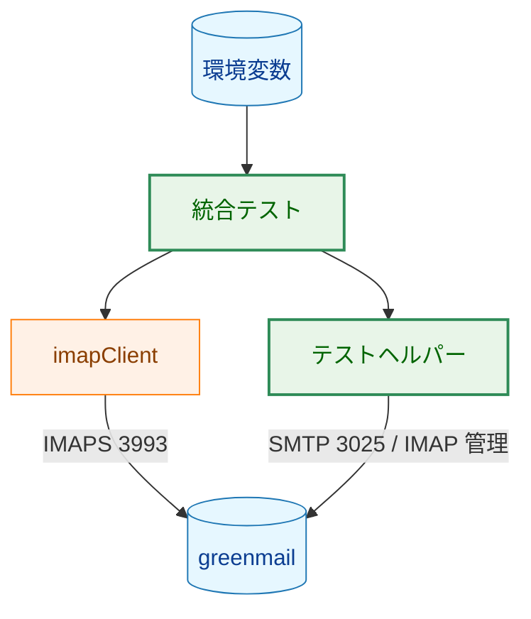

**凡例**

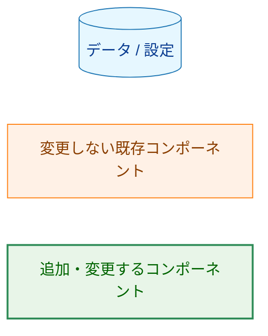

上の図において、矢印 `A → B` は「A が B を呼び出す、または B へデータを供給する」ことを表す。

---

## 2. システム構成

### 2.1 全体アーキテクチャ

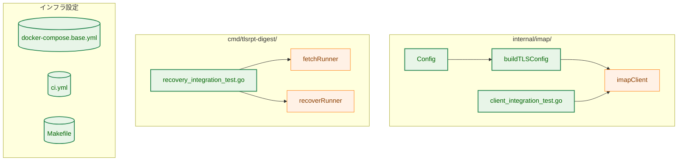

矢印 `A → B` は「A が B を利用・依存する」ことを表す。`internal/config`（IMAPConfig・TOML）はこの機能では変更しないため図に含めない。

**凡例**

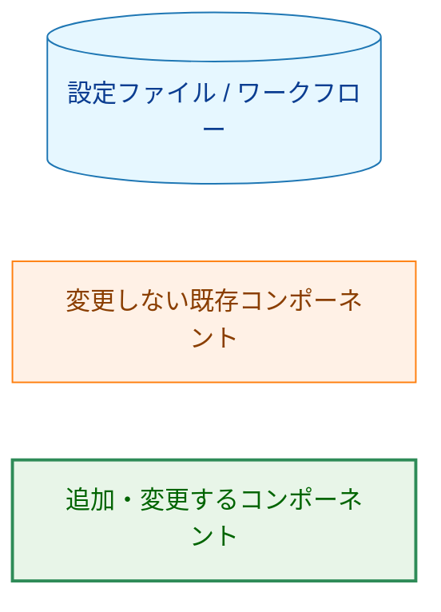

### 2.2 テスト接続トポロジー

統合テストの実行環境は devcontainer と GitHub Actions の 2 つがあり、greenmail への到達経路が異なる。

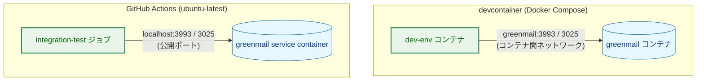

矢印 `A → B` は「A が B へ TCP 接続する」ことを表し、ラベルは接続先ホスト/ポートと到達経路を示す。

**凡例**

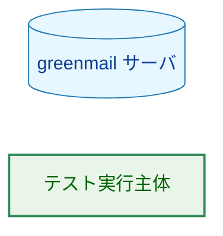

- **devcontainer**: `dev-env` と `greenmail` は同一 Docker ネットワーク上にあり、ホスト名 `greenmail` で直接到達できる。ポートのホスト公開は不要。
- **GitHub Actions**: `ubuntu-latest` ランナーホスト上で直接実行されるジョブからは service container にホスト名で到達できないため、`3993`・`3025` をホストに公開し `localhost` で接続する。

### 2.3 コンポーネント配置

| ファイル | 区分 | 責務 |
|---|---|---|
| `internal/imap/imap.go` | 変更 | `Config` 構造体に `InsecureSkipVerify bool` フィールドを追加する |
| `internal/imap/client.go` | 変更 | `buildTLSConfig` が `Config.InsecureSkipVerify` を `tls.Config.InsecureSkipVerify` へ反映する |
| `internal/imap/client_test.go` | 変更 | `buildTLSConfig` の `InsecureSkipVerify` 反映とゼロ値の互換性を単体テストで確認する |
| `internal/imap/client_integration_test.go` | 変更 | 既存の雛形を拡張し、F-002・F-003 の統合テストとテストヘルパー（環境変数読み込み・SMTP 注入・メールボックス管理）を実装する |
| `cmd/tlsrpt-digest/boot_test.go` | 変更 | 本番設定構築経路 `buildIMAPConfig` が `InsecureSkipVerify` を設定しないことを単体テストで確認する |
| `cmd/tlsrpt-digest/main_test.go` | 変更 | recovery E2E テストで既存の `withCommandRunners` パターンを再利用できることを前提として保守する |
| `cmd/tlsrpt-digest/recovery_integration_test.go` | 新規 | F-004 の recovery フロー End-to-End テストを実装する |
| `.devcontainer/docker-compose.base.yml` | 変更 | `dev-env` の `IMAP_TEST_PORT` を `3993` に変更し、greenmail サービスの起動オプション（`GREENMAIL_OPTS`）に AC-05 用固定ユーザの事前登録を追加する（詳細は「6.1」を参照） |
| `.github/workflows/ci.yml` | 変更 | greenmail を service container（`3993`・`3025` をホスト公開）とする `integration-test` ジョブと、その実行可否を判定する変更検出条件を追加する。service container の `GREENMAIL_OPTS` にも AC-05 用固定ユーザの事前登録を含める |
| `Makefile` | 変更 | `test-integration` ターゲットの対象を `internal/imap/...` と `cmd/tlsrpt-digest/...` の両方に拡張する |

---

## 3. コンポーネント設計

### 3.1 `Config` の拡張（F-001）

`internal/imap.Config` にテスト専用のフィールドを 1 つ追加する。ゼロ値は `false` であり、既存の本番動作（証明書検証あり）に影響しない。

```go
// Config is the IMAP connection configuration.
type Config struct {
    Host     string
    Port     int
    Username string
    Password config.Secret
    Mailbox  string
    TLSCACert       string
    MaxMessageBytes int64

    // InsecureSkipVerify, when true, disables TLS certificate verification.
    // Intended only for integration tests against self-signed servers
    // (e.g. greenmail). Never set from production configuration paths.
    InsecureSkipVerify bool
}
```

`buildTLSConfig` は生成する `*tls.Config` の `InsecureSkipVerify` に `Config.InsecureSkipVerify` の値を設定する。`MinVersion`（TLS 1.2）や `RootCAs`（`TLSCACert` 由来）の既存挙動は変更しない。

### 3.2 テストヘルパーの責務（F-002・F-003・非機能要件）

統合テストから再利用する共通処理をヘルパーとして整理する。実装の詳細手順は `03_implementation_plan.md` で扱う。

| ヘルパー責務 | 概要 | 利用する仕組み |
|---|---|---|
| 環境変数読み込み | `IMAP_TEST_*` を読み取り `imap.Config` を構築する。必須変数が未設定なら `t.Skip()` する | `os.Getenv`・既存 `loadIntegrationConfig` の拡張 |
| SMTP 注入 | テストメッセージを受信者ユーザの INBOX へ配送する | 標準ライブラリ `net/smtp` |
| メールボックス管理 | 非 INBOX メールボックスの `CREATE`・`DELETE`、必要に応じた `APPEND` | `emersion/go-imap` クライアントを直接利用 |
| 受信者アドレス導出 | テスト名から一意かつ有効なメールアドレスを生成し、そのアドレスを SMTP 注入テスト用の IMAP `Username` と `Password` に使う。`Mailbox` は `INBOX` とする | テスト名のサニタイズ・greenmail の自動ユーザ作成規約 |

> メールボックスの `CREATE`/`DELETE`/`APPEND` は `MailFetcher` インターフェース（`FetchMeta`/`Download`/`MarkSeen`/`Close`）には含まれない。これらはテストのセットアップ・検証のための管理操作であり、本番コードの責務ではないため、`MailFetcher` を拡張せずテストヘルパー内で依存ライブラリのクライアントを直接用いる。

### 3.3 recovery E2E のテスト専用注入（F-004）

`fetchRunner` は `newMailFetcher func(cfg imap.Config) (imap.MailFetcher, error)` フィールドを持ち、本番では `imap.NewIMAPClient` が設定される。recovery E2E テストは、このフィールドに「渡された `Config` に `InsecureSkipVerify: true` を上書きしてから `imap.NewIMAPClient` を呼ぶラッパー」を設定した `fetchRunner` を用いる。これにより本番の `buildIMAPConfig` を変更せずに greenmail へ接続する。

`recoverRunner` は IMAP 接続を行わず（ストアのセンチネル操作のみ）、注入は不要である。

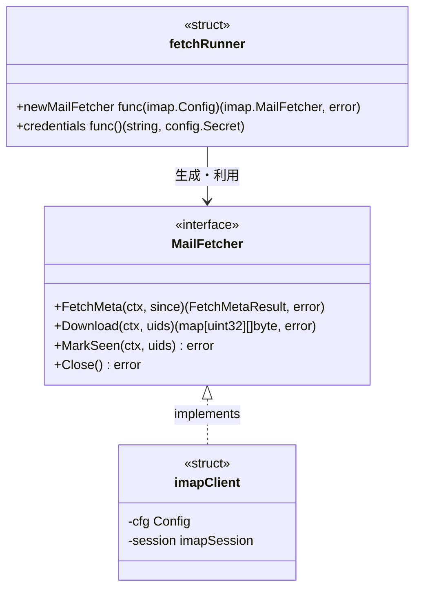

矢印の意味: `<|..` は「インターフェースを実装する」、`-->` は「生成・利用する」関係を表す。`Download` の戻り値 `map[uint32][]byte` は UID から本文バイト列への対応を表す。

**凡例**: N/A（この classDiagram は Mermaid の `classDef` による色分けノードを使用しないため、説明対象のノードクラスはない）。

### 3.4 recovery E2E の実行配線（F-004）

recovery E2E テストは `runCLI` を経由して `fetch` と `recover` のサブコマンド境界を通す。ただし greenmail の自己署名証明書を受け入れる設定は本番設定ファイルに出さないため、既存テストで使われている `withCommandRunners` パターンを用いて、テスト専用の `commandRunners` を `t.Cleanup` 付きで差し替える。

テストは一時ディレクトリ内に以下の実行環境を構成する。

| 項目 | 設計 |
|---|---|
| 設定ファイル | 一時 `config.toml` に greenmail の IMAPS 接続先、固有名の非 INBOX メールボックス、ストア root を記述する |
| IMAP 認証情報 | `fetchRunner.credentials` が読む `TLSRPT_IMAP_USERNAME`・`TLSRPT_IMAP_PASSWORD` に、固定ユーザの認証情報を設定する |
| 通知 | `fetch -dry-run` とテスト用 `BootstrapOptions.BuildNotifier` により外部通知を発生させない |
| ストア | 一時ディレクトリ上の実ストアを `BootstrapOptions.OpenStore` 経由で開く |
| IMAP 接続 | `fetchRunner.newMailFetcher` を、受け取った `imap.Config` に `InsecureSkipVerify: true` を設定してから `imap.NewIMAPClient` を呼ぶラッパーにする |
| recovery 実行 | `recover --mode keep-old` と `recover --mode discard-old --yes` は既存 `recoverRunner` を使う |

この配線により、CLI オプション解析、Bootstrap、実ストア、UIDVALIDITY の fail-closed 検出、recover サブコマンドの状態解消を End-to-End で通しつつ、TLS 検証バイパスだけを integration タグ付きテストの依存注入に閉じ込める。

---

## 4. エラーハンドリング設計

本機能は本番コードに新しいエラー型を導入しない。

- **本番コード（F-001）**: `buildTLSConfig` の既存エラー経路（`TLSCACert` の読み込み失敗・PEM 解析失敗）は変更しない。`InsecureSkipVerify` は `bool` フィールドであり、それ自体がエラーを生むことはない。
- **テストコード（F-002〜F-004）**: 検証は `stretchr/testify` の `require`/`assert` を用い、失敗はテスト失敗として表面化させる。greenmail への接続失敗・操作失敗はテストの失敗として扱い、独自のエラー型は定義しない。
- **スキップ条件（AC-04）**: 統合テストの実行に必要な環境変数が未設定の場合は `t.Skip()` で早期スキップし、テスト失敗とは区別する。必要な環境変数はテスト種別ごとに異なる（後述「6. 処理フロー詳細」）。

---

## 5. セキュリティ考慮事項

本機能のセキュリティ上の主要な懸念は「TLS 証明書検証を無効化する `InsecureSkipVerify` が本番経路に混入すること」である。N/A: 本機能は通知の送信・通知宛先の取り扱いを行わないため、`notification_security.md` は適用しない。

### 5.1 封じ込めの設計

- `InsecureSkipVerify` は `internal/imap.Config` のフィールドとしてのみ存在し、`internal/config.IMAPConfig`・TOML 設定キー・ユーザ向け設定サンプルには追加しない。設定ファイル経由で誤って有効化される経路を作らない。
- 本番の設定構築経路 `buildIMAPConfig`（`cmd/tlsrpt-digest/boot.go`）は本番における唯一の `imap.Config` 構築箇所であり、`InsecureSkipVerify` を設定しない。これを単体テスト（AC-03）で保証する。
- `InsecureSkipVerify: true` の設定はテストコードに限定する。単体テストは `buildTLSConfig` の値反映だけを検証し、実サーバへ接続する設定は `//go:build integration` タグ付きテストコードに限定する。

### 5.2 脅威モデル

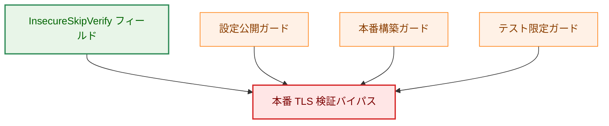

矢印 `緩和 → 脅威` は「その緩和策が当該脅威の発生を防ぐ」ことを表す。`FIELD → THREAT` は「このフィールドが脅威の起点である」ことを示す。

`設定公開ガード` は `internal/config.IMAPConfig` と TOML 設定キーに `InsecureSkipVerify` を公開しないこと、`本番構築ガード` は `buildIMAPConfig` が同フィールドを設定しないこと、`テスト限定ガード` は `InsecureSkipVerify: true` の設定箇所をテストコードに限定し、実サーバ接続での使用を integration タグ付きテストに限定することを表す。

**凡例**

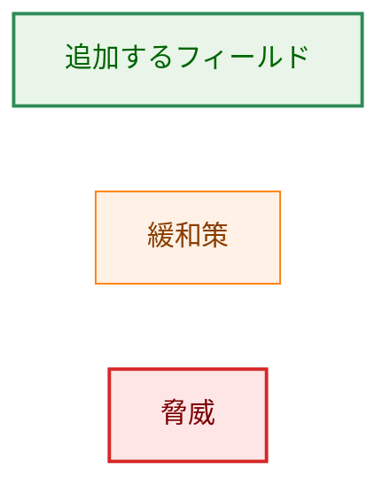

### 5.3 テスト用認証情報の扱い

greenmail はテスト専用のインメモリサーバであり、AC-05 用の固定ユーザは `IMAP_TEST_USER=imap-test@example.com`、`IMAP_TEST_PASS=imap-test` として devcontainer・CI service container にだけ設定する。SMTP 配送で自動作成されるユーザは greenmail のテスト環境内に閉じた一時ユーザであり、本番の秘密情報とは無関係である。接続情報は環境変数から取得し、テストコードにハードコードしない。

---

## 6. 処理フロー詳細

### 6.1 IMAP クライアント操作テスト（F-002）

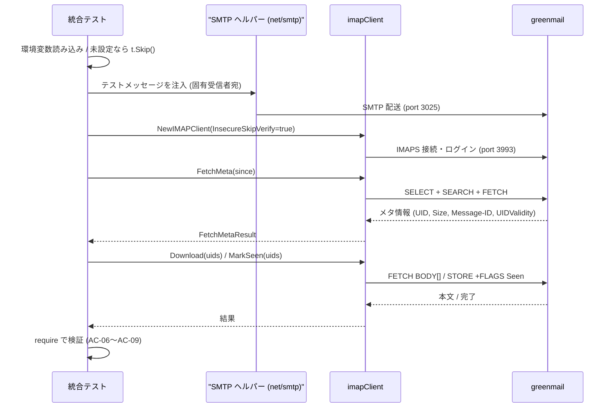

シーケンス図では実線矢印 `->>` は呼び出し、破線矢印 `-->>` は応答を表す。

**凡例**: N/A（この sequenceDiagram は Mermaid の `classDef` による色分けノードを使用しないため、説明対象のノードクラスはない）。

AC-05 は SMTP 注入を行わない固定ユーザの空 INBOX テストとして、このフローとは別に実行する。固定ユーザで `FetchMeta` を呼び、メッセージリストが空で `UIDValidity > 0` であることを確認する。

AC-06〜AC-09 の SMTP 注入テストでは、テスト名から導出した固有の受信者メールアドレスをそのまま `imap.Config.Username` と `imap.Config.Password` に設定し、`Mailbox` は `INBOX` とする。greenmail は未登録の受信者へ SMTP 配送されたメールを受け入れると、その受信者のメールボックスを自動作成し、ログイン名とパスワードを受信者アドレスに設定するため、この規則でテストごとの動的ユーザへ IMAP ログインできる。

テスト種別ごとの必須環境変数:

- 接続のみ: `IMAP_TEST_HOST`・`IMAP_TEST_PORT`
- SMTP 注入を伴う: 上記に加え `IMAP_TEST_SMTP_HOST`・`IMAP_TEST_SMTP_PORT`
- 固定ユーザで接続する（AC-05 の空メールボックスや F-003・F-004）: `IMAP_TEST_USER`・`IMAP_TEST_PASS`・`IMAP_TEST_MAILBOX`

AC-05（空メールボックス）の固定ユーザは、greenmail 2.1.3 の起動時オプションで事前登録しておく。devcontainer と GitHub Actions の greenmail service container は同じ `GREENMAIL_OPTS` を使う。

```text
-Dgreenmail.setup.test.all -Dgreenmail.hostname=0.0.0.0 -Dgreenmail.users=imap-test:imap-test@example.com -Dgreenmail.users.login=email
```

固定ユーザ用の環境変数は `IMAP_TEST_USER=imap-test@example.com`、`IMAP_TEST_PASS=imap-test`、`IMAP_TEST_MAILBOX=INBOX` とする。`-Dgreenmail.users=imap-test:imap-test@example.com` は `imap-test@example.com` のメールボックスをパスワード `imap-test` で作成し、`-Dgreenmail.users.login=email` によりログイン名をメールアドレスに揃える。`-Dgreenmail.auth.disabled` は指定せず、固定ユーザでの IMAP 認証が実際に検証されるようにする。SMTP 配送でユーザを作成すると INBOX にメッセージが残り「空である」前提が崩れるため、配送による作成には依存しない。

### 6.2 UIDVALIDITY 変化の検出と recovery フロー（F-003・F-004）

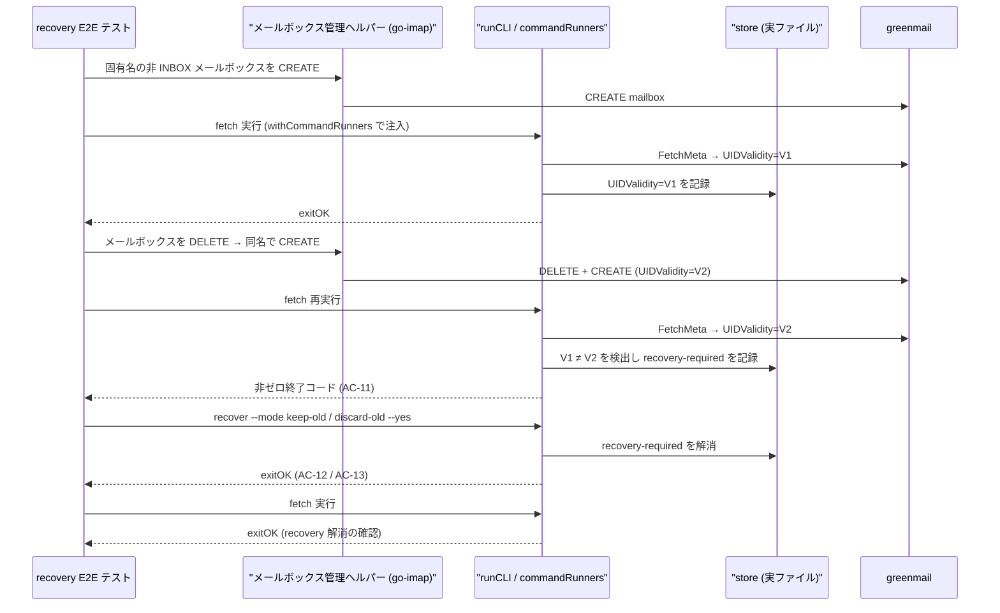

シーケンス図では実線矢印 `->>` は呼び出し、破線矢印 `-->>` は応答を表す。

**凡例**: N/A（この sequenceDiagram は Mermaid の `classDef` による色分けノードを使用しないため、説明対象のノードクラスはない）。

recovery-required の永続状態は、store のセンチネルとして表現される。状態遷移の正準な定義は ADR-0003 にあり、本テストはその遷移を実 IMAP サーバと実ストアで End-to-End に再現・検証する。

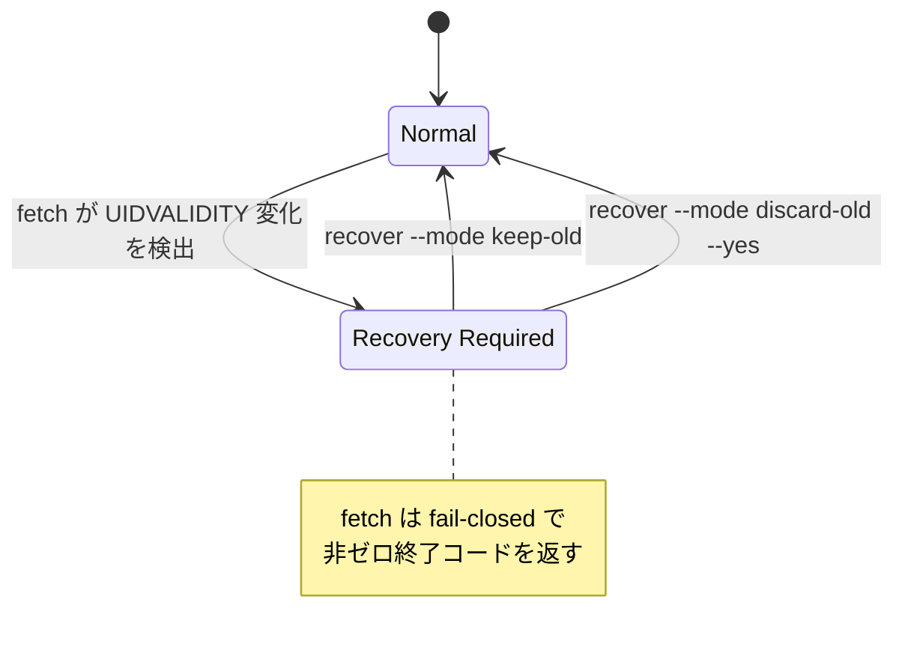

矢印 `A → B : イベント` は「イベントの発生により状態 A から B へ遷移する」ことを表す。

**凡例**: N/A（この stateDiagram は Mermaid の `classDef` による色分けノードを使用しないため、説明対象のノードクラスはない）。

### 6.3 CI における実行可否判定（F-005）

既存の `ci.yml` の変更検出（`check-changes` ジョブ）は、`.md`・`docs/`・`.devcontainer/`・`LICENSE` を「テスト不要」として除外する `has-code-changes` 判定を持つ。統合テストは `.devcontainer/` や `testdata/` の変更にも追随する必要があるため、`has-code-changes` を流用せず、`integration-test` ジョブ専用の変更検出条件を追加する。

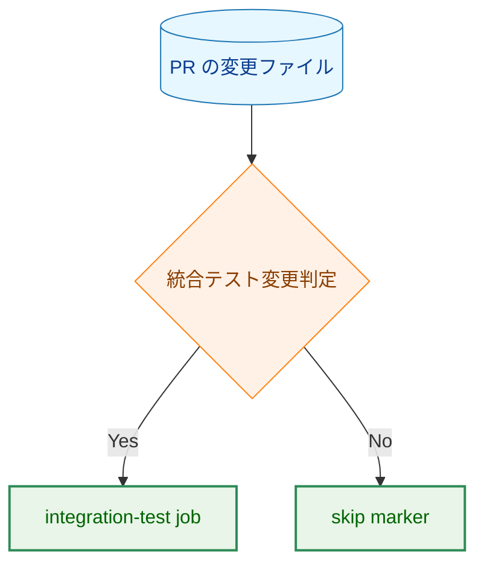

矢印 `A → B` は処理の進行（A の次に B）を表し、菱形はワークフロー上の条件分岐を表す。

判定条件は「Go ソース、Makefile、GitHub Actions workflow、`.devcontainer/`、`testdata/` のいずれかの変更を含む PR」である。

**凡例**

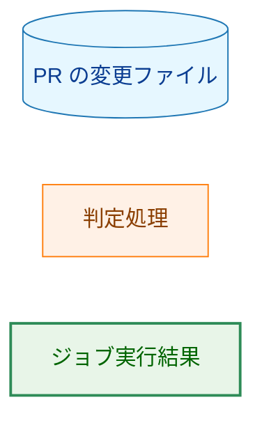

---

## 7. テスト戦略

### 7.1 単体テスト（F-001）

- `buildTLSConfig` に `InsecureSkipVerify: true` を渡すと `tls.Config.InsecureSkipVerify` が `true` になることを確認する（AC-01）。
- ゼロ値（未指定）では `false` のままで既存挙動が変わらないことを確認する（AC-02）。既存の `TestBuildTLSConfig*` への影響がないことを併せて確認する。
- 本番の `buildIMAPConfig` が `InsecureSkipVerify` を設定しないことを確認する（AC-03）。

### 7.2 統合テスト（F-002・F-003・F-004）

- `//go:build integration` タグを付与し、通常の `go test ./...` では実行されない。
- 各テストは独立して実行でき、実行順序に依存しない。分離単位は、SMTP 注入を伴うテストでは固有の受信者ユーザの INBOX、`CREATE`/`DELETE` を伴うテストでは固有名の非 INBOX メールボックスとする。
- 環境変数が未設定なら `t.Skip()` する（AC-04）。
- `internal/imap/client_integration_test.go` に F-002・F-003、`cmd/tlsrpt-digest/recovery_integration_test.go` に F-004 を配置する。

### 7.3 CI / 実行環境（F-005）

- `make test-integration` は `internal/imap/...` と `cmd/tlsrpt-digest/...` の両方を対象とする。
- GitHub Actions に greenmail を service container とする `integration-test` ジョブを追加し、通常の unit test ジョブとは分離する（AC-14・AC-15）。
- AC を保証する観点での各 AC とテストの対応付けは `03_implementation_plan.md` のトレーサビリティ節で管理する。

---

## 8. 実装の優先順位

| フェーズ | 内容 | 対応要件 |
|---|---|---|
| Phase 1 | `Config.InsecureSkipVerify` 追加・`buildTLSConfig` 反映・単体テスト | F-001 |
| Phase 2 | テストヘルパー整備（環境変数読み込み・SMTP 注入・メールボックス管理） | F-002・F-003 の前提 |
| Phase 3 | IMAP クライアント操作テスト・UIDVALIDITY 変化検出テスト | F-002・F-003 |
| Phase 4 | recovery フロー End-to-End テスト | F-004 |
| Phase 5 | devcontainer ポート変更・Makefile 拡張・CI ジョブ追加 | F-005 |

Phase 1 は他フェーズの前提（接続のための設定）であり最初に実装する。インフラ整備（Phase 5）は、テスト本体（Phase 2〜4）が devcontainer 上で動作することを確認できた後に CI へ展開する。

---

## 9. 将来の拡張性

- **実運用 IMAP サーバへのスモークテスト**: 本タスクは対象外だが、環境変数駆動の設計により接続先を差し替えるだけで実サーバへの疎通確認に応用できる。
- **証明書検証ありのテスト**: 将来 greenmail に SAN 付き証明書を用意できる場合、`TLSCACert` を用いた検証ありの接続テストへ移行でき、`InsecureSkipVerify` への依存を解消できる。
- **追加 IMAP 操作の検証**: IMAP IDLE・PUSH 方式は現状スコープ外だが、同じテストヘルパー基盤の上に追加できる。

---

## 付録A. 設計判断の履歴

- **greenmail 証明書の扱い**: 当初は greenmail の CA 証明書をリポジトリにコミットし `TLSCACert` で検証する案を検討したが、greenmail 2.1.3 の証明書には SAN がなく Go の TLS ホスト名検証を通過できないため、テスト専用に `InsecureSkipVerify` を用いる方式へ変更した。経緯の詳細は `01_requirements.md` および本タスクの PR 履歴を参照。
- **接続ポート**: devcontainer の IMAP テストポートは平文 IMAP の `3143` を使っていたが、`imapClient`（`NewIMAPClient`）は常に TLS でダイヤルするため利用できない。IMAPS の `3993` へ変更する。
