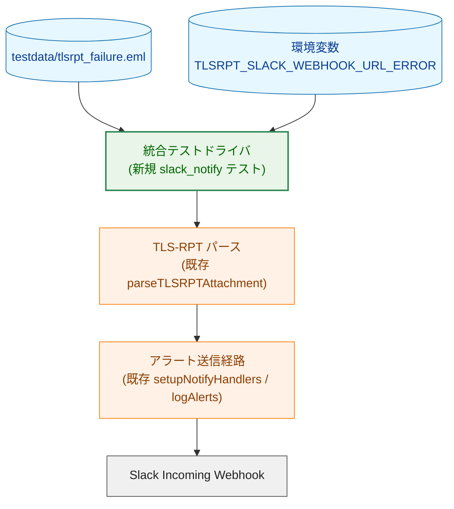
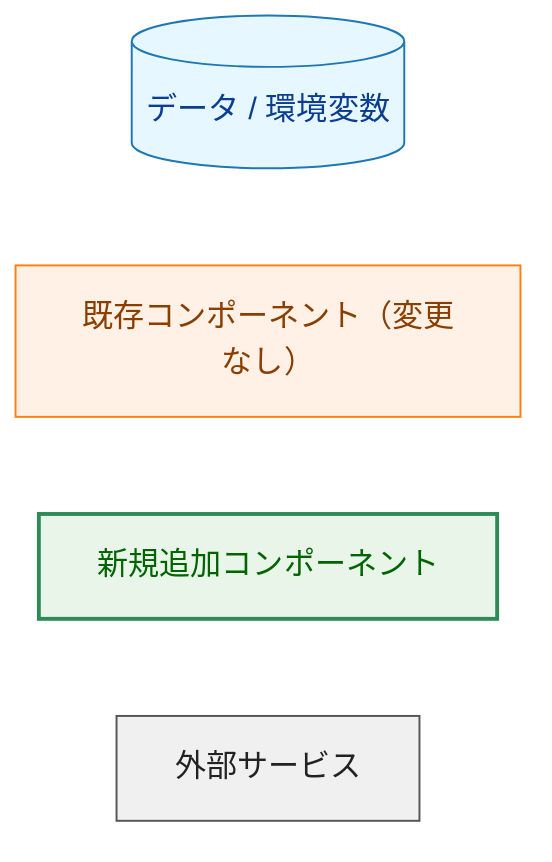
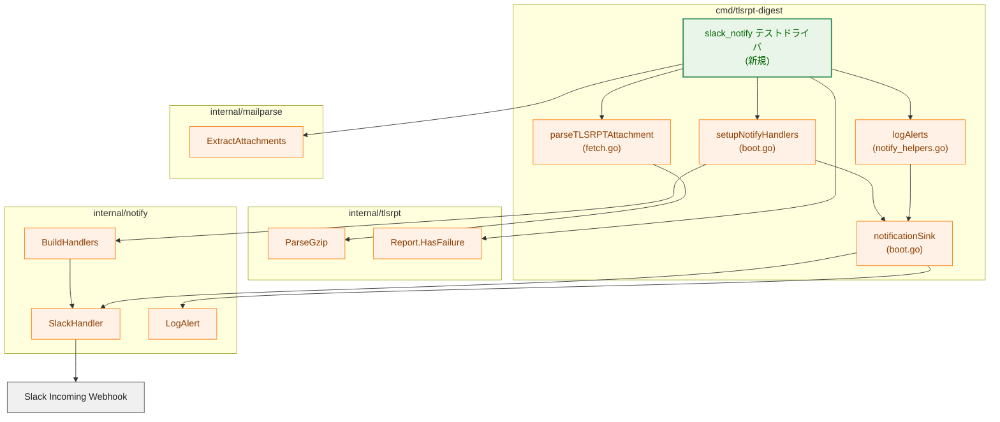
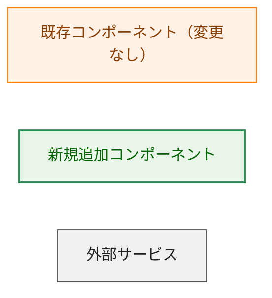
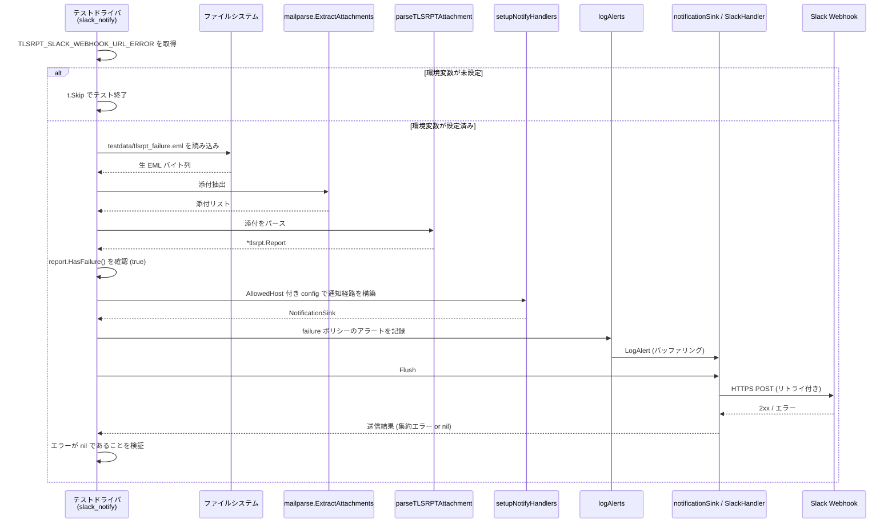
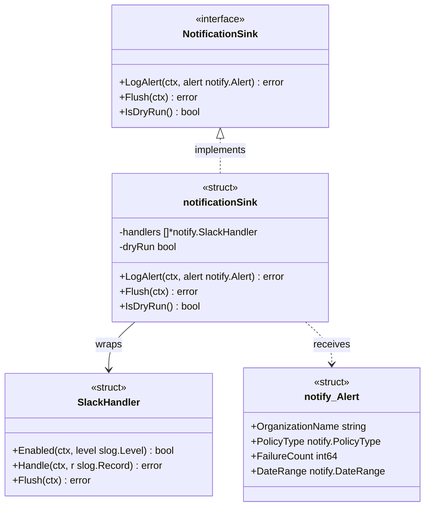
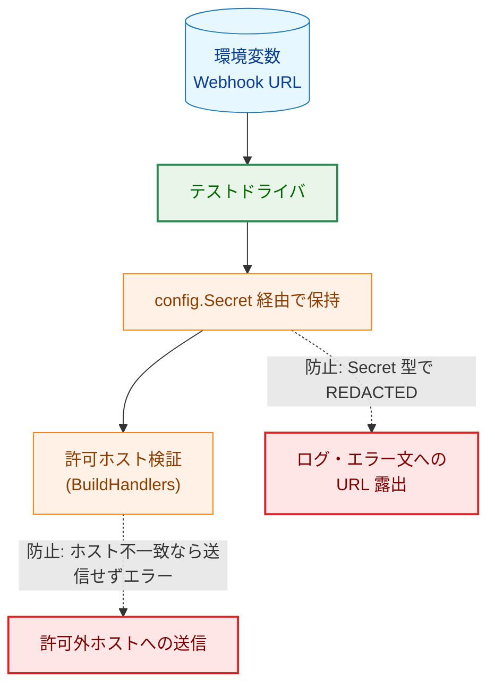
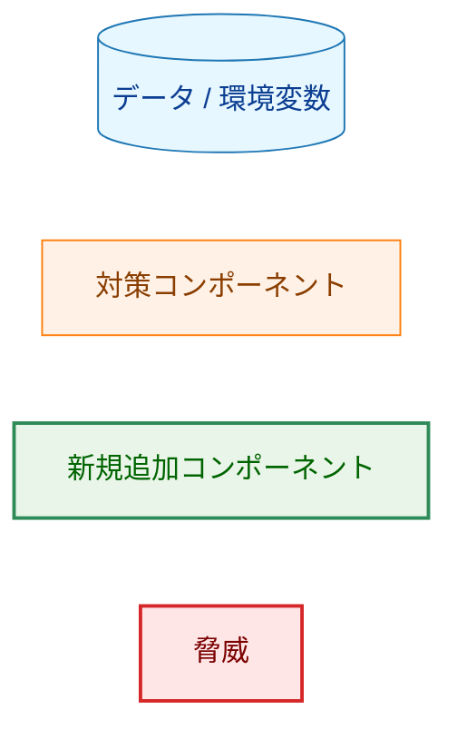
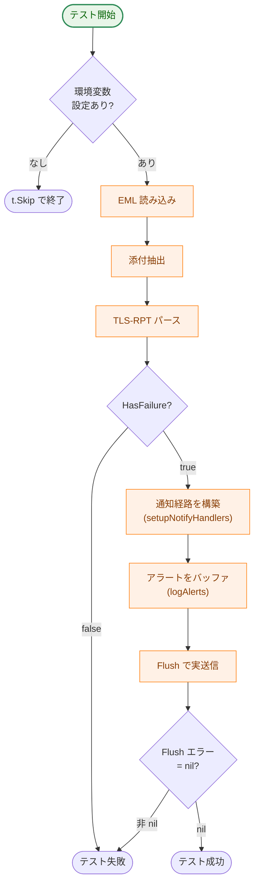

# アーキテクチャ設計書：Slack 通知インテグレーションテスト

## ドキュメントステータス

| 項目 | 内容 |
|---|---|
| ステータス | `approved` |
| 作成日 | 2026-06-05 |
| レビュー日 | 2026-06-05 |
| レビュアー | isseis |
| コメント | - |

---

## 1. 設計の全体像

### 1.1 設計原則

本タスクは、failure を含む TLS-RPT メールから failure を検出し、実際の Slack Webhook にアラートを送信できることを検証する手動実行専用の統合テストを追加する。以下の原則に従う。

- **本番経路の再利用（DRY）**: アラート送信に用いるパース処理・通知経路・メッセージ書式・リトライ挙動は、本番の `fetch` サブコマンドが使用するものと同一の関数を呼び出す。テスト専用の送信処理は新規実装しない（要件 AC-06、保守性要件）。
- **ビルドタグによる隔離**: テスト本体は専用ビルドタグ `slack_notify` を付与したファイルに置く。`make test` および `make test-integration` のビルドタグには `slack_notify` を含めないため、通常のテスト実行および CI では本テストはコンパイル対象から除外され、実行されない（要件 AC-09、制約）。
- **外部送信の明示的な制御**: 実 Slack への HTTP POST という外部副作用は、環境変数による Webhook URL 指定が存在する場合にのみ発生させる。未指定時はスキップする（要件 AC-08）。副作用の契約は §5.2 に定義する。
- **永続アーティファクトを残さない**: 本テストは繰り返し・並列実行を想定するため、本番 `fetch` が生成する `tlsrpt.json` 等の永続ファイルを作成しない。`fetch` ランナー・store を経由せず、パースと通知のみを直接呼ぶ設計でこれを実現する（要件 AC-11／AC-12、§5.2）。
- **通知セキュリティガイドラインの遵守**: Webhook URL は機微情報として扱い、ハードコードせず環境変数からのみ取得する。本番と同じ許可ホスト検証を経て送信する（§5）。

### 1.2 コンセプトモデル

本テストは、`testdata` のメールファイルを起点に、本番と同一のパース経路・通知経路を辿って実 Slack へ到達する一本道のフローである。新規に実装するのは env 検出ヘルパーの常時実行ユニットテスト、フロー全体を駆動する統合テストドライバ、`Makefile` ターゲットのみで、フロー中の処理ノードはすべて既存コンポーネントを再利用する。



矢印 A → B は「A が B に入力を渡す、または B を呼び出す」というデータ・制御の流れを表す。

凡例（Legend）:



---

## 2. システム構成

### 2.1 全体アーキテクチャと配置

本テストは `cmd/tlsrpt-digest` パッケージ内に配置する。これは、本番のアラート送信経路を構成する非エクスポート関数（`setupNotifyHandlers`、`logAlerts`、`parseTLSRPTAttachment`）を同一パッケージ内から直接呼び出せるようにするためである（制約：本番経路を再利用できる位置に配置）。



矢印 A → B は「A が B を呼び出す」という呼び出し関係を表す。緑（新規追加）は統合テストドライバを表し、env 検出ヘルパーの常時実行ユニットテストも別ファイルで追加する。その他の橙のノードはすべて既存実装を変更せずに再利用する。

凡例（Legend）:



### 2.2 データフロー（シーケンス）



矢印は呼び出しと応答を表す（実線 = 呼び出し、破線 = 戻り値）。

---

## 3. コンポーネント設計

### 3.1 再利用する既存型・関数

本テストは以下の既存の型・関数を呼び出す。いずれも変更しない。シグネチャは実ソースに一致する。

```go
// cmd/tlsrpt-digest/boot.go
// 本番のアラート通知シンク。SlackHandler 群をラップし、型付き Alert のみ受け取る。
type NotificationSink interface {
    LogAlert(ctx context.Context, alert notify.Alert) error
    LogWarning(ctx context.Context, warning notify.Warning) error
    LogSystemError(ctx context.Context, err notify.SystemError) error
    LogSummary(ctx context.Context, summary notify.Summary) error
    Flush(ctx context.Context) error
    IsDryRun() bool
}

// cmd/tlsrpt-digest/boot.go
// 本番の通知経路を構築する。テストは successURL に空（config.Secret("")）、
// errorURL に環境変数 TLSRPT_SLACK_WEBHOOK_URL_ERROR の値を、dryRun=false で渡す。
// この組み合わせでは ValidateEnvCombination を通過し、LevelModeWarnAndAbove の
// SlackHandler を 1 つだけ含む NotificationSink が返る（success チャネルは生成しない）。
func setupNotifyHandlers(
    successURL, errorURL config.Secret,
    cfg *config.Config,
    runID string,
    dryRun bool,
) (NotificationSink, error)

// cmd/tlsrpt-digest/notify_helpers.go
// failure を持つポリシーごとに 1 件のアラートを notifier にバッファリングする。
// 戻り値はなく、個別の LogAlert 失敗は slog.Warn に記録するのみ。
// 実際の HTTP 送信は notifier.Flush で行われる。
func logAlerts(
    ctx context.Context,
    notifier NotificationSink,
    report *tlsrpt.Report,
    component string,
)

// cmd/tlsrpt-digest/fetch.go
// Content-Type（フォールバックでファイル名拡張子）に基づき TLS-RPT 添付をパースする。
// TLS-RPT 添付でない場合は (nil, nil) を返す。
func parseTLSRPTAttachment(att mailparse.Attachment) (*tlsrpt.Report, error)

// internal/tlsrpt/tlsrpt.go
// いずれかのポリシーの total-failure-session-count が正なら true。
func (r *Report) HasFailure() bool
```

### 3.2 通知シンクの構造（クラス図）



矢印の意味: `<|..` は「インターフェース実装」、`-->` は「保持・委譲」、`..>` は「引数として受け取る」を表す。`NotificationSink`／`notificationSink` は `cmd/tlsrpt-digest` の型、`SlackHandler`（`notify.SlackHandler`）と `notify_Alert`（`notify.Alert`）は `internal/notify` の型を指す（クラス名にドットを含められない Mermaid の制約のため `notify_Alert` と表記）。`logAlerts`（cmd 側）は `NotificationSink.LogAlert` を呼び、後者が保持する各 `SlackHandler` に対して `notify.LogAlert`（パッケージ関数）を呼んでバッファリングする三層構造になっている。

### 3.3 コンポーネント責務一覧

新規作成・変更するファイルは次のとおり。フロー中の処理ロジックを担う既存ファイルは変更しない。

| ファイル | 区分 | 責務 |
|---|---|---|
| `cmd/tlsrpt-digest/slack_notify_env_test.go` | 新規 | `//go:build test` の env 検出ヘルパーとユニットテスト。`TLSRPT_SLACK_WEBHOOK_URL_ERROR` の欠落判定を注入マップで検証し、`make test` 経路で常時実行する。 |
| `cmd/tlsrpt-digest/slack_notify_integration_test.go` | 新規 | `//go:build test && slack_notify` の統合テストドライバ。環境変数判定・EML 読み込み・パース・failure 検証・本番経路でのアラート送信・送信成否の検証を行う。入力 EML はリポジトリルートの `testdata/` にあるため、Go テストの作業ディレクトリ（パッケージディレクトリ `cmd/tlsrpt-digest`）からの相対パス `../../testdata/tlsrpt_failure.eml` で参照する。これは同パッケージの既存テスト [`reprocess_test.go`](../../../cmd/tlsrpt-digest/reprocess_test.go) が用いる `filepath.Join("..", "..", "testdata", ...)` パターンを踏襲する。 |
| `Makefile` | 変更 | 手動実行用ターゲット `test-slack-notify` を追加する。`test,slack_notify` タグを付けて当該テストのみを実行する。 |
| `cmd/tlsrpt-digest/fetch.go` | 再利用（変更なし） | `parseTLSRPTAttachment` を提供。 |
| `cmd/tlsrpt-digest/notify_helpers.go` | 再利用（変更なし） | `logAlerts` を提供。 |
| `cmd/tlsrpt-digest/boot.go` | 再利用（変更なし） | `setupNotifyHandlers`、`notificationSink` を提供。 |
| `internal/mailparse` | 再利用（変更なし） | `ExtractAttachments` を提供。 |
| `internal/tlsrpt` | 再利用（変更なし） | `ParseGzip`、`Report.HasFailure` を提供。 |
| `internal/notify` | 再利用（変更なし） | `BuildHandlers`、`SlackHandler`、`LogAlert`、許可ホスト検証を提供。 |

既存テストへの影響: 本設計は新規テストファイルと新規 make ターゲットを追加するのみで、既存の処理ロジックを変更しない。したがって、挙動変更により更新が必要となる既存テスト（`*_test.go`）は存在しない。

---

## 4. エラーハンドリング設計

### 4.1 エラーの分類と扱い

| 事象 | 検出箇所 | テストの扱い |
|---|---|---|
| 環境変数 `TLSRPT_SLACK_WEBHOOK_URL_ERROR` 未設定 | テスト冒頭 | `t.Skip`（失敗ではない）。要件 AC-08。 |
| EML ファイル読み込み失敗 | ファイル読み込み | テスト失敗（テスト前提の破綻）。 |
| 添付抽出・パース失敗 | `ExtractAttachments` / `parseTLSRPTAttachment` のエラー戻り値 | テスト失敗。 |
| failure が検出されない | `Report.HasFailure()` が false | テスト失敗（テストデータの前提崩れ）。要件 AC-02。 |
| 通知経路の構築失敗（許可ホスト不一致・URL 不正など） | `setupNotifyHandlers` のエラー戻り値 | テスト失敗。要件 AC-06 に基づく本番同等の検証エラー。 |
| Slack への送信失敗（非 2xx・タイムアウト・リトライ枯渇） | `NotificationSink.Flush` の集約エラー戻り値 | テスト失敗。要件 AC-05。 |

### 4.2 送信成否の判定パターン

アラート送信の成否は、本番と同じ二段構えで扱う。`logAlerts` は failure ポリシーのアラートを `SlackHandler` のバッファに積むだけで HTTP 送信は行わず、戻り値を持たない。実際の HTTPS POST は `NotificationSink.Flush` で発生し、送信エラーは二層で `errors.Join` 集約される（各 `SlackHandler.Flush` がメッセージ単位の失敗を集約し、cmd 側 `notificationSink.Flush` が全ハンドラ分をさらに集約する）。したがってテストは、`Flush` の戻り値が `nil` であることをもって「すべてのアラート送信が成功した」と判定する（要件 AC-05）。`Flush` が非 nil を返した場合はテストを失敗させる。

エラー型は既存の `internal/notify` の定義（`WebhookValidationError` 等）をそのまま利用し、本タスクで新たなエラー型は定義しない。

---

## 5. セキュリティ考慮事項

本テストは実 Slack へ通知を送信するため、[通知セキュリティガイドライン](../../dev/developer_guide/notification_security.md) の適用対象である。

### 5.1 機微情報の取り扱い

| 項目 | 設計 |
|---|---|
| Slack Webhook URL | コードにハードコードせず、環境変数 `TLSRPT_SLACK_WEBHOOK_URL_ERROR` からのみ取得する（非機能要件・セキュリティ）。本番と同じく `config.Secret` 型として通知経路に渡し、誤ログ出力を防ぐ。 |
| 許可ホスト検証 | 本番と同じ `BuildHandlers` 経由の検証を必ず経る。テストは `config.Config` の `Notify.Slack.AllowedHost` に、使用する Slack Webhook のホスト（通常 `hooks.slack.com`）を設定して渡す。`validateWebhookURL`（`internal/notify/validate.go`）は `AllowedHost` が空、または Webhook URL のホストと不一致の場合に送信前にエラーを返すため、ここを誤ると AC-03／AC-05 が常に失敗する。 |
| 通知ペイロード | 型付き `notify.Alert`（公開情報のみ）を経由する本番経路を再利用するため、ガイドライン原則 1・5（型付きイベント関数経由のみ）を自動的に満たす。テストドライバから `SlackHandler` の内部ロガーに任意文字列を流し込む経路は作らない。 |

本タスクは新規の Notifier 実装ではなく、既存の通知経路を呼び出す統合テストである。したがって、通知セキュリティガイドライン §5 が定める 4 つのテスト要件（型付きヘルパー経由のみ・`Secret` 非露出・debug 出力が Slack ハンドラに到達しない・通知用 `*slog.Logger` が `internal/notify` 外へ非公開）は `internal/notify` の既存ユニットテストが担保済みであり、本統合テストでは再検証しない（要件 §2 の Out of Scope 方針に整合）。

### 5.2 副作用の契約

本テストの唯一の外部副作用は、Slack Webhook への HTTPS POST である。発生条件を以下に明示する。

| 条件 | 外部副作用（HTTP POST） | その他の副作用 |
|---|---|---|
| `TLSRPT_SLACK_WEBHOOK_URL_ERROR` 設定あり | 発生する（実 Slack へ送信） | なし |
| `TLSRPT_SLACK_WEBHOOK_URL_ERROR` 未設定 | 発生しない（`t.Skip`） | なし |

本テストは store への書き込み・削除、IMAP への接続、メールの既読フラグ付与（`MarkSeen`）を一切行わない。`fetch` サブコマンドが持つ `--dry-run` のようなモード分岐は本テストには存在せず、副作用の有無は上表の環境変数の有無のみで決まる。

#### 永続アーティファクトの非作成（AC-11／AC-12）

本番 `fetch` は解析結果を store 配下の `tlsrpt.json` に保存する（`boot.Store.SaveReports`）。一方、本テストドライバは `fetch` ランナー（`fetchRunner.Run`）を呼ばず、パース処理（`parseTLSRPTAttachment`）と通知経路（`setupNotifyHandlers`／`logAlerts`／`Flush`）のみを直接呼び出す。store を構築・参照する経路をそもそも通らないため、`tlsrpt.json` を含むいかなる永続ファイルも作成しない。これにより、手動での繰り返し実行や並列実行において固定パスのファイル競合が発生しない（AC-11）。

将来、何らかの理由でテストにストレージ領域が必要になった場合は、`t.TempDir` が返すテストごとの一時ディレクトリを用い、テスト終了時に自動破棄させる方針とする。固定パスや作業ツリー配下を store ルートに使わないことで、並列実行時の干渉を防ぐ（AC-12）。

### 5.3 脅威モデル



矢印の意味: 実線 A → B は「A が B に至るデータの流れ」を表す。破線 A -.-> B（ラベル「防止: …」付き）は「A に組み込まれた対策が脅威 B を緩和する」ことを表す。

凡例（Legend）:



---

## 6. 処理フロー詳細

テストドライバの処理は次の分岐を持つ単一フローである。



各ステップは §2.1 に示した既存コンポーネントへの呼び出しに対応する。具体的なコード手順は実装計画書（`03_implementation_plan.md`）で定義する。

---

## 7. テスト戦略

### 7.1 本タスクが追加するテスト

本タスクの主要成果物は手動実行専用の統合テストである。これに加えて、環境変数欠落判定だけは純粋ヘルパーとして切り出し、`//go:build test` のユニットテストで常時検証する。実 Slack 送信を伴うフローは `//go:build test && slack_notify` に隔離する。受け入れ条件と検証手段の対応は次のとおり。

| AC | 検証手段 |
|---|---|
| AC-01 | パッケージ相対パス `../../testdata/tlsrpt_failure.eml`（既存 `reprocess_test.go` と同じ `filepath.Join("..", "..", "testdata", ...)` パターン）を読み込み、`ExtractAttachments` + `parseTLSRPTAttachment` で `*tlsrpt.Report` が得られることをアサート。 |
| AC-02 | `report.HasFailure()` が `true` であることをアサート。あわせて送信元 `*tlsrpt.Report` の組織名（`Google Inc.`）・ポリシー種別（`sts`）・失敗セッション数（`2`）・期間（2026-02-08／2026-02-09）を自動アサートする。 |
| AC-03 | failure ポリシーについて `logAlerts` がアラートをバッファし、`Flush` 成功で送信されることを確認（実 Slack への到達は §7.2 の目視で補完）。 |
| AC-04 | アラート組み立てに本番の `logAlerts`／`notify.Alert`／本番フォーマッタを再利用することで、組織名・ポリシー種別・失敗セッション数・レポート期間が含まれることを保証。Slack 上の表示は目視確認。 |
| AC-05 | `NotificationSink.Flush` の戻り値が `nil` であることをアサート。非 nil なら失敗。 |
| AC-06 | 送信経路として本番の `setupNotifyHandlers`／`logAlerts` を呼び出すことで担保。 |
| AC-07 | 環境変数 `TLSRPT_SLACK_WEBHOOK_URL_ERROR`（error チャネル）を使用する。 |
| AC-08 | `missingSlackNotifyEnv` のユニットテストで欠落判定を常時検証し、統合テストのフロー先頭で未設定時に `t.Skip` することを保証。 |
| AC-09 | `test && slack_notify` ビルドタグ付きファイルとし、`make test` / `make test-integration` のタグに含めないことで通常実行から除外。専用ターゲットでのみ実行。 |
| AC-10 | Webhook URL をシェル環境変数として渡して実行できることを `Makefile` ターゲットで保証。 |
| AC-11 | `fetch` ランナー・store を経由せずパースと通知のみを呼ぶ設計により、`tlsrpt.json` 等の永続ファイルを作成しないことを保証（§5.2）。テスト後に作業ツリーへ未追跡ファイルが残らないことで確認できる。 |
| AC-12 | ストレージ領域を使う設計に変更しない限り該当しないが、必要時は `t.TempDir` を用いる方針を明記（§5.2）。 |

### 7.2 手動目視確認

実行後、指定した Slack チャンネルにアラートが届き、組織名（`Google Inc.`）・ポリシー種別（`sts`）・失敗セッション数（`2`）・レポート期間（開始日 2026-02-08、終了日 2026-02-09）が期待どおりに表示されることを目視確認する。

### 7.3 ビルドタグ運用

`cmd/tlsrpt-digest` パッケージの既存テストヘルパー（`SpyNotificationSink` 等）は `//go:build test` で隔離されている。本テストを `go test` でコンパイルする際はパッケージ内の他テストファイルも同時にコンパイルされるため、専用ターゲットでは `test` タグと `slack_notify` タグを併用する。統合テストファイル自体も `//go:build test && slack_notify` とし、本番経路の再利用に必要な定義が揃った状態でのみ選択実行する。タグの正確な指定とテスト選択方法は実装計画書で定義する。

---

## 8. 実装の優先順位

本タスクは小規模だが、常時実行できる env ヘルパー検証と、手動実行専用の実 Slack 送信フローを分けて実装する。順序は次のとおり。

1. `//go:build test` の env 検出ヘルパーとユニットテストを新規作成する（AC-08）。
2. `//go:build test && slack_notify` の統合テストドライバを新規作成し、環境変数判定からアラート送信・検証までのフローを実装する（F-001、F-002）。
3. `Makefile` に手動実行用ターゲット `test-slack-notify` を追加する（F-003）。
4. ローカルで実 Webhook を指定して実行し、Slack 上の表示を目視確認する（§7.2）。

---

## 9. 将来の拡張性

- **他の通知種別への拡張**: 本設計はアラート（failure 通知）のみを対象とするが、同じビルドタグ・同じ本番経路再利用の枠組みで、週次サマリーや警告通知の送信検証を将来追加できる。その場合は対応する本番ヘルパー（`LogSummary` 等）と success チャネル用環境変数を用いる。
- **書式の自動アサーション**: 現状は Slack 上の表示を目視確認とするが、将来 Slack 側で受信メッセージを取得できる仕組みを用意できれば、送信ペイロードの自動アサーションへ発展させられる。本テストはその際の送信トリガとして再利用できる。

---

## 付録: 決定事項の履歴

- 通知経路はテスト専用に再実装せず、本番の `setupNotifyHandlers`／`logAlerts` を再利用する方針とした。理由は要件 AC-06（本番と同一の通知経路・書式・リトライ）と保守性要件（DRY）を同時に満たすため。
- 対象 Webhook を error チャネル用環境変数 `TLSRPT_SLACK_WEBHOOK_URL_ERROR` としたのは、failure アラートが本番で WARN レベルとして送出され、`LevelModeWarnAndAbove` の error チャネルへルーティングされるためである（`internal/notify/helpers.go` の `LogAlert`、`internal/notify/handler.go` の `BuildHandlers`）。
