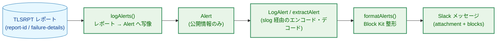
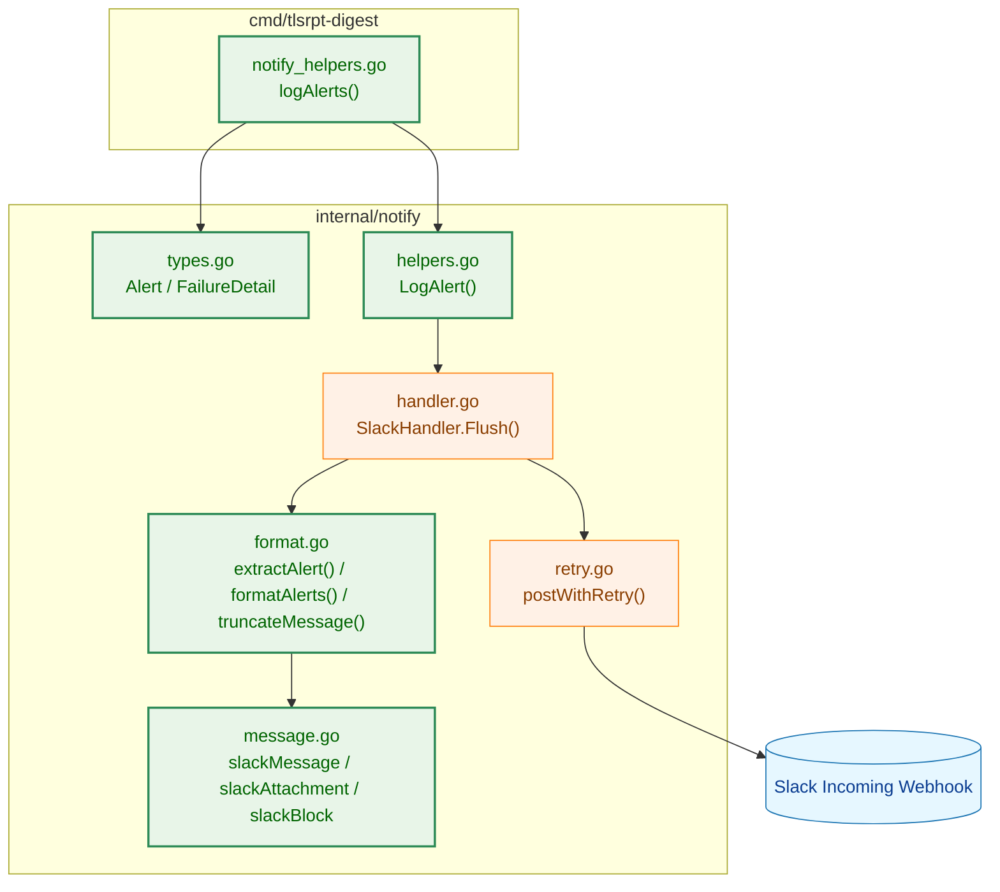
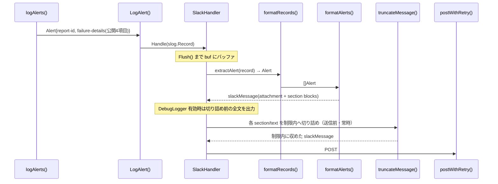
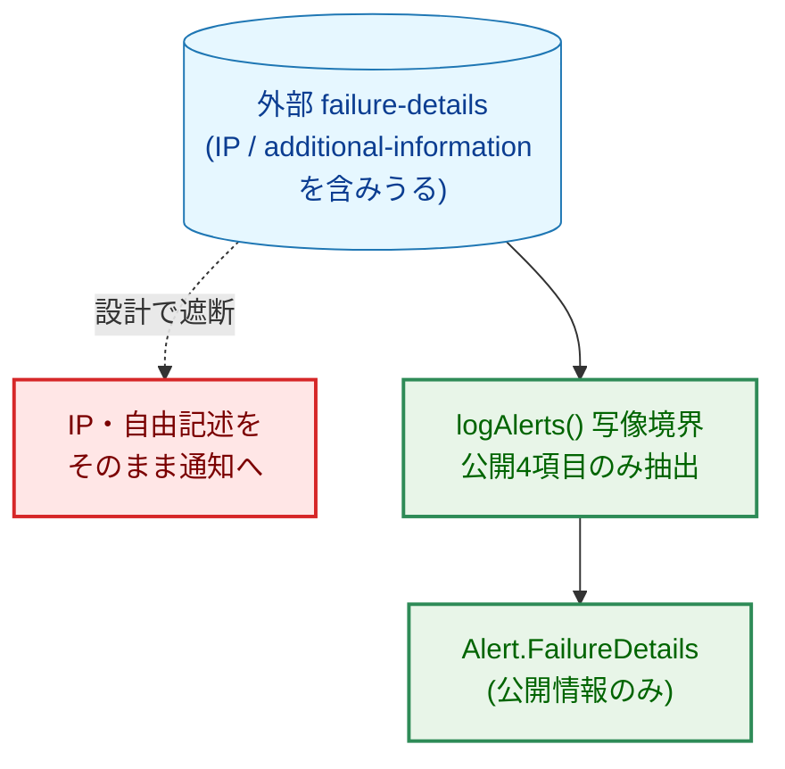
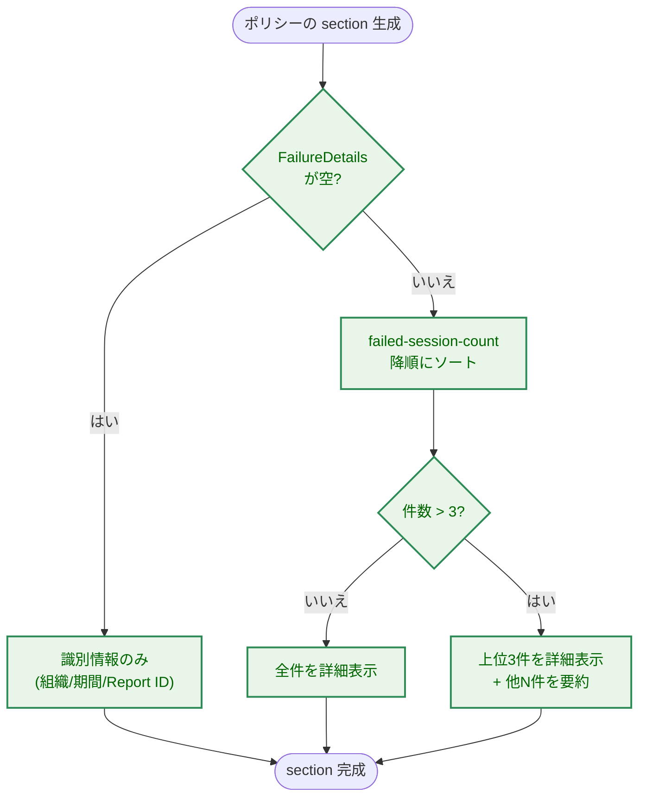

# アーキテクチャ設計書：Slack アラート通知フォーマット改善

## ドキュメントステータス

| 項目 | 内容 |
|---|---|
| ステータス | `draft` |
| 作成日 | 2026-06-08 |
| レビュー日 | - |
| レビュアー | - |
| コメント | - |

関連文書: [01_requirements.ja.md](01_requirements.ja.md)

---

## 1. 設計の全体像

### 1.1 設計原則

- **既存の通知アーキテクチャを踏襲する**: 通知は `slog.Handler`（`SlackHandler`）にバッファされ、`Flush()` 時に整形・送信される。アラートデータは型付きヘルパー `LogAlert` で `slog.Record` にエンコードされ、`extractAlert` でデコードされる。本機能もこの経路に従う（[通知セキュリティガイドライン](../../dev/developer_guide/notification_security.md) Principle 5）。
- **型による機微情報の遮断**: 通知ペイロードに渡る型は公開情報のみを持つ（同 Principle 1）。`failure-details` のうち IP アドレスや外部由来の自由記述テキストは、通知用の型に取り込まないことで構造的に遮断する（AC-13）。
- **アラートのみを対象とする**: 表示形式の変更は即時アラートに限定する。警告・システムエラー・サマリーの通知形式は変更しない。
- **既存資産の再利用**: 既存の `TruncateText`、`policyTypeStr`、`uniqueOrgCount`、`SlackHandler` の送信経路をそのまま利用する。
- **DRY / YAGNI**: 新規ブロック型は最小限（`section`・`divider`・`context`）に留める。複数メッセージへの分割は導入しない（要件で対象外）。

### 1.2 コンセプトモデル



> 矢印 A → B は「A のデータが B へ渡る（データの流れ）」を表す。
>
> 凡例:
> - 青（data）: 外部データ
> - 緑（enhanced）: 本タスクで追加・変更するコンポーネント

本機能の要は、外部由来の `failure-details`（IP・自由記述を含みうる）から、対応判断に有用な 4 フィールドのみを抜き出して `Alert` に写像する `logAlerts()` の写像境界にある。ここで機微情報を落とすことで、以降の経路には公開情報しか流れない。

---

## 2. システム構成

### 2.1 全体アーキテクチャ



> 矢印 A → B は「A が B を呼び出す、または B の型・データに依存する」を表す。
>
> 凡例:
> - 青（data）: 外部システム
> - 橙（process）: 変更しない既存コンポーネント
> - 緑（enhanced）: 本タスクで追加・変更するコンポーネント

`SlackHandler.Flush()` → `send()` → `formatRecords()` → `formatAlerts()` という既存の送信経路は変更しない。本タスクは `formatAlerts()` が生成するペイロードの構造と、そこへ至るデータ（`Alert` の拡張フィールド）を変更する。

### 2.2 データフロー



> 矢印 A → B は「A から B への呼び出し・データ受け渡し」を表す。

---

## 3. コンポーネント設計

### 3.1 データ構造の拡張

`Alert` に元データ識別情報と失敗詳細を追加する。失敗詳細は `internal/notify` を `internal/tlsrpt` から独立させるため（既存の `DateRange` と同方針）、notify ローカルの型として定義し、**公開情報のみ**を持たせる。

```go
// types.go（変更）
type Alert struct {
    OrganizationName string
    PolicyType       PolicyType
    FailureCount     int64
    DateRange        DateRange
    ReportID         string          // 追加: 元レポート識別子（AC-11）
    FailureDetails   []FailureDetail // 追加: 失敗詳細（AC-05〜AC-10）
}

// types.go（新規）: RFC 8460 failure-details のうち公開可能な 4 フィールドのみ。
// IP アドレス（sending-mta-ip / receiving-ip）と自由記述（additional-information）は
// 意図的に含めない（AC-13）。
type FailureDetail struct {
    ResultType          string // result-type（必須表示）
    FailedSessionCount  int64  // failed-session-count（必須表示）
    ReceivingMXHostname string // receiving-mx-hostname（値があれば表示）
    FailureReasonCode   string // failure-reason-code（値があれば表示）
}
```

### 3.2 Slack ペイロード構造の拡張

色付きサイドバー（重大度の視覚表現）を維持するため、Block Kit の `section` ブロックを `attachment` の内側に配置する。`slackAttachment` に `Blocks` を追加し、アラートは `Blocks` を、その他の通知種別は従来どおり `Fields` を用いる。両者は相互排他的に使う。

これは「すべての Slack attachment は `slackField`（`fields`）で表現する」という従来規約（`message.go` の `slackAttachment`／`slackField` 定義、および `formatAlerts`／`formatWarning`／`formatSystemError`／`formatSummary` の各実装で確立）に対し、アラートのみが `blocks` を用いる例外を導入するものである。アラート以外（警告・サマリー・システムエラー）の整形は引き続き `Fields` を用いるため、それらのエンコードを検証する既存テストは影響を受けない。一方、`message.go` の `fields` エンコードを検証する既存テストのうち、`message_test.go::TestSlackAttachment_FieldsEncoding` と `TestSlackMessage_JSONShape` は、ヘルパー `captureWarnPayload`（名称に反し内部で `LogAlert` を呼び**アラート**ペイロードを生成する）経由でアラートを対象としている。このためアラート経路の変更の影響範囲に含まれる（各テストの更新要否は §3.5 を参照）。

```go
// message.go（変更）
type slackAttachment struct {
    Color  string       `json:"color,omitempty"`
    Blocks []slackBlock `json:"blocks,omitempty"` // 追加: アラートで使用
    Fields []slackField `json:"fields,omitempty"` // 既存: 警告/エラー/サマリーで使用
}

// message.go（新規）: 最小限のブロック型。section / divider / context のみ。
type slackBlock struct {
    Type     string           `json:"type"`               // "section" | "divider" | "context"
    Text     *slackTextObject `json:"text,omitempty"`     // section 用
    Elements []slackTextObject `json:"elements,omitempty"` // context 用
}

type slackTextObject struct {
    Type string `json:"type"` // "mrkdwn"
    Text string `json:"text"`
}
```

### 3.3 アラートメッセージのレイアウト

1 アラートメッセージは次の構造を持つ。

- `Text`（メッセージ本文・プレビュー）: 影響組織数の概要（AC-01）。Slack 通知一覧のフォールバック表示も兼ねる。
- `Attachments[0]`: `Color = "warning"`、`Blocks` に以下を順に格納。
  - 失敗ポリシーごとに 1 つの `section` ブロック（ポリシー間は `divider` で区切る）。各セクションは自己完結し、項目見出しはセクション内に閉じるため複数ポリシー間で重複しない（AC-04）。
  - 末尾に Run ID を載せる `context` ブロック 1 つ。

各 `section` の `mrkdwn` テキストは次の情報を含む。

| 行 | 内容 | 関連 AC |
|---|---|---|
| 1 | 組織名・ポリシータイプ | AC-02 |
| 2 | 失敗セッション総数・レポート期間（UTC） | AC-02, AC-12 |
| 3 | Report ID | AC-11 |
| 4〜 | 失敗詳細（`result-type`・`failed-session-count`、値があれば `receiving-mx-hostname`・`failure-reason-code`） | AC-05〜AC-07 |

失敗詳細は `failed-session-count` の降順に並べ、上位 3 件を詳細表示する。4 件以上ある場合は残りを「他 N 件（合計 M セッション）」と要約する（AC-08, AC-09）。`FailureDetails` が空のポリシーでは失敗詳細行を出力せず、識別情報のみのセクションとなる（AC-10）。

### 3.4 失敗詳細の slog 受け渡し

`LogAlert` は `FailureDetails`（構造体スライス）を、既存の `organization_stats`（`formatSummary` で使用）と同様に **インデックス付き `slog.Group` の入れ子**としてレコードに格納する。`extractAlert` はこのグループを走査して `[]FailureDetail` を復元する。これにより、通知ロガーに流れるのは型付きの構造化属性のみという既存の制約（Principle 5）を維持する。`ReportID` は単一の文字列属性として格納する。

```go
// helpers.go（変更）: シグネチャは不変。新フィールドを slog 属性に追加するのみ。
func LogAlert(ctx context.Context, h slog.Handler, alert Alert) error

// format.go（変更）: 同シグネチャ。新フィールドを復元するのみ。
func extractAlert(r slog.Record, debugLogger *slog.Logger) Alert
```

### 3.5 コンポーネント責務と影響範囲

| ファイル | 区分 | 責務・変更内容 | 更新が必要な既存テスト |
|---|---|---|---|
| `internal/notify/types.go` | 変更 | `Alert` に `ReportID`・`FailureDetails` を追加。`FailureDetail` 型を新設 | なし |
| `internal/notify/message.go` | 変更 | `slackAttachment` に `Blocks` を追加。`slackBlock`・`slackTextObject` を新設 | なし |
| `internal/notify/helpers.go` | 変更 | `LogAlert` で新フィールドを slog 属性へエンコード | なし |
| `internal/notify/format.go` | 変更 | `extractAlert` で新フィールドをデコード。`formatAlerts` を Block Kit 生成へ刷新。`truncateMessage` を blocks 対応へ拡張。`maxAlertFields`（旧 fields 上限）に代えてブロック数・セクション文字数の上限を導入 | 下表参照 |
| `cmd/tlsrpt-digest/notify_helpers.go` | 変更 | `logAlerts` で `report.ReportID` と `policy.FailureDetails`（公開 4 項目のみ）を `Alert` に写像。IP・`additional-information` は写像しない | `cmd/tlsrpt-digest` 配下の `logAlerts` 関連テスト（新フィールド・機微情報非複写の検証を追加） |

アラート形式の変更により更新が必要な既存テストと、その対応方針は次のとおり。

| 既存テスト | ファイル | 対応方針 |
|---|---|---|
| `TestFormatAlerts_Fields` | `format_test.go` | 改修。組織・ポリシー・失敗数・期間の文字列検証を、`fields` ではなく `section` ブロックのテキスト検証へ移す（テスト名も実態に合わせて見直す） |
| `TestFormatAlerts_AttachmentFields` | `format_test.go` | 改修。`fields` の `title`／`value` を前提とするため、`blocks` の `section`／`text` 検証へ書き換える |
| `TestFormatAlerts_NoTruncation` | `format_test.go` | 改修。切り詰め対象が `fields` から `section`／`context` テキストへ変わるため検証対象を更新 |
| `TestFormatAlerts_RunID` | `format_test.go` | 改修。Run ID は末尾 `context` ブロックへ移るため検証箇所を更新 |
| `TestFormatAlerts_NoPolicyFound` / `TestFormatAlerts_PolicyTypeUnknown` | `format_test.go` | 改修。`policyTypeStr` の再利用は不変だが、出力先が `section` テキストへ変わる |
| `TestFormatAlerts_Color` | `format_test.go` | 維持の見込み。`attachment.color = warning` は不変だが、ブロック構成変更に伴い再確認する |
| `TestExtract_UnknownAttrKeyLogged` | `format_test.go` | 改修。`tls_failure_alert` レコードに新属性（`report_id`・`failure_details` グループ）が増えるため、未知キー検証の前提を更新 |
| `TestFormatAlerts_TitleOrgCount` / `TestFormatAlerts_TitleOrgCountDedup` | `format_test.go` | 維持。`Text`（概要見出し・AC-01）は不変のため変更不要 |
| `TestLogAlert_StructuredPayloadOnly` | `helpers_test.go` | 改修（重要）。現状はキーの**存在**のみを検証しており、他の型付きヘルパー（`LogSummary`／`LogWarning`／`LogSystemError`）の `security_test.go` が用いる**許可リスト**方式と非対称である。AC-13 の中核契約として、許可リスト方式へ強化し、新キー（`report_id` と `failure_details` グループの 4 サブキー）のみが追加されたことを網羅検証する |
| `TestSlackAttachment_FieldsEncoding` | `message_test.go` | 改修。ヘルパー `captureWarnPayload` がアラートを生成するため、`attachment.fields` の存在を前提とする本テストは破綻する。`blocks`（`section`／`text`）の検証へ書き換える。あわせて、名称と実態が乖離した `captureWarnPayload`（実体はアラート）の改名も検討する |
| `TestSlackMessage_JSONShape` | `message_test.go` | 維持の見込み。`text` と `attachments` の存在のみを検証しアラートでも成立するが、`captureWarnPayload` 改名時は追従する |

既存の `TruncateText`・`policyTypeStr`・`uniqueOrgCount`・`SlackHandler`・`postWithRetry` は再利用し、責務の重複実装は行わない。

---

## 4. エラーハンドリング設計

本機能は新たなエラー型を導入しない。既存の方針を踏襲する。

- **未知の slog 属性キー**: `extractAlert` は既存どおり `warnUnknownKey` で DebugLogger に警告する（送信は継続）。失敗詳細グループ内に想定外のキーがあった場合も同様に扱う。
- **欠損・空フィールド**: `FailureDetails` が空、`ReceivingMXHostname`・`FailureReasonCode` が空文字の場合は当該表示を省略し、エラーとしない（AC-10、Postel の法則）。
- **送信失敗**: `postWithRetry` による既存のリトライ／ロギング経路を変更しない。

---

## 5. セキュリティ考慮事項

本機能は外部（TLSRPT 送信元）由来データを Slack 通知に載せるため、[通知セキュリティガイドライン](../../dev/developer_guide/notification_security.md) に従う。

### 5.1 脅威モデル



> 矢印 A → B（実線）は「A のデータが B へ渡る」、点線は「設計上発生させない経路」を表す。
>
> 凡例:
> - 青（data）: 外部データ
> - 緑（enhanced）: 本タスクの安全な経路
> - 赤（problem）: 設計上遮断する危険な経路

### 5.2 対策

- **Principle 1（型による制約）**: notify ローカルの `FailureDetail` は公開 4 フィールドのみを持ち、`sending-mta-ip`・`receiving-ip`・`additional-information` を型として保持しない。`logAlerts` の写像時にこれらは複写されず、以降の経路に流れない（AC-13）。
- **Principle 5（型付きヘルパー経由）**: 通知データは引き続き `LogAlert` のみを通じて `slog.Record` 化される。`SlackHandler` に接続された `*slog.Logger` は `internal/notify` 内に閉じ、外部公開しない。本変更で新たな公開ロガー経路は追加しない。
- **二次防御**: Webhook URL・認証情報は既存の `config.Secret` 型と `maskedWebhookURL` で保護済み。本機能はこれらに触れない。

---

## 6. 処理フロー詳細

### 6.1 failure-details の整形



> 矢印 A → B は「処理 A の次に B を行う」を表す。分岐ラベルは判定結果。開始・終了ノード（角丸）は終端子であり配色しない。
>
> 凡例:
> - 緑（enhanced）: 本タスクの処理ステップ

### 6.2 サイズ制限への対応（AC-14）

Slack Block Kit には「`section` テキストは最大 3000 文字」「1 メッセージ最大 50 ブロック」の制限がある。内容追加と形式変更により従来より大きくなりうるため、次の多段で制限内に収める。優先的に残すのは識別情報（組織・ポリシー・期間・Report ID）であり、失敗詳細を先に削る。

1. **一次抑制（ポリシー内）**: 失敗詳細は §3.3 のとおり上位 3 件＋要約に制限する。これにより 1 ポリシーの `section` は数行に収まり、肥大化を防ぐ。
2. **ブロック数の上限（メッセージ内）**: 1 メッセージのブロック数を 50 以内に収める。ブロックの内訳は「ポリシーごとに `section` 1 個＋区切りの `divider` 1 個」＋「末尾に Run ID の `context` 1 個」である。50 から、Run ID の `context`（1 個）と省略通知の `section`（1 個）の予約分を差し引いた残りを、ポリシー（`section`＋`divider`）に割り当てる。これを超える失敗ポリシーがある場合は、収まる範囲のポリシーのみを表示し、末尾に「他 N ポリシーを省略」を示す `section` を 1 個付す（複数メッセージ分割は行わない＝対象外）。この予約方式は、既存の `formatAlerts` が `maxAlertFields` で最終フィールド枠を Run ID 用に予約しているのと同じ考え方である。
3. **文字数の二次防御（ブロック内）**: 各 `section` テキストは送信前に `truncateMessage` が既存の `TruncateText` を用いて Block Kit のセクション上限（3000 文字）以内へ切り詰める。現状の `truncateMessage` は `Text` と `Attachments[].Fields[]` のみを切り詰めるため、`Attachments[].Blocks[]` の各 `section`／`context` テキストを走査して切り詰める処理を追加する。`section` 用の上限定数は既存の `maxFieldRunes`（1000、`fields` 用）とは別に 3000 として新設する。

これにより、ポリシー数・文字数のいずれが過大でも、ブロック数・文字数が Slack の制限内に収まり送信は失敗しない。ポリシー割り当て上限の具体値は、上記の予約・`divider` 込みのブロック内訳（ポリシー 1 件あたり 2 ブロック）に基づき実装で確定する。

---

## 7. テスト戦略

### 7.1 単体テスト

`formatAlerts` 相当に対し、各受け入れ条件を検証する（既存テストは §3.5 のとおり新形式へ更新する）。

| ケース | 検証する AC |
|---|---|
| 単一・複数組織での概要見出し | AC-01 |
| 各ポリシーの組織・ポリシータイプ・失敗数・期間（UTC） | AC-02, AC-12 |
| 複数ポリシーがすべて含まれ、見出しが重複しない | AC-03, AC-04 |
| `failure-details` 0 / 1〜3 / 4 件以上 | AC-05, AC-08, AC-09, AC-10 |
| `receiving-mx-hostname`・`failure-reason-code` の有無の組合せ | AC-06, AC-07 |
| Report ID の表示 | AC-11 |
| セクション文字数・ブロック数が制限を超える場合の切り詰め | AC-14 |

### 7.2 セキュリティテスト

[通知セキュリティガイドライン](../../dev/developer_guide/notification_security.md) §5 に従う。

- `LogAlert` が出力する `slog.Record` に `Alert` 由来のフィールドのみが含まれ、IP・`additional-information` 等の機微フィールドが含まれないこと（AC-13）。`TestLogAlert_StructuredPayloadOnly` を許可リスト方式（既存の `LogSummary`／`LogWarning`／`LogSystemError` のセキュリティテストと同方式）へ強化し、許可キーに `report_id` と `failure_details` グループの 4 サブキーを加えて網羅検証する。
- `logAlerts` の写像で IP・自由記述が `notify.FailureDetail` に複写されないこと。

### 7.3 統合テスト

- 既存の Slack 通知インテグレーションテスト（task 0100 系）を新しい Block Kit ペイロードに追従させる。実 Webhook 送信は行わず、生成ペイロードの構造を検証する。

---

## 8. 実装優先順位

| フェーズ | 内容 | 主な成果物 |
|---|---|---|
| Phase 1 | データ構造の拡張とデータ経路 | `Alert`／`FailureDetail` 拡張、`LogAlert`／`extractAlert` の往復、`logAlerts` の写像 |
| Phase 2 | Block Kit 整形 | `slackBlock` 型、`formatAlerts` の刷新、`section`／`divider`／`context` 生成 |
| Phase 3 | サイズ制限と切り詰め | `truncateMessage` の blocks 対応、ブロック数・文字数上限 |
| Phase 4 | テスト更新・追加 | 既存テスト更新、AC 別テスト、セキュリティテスト |

データ経路（Phase 1）を先に通すことで、整形（Phase 2）以降を実データで検証できる。

---

## 9. 将来拡張性

- **複数メッセージ分割**: ブロック数上限を超える場合の分割送信は本タスクで対象外。将来必要になれば、`send()` が 1 レコード群から複数 `slackMessage` を生成する形へ拡張できる（現状の `formatRecords` が複数メッセージを返す構造を踏襲）。
- **元データへの直接リンク**: Report ID 表示に加え、将来はストア上の JSON ファイルパスや管理 UI URL を `section` に追加できる（`FailureDetail` ではなくポリシーセクション側の拡張）。
- **他通知種別の Block Kit 化**: `slackAttachment.Blocks` を追加済みのため、警告・サマリーも同方式へ段階移行できる。

---

## 付録 A. 設計判断の履歴

> 本文は現行設計の説明に徹する。以下は採用しなかった代替案の記録。

- **Block Kit を attachment の内側に置く理由**: トップレベル `blocks` では従来の色付きサイドバー（重大度表現）が失われる。色を維持しつつブロックレイアウトを得るため、`attachment.color` + `attachment.blocks` の構成を採る。
- **失敗詳細の slog 受け渡しで JSON 文字列化を採らない理由**: `[]FailureDetail` を単一の JSON 文字列属性として渡す案もあったが、既存の `organization_stats` がインデックス付き `slog.Group` を用いており、構造化属性で一貫させる方が「通知ロガーには型付き構造化データのみ」という制約（Principle 5）の検証と整合する。
- **`additional-information` を表示しない理由**: 外部送信元の自由記述であり、機微情報やノイズの混入経路となりうる（AC-13）。対応判断には `result-type`／`failure-reason-code` で足りるため除外する。
