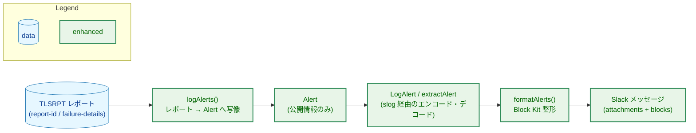
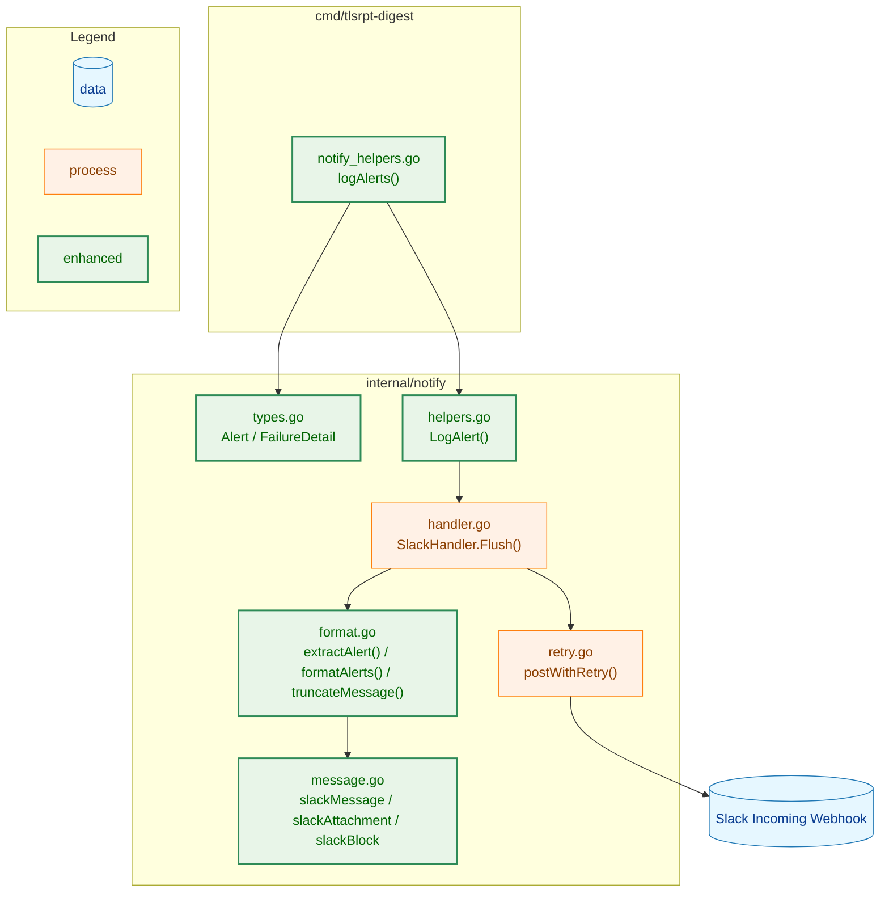
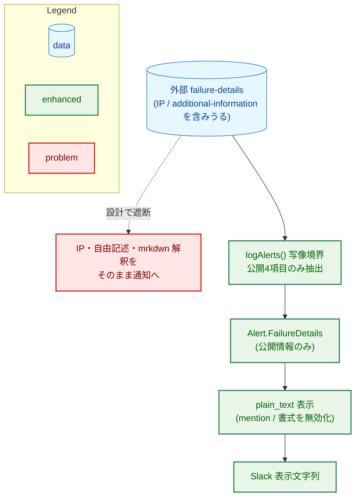
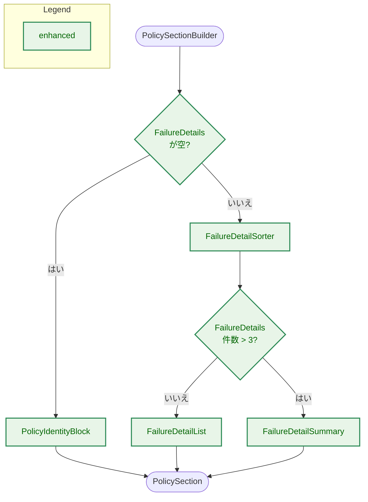

# アーキテクチャ設計書：Slack アラート通知フォーマット改善

## ドキュメントステータス

| 項目 | 内容 |
|---|---|
| ステータス | `approved` |
| 作成日 | 2026-06-08 |
| レビュー日 | 2026-06-08 |
| レビュアー | isseis |
| コメント | - |

関連文書: [01_requirements.md](01_requirements.md)

---

## 1. 設計の全体像

### 1.1 設計原則

- **既存の通知アーキテクチャを踏襲する**: 通知は `slog.Handler`（`SlackHandler`）にバッファされ、`Flush()` 時に整形・送信される。アラートデータは型付きヘルパー `LogAlert` で `slog.Record` にエンコードされ、`extractAlert` でデコードされる。本機能もこの経路に従う（[通知セキュリティガイドライン](../../dev/developer_guide/notification_security.md) Principle 5）。
- **型による機微情報の遮断**: 通知ペイロードに渡る型は公開情報のみを持つ（同 Principle 1）。`failure-details` のうち IP アドレスや外部由来の自由記述テキストは、通知用の型に取り込まないことで構造的に遮断する（AC-13）。
- **アラートのみを対象とする**: 表示形式の変更は即時アラートに限定する。警告・システムエラー・サマリーの通知形式は変更しない。
- **既存資産の再利用**: 既存の `TruncateText`、`policyTypeStr`、`uniqueOrgCount`、`SlackHandler` の送信経路をそのまま利用する。
- **DRY / YAGNI**: 新規ブロック型は最小限（`section`・`divider`・`context`）に留める。1 通の通知に収まらない場合の複数メッセージ分割は要件の対象外であるため導入しない。Slack の 1 メッセージあたり 50 ブロック上限を超える場合は、詳細表示するポリシー数を上限内に収め、残りを明示的な overflow summary で要約する。これは AC-14 の「内容を切り詰める」挙動であり、通常ケースの AC-03 と、過大入力時の送信成功を両立するための境界である。

### 1.2 コンセプトモデル



> 矢印 A → B は「A のデータが B へ渡る（データの流れ）」を表す。
> Legend は色分けの意味のみを示し、処理上の関係を表さない。

本機能の要は、外部由来の `failure-details`（IP・自由記述を含みうる）から、対応判断に有用な 4 フィールドのみを抜き出して `Alert` に写像する `logAlerts()` の写像境界にある。ここで機微情報を落とすことで、以降の経路には公開情報しか流れない。

---

## 2. システム構成

### 2.1 全体アーキテクチャ



> 矢印 A → B は「A が B を呼び出す、または B の型・データに依存する」を表す。
> Legend は色分けの意味のみを示し、処理上の関係を表さない。

`SlackHandler.Flush()` → `send()` → `formatRecords()` → `formatAlerts()` という既存の送信経路を維持する。本タスクは `formatAlerts()` が生成する単一アラート集約メッセージの内部構造と、そこへ至るデータ（`Alert` の拡張フィールド）を変更する。警告・システムエラー・サマリーを含む `formatRecords()` 全体のメッセージ順序は変更しない。

### 2.2 コンポーネント配置

本タスクの変更は既存パッケージ内に閉じ、新規パッケージは作らない。`cmd/tlsrpt-digest` は TLSRPT レポートから通知用 `Alert` への写像境界を担当し、`internal/notify` は通知用型、`slog.Record` へのエンコード・デコード、Slack ペイロード生成、送信前切り詰めを担当する。`internal/tlsrpt` の RFC 8460 型は `cmd/tlsrpt-digest` の写像元としてのみ参照し、`internal/notify` から `internal/tlsrpt` への依存は追加しない。

### 2.3 データフロー


> 矢印 A → B は「A から B への呼び出し・データ受け渡し」を表す。
> Legend は参加者の種類を示す注記であり、色分けされたノードクラスは使わない。

---

## 3. コンポーネント設計

### 3.1 データ構造の拡張

`Alert` に元データ識別情報と失敗詳細を追加する。失敗詳細は `internal/notify` を `internal/tlsrpt` から独立させるため（既存の `DateRange` と同方針）、notify ローカルの型として定義し、**公開情報のみ**を持たせる。

```go
// types.go（変更）
type Alert struct {
    OrganizationName string
    PolicyType       PolicyType
    FailureCount     int64
    DateRange        DateRange
    ReportID         string          // 追加: 元レポート識別子（AC-11）
    FailureDetails   []FailureDetail // 追加: 失敗詳細（AC-05〜AC-10）
}

// types.go（新規）: RFC 8460 failure-details のうち公開可能な 4 フィールドのみ。
// IP アドレス（sending-mta-ip / receiving-ip）と自由記述（additional-information）は
// 意図的に含めない（AC-13）。
type FailureDetail struct {
    ResultType          string // result-type（必須表示）
    FailedSessionCount  int64  // failed-session-count（必須表示）
    ReceivingMXHostname string // receiving-mx-hostname（値があれば表示）
    FailureReasonCode   string // failure-reason-code（値があれば表示）
}
```

### 3.2 Slack ペイロード構造の拡張

色付きサイドバー（重大度の視覚表現）を維持するため、Block Kit の `section` ブロックを `attachment` の内側に配置する。`slackAttachment` に `Blocks` を追加し、アラートは `Blocks` を、その他の通知種別は従来どおり `Fields` を用いる。両者は相互排他的に使う。

これは従来の fields ベース Slack ペイロード方針に対する、アラート限定の例外である。元の方針は task 0030 の `docs/tasks/0030_slack_notify/02_architecture.md` §6.3（通知種別ごとの主な `fields`、同ファイル 473 行付近）および切り詰め前提（同 479 行付近）で定義され、現行コードでも `message.go` の `slackAttachment`／`slackField` 定義と `formatAlerts`／`formatWarning`／`formatSystemError`／`formatSummary` の各実装で確立している。本タスクでは、複数ポリシーのヘッダ重複を避け、失敗詳細を自己完結したポリシー単位で表示するには `fields` より `section` ブロックが適しているため、アラートのみ `attachment.blocks` を用いる。アラート以外（警告・サマリー・システムエラー）の整形は引き続き `Fields` を用いるため、それらのエンコードを検証する既存テストは影響を受けない。一方、旧アラート fields 形式を前提とする `format_test.go` の `TestFormatAlerts_Fields`／`TestFormatAlerts_AttachmentFields`／`TestFormatAlerts_NoTruncation`／`TestFormatAlerts_RunID`／`TestFormatAlerts_NoPolicyFound`／`TestFormatAlerts_PolicyTypeUnknown`、`message_test.go` の `TestSlackAttachment_FieldsEncoding`、および fields のみをデコードする `format_test.go` の `capturedSlackAttachment`／`flattenSlackFields` は更新が必要である（詳細は §3.5）。

```go
// message.go（変更）
type slackAttachment struct {
    Color  string       `json:"color,omitempty"`
    Blocks []slackBlock `json:"blocks,omitempty"` // 追加: アラートで使用
    Fields []slackField `json:"fields,omitempty"` // 既存: 警告/エラー/サマリーで使用
}

// message.go（新規）: 最小限のブロック型。section / divider / context のみ。
type slackBlock struct {
    Type     string           `json:"type"`               // "section" | "divider" | "context"
    Text     *slackTextObject `json:"text,omitempty"`     // section 用
    Elements []slackTextObject `json:"elements,omitempty"` // context 用
}

type slackTextObject struct {
    Type string `json:"type"` // "plain_text" | "mrkdwn"
    Text string `json:"text"`
}
```

### 3.3 アラートメッセージのレイアウト

アラートメッセージは 1 つの `slackMessage` として生成する。

- `Text`（メッセージ本文・プレビュー）: 影響組織数の概要（AC-01）。Slack 通知一覧のフォールバック表示も兼ねる。
- `Attachments[0]`: `Color = "warning"` を持つ。`Blocks` に以下を順に格納する。
  - 失敗ポリシーごとに 1 つの `section` ブロック。各セクションは自己完結し、項目見出しはセクション内に閉じるため複数ポリシー間で重複しない（AC-04）。
  - 詳細表示できないポリシーがある場合は、切り詰めが発生したこと、対象ポリシー数、対象組織数、合計失敗セッション数を示す overflow summary の `section` ブロック 1 つ。
  - 末尾に Run ID を載せる `context` ブロック 1 つ。

各 `section` の `plain_text` テキストは次の情報を含む。

| 行 | 内容 | 関連 AC |
|---|---|---|
| 1 | 組織名・ポリシータイプ | AC-02 |
| 2 | 失敗セッション総数・レポート期間（UTC） | AC-02, AC-12 |
| 3 | Report ID | AC-11 |
| 4〜 | 失敗詳細（`result-type`・`failed-session-count`、値があれば `receiving-mx-hostname`・`failure-reason-code`） | AC-05〜AC-07 |

失敗詳細は `failed-session-count` の降順に並べ、上位 3 件を詳細表示する。4 件以上ある場合は残りを「他 N 件（合計 M セッション）」と要約する（AC-08, AC-09）。`FailureDetails` が空のポリシーでは失敗詳細行を出力せず、識別情報のみのセクションとなる（AC-10）。

外部由来文字列（組織名、Report ID、`result-type`、`receiving-mx-hostname`、`failure-reason-code`）は `mrkdwn` に挿入しない。ポリシーごとの `section.text` は `plain_text` とし、静的ラベルと値を同じプレーンテキスト内に配置する。`context` の Run ID も `plain_text` とする。これにより、`@channel`、`@here`、`<@U...>`、`<!subteam^...>`、`<#C...>`、リンク、バッククォート、`*bold*`、`_italic_` は Slack のメンションや書式として解釈されず、表示文字列に留まる。外部由来値を `plain_text` に埋め込む前に、`\n`・`\r`・`\t` を含むすべての制御文字を空白へ正規化する。`plain_text` はメンションや書式を解釈しないが改行は表示するため、外部由来の改行を残すとレポート送信者が `"org\nFailure sessions: 0"` のように偽の行を差し込める。外部由来値の制御文字を正規化してから、セクション内の構造的な改行（項目間）は実装側のテンプレートで付加する。正規化後に値ごとの上限で切り詰める。

### 3.4 失敗詳細の slog 受け渡し

`LogAlert` のシグネチャは変更せず、`Alert` の新フィールドを既存の `slog.Record` 属性へ追加する。`ReportID` は `report_id` 文字列属性として格納する。`FailureDetails` は `failure_details` グループとして格納し、その子に `"0"`、`"1"` のようなインデックス名のグループを置く。各子グループが持てるキーは `result_type`、`failed_session_count`、`receiving_mx_hostname`、`failure_reason_code` の 4 つだけである。

**エンコード時の上限**: `FailureDetails` は slog エンコード前に `failed_session_count` 降順で最大 10 件に絞る。これにより slog ペイロードを定数サイズに収め、異常に多い失敗エントリを持つレポートでも `slog.Record` が肥大しない。10 件は「表示上限 3 件 + 将来的なソートの微調整余地」を考慮した十分な上限である。

`extractAlert` は `failure_details` の子グループを **`slog.Record.Attrs()` の走査順（挿入順）で復元する**。`slog.Record.Attrs()` は挿入順でイテレートされることが Go の実装で保証されており、キーの文字列ソート（`"10"` が `"2"` より前になる辞書順）には依存しない。子グループ以外の値、想定外の子キー、想定外のトップレベル属性は、既存の `warnUnknownKey` と同じ方針で DebugLogger へキー名のみを警告し、属性値はログへ出さない。これにより、通知ロガーに流れるのは型付きの構造化属性のみという既存の制約（Principle 5）を維持する。

### 3.5 コンポーネント責務と影響範囲

| ファイル | 区分 | 責務・変更内容 | 更新が必要な既存テスト |
|---|---|---|---|
| `internal/notify/types.go` | 変更 | `Alert` に `ReportID`・`FailureDetails` を追加。`FailureDetail` 型を新設 | なし |
| `internal/notify/message.go` | 変更 | `slackAttachment` に `Blocks` を追加。`slackBlock`・`slackTextObject` を新設 | なし |
| `internal/notify/helpers.go` | 変更 | `LogAlert` で新フィールドを slog 属性へエンコード | なし |
| `internal/notify/format.go` | 変更 | `extractAlert` で新フィールドをデコード。`formatAlerts` を Block Kit 生成へ刷新し、1 メッセージ 50 ブロック上限内で詳細 section、overflow summary、Run ID context を生成する。`truncateMessage` を blocks 対応へ拡張。`maxAlertFields`（旧 fields 上限）に代えてメッセージ全体のブロック数上限、section 文字数上限、外部由来値ごとの文字数上限を導入 | 下表参照 |
| `cmd/tlsrpt-digest/notify_helpers.go` | 変更 | `logAlerts` で `report.ReportID` と `policy.FailureDetails`（公開 4 項目のみ）を `Alert` に写像。IP・`additional-information` は写像しない | `cmd/tlsrpt-digest` 配下の `logAlerts` 関連テスト（新フィールド・機微情報非複写の検証を追加） |
| `internal/notify/format_test.go` | 変更 | fields 前提のアラート検証を blocks 前提へ更新。`capturedSlackAttachment` に `Blocks` を追加し、`flattenSlackFields` 前提の検証を section/context テキスト検証へ移す | - |
| `internal/notify/helpers_test.go` | 変更 | `LogAlert` の構造化属性検証を許可リスト方式へ強化し、新フィールドを含める | - |
| `internal/notify/message_test.go` | 変更 | アラートペイロードの JSON shape を `attachment.blocks` 前提へ更新 | - |
| `internal/notify/security_test.go` | 変更 | 既存の secret/debug/private logger 回帰テストを維持し、Block Kit ペイロードでも機微情報が出ないことを確認する | - |
| `internal/notify/handler_test.go` | 変更 | 小規模な複数アラートが従来どおり単一 POST に集約されることを維持し、大量アラート時も overflow summary を含む単一 POST として送信されることを検証する | - |
| `cmd/tlsrpt-digest/notify_helpers_test.go` | 変更 | `logAlerts` が Report ID と公開 4 項目だけを写像し、IP・自由記述を複写しないことを検証する | - |
| `cmd/tlsrpt-digest/slack_notify_integration_test.go` | 変更 | 実 Slack Webhook 送信による smoke / transport / 表示確認として維持し、新しい表示内容が目視確認できることを確認する。JSON payload shape の厳密検証は `internal/notify` のテストへ置く | - |

アラート形式の変更により更新が必要な既存テストと、その対応方針は次のとおり。

| 既存テスト | ファイル | 対応方針 |
|---|---|---|
| `TestFormatAlerts_Fields` | `format_test.go` | 改修。組織・ポリシー・失敗数・期間の文字列検証を、`fields` ではなく `section` ブロックのテキスト検証へ移す（テスト名も実態に合わせて見直す） |
| `TestFormatAlerts_AttachmentFields` | `format_test.go` | 改修。`fields` の `title`／`value` を前提とするため、`blocks` の `section`／`text` 検証へ書き換える |
| `TestFormatAlerts_NoTruncation` | `format_test.go` | 改修。切り詰め対象が `fields` から `section`／`context` テキストへ変わるため検証対象を更新 |
| `TestFormatAlerts_RunID` | `format_test.go` | 改修。Run ID は末尾 `context` ブロックへ移るため検証箇所を更新 |
| `TestFormatAlerts_NoPolicyFound` / `TestFormatAlerts_PolicyTypeUnknown` | `format_test.go` | 改修。`policyTypeStr` の再利用は不変だが、出力先が `section` テキストへ変わる |
| `TestFormatAlerts_Color` | `format_test.go` | 維持の見込み。`attachment.color = warning` は不変だが、ブロック構成変更に伴い再確認する |
| `TestExtract_UnknownAttrKeyLogged` | `format_test.go` | 改修。`tls_failure_alert` レコードに新属性（`report_id`・`failure_details` グループ）が増えるため、未知キー検証の前提を更新 |
| `TestFormatAlerts_TitleOrgCount` / `TestFormatAlerts_TitleOrgCountDedup` | `format_test.go` | 維持。`Text`（概要見出し・AC-01）は不変のため変更不要 |
| `TestLogAlert_StructuredPayloadOnly` | `helpers_test.go` | 改修（重要）。現状はキーの**存在**のみを検証しており、他の型付きヘルパー（`LogSummary`／`LogWarning`／`LogSystemError`）の `security_test.go` が用いる**許可リスト**方式と非対称である。AC-13 の中核契約として、許可リスト方式へ強化し、新キー（`report_id` と `failure_details` グループの 4 サブキー）のみが追加されたことを網羅検証する |
| `TestSlackAttachment_FieldsEncoding` | `message_test.go` | 改修。ヘルパー `captureWarnPayload` がアラートを生成するため、`attachment.fields` の存在を前提とする本テストは破綻する。`blocks`（`section`／`text`）の検証へ書き換える。あわせて、名称と実態が乖離した `captureWarnPayload`（実体はアラート）の改名も検討する |
| `TestSlackMessage_JSONShape` | `message_test.go` | 維持の見込み。`text` と `attachments` の存在のみを検証しアラートでも成立するが、`captureWarnPayload` 改名時は追従する |

既存の `TruncateText`・`policyTypeStr`・`uniqueOrgCount`・`SlackHandler`・`postWithRetry` は再利用し、責務の重複実装は行わない。

---

## 4. エラーハンドリング設計

本機能は新たなエラー型を導入しない。既存の方針を踏襲する。

- **未知の slog 属性キー**: `extractAlert` は既存どおり `warnUnknownKey` で DebugLogger に警告する（送信は継続）。失敗詳細グループ内に想定外のキーがあった場合も同様に扱う。
- **欠損・空フィールド**: `FailureDetails` が空、`ReceivingMXHostname`・`FailureReasonCode` が空文字の場合は当該表示を省略し、エラーとしない（AC-10、Postel の法則）。
- **送信失敗**: `postWithRetry` による既存のリトライ／ロギング経路を変更しない。

---

## 5. セキュリティ考慮事項

本機能は外部（TLSRPT 送信元）由来データを Slack 通知に載せるため、[通知セキュリティガイドライン](../../dev/developer_guide/notification_security.md) に従う。

### 5.1 脅威モデル



> 矢印 A → B（実線）は「A のデータが B へ渡る」、点線は「設計上発生させない経路」を表す。
> Legend は色分けの意味のみを示し、処理上の関係を表さない。

### 5.2 対策

- **Principle 1（型による制約）**: notify ローカルの `FailureDetail` は公開 4 フィールドのみを持ち、`sending-mta-ip`・`receiving-ip`・`additional-information` を型として保持しない。`logAlerts` の写像時にこれらは複写されず、以降の経路に流れない（AC-13）。
- **Principle 5（型付きヘルパー経由）**: 通知データは引き続き `LogAlert` のみを通じて `slog.Record` 化される。`SlackHandler` に接続された `*slog.Logger` は `internal/notify` 内に閉じ、外部公開しない。本変更で新たな公開ロガー経路は追加しない。
- **Slack 表示文字列の無害化**: 外部由来文字列は `plain_text` text object にのみ入れる。通知に残す 4 フィールドは公開情報だが、Slack 上のメンション、リンク展開、装飾などの副作用を発生させないため表示形式としても安全化する。
- **二次防御**: Webhook URL・認証情報は既存の `config.Secret` 型と `maskedWebhookURL` で保護済み。本機能はこれらに触れない。

---

## 6. 処理フロー詳細

### 6.1 failure-details の整形



> 矢印 A → B は「処理 A の次に B を行う」を表す。分岐ラベルは判定結果。開始・終了ノード（角丸）は終端子であり配色しない。
> Legend は色分けの意味のみを示し、処理上の関係を表さない。

### 6.2 サイズ制限への対応（AC-14）

Slack Block Kit には「`section` テキストは最大 3000 文字」「1 メッセージ最大 50 ブロック」の制限がある。内容追加と形式変更により従来より大きくなりうるため、次の多段で制限内に収める。優先的に残すのは識別情報（組織・ポリシー・期間・Report ID）であり、失敗詳細を先に削る。

| 定数 | 対象 | 上限 |
|---|---|---:|
| `maxAlertBlocksPerMessage` | 1 Slack メッセージ内の blocks 総数 | 50 |
| `maxAlertSectionRunes` | `section.text` | 3000 |
| `maxAlertContextRunes` | `context.elements[].text` | 300 |
| `maxAlertOrganizationRunes` | 組織名 | 120 |
| `maxAlertReportIDRunes` | Report ID | 160 |
| `maxAlertResultTypeRunes` | `result-type` | 80 |
| `maxAlertMXHostnameRunes` | `receiving-mx-hostname` | 120 |
| `maxAlertReasonCodeRunes` | `failure-reason-code` | 80 |

1. **値ごとの上限（section 作成前）**: 外部由来値は section を組み立てる前に個別に切り詰める。レポート期間、ポリシータイプ、失敗セッション数、静的ラベルは切り詰め対象にしない。これにより、長い組織名や Report ID があっても必須ラベルと必須項目（AC-02、AC-11、AC-12）は構造的に残る。
2. **section 文字数の一次抑制**: 最悪ケースは、組織名 120、Report ID 160、失敗詳細 3 件分（`result-type` 80、`receiving-mx-hostname` 120、`failure-reason-code` 80、件数とラベルを合わせて 120 程度）で、約 1500 rune に収まる。これは `maxAlertSectionRunes` 3000 を十分下回る。section 文字数が上限に近い場合は、任意項目である `receiving-mx-hostname` と `failure-reason-code`、次に失敗詳細の表示件数を減らす。ポリシーの識別情報は残す。
3. **ブロック数の上限（メッセージ内）**: Run ID の `context` に 1 ブロック、overflow summary 用に 1 ブロックを予約する。通常時は最大 49 件、overflow が必要な場合は最大 48 件の失敗ポリシーを詳細 section として表示する。49 件を超える場合は、残りの詳細表示を切り詰め、overflow summary に「詳細表示できなかったポリシー数」「対象組織数」「合計失敗セッション数」を表示する。これにより、AC-14 の過大入力時も 1 回の Slack POST が成立し、切り詰めが発生した事実と影響規模が通知内に残る。
4. **文字数の二次防御（ブロック内）**: 各 `section` テキストは送信前に `truncateMessage` が既存の `TruncateText` を用いて Block Kit のセクション上限（3000 文字）以内へ切り詰める。現状の `truncateMessage` は `Text` と `Attachments[].Fields[]` のみを切り詰めるため、`Attachments[].Blocks[]` の各 `section`／`context` テキストを走査して切り詰める処理を追加する。`slackBlock.Text` はポインタ（`*slackTextObject`）であり、`divider` ブロックなど `Text` を持たないブロック種別では `nil` になる。実装では `Text != nil` のガードを必ず設け、nil ポインタアクセスによるパニックを防ぐ。`context` ブロックの `Elements` スライスも同様に長さチェックの上で走査する。この段階は値ごとの上限の防御漏れに備える二次防御であり、通常の必須項目維持は 1〜3 で満たす。

通常入力では全失敗ポリシーを詳細 section として表示する。Slack の 50 ブロック上限を超える過大入力では、詳細 section を上限内に切り詰め、残りは overflow summary で要約する。これは要件で対象外とされた複数メッセージ分割を避けつつ、AC-14 の送信成功を優先する境界である。

---

## 7. テスト戦略

### 7.1 単体テスト

`formatAlerts` 相当に対し、各受け入れ条件を検証する（既存テストは §3.5 のとおり新形式へ更新する）。

| ケース | 検証する AC |
|---|---|
| 単一・複数組織での概要見出し | AC-01 |
| 各ポリシーの組織・ポリシータイプ・失敗数・期間（UTC） | AC-02, AC-12 |
| 複数ポリシーがすべて含まれ、見出しが重複しない | AC-03, AC-04 |
| `failure-details` 0 / 1〜3 / 4 件以上 | AC-05, AC-08, AC-09, AC-10 |
| `receiving-mx-hostname`・`failure-reason-code` の有無の組合せ | AC-06, AC-07 |
| Report ID の表示 | AC-11 |
| 外部由来文字列が `plain_text` として出力され、メンションや書式として解釈されないこと | AC-13 |
| セクション文字数・ブロック数が制限を超える場合の値ごとの切り詰めと overflow summary | AC-03, AC-14 |

### 7.2 セキュリティテスト

[通知セキュリティガイドライン](../../dev/developer_guide/notification_security.md) §5 に従う。

- `LogAlert` が出力する `slog.Record` に `Alert` 由来のフィールドのみが含まれ、IP・`additional-information` 等の機微フィールドが含まれないこと（AC-13）。`TestLogAlert_StructuredPayloadOnly` を許可リスト方式（既存の `LogSummary`／`LogWarning`／`LogSystemError` のセキュリティテストと同方式）へ強化し、許可キーに `report_id` と `failure_details` グループの 4 サブキーを加えて網羅検証する。
- `logAlerts` の写像で IP・自由記述が `notify.FailureDetail` に複写されないこと。
- Block Kit 形式の Slack ペイロード本文に、IP・`additional-information`・Webhook URL・認証情報が含まれないこと。
- 既存の `security_test.go` にある Webhook secret 非混入、Webhook URL のログ非出力、Flush エラー文字列の secret 非混入、Debug Logger と Slack Handler の分離、通知 logger 非公開の回帰テストは引き続き必要であり、本変更で削除・弱体化しない。

### 7.3 統合テスト

- 既存の Slack 通知インテグレーションテスト（task 0100 系）は、実 Webhook 送信による目視・transport 確認として維持する。ペイロード構造の詳細検証は `internal/notify` の単体テストとローカル HTTP サーバを使うハンドラテストで行い、実 Webhook テストに JSON 構造の厳密検証を持ち込まない。

---

## 8. 実装優先順位

| フェーズ | 内容 | 主な成果物 |
|---|---|---|
| Phase 1 | データ構造の拡張とデータ経路 | `Alert`／`FailureDetail` 拡張、`LogAlert`／`extractAlert` の往復、`logAlerts` の写像 |
| Phase 2 | Block Kit 整形 | `slackBlock` 型、`formatAlerts` の刷新、`section`／`divider`／`context` 生成、`plain_text` 表示 |
| Phase 3 | サイズ制限と切り詰め | `truncateMessage` の blocks 対応、値ごとの文字数上限、overflow summary |
| Phase 4 | テスト更新・追加 | 既存テスト更新、AC 別テスト、セキュリティテスト |

データ経路（Phase 1）を先に通すことで、整形（Phase 2）以降を実データで検証できる。

---

## 9. 将来拡張性

- **複数メッセージ分割**: 本タスクでは要件どおり導入しない。将来、1 回の Slack POST では情報量が不足する場合は、分割単位ごとのスレッド化や、メッセージ間ナビゲーション表示を追加できる。
- **元データへの直接リンク**: Report ID 表示に加え、将来はストア上の JSON ファイルパスや管理 UI URL を `section` に追加できる（`FailureDetail` ではなくポリシーセクション側の拡張）。
- **他通知種別の Block Kit 化**: `slackAttachment.Blocks` を追加済みのため、警告・サマリーも同方式へ段階移行できる。

---

## 付録 A. 設計判断の履歴

> 本文は現行設計の説明に徹する。以下は採用しなかった代替案の記録。

- **Block Kit を attachment の内側に置く理由**: トップレベル `blocks` では従来の色付きサイドバー（重大度表現）が失われる。色を維持しつつブロックレイアウトを得るため、`attachment.color` + `attachment.blocks` の構成を採る。
- **失敗詳細の slog 受け渡しで JSON 文字列化を採らない理由**: `[]FailureDetail` を単一の JSON 文字列属性として渡す案もあったが、構造化属性で一貫させる方が「通知ロガーには型付き構造化データのみ」という制約（Principle 5）の検証と整合する。`organization_stats` は直接の子キーを持つグループであり、本タスクの `failure_details` は順序保持が必要なためインデックス付き子グループを用いる。
- **`additional-information` を表示しない理由**: 外部送信元の自由記述であり、機微情報やノイズの混入経路となりうる（AC-13）。対応判断には `result-type`／`failure-reason-code` で足りるため除外する。
