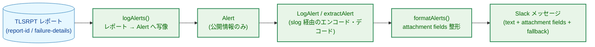
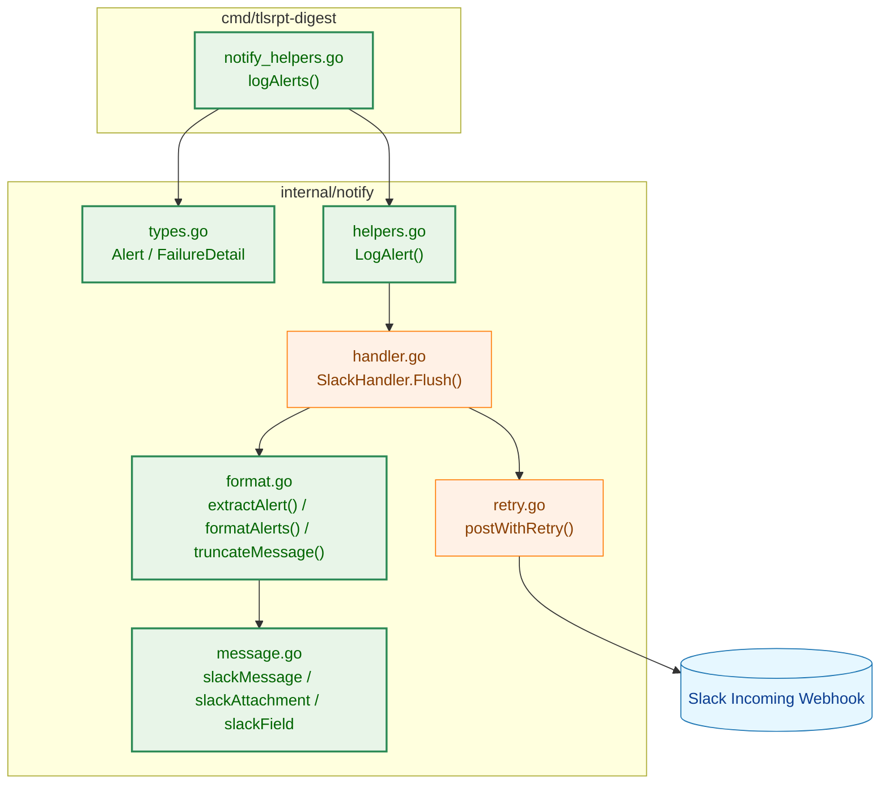
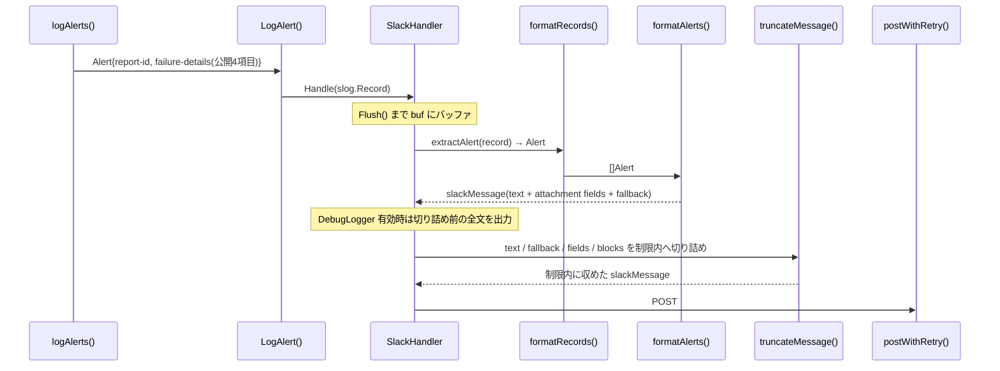

# アーキテクチャ設計書：Slack アラート通知フォーマット改善

## ドキュメントステータス

| 項目 | 内容 |
|---|---|
| ステータス | `approved` |
| 作成日 | 2026-06-08 |
| レビュー日 | 2026-06-08 |
| 最終更新日 | 2026-06-09 |
| レビュアー | isseis |
| コメント | 実 Slack 表示確認に基づき、即時アラートの主表示を Block Kit sections ではなく warning attachment fields + attachment fallback に修正 |

関連文書: [01_requirements.md](01_requirements.md)

---

## 1. 設計の全体像

### 1.1 設計原則

- **既存の通知アーキテクチャを踏襲する**: 通知は `slog.Handler`（`SlackHandler`）にバッファされ、`Flush()` 時に整形・送信される。アラートデータは型付きヘルパー `LogAlert` で `slog.Record` にエンコードされ、`extractAlert` でデコードされる。本機能もこの経路に従う。
- **型による機微情報の遮断**: 通知ペイロードに渡る型は公開情報のみを持つ。`failure-details` のうち IP アドレスや外部由来の自由記述テキストは、通知用の型に取り込まないことで構造的に遮断する（AC-13）。
- **アラートのみを対象とする**: 表示形式の変更は即時アラートに限定する。警告・システムエラー・サマリーの通知形式は変更しない。
- **既存の黄色い attachment 表示を維持する**: Slack クライアントや表示面によっては Block Kit / `attachment.blocks` の表示が安定しないため、即時アラートの主表示は既存実績のある `attachment.fields` と `attachment.color = "warning"` に戻す。
- **本文重複を避ける**: Slack は top-level `text` と attachment の両方を通常画面に表示するため、top-level `text` には短いタイトルだけを置く。本文相当の詳細は attachment fields に置き、非表示クライアント向けの全文は `attachment.fallback` に保持する。
- **DRY / YAGNI**: 1 通の通知に収まらない場合の複数メッセージ分割は導入しない。過大入力時は fields に表示するポリシー数を制限し、残りを overflow summary で要約する。

### 1.2 コンセプトモデル



本機能の要は、外部由来の `failure-details` から対応判断に有用な 4 フィールドだけを抜き出して `Alert` に写像する `logAlerts()` の境界にある。ここで機微情報を落とすことで、以降の通知経路には公開情報しか流れない。

---

## 2. システム構成

### 2.1 全体アーキテクチャ



`SlackHandler.Flush()` → `send()` → `formatRecords()` → `formatAlerts()` という既存の送信経路を維持する。本タスクは `formatAlerts()` が生成する単一アラート集約メッセージの内部構造と、そこへ至るデータ（`Alert` の拡張フィールド）を変更する。

### 2.2 コンポーネント配置

本タスクの変更は既存パッケージ内に閉じ、新規パッケージは作らない。`cmd/tlsrpt-digest` は TLSRPT レポートから通知用 `Alert` への写像境界を担当し、`internal/notify` は通知用型、`slog.Record` へのエンコード・デコード、Slack ペイロード生成、送信前切り詰めを担当する。`internal/notify` から `internal/tlsrpt` への依存は追加しない。

### 2.3 データフロー



---

## 3. コンポーネント設計

### 3.1 データ構造の拡張

`Alert` に元データ識別情報と失敗詳細を追加する。失敗詳細は `internal/notify` を `internal/tlsrpt` から独立させるため、notify ローカルの型として定義し、公開情報のみを持たせる。

```go
type Alert struct {
    OrganizationName string
    PolicyType       PolicyType
    FailureCount     int64
    DateRange        DateRange
    ReportID         string
    FailureDetails   []FailureDetail
}

// RFC 8460 failure-details のうち公開可能な 4 フィールドのみ。
// IP アドレスと自由記述 additional-information は含めない。
type FailureDetail struct {
    ResultType          string
    FailedSessionCount  int64
    ReceivingMXHostname string
    FailureReasonCode   string
}
```

### 3.2 Slack ペイロード構造

即時アラートは、top-level `text` にタイトルだけを置き、詳細本文を warning attachment fields と attachment fallback に置く。

```go
type slackMessage struct {
    Text        string            `json:"text"`
    Blocks      []slackBlock      `json:"blocks,omitempty"`
    Attachments []slackAttachment `json:"attachments,omitempty"`
}

type slackAttachment struct {
    Color    string       `json:"color,omitempty"`
    Fallback string       `json:"fallback,omitempty"`
    Blocks   []slackBlock `json:"blocks,omitempty"`
    Fields   []slackField `json:"fields,omitempty"`
}
```

`Blocks` は既存の generic Slack payload サポートおよび `truncateMessage` の防御的な切り詰め対象として残す。ただし、即時アラートの主表示では使わない。アラート以外（警告・システムエラー・サマリー）の `fields` ベース整形は従来どおり維持する。

### 3.3 アラートメッセージのレイアウト

アラートメッセージは 1 つの `slackMessage` として生成する。

| 位置 | 内容 | 目的 |
|---|---|---|
| `Text` | `⚠️ TLS Failures – N organizations affected` | 通知タイトル、通常本文の先頭、クライアントのプレビュー |
| `Attachments[0].Color` | `warning` | 旧来の黄色い attachment 表示を維持 |
| `Attachments[0].Fallback` | title を除く詳細本文の全文 | attachment fields を表示しないクライアント向け fallback |
| `Attachments[0].Fields` | ポリシーごとの概要、Report ID、Failure Details、Run ID | Slack 画面上の主表示 |

各ポリシーは、従来の見た目に近い field title/value の組として表示する。

| Field title | Field value |
|---|---|
| `Organization / Policy / Failures / Period` | `Google Inc. | sts | 2 | 2026-02-08 – 2026-02-09` |
| `Report ID` | `2026-02-08T00:00:00Z_example.com` |
| `Failure Details` | `[1] certificate-expired: 2 sessions | MX: mail.example.com` |

最後に `Run ID` field を追加する。表示対象ポリシー数が上限を超える場合は、最後の直前に `Additional Policies` field を追加し、隠れたポリシー数・組織数・失敗セッション数を要約する。

失敗詳細は `failed-session-count` の降順に並べ、上位 3 件を詳細表示する。4 件以上ある場合は残りを `Other N entries: M sessions` と要約する。`FailureDetails` が空のポリシーでは `Failure Details` field を出力しない。

外部由来文字列（組織名、Report ID、`result-type`、`receiving-mx-hostname`、`failure-reason-code`）は、制御文字を空白へ正規化したうえで field value / fallback に挿入する。表示は Markdown 装飾に依存しないプレーンな文字列で構成し、改行注入や偽の行見出しを作れないようにする。

### 3.4 Block Kit sections を採用しない理由

当初案では、黄色いサイドバーを維持しつつ構造化表示するために `attachment.blocks` の Block Kit sections を使う想定だった。しかし実 Slack での smoke 確認により、次の問題が確認された。

- Slack クライアントや表示面によっては `attachment.blocks` の本文が表示されず、top-level `text` のサブジェクトだけが見えることがある。
- 本文消失を避けるために top-level `text` に詳細本文を入れると、通常の Slack クライアントでは top-level `text` と attachment が両方表示され、同じ本文が重複する。
- top-level `blocks` に移す案は黄色い attachment サイドバーを失い、ユーザーが期待している旧来の警告表示と異なる。

そのため最終設計では、主表示を legacy attachment fields に戻し、非表示クライアント向けの全文を `attachment.fallback` に置く。これにより、通常の Slack 画面では重複せず旧来の黄色いブロック表示を維持し、attachment fields が表示されないクライアントでも fallback から詳細を取得できる。

### 3.5 失敗詳細の slog 受け渡し

`LogAlert` のシグネチャは変更せず、`Alert` の新フィールドを既存の `slog.Record` 属性へ追加する。`ReportID` は `report_id` 文字列属性として格納する。`FailureDetails` は `failure_details` グループとして格納し、その子に `"0"`、`"1"` のようなインデックス名のグループを置く。各子グループが持てるキーは `result_type`、`failed_session_count`、`receiving_mx_hostname`、`failure_reason_code` の 4 つだけである。

`FailureDetails` は slog エンコード前に `failed_session_count` 降順で最大 10 件に絞る。`extractAlert` は `failure_details` の子グループを `slog.Record.Attrs()` の走査順で復元する。想定外のキーは既存の `warnUnknownKey` と同じ方針で DebugLogger へキー名のみを警告し、属性値はログへ出さない。

### 3.6 コンポーネント責務と影響範囲

| ファイル | 責務・変更内容 |
|---|---|
| `internal/notify/types.go` | `Alert` に `ReportID`・`FailureDetails` を追加し、`FailureDetail` 型を新設 |
| `internal/notify/message.go` | `slackAttachment` に `Fallback` を追加。`Blocks` は generic payload / defensive truncation 用に保持 |
| `internal/notify/helpers.go` | `LogAlert` で新フィールドを slog 属性へエンコード |
| `internal/notify/format.go` | `extractAlert` で新フィールドをデコード。`formatAlerts` は warning attachment fields と fallback を生成。`truncateMessage` は top-level text、attachment fallback、fields、blocks を切り詰める |
| `cmd/tlsrpt-digest/notify_helpers.go` | `logAlerts` で `report.ReportID` と `policy.FailureDetails` の公開 4 項目だけを `Alert` に写像 |
| `internal/notify/*_test.go` | fields/fallback の JSON shape、本文非重複、fallback、切り詰め、機微情報非混入を検証 |
| `cmd/tlsrpt-digest/*_test.go` | TLSRPT レポートから公開 4 項目だけが通知へ写像されることを検証 |

---

## 4. エラー処理設計

未知の slog 属性は既存どおり通知内容へ混ぜず、DebugLogger にキー名のみを出す。`failure_details` の子グループが壊れている、型が違う、値が欠落している場合も、通知送信自体は失敗させず、その詳細行だけを無視する。

Slack 送信失敗時のリトライ、`Flush()` のエラー返却、DebugLogger への切り詰め前ログ出力は既存実装に従う。

---

## 5. セキュリティ設計

通知に含めてよい外部由来値は、組織名、Report ID、`result-type`、`failed-session-count`、`receiving-mx-hostname`、`failure-reason-code` に限定する。`sending-mta-ip`、`receiving-ip`、`additional-information`、その他の自由記述値は `Alert` 型に含めない。

外部由来文字列は制御文字を空白へ正規化し、値ごとの上限で切り詰める。field / fallback の表示は Markdown 装飾に依存しないプレーンな文字列として構成し、改行注入や偽の行見出しを作れないようにする。

DebugLogger は切り詰め前の通知内容を出力しうるため、通知ペイロード自体に機微情報が入らないことを型境界とテストで担保する。

---

## 6. サイズ制限と切り詰め

アラートは単一 Slack メッセージとして送信する。通常ケースでは全ポリシーを attachment fields に表示し、大量ケースでは `maxAlertPoliciesInFields` を超える分を `Additional Policies` field に要約する。

切り詰め対象は次のとおり。

- top-level `Text`
- `Attachments[].Fallback`
- `Attachments[].Fields[].Title`
- `Attachments[].Fields[].Value`
- `Blocks` / `Attachments[].Blocks` の text values（型として残っているため防御的に対象にする）

`truncateMessage` は送信前に常時実行し、Slack API の文字数制限を超える値を短縮する。切り詰めは必ず公開情報に対して行われるため、切り詰め処理が機微情報を新たに混入させることはない。

---

## 7. テスト設計

| 観点 | 代表テスト |
|---|---|
| Alert エンコード/デコード | `LogAlert` が Report ID と FailureDetails を slog に載せ、`extractAlert` が復元する |
| Slack payload shape | アラートが title-only top-level text、warning attachment、fields、fallback を持つ |
| 表示回帰 | 旧来の `Organization / Policy / Failures / Period` field 表示、Report ID、Failure Details、Run ID が出る |
| 本文非重複 | top-level `Text` に詳細本文を含めず、詳細は attachment fields / fallback に置く |
| 機微情報遮断 | IP アドレスと `additional-information` が通知 payload / DebugLogger に出ない |
| 大量入力 | field overflow summary が出る、送信 payload が制限内に切り詰められる |
| 既存通知回帰 | warning、system error、summary の fields 表示が変わらない |
| Slack smoke | `make test-slack-notify` で黄色い attachment 表示と fallback の送信 payload を確認する |

---

## 8. 実装フェーズ

1. **データ拡張**: `Alert` / `FailureDetail`、`LogAlert`、`extractAlert`、`logAlerts` の写像を追加する。
2. **Slack 表示整形**: `formatAlerts` を warning attachment fields + fallback へ更新し、top-level `text` をタイトルのみにする。
3. **サイズ制限**: policy field 表示上限、failure detail 表示上限、fallback / fields / blocks の切り詰めを実装する。
4. **テスト更新**: payload shape、本文非重複、fallback、機微情報遮断、既存通知回帰を追加・更新する。
5. **手動確認**: `make test-slack-notify` で Slack 上の黄色い attachment 表示が期待どおりであることを確認する。

---

## 9. 将来の拡張余地

- 他の通知種別を Block Kit 化する場合でも、即時アラートの warning attachment fields 設計とは独立に扱う。
- 複数メッセージ分割やファイル添付は本タスクの範囲外とする。必要になった場合は Slack 表示互換性と fallback の扱いを別途設計する。
- `slackBlock` は型として残っているが、即時アラートの主表示へ再導入する場合は、本文消失・本文重複・黄色い attachment 表示の維持を再検証する。

---

## Appendix: Slack 表示方式の判断

当初の Block Kit sections 案は、構造化された表示としては自然だった。しかし、この通知で最も重要なのは「どの Slack 画面でも本文が見えること」と「旧来の黄色い警告表示を維持すること」である。

最終設計では次を優先する。

- Slack の通常画面では、top-level `text` はタイトルだけにして詳細本文の重複を防ぐ。
- 主表示は `attachment.fields` に置き、旧来の黄色い attachment と太字 field title の見た目を維持する。
- `attachment.fallback` に詳細本文を置き、fields が表示されないクライアントにも情報を残す。

このため、即時アラートでは Block Kit sections を主表示として使わない。
