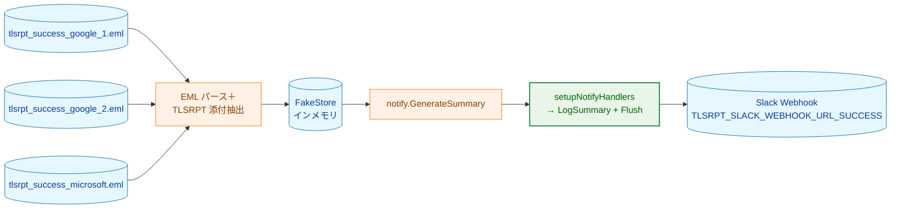
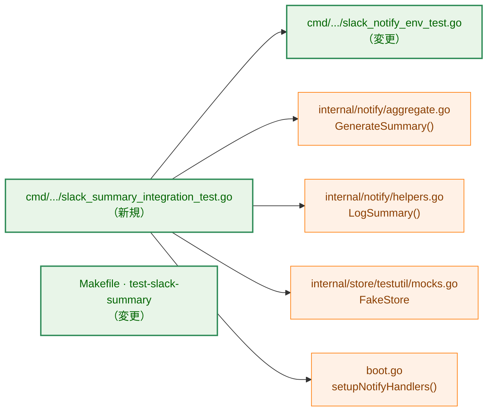
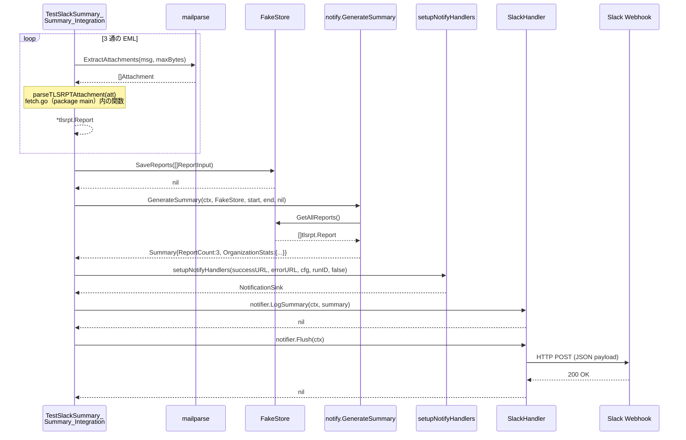
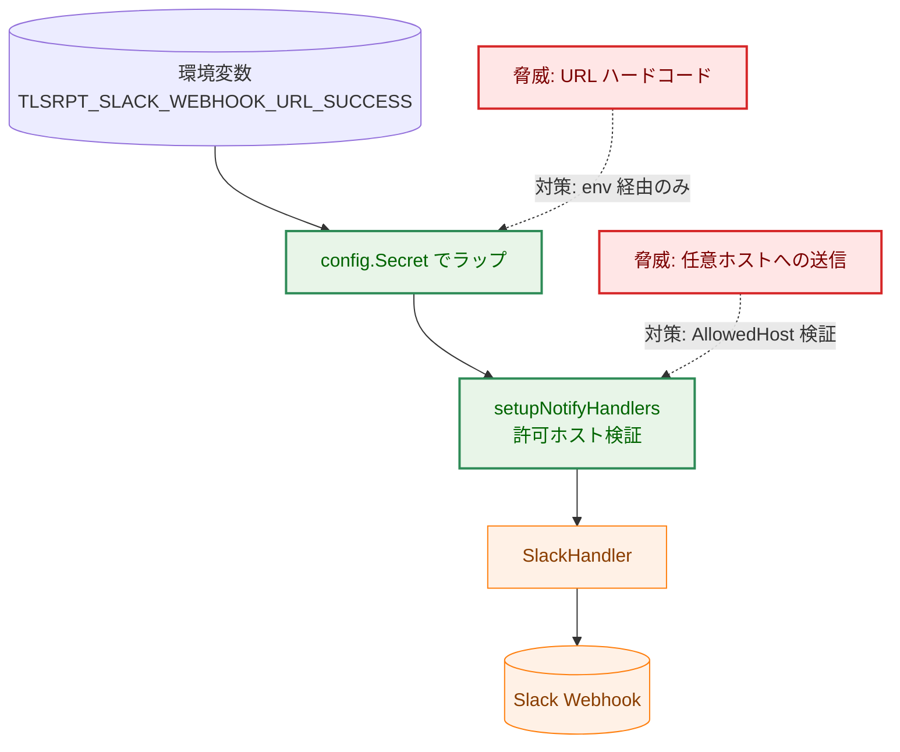
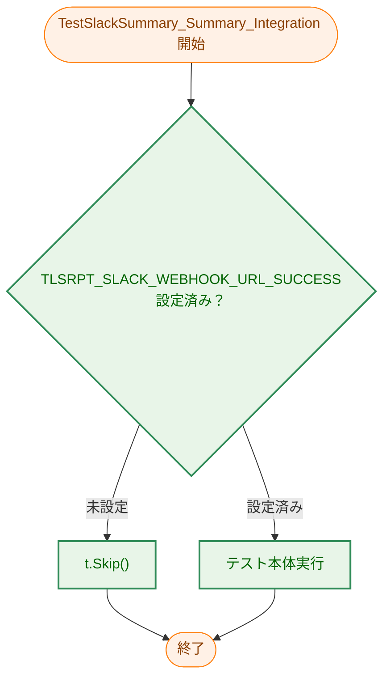
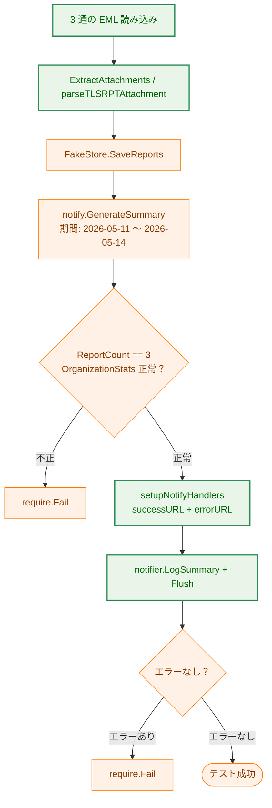

# アーキテクチャ設計書：Slack サマリ通知インテグレーションテスト

## ドキュメントステータス

| 項目 | 内容 |
|---|---|
| ステータス | `approved` |
| 作成日 | 2026-06-09 |
| レビュー日 | 2026-06-09 |
| レビュアー | isseis |
| コメント | - |

---

## 1. 設計の全体像

### 1.1 設計原則

本タスクはプロダクションコードではなく **テストコード** を追加する。設計上の優先事項は以下のとおり。

- **DRY**: 通知経路（`setupNotifyHandlers`、`notify.GenerateSummary`、`notifier.LogSummary`）は既存の本番コードパスをそのまま再利用し、テスト専用の送信ロジックは一切実装しない。
- **隔離**: `//go:build test && slack_notify` タグで本統合テストをビルドから隔離し、`make test` / `make test-integration` には含めない。
- **副作用なし**: ストレージには `FakeStore`（インメモリ）を使用し、ディスク書き込みを行わない。
- **タスク 0100 の対称性**: failure アラートのインテグレーションテスト（`TestSlackNotify_FailureAlert_Integration`）と同じ構造を踏襲し、差分を最小にする。

### 1.2 コンセプトモデル



矢印 A → B はデータが A から B へ流れることを示す。

**凡例**: `data`（青）= データ／ストレージ、`process`（橙）= 既存処理、`enhanced`（緑）= 変更・追加コンポーネント

---

## 2. システム構成

### 2.1 コンポーネント配置

本タスクで変更・追加するファイルは `cmd/tlsrpt-digest` パッケージ内のみ。既存の `internal/` パッケージは変更しない。



矢印 A → B は A が B を呼び出す（依存する）ことを示す。

**凡例**: `process`（橙）= 変更なし、`enhanced`（緑）= 変更・新規追加

### 2.2 データフロー



---

## 3. コンポーネント設計

### 3.1 コンポーネント責務一覧

| ファイル | 変更種別 | 責務 |
|---|---|---|
| `cmd/tlsrpt-digest/slack_notify_env_test.go` | 変更 | success Webhook URL 欠落判定ヘルパー（`missingSlackSummaryEnv`）とユニットテスト（`TestSlackSummary_EnvRequirements`）を追加 |
| `cmd/tlsrpt-digest/slack_summary_integration_test.go` | 新規 | EML パース → FakeStore 保存 → サマリ生成 → Slack 送信の統合テスト（`TestSlackSummary_Summary_Integration`） |
| `Makefile` | 変更 | `test-slack-summary` ターゲットを追加（`.PHONY` も更新） |

既存ファイルで変更が **不要** なもの：

| ファイル | 変更不要の理由 |
|---|---|
| `cmd/tlsrpt-digest/boot.go` | `setupNotifyHandlers` はそのまま再利用可能 |
| `internal/notify/aggregate.go` | `GenerateSummary` はそのまま再利用可能 |
| `internal/store/testutil/mocks.go` | `FakeStore` はそのまま再利用可能 |

### 3.2 環境変数ヘルパーの設計

タスク 0100 の `missingSlackNotifyEnv` パターンを踏襲し、success Webhook URL 用の対称的な純粋ヘルパーを追加する。

```go
// 注: success URL は notify.EnvSlackWebhookURLSuccess を直接参照する（定数エイリアス不要）。
// error URL は既存の slackNotifyWebhookEnvKey (= notify.EnvSlackWebhookURLError) を再利用する。

// 追加する純粋関数（env == nil のとき os.Getenv にフォールバック）
// 両方の URL が設定されているかを確認する。
func missingSlackSummaryEnv(env map[string]string) []string
```

`notify.ValidateEnvCombination` は success URL が設定されているのに error URL が空の場合にエラーを返す。したがって、`missingSlackSummaryEnv` は `TLSRPT_SLACK_WEBHOOK_URL_SUCCESS` と `TLSRPT_SLACK_WEBHOOK_URL_ERROR` の**両方**の設定を必須とする。

`loadSlackSummaryTestEnv(t *testing.T) (successURL, errorURL string)` は統合テストファイル内に定義し、env ヘルパーを呼んで未設定時に `t.Skip` する薄いラッパーとする。

### 3.3 統合テスト関数の設計

```go
// ビルドタグ: //go:build test && slack_notify
func TestSlackSummary_Summary_Integration(t *testing.T)
```

処理の骨格：

1. `loadSlackSummaryTestEnv(t)` で success URL と error URL を取得（いずれか未設定なら `t.Skip`）
2. `ulid.Make().String()` で runID を生成
3. 3 つの EML を読み込み → `mailparse.ExtractAttachments` → `parseTLSRPTAttachment` でレポート取得
4. `storetestutil.NewFakeStore()` にレポートを保存
5. サマリ期間を `2026-05-11T00:00:00Z` ～ `2026-05-14T00:00:00Z` に設定（3 レポートすべての EndDatetime を包含）
6. `notify.GenerateSummary(ctx, fakeStore, start, end, nil)` でサマリ生成
7. `ReportCount`・`OrganizationStats` をアサート（AC-04〜07 の確認）
8. `setupNotifyHandlers(config.Secret(successURL), config.Secret(errorURL), cfg, runID, false)` でノーティファイア構築
9. `notifier.LogSummary(ctx, summary)` → `notifier.Flush(ctx)` でサマリ送信
10. `require.NoError` で送信成功を確認

**サマリ期間の設定根拠**: 3 レポートの `EndDatetime` はそれぞれ 2026-05-11T23:59:59Z、2026-05-12T23:59:59Z、2026-05-13T23:59:59Z。`GenerateSummary` の包含条件は `start <= EndDatetime < end` であるため、`start = 2026-05-11T00:00:00Z`、`end = 2026-05-14T00:00:00Z` とすれば 3 件すべてが対象となる。

**`setupNotifyHandlers` への両 URL 要件**: `notify.ValidateEnvCombination` は `successURL != "" && errorURL == ""` の組み合わせを拒否する（`silent failures` を防ぐためのガード）。そのため、テストでは `TLSRPT_SLACK_WEBHOOK_URL_SUCCESS` と `TLSRPT_SLACK_WEBHOOK_URL_ERROR` の両方を渡す必要がある。

### 3.4 Makefile ターゲット設計

`test-slack-summary` ターゲットを新規追加する。ターゲットは以下の条件を満たすように構成する。

- ビルドタグ `test,slack_notify` を指定し、`TestSlackSummary` プレフィックスのテストのみを実行するフィルタを適用する。
- `-v -count=1` を渡してテスト出力を詳細に表示し、キャッシュを無効化する。
- `./cmd/tlsrpt-digest/...` を対象パターンとする。
- 実行には `TLSRPT_SLACK_WEBHOOK_URL_SUCCESS` と `TLSRPT_SLACK_WEBHOOK_URL_ERROR` の両方が必要（`ValidateEnvCombination` の制約による）。

`.PHONY` に `test-slack-summary` を追加する。`test-integration` のビルドタグには `slack_notify` を含まないため、本テストは `make test-integration` では実行されない（AC-13）。

---

## 4. エラーハンドリング設計

本タスクではプロダクションコードのエラー型定義は追加しない。テスト内のエラー処理は以下の方針とする。

| エラー場面 | 処理方針 |
|---|---|
| EML ファイル読み込み失敗 | `require.NoError` でテスト失敗（ファイルは testdata に固定） |
| TLSRPT 添付パース失敗 | `require.NotNil(t, report)` でテスト失敗 |
| `GenerateSummary` 失敗 | `require.NoError` でテスト失敗 |
| `notifier.Flush` 失敗 | `require.NoError` でテスト失敗（Slack 疎通の主要なアサーション） |

---

## 5. セキュリティ考慮事項

本タスクはテストコードのみを追加するが、[Notification Security Guidelines](../../dev/developer_guide/notification_security.md) に従い以下を守る。

### 5.1 Webhook URL の保護

- `TLSRPT_SLACK_WEBHOOK_URL_SUCCESS` は環境変数経由のみで取得し、コード内にハードコードしない。
- `config.Secret(webhookURL)` でラップして `setupNotifyHandlers` に渡すことで、誤って文字列としてログ出力されないよう保護する。

### 5.2 許可ホスト検証

`setupNotifyHandlers` が内部で呼ぶ `notify.BuildHandlers` は Webhook URL のホスト名を `cfg.Notify.Slack.AllowedHost` と照合する。テストでは既存の `TestSlackNotify_FailureAlert_Integration` と同じ手順（URL から hostname を取り出して `cfg.Notify.Slack.AllowedHost` に設定）を踏襲する。

### 5.3 脅威モデル



実線矢印 A → B はデータが A から B へ流れることを示す。破線矢印 A -.-> B は脅威 A に対する対策が B に適用されることを示す。

**凡例**: `problem`（赤）= 脅威、`enhanced`（緑）= 対策済みコンポーネント、`process`（橙）= 既存処理

---

## 6. 処理フロー詳細

### 6.1 環境変数スキップフロー



矢印 A → B は制御フローが A から B へ移ることを示す。

**凡例**: `process`（橙）= Go テストランタイム、`enhanced`（緑）= 本タスクで追加するロジック

### 6.2 テスト本体フロー



矢印 A → B は制御フローが A から B へ移ることを示す。

**凡例**: `enhanced`（緑）= 本タスクで追加するコード、`process`（橙）= 既存コードの呼び出し

---

## 7. テスト戦略

### 7.1 ユニットテスト（常時実行、ビルドタグ: `test`）

`slack_notify_env_test.go` に `TestSlackSummary_EnvRequirements` を追加する。テストケースは既存の `TestSlackNotify_EnvRequirements` と対称的に設計する。

| テストケース | 確認内容 |
|---|---|
| `webhook_url_missing` | `slackSummaryWebhookEnvKey` が欠落時に missing リストに含まれること |
| `webhook_url_empty_value` | 空文字列のとき missing リストに含まれること |
| `webhook_url_set` | 値が設定されているとき missing リストが空であること |
| `nil_env_fallback_present` | `env == nil` のとき os.Getenv にフォールバックして設定済みを返すこと |
| `nil_env_fallback_missing` | `env == nil` のとき os.Getenv にフォールバックして未設定を返すこと |

### 7.2 統合テスト（手動実行専用、ビルドタグ: `test && slack_notify`）

`TestSlackSummary_Summary_Integration` の主要なアサーション：

| AC | アサーション種別 | 確認内容 |
|---|---|---|
| AC-01〜03 | `require.NotNil` / `require.NoError` | 3 通のパース成功、FakeStore 保存確認 |
| AC-02 | `assert.False(report.HasFailure())` | failure ゼロ確認 |
| AC-04 | `require.Equal(t, int64(3), summary.ReportCount)` | ReportCount |
| AC-05 | `assert.Contains` | OrganizationStats のキー確認 |
| AC-06 | `assert.Equal(t, int64(5), summary.OrganizationStats["Google Inc."])` | Google 成功セッション合計 |
| AC-07 | `assert.Equal(t, int64(2), summary.OrganizationStats["Microsoft Corporation"])` | Microsoft 成功セッション合計 |
| AC-08 | `require.NoError` on Flush | 送信完了確認 |
| AC-09 | 設計的保証（`setupNotifyHandlers` 本番コードパス再利用） | 通知経路・書式・リトライ挙動が本番と同一であること |
| AC-10 | `t.Skip` in `loadSlackSummaryTestEnv` | 未設定時スキップ |
| AC-11 | `make test-slack-summary` ターゲット追加（Section 3.4 参照） | 専用ターゲットによる単独実行 |
| AC-12 | 設計的保証（`loadSlackSummaryTestEnv` が環境変数を読み取る） | 環境変数渡しでの実行 |
| AC-14 | FakeStore 使用（ディスクなし） | 永続ファイル非作成 |

### 7.3 セキュリティテスト

既存の `notification_security.md` が要求するテストはタスク 0100・0030 にて実施済み。本タスクはテストコードのみを追加し、通知経路の新規実装を行わないため、追加のセキュリティテストは不要。

### 7.4 Mattermost 互換性

本プロジェクトのターゲットクライアント環境には Slack（デスクトップ/モバイル）と Mattermost の両方が含まれる。本テストが送信するサマリメッセージは既存の `notify.LogSummary` の実装をそのまま使用する。`LogSummary` が生成するメッセージ書式はタスク 0030 で設計・検証済みであり、当該タスクの設計時に Mattermost での表示互換性も考慮されている。本タスクでは通知経路に変更を加えないため、Mattermost 互換性への影響はない。

---

## 8. 実装優先順位

### フェーズ 1: 環境変数ヘルパーとユニットテスト

1. `slack_notify_env_test.go` に `slackSummaryWebhookEnvKey`・`missingSlackSummaryEnv`・`TestSlackSummary_EnvRequirements` を追加する。

### フェーズ 2: 統合テストと Makefile

1. `slack_summary_integration_test.go` を新規作成する。
2. `Makefile` に `test-slack-summary` ターゲットを追加する。

2 フェーズは独立しているが、フェーズ 1 のヘルパーをフェーズ 2 が利用するため順序どおりに実施する。

---

## 9. 将来の拡張性

本タスクの実装完了後、以下の拡張が容易になる。

- **他の通知種別（警告・システムエラー）の統合テスト追加**: 同じパターン（env ヘルパー + `//go:build test && slack_notify` の統合テスト）で拡張可能。
- **CI での自動実行**: 現時点では手動実行専用だが、シークレット管理が整備された場合に `make test-slack-summary` を CI ジョブに組み込むことができる。その際、ビルドタグおよびターゲットの設計変更は不要。
