# アーキテクチャ設計書：IMAP メールボックスの古いメール自動削除

## ドキュメントステータス

| 項目 | 内容 |
|---|---|
| ステータス | `approved` |
| 作成日 | 2026-06-10 |
| レビュー日 | 2026-06-10 |
| レビュアー | isseis |
| コメント | - |

---

## 1. 設計の全体像

### 1.1 設計原則

- **オプトイン・フェイルセーフ**: IMAP 削除はデフォルト無効（`imap.retention_days = 0`）とし、明示的に正の値を設定したときのみ有効化する。有効時も config ロード時の不変条件チェック（AC-05）と `--dry-run`（AC-10）で誤削除を防ぐ。
- **対象限定削除**: 削除は検索でヒットした UID のみを対象とする（`\Deleted` 付与 + UID EXPUNGE）。メールボックス全体に作用する無差別 EXPUNGE / CLOSE は使用しない（AC-08）。
- **既存パターンの踏襲**: 認証情報の注入（`fetchRunner.credentials`）、システムエラー通知（`notifyGCSystemError`）、カットオフ計算（`Duration.Cutoff`）など、既存の実装パターンを再利用し、新規の仕組みを増やさない。
- **dry-run は読み取り専用**: dry-run ではローカルストア・IMAP サーバーの双方に対し一切の書き込み・削除を行わない。IMAP へは読み取り専用（EXAMINE）でのみアクセスする。

### 1.2 概念モデル

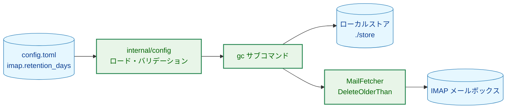

矢印 A → B は「A から B へデータが流れる、または A が B に対して操作を行う」ことを表す。

**Legend**

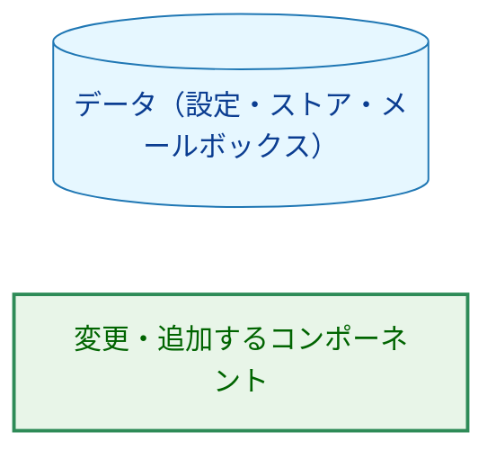

本タスクは「IMAP メールボックスを保持期間で掃除する」機能を `gc` サブコマンドに追加する。ローカルストアの GC（既存）と IMAP メールボックスの GC（新規）が 1 回の `gc` 実行で順に行われる。

---

## 2. システム構成

### 2.1 全体アーキテクチャ

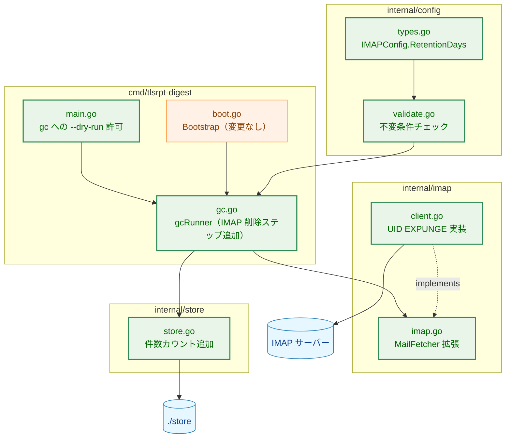

実線矢印 A → B は「A から B へ処理または設定値が渡される（呼び出し・データの流れ）」ことを表す。破線矢印 A -.-> B は「A が B（インターフェース）を実装する」ことを表す。

**Legend**

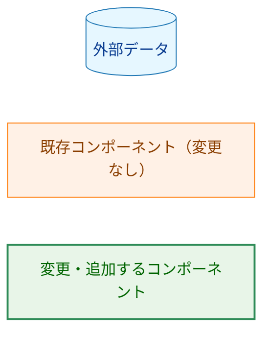

### 2.2 コンポーネント配置（変更ファイル一覧）

| ファイル | 変更内容 | 関連 AC | 更新が必要な既存テスト |
|---|---|---|---|
| `internal/config/types.go` | `IMAPConfig.RetentionDays int` / `rawIMAPConfig.RetentionDays *int`（TOML キー `retention_days`）を追加する。 | AC-01 | `internal/config/config_test.go`・`load_file_test.go`（`IMAPConfig` の全フィールド比較をしているテーブルテスト）。 |
| `internal/config/defaults.go` | デフォルト `0`（無効）を適用する。 | AC-02 | 同上。 |
| `internal/config/validate.go` | 負値拒否・不変条件チェック（`0` は無効値として不変条件の対象外）を追加する。 | AC-03, AC-04, AC-05 | なし（追加のみ）。 |
| `internal/config/errors.go` | 専用エラー変数を追加する。 | AC-06 | なし（追加のみ）。 |
| `internal/imap/imap.go` | `MailFetcher` に `DeleteOlderThan` / `SearchOlderThan` を追加する。 | AC-15, AC-16 | `MailFetcher` を実装・利用する全テスト（コンパイルエラーとして検出される）。 |
| `internal/imap/client.go` | `imapSession` の拡張（capability 照会・UID EXPUNGE）と実装を追加する。 | AC-08, AC-12, AC-15, AC-16 | `internal/imap/client_test.go`（`fakeSession` にメソッド追加が必要）。 |
| `internal/imap/testutil/mocks.go` | `FakeMailFetcher` に呼び出し記録付きメソッドを追加する。 | AC-17 | なし（追加のみ）。 |
| `internal/store/store.go`・`reports.go`・`emails.go` | `CountReportsBefore` / `CountEmailsBefore`（読み取り専用の削除候補カウント）を追加する。 | AC-10 | `store.Store` を実装する `FakeStore`（コンパイルエラーとして検出される）。 |
| `internal/store/testutil/` | `FakeStore` にカウントメソッドを追加する。 | AC-10 | なし（追加のみ）。 |
| `cmd/tlsrpt-digest/gc.go` | IMAP 削除ステップ（`retention_days = 0` ではスキップ）・認証情報取得・dry-run 分岐・エラー分類を追加する。 | AC-03, AC-07, AC-09, AC-10, AC-11, AC-13, AC-14 | `cmd/tlsrpt-digest/gc_test.go`（`gcRunner` の構築箇所と削除件数ログの形式）。 |
| `cmd/tlsrpt-digest/main.go` | `gc` への `--dry-run` 許可と、`--dry-run` フラグ説明文（現在 fetch 専用の文言）・`printDetailedHelp` の文言更新を行う。 | AC-10 | `main_test.go::TestParseCLI_DryRunUnsupportedSubcommands` / `TestRunCLI_DryRunUnsupportedSubcommandExits2`（`gc` が dry-run 不可であることを表明しており、許可側へ移動する）、`TestParseCLI_DryRunSupportedSubcommands`（許可リスト `{fetch, summary}` に `gc` を追加する）。 |
| `internal/imap/client_integration_test.go` | greenmail に対する削除の統合テスト（UIDPLUS 対応時の end-to-end、非対応時のフォールバック）を追加する。 | AC-07, AC-08, AC-12 | なし（追加のみ）。 |
| `go.mod` | `github.com/emersion/go-imap-uidplus` を依存に追加する（§3.3 参照）。 | AC-08, AC-12 | なし。 |
| `config.toml`・README | 設定例とオプトイン手順・有効化時の挙動説明を追加する。 | NFR | なし。 |

> **要件記載コンポーネントからの派生追加**: `internal/store/` への変更は `01_requirements.md` の「影響を受けるコンポーネント」に明記されていないが、AC-10（dry-run で削除予定の件数をログ出力する）を満たすために必要となる派生変更である。dry-run ではストアが読み取り専用で開かれるため、既存の `DeleteReportsBefore` / `DeleteEmailsBefore` を呼び出して件数を得ることはできず、読み取り専用のカウント手段が他に存在しない（理由の詳細は付録 A.2 を参照）。

### 2.3 データフロー（gc 非 dry-run・IMAP 削除有効時）

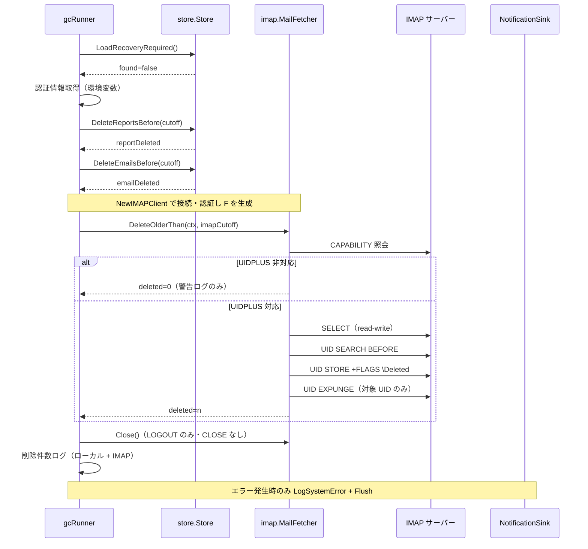

---

## 3. コンポーネント設計

### 3.1 config 拡張

`[imap]` セクションに `retention_days` を新設する。既存の `[store] retention_days`（ローカルのレポート保持期間）とはスコープで区別する。

```go
// IMAPConfig holds IMAP connection and fetch settings.
type IMAPConfig struct {
    Host            string
    Port            int
    Mailbox         string
    FetchDays       int
    TLSCACert       string
    MaxMessageBytes int64
    RetentionDays   int // 追加: 0 = IMAP 削除無効（デフォルト）
}

type rawIMAPConfig struct {
    // ...既存フィールド...
    RetentionDays *int `toml:"retention_days"`
}
```

設定値の意味と検証規則は次のとおりである。

| 値 | 意味 | 検証 |
|---|---|---|
| 未指定 | デフォルト `0`（無効）を適用する（AC-02）。 | - |
| `0` | IMAP 削除を無効化する。不変条件チェックの対象外とする（AC-03）。 | - |
| 負値 | 設定エラーとし、config ロード時に起動を拒否する（AC-04）。 | `ErrInvalidIMAPRetentionDays` |
| 正値 | IMAP 削除を有効化する。`retention_days >= max(imap.fetch_days, summary.window_days)` を満たさない場合は設定エラーとする（AC-05）。 | `ErrIMAPRetentionTooShort` |

AC-05 の不変条件は、取得ウィンドウ（`fetch_days`）内のメールがまだ取得され得るうちに削除されることを防ぐ。`summary.window_days` を含めるのは保守的な安全マージンであり、集計ウィンドウより短い保持期間という直感に反する設定を拒否するためである。

**残余リスク**: この不変条件は config ロード時のみ検証される。`fetch --since 90d` のような実行時フラグは `fetch_days` を上書きできるため、`retention_days` を超える `--since` 指定では「削除済みのため取得できないメール」が生じ得る。要件は config 検証のみをスコープとしているため設計上は許容し、README に「`--since` は `imap.retention_days` 以下にすること」という運用上の注意として記載する（Phase 5）。

### 3.2 MailFetcher インターフェース拡張

```go
// MailFetcher abstracts IMAP operations.
type MailFetcher interface {
    FetchMeta(ctx context.Context, since time.Time) (FetchMetaResult, error)
    Download(ctx context.Context, uids []uint32) (map[uint32][]byte, error)
    MarkSeen(ctx context.Context, uids []uint32) error
    Close() error

    // DeleteOlderThan は INTERNALDATE（日付截断）が cutoff より古いメールを削除する。
    // cutoff がゼロ値の場合は何もせず (0, nil) を返す（AC-16）。
    // サーバーが UIDPLUS 非対応の場合は警告ログのみ出力し (0, nil) を返す（AC-12）。
    DeleteOlderThan(ctx context.Context, cutoff time.Time) (deleted int, err error)

    // SearchOlderThan は INTERNALDATE（日付截断）が cutoff より古いメールの UID を
    // 読み取り専用（EXAMINE）で検索して返す。メールボックスの状態は変更しない。
    // dry-run での削除候補の提示（AC-10）に使用する。
    SearchOlderThan(ctx context.Context, cutoff time.Time) ([]uint32, error)
}
```

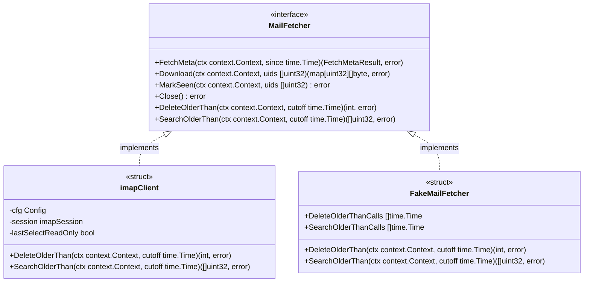

矢印 A ..|> B は「A が B を実装する」ことを表す（クラス図の `implements`）。

> **`SearchOlderThan` を追加する理由**: 要件のスコープは「`MailFetcher` への削除メソッド追加」のみを挙げているが、AC-10 は dry-run で「削除予定の件数・対象」のログ出力を要求する。AC-15 で `DeleteOlderThan` のシグネチャは削除専用に固定されているため、副作用なしに削除候補を得る読み取り専用メソッドが別途必要となる。実装上は両メソッドが同一の検索ヘルパー（`UID SEARCH BEFORE`）を共有するため、ロジックの重複は生じない。

### 3.3 imapClient 実装方針（UID EXPUNGE）

**なぜ既存の手段では満たせないか**: go-imap v1.2.1 のコア API には UID EXPUNGE がなく、あるのはメールボックス全体の `\Deleted` を対象とする EXPUNGE / CLOSE のみである。これらは他クライアントが `\Deleted` を付与したメールを巻き込んで削除するため AC-08 が明示的に禁止している。UID EXPUNGE（RFC 4315 UIDPLUS 拡張）を使うには、go-imap と同一作者の拡張モジュール `github.com/emersion/go-imap-uidplus` を依存に追加する。

設計上の要点は次のとおりである（処理順序は §6.2 のフロー図を参照）。

- `imapSession` インターフェース（`client.go` 内部）に capability 照会と UID EXPUNGE のメソッドを追加し、`dialTLS` が返す実装で go-imap 本体および go-imap-uidplus に委譲する。既存のテスト用 `fakeSession` にも同メソッドを追加する。
- UIDPLUS 対応確認は SELECT より前に行う。非対応なら `\Deleted` を一切付与せず、`slog.Warn` を出力して `(0, nil)` を返す（AC-12）。`\Deleted` を付与してから EXPUNGE 手段がないことに気づく順序にはしない（付与済みフラグが他クライアントの CLOSE で意図せず削除される危険を避けるため）。
- 検索条件は `UID SEARCH BEFORE <date>` を使用する。RFC 3501 の BEFORE は INTERNALDATE の日付部分（時刻・タイムゾーンを無視）で比較するため、AC-07 の「INTERNALDATE（日付截断）」と一致する。境界日（cutoff 当日）のメールは削除されない（保守的側に倒れる）。
- 削除は検索でヒットした UID の集合に対してのみ `UID STORE +FLAGS (\Deleted)` → `UID EXPUNGE <uid set>` を発行する（AC-08）。検索と削除の間に他クライアントがメールを削除した場合、存在しない UID への STORE / EXPUNGE は IMAP 的に no-op であり安全である。
- `DeleteOlderThan` は read-write SELECT を行うため `lastSelectReadOnly = false` となり、既存の `Close()` のガード（read-write SELECT 後は CLOSE を送らず LOGOUT のみ）がそのまま機能する。これはタスク 0090 で確立した「CLOSE による巻き添え EXPUNGE 防止」ポリシー（`client.go` の `Close()` コメント参照）に準拠しており、例外を作らない。
- `SearchOlderThan` は EXAMINE（読み取り専用 SELECT）+ `UID SEARCH BEFORE` のみを行う。
- read-write SELECT の結果がそれでも read-only だった場合（サーバー側の権限制約）は、`MarkSeen` と同様に `ErrMailboxReadOnly` を返す。

**外部サービス機能の動作検証**: UIDPLUS（RFC 4315）の対応状況と削除の実効性は次のとおりである。

| 環境 | 検証項目 | 状況 |
|---|---|---|
| Gmail（本番運用想定） | UIDPLUS capability の広告 | 対応（CAPABILITY 応答に `UIDPLUS` を広告することが Google の IMAP 仕様で公開されている）。実装フェーズの手動確認でも CAPABILITY 応答を記録する。 |
| Gmail（本番運用想定） | EXPUNGE によりストレージが実際に解放されること | **未検証・設定依存**。Gmail の IMAP 設定「自動的に削除する（Auto-Expunge）」および「最後の表示可能な IMAP フォルダからメールを削除するようマークが付けられ、削除した場合」のデフォルトは「メールをアーカイブする」であり、この場合 INBOX への UID EXPUNGE はラベル除去（全メールへの移動）となり**ストレージは解放されない**。主目的（サーバー上の蓄積抑止）を達成するには、Gmail 側で「完全に削除する」（または「ゴミ箱に移動」+ ゴミ箱の自動完全削除）の設定が運用上の前提条件となる。この前提を README に明記し（Phase 5）、実 Gmail アカウントでの動作確認を実装フェーズの手動検証項目として `03_implementation_plan.md` に含める。 |
| greenmail（統合テスト環境） | UIDPLUS capability の広告 | **未検証**。対応していない場合、統合テストでは AC-12 のフォールバック経路（警告ログ + 削除 0 件）のみが検証可能となる。実装フェーズの最初に greenmail の CAPABILITY 応答を確認し、結果を `03_implementation_plan.md` に記録する。非対応の場合、UID EXPUNGE の正常系は `fakeSession` ベースの単体テストで担保する。 |

### 3.4 Store インターフェース拡張（dry-run 用カウント）

```go
type Store interface {
    // ...既存メソッド...

    // CountReportsBefore は DeleteReportsBefore と同一の条件
    // （date-range.end-datetime < cutoff）に一致するレポート件数を返す。
    // 読み取り専用ストアでも動作する。
    CountReportsBefore(cutoff time.Time) (int, error)

    // CountEmailsBefore は DeleteEmailsBefore と同一の条件
    // （internal_date < cutoff）に一致する .eml 件数を返す。
    // DeleteEmailsBefore と同様、cutoff がゼロ値の場合は (0, nil) を返す。
    // 読み取り専用ストアでも動作する。
    CountEmailsBefore(cutoff time.Time) (int, error)
}
```

カウントの判定条件は対応する Delete メソッドと同一の述語を共有し、dry-run のプレビューと実削除の結果が乖離しないようにする。

### 3.5 gc サブコマンド拡張

`gcRunner` は `fetchRunner` と同じ依存注入パターンを取る。

```go
// gcRunner implements SubcommandRunner for the gc subcommand.
type gcRunner struct {
    now            func() time.Time
    newMailFetcher func(cfg imap.Config) (imap.MailFetcher, error)
    credentials    func() (username string, password config.Secret)
}
```

処理ステップは既存の Step 1–4 を維持し、IMAP 削除を追加する（フロー全体は §6.1 を参照）。

1. recovery-required チェック（既存・変更なし）。
2. **認証情報チェック（新規）**: `imap.retention_days > 0` かつ非 dry-run の場合、環境変数 `TLSRPT_IMAP_USERNAME` / `TLSRPT_IMAP_PASSWORD` を確認する。欠落していればローカル削除を行う前に `SystemErrorKindIMAPCredentialsMissing` を通知してエラー終了する（AC-11）。fetch と同じくフェイルファーストとし、設定不備を即座に顕在化させる。
3. ローカルのレポート削除（既存・変更なし）。
4. ローカルの .eml 削除（既存・変更なし）。
5. **IMAP 削除（新規）**: `imap.retention_days > 0` の場合のみ IMAP に接続し、`DeleteOlderThan(ctx, cutoff)` を呼ぶ。`cutoff` は既存ヘルパー `Duration{Days: cfg.IMAP.RetentionDays}.Cutoff(now)` で計算する。`retention_days = 0` の場合はこのステップ全体をスキップし、IMAP への接続自体を行わない（AC-09）。
6. 削除件数ログ（変更）: 成功時は既存の `slog.Info("gc: deleted records", ...)` に IMAP 削除件数を追加した統合ログを出力する（AC-14）。IMAP ステップが失敗した場合も、実行済みのローカル削除件数はエラー経路でログ出力してから終了する（ローカル削除が「なかったこと」に見えるログ欠落を防ぐ）。

IMAP 保持期間を上書きする CLI フラグは設けない（要件の対象外）。`--before` / `--max-email-age` は従来どおりローカルストアのカットオフのみに作用する。

### 3.6 dry-run の副作用契約

`gc --dry-run` を新たに許可する（`main.go` の `validateFlags` の許可リストに `gc` を追加する）。各副作用の抑止・許可は次のとおり定義する。

| 副作用 | 非 dry-run | dry-run |
|---|---|---|
| ローカルのレポート削除 | 実行する。 | 実行しない。`CountReportsBefore` で件数とカットオフ日時をログ出力する。 |
| ローカルの .eml 削除 | 実行する。 | 実行しない。`CountEmailsBefore` で件数とカットオフ日時をログ出力する。 |
| IMAP `\Deleted` 付与・UID EXPUNGE | `retention_days > 0` のとき実行する。 | 実行しない。`SearchOlderThan`（EXAMINE + UID SEARCH）で候補件数と UID サンプル（最大 20 件、fetch の `dryRunUIDSampleMax` と同一方式）のみログ出力する。 |
| IMAP read-write SELECT | `DeleteOlderThan` 内で実行する。 | 実行しない（EXAMINE のみ）。 |
| ストアへの書き込み | 実行する（read-write オープン）。 | 実行しない（Bootstrap が読み取り専用でオープンし、writer ロックも取得しない。既存挙動）。 |
| Slack HTTP 送信 | エラー時に送信する。 | 送信しない（既存の dry-run notifier が「[dry-run] would send」ログに置き換える）。 |
| IMAP 認証情報欠落時（`retention_days > 0`） | `SystemErrorKindIMAPCredentialsMissing` を通知してエラー終了する（AC-11）。 | `slog.Warn` を出力して IMAP 候補の列挙をスキップし、ローカル件数のみ表示して正常終了する。AC-11 が「非 dry-run」を明示条件としているため、dry-run は設定確認用途としてエラーにしない。 |
| IMAP 接続・検索の失敗（`retention_days > 0`） | §4.2 の IMAP 系 SystemErrorKind を通知してエラー終了する。 | 同じく IMAP 系 SystemErrorKind の通知経路を通してエラー終了する（dry-run notifier により Slack 送信は「[dry-run] would send」ログに置換される）。ローカル件数の出力は IMAP 検索より前に行うため失われない。 |
| `retention_days = 0` のとき | IMAP 接続なし（AC-09）。 | 同じく IMAP 接続なし。 |

AC-10 の「対象」の提示は、IMAP 側は候補 UID のサンプル、ローカル側は件数とカットオフ日時をもって行う。ローカル側で個別のレポート ID・.eml パスを列挙しないのは、非 dry-run の既存ログ（AC-14 の件数ログ）と粒度を揃えるためであり、削除対象の範囲はカットオフ日時から一意に特定できる。

### 3.7 テストダブル拡張

- `FakeMailFetcher`（`internal/imap/testutil/mocks.go`）: `DeleteOlderThan` / `SearchOlderThan` を追加し、既存メソッドと同様に呼び出し時の `cutoff` 値と返却値・エラーの注入を記録・設定できるようにする（AC-17）。
- `FakeStore`（`internal/store/testutil/`）: `CountReportsBefore` / `CountEmailsBefore` を追加する。
- `fakeSession`（`internal/imap/client_test.go`）: capability 照会と UID EXPUNGE のメソッドを追加し、UIDPLUS 対応・非対応の両方を再現できるようにする。

---

## 4. エラーハンドリング設計

### 4.1 config エラー型

`errors.Is` で判別可能な sentinel エラーを `internal/config/errors.go` に追加する（AC-06）。

```go
// Field validation errors.
var (
    // ...既存エラー...
    ErrInvalidIMAPRetentionDays = errors.New("imap.retention_days must be >= 0")
    ErrIMAPRetentionTooShort    = errors.New("imap.retention_days must be >= max(imap.fetch_days, summary.window_days) when enabled")
)
```

### 4.2 gc の SystemErrorKind マッピング

IMAP 操作のエラーはローカルストアのエラーと区別して通知する（AC-13）。新しい `SystemErrorKind` は追加せず、`internal/notify/types.go` に定義済みの IMAP 系のものを再利用する。

| エラー発生箇所 | SystemErrorKind | 備考 |
|---|---|---|
| 認証情報欠落（有効・非 dry-run） | `SystemErrorKindIMAPCredentialsMissing` | fetch と同一方針（AC-11）。 |
| IMAP 接続・ログイン失敗 | `SystemErrorKindIMAPConnectFailed` / `SystemErrorKindIMAPAuthFailed` | fetch の `classifyIMAPClientError`（`cmd` パッケージ内の既存関数）を再利用する。 |
| `DeleteOlderThan` / `SearchOlderThan` の失敗（`ErrMailboxReadOnly` を含む） | `SystemErrorKindIMAPOperationFailed` | - |
| ローカルストアの削除失敗 | 既存の `gcNotifyKind`（`SystemErrorKindStoreCorruption` / `SystemErrorKindStorePermission`） | 変更なし。`gcNotifyKind` は引き続きストアエラー専用であり、IMAP エラーには適用しない。 |

通知はすべて既存の `notifyGCSystemError`（component `"gc"`）経由で送る。UIDPLUS 非対応（AC-12）はエラーではなく `slog.Warn` のみとし、Slack 通知は送らない（運用上は設定ミスではなくサーバー仕様であり、毎回通知すると警告疲れを招くため）。

---

## 5. セキュリティ考慮事項

### 5.1 脅威モデル

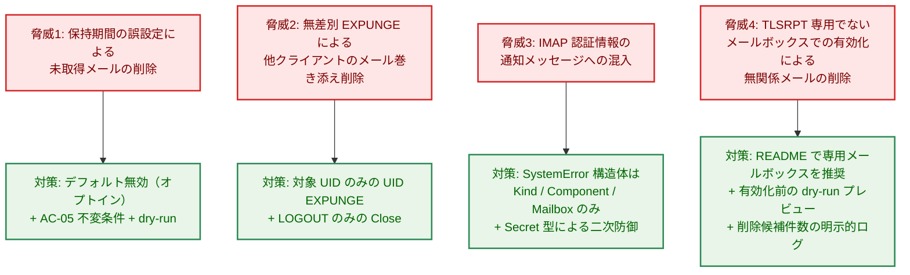

矢印 A → B は「脅威 A を対策 B で緩和する」ことを表す。

**Legend**

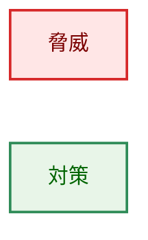

### 5.2 通知セキュリティ（notification_security.md 準拠）

- 通知ペイロードは既存の `notify.SystemError` 構造体（`Kind` / `Component` / `Mailbox` のみ）を使用し、生のエラー文字列・サーバー応答・認証情報を含めない（Principle 1: 型による制約）。本タスクで通知ペイロードの型は追加・変更しない。
- IMAP パスワードは引き続き `config.Secret` 型で保持し、誤ってログ出力されても `[REDACTED]` となる（二次防御）。
- UIDPLUS 非対応の警告や削除件数ログは Debug Logger（`slog`、標準エラー出力）にのみ出力し、Notifier 経路には流さない。

### 5.3 不可逆操作としての削除

UID EXPUNGE で削除されたメールの復旧可否はサーバーのゴミ箱実装に依存し、本設計では制御しない（要件の対象外）。削除前の安全弁は「デフォルト無効」「config 不変条件」「dry-run」の三段で構成する。

`DeleteOlderThan` は設定されたメールボックス内の保持期間を超えた**すべての**メールを削除する。TLSRPT レポートであるか否かによる絞り込みは要件で対象外と定められているため、個人・共用メールボックスに対して有効化すると無関係なメールも不可逆に削除される（§5.1 脅威 4）。README では TLSRPT 受信専用メールボックスの使用を推奨し、有効化前に `gc --dry-run` で削除候補件数を確認する手順を記載する（Phase 5）。

`UID STORE +FLAGS \Deleted` 成功後、`UID EXPUNGE` が失敗した場合（ネットワーク断・サーバータイムアウト等）、対象メールは `\Deleted` フラグが付与されたまま残る。次回 `gc` 実行時には UID SEARCH BEFORE が同じメールを再度検出し STORE/EXPUNGE を再試行するため自己修復するが、再試行までの間にこのメールボックスへ接続する**他クライアント**が無条件 `CLOSE`/`EXPUNGE` を発行すると、本来の保持期間に関わらず巻き添えで削除される可能性がある。これは「対象限定削除」の保証に対する残留リスクであり、TLSRPT 受信専用メールボックスの使用（上記）によって他クライアントの接続自体を排除することが実質的な緩和策となる。

---

## 6. 処理フロー詳細

### 6.1 gc サブコマンド全体フロー

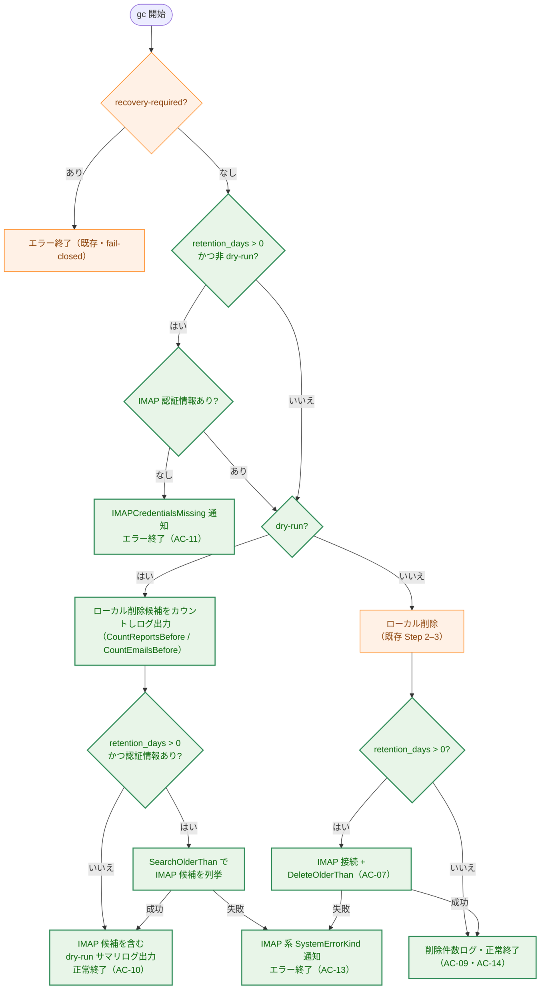

矢印 A → B は「処理 A の次に B へ進む（ラベルは分岐条件）」ことを表す。

**Legend**

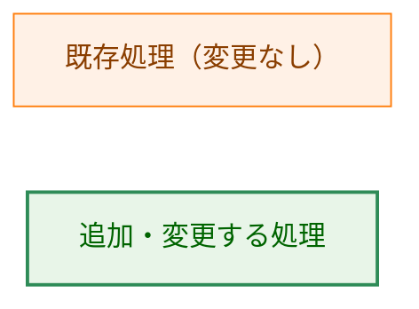

IMAP 削除ステップはローカル削除の後に置く。IMAP サーバーがダウンしていてもローカルの GC は完了し（その後エラー終了して通知される）、再実行はすべてのステップが冪等であるため安全である。

### 6.2 DeleteOlderThan の内部フロー

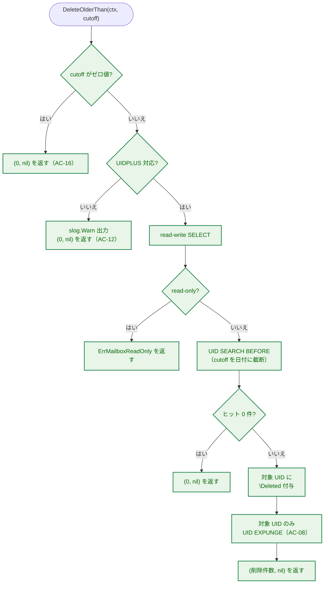

矢印 A → B は「処理 A の次に B へ進む（ラベルは分岐条件）」ことを表す。

**Legend**

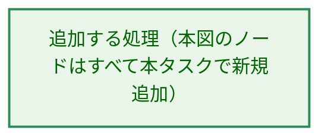

---

## 7. テスト戦略

### 7.1 単体テスト

| 対象 | テスト内容 | 関連 AC |
|---|---|---|
| `internal/config` | デフォルト `0`、`0` で無効、負値でエラー、不変条件違反でエラー、`fetch_days` / `window_days` との境界値（等しい場合は許可）、エラー型を `errors.Is` で判別。 | AC-01〜AC-06 |
| `internal/imap`（`fakeSession` 使用） | `DeleteOlderThan` が正しい BEFORE 条件で検索し対象 UID のみ STORE + UID EXPUNGE すること、cutoff ゼロ値で `(0, nil)`、UIDPLUS 非対応で警告のみ、read-only 時に `ErrMailboxReadOnly`、`SearchOlderThan` が EXAMINE のみで状態を変更しないこと。 | AC-08, AC-12, AC-15, AC-16 |
| `internal/imap/testutil` | `FakeMailFetcher` の呼び出し記録（cutoff 値）。 | AC-17 |
| `internal/store` | `CountReportsBefore` / `CountEmailsBefore` が対応する Delete と同一件数を返すこと、読み取り専用ストアで動作すること。 | AC-10 |

### 7.2 統合 / サブコマンドテスト

| 対象 | テスト内容 | 関連 AC |
|---|---|---|
| `cmd/tlsrpt-digest`（gc） | 有効時に正しいカットオフで `DeleteOlderThan` を呼ぶこと、`retention_days = 0` で `newMailFetcher` が呼ばれないこと、dry-run で削除メソッドが一切呼ばれず件数ログが出ること、認証情報欠落時の通知とエラー終了、IMAP エラー時の SystemErrorKind 分類、削除件数の統合ログ。`FakeMailFetcher` / `FakeStore` / `SpyNotifier` の既存パターンを流用する。 | AC-07, AC-09〜AC-11, AC-13, AC-14 |
| `cmd/tlsrpt-digest`（main） | `gc --dry-run` が受理されること（既存の拒否テストから `gc` を許可側へ移動）。 | AC-10 |
| greenmail 統合テスト（`//go:build integration`） | greenmail が UIDPLUS 対応の場合: 実サーバーに対する削除の end-to-end 検証。非対応の場合: AC-12 フォールバック経路の検証のみとし、その旨を実装計画に記録する。 | AC-07, AC-08, AC-12 |

### 7.3 セキュリティテスト

- IMAP エラー通知のペイロードに生のエラー文字列・認証情報が含まれないこと（`SpyNotifier` で `SystemError` のフィールドを検証する）。
- dry-run で Slack HTTP 送信・ストア書き込み・IMAP の状態変更（SELECT read-write / STORE / EXPUNGE）が発生しないこと。

---

## 8. 実装の優先順位

| フェーズ | 内容 | 完了条件 |
|---|---|---|
| Phase 1 | config 拡張（型・デフォルト・バリデーション・エラー型・テスト）。 | AC-01〜AC-06 のテストが通る。 |
| Phase 2 | `internal/imap` 拡張（依存追加・`imapSession` 拡張・`DeleteOlderThan` / `SearchOlderThan` 実装・`FakeMailFetcher` 更新・greenmail の UIDPLUS 対応確認）。 | AC-08, AC-12, AC-15〜AC-17 のテストが通る。greenmail の CAPABILITY 確認結果が実装計画に記録される。 |
| Phase 3 | `internal/store` のカウントメソッド追加。 | AC-10 のストア側テストが通る。 |
| Phase 4 | gc サブコマンド統合（IMAP 削除ステップ・dry-run・認証情報・エラー分類・main.go の dry-run 許可・既存テスト更新）。 | AC-07, AC-09〜AC-11, AC-13, AC-14 のテストが通る。 |
| Phase 5 | ドキュメント（config.toml 例・README・必要に応じ package_reference）と Gmail での手動検証。 | README に次の 4 点が記載される: オプトイン手順と有効化時の挙動（IMAP 認証情報が必要になること）、TLSRPT 受信専用メールボックスの推奨（§5.1 脅威 4）、Gmail の「完全に削除する」設定が前提条件であること（§3.3）、`fetch --since` を `retention_days` 以下にする注意（§3.1）。実 Gmail アカウントでの削除動作（ストレージ解放）の手動検証結果が実装計画に記録される。 |

Phase 1〜3 は互いに独立しており並行可能である。Phase 4 は全フェーズに依存する。

---

## 9. 将来の拡張性

- **削除対象の絞り込み**: 現在は期間のみで判定するが、`\Seen` 済み・ローカル保存済みに限定する絞り込みが将来必要になった場合、`DeleteOlderThan` の検索条件を拡張する形で対応できる（インターフェースのシグネチャ変更は cutoff の構造体化で吸収する選択肢がある）。
- **CLI フラグによる上書き**: `--imap-retention` のようなフラグが必要になった場合、既存の `--before` / `--max-email-age` と同じ `Duration` フラグパターンで追加できる。
- **他サブコマンドからの IMAP 削除**: `MailFetcher` のメソッドとして実装するため、将来 fetch 直後の削除（fetch-and-delete 運用）が必要になっても再利用できる。

---

## 付録 A: 設計判断の記録

> 本付録は設計時の判断理由を残すものであり、本文の現在形の記述とは独立している。経緯の詳細は git 履歴および PR #152 のレビュースレッドを参照。

### A.1 なぜ go-imap-uidplus 依存を追加するか

go-imap v1.2.1 コアの EXPUNGE / CLOSE はメールボックス全体の `\Deleted` に作用し、AC-08（巻き添え削除の禁止）を満たせない。UID EXPUNGE は RFC 4315（UIDPLUS）拡張であり、go-imap v1 では同一作者の拡張モジュールとして提供されている。自前で raw コマンドを実装する選択肢は、応答パースの再実装となり既存ライブラリの利用より保守コストが高いため採らない。

### A.2 なぜ Store にカウントメソッドを追加するか

AC-10 は dry-run で「削除予定の件数」のログ出力を要求するが、dry-run ではストアが読み取り専用で開かれるため Delete 系メソッドは使えない。既存の読み取り API では、レポートは `GetAllReports` で代用可能だが削除述語（date-range.end-datetime < cutoff）が cmd 層に重複し、.eml はカウント手段自体が存在しない（`LoadEmails` は全 .eml のパースを伴い過剰）。述語を store 内に保ったまま件数を得るため、Delete と対になる Count メソッドを追加する。

### A.3 なぜ SearchOlderThan を追加するか

AC-15 が `DeleteOlderThan` のシグネチャを削除専用に固定しているため、dry-run（AC-10）で副作用なしに IMAP 削除候補を列挙する手段が別途必要となる。検索ロジックは両メソッドで共有するため重複しない。詳細は §3.2 のブロッククォートを参照。

### A.4 認証情報チェックをローカル削除より前に置く理由

fetch のステップ順（接続前に認証情報を検証）に合わせ、設定不備を最初に顕在化させる。ローカル削除後に失敗すると「半分だけ成功した実行」が通知され、運用者が状況を把握しにくくなる。各ステップは冪等のため、修正後の再実行で完全な実行に収束する。
